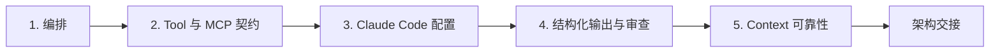

# 跨六种 Context 为同一个架构辩护

> 架构是一组边界，即使场景发生变化、Tool 失效且证据不完整，这些边界仍然成立。

**Type:** Build
**Languages:** Python
**Prerequisites:** [Multi-Agent 编排与委派](../../16-multi-agent-orchestration-and-delegation/), [Tool 契约、错误与渐进式发现](../../18-tool-contracts-errors-and-progressive-discovery/), [Claude Code Memory、规则、Skills 与 CI](../../19-claude-code-memory-rules-skills-and-ci/), [可靠提取、Batch 与独立审查者](../../20-reliable-extraction-batch-and-reviewers/), [让大型 Context 可观测](../../21-long-context-reliability-provenance-and-escalation/)
**Time:** 分两次专注学习，共约 6 小时

## 学习目标

- 为涵盖全部五个 CCAR-F 领域的架构选择进行辩护。
- 将一种决策方法适配到六种公开场景 Context，而不是死记一种拓扑结构。
- 为编排、Tools、Claude Code、结构化输出和 Context 可靠性实现确定性检查。
- 构建用于测试部分结果、过期状态、不安全 Tools 和无效输出的故障包。
- 制作一份可供审查者使用的架构包，其中包含明确的权衡和升级处理机制。

## 问题

一位架构师为六种预期用例准备了六张图。支持场景图使用 Agent 循环。代码场景图使用 Claude Code。研究场景图包含 subagents。提取场景图使用 JSON。

在审查期间，架构师无法解释为什么一个步骤使用 Tool，而另一个步骤使用 subagent。这些图遗漏了重试语义、配置作用域、部分结果、来源版本和人工权限。每项设计都只能在理想路径上运行。

基于场景的架构问题测试的是迁移能力。名称和业务细节会发生变化，但相同的决策会反复出现：

- 哪些顺序是确定性的，哪些选择需要 Model 推理？
- 每项关注点应由哪个 Context 负责？
- 哪些 Tools 可见、已获授权且可以重试？
- 共享的 Claude Code 指导应放在哪里？
- 类型化结果如何在语义和证据层面变得有效？
- 哪些状态能够跨越故障、压缩、恢复和人工交接而保留下来？

本综合项目将构建一种架构方法，并将其应用于全部六种公开 Context。

## 概念

### 六种 Context 是观察视角，而不是模板

2026 年 7 月发布的公开 CCAR-F 指南列出了以下场景 Context：

1. 客户支持解决 Agent。
2. 使用 Claude Code 生成代码。
3. Multi-Agent 研究。
4. 使用 Claude 提升开发者生产力。
5. 将 Claude Code 用于 CI/CD。
6. 结构化数据提取。

本课程不会复现考试场景。你将创建一个名为 Cedar Bridge 的原创系统，它是一家虚构的软件与服务公司。每个视角都会重点检验同一架构的不同部分。

| 视角 | Cedar Bridge 原创任务 | 需要重点应对的故障 |
|---|---|---|
| 支持 | 根据当前有效的政策和案例证据起草解决方案 | 未授权操作或过期政策 |
| 代码生成 | 修补 monorepo 中的请求解析器 | 作用域过大或缺少跨文件契约 |
| 研究 | 比较三种迁移方案 | 重复工作、冲突或来源不完整 |
| 开发者生产力 | 将已批准的决策转化为 ADR 和任务计划 | 过期的对话状态或隐藏的本地配置 |
| CI/CD | 从干净的 checkout 开始审查 pull request | 权限无边界或发现无法复现 |
| 提取 | 将变更通知规范化为记录 | schema 有效，但值是虚构的或缺少依据 |

你不需要六个平台各自独立。你需要一个核心架构，以及明确的变化点。

### 使用五道关卡组成的决策栈



#### 关卡 1：Agentic 架构与编排

定义任务、先决条件、Context 边界、允许使用的 Tools、完整或部分状态，以及合并规则。固定顺序使用代码，语义选择使用 Model 推理。使用 subagent 必须有明确理由：隔离、专业化、独立审查或安全并行。

在支持场景中，政策研究员和案例分析员可以在受理完成后独立工作。解决方案草案依赖两者。获准执行操作的执行者属于独立的权限边界，不是只读建议循环的一部分。

在研究场景中，按互不重叠的问题向外分派，并按声明 ID 汇总。在代码场景中，应使用清单和有边界的探索者，而不是让每个 Agent 负责整个 repository。

#### 关卡 2：Tool 设计与 MCP 集成

每个 Tool 都需要一个操作和对象、正向与负向选择指导、封闭 schema、权限作用域、副作用声明，以及结构化错误契约。写入 Tool 需要最新授权、幂等性和对账机制。

使用 MCP resources 提供 Context 数据，使用 Tools 执行由 Model 请求的操作，使用 prompts 提供用户调用的可复用模板。渐进式发现能够缩小目录规模，但必须保留访问作用域。

在 CI 中，只需提供读取、搜索和测试接口就应足以完成审查。不要仅仅因为工作流在 pipeline 中运行，就授予生产部署权限。

#### 关卡 3：Claude Code 配置与工作流

项目指导应简洁、受版本控制且可共享。将文件特定要求放入路径规则中。将可复用方法封装为 Skills，将明确的用户工作流封装为命令。使用 hooks 对作用域和命令实施确定性控制。

在大范围修改之前先制定计划。在隔离的只读 Context 中进行探索。CI 从干净的 commit 开始，使用已声明的设置、有边界的 Tools、结构化发现和确定性测试。它不会恢复交互式开发者会话。

#### 关卡 4：Prompt Engineering 与结构化输出

先定义 Evaluation 标准，再编写 Prompt。针对模糊判断使用边界示例。确保未知值能够被表示。在支持的情况下强制使用 schema，然后验证语法、schema、语义和溯源信息。

限制重试次数，并反馈最小但足够有用的验证错误。分离生成者和审查者的 Context。Batch 适合异步且相互独立的项目，不适合必须观察中间结果的自适应 Tool 循环。

#### 关卡 5：Context 管理与可靠性

清晰放置硬性约束和当前问题。检索包含来源元数据的最小相关证据片段。精简日志时不得删除故障或覆盖信息。将清单和副作用持久化到对话之外。传播完整、部分和阻塞状态。

置信度来自证据类别、覆盖范围、冲突、新颖性和实测错误。人工审查应根据后果和不确定性分层，并对普通通过项进行随机抽样。

### 架构质量体现在故障行为中

图表展示组件。场景包展示系统在压力下的行为：

- 一个来源在返回有效的部分结果后超时。
- Tool 返回不应盲目重试的冲突。
- subagent 违反其结果 schema。
- CI 收到 repository 中不存在的隐藏本地指令。
- 一条提取记录是有效 JSON，但引用了错误版本。
- 分支发生变化后，恢复的会话仍包含过期计划。
- 两项已批准政策发生冲突，但没有优先级规则。

对于每种故障，明确检测、遏制、重试或升级处理、持久状态和人工负责人。

## 构建它

## 交互式实验

```figure
31-architect-foundation-readiness
```

使用就绪度Matrix，跨六种场景视角测试全部五道架构关卡。更改一项 Tool、配置、验证或 Context 不变量，并观察哪些场景会被阻塞，而不是依赖单一拓扑结构。

## 实践实验

为每个架构领域运行一个故障 fixture，并写出能够修复该故障且不会削弱共享不变量的跨场景差异。

## 交付产物

架构包和填写完成的
[`outputs/demo-readiness-report.json`](../outputs/demo-readiness-report.json)
是实践产物。

## 验证它

使用以下命令复现报告并运行故障优先测试。本课程的测验将检查各项迁移决策。

## 综合项目衔接

完成的架构包、跨场景差异、ADRs 和独立审查共同构成 Architect Foundations 综合项目提交内容。

### 步骤 1：选择一个主要视角

选择一个 Cedar Bridge 视角，或将其替换为你自己的原创场景。填写：

```text
支持的决策：
用户和受影响人员：
输入来源和敏感性：
允许的操作：
禁止的操作：
延迟和数量：
故障后果：
人工权限：
```

不要从“使用 Multi-Agent 系统”开始。应从决策和边界开始。

### 步骤 2：完成架构包

复制 [`outputs/architecture-packet.md`](../outputs/architecture-packet.md)。填写每个领域章节。该架构包应包含：

- Context 和非目标。
- 任务依赖图和结果状态。
- 角色与 Tool capability matrix。
- 包含结构化错误的 Tool 和 MCP 契约。
- Claude Code 指令、规则、Skill、命令、hook 和 CI 决策。
- Prompt 契约、schema、验证器、重试限制和独立审查。
- Context 预算、清单、溯源信息、升级处理和人工审查。
- 威胁、替代方案、上线和恢复。

### 步骤 3：将架构包编码为 JSON

使用所附 Python 验证器演示的结构。该验证器有意检查架构不变量，而不是文字质量。

运行能够通过验证的示例：

```bash
cd certifications/claude/lessons/31-architect-foundations-scenario-capstone
python3 code/main.py
```

然后保存你的架构包并运行：

```bash
python3 code/main.py --input outputs/my-scenario.json
```

程序将检查：

- 必需章节和已识别的场景 Context。
- 唯一任务、已知先决条件、无环依赖关系和分布式 Tools。
- Tool 选择边界、结构化错误、授权和幂等性。
- 共享的 Claude Code 指导、有作用域的规则，以及基于全新状态的结构化 CI 审查。
- 四层验证、有边界的重试、未知状态和审查者分离。
- 溯源字段、结果状态、升级处理原因和分层审查。
- 完整的架构交接。

它无法证明 Model 始终能够正确选择、政策有效，或者人工负责人具备相应资格。请补充场景 Evaluation 和组织审查。

### 步骤 4：运行故障优先测试

运行：

```bash
python3 -m unittest discover -s code/tests -v
```

为每个领域至少创建一个额外 fixture：

| 领域 | 注入的故障 | 预期处置 |
|---|---|---|
| 编排 | 依赖循环或缺少部分状态 | 阻塞 |
| Tools 与 MCP | 写入 Tool 缺少幂等性 | 阻塞 |
| Claude Code | CI 继承交互式状态 | 阻塞 |
| 结构化输出 | schema 通过，但缺少溯源层 | 阻塞 |
| 可靠性 | 政策冲突没有升级处理路径 | 阻塞 |

不要为了让损坏的架构包通过而削弱验证器。应修复设计，或者解释该不变量为何不适用，并使用等效控制替代它。

### 步骤 5：迁移到全部六个视角

为其余每种 Context 各写一页差异说明：

```text
保持不变的内容：
新的来源或权限边界：
新的 Tool 或 MCP 要求：
新的 Claude Code 配置要求：
新的验证或输出要求：
新的 Context 或升级处理风险：
移除的控制及原因：
添加的控制及原因：
```

有效变更示例：

- 支持场景增加政策时效性检查，以及退款执行前的审批。
- 代码生成增加 repository 作用域、路径规则和测试。
- 研究增加声明级合并和来源冲突保留。
- 开发者生产力增加简洁的项目 Memory 层级和明确命令。
- CI/CD 增加基于干净状态的 headless 审查和只读权限。
- 提取增加可为 null 的未知值、证据范围和 Batch 对账。

有关溯源、错误、有边界权限和验证的核心要求应在每个视角中保持成立。

### 步骤 6：为权衡辩护

编写三份架构决策记录：

1. 单个 Agent 与协调器加 subagents 的对比。
2. 直接 Tool 目录与 MCP 加渐进式发现的对比。
3. 交互式处理与异步 Batch 的对比。

每份记录都应包含 Context、所选方案、被拒绝的替代方案、后果、证据、变更触发条件和负责人。ADR 不是产品偏好说明。它解释了为什么该选择适合当前场景。

### 步骤 7：开展独立审查

向一名全新的审查者提供架构包、验证器输出、威胁 fixtures 和 rubric。不要向其提供带有说服倾向的设计对话记录。要求审查发现包含稳定 ID、受影响领域、证据、严重程度和必要修正。

随后，架构师应使用证据解决或驳回每项发现。再次运行确定性验证，并保留最终交接内容。

## 使用它

### 考试场景方法

阅读场景时：

1. 写下后果、证据和权限边界。
2. 在选择 Agents 之前画出确定性先决条件。
3. 为每个角色提供最小的 Tool 范围。
4. 将共享配置与用户本地 Context 分开。
5. 区分结构有效性、语义有效性和溯源有效性。
6. 传播部分工作，并对不可重试的缺口进行升级处理。
7. 优先选择能够保留每项必要不变量的最小架构。

不要因为某个选项提到了更多 Claude 功能就选择它。应选择能够修复指定故障且不会引入更大故障的控制措施。

### 提交证据

完整的综合项目包含：

- 一份完成的主要架构包。
- 一份有效的 JSON 架构包和验证器输出。
- 五页跨场景差异说明。
- 至少五个新增故障 fixtures，每个领域一个。
- 三份包含被拒绝替代方案的 ADRs。
- 独立审查者的发现和处置结果。
- 通过测试的输出。
- 一份残余风险和人工责任归属声明。

### 常见陷阱

- **拓扑优先：** 在确定要求和依赖关系之前选择 Agents。
- **将 subagent 当作函数：** 为确定性工具函数分配不必要的推理 Context。
- **将 Tool 描述当作授权：** 使用自然语言替代服务端强制控制。
- **将个人配置当作团队政策：** CI 和协作者无法复现行为。
- **将 schema 当作事实：** 缺乏依据的值通过类型检查。
- **将恢复会话当作故障恢复：** 使用过期对话替代外部状态对账。
- **每个场景名称对应一种设计：** 共享架构原则始终无法迁移。
- **将功能密度当作成熟度：** 额外组件增加成本，却没有封闭任何故障路径。

### 练习

1. 从设计中移除一个 subagent，并判断质量是否发生变化。
2. 当 Model 只需要 Context 时，将一个操作 Tool 替换为 MCP resource。
3. 将一条全局指令移入经过测试的路径规则。
4. 添加一个能够捕获 schema 有效但声明错误的语义验证器。
5. 将长会话压缩为恢复包，并证明外部状态仍是权威来源。
6. 与另一位学习者交换架构包，并运行彼此的故障 fixtures。

## 关键术语

- **场景视角：** 用于检验共享架构决策的业务 Context。
- **变化点：** 预期随场景变化，而核心不变量保持不变的组件或政策。
- **Capability matrix：** 角色与获准使用的 Tools、数据和操作之间的映射。
- **架构不变量：** 必须跨组件和故障保持成立的条件。
- **故障 fixture：** 用于证明检测和恢复行为的受控场景。
- **跨场景差异：** 将一种架构适配到另一种 Context 所需的明确变更。
- **残余风险：** 实施控制后仍然存在，且已明确负责人和处置方式的已知风险。
- **架构交接：** 为安全实施所需的决策、证据、控制、缺口和后续责任归属包。

## 延伸阅读

- [Claude Certified Architect Foundations 考试指南](https://everpath-course-content.s3-accelerate.amazonaws.com/instructor%2F6nizmqk8tpzpfjvt6qmmav7rh%2Fpublic%2F1783542750%2FClaude+Certified+Architect+%E2%80%93+Foundations+Exam+Guide.pdf)
- [Anthropic：构建高效 Agents](https://www.anthropic.com/research/building-effective-agents)
- [Anthropic：Claude Agent SDK](https://platform.claude.com/docs/en/agent-sdk/overview)
- [Anthropic：Tool 使用](https://platform.claude.com/docs/en/agents-and-tools/tool-use/overview)
- [Model Context Protocol 规范](https://modelcontextprotocol.io/specification/latest)
- [Anthropic：结构化输出](https://platform.claude.com/docs/en/build-with-claude/structured-outputs)
- [AI Engineering from Scratch：编排模式](../../../../../phases/14-agent-engineering/28-orchestration-patterns/)
- [AI Engineering from Scratch：持久化执行](../../../../../phases/15-autonomous-systems/12-durable-execution/)
- [AI Engineering from Scratch：审查 Agent](../../../../../phases/14-agent-engineering/39-reviewer-agent/)

Agent SDK、Claude Code、API、MCP、Context、Model 和 Batch 的行为可能发生变化。公开蓝图和参考资料已于 2026-08-08 核验。在确定实现细节之前，请核验当前官方文档和实际 runtime。
