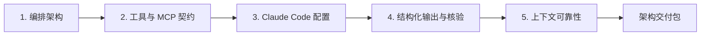

# 在六大业务场景中捍卫同一套系统架构 (Defend One Architecture Across Six Contexts)

> 所谓架构，就是当业务场景瞬息万变、下游工具发生故障、输入证据残缺不全时，依然能够稳固生效的一套工程边界集合。

**Type:** Build
**Languages:** Python
**Prerequisites:** [Multi-Agent Orchestration and Delegation](../../16-multi-agent-orchestration-and-delegation/), [Tool Contracts, Errors, and Progressive Discovery](../../18-tool-contracts-errors-and-progressive-discovery/), [Claude Code Memory, Rules, Skills, and CI](../../19-claude-code-memory-rules-skills-and-ci/), [Reliable Extraction, Batch, and Independent Reviewers](../../20-reliable-extraction-batch-and-reviewers/), [Make Large Context Observable](../../21-long-context-reliability-provenance-and-escalation/)
**Time:** ~6 hours across two focused sessions

## 学习目标

- 在 Claude Certified Architect Foundations（CCAR-F）认证涵盖的全部五个核心领域中，从容自辩架构选型
- 将同一套通用架构决策方法灵活适配至官方考纲涵盖的六大典型业务场景，杜绝死记硬背单一拓扑
- 编写确定性 Python 校验工具，硬性核验任务编排、工具集成、Claude Code 规范、结构化输出及上下文可靠性
- 构建全覆盖的故障测试数据包，深度压测部分结果返回、状态陈旧、非安全工具调用与输出破损等极端异常
- 产出达到同行评审级别的完整架构交付方案，明确阐释技术权衡代价与人工升级机制

## 问题背景

一位架构师为六个预期的业务场景准备了六套各不相同的架构图：智能客服采用 Agent Loop 循环，代码生成采用 Claude Code，深度研究采用 Subagent 多智能体集群，信息提取则采用 JSON 结构化流。

然而在方案答辩现场，该架构师无法自圆其说：为什么在某一步骤采用的是工具调用，而在另一步骤却启动了 Subagent？这些架构图通篇遗漏了重试退避语义、配置作用域划分、部分成功结果的处理机制、源数据版本管理以及人类法定审批权限。每套方案都只在完美理想路径（Happy path）下才能跑通。

基于场景的架构能力考核，本质上考查的是**技术迁移能力**。尽管具体的业务术语与企业背景千变万化，底层的核心架构抉择却高度相通：

- 哪些环节应当由确定性代码把控，哪些决策才真正需要大模型的语义推理？
- 各个关注点（Concerns）应当由哪一个上下文边界具体持有？
- 哪些工具应当可见、如何授权、失败后是否允许重试？
- 团队共享的 Claude Code 治理规范应当存放于何处？
- 一个类型格式正确的返回结果，如何在语义层面与证据链层面确证其真实有效？
- 当遭遇故障崩溃、上下文压缩、会话恢复或人机交接时，哪些状态必须跨周期持久化存活？

本毕业设计旨在打磨一套统一的底层架构方法论，并将其无缝贯穿应用于官方认证大纲中的六大典型场景。

## 核心概念

### 六大场景是审视架构的透镜，而非僵化模板

2026 年 7 月生效的官方 CCAR-F 大纲明确指出了六大场景切片：

1. 智能客服问题解决 Agent (Customer support resolution agent)
2. 基于 Claude Code 的代码生成与重构 (Code generation with Claude Code)
3. 多智能体深度研究与综述 (Multi-agent research)
4. 基于 Claude 的开发者日常效能提升 (Developer productivity with Claude)
5. 面向 CI/CD 流水线的 Claude Code 自动化 (Claude Code for CI/CD)
6. 复杂结构化数据提取与对账 (Structured data extraction)

我们绝不押题或死背考题。我们将围绕 Cedar Bridge（一家拥有多元软件与专业服务业务的模拟企业）构建一套真实的统一系统架构。这六大场景切片如同六具不同焦距的“透镜”，各自聚焦压测该核心架构的不同侧面。

| 场景透镜 | Cedar Bridge 真实业务任务 | 架构重点防御的根本故障 |
|---|---|---|
| 智能客服 (Support) | 依据当前生效政策与工单证据起草处置方案 | 越权执行非安全写操作或依据陈旧政策决策 |
| 代码生成 (Code generation) | 在超大 Monorepo 单体仓库中修复请求解析器缺陷 | 越界误伤无关联代码或缺失跨文件接口契约 |
| 深度研究 (Research) | 横向深度对比三种系统架构迁移方案 | 重复执行冗余搜索、事实冲突被掩盖或局部源缺失 |
| 开发者效能 (Developer productivity) | 将高管团队通过的决议拆解为 ADR 与工程任务计划 | 会话上下文状态陈旧或暗中依赖本地私有未提交配置 |
| CI/CD 自动化 (CI/CD) | 在纯净拉取的代码分支上自主审查 Pull Request | 权限未受限越权访问或产生不可复现的玄学审查结论 |
| 结构化提取 (Extraction) | 将供应商发布的各类服务变更通告规范化录入系统 | Schema 结构校验通过但关键数值纯属捏造或无证据支撑 |

你不需要为六个场景搭建六个完全脱节的平台。你需要的是一个高度健壮的架构内核，加上清晰规范的差异化变异点（Variation Points）。

### 采用五道准入门禁的决策技术栈


```mermaid
flowchart LR
    A["1. 编排架构"] --> B["2. 工具与 MCP 契约"]
    B --> C["3. Claude Code 配置"]
    C --> D["4. 结构化输出与核验"]
    D --> E["5. 上下文可靠性"]
    E --> F["架构交付包"]
```

#### 门禁 1：智能体架构与多 Agent 编排 (Agentic architecture and orchestration)

清晰定义原子任务、前置依赖、上下文物理隔离边界、允许调用的工具子集、部分完成（Partial）状态与聚合合并规则。使用确定性代码固化执行顺序，将模型推理严格限制在真正的语义决策节点。派生 Subagent 必须具备充分的正当性理由：隔离庞大上下文、领域高度专业化、提供独立的交叉复核视角，或安全执行并发操作。

在客服场景中，政策检索专员与工单分析专员在完成分拣后可以完全并行独立运行，最终的解决方案草案依赖于两者的共同输入；而最终批准执行退款的执行器则是一个拥有独立授权边界的物理端点，绝不能混入只读建议循环中。

在深度研究场景中，按相互独立的子问题进行扇出（Fan-out），随后基于论点 ID 进行扇入聚合（Fan-in）；在代码生成场景中，必须依赖架构清单与受限的探索工具，绝不能向每个 Agent 盲目塞入整个代码仓库。

#### 门禁 2：工具设计与 MCP 协议集成 (Tool design and MCP integration)

每一个工具必须严格遵循“单一动作 + 单一操作对象”原则，提供清晰的正向与反向挑选引导、封闭的参数 Schema、明确的权限 Scope 声明、副作用发生情况标识，以及类型完备的结构化错误契约。任何具有写操作副作用的工具，均须要求携带最新授权凭据、支持幂等重试并包含事后对账机制。

规范使用 MCP 核心原语：使用 Resource 暴露只读上下文数据，使用 Tool 承载模型触发的操作，使用 Prompt 封装可供人类用户调用的标准化模板。渐进式发现机制能有效压减工具列表体量，但绝不能突破调用主体的身份鉴权边界。

在 CI/CD 流水线中，审查 Agent 仅需读取、搜索与执行本地测试的工具权限，绝不能仅仅因为流水线运行在特权服务器上就滥发生产部署凭据。

#### 门禁 3：Claude Code 配置与工程工作流 (Claude Code configuration and workflows)

团队共享的 Claude Code 指引必须精炼、具备版本控制并在代码库中全局受控。将特定目录或文件的专属约束写入 Path Rules（路径规则）；将可复用的工程方法沉淀为标准化 Skills；将标准开发工作流固化为显式 Slash Commands 命令；利用 Hooks 钩子实现确定性的作用域检查与高危命令拦截。

在大规模修改代码前，必须先生成架构变更计划；在只读沙箱环境中进行代码探索；CI 流水线必须从干净的 Commit 检出代码启动，携带预设的受限配置、受限工具、结构化评审输出与确定性测试套件，坚决杜绝直接恢复继承开发者本地未提交的交互式长会话。

#### 门禁 4：Prompt 提示词工程与结构化输出 (Prompt engineering and structured output)

在推敲 Prompt 措辞之前，首先明确质量评测的客观准则。在提示词中提供边界用例少样本示例（Few-shot）以规范模棱两可的主观判断；显式允许输出未知或缺失状态（如 `null`）。尽可能使用原生结构化输出能力，随后在本地代码中执行语法、Schema、业务语义与证据支撑度的四重严格校验。

设定重试次数硬上限，每次重试仅回传最简短关键的局部校验报错信息。严格分离内容生成器与结果复审员的上下文；异步消息批处理（Batch）非常适合独立且无依赖的海量离线单据，绝不适用于需要动态观察中间结果并做出适应性调整的交互式 Tool Loop 工具循环。

#### 门禁 5：上下文管理与系统长效可靠性 (Context management and reliability)

在 Prompt 结构中，将硬性系统约束与当前用户问题置于醒目突出的固定位置。仅检索并注入与当前任务直接相关的最小证据切片，并始终伴随完整的源元数据。精简清理长会话历史时，必须保留故障拦截记录与覆盖范围，严禁掩盖错误。将状态清单（Manifest）与真实副作用状态持久化在会话上下文之外。在链路中明确传递完全成功、部分完成（Partial）与受阻中断（Blocked）三种离散状态。

系统置信度必须基于证据等级、覆盖范围、是否存在事实冲突、信息新鲜度以及可量化的历史报错率来综合评估。人机协同复审机制应依据业务后果严重度与置信度进行分层抽检，并辅以对普通达标用例的常规底线随机抽检。

### 架构质量真正体现在极限故障处置中

一张拓扑图仅仅展示了系统有哪些静态组件；而真正的场景化设计考验的是系统在极端逆境下的确定性工程表现：

- 某个上游数据源在返回了部分有效数据后突然发生超时中断
- 某个工具返回了状态冲突错误，而上层系统盲目发起无意义的重试
- 某个派生的 Subagent 返回了破坏 Schema 规范的非法响应
- CI 自动化流水线意外读取到了开发者机器上未提交的本地私有配置
- 信息提取模块输出了格式完全合法的 JSON，但引用标注的却是已被废弃的旧版本政策
- 恢复历史会话后，发现分支已被切换，上下文中的实施计划已然全盘过时
- 检索到两份同时生效但彼此相互矛盾的内部官方规章，且缺乏明确的仲裁优先级

面对上述任何一类突发故障，合格的架构方案必须明确指明：系统如何在第一时间捕获异常、如何有效遏制故障扩散、如何安全重试或优雅升级转派、哪些状态被确定性落盘持久化，以及谁是对该异常负最终责任的人类主管。

## Build It (动手构建)

## Interactive Lab (交互式实验)

```figure
31-architect-foundation-readiness
```

使用上述架构就绪度矩阵，跨越全部六大业务透镜，系统性检验五道架构门禁的健壮度。尝试随意篡改工具契约、配置规范、校验规则或上下文不变量中的任何一项，直观观察到底是哪些业务场景会遭遇一票否决阻断，而不是盲目为每个场景生搬硬套互不兼容的拓扑。

## Practice Lab (实战演练)

针对每一个架构领域分别运行随附的确定性故障固件（Fixture），并为该场景编写跨业务透镜的架构补丁，在绝不削弱全局通用不变量的前提下彻底修复该故障。

## Shipped Artifact (交付产物)

随课程交付的架构设计数据包模版以及填充完整的
[`outputs/demo-readiness-report.json`](../outputs/demo-readiness-report.json)
构成了本项目的核心可复用工程交付成果。

## Verify It (验证方法)

使用以下命令运行确定性校验脚本并跑通全量故障在先测试：

```bash
cd certifications/claude/lessons/31-architect-foundations-scenario-capstone
python3 code/main.py
python3 -m unittest discover -s code/tests -v
```

课后配备的 6 道认证自测题将重点考核你在不同业务语境下自如迁移架构设计原则的综合决断力。

## Capstone Connection (项目连接)

填充完整的核心架构方案、跨场景差异化补丁文档（Deltas）、3 份 ADR 决策记录以及同行独立评审报告，共同构成了 Claude Certified Architect Foundations 认证的核心毕业申报材料。

### 步骤 1：确立首选核心透镜

从 Cedar Bridge 的六大业务中挑选一个作为你的主攻场景（或替换为你自己业务中的真实场景），明确界定：

```text
所支撑的核心业务决策:
直接使用人员与潜在受影响人员:
输入数据源清单及其对应敏感度等级:
严格允许执行的系统操作:
明令禁止的越权高危操作:
端到端延迟预算与并发吞吐量目标:
发生系统故障时的潜在业务破坏后果:
最终承担法定签字责任的人类主管:
```

切勿一上来就脱口而出“采用多 Agent 系统”。必须首先理清业务决策边界与客观约束。

### 步骤 2：完善架构设计数据包

复制 [`outputs/architecture-packet.md`](../outputs/architecture-packet.md)，逐一填充全部五大领域的架构决策：

- 业务上下文环境与严格划定的非目标（Non-goals）
- 细粒度任务依赖拓扑图与执行结果状态机定义
- 角色与工具权限访问控制矩阵（Capability Matrix）
- 包含结构化错误分类的工具及 MCP 接口契约
- Claude Code 提示词指引、路径规则、Skills 技能、自定义命令、Hooks 钩子与 CI 流水线架构
- Prompt 分阶段契约、数据 Schema、四层校验器、重试上限与独立复审员机制
- 上下文预算控制、状态清单、溯源证据链、自动转派规则与分层人机复核规范
- 威胁建模分析、被否决的备选方案、生产灰度计划与灾难恢复 Runbook

### 步骤 3：将数据包编码为标准 JSON

将上述架构决策提取并序列化为符合配套 Python 校验器要求的标准 JSON 对象。该校验器旨在以纯代码的刚性方式核验架构不变式，杜绝任何文字修饰的蒙混过关。

运行通过基线测试：

```bash
cd certifications/claude/lessons/31-architect-foundations-scenario-capstone
python3 code/main.py
```

随后，加载你自定义编写的场景数据包并执行校验：

```bash
python3 code/main.py --input outputs/my-scenario.json
```

校验程序将执行严密的确定性断言：

- 必需段落完整性及是否属于受支持的场景上下文
- 任务命名唯一性、前置条件明确性、依赖拓扑无环性（Acyclic）及工具权限分散性
- 工具挑选防呆边界、结构化错误抛出、写操作授权凭据与幂等性保障
- 团队共享的 Claude Code 治理规范、路径规则隔离及纯净独立的 CI 审查流程
- 语法/Schema/语义/溯源四层校验完备性、有限重试、未知状态表示及复审员隔离
- 溯源字段完整度、离散完成状态流转、不可重试异常转派理由及分层复核设计
- 具备明确责任人与落地证据的完整交接闭环

该工具无法在物理上保证模型永远不会发生工具挑选失误，也无法验证企业内部规章的道德正确性，更无法评估人类主管是否足够称职。这些维度的保障需要依赖端到端的场景化离线评估与制度建设。

### 步骤 4：运行故障在先（Failure-first）测试套件

执行全量单元测试：

```bash
python3 -m unittest discover -s code/tests -v
```

针对五大领域，分别设计并注入至少一组故意破坏架构不变式的故障固件：

| 架构领域 | 故意注入的架构缺陷 | 校验器预期判定 |
|---|---|---|
| 任务编排 | 引入循环依赖死锁或丢失部分完成（Partial）状态 | 坚决阻断 (Block) |
| 工具与 MCP | 写操作工具缺失幂等性保障机制 | 坚决阻断 (Block) |
| Claude Code | CI 流水线直接继承开发者本地交互式未提交状态 | 坚决阻断 (Block) |
| 结构化输出 | Schema 校验虽然通过，但完全缺失证据链溯源校验层 | 坚决阻断 (Block) |
| 运行可靠性 | 面对多源事实冲突，完全未设计人工转派仲裁通路 | 坚决阻断 (Block) |

绝不允许为了让测试变绿而削弱校验器的断言规则。必须在架构设计层面进行针对性根因修复，或者在有理有据的前提下阐述该规则不适用的特殊理由并引入等效的安全补偿控制。

### 步骤 5：横向迁移映射至全部六大透镜

针对其余五个场景透镜，分别撰写一份单页纸的架构差异化调整补丁（Delta Document）：

```text
在底层保持完全不变的核心架构基石:
该场景引入的全新数据源或全新审批权限边界:
针对工具集或 MCP 协议提出的全新适配要求:
针对 Claude Code 配置策略提出的专项约束:
输出结果格式与校验防线上的针对性变化:
该场景特有的上下文膨胀与异常转派风险点:
在该场景中主动剔除的冗余控制措施及其充分技术理由:
在该场景中针对性新增的安全强化措施及其充分技术理由:
```

优秀的差异化演进示例：

- **智能客服**：新增知识库时效性校验门禁，在真正执行退款写操作前强制注入人工审批流。
- **代码生成**：严格划定操作目录的作用域白名单，引入精细化路径规则并挂载自动化测试套件。
- **深度研究**：引入基于论点 ID 的多路聚合机制，在存在事实争议时显式保留多方证据冲突。
- **开发者效能**：建立清晰分层的项目全局记忆体系，封装规范统一的工程操作 Slash Commands。
- **CI/CD 自动化**：建立基于全新干净分支启动的无头（Headless）审查流程，严格回收一切写操作权限。
- **结构化提取**：在数据模式中显式允许未知字段填报 `null`，绑定精确文本切片引用，并接入批量异步对账流水线。

全链路溯源、结构化错误分类、最小权限原则与终态验证这四大核心不变式，必须完好无损地贯穿所有六个场景。

### 步骤 6：深入自辩核心技术选型权衡

撰写三份标准的架构决策记录（ADR）：

1. **单 Agent 循环 VS 顶层协调者配属 Subagent 集群**：剖析复杂度与可靠性权衡。
2. **本地直接代码工具 VS 部署标准 MCP 服务与渐进式发现**：剖析互操作性与网络治理成本。
3. **在线实时流式交互 VS 离线无状态异步批量处理（Batch）**：剖析响应体验与吞吐成本。

每份 ADR 必须完备包含背景脉络、选定方案、**被坚决否决的备选方案**、引入的技术后果、量化实测证据、架构逆转触发条件以及责任人签名。ADR 绝不是个人技术喜好的宣泄，它必须充分证明该决策对于当前特定业务场景的无可替代性。

### 步骤 7：组织独立的同行复审

将完善后的架构数据包、校验工具终端日志、威胁场景靶场及评分准则，移交给另一位独立的技术伙伴进行交叉复核。请勿向其提供带有个人倾向的推销性解释。要求复审人员出具带有固定编号、标明受影响领域、附带客观事实证据、明确危害严重度等级并给出整改意见的正式审计发现清单。

架构师必须针对审查清单中的每一条缺陷，凭借技术证据逐一给出修复证明或进行有理有据的技术抗辩；随后重新跑通确定性校验器，固化保存最终的交接验收数据包。

## Use It (生产应用)

### 认证场景推演方法论

在考场或评审答辩中面对复杂业务题干时，请遵循以下系统推导法则：

1. 首先精准找出题干中潜藏的业务危害后果、事实证据来源与法定签字权限边界。
2. 在挑选 Agent 角色之前，先用确定性思维画出各任务之间的硬性依赖前置条件。
3. 严格收紧每一个业务角色的工具访问面，践行最小权限。
4. 将团队全局规范与开发者个人本地偏好在配置层清晰剥离。
5. 明确区分“结构格式正确”与“业务语义正确及证据真实”两个截然不同的验证层次。
6. 科学传递部分完成（Partial）的工作成果，对不可重试的致命缺陷坚决触发人工转派。
7. 坚定奉行奥卡姆剃刀原则：优先选择能够完备捍卫全部核心不变式的最简技术拓扑。

切勿仅仅因为某个选项罗列了更多新潮的 Claude 概念就盲目挑选它。最优秀的答案永远是那个能够精准修复题干中点名的特定系统隐患、且绝不凭空引入更大安全漏洞的技术方案。

### 最终提报证据清单

一份完备的 Capstone 毕业成果应当包含：

- 1 份针对首选核心场景的详尽架构设计白皮书
- 1 份合法达标的 JSON 格式化数据包及校验器终端跑通日志
- 5 份跨业务场景的架构差异化分析补丁报告（Deltas）
- 至少 5 组针对性编写的故障在先测试固件（覆盖五大领域）
- 3 份包含明确被否决备选方案的高质量 ADR 决策记录
- 独立的第三方同行评审专家审计报告及答辩整改闭环记录
- 全量本地单元测试套件 100% 绿灯通过的证据日志
- 1 份由法定业务主管正式签署的残余风险接纳与责任人声明

### 常见陷阱

- **拓扑先行 (Topology first)**：连业务需求和依赖关系都未理清，就草率断定必须使用某种复杂的 Agent 架构。
- **把确定性函数包装成 Subagent**：让普通的字符串格式化或数学计算去白白消耗昂贵的模型推理 Token。
- **把工具描述当成安全权限防火墙**：妄想靠自然语言提示词去取代底层的服务级鉴权拦截。
- **把个人私有配置当成团队通用规范**：导致流水线与协作团队完全无法复现相同的执行表现。
- **误以为通过 Schema 校验就代表数据绝对真实**：完全缺乏证据链支撑的捏造事实轻松穿透了格式检查。
- **滥用会话恢复代替真正的系统自愈**：依靠加载陈旧脏乱的历史长会话，反而掩盖了外部数据源的真实变化。
- **为每个场景各搞一套分裂的平台架构**：导致通用的系统工程设计经验完全无法在团队内复用传承。
- **用功能堆砌掩饰架构设计的贫乏**：引入大量不必要的组件，除了增加系统延迟和故障率之外毫无业务价值。

### 课后练习

1. 从你当前的设计中尝试剥离一个 Subagent，量化评测系统最终产出的准确率与响应耗时是否发生实质劣化。
2. 将一个纯操作类工具重构为一个 MCP Resource 资源，仅在模型需要参考背景时按需暴露。
3. 将一条全局散落的通用代码提示指令，收敛重构为一条仅在特定目录生效且具备测试用例的 Path Rule。
4. 编写一个语义层面的自定义校验器，成功拦截一条格式完全合法但内容属于事实捏造的业务断言。
5. 将一个超长交互会话提炼压缩为一个紧凑的恢复状态包，并证明底层外部数据库的权威状态依然完好保留。
6. 与另一位学员互换架构数据包，尝试使用自己编写的极端故障用例去攻击对方的系统并记录拦截表现。

## 核心术语 (Key Terms)

- **场景透镜 (Scenario lens)**：用于从特定业务维度对统一核心架构展开极限压力测试的典型业务情境。
- **变异点 (Variation point)**：在保持底层架构不变式绝对稳固的前提下，允许根据具体业务特性进行灵活定制的特定组件或策略。
- **能力矩阵 (Capability matrix)**：将系统内部各个角色、其允许调用的工具集、可见的数据范围与法定操作权限进行清晰界定的控制映射表。
- **架构不变式 (Architecture invariant)**：在跨越所有异构组件、直面任何极端故障时，系统都必须无条件坚守并强制维持的核心工程约束。
- **故障固件 (Failure fixture)**：用于可重复验证系统在遇到特定破坏性异常时能否准确感知并自愈的标准化测试数据集。
- **跨场景补丁 (Cross-scenario delta)**：记录如何将同一套通用架构平稳适配至另一全新业务场景的结构化增量变更说明。
- **残留风险 (Residual risk)**：在所有预设的技术控制措施全部正常生效后依然客观存在的系统风险，附带明确的接纳责任人。
- **架构交付包 (Architecture handoff)**：供工程开发、运维管理与业务多方实现安全无缝落地的成套决策、实测证据、契约及责任人档案集合。

## 延伸阅读 (Further Reading)

- [Claude Certified Architect Foundations Exam Guide](https://everpath-course-content.s3-accelerate.amazonaws.com/instructor%2F6nizmqk8tpzpfjvt6qmmav7rh%2Fpublic%2F1783542750%2FClaude+Certified+Architect+%E2%80%93+Foundations+Exam+Guide.pdf) 官方认证考试大纲指南
- [Anthropic: Building effective agents](https://www.anthropic.com/research/building-effective-agents) 掌握智能体架构模式的权威指南
- [Anthropic: Claude Agent SDK](https://platform.claude.com/docs/en/agent-sdk/overview) 官方 Agent SDK 架构与设计规范
- [Anthropic: Tool use](https://platform.claude.com/docs/en/agents-and-tools/tool-use/overview) 工具调用开发全景指南
- [Model Context Protocol specification](https://modelcontextprotocol.io/specification/latest) MCP 官方协议规范
- [Anthropic: Structured outputs](https://platform.claude.com/docs/en/build-with-claude/structured-outputs) 原生结构化输出开发指南
- [AI Engineering from Scratch: Orchestration Patterns](../../../../../phases/14-agent-engineering/28-orchestration-patterns/) 进阶多 Agent 编排模式
- [AI Engineering from Scratch: Durable Execution](../../../../../phases/15-autonomous-systems/12-durable-execution/) 持久化韧性执行架构
- [AI Engineering from Scratch: Reviewer Agent](../../../../../phases/14-agent-engineering/39-reviewer-agent/) 独立审查 Agent 设计模式

Agent SDK、Claude Code、底层的 API、MCP 规范、上下文机制、模型型号与批处理能力均会保持动态演进。本大纲及参考文献核实于 2026 年 8 月。在固化具体的工程实现细节前，请务必核实当前的官方最新规范与运行时环境。
