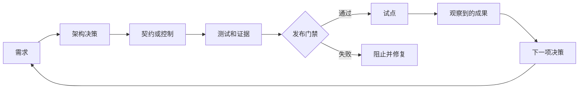

# Architect Professional 系统综合项目

> 构建能让生产架构经得起论证的证据包。

**Type:** Build
**Languages:** Python
**Prerequisites:** [选择能够承载工作的最小表面](../../01-claude-product-and-model-landscape/), [把能力用在失败代价高昂之处](../../02-model-selection-and-token-economics/), [将请求转化为可测试的契约](../../03-prompting-and-task-decomposition/), [将每项事实放入正确类型的 Context](../../04-context-knowledge-memory-and-caching/), [校验主张，而非置信度](../../05-output-evaluation-and-validation/), [用权限约束能力](../../06-governance-safety-and-responsible-use/), [Messages API 是状态机](../../08-messages-api-and-application-lifecycle/), [结构化输出是不可信的契约](../../09-structured-output-and-defensive-parsing/), [Tool 循环是受控委派](../../10-tool-use-and-agentic-loops/), [MCP 将能力与 Host 分离](../../11-mcp-server-design-and-integration/), [Agent SDK 是执行框架，而非权限](../../12-claude-agent-sdk-and-hooks/), [安全存在于 Prompt 之外](../../13-application-security-and-secrets/), [Evals 将 Agent 行为转化为工程证据](../../14-evals-testing-debugging-and-observability/), [Claude Code 通过共享约束实现规模化](../../15-claude-code-for-development-teams/), [多 Agent 编排与委派](../../16-multi-agent-orchestration-and-delegation/), [Tool 契约、错误与渐进式发现](../../18-tool-contracts-errors-and-progressive-discovery/), [业务发现、需求与 SLA](../../22-business-discovery-requirements-and-slas/), [端到端架构与价值权衡](../../23-end-to-end-architecture-and-value-tradeoffs/), [RAG、检索与数据 Pipeline](../../24-rag-retrieval-and-data-pipelines/), [集成协议、身份与最小权限](../../25-integration-protocols-identity-and-least-privilege/), [生产可观测性、延迟与成本](../../26-production-observability-latency-and-cost/), [企业治理、合规与人工审查](../../27-enterprise-governance-compliance-and-hitl/), [利益相关者沟通、ADR 与生命周期所有权](../../28-stakeholder-communication-adrs-and-lifecycle/)
**Time:** 约 8 到 12 小时

## 学习目标

- 为生产 Claude 系统交付从发现到运营的架构
- 为模式、Model、Context、RAG、集成和控制决策进行辩护
- 通过明确的门禁证明质量、延迟、成本、安全性和信息安全
- 打包治理、发布、runbook 和生命周期所有权
- 向管理层、工程、控制和运营受众阐述同一项决策

## 任务

为一家在多个地区运营的公司设计一个受治理的企业支持问题解决系统。

当前团队每周处理 40,000 个工单。账单和物流问题占据大部分工单量。首次响应时间中位数为 11 分钟。政策变更每周都会出现在文档和内部系统中。审查发现引用不一致，并且之前的一项自动化曾发放超出员工权限的退款。

拟议系统可以对工单进行 Classification、检索当前政策、读取有界的账户 Context、起草回复并建议操作。它不得删除账户。执行退款需要明确权限和重新取得的人工审批。公司期望采用分阶段发布、可衡量的质量、感知地区的数据处理方式，并将运营工作移交给支持平台团队。

你的任务不是最大化自主性，而是在约束条件下设计最佳系统，并证明它为何已就绪。

## 必需交付物

使用 `outputs/architecture-packet-template.md` 中的模板。你的资料包必须包含十项相互关联的产物。

### 1. 发现简报

定义成果、基线、目标、护栏、用户、当前工作流、数据、权限、假设和非目标。

至少应区分：

- 首次响应时间与总解决时间
- 系统完成与政策正确的任务成功
- 建议与执行权限
- 内部目标与合同承诺
- 已知事实与估算

### 2. 架构选项与 ADR

至少比较：

1. 由检索辅助起草并进行完整人工审查
2. 包含有界 Model 步骤的确定性工作流
3. 使用自适应 Tool 的 Agent

选择其中一种。记录证据、后果、被拒绝的替代方案和逆转条件。如果使用多个 Agent，应说明每个 Context 边界或独立审查者的合理性。组件更多并不会获得更多分数。

### 3. 端到端系统视图

为以下内容创建 Mermaid 图表：

- 系统 Context
- 数据和身份流
- 一条普通工单序列
- 一条高风险退款序列
- 部署和所有权
- 失败和部分结果路径

每条外部边都必须说明 schema、身份、超时、重试、证据和所有者。

### 4. Model、Prompt 与 Context 计划

定义任务类别以及各类任务的 Model 选择标准。包括质量、延迟、成本、Context 和思考要求。在没有验证日期的情况下，不要固化产品事实。

设计：

- system 指令与 user 指令的边界
- 在需要判断一致性的地方提供 few-shot 示例
- 稳定前缀和 Prompt 缓存计划
- Context 剪枝和压缩
- 结构化输出和语义校验
- Prompt 和 Model 版本控制

### 5. 知识与 RAG 设计

明确来源所有权、解析、分块形态、元数据、稀疏或稠密检索、过滤、重排序、Context 组装、来源追踪、来源冲突、新鲜度、版本激活和回滚。

创建包含正常、歧义、陈旧、未授权和对抗性案例的检索 Evaluation。分别衡量检索质量和答案质量。

### 6. 集成与身份设计

根据需求选择直接 API、CLI、MCP 或 Agent 间边界。在 Tool 发现、schema、凭据和操作中贯彻最小权限。

为退款设计重新取得的审批。将审批与主体、金额、账户、原因、过期时间和单次使用绑定。为校验、授权、冲突、速率限制、依赖项和超时定义结构化错误。

### 7. Evaluation 与生产证据

创建有代表性的黄金 Dataset 和混合方法 Evaluation 计划。

包括：

- 检索 recall 和新鲜度
- 主张支持度和引用覆盖率
- 政策遵循度和完整性
- Tool 和授权轨迹
- 防止不安全操作
- P50 和 P95 延迟
- 每项获接受任务的成本
- 审查者一致性和耗时
- 高风险以及地区或语言分层

比较基线与拟议系统。定义无法被平均值抵消的硬性门禁。

### 8. 治理与人工审查

产出风险登记表、数据地图、控制 Matrix、审查设计、公平性计划、可申诉路径、事件证据计划和重大变更触发条件。

说明哪些问题需要安全、隐私、法务、合规、财务或领域负责人审批。不要代表这些负责人声称符合法律要求。

### 9. 发布与运营

规划 shadow、canary、受控扩展、回滚、dashboard、警报、runbook、容量、依赖项失败和审查队列行为。

每条警报都需要所有者和处理操作。每个生产版本都需要一个已知安全的回滚版本。针对陈旧政策、授权服务中断、通过工单进行 Prompt injection 以及 evaluator 漂移开展桌面演练。

### 10. 利益相关者与移交资料包

准备：

- 一页式管理层决策简报
- 产品工作流和采用计划
- 工程契约索引
- 安全与隐私控制摘要
- 运营就绪和移交检查清单

接收团队必须在接受移交前证明其具备监控、安全关闭、回滚、Evaluation 和事件升级能力。

## 架构方法

在整个资料包中使用一条统一的证据链。



如果某个组件无法追溯到需求，应询问它是否必要。如果某项需求没有控制或测试，则架构不完整。如果某项测试不会产生发布后果，它就只是一份报告。

## 构建

## Interactive Lab

```figure
32-architect-professional-readiness
```

使用专业就绪看板，将需求连接到决策、控制、证据、发布门禁、试点成果和生命周期所有者。无论加权就绪分数如何，授权、安全和回滚方面的硬性失败都应保持可见。

## Practice Lab

让支持架构经历一项失败的需求、一个未经验证的硬性控制、一个失败的 Evaluation 门禁和一次回滚演练，并在每个问题所属的所有者边界处完成修复。

## Shipped Artifact

资料包模板、已完成的
[`outputs/reference-architecture-packet.md`](../outputs/reference-architecture-packet.md)、
已填写的 [`outputs/demo-readiness-report.json`](../outputs/demo-readiness-report.json)
以及 [`outputs/scored-rubric.md`](../outputs/scored-rubric.md) 是实践产出。评分后的参考实现仍不得投入生产，直到其指定的在线硬性门禁和移交证据通过为止。

## Verify It

Python 实验会校验架构资料包的结构。它不会判断你的业务决策是否正确。它能发现一类更基础的失败：缺少所有者、需求无法衡量、硬性控制未经验证、Evaluation 门禁失败、缺少回滚，以及决策没有逆转规则。

```bash
cd certifications/claude/lessons/32-architect-professional-system-capstone/code
python3 main.py
python3 -m unittest discover tests -v
```

### 第 1 步：编码需求

每个 `Requirement` 都具有类别、可测试陈述、可衡量性标记和所有者。在你的资料包中，用明确的度量契约替换该标记。

### 第 2 步：编码决策

每个 `Decision` 都会记录 Context、选择、被拒绝的选项、后果、逆转条件和所有者。没有替代方案的建议无法证明其作出了权衡判断。

### 第 3 步：编码控制

每个 `Control` 都会说明风险、类型、所有者、证据、验证状态，以及它是否属于硬性发布门禁。无论平均就绪度如何，硬性门禁失败都会阻止发布。

### 第 4 步：评估门禁

`EvaluationGate` 支持最小值、最大值和相等阈值。使用它处理质量、延迟、成本和零容忍控制结果。真实门禁还需要 Confidence Interval、样本要求和分层覆盖范围。

### 第 5 步：作出发布决策

`release_decision` 返回所有发现和阻塞项数量。在这个简化实现中，遗漏非目标会被报告，但不会阻塞发布。你的审查委员会可以将其设为门禁。

使用上述命令重新生成报告并运行所有确定性门禁。六道题的测验会检查个人的架构判断能力。

## Capstone Connection

完成的十项产物资料包、答辩、演练和已接受的移交共同构成 Architect Professional 综合项目提交物。

## 架构答辩

在 20 分钟内展示资料包，然后回答以下问题：

1. 为什么此模式比最有力的被拒绝替代方案更简单？
2. 哪项需求为每次 Model 和 Agent 调用提供了合理依据？
3. 当检索返回不足或相互冲突的证据时会发生什么？
4. 哪个身份会访问每个 Tool，又如何检查权限？
5. 哪些证据会阻止发布？
6. 你如何确定成本较低的变体在每项成功成果上的成本确实更低？
7. 审查者可以查看什么、决定什么以及升级什么？
8. 部署前需要重新验证哪些产品细节？
9. 每项来源、控制、指标、警报和事件由谁负责？
10. 哪些证据会促使你逆转架构决策？

答案必须引用产物和证据。“Model 有能力”并不能构成辩护。

## 评分量表

| 领域 | 权重 | 掌握程度的证据 |
|------|-------:|---------------------|
| 解决方案设计 | 17 | 选项符合需求；分解和反馈均已明确 |
| Model、Prompt、Context | 13 | 选择和复用遵循经过衡量的权衡 |
| 集成 | 19 | RAG、协议、身份和最小权限保持一致 |
| Evaluation 与优化 | 16 | 有代表性的测试和运营信号驱动发布 |
| 治理与风险 | 14 | 数据、控制、审查、公平性和审批均有所有者 |
| 利益相关者生命周期 | 14 | 决策能够转化为交付、采用、移交和变更 |
| 开发者运营 | 7 | 团队配置、调试、runbook 和所有权均可实际使用 |

使用该量表进行自我审查和独立审查。它是课程工具，而非官方考试评分 Model。

## 考试决策模式

Professional 考试重视生命周期判断。当多个选项听起来都合理时，应选择能够在正确系统边界处理指定约束，并生成其他所有者可以验证之证据的选项。

结构优先级：

- 先澄清，再自动化
- 先最小化，再设置防护
- 先检索和过滤，再生成
- 在执行时授权
- 校验语义主张，而不仅是语法
- 评估完整轨迹和最终状态
- 遇到硬性控制失败时阻止发布
- 渐进式发布
- 在变更和退役的整个过程中指派所有者

## 综合项目常见失败

### 精美图表却没有决策

补充需求、替代方案、后果和逆转条件。

### 冗长的控制清单却没有证据

为每项控制提供所有者、测试、结果、失败响应和审查触发条件。

### 只包含理想路径的 Evaluation

加入歧义、陈旧数据、冲突来源、Prompt injection、授权失败、Tool 超时、高风险切片和审查者过载。

### 没有容量规划的人工审查队列

估算工单量、耗时、资质、SLO、回退和升级机制。

### 没有恢复证明的移交

执行演练。运营团队应能在架构师不逐步讲解的情况下恢复到已知安全状态。

## 练习

1. 将支持场景替换为受监管的文档分析工作流，并识别哪些控制和所有者会发生变化。
2. 为 `EvaluationGate` 添加统计置信度和最小样本量。
3. 在机器可读的资料包中，将授权和陈旧来源控制设为硬性门禁。
4. 让独立审查者找出五项没有测试或所有者的需求。
5. 在模拟 canary 回归后记录一次真实的逆转决策。

## 关键术语

| 术语 | 人们通常怎么说 | 它的实际含义 |
|------|-----------------|------------------------|
| 架构资料包 | 一份很长的设计文档 | 相互关联的决策、契约、证据、控制、所有权和恢复方案 |
| 硬性门禁 | 一项高权重指标 | 无论平均值如何都会阻止发布的条件 |
| 就绪 | 代码已完成 | 已证明能够满足需求并安全处理运营故障 |
| 架构答辩 | 演示技巧 | 由证据支持、针对选择、后果和被拒绝替代方案的说明 |
| 运营所有者 | 部署团队 | 对 SLO、事件、变更和退役负责的角色 |

## 延伸阅读

- [Claude Certified Architect Professional 考试指南](https://everpath-course-content.s3-accelerate.amazonaws.com/instructor%2F6nizmqk8tpzpfjvt6qmmav7rh%2Fpublic%2F1783542810%2FClaude+Certified+Architect+%E2%80%93+Professional+Exam+Guide.pdf)
- [Claude Platform 文档](https://platform.claude.com/docs/en/home)
- [构建高效 Agent](https://www.anthropic.com/research/building-effective-agents)
- Architect Professional 路线中的每一节课程
