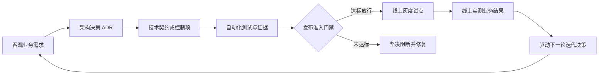

# Architect Professional 专业级系统 Capstone 毕业设计 (Architect Professional System Capstone)

> 构建一套坚不可摧的客观工程证据链，让你的生产级大模型系统架构经得起最严苛的技术质询与答辩。

**Type:** Build
**Languages:** Python
**Prerequisites:** [Choose the Smallest Surface That Can Carry the Work](../../01-claude-product-and-model-landscape/), [Spend Capability Where Failure Is Expensive](../../02-model-selection-and-token-economics/), [Turn a Request Into a Testable Contract](../../03-prompting-and-task-decomposition/), [Put Each Fact in the Right Kind of Context](../../04-context-knowledge-memory-and-caching/), [Validate the Claim, Not the Confidence](../../05-output-evaluation-and-validation/), [Put Authority Around Capability](../../06-governance-safety-and-responsible-use/), [The Messages API Is a State Machine](../../08-messages-api-and-application-lifecycle/), [Structured Output Is an Untrusted Contract](../../09-structured-output-and-defensive-parsing/), [A Tool Loop Is Controlled Delegation](../../10-tool-use-and-agentic-loops/), [MCP Separates Capability From Host](../../11-mcp-server-design-and-integration/), [The Agent SDK Is a Harness, Not Permission](../../12-claude-agent-sdk-and-hooks/), [Security Lives Outside the Prompt](../../13-application-security-and-secrets/), [Evals Turn Agent Behavior Into Engineering Evidence](../../14-evals-testing-debugging-and-observability/), [Claude Code Scales Through Shared Constraints](../../15-claude-code-for-development-teams/), [Multi-Agent Orchestration and Delegation](../../16-multi-agent-orchestration-and-delegation/), [Tool Contracts, Errors, and Progressive Discovery](../../18-tool-contracts-errors-and-progressive-discovery/), [Business Discovery, Requirements, and SLAs](../../22-business-discovery-requirements-and-slas/), [End-to-End Architecture and Value Tradeoffs](../../23-end-to-end-architecture-and-value-tradeoffs/), [RAG, Retrieval, and Data Pipelines](../../24-rag-retrieval-and-data-pipelines/), [Integration Protocols, Identity, and Least Privilege](../../25-integration-protocols-identity-and-least-privilege/), [Production Observability, Latency, and Cost](../../26-production-observability-latency-and-cost/), [Enterprise Governance, Compliance, and Human Review](../../27-enterprise-governance-compliance-and-hitl/), [Stakeholder Communication, ADRs, and Lifecycle Ownership](../../28-stakeholder-communication-adrs-and-lifecycle/)
**Time:** ~8 to 12 hours

## 学习目标

- 针对真实生产级 Claude 系统，交付从前置探索到持续运维的全生命周期企业级架构方案
- 在方案答辩中从容自辩架构选型模式、模型选型、上下文工程、RAG 检索、系统集成及安全控制决策
- 借助确定性的质量门禁，刚性证明系统在输出质量、响应延迟、综合成本、安全护栏与访问控制维度的完备性
- 交付包含企业治理、灰度发布策略、应急 Runbook 手册与全生命周期责任矩阵的完整交付包
- 面向企业管理层、研发工程团队、安全风控部门与 SRE 运维部门，准确转译同一套架构事实

## 问题背景

为一家跨多国多区域运营的全球化企业，设计一套受治理的企业级智能客服问题解决系统。

该企业目前的客服团队每周承接超过 40,000 张工单，其中绝大多数属于账单纠纷与物流派送咨询。当前的首响响应耗时中位数为 11 分钟。企业的业务退款政策每周都在发生更新，散落在各类文档与内部微服务中。过往的人工抽检发现了大量引述混乱的回答，且此前尝试部署的某套自动化系统曾错误发放了严重超出客服代表授权范围的违规退款。

拟构建的新系统被允许对工单进行智能分类、动态检索最新退款政策、读取受限的账户交易上下文、起草回复草案并向坐席推荐处置举措。但新系统**明令禁止**执行注销用户账号等高危动作；执行退款写操作必须严格核验法定权限并附带最新的人工审批签字。企业管理层明确要求该系统必须具备分阶段渐进式灰度发布策略、可量化的端到端质量指标、区域合规的数据驻留处理机制，以及向支撑平台运维团队进行正式运营交接的标准方案。

你的任务绝不是无脑追求所谓的“全自动化 Agent”，而是在严苛的现实业务约束下，设计出最优的系统架构，并凭借严密的工程证据链证明它真正具备了生产就绪度。

## 核心概念

### 十大核心交付产物

请基于 `outputs/architecture-packet-template.md` 模板完成你的最终交付包。该数据包必须环环相扣地包含以下十项核心交付成果：

#### 1. 业务探索简报 (Discovery Brief)

清晰定义预期商业成果、现状基线、量化目标、安全护栏红线、目标用户画像、当前人工工作流全貌、数据分类等级、法定审批权限边界、底层先验假设以及明确的非目标（Non-goals）。

至少在概念层面清晰区分：

- 首字响应时间（First-response time）与最终工单解决时间（Total resolution time）
- 底层通信协议成功与符合政策约束的业务任务成功
- 仅提供建议推荐权与真正具备执行写操作授权
- 团队内部考核指标与对客户承诺的法定合同 SLA
- 经过核验的客观事实与估算推测数据

#### 2. 架构方案比选与 ADR 记录 (Architecture Options and ADRs)

至少横向深度对比以下三种候选架构路径：

1. 检索增强辅助起草 + 全量人工复核模式
2. 确定性有界工作流 + 局部受控模型推理模式
3. 具备自主决策能力的 Tool-using 动态 Agent 模式

最终选定其中一种方案。详尽记录技术证据、衍生后果、**被坚决否决的备选方案**以及架构逆转触发条件。若方案引入了多个 Agent，必须逐一自辩每一个上下文隔离边界或独立复审员存在的不可替代性。多余组件的简单堆砌绝不会为你赢得更高的架构评分。

#### 3. 端到端全景系统视图 (End-to-End System Views)

使用规范的 Mermaid 语法绘制六张系统拓扑图：

- 系统全局上下文图（System Context）
- 数据流向与身份凭据透传流向图（Data & Identity Flow）
- 普通正常工单的时序交互图（Normal Ticket Sequence）
- 高危退款审批操作的时序交互图（High-risk Refund Sequence）
- 物理部署与团队资产责任边界图（Deployment & Ownership）
- 故障容灾与部分成功（Partial-result）降级流转图

系统图上的每一条外部调用边界，都必须显式注明其对应的接口 Schema、身份认证方式、超时阈值、重试策略、存证规则与归属负责人。

#### 4. 模型、Prompt 与上下文工程规划 (Model, Prompt, and Context Plan)

细分输入工单的业务类别，为每个类别制定严谨的模型动态选型矩阵。量化纳入模型输出质量、响应延迟、推理成本、上下文长度及深度思考（Thinking）需求。严禁在没有注明核验日期的前提下对具体产品的规格参数做出武断假设。

系统性设计：

- 系统指令与不可信外部用户指令的强行隔离边界
- 针对模糊主观评判的少样本（Few-shot）标准示例设计
- 静态前缀规范与 Prompt 缓存高效复用规划
- 上下文滑动窗口裁剪与长历史无损压缩方案
- 原生受限生成与本地应用层语义二次双重核验机制
- Prompt 模板与模型规格的版本化全生命周期管理

#### 5. 知识库与 RAG 检索设计 (Knowledge and RAG Design)

明确原始数据源权属责任人、文档解析清洗规则、文本切片形态、结构化元数据标注、稀疏与稠密检索配比、过滤条件表达式、Reranker 重排策略、上下文组装逻辑、引用证据链追溯、多源冲突仲裁准则、时效性门禁、索引版本原子切换及秒级回滚预案。

构建独立的检索质量评测集，覆盖常规、语义歧义、陈旧失效、未授权越权及对抗性提问用例。坚决将检索层召回指标与最终回答生成质量指标解耦独立度量。

#### 6. 集成协议与身份鉴权设计 (Integration and Identity Design)

根据系统边界与耦合度诉求，科学决策采用直接 API、CLI、MCP 协议还是 Agent-to-Agent 交互。在工具动态发现、参数 Schema、服务调用凭据及执行操作四个层次上坚决落实最小权限原则。

针对退款高危操作设计专门的动态审批凭证流：将审批单与调用主体、退款金额、目标账户、申请理由、有效时限及单次有效语义强力绑定。制定涵盖参数校验失败、越权拦截、状态冲突、接口限频、外部依赖异常及调用超时的标准结构化错误响应契约。

#### 7. 评估测试与生产证据链 (Evaluation and Production Evidence)

构建具备统计代表性的 Golden Set 黄金评测集，并设计定量与定性相结合的混合评估方案。

核心评测维度涵盖：

- 检索召回率（Recall）与数据时效性达标率
- 事实论点支撑度与引用标注覆盖率
- 业务政策遵从度与回答完整度
- 工具调用轨迹合法性与执行鉴权拦截率
- 非法高危操作的主动防范拦截率
- P50 与 P95 长尾延迟分位数表现
- 单次被业务成功采纳工单的实际综合成本
- 人工复审专员的打分一致性及平均单据审阅耗时
- 针对高危业务分层、特定地区或小语种的人群分层评测表现

将候选新方案与历史基线系统并排对比。设立硬性准入门禁（Hard Gates），严禁任何平均分数的提高去掩盖致命安全控制上的滑坡。

#### 8. 企业治理与人机协同复核 (Governance and Human Review)

产出完备的企业风险登记册、全域数据流向图谱、四层技术控制矩阵、人机协同分级复审方案、算法公平性评估计划、终端用户异议申诉处理机制、突发安全事故存证规划以及重大系统变更重新评定红线。

明确划定哪些特定技术决策必须由安全、隐私、法务、合规、财务或业务领域主管联合签批。架构师绝不能越俎代庖代表法务部门私自宣称系统绝对合规。

#### 9. 灰度发布与线上运维 (Rollout and Operations)

详尽规划旁路影子测试、小流量金丝雀放量、设防逐步放量、自动化回滚熔断、实时 APM 监控大盘、动态告警阈值、应急处置 Runbook、系统吞吐容量规划、第三方依赖熔断降级预案以及复审队列拥堵时的安全兜底。

确保每一条监控告警都绑定了明确的责任人与处置操作手册。每一个生产部署版本都必须拥有随时可以秒级切换的已知安全旧版本回滚能力。针对政策陈旧失效、鉴权中台宕机、工单暗藏注入攻击以及评估器打分漂移等突发极端场景，组织完整的沙盘故障推演演练。

#### 10. 利益相关方沟通与交接包 (Stakeholder and Handoff Package)

针对不同受众精炼交付：

- 一页纸的管理层商业决策简报
- 面向产品运营团队的工作流重塑与业务采纳度推进方案
- 面向研发工程团队的机器可执行接口契约索引
- 面向安全隐私合规部门的技术控制措施全景摘要
- 面向 SRE 团队的运维就绪度核查表与正式交接签批单

在正式签署交接单之前，接收方团队必须在一场突发的模拟故障演练中，现场演示其能够独立实现监控感知、安全降级、快速回滚、基准回归以及事故通报的全套能力。

### 贯穿始终的架构闭环方法论

在整个方案的设计过程中，必须始终严格践行如下因果推导闭环：


```mermaid
flowchart LR
    R["客观业务需求"] --> D["架构决策 ADR"]
    D --> C["技术契约或控制项"]
    C --> T["自动化测试与证据"]
    T --> G{"发布准入门禁"}
    G -->|"达标放行"| P["线上灰度试点"]
    G -->|"未达标"| B["坚决阻断并修复"]
    P --> O["线上实测业务结果"]
    O --> N["驱动下一轮迭代决策"]
    N --> R
```

如果系统中的某一个组件无法清晰向上追溯到具体的业务需求，请反思其存在的必要性；如果某项需求缺乏具体的工程控制措施或自动化测试用例，说明该架构方案尚不完备；如果一项测试结果的好坏无法对生产发布决策产生一票否决的影响，那么该测试就只是毫无意义的数字装饰。

## Build It (动手构建)

## Interactive Lab (交互式实验)

```figure
32-architect-professional-readiness
```

使用上述专业级架构就绪度大盘，将业务需求、技术选型决策、控制措施、实测证据、发布门禁、线上试点结果与资产责任人全面联动起来。直观体验在底层严密防守下，任何一项涉及鉴权越权、核心安全或回滚预案失效的硬性缺陷，是如何在加权总分再高的情况下依然保持绝对的一票否决阻断状态。

## Practice Lab (实战演练)

在模拟沙盘中故意注入一项未被满足的业务需求、一项未经代码验证的硬性控制、一个失败的评估门禁以及一次回滚演练崩溃，顺着责任链路找到对应的归属责任人并在系统边界上彻底予以修复。

## Shipped Artifact (交付产物)

随课程交付的架构方案全量模板、填充完整的生产级参考架构白皮书
[`outputs/reference-architecture-packet.md`](../outputs/reference-architecture-packet.md)、自动化校验报告
[`outputs/demo-readiness-report.json`](../outputs/demo-readiness-report.json)
以及权威评分准则报告
[`outputs/scored-rubric.md`](../outputs/scored-rubric.md)
构成了本项目的核心可复用验收资产。该参考架构在所有指定的硬性门禁与真实交接证据全部绿灯通过前，在生产级别始终保持受阻阻断状态。

## Verify It (验证方法)

配套的 Python 实验代码负责对架构数据包进行机械严密的结构化核验。它无法代替人类主管去判断商业策略的高明与否，但能以绝对冷酷的方式排查出一大批底层的低级架构缺陷：责任人缺位、需求不可量化不可测试、关键硬性控制未经自动化断言、离线评测门禁未跑通、缺失版本回滚预案，以及 ADR 决策缺乏架构逆转触发红线等。

```bash
cd certifications/claude/lessons/32-architect-professional-system-capstone/code
python3 main.py
python3 -m unittest discover tests -v
```

### 步骤 1：编码业务需求 (Requirements)

每一个 `Requirement` 对象均明确包含所属类别、可测试的陈述语句、是否具备可度量性标识以及明确的业务负责人。在你的正式交付包中，必须用详尽客观的量化度量契约替换简单的布尔标记。

### 步骤 2：编码架构决策 (Decisions)

每一个 `Decision` 对象均详尽记录决策上下文、最终选型、被否决的备选路径、引入的技术后果、架构逆转红线以及决策签字责任人。缺乏备选方案对比的推荐方案根本无法体现架构师的权衡判断力。

### 步骤 3：编码技术控制 (Controls)

每一个 `Control` 对象均指明所防范的特定风险、控制措施类型、责任人、审计存证依据、自动化验证状态，以及是否属于具有一票否决权的硬性发布门禁（Hard Release Gate）。只要硬性门禁未过，无论全局平均就绪度多么优异，系统坚决阻断上线。

### 步骤 4：严格裁决质量门禁 (Evaluation Gates)

`EvaluationGate` 支持大于等于、小于等于及绝对相等三种确定性阈值裁决模式。将其全面应用于输出质量、长尾延迟、综合成本及零容忍安全控制等关键维度。生产级门禁还必须进一步补充置信区间、最小有效样本容量与业务分层覆盖率要求。

### 步骤 5：出具最终发布决议 (Release Decision)

`release_decision` 汇总输出全量审查发现清单并统计阻断项总数。在示例代码中遗漏非目标（Non-goals）仅给出警示而不触发阻断，但在真实的专家评审委员会面前，这极有可能成为驳回方案的关键依据。

使用上述命令重现评估报告并跑通全部确定性门禁。课后的 6 道认证自测题将对架构师的综合专业判断力进行最终的严苛检验。

## Capstone Connection (项目连接)

填充完毕的十大部分架构设计数据包、架构答辩实录、故障攻防沙盘推演记录以及经双向签字的交接验收单，共同构成了申报 Claude Certified Architect Professional 认证的最高级别结项申报材料。

## 架构答辩自辩 (Architecture Defense)

请准备好在 20 分钟内向由资深首席架构师、风控总监与业务副总裁组成的评审委员会阐述该方案，并做好准备从容回应以下尖锐质询：

1. 相比于被你否决的最强备选方案，为什么当前入选的架构模式在复杂度上反而更低？
2. 系统中的每一次模型调用与 Agent 派生，分别由哪一项不可或缺的业务需求作为背书？
3. 当知识库检索返回了严重不足或互相矛盾的事实证据时，系统底层的确定性兜底动作是什么？
4. 透传给各个下游工具的具体调用身份是什么？各微服务如何独立执行权限校验？
5. 出现何种客观实测证据时，发布门禁必须对候选版本实施一票否决？
6. 你凭借何种严谨的财务核算模型，断定单价更便宜的备选方案在“单次成功交付任务”的综合成本上确实更低？
7. 一线人工复审员在操作界面上具体能够查看到哪些证据上下文？其拥有何种裁决与升级权限？
8. 架构方案中涉及的具体产品技术参数，有哪些必须在投产前重新核验官方文档？
9. 知识库数据源、各项技术控制、监控指标、报警阈值与突发事故处理的终极自然人责任人分别是谁？
10. 线上监测到何种量化实测数据劣化时，你会主动推翻并推倒重构当前的架构设计（触发 ADR 逆转）？

所有答辩回复必须精确指引到交付包中的具体文档章节与量化实测数据。“因为 Claude 具备出色的泛化能力”绝不能作为合规的架构自辩依据。

## 评审打分准则 (Scoring Rubric)

| 核心评估领域 | 权重占比 | 达到专业级精通的客观证据支撑 |
|---|---:|---|
| 系统方案设计 (Solution design) | 17% | 技术选项完美匹配业务需求；任务拆解逻辑清晰，反馈闭环机制健壮 |
| 模型、Prompt 与上下文工程 | 13% | 模型选型与上下文复用严格基于量化权衡；Prompt 契约具备版本化管理 |
| 协议集成与鉴权防护 (Integration) | 19% | RAG 架构、协议选型、身份透传与最小权限原则逻辑严密，浑然一体 |
| 评估体系与性能调优 (Evaluation) | 16% | 具备统计代表性的测试集与全链路遥测信号成为指导生产发布的核心依归 |
| 企业合规与风险治理 (Governance) | 14% | 数据流向、四层控制、人机复核、算法公平性与审批权限责任人明确落实 |
| 利益相关方生命周期治理 | 14% | 架构决策平稳贯穿业务转化、推广采纳、交接验收与全生命周期变更治理 |
| 开发者运维工程 (Developer ops) | 7% | 团队规范配置统一，排障流程标准，应急 Runbook 具备真实可操作性 |

请严格对照该准则开展自我审查与同行模拟交叉评审。本打分表是课程体系内沉淀的教学考核标准，不代表官方考试的闭门计分模型。

## 考点决策模式 (Exam Decision Patterns)

Architect Professional 认证考试极度推崇全生命周期的系统工程判断力。当多个选项在纸面上看似均合理可行时，必须优先挑选那个能够**在正确的系统边界上直击核心约束、且能产出可供第三方复核确证的客观工程证据**的技术方案。

核心架构决策优先级：

- 先理清业务约束与数据边界，再盲目考虑自动化
- 先落实源头数据最小化，再考虑追加安全护栏
- 在模型生成前，先完成精准检索与权限硬性过滤
- 权限校验必须发生在下游动作真实执行的临界时刻
- 不仅要校验 Schema 格式有效性，更要深究业务语义与事实证据链
- 坚持全链路执行轨迹与最终交付终态的双重评测
- 面对关键硬性控制失效，必须坚决执行一票否决
- 坚持严密的渐进式灰度放量发布
- 明确划分全生命周期内伴随系统演进与退役归档的终极自然人责任

## 常见 Capstone 典型陷阱 (Common Capstone Failures)

### 华而不实且缺乏决策内涵的架构图 (A Polished Diagram Without Decisions)

图面精美绝伦，却完全缺失客观业务需求、备选方案优劣比选、权衡技术代价以及架构逆转触发条件。

### 冗长空洞但毫无证据支撑的控制清单 (A Long Control List Without Evidence)

罗列了上百条安全制度，却未给任何一项控制措施绑定具体的责任人、测试用例、自动化执行日志、失效应急预案及定期复审周期。

### 通篇只有完美路径的玩具级评测 (An Evaluation With Only Happy Paths)

评测集中充斥着标准规范的问题，完全不敢纳入语义含糊、数据陈旧、事实冲突、提示词注入、鉴权宕机、网络超时及复审队列打满等恶劣真实工况。

### 缺乏排队论容量测算的人工审核队列 (A Human Review Queue Without Capacity)

高呼“每一单都经过人工审核”，却从未科学测算业务单据并发量、审核人员资质要求、单据处理工时预算、SLO 承诺及队列阻塞时的安全降级预案。

### 缺失故障自愈证明的伪交接 (A Handoff Without Recovery Proof)

仅仅把文档往群里一丢就宣称完成了交接。在突发故障演练中，接收方团队面对报警完全无法脱离原架构师的现场指导而独立实现自愈恢复。

## 课后练习 (Exercises)

1. 将本系统的智能客服场景替换为一个受到高度法律监管的金融信贷文书审查系统，全面梳理哪些技术控制措施与责任人角色必须发生实质调整。
2. 扩充随附 Python 校验器中的 `EvaluationGate` 类，为其注入置信度区间（Confidence Intervals）与最小样本容量的统计学断言逻辑。
3. 将下游工具的鉴权拦截与知识库过期文档淘汰机制，提升为机器可读数据包中的必选硬性准入门禁。
4. 邀请一位独立的资深架构师审阅你的设计方案，找出五个虽有需求声明但完全缺乏测试用例或责任人背书的悬空设计。
5. 在金丝雀灰度发布演练中故意注入性能滑坡，完整记录一次由自动化监控指标触发并执行的正式架构逆转决策全流程。

## 核心术语 (Key Terms)

| 术语 (Term) | 常见误解 | 实际技术内涵 |
|---|---|---|
| 架构设计数据包 (Architecture packet) | 一篇冗长的 Word 设计文档 | 将需求、选型决策、工程契约、实测证据、控制矩阵、责任归属与自愈恢复有机串联的机器可读工程档案 |
| 硬性准入门禁 (Hard gate) | 加权打分表中权重较高的一项 | 任何时候只要未达成即强制触发一票否决、绝对不允许被全局平均数所稀释掩盖的红线指标 |
| 生产就绪度 (Readiness) | 研发代码已全部编写完毕 | 系统在功能质量、长尾延迟、安全防护、故障自愈及团队交接等各方面均已出具可验证证据的终态状态 |
| 架构自辩能力 (Architecture defense) | 舌战群儒的演讲口才 | 凭借详实严密的工程实测证据，客观阐述设计取舍、预期代价并从容自证被否决方案劣势的专业能力 |
| 运营责任人 (Operating owner) | 代码上线部署的当天值班人员 | 在系统投产后全周期内，对业务 SLO 履约、突发事故处置、架构迭代变更及最终退役负全责的核心角色 |

## 延伸阅读 (Further Reading)

- [Claude Certified Architect Professional exam guide](https://everpath-course-content.s3-accelerate.amazonaws.com/instructor%2F6nizmqk8tpzpfjvt6qmmav7rh%2Fpublic%2F1783542810%2FClaude+Certified+Architect+%E2%80%93+Professional+Exam+Guide.pdf) 官方认证考试大纲指南
- [Claude Platform documentation](https://platform.claude.com/docs/en/home) 官方最新平台架构文档
- [Building effective agents](https://www.anthropic.com/research/building-effective-agents) 构建高效智能体的核心工程设计思想
- 本认证体系 Architect Professional 路线所涵盖的全部前置课程
