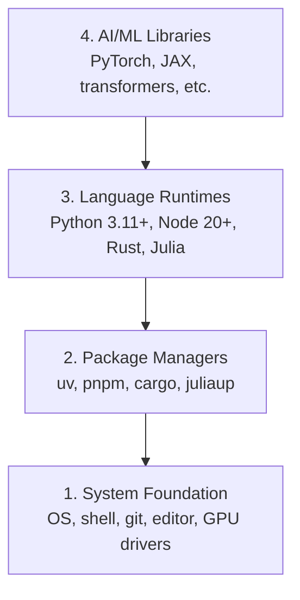

# بيئة التنمية

> أدواتك ستشكّل طريقة تفكيرك...

**Type:** Build
**Languages:** Python, Node.js, Rust
**Prerequisites:** None
**Time:** ~45 分钟

## 學习目标
- از零开始设置 Python 3.11+、Node.js 20+ 和 Rust toolchains
- تكوين بيئات افتراضية ومديري الحزم ، لتحقيق البناءات القابلة للتعديل
- استخدام CUDA / MPS 验证 GPU الوصول،并运行一个测试 Tensor العملية
- فهم أربع مستويات: النظام ، الحزم ، أوقات التشغيل ، مكتبات الذكاء الاصطناعي

## 问题
ستستخدم Python TypeScript Rust 和 Julia لتعلم 200+ درجة هندسة الذكاء الاصطناعي  درجة 

الكثير من الناس يخطون إعداد البيئة.. ثم يضعون ساعات قليلة في إصلاح أخطاء الاستيراد.. تضارب الإصدارات وغياب برامج تشغيل الكود..

## 概念
بيئة هندسية الذكاء الاصطناعي لديها أربع طبقات:



نحن نضع كل طبقة تحتها


```figure
s0-env-stack
```

## بناءها
### الخطوة 1: أساس النظام

تحقق من نظامك ووضع المكونات الأساسية

```bash
# macOS
xcode-select --install
brew install git curl wget

# Ubuntu/Debian
sudo apt update && sudo apt install -y build-essential git curl wget

# Windows (use WSL2)
wsl --install -d Ubuntu-24.04
```

### 步骤 2: بيثون مع uv

نحن نستخدم`uv`إنه أسرع من 10-100x، ويعالج بشكل تلقائي بيئات افتراضية‬

```bash
curl -LsSf https://astral.sh/uv/install.sh | sh

uv python install 3.12

uv venv
source .venv/bin/activate  # or .venv\Scripts\activate on Windows

uv pip install numpy matplotlib jupyter
```

验证:

```python
import sys
print(f"Python {sys.version}")

import numpy as np
print(f"NumPy {np.__version__}")
a = np.array([1, 2, 3])
print(f"Vector: {a}, dot product with itself: {np.dot(a, a)}")
```

### 步骤 3: Node.js مع pnpm

تستخدم على نوع النص 课程(وكلاء  MCP خادم 应用)

```bash
curl -fsSL https://fnm.vercel.app/install | bash
fnm install 22
fnm use 22

npm install -g pnpm

node -e "console.log('Node', process.version)"
```

### الخطوة 4: الخرسانة

تستخدم في أداء النقدي 课程(الاضافة 系统)

```bash
curl --proto '=https' --tlsv1.2 -sSf https://sh.rustup.rs | sh

rustc --version
cargo --version
```

### 步骤 5: جوليا (اختياري)

يستخدمها (جوليا) في دروس رياضية ممتازة

```bash
curl -fsSL https://install.julialang.org | sh

julia -e 'println("Julia ", VERSION)'
```

### 步骤 6:GPU 设置( إذا كان لديك)

```bash
# NVIDIA
nvidia-smi

# Install PyTorch with CUDA
uv pip install torch torchvision torchaudio --index-url https://download.pytorch.org/whl/cu124
```

```python
import torch
print(f"CUDA available: {torch.cuda.is_available()}")
if torch.cuda.is_available():
    print(f"GPU: {torch.cuda.get_device_name(0)}")
```

没有GPU?没有问题──大多数课程可在CPU上运行──对于训练重的课程,使用Google Colab或云 GPUs──

### الخطوة 7: تحقق من كل شيء

运行验证脚本:

```bash
python phases/00-setup-and-tooling/01-dev-environment/code/verify.py
```

## استخدمها
بيئتك الآن جاهزة للاستخدام في كل فصل من هذه الدروس.

| Language | Used In | Package Manager |
|----------|---------|-----------------|
| Python | Phases 1-12 (ML, DL, NLP, Vision, Audio, LLMs) | uv |
| TypeScript | Phases 13-17 (Tools, Agents, Swarms, Infra) | pnpm |
| Rust | Phases 12, 15-17 (Performance-critical systems) | cargo |
| Julia | Phase 1 (Math foundations) | Pkg |

## 交付 it
هذا المقال يُنتج كتابًا للتحقق من أنظمة العمل التي يمكن لأي شخص أن يستخدمها.

查看 `outputs/prompt-env-check.md`، واحدة منها سريعة، يمكن أن تساعد مساعدات الذكاء الاصطناعي  تشخيص مشاكل البيئة.

## التدريب
1. 运行验证脚本并修复任何失败项
2. في هذا البرنامج، قم بإنشاء بيئة افتراضية في Python، ووضع PyTorch
3. مع كلّ 4 لغات، أكتب "مرحباً للعالم" و أكتب "مرحباً للعالم"
