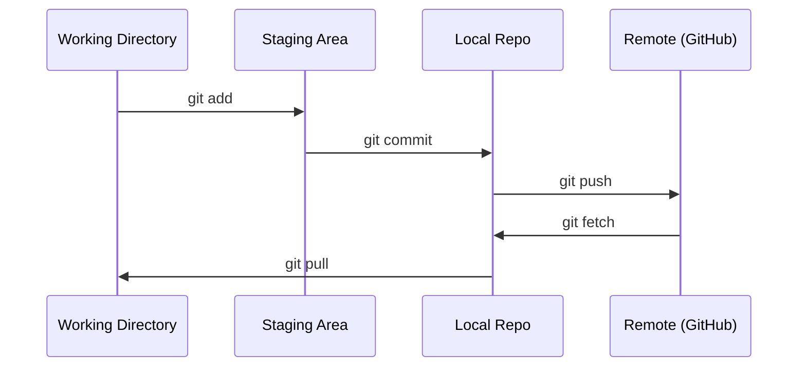

# التعاون

> التحكم في الإصدار ليس خيارًا متاحًا. كل تجربة تقوم ببناءها هنا، كل نموذج، كل فصل يجب أن يتم تتبعها.

**Type:** Learn
**Languages:** --
**Prerequisites:** Phase 0, Lesson 01
**Time:** ~30 分钟

## 學习目标
- 配置 git identity,并使用 إضافة、التزام 和 دفع من سير العمل اليومي
- لتحقيق التجارب المفصلة، إنشاء ودمج الفروع، لتجنب تدمير الرئيسي
- 编写一个 `.gitignore`، إزالة نقاط التفتيش النموذجية وملفات ثنائية كبيرة
- استخدام `git log`浏览 التاريخ المشترك، فهم تطور المشروع

## 问题
ستمر عبر 20 مرحلة  كتابة مئات ملفات رمزية ‬ بدون تحكم في الإصدارات، ستفقد العمل‬ ‫تتدمير شيء لا يمكن إلغاءه، ولا يمكنك التعاون مع الآخرين‬

غيت هو أداة. غيت هوب هو رمز حيث يوجد.

## 概念


تذكر ثلاثة أشياء:
1. 经常保存(`git commit`)
2. ادفع الى جهاز التحكم`git push`)
3. للاختبارات  إقامة فرع`git checkout -b experiment`)


```figure
s0-commit-dag
```

## بناءها
### الخطوة 1: إعداد git

```bash
git config --global user.name "Your Name"
git config --global user.email "you@example.com"
```

### 步骤 2: تدفق العمل اليومي

```bash
git status
git add file.py
git commit -m "Add perceptron implementation"
git push origin main
```

### الخطوة الثالثة: للاختبار

```bash
git checkout -b experiment/new-optimizer

# ... make changes, commit ...

git checkout main
git merge experiment/new-optimizer
```

### الخطوة 4: استخدام هذا البرنامج

```bash
git clone https://github.com/rohitg00/ai-engineering-from-scratch.git
cd ai-engineering-from-scratch

git checkout -b my-progress
# work through lessons, commit your code
git push origin my-progress
```

## استخدمها
بالنسبة لهذا الدور، تحتاج فقط إلى هذه الأوامر:

| Command | When |
|---------|------|
| `git clone` | 获取 course repo |
| `git add` + `git commit` | 保存你的工作 |
| `git push` | 备份到 GitHub |
| `git checkout -b` | 在不破坏 main 的情况下尝试东西 |
| `git log --oneline` | 查看你做过什么 |

على هذه. هذا الدراسة لا تحتاج إلى قاعدة إعادة التدريب أو اختيار الكرز أو وحدات فرعية.

## التدريب
1. قم بتغطية هذا الإستثمار، قم بإنشاء اسم`my-progress`فرع، إنشاء ملف، التزاما، دفعها
2. إنشاء واحد`.gitignore`، إزالة ملفات النموذجية لمراقبة النقاط`.pt`.`.pth`.`.safetensors`)
3. استخدام`git log --oneline`انظر تاريخ التزامات هذا الإيداع، وقراءة الدروس كيف تم إضافة

## 关键术语
| Term | What people say | What it actually means |
|------|----------------|----------------------|
| Commit | “保存” | 你的整个 project 在某个时间点的 snapshot |
| Branch | “一个副本” | 指向某个 commit 的 pointer，会随着你的工作向前移动 |
| Merge | “合并 code” | 把一个 branch 的 changes 应用到另一个 branch |
| Remote | “云端” | 托管在其他地方的 repo 副本（GitHub、GitLab） |
