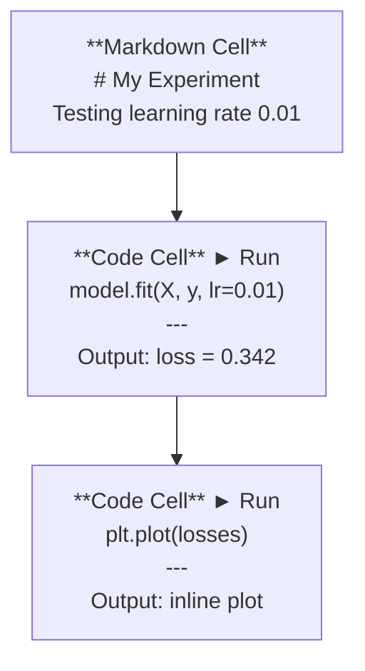
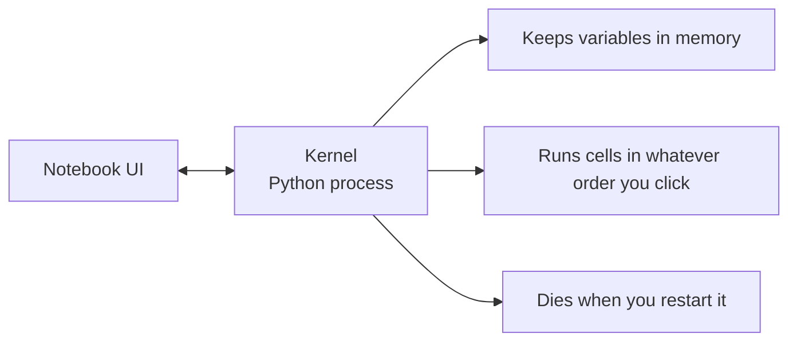

# كتيبات الملاحظات Jupyter

> المكتبات الملاحظة هي تجربة هندسة الذكاء الاصطناعي.

**类型：**بناء
**语言：**بايثون
**前置要求：**المرحلة 0، الدروس 01
**时间：**حوالي 30 دقيقة

## 學习目标

- قم بتثبيت وتشغيل JupyterLab、Jupyter Notebook، أو مع تمديد Jupyter
- استخدام الأوامر السحرية`%timeit`.`%%time`.`%matplotlib inline`) للمراجعة والمواصفات
- 区分何时使用笔记本、何时使用脚本,并应用在笔记本中探索,在脚本中交付工作流
- 识别并避免常见笔记本 陷:乱序执行、隐藏状态和内存泄漏

## 问题

كل ورقة AI ٬ دراسة و تنافسات Kaggle تستخدم كابوتات الملاحظات Jupyter ٬ فهي تجعلك تفرق في النشاطات ٬ في الإنترنت ٬ تلقي نظرة على المخرجات ٬ خليطات الملاحظات ٬ ومسرعة ٬ ٬ إذا حاولت عدم استخدام كابوتات الذكاء الاصطناعي ، فانك مثل القيام بعمل رياضي ولكن ليس هناك رسالة نصية٬٬

لكن المكتبات لديها حوافز، الناس تستخدمها في كل شيء، بما في ذلك الأشياء التي لا تُفضلها كثيراً.

## 概念

المذكرة هي قائمة تتكون من مجموعة من القطع. كل واحد من القطع هي رمز أو نص.



الكرنيل هو عملية بيثون التي تعمل في الخلفية. عندما تقوم بتشغيل خلية، فإنها ترسل الكود إلى الكرنيل، الكرنيل تنفيذ الكود وتحقيق النتائج. جميع الخلايا تشارك في نفس الكرنيل، لذلك سيتم الاحتفاظ بالتحول بين الخلايا.



أنت على ما يُنظَرُ تَنظَرُ على ما يُنظَرُ هذا هو إضافيّة القدرة، وسهلّة على الوقوع 


```figure
s0-cell-order
```

## الإنشاء

### الخطوة الأولى: اختر واجهتك

三种选择,同一种格式:

| Interface | Install | Best for |
|-----------|---------|----------|
| JupyterLab | `pip install jupyterlab` then `jupyter lab` | 完整 IDE 体验、多标签、文件浏览器、terminal |
| Jupyter Notebook | `pip install notebook` then `jupyter notebook` | 简单、轻量、一次一个 notebook |
| VS Code | Install "Jupyter" extension | 已在你的 editor 中、git 集成、debugging |

ثلاثة من كل الكتابة مع واحد `.ipynb`文件──选你喜欢的即可──JupyterLab هو اختيار الأكثر شيوعاً في عمل الذكاء الاصطناعي ‬‬

```bash
pip install jupyterlab
jupyter lab
```

### 步骤 2: 重要键盘快捷键

ستعملين في أشكال مختلفة`Escape`进入 الوضع القيادي  left side blu色) ،按 `Enter`进入 وضع التحرير(绿色)。

**Command mode（最常用）：**

| Key | Action |
|-----|--------|
| `Shift+Enter` | 运行 cell，移动到下一个 |
| `A` | 在上方插入 cell |
| `B` | 在下方插入 cell |
| `DD` | 删除 cell |
| `M` | 转换为 markdown |
| `Y` | 转换为 code |
| `Z` | 撤销 cell 操作 |
| `Ctrl+Shift+H` | 显示所有快捷键 |

**Edit mode：**

| Key | Action |
|-----|--------|
| `Tab` | Autocomplete |
| `Shift+Tab` | 显示函数签名 |
| `Ctrl+/` | 切换 comment |

`Shift+Enter`نعم ستستخدمين المفاتيح السريعة 1000 مرة كل يوم

### الخطوة الثالثة: نوع الخلية

**Code cells**运行 Python 并显示输出:

```python
import numpy as np
data = np.random.randn(1000)
data.mean(), data.std()
```

输出:`(0.0032, 0.9987)`

**Markdown cells**染格式化文本──استخدمها لتسجيل ما تفعله ولماذا تفعل ذلك── دعم الرأسات、جريئة、إيطالية、التيكس الرياضيات(`$E = mc^2$`)、جداول و صور

### 步骤 4: الأوامر السحرية

هذه ليست بيثون إنها أوامر خاصة بـ (جوبيتر)`%`(سحر الخط) أو `%%`(سحر الخلايا)

**为你的代码计时：**

```python
%timeit np.random.randn(10000)
```

输出:`45.2 us +/- 1.3 us per loop`

```python
%%time
model.fit(X_train, y_train, epochs=10)
```

输出:`Wall time: 2.34 s`

`%timeit`سأقوم بتشغيل المعدلات`%%time`فقط نفعل مرة واحدة.`%timeit`قم بتصوير علامات التأثير`%%time`قم بتدريبات

**启用 inline plots：**

```python
%matplotlib inline
```

الآن كل شخص`plt.plot()`أو`plt.show()`مدينة مباشرة في المذكرة

**不离开 notebook 安装 packages：**

```python
!pip install scikit-learn
```

`!`قبل会运行 أي أمر القذيفة

**检查环境变量：**

```python
%env CUDA_VISIBLE_DEVICES
```

### 步骤 5: إضافة  عرض الناتج الغني

المكتبات الملاحظة ستظهر تلقائياً آخر تعبير في الخلية ولكنك تستطيع التحكم بها أيضاً:

```python
import pandas as pd

df = pd.DataFrame({
    "model": ["Linear", "Random Forest", "Neural Net"],
    "accuracy": [0.72, 0.89, 0.94],
    "training_time": [0.1, 2.3, 45.6]
})
df
```

هذا سيؤدي إلى جدول HTML المشكّل بدلاً من مخزن النص.

```python
import matplotlib.pyplot as plt

plt.figure(figsize=(8, 4))
plt.plot([1, 2, 3, 4], [1, 4, 2, 3])
plt.title("Inline Plot")
plt.show()
```

الخطة سوف تظهر في الخلية 正下方──هذا هو المكتبات الملاحظة 主导 AI 工作的原因──يمكنك أيضاً رؤية البيانات、الخطة والرقم──

对于 الصور:

```python
from IPython.display import Image, display
display(Image(filename="architecture.png"))
```

### الخطوة 6: Google Colab

كولاب هو المكتب المتحفظ المجانى على شبكة الإنترنت. يوفر نظام المعالجة المعالجة المعالجة (GPU) ، ومكتبات التثبيت المضمنة (Preinstalled libraries) و (Google Drive) ، لا حاجة إلى إعداد.

1. السابق [colab.research.google.com](https://colab.research.google.com)
2. 上传本课程中的任意 `.ipynb`文件
3. وقت تشغيل > تغيير نوع وقت تشغيل > T4 GPU(免费)

فرق Colab عن Jupyter الأصلي:
- الملفات غير موجودة بين الجلسات (احتفظ بها إلى القرص أو التنزيل)
- 预装:نومبي 潘達  ماتبلوترليب 火焰  تنسروفلو 
- استخدام `from google.colab import files`上传/ download ملفات
- استخدام `from google.colab import drive; drive.mount('/content/drive')`عمل تخزين طويل الأمد
- جلسات مجانية في 90 دقيقة غير نشطة بعد اجتماع

## استخدام

### المكتبات الملاحظة مقابل النصوص:何时使用哪一个

| Use notebooks for | Use scripts for |
|-------------------|-----------------|
| 探索 dataset | Training pipelines |
| Prototype model | Reusable utilities |
| 可视化结果 | 任何包含 `if __name__` 的东西 |
| 解释你的工作 | 按计划运行的 code |
| 快速 experiments | Production code |
| Course exercises | Packages and libraries |

规则:**在 notebooks 中探索，在 scripts 中交付**.

النظام العامل المعتاد:
1. في دفتر الملاحظات استكشاف البيانات
2. في المذكرة النموذج الأول الخاص بك
3. بمجرد أن ينجح، نقوم بتحويل الرمز`.py`الملفات
4. ضع هذه`.py`الملفات إعادة الاستيراد إلى المذكرة، للاستعمال في تجارب أخرى

### 常见陷

**乱序执行。**ستقوم بالعمل في الخلية 5، ستقوم بالعمل في الخلية 2، ستقوم بالعمل في الخلية 7― دفتر الملاحظات على جهازك يمكن استخدامه، ولكن الآخرين من فوق إلى أسفل سوف يتسببون في سوء النشاط.

**隐藏状态。**أنت قمت بإزالة خلية، ولكن تغيراتها التي تم إنشاؤها لا تزال في الذاكرة.

**内存泄漏。**تحميل مجموعة بيانات 4 جيجابايت ‬ نموذج التدريب ‬ إعادة تحميل مجموعة بيانات أخرى‬`del variable_name`和 `gc.collect()`أو إعادة تشغيل النواة

## 交付

本课会产出:
- `outputs/prompt-notebook-helper.md`, للمستخدم في تدوين المذكرة

## التدريب

1. 打开 JupyterLab, إقامة دفتر مذكرات,并使用 `%timeit`مقارنة فهم القائمة مع numpy في إنشاء 100،000 ٪ صف العدد المتساوي ٪
2. إنشاء دفتر مذكرات يحتوي على علامات التسجيل و خلايات الرمز، تحميل CSV ‬ ‬ ‬ ‬ ‬ ‬ ‬ ‬ ‬ ‬ ‬ ‬ ‬ ‬ ‬ ‬ ‬ ‬ ‬ ‬ ‬ ‬ ‬ ‬ ‬ ‬ ‬ ‬ ‬ ‬ ‬ ‬ ‬ ‬ ‬ ‬ ‬ ‬ ‬ ‬ ‬ ‬ ‬ ‬ ‬ ‬ ‬ ‬ ‬ ‬ ‬ ‬ ‬ ‬ ‬ ‬ ‬ ‬ ‬ ‬ ‬ ‬ ‬ ‬ ‬ ‬ ‬ ‬ ‬ ‬ ‬ ‬ ‬ ‬ ‬ ‬ ‬ ‬ ‬ ‬ ‬ ‬ ‬ ‬ ‬ ‬ ‬ ‬ ‬ ‬ ‬ ‬ ‬ ‬ ‬ ‬ ‬ ‬ ‬ ‬ ‬ ‬ ‬ ‬ ‬ ‬ ‬ ‬ ‬ ‬ ‬ ‬ ‬ ‬ ‬ ‬ ‬ ‬ ‬ ‬ ‬ ‬ ‬ ‬ ‬ ‬ ‬ ‬ ‬ ‬ ‬ ‬ ‬ ‬ ‬ ‬ ‬ ‬ ‬ ‬ ‬ ‬ ‬ ‬ ‬ ‬ ‬ ‬ ‬ ‬ ‬ ‬ ‬ ‬ ‬ ‬ ‬ ‬ ‬ ‬ ‬ ‬ ‬ ‬ ‬ ‬ ‬ ‬ ‬ ‬ ‬ ‬ ‬ ‬ ‬ ‬ ‬ ‬ ‬ ‬ ‬ ‬ ‬ ‬ ‬ ‬ ‬ ‬ ‬ ‬ ‬ ‬ ‬ ‬ ‬ ‬ ‬ ‬ ‬ ‬ ‬ ‬ ‬ ‬ ‬ ‬ ‬ ‬ ‬ ‬ ‬ ‬ ‬ ‬ ‬ ‬ ‬ ‬ ‬ ‬ ‬ ‬ ‬ ‬ ‬ ‬ ‬ ‬ ‬ ‬ ‬ ‬ ‬ ‬ ‬ ‬ ‬ ‬ ‬ ‬ ‬
3. - لا .`code/notebook_tips.py`中的代码 粘贴到Colab المذكرة 中,并使用免费GPU 运行

## 关键术语

| Term | What people say | What it actually means |
|------|----------------|----------------------|
| Kernel | “运行我代码的东西” | 一个独立的 Python process，用来执行 cells 并在内存中保存变量 |
| Cell | “一个 code block” | Notebook 中可独立运行的单元，可以是 code 或 markdown |
| Magic command | “Jupyter 技巧” | 以 `%` 或 `%%` 为前缀、用于控制 notebook 环境的特殊命令 |
| `.ipynb` | “Notebook file” | 一个包含 cells、outputs 和 metadata 的 JSON 文件。代表 IPython Notebook |

## 延伸阅读

- [JupyterLab Docs](https://jupyterlab.readthedocs.io/)查看完整功能集
- [Google Colab FAQ](https://research.google.com/colaboratory/faq.html)查看 Colab 特定限制与功能
- [28 Jupyter Notebook Tips](https://www.dataquest.io/blog/jupyter-notebook-tips-tricks-shortcuts/)查看进阶快捷键
