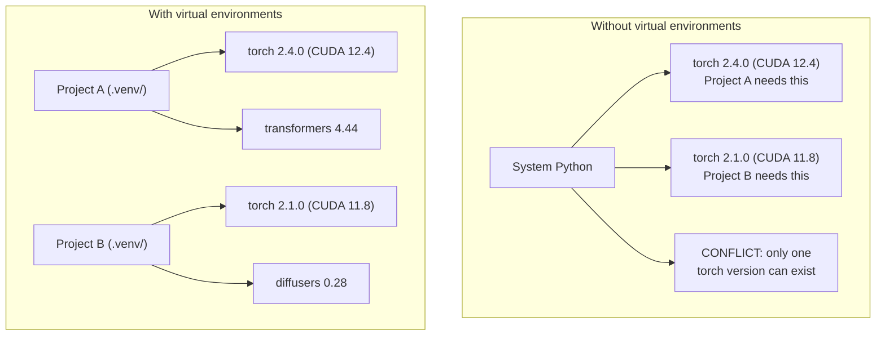

# بيئة Python

> الإدمان حقيقي وجودها. البيئات الافتراضية هي الحل.

**Type:** Build
**Languages:** Shell
**Prerequisites:** Phase 0, Lesson 01
**Time:** ~30 分钟

## أهداف التعلم

- استخدام `uv`.`venv`أو`conda`إنشاء بيئات افتراضية منفصلة
- 编写带有可选依赖群的 `pyproject.toml`, ولإنتاج ملفات قفل لضمان قابلية التأثير
- 诊断并修复常见陷: التثبيتات العالمية pip/conda 混用、CUDA نسخة عدم الملاءمة
- تنفيذ مشروعات تعتمد على الصراع

## 问题

أنت لمشروع تحسين تمثيل قمت بتثبيت PyTorch 2.4──下周، مشروع آخر 需要 PyTorch 2.1, لأن بناء CUDA الخاص بها تم تحديدها── بعد تحديثك، المشروع الأول 坏了── بعد تحديثك، المشروع الثاني أيضاً خراب了──

هذا هو الجحيم الإدمان. يحدث في العمل في AI / ML بشكل متكرر، لأن:

- بيتورش、جاكس و TensorFlow كل يحمل على حدة روابط CUDA الخاصة به
- المكتبات النموذجية سوف تحدد إصدارات إطار محددة
-  全局`pip install`会覆盖 المحتوى السابق
- CUDA 11.8 يبنى 不能 مع CUDA 12.x محركات 配合使用,反之亦然

الحل: كل مشروع لديه بيئة منفصلة خاصة به، فضلا عن حزمة خاصة به.

## 概念




```figure
s0-env-isolation
```

## بناءها

### 选项 1:uv venv(推)

`uv`هو أسرع مدير حزمة Python ((比 pip 快 10-100 倍) ⋅ انها في أداة واحدة معالجة البيئات الافتراضية、إصدارات Python وقرار الاعتماد‬‬‬‬‬‬‬‬‬‬‬‬‬‬‬‬‬‬‬‬‬‬‬‬‬‬‬‬‬‬‬‬‬‬‬‬‬‬‬‬‬‬‬‬‬‬‬‬‬‬‬‬‬‬‬‬‬‬‬‬‬‬‬‬‬‬‬‬‬‬‬‬‬‬‬‬‬‬‬‬‬‬‬‬‬‬‬‬‬‬‬‬‬‬‬‬‬‬‬‬‬‬‬‬‬‬‬‬‬‬‬‬‬‬‬‬‬‬‬‬‬‬‬‬‬‬‬‬‬‬‬‬‬‬‬‬‬‬‬‬‬‬‬‬‬‬‬‬‬‬‬‬‬‬‬‬‬‬‬‬‬‬‬‬‬‬‬‬‬‬‬‬‬‬‬‬‬‬‬‬‬‬‬‬‬‬‬‬‬‬‬‬‬‬‬‬‬‬‬‬‬‬‬‬‬‬‬‬‬‬‬‬‬‬‬‬‬‬‬‬‬‬‬‬‬‬‬‬‬‬‬‬‬‬‬‬‬‬‬‬‬‬‬‬‬‬‬‬‬‬‬‬‬‬‬‬‬‬‬‬‬‬‬‬‬‬‬‬‬‬‬‬‬‬‬‬‬‬‬‬‬‬‬‬‬‬‬‬‬‬‬‬‬‬‬‬‬‬‬‬‬‬‬‬‬‬‬‬‬‬‬‬‬‬‬‬‬‬‬‬‬‬‬‬‬‬‬‬‬‬‬‬‬‬‬‬‬‬‬‬‬‬‬‬‬‬‬‬‬‬‬‬‬‬‬‬‬‬‬‬‬‬‬‬‬‬‬‬‬‬‬‬‬‬‬‬‬‬‬‬‬‬‬‬‬‬‬‬‬‬‬‬‬‬‬‬‬‬‬‬‬‬‬‬‬‬‬‬‬‬‬‬‬‬‬‬‬‬‬‬‬‬‬‬‬‬‬‬‬‬‬‬‬‬‬‬‬‬‬‬‬‬‬‬‬‬‬‬‬‬‬‬‬‬‬‬‬‬‬‬‬‬

```bash
curl -LsSf https://astral.sh/uv/install.sh | sh

uv python install 3.12

cd your-project
uv venv
source .venv/bin/activate
```

إعدادات:

```bash
uv pip install torch numpy
```

                                                                                                                                                                                                                                                                                                                                                                                                                                                                                                                             `pyproject.toml`مشروع:

```bash
uv init my-ai-project
cd my-ai-project
uv add torch numpy matplotlib
```

### 选项 2:venv(内置)

إذا لم تستطع التثبيت`uv`، (بايتون)`venv`:

```bash
python3 -m venv .venv
source .venv/bin/activate  # Linux/macOS
.venv\Scripts\activate     # Windows

pip install torch numpy
```

بي بي`uv`لكنّه ببطء، لكنّه في مكانٍ ما يُمكن أن يعمل في (بايتون)

### 选项 3:conda(需要时使用)

كوندا  إدارة أدوات CUDA٬ كودن و C المكتبات وغير الاعتمادات Python٬ في الحالات التالية استخدامها:

- تحتاج إلى نسخة محددة من مجموعة أدوات CUDA ، ولكن لا تريد تنفيذها على مستوى النظام
- أنت في مجموعة مشتركة، لا يمكن تثبيت حزم النظام
- 某图书馆的安装说明写着 使用公寓

```bash
# Install miniconda (not the full Anaconda)
curl -LsSf https://repo.anaconda.com/miniconda/Miniconda3-latest-Linux-x86_64.sh -o miniconda.sh
bash miniconda.sh -b

conda create -n myproject python=3.12
conda activate myproject

conda install pytorch torchvision torchaudio pytorch-cuda=12.4 -c pytorch -c nvidia
```

1- قاعدة: إذا كنت تستخدم شقة في بيئة معينة، فاستخدم الشقة لإدارة جميع الحزم الموجودة في البيئة.`pip install`تسبب صراعات الإعتماد، وتجربة التأثير المُؤلم.

### 本课程: حسب الخطط

يمكنك أن تخلق بيئة لكل درجة، لا تفعل ذلك، تحتاج إلى مراحل مختلفة، وأحياناً تكون هناك تعتمدات متضاربة.

策略:

```
ai-engineering-from-scratch/
├── .venv/                    <-- phases 0-3 共用的轻量 env
├── phases/
│   ├── 04-neural-networks/
│   │   └── .venv/            <-- PyTorch env
│   ├── 05-cnns/
│   │   └── .venv/            <-- 同一个 PyTorch env（symlink 或 shared）
│   ├── 08-transformers/
│   │   └── .venv/            <-- 可能需要不同的 transformer versions
│   └── 11-llm-apis/
│       └── .venv/            <-- API SDKs，不需要 torch
```

`code/env_setup.sh`وسائل النص الوسطى سوف تُستخدم في إعداد بيئة أساسية في هذا البرنامج

## pyproject.toml 基础

كل مشروع في بايثون يجب أن يكون له`pyproject.toml`إنها تستخدم ملف بديل `setup.py`.`setup.cfg`和 `requirements.txt`.

```toml
[project]
name = "ai-engineering-from-scratch"
version = "0.1.0"
requires-python = ">=3.11"
dependencies = [
    "numpy>=1.26",
    "matplotlib>=3.8",
    "jupyter>=1.0",
    "scikit-learn>=1.4",
]

[project.optional-dependencies]
torch = ["torch>=2.3", "torchvision>=0.18"]
llm = ["anthropic>=0.39", "openai>=1.50"]
```

ثمّ إضافة:

```bash
uv pip install -e ".[torch]"    # base + PyTorch
uv pip install -e ".[llm]"     # base + LLM SDKs
uv pip install -e ".[torch,llm]" # everything
```

## أوراق القفل

سيقوم الملف القفل بتثبيت كل اعتماد (بما في ذلك الاعتمادات الانتقالية) إلى نسخة محددة. وهذا يضمن القفل القابل للتعديل: أي شخص من الملف القفل يتركز، وسوف تحصل على نفس الحزم تماما.

```bash
# uv generates uv.lock automatically when using uv add
uv add numpy

# pip-tools approach
uv pip compile pyproject.toml -o requirements.lock
uv pip install -r requirements.lock
```

بعد إعادة إعداد الملفات المُقفلة، ستحصل على نسخ متطابقة تماماً

## 常见错误

### 1. كلّه

```bash
pip install torch  # BAD: installs to system Python

source .venv/bin/activate
pip install torch  # GOOD: installs to virtual environment
```

 تحقق حزمك 会安装到哪里:

```bash
which python       # should show .venv/bin/python, not /usr/bin/python
which pip           # should show .venv/bin/pip
```

### 2. 混用 pip 和 conda

```bash
conda create -n myenv python=3.12
conda activate myenv
conda install pytorch -c pytorch
pip install some-other-package   # BAD: can break conda's dependency tracking
conda install some-other-package # GOOD: let conda manage everything
```

إذا كان عليك استخدام بعض الحزم في الحجرة فقط دعم الحزم ، أولاً قم بتثبيت جميع الحزم في الحجرة ، وأخيراً قم بتثبيت حزم الحزم

### 3.  forget forget تنشيط

```bash
python train.py           # uses system Python, missing packages
source .venv/bin/activate
python train.py           # uses project Python, packages found
```

应显示 اسم البيئة:

```
(.venv) $ python train.py
```

### 4. إلتزموا بالعمل

```bash
echo ".venv/" >> .gitignore
```

البيئات الافتراضية عادة ما تكون 200 ميغابايت إلى 2 جيجابايت.`pyproject.toml`وملف القفل

### 5. إصدار CUDA غير متطابق

```bash
nvidia-smi                # shows driver CUDA version (e.g., 12.4)
python -c "import torch; print(torch.version.cuda)"  # shows PyTorch CUDA version

# These must be compatible.
# PyTorch CUDA version must be <= driver CUDA version.
```

## استخدمها

运行 النص الإعداد  خلق بيئة دراستك:

```bash
bash phases/00-setup-and-tooling/06-python-environments/code/env_setup.sh
```

هذا سيكون في الجذر repo  إقامة واحد `.venv`,并安装和验证 الاعتمادات الأساسية

## التدريب

1. 运行 `env_setup.sh`وأكد أن كل المراقبة تمت
2. إنشاء بيئة افتراضية ثانية، وتثبيت إصدارات مختلفة من النمبي، وتحديد بيئة منفصلة عن بعضها البعض
3. لإنشاء مشروع في وقت واحد من PyTorch و SDK الأنثروبية 编写 `pyproject.toml`
4. لذا فكل المحطة تقوم بتثبيت حزمة (لا تنشيط (فين) ، ثم تنظر إليها

## 关键术语

| Term | What people say | What it actually means |
|------|----------------|----------------------|
| Virtual environment | “A venv” | 一个隔离目录，包含 Python interpreter 和 packages，并与 system Python 分离 |
| Lockfile | “Pinned dependencies” | 一个列出每个 package 及其精确 version 的文件，保证跨机器安装一致 |
| pyproject.toml | “The new setup.py” | 标准 Python project 配置文件，替代 setup.py/setup.cfg/requirements.txt |
| Transitive dependency | “A dependency of a dependency” | Package B 依赖 C；如果你安装依赖 B 的 A，那么 C 就是 A 的 transitive dependency |
| CUDA mismatch | “My GPU isn't working” | PyTorch 编译所用的 CUDA version 与你的 GPU driver 支持的版本不同 |
