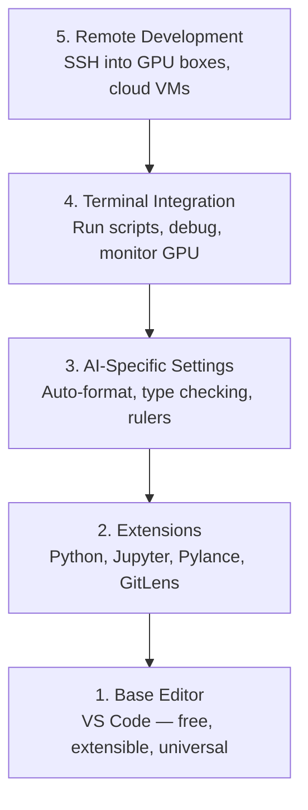

# إعداد المحرر

> محررك هو شريكك المشترك. إعدّه مرة واحدة، دعيه يبدأ في العمل.

**Type:** Build
**Languages:** --
**Prerequisites:** Phase 0, Lesson 01
**Time:** ~20 分钟

## 學习目标
- قم بتثبيت VS Code،并配置 Python、Jupyter、linting 和 remote SSH المطلوبة التوسعات الأساسية
- لأجل تدفقات العمل الذكاء الاصطناعي  تثبيت الشكل على حفظ ٬ التحقق من النوع و تحريك إصدار المكتبة
-  تهيئة SSH عن بعد، مثل إعداد كود محلي مثل في جهاز GPU بعيد  تحرير وإصلاح كود
- 评估其他编辑器选择(Cursor、Windsurf、Neovim) وكذلك تحدياتهم في العمل الذكاء الاصطناعي

## 问题
سوف تنفق على المحرر آلاف الساعات: كتابة Python ٬ تشغيل المكتبات الملاحظة ٬ إزالة حلقات التدريب، وكذلك SSH إلى GPU  機器 ٬ إعداد غير مناسبة المحرر سوف يجعل كل مرة العمل كاملة من العوائق: لا إكمال تلقائي ٬ لا إشارات النمط ٬ لا أخطاء داخلية ٬ تحتاج إلى تصميم يدوي ، وكذلك ثقل التدفقات التدريبية المحمولة ٬

التشغيل الصحيح يستغرق 20 دقيقة فقط.

## 概念
تحديدات تحرير هندسة الذكاء الاصطناعي تحتاج إلى خمسة أشياء:




```figure
s0-lsp-roundtrip
```

## بناءها
### الخطوة 1: إثباط رمز VS

推使用 VS Code──它免费、可在所有OS 上运行、对Jupyter笔记本有一流支持,并且扩展生态覆盖所有人工智能工作所需的一切──

من[code.visualstudio.com](https://code.visualstudio.com/)-إنه من السهل

في المحطة

```bash
code --version
```

إذا ماكوس 上找不到 `code`,打开 VS Code , طبعاً`Cmd+Shift+P`,输入 "Shell Command", ثم اختيار "إثباط 'مخطط' في PATH"。

### الخطوة الثانية: إعداد الضروري

في VS Code 中打开 متكاملة المحطة`Ctrl+`` `أو `` Cmd+```) ، تنص على عمل الذكاء الاصطناعي

```bash
code --install-extension ms-python.python
code --install-extension ms-python.vscode-pylance
code --install-extension ms-toolsai.jupyter
code --install-extension eamodio.gitlens
code --install-extension ms-vscode-remote.remote-ssh
code --install-extension ms-python.debugpy
code --install-extension ms-python.black-formatter
code --install-extension charliermarsh.ruff
```

تأثير كل إطالة:

| Extension | Why |
|-----------|-----|
| Python | Language 支持、virtual env 检测、run/debug |
| Pylance | 快速 type checking、autocomplete、import resolution |
| Jupyter | 在 VS Code 内运行 notebooks、variable explorer |
| GitLens | 查看谁改了什么、inline git blame |
| Remote SSH | 像本地一样打开远程 GPU 机器上的文件夹 |
| Debugpy | Python 的 step-through debugging |
| Black Formatter | 保存时自动格式化，保持风格一致 |
| Ruff | 快速 linting，捕获常见错误 |

本课中 `code/.vscode/extensions.json`الملفات تحتوي على قائمة التوصيات الكاملة. عندما تفتح مجلد المشروع.

### الخطوة 3: إعدادات الإعداد

复制本课 `code/.vscode/settings.json`إعدادات وسط، أو من خلال `Settings > Open Settings (JSON)`التطبيق المباشر

إعدادات الأساسية للعمل الذكاء الاصطناعي:

```jsonc
{
    "python.analysis.typeCheckingMode": "basic",
    "editor.formatOnSave": true,
    "editor.rulers": [88, 120],
    "notebook.output.scrolling": true,
    "files.autoSave": "afterDelay"
}
```

لماذا هذا مهم:

- **Type checking on basic**: در运行前捕获错误的参数类型──能节省 debug tensor shape mismatches 和错误 API参数 的时间──
- **Format on save**: لا حاجة إلى النظر في التشكيل.
- **Rulers at 88 and 120**: الأسود في 88 处换行──120 标记显示 docstrings 和 comments 什么时候过长──
- **Notebook output scrolling**حلقات التدريب ستحشر آلاف الصفحات بدون تحريك
- **Auto-save**ستنساه حفظ. ستعمل نص التدريب الخاص بك على الكود القديم.

### 步骤 4: المحطة 集成

المحطة المتكاملة لـ VS Code هي مكان تشغيل نصوص التدريب ٬ مراقبة الجيبو٬ إدارة البيئات

صحيح ترتيبها:

```jsonc
{
    "terminal.integrated.defaultProfile.osx": "zsh",
    "terminal.integrated.defaultProfile.linux": "bash",
    "terminal.integrated.fontSize": 13,
    "terminal.integrated.scrollback": 10000
}
```

مفيد مفاتيح سريعة:

| Action | macOS | Linux/Windows |
|--------|-------|---------------|
| Toggle terminal | `` Ctrl+` `` | `` Ctrl+` `` |
| New terminal | `Ctrl+Shift+`` ` | `Ctrl+Shift+`` ` |
| Split terminal | `Cmd+\` | `Ctrl+\` |

محطات منفصلة مفيدة جدا: واحد لتنفيذ النص الخاص بك، والآخر للاستخدام`nvidia-smi -l 1`أو`watch -n 1 nvidia-smi`مراقبة الجيبو

### الخطوة 5: بعيدة المدى لتطوير (SSH إلى جهاز GPU)

هذا هو العمل الذكاء الاصطناعي أهم تمديدات. سوف تعمل على أجهزة بعيدة المدى التدريب.

الإعداد:

1. تنصيب امتدادات SSH عن بعد ((已在步骤 2 完成)
2. 按 `Ctrl+Shift+P`(أو `Cmd+Shift+P`),输入 "الجهاز النووي: الاتصال بالضابط"
3. 输入 `user@your-gpu-box-ip`.
4. سيتم تلقائيًا تثبيت "كود VS" على جهاز بعيد

إذا كنت بحاجة إلى الوصول بدون كلمة مرور، قم بتثبيت مفاتيح SSH:

```bash
ssh-keygen -t ed25519 -C "your-email@example.com"
ssh-copy-id user@your-gpu-box-ip
```

من أجل السهولة، اضيف المضيف`~/.ssh/config`:

```
Host gpu-box
    HostName 203.0.113.50
    User ubuntu
    IdentityFile ~/.ssh/id_ed25519
    ForwardAgent yes
```

الآن`Remote-SSH: Connect to Host > gpu-box`سأقوم بالاتصال

## البدائل

### الملازم

[cursor.com](https://cursor.com)هو إعداد رمز إصطناعي متكامل للشكل VS Code fork. يستخدم نفس التوسع. النظام التجاري والإعدادات.`settings.json`和 `extensions.json`.

### السفر الرياحي

[windsurf.com](https://windsurf.com)هو آخر AI-أول VS Code fork‬ الحالة نفسها: نفس التوسعات‬ نفس الإعدادات‬ 格式‬ نفس الجهاز النقدي 支持‬

### فيم/نيوفيم

إذا كنت قد استخدمت Vim أو Neovim  وإذا كان الكفاءة مرتفعاً، فاستمر في استخدامها.

- **pyright**أو**pylsp**تستخدم للتحقق من النوع (من خلال (ماسون) أو (المنشأة)
- **nvim-lspconfig**تستخدم لتكامل خادم اللغة
- **jupyter-vim**أو**molten-nvim**باستخدام كتاب المذكرة مثل التنفيذ
- **telescope.nvim**استخدامها في البحث عن الملفات / الرمز
- **none-ls.nvim**搭配 أسود 和 ruff يستخدم لتصميم / التخفيف

إذا لم تستخدم Vim بعد، لا تبدأ الآن.

## استخدمها
مع هذا المجموعة، سير عملك اليومي يبدو مثل هذا:

1. في VS Code 中打开项目文件(或通过远程SSH 连接到GPU 机器)
2. في المُحرّر، إصدار Python، باستخدام إشارات النموذجية والخطأ الداخلي.
3. استخدام مفصل جوبيتر 内联运行 جوبيتر الملاحظات
4. استخدام محطة متكاملة 运行 نصوص التدريب`uv pip install`و مراقبة الجيبو
5. 提交前用 GitLens مراجعة التغييرات

## التدريب
1. تنصيب VS Code و الخطوة 2 جميع التوسعات المذكورة
2. سأقوم بدراسة`settings.json`复制到你的 VS رمز إعداد 中
3. 打开一个Python文件,验证Pylance 显示类型提示,并且Black 会在保存时格式化
4. إذا كنت تستطيع الوصول إلى آلة بعيدة، قم بتثبيت SSH عن بعد وفتح ملف على ذلك

## 关键术语
| Term | What people say | What it actually means |
|------|----------------|----------------------|
| LSP | "Autocomplete engine" | Language Server Protocol：一种标准，让 editors 可以从特定 language 的 server 获取 type info、completions 和 diagnostics |
| Pylance | "The Python plugin" | Microsoft 的 Python language server，使用 Pyright 进行 type checking 和 IntelliSense |
| Remote SSH | "Working on the server" | VS Code extension，在远程机器上运行轻量 server，并将 UI stream 到本地 editor |
| Format on save | "Auto-prettier" | 每次保存时 editor 都会运行 formatter（Black、Ruff），因此 code style 始终一致 |
