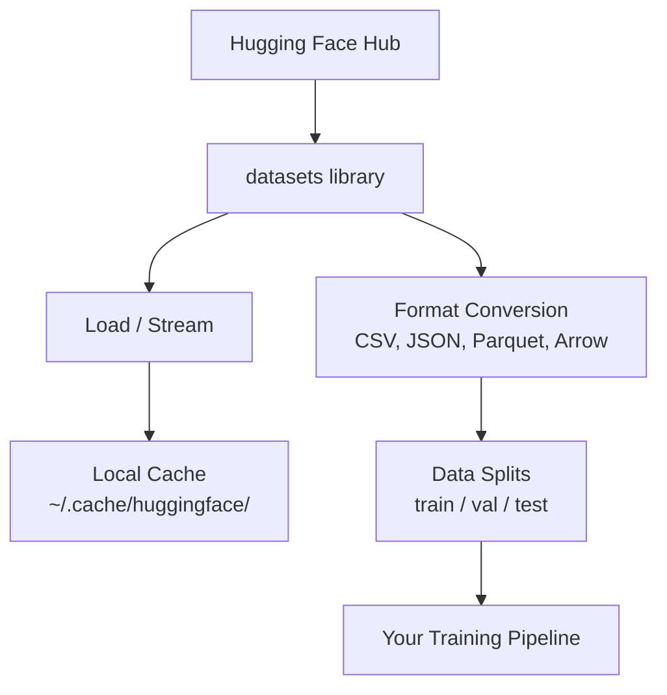

# إدارة البيانات

> البيانات هي الوقود. كيف يمكنك إدارتها، تعرّض أنك تستطيع السير بسرعة أكبر.

**Type:** Build
**Language:**بايثون
**Prerequisites:** Phase 0, Lesson 01
**Time:** ~45 分钟

## 學习目标
- استخدام معنى الوجه المُقبض`datasets`المكتبة 加载、流和缓存数据集
- في تحويل بين أشكال CSV、JSON、Parquet و Arrow، و تفسير استبدالها
- استخدام البذور العشوائية الثابتة 创建可复现的火车/验证/测试分区
- استخدام `.gitignore`、Git LFS أو DVC 管理大型 النموذج وملفات مجموعة البيانات

## 问题
كل مشروع AI يبدأ من البيانات. تحتاج إلى العثور على مجموعات بيانات. تحملها. تحويلها بين الصيغ.

## 概念


العناق في الوجه`datasets`المكتبة هي للعمل الذكاء الاصطناعي، وتحمل البيانات بالطريقة المعيارية.


```figure
s0-data-pipeline
```

## بناءها
### الخطوة 1: إعداد المجموعات المعلومات مكتبة

```bash
pip install datasets huggingface_hub
```

### 步骤 2: تحميل مجموعة بيانات

```python
from datasets import load_dataset

dataset = load_dataset("imdb")
print(dataset)
print(dataset["train"][0])
```

هذا سوف تنزيل IMDB  فيلم تعليقات المجموعة البيانية.`~/.cache/huggingface/datasets/`‫من المحتفظة ‫

### الخطوة 3: عملية معالجة مجموعات بيانات كبيرة

بعض مجموعات البيانات كبيرة جداً، لا يمكن وضعها بالكامل في القرص الصناعي.

```python
dataset = load_dataset("wikimedia/wikipedia", "20220301.en", split="train", streaming=True)

for i, example in enumerate(dataset):
    print(example["title"])
    if i >= 4:
        break
```

التدفق سوف يعطيك واحدة`IterableDataset`ستعمل في الصفوف حتى تصل إلى الوقت المحدد لتعاملها بغض النظر عن حجم مجموعة البيانات، استخدام الذاكرة دائما ثابتة.

### 步骤 4: أشكال مجموعة البيانات

`datasets`المكتبة 底层 باستخدام Apache Arrow. يمكنك تحويلها إلى أشكال أخرى حسب الحاجة.

```python
dataset = load_dataset("imdb", split="train")

dataset.to_csv("imdb_train.csv")
dataset.to_json("imdb_train.json")
dataset.to_parquet("imdb_train.parquet")
```

النموذج مقابل:

| Format | Size | Read Speed | Best For |
|--------|------|-----------|----------|
| CSV | 大 | 慢 | Human readability、spreadsheets |
| JSON | 大 | 慢 | APIs、nested data |
| Parquet | 小 | 快 | Analytics、columnar queries |
| Arrow | 小 | 最快 | In-memory processing（`datasets` 内部使用的格式） |

بالنسبة للعمل الذكاء الاصطناعي، فإن Parquet هو أفضل تنسيق التخزين.

### الخطوة 5: تقسيم البيانات

كل مشروع يحتوي على ثلاثة قسمات:

- **Train**:موديل من هنا تعلم ((عادة 80%)
- **Validation**: أنت في عملية التدريب  معالجة التقدم
- **Test**:التدريب 完成后的最终评估(عادة 10%)

بعض مجموعات البيانات تم تقسيمها مسبقاً

```python
dataset = load_dataset("imdb", split="train")

split = dataset.train_test_split(test_size=0.2, seed=42)
train_val = split["train"].train_test_split(test_size=0.125, seed=42)

train_ds = train_val["train"]
val_ds = train_val["test"]
test_ds = split["test"]

print(f"Train: {len(train_ds)}, Val: {len(val_ds)}, Test: {len(test_ds)}")
```

دائماً إعداد البذور لضمان إعادة التكاثر.

### 步骤 6:  下载并缓存模型

النماذج هي الملفات الكبيرة.`huggingface_hub`المكتبة 会处理 تنزيل و حفظ الاحتفاظ

```python
from huggingface_hub import hf_hub_download, snapshot_download

model_path = hf_hub_download(
    repo_id="sentence-transformers/all-MiniLM-L6-v2",
    filename="config.json"
)
print(f"Cached at: {model_path}")

model_dir = snapshot_download("sentence-transformers/all-MiniLM-L6-v2")
print(f"Full model at: {model_dir}")
```

النماذج ستخزن`~/.cache/huggingface/hub/`                                                                                                                                                                                                                                                              

### الخطوة 7: إصلاح الملفات الكبيرة

الوزن النموذجي ومجموعات بيانات كبيرة لا ينبغي أن تدخل git.

**Option A: .gitignore（最简单）**

```
*.bin
*.safetensors
*.pt
*.onnx
data/*.parquet
data/*.csv
models/
```

**Option B: Git LFS（在 git 中跟踪大型文件）**

```bash
git lfs install
git lfs track "*.bin"
git lfs track "*.safetensors"
git add .gitattributes
```

سيتم تخزين الملفات الفعلية في خادم منفصل على Git LFS في repo الخاص بك، وGitHub يقدم 1 جيجابايت  الحد المجانى‬

**Option C: DVC（data version control）**

```bash
pip install dvc
dvc init
dvc add data/training_set.parquet
git add data/training_set.parquet.dvc data/.gitignore
git commit -m "Track training data with DVC"
```

د.و.سي 会创建小型 `.dvc`المعلومات تم تخزينها بشكل شخصي في S3、GCS أو آخر خلفية تخزين عن بعد

| Approach | Complexity | Best For |
|----------|-----------|----------|
| .gitignore | 低 | 个人项目、可重新获取的 downloaded data |
| Git LFS | 中 | 通过 git 共享 model weights 的团队 |
| DVC | 高 | 可复现 experiments、大型 datasets、团队 |

对于本课程,`.gitignore`已足够── عندما تحتاج إلى تجربة دقيقة عبر الآلة 时, reuse DVC──

### الخطوة 8: أنماط التخزين

**Local storage**适用于小于 ~ 10 GB المجموعات البيانية。HF cache 会自动处理。

**Cloud storage** تطبق على محتوى أكبر، أو تحتاج إلى محتوى مشترك عبر الجهاز:

```python
import os

local_path = os.path.expanduser("~/.cache/huggingface/datasets/")

# s3_path = "s3://my-bucket/datasets/"
# gcs_path = "gs://my-bucket/datasets/"
```

يمكن أن يكون DVC مباشرة مع S3 و GCS 集集成:

```bash
dvc remote add -d myremote s3://my-bucket/dvc-store
dvc push
```

对于本课程,本地存储 足够──云存储会在您的远程GPU实例上调 时变得相关──

## 本课程使用的数据集

| Dataset | Lessons | Size | What It Teaches |
|---------|---------|------|----------------|
| IMDB | Tokenization、classification | 84 MB | Text classification 基础 |
| WikiText | Language modeling | 181 MB | Next-token prediction |
| SQuAD | QA systems | 35 MB | Question answering、spans |
| Common Crawl (subset) | Embeddings | 不定 | Large-scale text processing |
| MNIST | Vision basics | 21 MB | Image classification fundamentals |
| COCO (subset) | Multimodal | 不定 | Image-text pairs |

أنت الآن لا تحتاج إلى تنزيل كل هذه. كل فصل سوف يوضح ما يحتاجه.

## استخدمها
运行 النص المفيد 验证一切正常:

```bash
python code/data_utils.py
```

سوف تحميل مجموعة بيانات صغيرة تحويلها تقسيمها وتطبيع الموجة

## 交付 it
本课产出:
- `code/data_utils.py`- إمكانية تحميل البيانات والخزن المحفظي
- `outputs/prompt-data-helper.md`- يستخدم لمهمة البحث عن مجموعة بيانات مناسبة

## التدريب
1. استخدام `mrpc`إعدادات`glue`مجموعة بيانات,并检查前 5 个例子
2. التيار`c4`مجموعة بيانات،并统计 10 秒内 يمكن معالجتها كم من الأمثلة
3. تحويل مجموعة بيانات إلى "باركيت" ، وتحويل حجم الملف إلى CSV
4. استخدام بذور ثابتة 创建 70/15/15 قطار/ال/اختبار تقسيم,并验证尺寸

## 关键术语
| Term | What people say | What it actually means |
|------|----------------|----------------------|
| Dataset split | "Training data" | 一个命名 subset（train/val/test），用于 ML lifecycle 的不同阶段 |
| Streaming | "Load it lazily" | 从远程 source 逐行处理 data，而不下载完整 dataset |
| Parquet | "Compressed CSV" | 一种 columnar file format，针对 analytical queries 和 storage efficiency 优化 |
| Arrow | "Fast dataframe" | `datasets` library 内部使用的 in-memory columnar format，用于 zero-copy reads |
| Git LFS | "Git for big files" | 一个 extension，将大型文件存储在 git repo 外，同时在 version control 中保留 pointers |
| DVC | "Git for data" | 一个用于 datasets 和 models 的 version control system，可与 cloud storage 集成 |
| Cache | "Already downloaded" | 之前获取过的 data 的本地副本，默认存储在 ~/.cache/huggingface/ |
