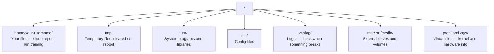

# 面向 AI من لينكس

> معظم الذكاء الاصطناعي يعمل على لينكس عليك أن تتعلم كيف لا يمكن أن تكون عالقة

**类型：**學习
**语言：**-أجل
**先修要求：**المرحلة 0، الدروس 01
**时间：**~ 30 دقيقة

## 學习目标

- 浏览 Linux file system,并从命令行执行基本文件操作
- استخدام `chmod`和 `chown` إدارة الإذنات الملفية، لتحلّل أخطاء "الإذن رفض"
- استخدام `apt`قم بتثبيت حزم النظام،并为 AI 工作设置一台新GPU盒
- 识别 MacOS 转换到Linux 时,开发者在远程机器上常踩的坑

## 问题

أنت في macOS أو Windows 上开发── ولكن بمجرد أن تصل إلى صندوق GPU السحاب‬ استئجار مثال Lambda، أو تشغيل جهاز EC2, سوف تدخل Ubuntu── المحطة هي واجهتك الوحيدة‬ بدون Finder، بدون Explorer، بدون GUI‬ إذا لم تتمكن من التنفيذ من أمر تشغيل نظام الملفات‬ تنصيب الحزم‬ إدارة العمليات، سوف تجد على جانب واحد                                                                                                                                                                                                             

هذا هو دليل على البقاء. إنه يغطى فقط ما تحتاجه من أجل القيام بعمل الذكاء الاصطناعي على أجهزة لينكس بعيدة.

## نظام الملفات 布局

لينكس وضع كل شيء في الجذر واحد`/`لا يوجد`C:\`أو`/Volumes`你实际会接触的目录:



دليل منزلك هو`~`أو`/home/your-username`تقريبا كل العمليات تحدث هنا

## ضرورة القيادة

أدناه 15 أمر تغطي عملية عملك في مربع GPU بعيد

###  تحرك الموقع

```bash
pwd                         # Where am I?
ls                          # What's here?
ls -la                      # What's here, including hidden files with details?
cd /path/to/dir             # Go there
cd ~                        # Go home
cd ..                       # Go up one level
```

### 文件和目录

```bash
mkdir my-project            # Create a directory
mkdir -p a/b/c              # Create nested directories in one shot

cp file.txt backup.txt      # Copy a file
cp -r src/ src-backup/      # Copy a directory (recursive)

mv old.txt new.txt          # Rename a file
mv file.txt /tmp/           # Move a file

rm file.txt                 # Delete a file (no trash, it's gone)
rm -rf my-dir/              # Delete a directory and everything inside
```

`rm -rf`هو دائم. لا يوجد إزالة.

### 读取文件

```bash
cat file.txt                # Print entire file
head -20 file.txt           # First 20 lines
tail -20 file.txt           # Last 20 lines
tail -f log.txt             # Follow a log file in real time (Ctrl+C to stop)
less file.txt               # Scroll through a file (q to quit)
```

### 搜索

```bash
grep "error" training.log           # Find lines containing "error"
grep -r "learning_rate" .           # Search all files in current directory
grep -i "cuda" config.yaml          # Case-insensitive search

find . -name "*.py"                 # Find all Python files under current dir
find . -name "*.ckpt" -size +1G     # Find checkpoint files larger than 1GB
```

## الإذن

كل ملف في لينكس لديه مالك و بعض الافصاحات. عندما لا يمكن تنفيذ النصوص أو عندما لا يمكنك كتابة في دليل ما، سوف تواجه هذه المشكلة.

```bash
ls -l train.py
# -rwxr-xr-- 1 user group 2048 Mar 19 10:00 train.py
#  ^^^             owner permissions: read, write, execute
#     ^^^          group permissions: read, execute
#        ^^        everyone else: read only
```

常见修复方式:

```bash
chmod +x train.sh           # Make a script executable
chmod 755 deploy.sh         # Owner: full, others: read+execute
chmod 644 config.yaml       # Owner: read+write, others: read only

chown user:group file.txt   # Change who owns a file (needs sudo)
```

عندما يُعطى بعض النصائح "الذات السماح رفض"`chmod +x`أو`sudo`يمكن إصلاح معظم الحالات

## إدارة الحزمة (مستحقة)

Ubuntu 使用 `apt`هذا هو طريقة تثبيت البرمجيات على مستوى النظام

```bash
sudo apt update             # Refresh the package list (always do this first)
sudo apt install -y htop    # Install a package (-y skips confirmation)
sudo apt install -y build-essential  # C compiler, make, etc. Needed by many Python packages
sudo apt install -y tmux    # Terminal multiplexer (keep sessions alive after disconnect)

apt list --installed        # What's installed?
sudo apt remove htop        # Uninstall
```

ستجد في صندوق جديد من GPU عادةً ما يتم تركيبها على الحزم:

```bash
sudo apt update && sudo apt install -y \
    build-essential \
    git \
    curl \
    wget \
    tmux \
    htop \
    unzip \
    python3-venv
```

## المستخدمون و sudo

أنت عادة مع المستخدم العادي 登录. بعض العمليات تحتاج إلى جذور.

```bash
whoami                      # What user am I?
sudo command                # Run a single command as root
sudo su                     # Become root (exit to go back, use sparingly)
```

في حالات الجيبو السحابية، عادة ما تكون المستخدم الوحيد، ولديك بالفعل إمكانية الوصول إلى sudo. لا تنطلق كل شيء مع الجذر.

## العمليات و النظام

عندما تتدربين أو تحتاجين للتحقق من المحتويات التي تعمل:

```bash
htop                        # Interactive process viewer (q to quit)
ps aux | grep python        # Find running Python processes
kill 12345                  # Gracefully stop process with PID 12345
kill -9 12345               # Force kill (use when graceful doesn't work)
nvidia-smi                  # GPU processes and memory usage
```

نظام إدارة الخدمات ((أشباح الخلفية) ・・・ إذا كنت تعمل على خوادم الإستنتاج، سوف تستخدمها:

```bash
sudo systemctl start nginx          # Start a service
sudo systemctl stop nginx           # Stop it
sudo systemctl restart nginx        # Restart it
sudo systemctl status nginx         # Check if it's running
sudo systemctl enable nginx         # Start automatically on boot
```

## 磁盘空间

مساحة القرص الصوتية من مربعات الجيبو عادة محدودة.

```bash
df -h                       # Disk usage for all mounted drives
df -h /home                 # Disk usage for /home specifically

du -sh *                    # Size of each item in current directory
du -sh ~/.cache             # Size of your cache (pip, huggingface models land here)
du -sh /data/checkpoints/   # Check how big your checkpoints are

# Find the biggest space hogs
du -h --max-depth=1 / 2>/dev/null | sort -hr | head -20
```

常见省空间方式:

```bash
# Clear pip cache
pip cache purge

# Clear apt cache
sudo apt clean

# Remove old checkpoints you don't need
rm -rf checkpoints/epoch_01/ checkpoints/epoch_02/
```

## شبكات

سوف تقوم بتنزيل النماذج من الطلبات، وترسل الملفات، وترسل ملفات إدارة التطبيقات.

```bash
# Download files
wget https://example.com/model.bin                   # Download a file
curl -O https://example.com/data.tar.gz              # Same thing with curl
curl -s https://api.example.com/health | python3 -m json.tool  # Hit an API, pretty-print JSON

# Transfer files between machines
scp model.bin user@remote:/data/                     # Copy file to remote machine
scp user@remote:/data/results.csv .                  # Copy file from remote to local
scp -r user@remote:/data/checkpoints/ ./local-dir/   # Copy directory

# Sync directories (faster than scp for large transfers, resumes on failure)
rsync -avz --progress ./data/ user@remote:/data/
rsync -avz --progress user@remote:/results/ ./results/
```

لأي نقل كبير، الاستخدام الأولوي`rsync`بدلاً من ذلك`scp`                                                                                                                                                                                                                                                              

## keep Sessions 存活

عندما تصل إلى صندوق بعيد، و يقتل محمولك تدريبك على التشغيل.

```bash
tmux new -s train           # Start a new session named "train"
# ... start your training, then:
# Ctrl+B, then D            # Detach (training keeps running)

tmux ls                     # List sessions
tmux attach -t train        # Reattach to session

# Inside tmux:
# Ctrl+B, then %            # Split pane vertically
# Ctrl+B, then "            # Split pane horizontally
# Ctrl+B, then arrow keys   # Switch between panes
```

长时间训练任务总是放在tmux 里运行――总是如此――

## جهة المستخدم Windows WSL2

إذا كنت على ويندوز، وWSL2 يمكن أن توفر بيئة لينكس الحقيقية دون الحاجة إلى إزالة التشغيل المزدوج.

```bash
# In PowerShell (admin)
wsl --install -d Ubuntu-24.04

# After restart, open Ubuntu from Start menu
sudo apt update && sudo apt upgrade -y
```

WSL2 运行真实Linux kernel──本课中的所有内容都能在其中工作──从WSL 内部看,你的Windows文件 位于 `/mnt/c/Users/YourName/`.

مع مرور GPU 需要 Windows 侧安装 NVIDIA驱动器──安装 Windows NVIDIA驱动器(不是 Linux驱动器),CUDA 就会在 WSL2 内可用──

## حصلت على: macOS إلى لينكس

إذا كنت من macOS، هذه الأشياء سوف تحصل على:

| macOS | Linux | 说明 |
|-------|-------|-------|
| `brew install` | `sudo apt install` | package names 有时不同。`brew install htop` 和 `sudo apt install htop` 效果相同，但 `brew install readline` 和 `sudo apt install libreadline-dev` 不同。 |
| `open file.txt` | `xdg-open file.txt` | 但远程 box 上通常没有 GUI。使用 `cat` 或 `less`。 |
| `pbcopy` / `pbpaste` | 不可用 | SSH 上不存在 pipe 到/来自 clipboard 的能力。 |
| `~/.zshrc` | `~/.bashrc` | macOS 默认使用 zsh。大多数 Linux servers 使用 bash。 |
| `/opt/homebrew/` | `/usr/bin/`, `/usr/local/bin/` | Binaries 位于不同位置。 |
| `sed -i '' 's/a/b/' file` | `sed -i 's/a/b/' file` | macOS sed 需要在 `-i` 后加一个空字符串。Linux 不需要。 |
| Case-insensitive filesystem | Case-sensitive filesystem | 在 Linux 上，`Model.py` 和 `model.py` 是两个不同文件。 |
| Line endings `\n` | Line endings `\n` | 相同。但 Windows 使用 `\r\n`，会破坏 bash scripts。运行 `dos2unix` 修复。 |

## 快速参考卡

```
Navigation:     pwd, ls, cd, find
Files:          cp, mv, rm, mkdir, cat, head, tail, less
Search:         grep, find
Permissions:    chmod, chown, sudo
Packages:       apt update, apt install
Processes:      htop, ps, kill, nvidia-smi
Services:       systemctl start/stop/restart/status
Disk:           df -h, du -sh
Network:        curl, wget, scp, rsync
Sessions:       tmux new/attach/detach
```


```figure
s0-process-fork
```

## التدريب

1. SSH إلى أي آلة لينكس ((( أو فتح WSL2),并导航 إلى دليل منزلك── إنشاء مجلد مشروع، بينها استخدام `touch`创建三个空文件, ثم استخدم `ls -la`-أخرجهم
2. معتدلة`htop`, إشغله , و إكتشاف أي عملية تستخدم أكثر ذاكرة
3. إطلاق جلسة التداول،`sleep 300`,فقط ,أخرج من جلسات , ثم أعيد التواصل
4. استخدام `df -h`检查可用磁盘空间, ثم استخدام `du -sh ~/.cache/*`找出缓存 中占空间的内容──
5. استخدام `scp`لنقل ملف من آلة محلية إلى آلة بعيدة، ثم استخدم`rsync`عمل نفس الإرسال، ومقارنة التجربة.
