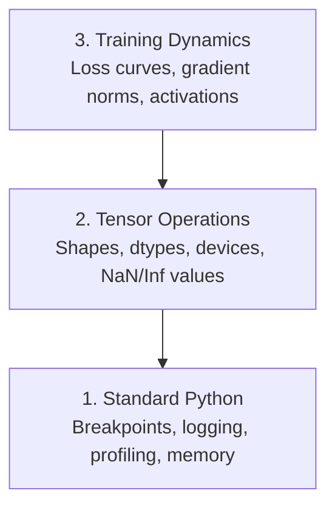

# إصلاح الأخطاء و تحديد الملفات الشخصية

> أسوأ حشرات الذكاء الاصطناعي لا تتحطم. تتدرب بصمت على البيانات القذرة وتبلغ عن منحنى خسارة جميل.

**类型：**الإنشاء
**语言：**بايثون
**先修要求：**الدروس 1 ((بيئة البيئة) ، الأساسية PyTorch 熟悉度
**时间：**~ 60 دقيقة

## 學习目标

- استخدام شروط `breakpoint()`和 `debug_print`في تدريب وسط طريق فحص أشكال الجهازات
- استخدام `cProfile`.`line_profiler`和 `tracemalloc`الملفات التدريبية، ومعرفة العلاقات
- 检测常见 أخطاء الذكاء الاصطناعي: عدم مطابقة الشكل
- وضع TensorBoard 来可视化损失曲线、体重 histograms 和梯度分布

## 问题

طريقة فشل رمز الذكاء الاصطناعي مختلفة عن الرمز العادي. سوف يحتوي تطبيق الويب على آثار الهيكل. سوف يبدأ عملية التدريب على 8 ساعات، ثم يحرق 200 دولار من الوقت في جهاز التلفزيون. ثم ينتج نموذج يتنبأ معدل قيمة كل إدخال.`.detach()`أو التسميات تخرج إلى الميزات

تحتاج إلى أدوات التحليل، في هذه الصمت الفاشل ضيع وقتك والحساب قبل التقاطها.

## 概念

إصلاح الذكاء الاصطناعي مقسم إلى ثلاثة مستويات:



معظم الناس يقفزون مباشرة إلى الطبقة الثالثة ولكن 80% من حشرات الذكاء الاصطناعي في الطبقة الأولى والثانية


```figure
s0-flame-hot
```

## بناءها

### الجزء الأول: طبع إزالة الخطأ ((إنه، إنه فعال)

إزالة الخطأ في الطباعة غالبا ما يتم تجاهلها ولكن لا ينبغي أن يكون كذلك. بالنسبة للرمز التنسوري، تصريح الطباعة المستهدف غالبا ما يفوق المعدل التدريجي، لأنك تحتاج مرة واحدة لرؤية الأشكال والأشكال ومجموعات القيم.

```python
def debug_print(name, tensor):
    print(f"{name}: shape={tensor.shape}, dtype={tensor.dtype}, "
          f"device={tensor.device}, "
          f"min={tensor.min().item():.4f}, max={tensor.max().item():.4f}, "
          f"mean={tensor.mean().item():.4f}, "
          f"has_nan={tensor.isnan().any().item()}")
```

في كل عملية مشبوهة بعد استخدامها بعد العثور على البوغ

### الجزء الثاني: إزالة خطط Python ((pdb 和 نقطة الانقطاع)

إضافة إضافية في عمل الذكاء الاصطناعي تم تقليل تقديرها.`breakpoint()`放入训练循环,并交互式检查门子──

```python
def training_step(model, batch, criterion, optimizer):
    inputs, labels = batch
    outputs = model(inputs)
    loss = criterion(outputs, labels)

    if loss.item() > 100 or torch.isnan(loss):
        breakpoint()

    loss.backward()
    optimizer.step()
```

عندما يقوم إزالة الحذاءات بوقفها، هناك أوامر مفيدة:

- `p outputs.shape`检查 شكل
- `p loss.item()`查看 قيمة الخسارة
- `p torch.isnan(outputs).sum()`统计 نون
- `p model.fc1.weight.grad`检查 تراجع
- `c`continu،`q`退出

هذا هو التحليل المشروط. فقط في النظرة لا تتوقف.

### الجزء الثالث: تسجيلات Python

عندما تقوم بتحريف الوضع 超出快速检查范围时، استخدم تسجيل الحسابات بدل بيانات الطباعة‬

```python
import logging

logging.basicConfig(
    level=logging.INFO,
    format="%(asctime)s [%(levelname)s] %(message)s",
    handlers=[
        logging.FileHandler("training.log"),
        logging.StreamHandler()
    ]
)
logger = logging.getLogger(__name__)

logger.info("Starting training: lr=%.4f, batch_size=%d", lr, batch_size)
logger.warning("Loss spike detected: %.4f at step %d", loss.item(), step)
logger.error("NaN loss at step %d, stopping", step)
```

تسجيل الدخول  توفر علامات زمنية  مستويات الدرجة والإصدار الملفات‬ عندما يتم تدريبها في الساعة الثالثة صباحاً، عندما تفشل، ما تريد هو ملف السجلات، وليس إصدار المحطة التي خرجت من الشاشة‬‬‬‬‬‬‬‬‬‬‬‬‬‬‬‬‬‬‬‬‬‬‬‬‬‬‬‬‬‬‬‬‬‬‬‬‬‬‬‬‬‬‬‬‬‬‬‬‬‬‬‬‬‬‬‬‬‬‬‬‬‬‬‬‬‬‬‬‬‬‬‬‬‬‬‬‬‬‬‬‬‬‬‬‬‬‬‬‬‬‬‬‬‬‬‬‬‬‬‬‬‬‬‬‬‬‬‬‬‬‬‬‬‬‬‬‬‬‬‬‬‬‬‬‬‬‬‬‬‬‬‬‬‬‬‬‬‬‬‬‬‬‬‬‬‬‬‬‬‬‬‬‬‬‬‬‬‬‬‬‬‬‬‬‬‬‬‬‬‬‬‬‬‬‬‬‬‬‬‬‬‬‬‬‬‬‬‬‬‬‬‬‬‬‬‬‬‬‬‬‬‬‬‬‬‬‬‬‬‬‬‬‬‬‬‬‬‬‬‬‬‬‬‬‬‬‬‬‬‬‬‬‬‬‬‬‬‬‬‬‬‬‬‬‬‬‬‬‬‬‬‬‬‬‬‬‬‬‬‬‬‬‬‬‬‬‬‬‬‬‬‬‬‬‬‬‬‬‬‬‬‬‬‬‬‬‬‬‬‬‬‬‬‬‬‬‬‬‬‬‬‬‬‬‬‬‬‬‬‬‬‬‬‬‬‬‬‬‬‬‬‬‬‬‬‬‬‬‬‬‬‬‬‬‬‬‬‬‬‬‬‬‬‬‬‬‬‬‬‬‬‬‬‬‬‬‬‬‬‬‬‬‬‬‬‬‬‬‬‬‬‬‬‬‬‬‬‬‬‬‬‬‬‬‬‬‬‬‬‬‬‬‬‬‬‬‬‬‬‬‬‬‬‬‬‬‬‬‬‬‬‬‬‬‬‬‬‬‬‬‬‬‬‬‬‬‬‬‬‬‬‬‬‬‬‬‬‬‬‬‬‬

### الجزء الرابع:

تعرف الوقت الذي يقضيه هو الخطوة الأولى للتحسين

```python
import time

class Timer:
    def __init__(self, name=""):
        self.name = name

    def __enter__(self):
        self.start = time.perf_counter()
        return self

    def __exit__(self, *args):
        elapsed = time.perf_counter() - self.start
        print(f"[{self.name}] {elapsed:.4f}s")

with Timer("data loading"):
    batch = next(dataloader_iter)

with Timer("forward pass"):
    outputs = model(batch)

with Timer("backward pass"):
    loss.backward()
```

常见发现: تحميل البيانات 占训练时间的60%──修复方式在您的 DataLoader中设置 `num_workers > 0`بدلاً من تحويل أسرع من GPU

### الجزء 5: cProfile 和 line_profiiler

عندما تحتاج إلى المزيد من المعلومات من التوقيت اليدوي:

```bash
python -m cProfile -s cumtime train.py
```

هذا سيظهر كل مكالمة وظيفة، وفقًا للوقت التراكمي 排序── إذا كان يجب أن يتم تحديد الملفات الشخصية:

```bash
pip install line_profiler
```

```python
@profile
def train_step(model, data, target):
    output = model(data)
    loss = F.cross_entropy(output, target)
    loss.backward()
    return loss

# Run with: kernprof -l -v train.py
```

### الجزء السادس: تحليل الذاكرة

#### استخدام tracemalloc 查看 ذاكرة CPU

```python
import tracemalloc

tracemalloc.start()

# your code here
model = build_model()
data = load_dataset()

snapshot = tracemalloc.take_snapshot()
top_stats = snapshot.statistics("lineno")
for stat in top_stats[:10]:
    print(stat)
```

#### استخدام ذاكرة_ملفات تعريف 查看 ذاكرة CPU

```bash
pip install memory_profiler
```

```python
from memory_profiler import profile

@profile
def load_data():
    raw = read_csv("data.csv")       # watch memory jump here
    processed = preprocess(raw)       # and here
    return processed
```

استخدام`python -m memory_profiler your_script.py`运行,以查看逐行 استخدام الذاكرة

#### استخدام PyTorch 查看 ذاكرة GPU

```python
import torch

if torch.cuda.is_available():
    print(torch.cuda.memory_summary())

    print(f"Allocated: {torch.cuda.memory_allocated() / 1e9:.2f} GB")
    print(f"Cached: {torch.cuda.memory_reserved() / 1e9:.2f} GB")
```

عندما تلتقي بـ (أوم)

1. 减小批量尺寸 ((永远是第一个要尝试的)
2. استخدام `torch.cuda.empty_cache()`释放 الذاكرة المتخزنة
3. للمنتجات المتوسطة الكبيرة استخدام`del tensor`, ثم调用`torch.cuda.empty_cache()`
4. استخدام دقة مختلطة`torch.cuda.amp`) سوف يقلل استخدام الذاكرة
5. للنماذج العميقة جدا استخدام التفتيش التدريجي

### الجزء 7: 常见AI حشرات وكيفية القبض عليها

#### عدم مطابقة الشكل

أسوأ أشكال حشرة في العجلة هي`[batch, features]`لكن النموذج 期望 `[batch, channels, height, width]`.

```python
def check_shapes(model, sample_input):
    print(f"Input: {sample_input.shape}")
    hooks = []

    def make_hook(name):
        def hook(module, inp, out):
            in_shape = inp[0].shape if isinstance(inp, tuple) else inp.shape
            out_shape = out.shape if hasattr(out, "shape") else type(out)
            print(f"  {name}: {in_shape} -> {out_shape}")
        return hook

    for name, module in model.named_modules():
        hooks.append(module.register_forward_hook(make_hook(name)))

    with torch.no_grad():
        model(sample_input)

    for h in hooks:
        h.remove()
```

باستخدام مجموعة عينات 运行一次──它会映射模型 中每一次形状转变──

#### خسارة

فقدان النفط يعبر عن بعض الأشياء التي تفجر

- معدل التعلم 太高
- الخسارة القياسية 中除以零
- لـ 0 أو 0
- الـ RNN 中 تراجع  انفجار

```python
def detect_nan(model, loss, step):
    if torch.isnan(loss):
        print(f"NaN loss at step {step}")
        for name, param in model.named_parameters():
            if param.grad is not None:
                if torch.isnan(param.grad).any():
                    print(f"  NaN gradient in {name}")
                if torch.isinf(param.grad).any():
                    print(f"  Inf gradient in {name}")
        return True
    return False
```

#### تسرب البيانات

نموذجك في مجموعة الاختبارات يصل إلى 99٪ دقة.

```python
def check_data_leakage(train_set, test_set, id_column="id"):
    train_ids = set(train_set[id_column].tolist())
    test_ids = set(test_set[id_column].tolist())
    overlap = train_ids & test_ids
    if overlap:
        print(f"DATA LEAKAGE: {len(overlap)} samples in both train and test")
        return True
    return False
```

أيضاً يجب أن تحقق التسرب الزمني: Using futur data prediction past── تقسيم 前先按时间打印 排序──

#### آلة خاطئة

الجهازات المضغوطة على جهاز "CPU vs GPU" سوف تؤدي إلى أخطاء في الوقت التشغيلي. ولكن في بعض الأحيان يكون الجهاز المضغوط يتوقف في CPU، بينما كل شيء آخر على GPU، التدريب فقط يعمل ببطء.

```python
def check_devices(model, *tensors):
    model_device = next(model.parameters()).device
    print(f"Model device: {model_device}")
    for i, t in enumerate(tensors):
        if t.device != model_device:
            print(f"  WARNING: tensor {i} on {t.device}, model on {model_device}")
```

### الجزء الثامن: TensorBoard 基础

تينسربورد سوف تظهر ما حدث داخل عملية التدريب

```bash
pip install tensorboard
```

```python
from torch.utils.tensorboard import SummaryWriter

writer = SummaryWriter("runs/experiment_1")

for step in range(num_steps):
    loss = train_step(model, batch)

    writer.add_scalar("loss/train", loss.item(), step)
    writer.add_scalar("lr", optimizer.param_groups[0]["lr"], step)

    if step % 100 == 0:
        for name, param in model.named_parameters():
            writer.add_histogram(f"weights/{name}", param, step)
            if param.grad is not None:
                writer.add_histogram(f"grads/{name}", param.grad, step)

writer.close()
```

أطلقها:

```bash
tensorboard --logdir=runs
```

يجب أن نتدبر ما:

- **Loss 不下降**:معدل التعلم قل جداً، أو بنية النموذج  مشكلة
- **Loss 剧烈震荡**: معدل التعلم 太高
- **Loss 变成 NaN**: عدم الاستقرار العددي ((见上的 NaN 部分)
- **Train loss 下降，val loss 上升**التكيف:
- **Weight histograms 坍缩到零**:تراجعات تختفي
- **Gradient histograms 爆炸**: تحتاج إلى قطع التراجع

### الجزء 9: إصلاح رمز VS

لـ "تصديق التواصل"`launch.json`配置 VS رمز:

```json
{
    "version": "0.2.0",
    "configurations": [
        {
            "name": "Debug Training",
            "type": "debugpy",
            "request": "launch",
            "program": "${file}",
            "console": "integratedTerminal",
            "justMyCode": false
        }
    ]
}
```

点击 gutter 设置 breakpoints──使用变量表格 检查 tensor properties──Debug Console 让你在执行中途运行任意Python表达式──

هذا مفيد جداً في رؤية خط الأنابيب المسبقة لمعالجة البيانات بشكل تدريجي، خاصة عندما تريد رؤية كل تحول.

## استخدمها

يمكن التقاط معظم أخطاء الذكاء الاصطناعي:

1. **训练前**:用 العينة اللحظة 运行 `check_shapes` تجربة المدخلات والإخراجات                                                                                                                                                                                                                                                                                                                                                                                                                                                                                                                  
2. **前 10 步**: لخسارة خروج و تراجعات استخدام `debug_print` أكد عدم وجود NaN، و قيم في حدود معقولة
3. **训练期间**: سجل فقدان ‧عدد التعلم و معايير التراجع‬‬‬‬‬‬‬‬‬‬‬‬‬‬‬‬‬‬‬‬‬‬‬‬‬‬‬‬‬‬‬‬‬‬‬‬‬‬‬‬‬‬‬‬‬‬‬‬‬‬‬‬‬‬‬‬‬‬‬‬‬‬‬‬‬‬‬‬‬‬‬‬‬‬‬‬‬‬‬‬‬‬‬‬‬‬‬‬‬‬‬‬‬‬‬‬‬‬‬‬‬‬‬‬‬‬‬‬‬‬‬‬‬‬‬‬‬‬‬‬‬‬‬‬‬‬‬‬‬‬‬‬‬‬‬‬‬‬‬‬‬‬‬‬‬‬‬‬‬‬‬‬‬‬‬‬‬‬‬‬‬‬‬‬‬‬‬‬‬‬‬‬‬‬‬‬‬‬‬‬‬‬‬‬‬‬‬‬‬‬‬‬‬‬‬‬‬‬‬‬‬‬‬‬‬‬‬‬‬‬‬‬‬‬‬‬‬‬‬‬‬‬‬‬‬‬‬‬‬‬‬‬‬‬‬‬‬‬‬‬‬‬‬‬‬‬‬‬‬‬‬‬‬‬‬‬‬‬‬‬‬‬‬‬‬‬‬‬‬‬‬‬‬‬‬‬‬‬‬‬‬‬‬‬‬‬‬‬‬‬‬‬‬‬‬‬‬‬‬‬‬‬‬‬‬‬‬‬‬‬‬‬‬‬‬‬‬‬‬‬‬‬‬‬‬‬‬‬‬‬‬‬‬‬‬‬‬‬‬‬‬‬‬‬‬‬‬‬‬‬‬‬‬‬‬‬‬‬‬‬‬‬‬‬‬‬‬‬‬‬‬‬‬‬‬‬‬‬‬‬‬‬‬‬‬‬‬‬‬‬‬‬‬‬‬‬‬‬‬‬‬‬‬‬‬‬‬‬‬‬‬‬‬‬‬‬‬‬‬‬‬‬‬‬‬‬‬‬‬‬‬‬‬‬‬‬‬‬‬‬‬‬‬‬‬‬‬‬‬‬‬‬‬‬‬‬‬‬‬‬‬‬‬‬‬‬‬‬‬‬‬‬‬‬‬‬‬‬‬‬‬‬‬‬‬‬‬‬‬‬‬‬
4. **出问题时**: في نقطة الفشل وضع `breakpoint()`◊交互式检查 Tensor‬
5. **针对性能**:计时数据 loading、前进、后退通行──若接近 OOM,则配置存储──

## 交付 it

运行 النصوص المعدة الأدوات للتحليل:

```bash
python phases/00-setup-and-tooling/12-debugging-and-profiling/code/debug_tools.py
```

查看 `outputs/prompt-debug-ai-code.md`، واحدة منها تساعد على تشخيص حشرات محددة عن الذكاء الاصطناعي

## التدريب

1. 运行 `debug_tools.py`, قراءة كل قسم من نتائجها. تعديل النموذج الوهمي .
2. استخدام `cProfile`الملفات المتحركة، وتعرف أبطأ وظيفة
3. استخدام `tracemalloc`找出数据 loading pipeline 中哪一行分配了最多的存储量──
4. لـ إعداد تنسوربورد، ومعرفة النموذج
5. في حلقة التدريب داخل استخدام`breakpoint()`◊ تمرين من إزالة الخطأ  تحقق أشكال الجهازات و قيم التراجع
