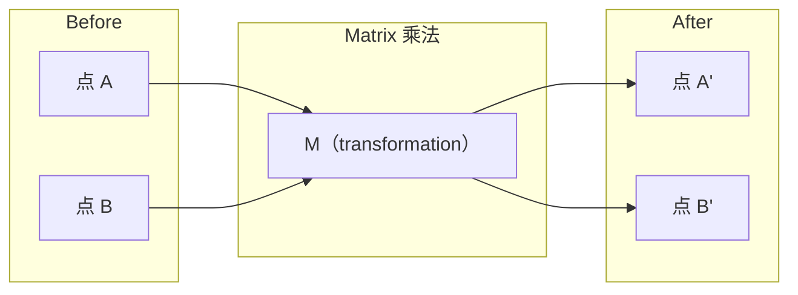
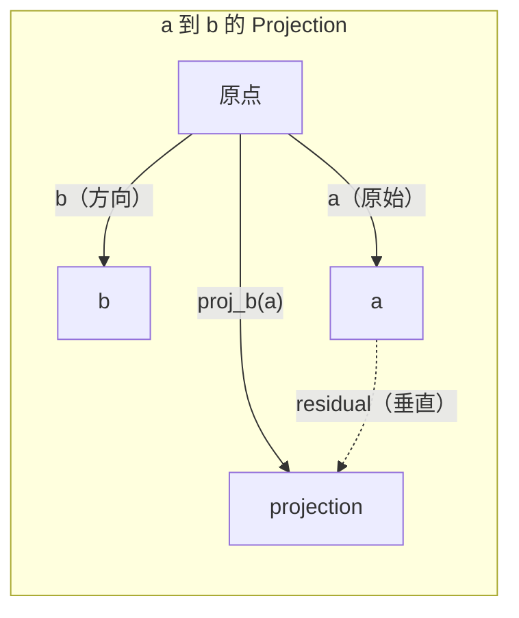

# الجبر الخطى 直觉

> كل نموذج من الذكاء الاصطناعي يرتدي قبعة جميلة

**类型：**學习
**语言：**(بايتون) ، (جوليا)
**先修要求：**المرحلة 0
**时间：**~ 60 دقيقة

## 學习目标

- في بايثون من صفر لتحقيق المتجه ومصفوفة 运算(加法dot、 product、Matrix ضرب)
- من منظور نظري شرح نقطة المنتج، الإرشادات وعملية غرام-شميدت في ما تفعل
- استخدام تخفيض الصفحة 判断一组 استقلالية خطية للجهاز المتجه رتب 和 الأساس
- لنقوم بتوصيل مفهوم الجبر الخطى إلى تطبيقاتهم في الذكاء الاصطناعي: التوابل، نقاط الاهتمام و LoRA

## 问题

打开任意一篇 ML 论文──在第一页之内,你就会看到矢量、矩阵、点产品和转化──没有线性代数直觉时,这些只是符号──有它,你就能看到神经网络 实际在做什么-- 在空间中移动点──

أنت لا تحتاج إلى أن تكون عالم رياضيات. أنت تحتاج إلى رؤية ما تعنيه هذه العمليات في الهندسة، ثم كتابتها بنفسك في الكود.

## 概念

### المتجهات هو نقطة ((إيجهة)

المتجهات هي مجرد قائمة رقمية ولكن هذه الأرقام لها معنى -- إنها مقعد في الفضاء

**2D Vector [3, 2]：**

| x | y | 点 |
|---|---|-------|
| 3 | 2 | 这个 Vector 从原点 (0,0) 指向平面上的 (3, 2) |

هذا المتجه من الحجم 为 مربع(3^2 + 2^2) = مربع(13), الاتجاه إلى الأعلى و إلى اليمين

في الـ AI، ويكتور يظهر كل شيء:
- واحد كلمة → واحد يحتوي على 768 个数字的矢量(إنه في إضافة 空间中的含义)
- واحد الصور → متجه يتكون من ملايين الصور القيمة
- واحد مستخدم → واحد تعبير أفضل متجه

### المصفوفات هي التحولات

المصفوفة سوف تحويل متجه إلى متجه آخر. يمكن أن تدور أو تتوسع أو تنمو أو تنبعث.



في الاصطناع الذكري، ماتريكس هو النموذج:
- أوزان الشبكة العصبية → 将 input 转换为 output
- نقاط الاهتمام → قرر أن يتركز على ما
- إدخالات → 将词映射到 متريشيات المتجهات

### منتج النقطة 衡量相似性

نسبة النقاط من الجهازين ستخبرك بأنها تشبه بعضها البعض

```
a · b = a₁×b₁ + a₂×b₂ + ... + aₙ×bₙ

方向相同：      a · b > 0  （相似）
相互垂直：      a · b = 0  （无关）
方向相反：      a · b < 0  （不相似）
```

هذا هو طريقة عمل محركات البحث ✓ نظام التوصيل و RAG ✓ - العثور على النقاط المنتجة ✓ متجهات أعلى

### الاستقلال الخطوي

إذا لم يكن هناك أي متجه في المجموعة يمكن أن يكتب في مجموعة من المتجهات الأخرى، فإن هذه المتجهات هي مستقلة خطيا. إذا كان v1、v2、v3 مستقلة، فإنها ستستوي على مساحة ثلاثية الأبعاد.

انها ذات أهمية بالنسبة لذكاء الاصطناعي: يجب أن يكون لديك المصفوفة المصفوفة عمودات مستقلة خطيا. إذا كانت المصفوفتين متواصلة تماماً، النموذج لن يستطيع التمييز بين تأثيراتها الخاصة. وهذا سيؤدي إلى التعددية في التراجع.

**具体示例：**

```
v1 = [1, 0, 0]
v2 = [0, 1, 0]
v3 = [2, 1, 0]   # v3 = 2*v1 + v2
```

v1 و v2 هي مستقلة من -- 二者都不是另一个标量倍数或组合──但 v3 = 2*v1 + v2,所以 {v1, v2, v3} هي مجموعة متعلقة── هذه الجهازات الثلاثة كلها تقع في خط xy── مهما كنت تجمعها،都不能达到 [0, 0, 1]── لديك ثلاثة الجهازات، ولكن فقط اثنين من الابعاد الحرة──

في مجموعة البيانات: إذا كان ميزة_3 = 2* ميزة_1 + ميزة_2, إضافة ميزة_3 لن تعطى نموذج ةأتي بأي معلومات جديدة.

### الأساس و الرتب

الأساس هو مجموعة من أصغر المتجهات المستقلة خطيا، وهي تمتد على الفضاء بأكمله.

الأساس القياسي لـ 3D 空间 هو {[1,0,0], [0,1,0], [0,0,1]}──لكن أي ثلاثة متجهات مستقلة في 3D 都能构成有效基础──选择基础 就是在选择坐标系──

صف المصفوف = عدد الأعمدة المستقلة خطيا = عدد الصفوف المستقلة خطيا ً♦ إذا كان الرتب < min(الصفوف ، الصفوف) ، هذا المصفوف هو العدلة النقصية ً♦ هذا يعني:
- النظام لديه العديد من الحلول
- تحويلات في فقدان المعلومات
- المصفوفة غير قادرة على الانعكاس

| 情况 | Rank | 对 ML 的含义 |
|-----------|------|---------------------|
| Full rank (rank = min(m, n)) | 最大可能值 | 存在唯一 least-squares solution。Model well-conditioned。 |
| Rank deficient (rank < min(m, n)) | 低于最大值 | Features 冗余。有无穷多个 weight solutions。需要 regularization。 |
| Rank 1 | 1 | 每一列都是某个 Vector 的缩放副本。所有数据都位于一条线上。 |
| Near rank-deficient（较小的 singular values） | 数值上较低 | Matrix ill-conditioned。极小的 input noise 会造成很大的 output changes。使用 SVD truncation 或 ridge regression。 |

### الإشارة

ستقوم بـ " الجهاز "**a**投影到 متجه **b**سوف أحصل**a**في**b**方向上的分量:

```
proj_b(a) = (a dot b / b dot b) * b
```

(a - proj_b(a)) 与 b 垂直── هذا التفكك المُستقيم هو أساس تكييف أقل المربعات

الإشارة في ML:
- التراجع الخطى أقصى عدد من الملاحظات إلى مسافة الفضاء العمودية -- 解本身就是投射
- سيطرح PCA البيانات في اتجاه أكبر اختلاف
- محولات الاهتمام وسط 会 حساب استفسارات إلى مفاتيح التنبؤات



**示例：**a = [3, 4]، b = [1, 0]

proj_b(a) = (3*1 + 4*0) / (1*1 + 0*0) * [1, 0] = 3 * [1, 0] = [3, 0]

هذا الإشارة فقدت y 分量. هذا هو أسهل شكل من أشكال تقليل الأبعاد.

### عملية جرام-شميدت

سوف تقوم بتحويل مجموعة من المتجهات المستقلة إلى أساس طبيعي.

算法:
1. خذ الجهاز الأول، وسوف تتعادلها
2. خذ المتجه الثاني، خفضه في المتجه الأول فوق التنبيه، أعاد التطبيع
3. خذ المتجه الثالث، خفضها في جميع المتجهات السابقة، أعادة التطبيع
4. للخزائن المتبقية 重复该过程

```
Input:  v1, v2, v3, ...（linearly independent）

u1 = v1 / |v1|

w2 = v2 - (v2 dot u1) * u1
u2 = w2 / |w2|

w3 = v3 - (v3 dot u1) * u1 - (v3 dot u2) * u2
u3 = w3 / |w3|

Output: u1, u2, u3, ...（orthonormal basis）
```

هذا هو تدمير القيود العشوائية  داخل طريقة العمل.
- 求解 خطية النظم ((比 غوسيان القضاء 更稳定)
- 计算 eigenvalues(ال خوارزمية QR)
- رجعة أقل مربعات ((standard数值方法)


```figure
eigen-directions
```

## بناءها

### الخطوة 1: من صفر تحقيق المتجهات ((بيتون)

```python
class Vector:
    def __init__(self, components):
        self.components = list(components)
        self.dim = len(self.components)

    def __add__(self, other):
        return Vector([a + b for a, b in zip(self.components, other.components)])

    def __sub__(self, other):
        return Vector([a - b for a, b in zip(self.components, other.components)])

    def dot(self, other):
        return sum(a * b for a, b in zip(self.components, other.components))

    def magnitude(self):
        return sum(x**2 for x in self.components) ** 0.5

    def normalize(self):
        mag = self.magnitude()
        return Vector([x / mag for x in self.components])

    def cosine_similarity(self, other):
        return self.dot(other) / (self.magnitude() * other.magnitude())

    def __repr__(self):
        return f"Vector({self.components})"


a = Vector([1, 2, 3])
b = Vector([4, 5, 6])

print(f"a + b = {a + b}")
print(f"a · b = {a.dot(b)}")
print(f"|a| = {a.magnitude():.4f}")
print(f"cosine similarity = {a.cosine_similarity(b):.4f}")
```

### الخطوة 2: من التنفيذ المصفوفات ((بيتون)

```python
class Matrix:
    def __init__(self, rows):
        self.rows = [list(row) for row in rows]
        self.shape = (len(self.rows), len(self.rows[0]))

    def __matmul__(self, other):
        if isinstance(other, Vector):
            return Vector([
                sum(self.rows[i][j] * other.components[j] for j in range(self.shape[1]))
                for i in range(self.shape[0])
            ])
        rows = []
        for i in range(self.shape[0]):
            row = []
            for j in range(other.shape[1]):
                row.append(sum(
                    self.rows[i][k] * other.rows[k][j]
                    for k in range(self.shape[1])
                ))
            rows.append(row)
        return Matrix(rows)

    def transpose(self):
        return Matrix([
            [self.rows[j][i] for j in range(self.shape[0])]
            for i in range(self.shape[1])
        ])

    def __repr__(self):
        return f"Matrix({self.rows})"


rotation_90 = Matrix([[0, -1], [1, 0]])
point = Vector([3, 1])

rotated = rotation_90 @ point
print(f"Original: {point}")
print(f"Rotated 90°: {rotated}")
```

### الخطوة الثالثة: لماذا هذا مهم بالنسبة لذكاء الاصطناعي

```python
import random

random.seed(42)
weights = Matrix([[random.gauss(0, 0.1) for _ in range(3)] for _ in range(2)])
input_vector = Vector([1.0, 0.5, -0.3])

output = weights @ input_vector
print(f"Input (3D): {input_vector}")
print(f"Output (2D): {output}")
print("This is what a neural network layer does -- matrix multiplication.")
```

### 步骤 4: جوليا 版本

```julia
a = [1.0, 2.0, 3.0]
b = [4.0, 5.0, 6.0]

println("a + b = ", a + b)
println("a · b = ", a ⋅ b)       # Julia supports unicode operators
println("|a| = ", √(a ⋅ a))
println("cosine = ", (a ⋅ b) / (√(a ⋅ a) * √(b ⋅ b)))

# Matrix-vector multiplication
W = [0.1 -0.2 0.3; 0.4 0.5 -0.1]
x = [1.0, 0.5, -0.3]
println("Wx = ", W * x)
println("This is a neural network layer.")
```

### الخطوة 5: من صفر تحقيق الاستقلال الخطوي و التنبؤ

```python
def is_linearly_independent(vectors):
    n = len(vectors)
    dim = len(vectors[0].components)
    mat = Matrix([v.components[:] for v in vectors])
    rows = [row[:] for row in mat.rows]
    rank = 0
    for col in range(dim):
        pivot = None
        for row in range(rank, len(rows)):
            if abs(rows[row][col]) > 1e-10:
                pivot = row
                break
        if pivot is None:
            continue
        rows[rank], rows[pivot] = rows[pivot], rows[rank]
        scale = rows[rank][col]
        rows[rank] = [x / scale for x in rows[rank]]
        for row in range(len(rows)):
            if row != rank and abs(rows[row][col]) > 1e-10:
                factor = rows[row][col]
                rows[row] = [rows[row][j] - factor * rows[rank][j] for j in range(dim)]
        rank += 1
    return rank == n


def project(a, b):
    scalar = a.dot(b) / b.dot(b)
    return Vector([scalar * x for x in b.components])


def gram_schmidt(vectors):
    orthonormal = []
    for v in vectors:
        w = v
        for u in orthonormal:
            proj = project(w, u)
            w = w - proj
        if w.magnitude() < 1e-10:
            continue
        orthonormal.append(w.normalize())
    return orthonormal


v1 = Vector([1, 0, 0])
v2 = Vector([1, 1, 0])
v3 = Vector([1, 1, 1])
basis = gram_schmidt([v1, v2, v3])
for i, u in enumerate(basis):
    print(f"u{i+1} = {u}")
    print(f"  |u{i+1}| = {u.magnitude():.6f}")

print(f"u1 · u2 = {basis[0].dot(basis[1]):.6f}")
print(f"u1 · u3 = {basis[0].dot(basis[2]):.6f}")
print(f"u2 · u3 = {basis[1].dot(basis[2]):.6f}")
```

## استخدمها

الآن، قم بنفس الشيء باستخدام NumPy -- هذه هي الطريقة التي ستستخدمها حقاً في الممارسة:

```python
import numpy as np

a = np.array([1, 2, 3], dtype=float)
b = np.array([4, 5, 6], dtype=float)

print(f"a + b = {a + b}")
print(f"a · b = {np.dot(a, b)}")
print(f"|a| = {np.linalg.norm(a):.4f}")
print(f"cosine = {np.dot(a, b) / (np.linalg.norm(a) * np.linalg.norm(b)):.4f}")

W = np.random.randn(2, 3) * 0.1
x = np.array([1.0, 0.5, -0.3])
print(f"Wx = {W @ x}")
```

### استخدام NumPy  معالجة رتبة、مخططات و QR

```python
import numpy as np

A = np.array([[1, 2], [2, 4]])
print(f"Rank: {np.linalg.matrix_rank(A)}")

a = np.array([3, 4])
b = np.array([1, 0])
proj = (np.dot(a, b) / np.dot(b, b)) * b
print(f"Projection of {a} onto {b}: {proj}")

Q, R = np.linalg.qr(np.random.randn(3, 3))
print(f"Q is orthogonal: {np.allclose(Q @ Q.T, np.eye(3))}")
print(f"R is upper triangular: {np.allclose(R, np.triu(R))}")
```

### بيتورش -- مضغوطات هي مع متجهات ذاتية التأثير

```python
import torch

x = torch.randn(3, requires_grad=True)
y = torch.tensor([1.0, 0.0, 0.0])

similarity = torch.dot(x, y)
similarity.backward()

print(f"x = {x.data}")
print(f"y = {y.data}")
print(f"dot product = {similarity.item():.4f}")
print(f"d(dot)/dx = {x.grad}")
```

نقطة المنتج  حول x من الجدول هو y。PyTorch يحسب هذا النقطة تلقائيا ً. كل عملية في الشبكة العصبية هي من هذا النوع من النظم المكونة -- المصفوفة مضاعفة ًقطة المنتجات、التقنيات -- التأثير الذاتي 会在所有这些运算中追踪 Gradients。

أنت فقط من الصفر بنيت شيء واحد من الكود يمكن أن ينجح في القيام به.

## 交付 it

本课会产出:
- `outputs/prompt-linear-algebra-tutor.md`-- واحد لجعله مساعدات الذكاء الاصطناعي  من خلال هندسة مباشرة أستاذ الجبر الخطية

## 连接

كل محتوى في هذا الدروس مرتبط بالجزء المحدد من الذكاء الاصطناعي الحديث:

| 概念 | 出现位置 |
|---------|------------------|
| Dot product | Transformers 中的 Attention scores，RAG 中的 cosine similarity |
| Matrix multiply | 每个 Neural Network layer，每个 linear transformation |
| Linear independence | Feature selection，避免 multicollinearity |
| Rank | 判断一个系统是否可解，LoRA（low-rank adaptation） |
| Projection | Linear Regression（投影到 column space）、PCA |
| Gram-Schmidt / QR | Numerical solvers，eigenvalue computation |
| Orthonormal basis | 稳定的 numerical computation，whitening transforms |

لورا 值得特别说明──它通过将重量更新 分解为低级矩阵 来细调LLMs──与其更新一个4096x4096的重量矩阵(16M参数),LoRA 更新两个尺寸为4096x16和16x4096的矩阵(131K参数)──排名-16 约束意味着LoRA 假设重量更新 位于完整4096维空间内内──这是线性代数在真正发挥作用内──

## التدريب

1.  تحقيق `Vector.angle_between(other)`، عودوا إلى الزاوية بين اثنين من المتجهات
2. إنشاء ماتريكس مقياس ثنائي الأبعاد، جعل محاورة x 翻倍、y 变为三倍، ثم将将其应用到矢量 [1, 1]
3. 给定 5 个随机类词 矢量 ((维度 50) ، باستخدام شباهة الكويسين 找出最相似的两个
4. 验证 Gram-Schmidt output 确实是 orthonormal 的:检查每一对的点产品都为 0,并且每个向量的大小都为 1
5. 创建一个排名 为 2 的 3x3矩阵──使用 `rank()`طريقة 验证── ثم شرح هذه العمودات المدى الجوهري
6. 将向量 [1, 2, 3] 投投投到 [1, 1, 1] 上──结果在几何上表示什么?

## 关键术语

| 术语 | 人们常说 | 实际含义 |
|------|----------------|----------------------|
| Vector | “一个箭头” | 一个数字列表，表示 n-dimensional space 中的点或方向 |
| Matrix | “一个数字表” | 一种 transformation，将 Vectors 从一个空间映射到另一个空间 |
| Dot product | “相乘再求和” | 衡量两个 Vectors 对齐程度的指标 -- similarity search 的核心 |
| Embedding | “某种 AI 魔法” | 一个表示某物含义（词、图像、用户）的 Vector |
| Linear independence | “它们不重叠” | 集合中没有任何 Vector 可以写成其他 Vector 的组合 |
| Rank | “有多少维” | Matrix 中 linearly independent columns（或 rows）的数量 |
| Projection | “影子” | 一个 Vector 在另一个 Vector 方向上的分量 |
| Basis | “坐标轴” | 一组最小的 independent Vectors，它们 span 该空间 |
| Orthonormal | “垂直的单位 Vectors” | 彼此互相垂直且各自长度为 1 的 Vectors |
