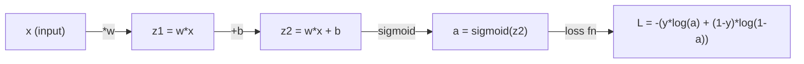
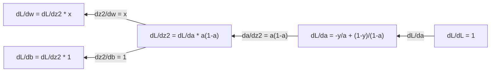
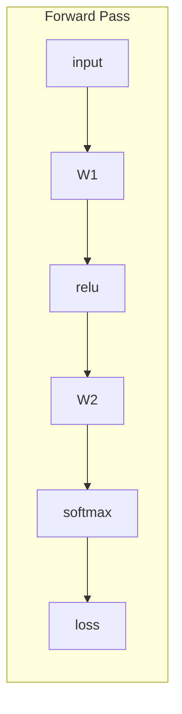
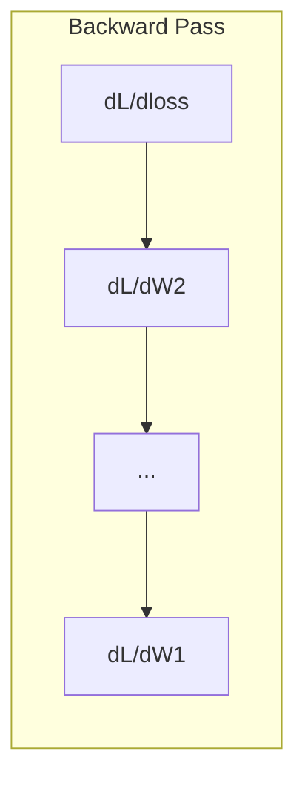

# التعلم الآلي 微积分

> 导数会告诉你哪边是下坡──这是网络神经学学需要的一切──

**Type:** Learn
**Language:**بايثون
**Prerequisites:** Phase 1, Lessons 01-03
**Time:** ~60 minutes

## 學习目标

- 计算常见 ML 函数(x^2、sigmoid、cross-entropy) من عدد القيم والحسابات
- من صفر تحقيق التراجع التدريجي، في 1D و 2D الحد الأدنى من وظيفة الخسارة
- 推导 خطية التراجع 模型的渐变,并通过手动更新权重来训练它
-  شرح المصفوفة الهيسيانية  سلسلة تايلور 近似، وكذلك ارتباطها مع طريقة التحسين

## 问题

لديك شبكة عصبية تحتوي على ملايين الوزن. كل الوزن هو دورة واحدة. تحتاج إلى معرفة أي اتجاه يجب أن يذهب كل دورة، حتى جعل خطأ النموذج قليلاً.

لا توجد نقاط، تدريب شبكة العصبية يعني محاولة التغييرات في كل مرة ثم التأمل في الحظ الجيد.

## 概念

### ما هو الرقم؟

导数量衡变化率──对于函数 y = f(x),导数 f'(x) 会告诉你: إذا قمت بتحريك x 微小地一点,y 会变化多少?

من الناحية الجينية، العدد الموجّه هو التوجه في نقطة ما على الخط.

**f(x) = x^2：**

| x | f(x) | f'(x)（斜率） |
|---|------|---------------|
| 0 | 0    | 0（平坦，在底部） |
| 1 | 1    | 2 |
| 2 | 4    | 4（该点处切线的斜率） |
| 3 | 9    | 6 |

عند x=2 时,斜率是4──如果你 تحرك x إلى اليمين قليلاً,y 大约会增加这一量的 تحرك 4 مرات── عند x=0 时,斜率是0──你位于碗底──

形式化定义:

```
f'(x) = lim   f(x + h) - f(x)
        h->0  -----------------
                     h
```

في الكود، سوف تتجاوز الحد الأقصى، مباشرة باستخدام H صغير جدا.

### 偏导数: مرة واحدة فقط انظر إلى واحد

المهام الحقيقية لديها الكثير من الإدخالات. فقدان الشبكة العصبية يعتمد على مئات الآلاف من الوزن.

```
f(x, y) = x^2 + 3xy + y^2

df/dx = 2x + 3y     (treat y as a constant)
df/dy = 3x + 2y     (treat x as a constant)
```

كل محور يرد: إذا قمت بتقليل الوزن، كيف ستغير الخسارة؟

### الدرجة: جميع الدرجات المتحركة التي تشكل المتجه

سوف تجمع كل محور في متجه واحد. بالنسبة للعمل f ((x، y، z) ، الحور هو:

```
grad f = [ df/dx, df/dy, df/dz ]
```

درجة الإشارة إلى أقصى اتجاه صعودي.

**f(x,y) = x^2 + y^2 的等高线图：**

هذه الوظيفة تشكل صورة كعبية،等高線是同心圆.

| 点 | grad f | -grad f（下降方向） |
|-------|--------|----------------------------|
| (1, 1) | [2, 2]（指向上坡，远离最小值） | [-2, -2]（指向下坡，朝向最小值） |
| (0, 0) | [0, 0]（平坦，在最小值处） | [0, 0] |

هذا هو التراجع التدريجي في الصورة.

### الاتصال مع المُحسنين

訓練神經網絡 就是优化──你有一个 Loss Function L(w1, w2, ..., wn), it measures model has many errors──你想最小化它──

```
Gradient descent update rule:

  w_new = w_old - learning_rate * dL/dw

For every weight:
  1. Compute the partial derivative of loss with respect to that weight
  2. Subtract a small multiple of it from the weight
  3. Repeat
```

معدل التعلم  التحكم فى التقدم ٬ جداً يتجاوز الهدف ٬ جداً يتجاوز التخطى بطيئة ٬

**Loss landscape（1D 切片）：**

وظيفة الخسارة L(w)  مع تغير الوزن w تشكل منحنى ذات قمة ذات وادي

| 特征 | 描述 |
|---------|-------------|
| Global minimum | 整条曲线上的最低点，即最佳解 |
| Local minimum | 比邻近位置更低、但不是整体最低点的谷 |
| Slope | Gradient Descent 会从任意起点沿斜率向下走 |

يمكن أن يقع في الحد الأدنى المحلي، ولكن في الملايين من الوزن، هذا هو القليل من المشكلة العملية.

### عدد القيم المتحركة مقابل 解析导数

هناك طريقتان في الحساب

解析方式:手动应用微积分规则──对于f(x) = x^2,导数是f'(x) = 2x──精确,快速──

طريقة عدد القيم: استخدام تعريف إجراء تقريب.

```
Numerical (central difference):

f'(x) ~= f(x + h) - f(x - h)
          -----------------------
                  2h

h = 0.0001 works well in practice
```

عدد القيم التوجيهية أبطأ، ولكن ينطبق على أي وظيفة.

### 手动推导简单函数的导数

هذه هي النتائج التي ستراها في المادة الثنائية

```
Function        Derivative       Used in
--------        ----------       -------
f(x) = x^2     f'(x) = 2x      Loss functions (MSE)
f(x) = wx + b  f'(w) = x        Linear layer (gradient w.r.t. weight)
                f'(b) = 1        Linear layer (gradient w.r.t. bias)
                f'(x) = w        Linear layer (gradient w.r.t. input)
f(x) = e^x     f'(x) = e^x     Softmax, attention
f(x) = ln(x)   f'(x) = 1/x     Cross-entropy loss
f(x) = 1/(1+e^-x)  f'(x) = f(x)(1-f(x))   Sigmoid activation
```

对于 f(x) = x^2:

```
f(x) = x^2    f'(x) = 2x

  x    f(x)   f'(x)   meaning
  -2    4      -4      slope tilts left (decreasing)
  -1    1      -2      slope tilts left (decreasing)
   0    0       0      flat (minimum!)
   1    1       2      slope tilts right (increasing)
   2    4       4      slope tilts right (increasing)
```

对于 f(w) = wx + b,且 x=3、b=1:

```
f(w) = 3w + 1    f'(w) = 3

The derivative with respect to w is just x.
If x is big, a small change in w causes a big change in output.
```

### 链式法则

عندما تحدث المهام، قواعد السلسلة سوف تخبرك كيف تطلب التوجيه.

```
If y = f(g(x)), then dy/dx = f'(g(x)) * g'(x)

Example: y = (3x + 1)^2
  outer: f(u) = u^2       f'(u) = 2u
  inner: g(x) = 3x + 1    g'(x) = 3
  dy/dx = 2(3x + 1) * 3 = 6(3x + 1)
```

شبكة العصبية هي سلسلة من وظائف:إدخال -> خطي -> تنشيط -> خطي -> تنشيط -> خسارة。الانتشار الخلفي هو من النفاذ إلى النفاذ

### المصفوفة الهيسي

الدرجة  أخبرك المعدل...

هيسيان هو المصفوف الثاني من المكونات المتحركة.

```
H[i][j] = d^2f / (dx_i * dx_j)
```

对于二变量函数 f ((x, y):

```
H = | d^2f/dx^2    d^2f/dxdy |
    | d^2f/dydx    d^2f/dy^2 |
```

**Hessian 在临界点（Gradient = 0 的地方）告诉你什么：**

| Hessian 性质 | 含义 | 示例曲面 |
|-----------------|---------|-----------------|
| 正定（所有 eigenvalues > 0） | Local minimum | 向上开口的碗 |
| 负定（所有 eigenvalues < 0） | Local maximum | 向下开口的碗 |
| 不定（eigenvalues 正负混合） | Saddle point | 马鞍形 |

**示例：**f(x, y) = x^2 - y^2(a صعد 函数)

```
df/dx = 2x       df/dy = -2y
d^2f/dx^2 = 2    d^2f/dy^2 = -2    d^2f/dxdy = 0

H = | 2   0 |
    | 0  -2 |

Eigenvalues: 2 and -2 (one positive, one negative)
--> Saddle point at (0, 0)
```

与 f(x, y) = x^2 + y^2(a碗形函数) تقارير:

```
H = | 2  0 |
    | 0  2 |

Eigenvalues: 2 and 2 (both positive)
--> Local minimum at (0, 0)
```

**为什么 Hessian 在 ML 中重要：**

طريقة نيوتن باستخدام هيسيان لاتخاذ مقارنة مع التراجع الدرجي أفضل تحسين خطواتها.

```
Newton's update:    w_new = w_old - H^(-1) * gradient
Gradient descent:   w_new = w_old - lr * gradient
```

طريقة نيوتن 收更快, لأن Hessian 会重新缩放Gradient:方向的步子更小,平坦方向的步子更大──

المشكلة تكمن في: بالنسبة لشبكة عصبية لديها N 参数، Hessian هو N x N ⋅ نموذج مع 100،000 عنصر يحتاج إلى ماتريكس التي تحتوي على 1،000 مليار عنصر. هذا هو السبب في استخدامنا طريقة التقريب.

| 方法 | 使用什么 | 成本 | 收敛 |
|--------|-------------|------|-------------|
| Gradient Descent | 只使用一阶导数 | 每步 O(N) | 慢（线性） |
| Newton's method | 完整 Hessian | 每步 O(N^3) | 快（二次） |
| L-BFGS | 从 Gradient 历史近似 Hessian | 每步 O(N) | 中等（超线性） |
| Adam | 每参数自适应 rate（对角 Hessian 近似） | 每步 O(N) | 中等 |
| Natural gradient | Fisher information matrix（统计 Hessian） | 每步 O(N^2) | 快 |

في الممارسة العملية، آدم هو المحفّظ المتبقي للتعلم العميق.

### سلسلة تايلور 近似

أي وظيفة مسطحة يمكن أن تكون مقاربة باستخدام العديد من النقاط:

```
f(x + h) = f(x) + f'(x)*h + (1/2)*f''(x)*h^2 + (1/6)*f'''(x)*h^3 + ...
```

يحتوي على أكثر من ذلك، تقريباً أفضل، ولكن فقط في نقطة x  قريبة من وجودها

**为什么 Taylor series 对 ML 重要：**

- **一阶 Taylor = Gradient Descent。**عندما تستخدم f(x + h) ~ f(x) + f'(x) *h 时, أنت في صنع 线性近似── Gradine Descent 会最小化 هذا 线性模型,从而选择 h = -lr * f'(x)。

- **二阶 Taylor = Newton's method。**استخدام f(x + h) ~ f(x) + f'(x) *h + (1/2) *f'(x) *h^2 时, you get a二次模型──最小化它会得到 h = -f'(x) / f'(x),也就是牛顿步骤──

- **Loss Function 设计。**إن MSE و التقاطع بين النخاعات هو سليم، وهذا يعني أن توسعات تيلور لها تبدوا بشكل جيد.

```
Approximation order    What it captures    Optimization method
-------------------    -----------------   -------------------
0th order (constant)   Just the value      Random search
1st order (linear)     Slope               Gradient descent
2nd order (quadratic)  Curvature           Newton's method
Higher orders          Finer structure     Rarely used in ML
```

关键洞见是: جميع التحسينات القائمة على الدرجة، في الأساس كلها في مقاربتها تقريب الخسارة وظيفة، و إلى الحد الأدنى من القيمة القريبة وظيفة.

### ML 中的积分

导数告诉你变化率──积分计算累积量,也就是曲线下面积──

في مجال اللغة الإنجليزية، كنت قد قمت بالكاد بالتحديد، ولكن هذا المفهوم لا يوجد:

**概率。**بالنسبة لامتثاث p  x) من سلسلة التغيرات:
```
P(a < X < b) = integral from a to b of p(x) dx
```
概率 كثافة منحنى على مساحة بين a و b , هو تقع في هذه المنطقة 

**期望值。**按概率加权的平均结果:
```
E[f(X)] = integral of f(x) * p(x) dx
```
الخسارة المتوقعة على توزيع البيانات هي 积分―― التدريب يقلل من تجربته تقريبها.

**KL divergence。**قياس توزيعين مختلفين:
```
KL(p || q) = integral of p(x) * log(p(x) / q(x)) dx
```
باستخدام VAEs ، التقطير المعرفة و استنتاج بايزيان

**归一化常数。**في استنتاج بايسي وسط:
```
p(w | data) = p(data | w) * p(w) / integral of p(data | w) * p(w) dw
```
المياه هي النقاط من جميع القيم المعادلة المحتملة. عادة ما تكون غير قابلة للتعامل، وهذا هو السبب في استخدامنا لـ MCMC و الاستنتاج المتغير وغيره من الطرق المقاربة.

| 积分概念 | 在 ML 中出现的位置 |
|-----------------|----------------------|
| 曲线下面积 | 由 density functions 得到概率 |
| 期望值 | Loss Functions、risk minimization |
| KL divergence | VAEs、policy optimization、distillation |
| 归一化 | Bayesian posteriors、softmax denominator |
| Marginal likelihood | Model comparison、evidence lower bound (ELBO) |

### رسم الحسابات 中的多变量链式法则

链式法则不仅适用一条线上的标量函数――在神经网络中,变量会分叉并合并―― 下面展示导数如何流过一个简单的前进传:



الممر الخلفي 会从右到左计算 درج:



كل سهم يُضاعف على الدرجات المحلية. درجات أي عنصر، هو ضرب جميع الدرجات المحلية على طريق الدرجات المحلية من الخسارة إلى ذلك الدرجات المحلية. عندما يتم تقسيم الطرق وتجمعها، سوف تضيف مساهمة كل طريق إلى بعضها البعض.

كل المحتوى في التوزيع الخلفي هو: من الخروج إلى الخروج، نظاميا في رسم الحسابات في قانون التطبيق للسلسلة.

### ماتريكس جاكوبيان

عندما تقوم وظيفة بتركيب متجه إلى متجه، مثل طبقة الشبكة العصبية، فإن عدد توجيهاتها هو ماتريكس.

بالنسبة لـ f: R^n -> R^m، Jacobian J هو واحد م x n المصفوفة:

| | x1 | x2 | ... | xn |
|---|---|---|---|---|
| f1 | df1/dx1 | df1/dx2 | ... | df1/dxn |
| f2 | df2/dx1 | df2/dx2 | ... | df2/dxn |
| ... | ... | ... | ... | ... |
| fm | dfm/dx1 | dfm/dx2 | ... | dfm/dxn |

لن تقوم بتحليل شبكة العصبية على يد يدوي. سيتعامل معها بايتورش. ولكن معرفة وجودها تساعدك على فهم شكل التنشر الخلفي: إذا وضعت طبقة R^n إلى R^m، فإن جيكوبيانها هو m x n.

### لماذا هذا مهم للشبكة العصبية

كل وزن في الشبكة العصبية سيحصل على درجة.





كل مرة
- `W1 = W1 - lr * dL/dW1`
- `W2 = W2 - lr * dL/dW2`

المضي قدما 计算预测和损失──المرور الخلفي 计算损失 相对于每权重的梯度──然后每权重都向下坡方向迈一小步──重复数百万步──这就是深度学习──


```figure
derivative-tangent
```

## بناءها

### الخطوة 1: من الصفر تحقيق عدد القيم

```python
def numerical_derivative(f, x, h=1e-7):
    return (f(x + h) - f(x - h)) / (2 * h)

def f(x):
    return x ** 2

for x in [-2, -1, 0, 1, 2]:
    numerical = numerical_derivative(f, x)
    analytical = 2 * x
    print(f"x={x:2d}  f'(x) numerical={numerical:.6f}  analytical={analytical:.1f}")
```

يتناسب عدد القيم مع عدد القيم في عدد كبير من الأرقام الصغيرة.

### الخطوة الثانية: الاختيارات

```python
def numerical_gradient(f, point, h=1e-7):
    gradient = []
    for i in range(len(point)):
        point_plus = list(point)
        point_minus = list(point)
        point_plus[i] += h
        point_minus[i] -= h
        partial = (f(point_plus) - f(point_minus)) / (2 * h)
        gradient.append(partial)
    return gradient

def f_multi(point):
    x, y = point
    return x**2 + 3*x*y + y**2

grad = numerical_gradient(f_multi, [1.0, 2.0])
print(f"Numerical gradient at (1,2): {[f'{g:.4f}' for g in grad]}")
print(f"Analytical gradient at (1,2): [2*1+3*2, 3*1+2*2] = [{2*1+3*2}, {3*1+2*2}]")
```

### 步骤 3: باستخدام التراجع التدريجي 找到 f(x) = x^2

```python
x = 5.0
lr = 0.1
for step in range(20):
    grad = 2 * x
    x = x - lr * grad
    print(f"step {step:2d}  x={x:8.4f}  f(x)={x**2:10.6f}")
```

من x=5 بدءاً، كل خطوة ستقترب من x=0 ((أقل قيمة) 

### الخطوة 4: تنفيذ التراجع التدريجي على وظيفة 2D

```python
def f_2d(point):
    x, y = point
    return x**2 + y**2

point = [4.0, 3.0]
lr = 0.1
for step in range(30):
    grad = numerical_gradient(f_2d, point)
    point = [p - lr * g for p, g in zip(point, grad)]
    loss = f_2d(point)
    if step % 5 == 0 or step == 29:
        print(f"step {step:2d}  point=({point[0]:7.4f}, {point[1]:7.4f})  f={loss:.6f}")
```

### الخطوة 5: مقارنة القيم والحسابات

```python
import math

test_functions = [
    ("x^2",      lambda x: x**2,          lambda x: 2*x),
    ("x^3",      lambda x: x**3,          lambda x: 3*x**2),
    ("sin(x)",   lambda x: math.sin(x),   lambda x: math.cos(x)),
    ("e^x",      lambda x: math.exp(x),   lambda x: math.exp(x)),
    ("1/x",      lambda x: 1/x,           lambda x: -1/x**2),
]

x = 2.0
print(f"{'Function':<12} {'Numerical':>12} {'Analytical':>12} {'Error':>12}")
print("-" * 50)
for name, f, df in test_functions:
    num = numerical_derivative(f, x)
    ana = df(x)
    err = abs(num - ana)
    print(f"{name:<12} {num:12.6f} {ana:12.6f} {err:12.2e}")
```

### 步骤 6: عدد القيمة الحسابية

```python
def hessian_2d(f, x, y, h=1e-5):
    fxx = (f(x + h, y) - 2 * f(x, y) + f(x - h, y)) / (h ** 2)
    fyy = (f(x, y + h) - 2 * f(x, y) + f(x, y - h)) / (h ** 2)
    fxy = (f(x + h, y + h) - f(x + h, y - h) - f(x - h, y + h) + f(x - h, y - h)) / (4 * h ** 2)
    return [[fxx, fxy], [fxy, fyy]]

def saddle(x, y):
    return x ** 2 - y ** 2

def bowl(x, y):
    return x ** 2 + y ** 2

H_saddle = hessian_2d(saddle, 0.0, 0.0)
H_bowl = hessian_2d(bowl, 0.0, 0.0)
print(f"Saddle Hessian: {H_saddle}")  # [[2, 0], [0, -2]] -- mixed signs
print(f"Bowl Hessian:   {H_bowl}")    # [[2, 0], [0, 2]]  -- both positive
```

صعد  وظيفة من هيسيان لديه قيم خاصة 2 和 -2(符号混合,确认是 صعد نقطة)。وعاء  وظيفة لديه قيم خاصة 2 和 2(均为正,确认是最小)。

### الخطوة 7: تايلور 近似的实际效果

```python
import math

def taylor_approx(f, f_prime, f_double_prime, x0, h, order=2):
    result = f(x0)
    if order >= 1:
        result += f_prime(x0) * h
    if order >= 2:
        result += 0.5 * f_double_prime(x0) * h ** 2
    return result

x0 = 0.0
for h in [0.1, 0.5, 1.0, 2.0]:
    true_val = math.sin(h)
    t1 = taylor_approx(math.sin, math.cos, lambda x: -math.sin(x), x0, h, order=1)
    t2 = taylor_approx(math.sin, math.cos, lambda x: -math.sin(x), x0, h, order=2)
    print(f"h={h:.1f}  sin(h)={true_val:.4f}  order1={t1:.4f}  order2={t2:.4f}")
```

في x0=0 附近,sin(x) ~ x(一阶 Taylor) ―― بالنسبة لـ h صغير جدا، هذا التقارب جيد جدا؛ ولكن بالنسبة لـ h أكبر، فإنه سوف يفشل‬ هذا هو السبب في انخفاض دراديينت في معدلات التعلم الصغيرة ‬

### الخطوة الثامنة: لماذا هذا مهم جداً للشبكة العصبية

```python
import random

random.seed(42)

w = random.gauss(0, 1)
b = random.gauss(0, 1)
lr = 0.01

xs = [1.0, 2.0, 3.0, 4.0, 5.0]
ys = [3.0, 5.0, 7.0, 9.0, 11.0]

for epoch in range(200):
    total_loss = 0
    dw = 0
    db = 0
    for x, y in zip(xs, ys):
        pred = w * x + b
        error = pred - y
        total_loss += error ** 2
        dw += 2 * error * x
        db += 2 * error
    dw /= len(xs)
    db /= len(xs)
    total_loss /= len(xs)
    w -= lr * dw
    b -= lr * db
    if epoch % 40 == 0 or epoch == 199:
        print(f"epoch {epoch:3d}  w={w:.4f}  b={b:.4f}  loss={total_loss:.6f}")

print(f"\nLearned: y = {w:.2f}x + {b:.2f}")
print(f"Actual:  y = 2x + 1")
```

كل دورة تدريبية مبنية على الدرجة تتبع هذا النموذج: التنبؤ والتحساب الخسارة وتحساب الدرجة وتحديث الوزن.

## استخدمها

استخدم NumPy 时, نفس التشغيل سوف يكون أسرع 、 أكثر بساطة:

```python
import numpy as np

x = np.array([1, 2, 3, 4, 5], dtype=float)
y = np.array([3, 5, 7, 9, 11], dtype=float)

w, b = np.random.randn(), np.random.randn()
lr = 0.01

for epoch in range(200):
    pred = w * x + b
    error = pred - y
    loss = np.mean(error ** 2)
    dw = np.mean(2 * error * x)
    db = np.mean(2 * error)
    w -= lr * dw
    b -= lr * db

print(f"Learned: y = {w:.2f}x + {b:.2f}")
```

أنت刚刚从零构建了渐进式下降――PyTorch 会自动完成渐进式计算,但更新循环是完全一样――

## التدريب

1. استخدام استخدام اثنين من المرات`numerical_derivative`كيفية تحقيقها`numerical_second_derivative(f, x)` التحقق من x^3 في x=2 处的二阶导数是12♦
2. استخدام التراجع الدرجي 找到 f(x, y) = (x - 3)^2 + (y + 1)^2 من الحد الأدنى قيمة── من (0, 0) 开始──答案应收到 (3, -1)──
3. في حلقة التراجع التدريجي إضافة الزخم:维护一个会累积过去 نسبة السرعة في المتجهة.

## 关键术语

| 术语 | 人们常说 | 实际含义 |
|------|----------------|----------------------|
| Derivative | “斜率” | 函数在某一点的变化率。告诉你输入每变化一个单位，输出会变化多少。 |
| Partial derivative | “一个变量的导数” | 在保持其他所有变量不变时，对某一个变量求导。 |
| Gradient | “最陡上升方向” | 由所有偏导数组成的 Vector。指向让函数增长最快的方向。 |
| Gradient Descent | “往下坡走” | 从参数中减去 Gradient（乘以 learning rate），从而降低 Loss。Neural Network 训练的核心。 |
| Learning rate | “步长” | 控制每一步 Gradient Descent 有多大的标量。太大：发散。太小：收敛缓慢。 |
| Chain rule | “把导数相乘” | 对复合函数求导的规则：df/dx = df/dg * dg/dx。Backpropagation 的数学基础。 |
| Jacobian | “导数 Matrix” | 当一个函数把 Vector 映射到 Vector 时，Jacobian 是所有输出相对于输入的偏导数组成的 Matrix。 |
| Numerical derivative | “有限差分” | 通过在两个相邻点上评估函数并计算它们之间的斜率来近似导数。 |
| Backpropagation | “Reverse-mode autodiff” | 使用链式法则，从输出到输入逐层计算 Gradient。Neural Network 就是这样学习的。 |
| Hessian | “二阶导数 Matrix” | 所有二阶偏导数组成的 Matrix。描述函数的曲率。在临界点处 Hessian 正定意味着 local minimum。 |
| Taylor series | “多项式近似” | 使用函数的导数在某一点附近近似函数：f(x+h) ~ f(x) + f'(x)h + (1/2)f''(x)h^2 + ... 它是理解 Gradient Descent 和 Newton's method 为什么有效的基础。 |
| Integral | “曲线下面积” | 某个量在一个范围内的累积。在 ML 中，积分定义概率、期望值和 KL divergence。 |

## 延伸阅读

- [3Blue1Brown: Essence of Calculus](https://www.3blue1brown.com/topics/calculus)- حول الوصول الى القانون
- [Stanford CS231n: Backpropagation](https://cs231n.github.io/optimization-2/)- درجة  كيف يمر عبر طبقة الشبكة العصبية
