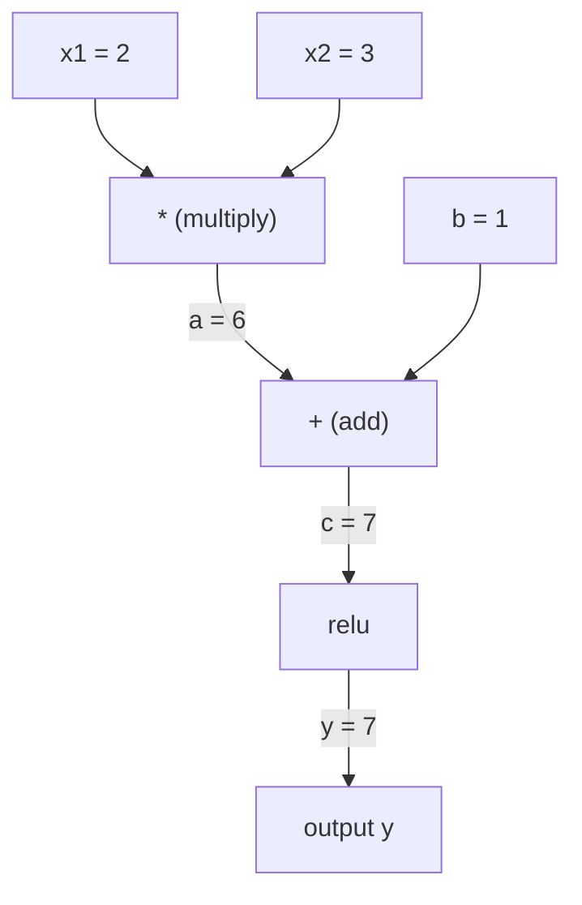
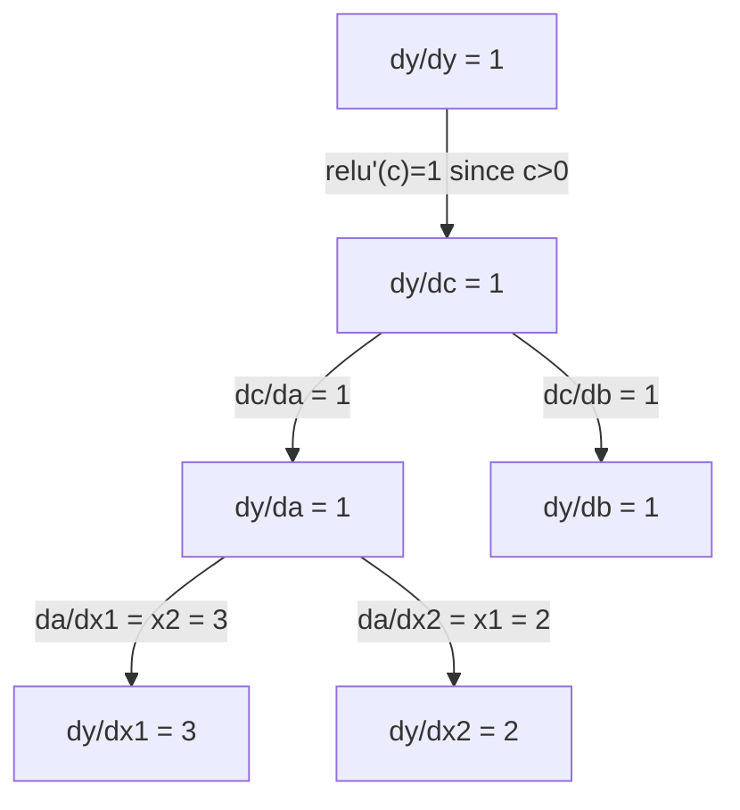

# قاعدة السلسلة والتمييز الآلي

> قاعدة السلسلة هي محرك خلف شبكة العصبية التي يتعلمها الجميع

**类型：**بناء
**语言：**بايثون
**前置要求：**المرحلة الأولى، الدروس 04 (المشتقات والشكلات)
**时间：**حوالي 90 دقيقة

## 學习目标

- 构建一个极简 autograd 引擎(طبقة القيمة) ،记录操作并通过逆模式 autodiff 计算 Gradient
- استخدام النوع التوبولوجي في الرسم البياني الحسابي 中实现 forward 和 backward pass
- فقط باستخدام محركات التطوير المتطورة من الصفر، في XOR على بناء وتدريب جهاز استشعار متعدد الطبقات
- استخدام التحقق من التراجع، سوف تتميز بالفروق المتواصلة مع القيمة النهائية للقيمة، التحقق من الصادقة

## 问题

يمكنك حساب عدد المهام البسيطة. ولكن الشبكة العصبية ليست وظيفة بسيطة. وهي تتكون من مئات من مجموعات المهام: مضاعفة المصفوفة، إضافة التحيز، تنشيط التطبيق، مضاعفة المصفوفة مرة أخرى، غرامة الأقصى، فقدان التنفسية.

لتدريب شبكة، تحتاج إلى الخسارة مقارنة مع كل وزن من الدرجات.

قاعدة السلسلة  اعطى أساس رياضي.  اعطى التفريق الآلي  اعطى حوارزمية.

هذا هو طريقة عمل PyTorch、TensorFlow و JAX. سوف تقوم من الصفر ببناء نسخة صغيرة.

## مفهوم الأساسي

### قاعدة السلسلة

إذا`y = f(g(x))`، إذاً`y`مقارنة`x`导数 هي:

```
dy/dx = dy/dg * dg/dx = f'(g(x)) * g'(x)
```

沿着链条将导数相乘―― كل环节贡献自己的局部导数――

نموذج:`y = sin(x^2)`

```
g(x) = x^2       g'(x) = 2x
f(g) = sin(g)     f'(g) = cos(g)

dy/dx = cos(x^2) * 2x
```

对于更深的组合,链条会继续延伸:

```
y = f(g(h(x)))

dy/dx = f'(g(h(x))) * g'(h(x)) * h'(x)
```

كل طبقة من شبكة العصبية هي جزء من هذه السلسلة

### الرسومات الحسابية

الرسم البياني الحاسوبي 让链规则可视化──每个操作都将成为一个节点──数据沿图向前流动──渐变向后流动──

**Forward pass（计算值）：**



**Backward pass（计算 Gradient）：**



الممر الخلفي سوف يقع في كل نقطة تطبيق قاعدة السلسلة، سوف يكون درجي من الخروج إلى النقل.

### الوضع الاول مقابل الوضع الاخير

هناك طريقتان يمكن تطبيقها في الرسم البياني قاعدة السلسلة

**Forward mode**من النقل إلى النقل، سوف يُحسب`dx/dx = 1`، ومع كل عملية تنتشر.

```
Forward mode: seed dx/dx = 1, propagate forward

  x = 2       (dx/dx = 1)
  a = x^2     (da/dx = 2x = 4)
  y = sin(a)  (dy/dx = cos(a) * da/dx = cos(4) * 4 = -2.615)
```

**Reverse mode**من الخروج إلى الخروج، سوف تصل إلى الخلف.`dy/dy = 1`، وفقًا للانتقال العكسي من خلال كل عملية انتشار.

```
Reverse mode: seed dy/dy = 1, propagate backward

  y = sin(a)  (dy/dy = 1)
  a = x^2     (dy/da = cos(a) = cos(4) = -0.654)
  x = 2       (dy/dx = dy/da * da/dx = -0.654 * 4 = -2.615)
```

شبكة العصبية هناك عدة ملايين من الدخولات والخسائر والخروج والخسائر والخسائر والخسائر والخسائر والخسائر والخسائر والخسائر والخسائر والخسائر والخسائر والخسائر والخسائر والخسائر والخسائر والخسائر والخسائر والخسائر والخسائر والخسائر والخسائر والخسائر والخسائر والخسائر والخسائر والخسائر والخسائر والخسائر والخسائر والخسائر والخسائر والخسائر والخسائر والخسائر والخسائر والخسائر والخسائر والخسائر والخسائر والخسائر والخسائر والخسائر والخسائر والخسائر والخسائر والخسائر والخسائر والخسائر والخسائر والخسائر والخسائر والخسائر والخسائر والخسائر والخسائر والخير والخسائر والخير والخير والخير والخير.

| Mode | Seed | Direction | Best when |
|------|------|-----------|-----------|
| Forward | `dx_i/dx_i = 1` | 输入到输出 | 输入少、输出多 |
| Reverse | `dy/dy = 1` | 输出到输入 | 输入多、输出少（neural nets） |

### باستخدام وضع الأمام الأرقام المزدوجة

الوضع الأمامي يمكن استخدام الأرقام المزدوجة 优雅地实现──形式的双数是`a + b*epsilon`، من بينهم`epsilon^2 = 0`.

```
Dual number: (value, derivative)

(2, 1) means: value is 2, derivative w.r.t. x is 1

Arithmetic rules:
  (a, a') + (b, b') = (a+b, a'+b')
  (a, a') * (b, b') = (a*b, a'*b + a*b')
  sin(a, a')         = (sin(a), cos(a)*a')
```

سيتم تعيين عدد الإدخال المتغيرات على 1♦.

### 构建 Autograd 引擎

محركات التطوير تتطلب ثلاثة أشياء:

1. **Value wrapping。**كل رقم محفوف في كائن واحد، لخزن قيمته ودرجةها.
2. **Graph recording。**كل عملية تسجل دخلها والمنطقة وظيفة درجي
3. **Backward pass。**على الرسم البياني أن تصنف الترتيبات التوبولوجية، ثم عكس التوجه عبر، في كل نقطة تطبيق قاعدة السلسلة.

هذا هو (بيتورش)`autograd`ما يجب القيام به`torch.Tensor`الصف 包裹值,在 `requires_grad=True`时记录操作, و تم调用 `.backward()`时计算 درجيينت

### كيف يعمل PyTorch Autograd 底层

عندما كنت تكتب بيتورش 代码时:

```python
x = torch.tensor(2.0, requires_grad=True)
y = x ** 2 + 3 * x + 1
y.backward()
print(x.grad)  # 7.0 = 2*x + 3 = 2*2 + 3
```

(بيتورش) في اجتماع داخلي:

1. لأجل`x`إنشاء واحد`Tensor`节点,并设置 `requires_grad=True`
2. كل عملية`**`.`*`.`+`) كلّ شيء يخلق نقطة جديدة، و يُسجل إلى الوراء  وظيفة
3. `y.backward()`触发对已记录图的反向模式自动调节
4. كل نقطة`grad_fn`الحساب المحلي تدريجي، و سوف تمرر بهم إلى العنصر
5. الدرجة 通過加法(不是替换)累积到 `.grad`属性中

هذا الرسم البياني هو متحرك ((تعريف بالعمل)  كل مرسلة إلى الأمام ستبني رسم البياني الجديد  هذا هو سبب استخدام PyTorch 支持在模型中控制流 ((إذا كان / الآخر ‬‬‬‬‬‬‬‬‬‬‬‬‬‬‬‬‬‬‬‬‬‬‬‬‬‬‬‬‬‬‬‬‬‬‬‬‬‬‬‬‬‬‬‬‬‬‬‬‬‬‬‬‬‬‬‬‬‬‬‬‬‬‬‬‬‬‬‬‬‬‬‬‬‬‬‬‬‬‬‬‬‬‬‬‬‬‬‬‬‬‬‬‬‬‬‬‬‬‬‬‬‬‬‬‬‬‬‬‬‬‬‬‬‬‬‬‬‬‬‬‬‬‬‬‬‬‬‬‬‬‬‬‬‬‬‬‬‬‬‬‬‬‬‬‬‬‬‬‬‬‬‬‬‬‬‬‬‬‬‬‬‬‬‬‬‬‬‬‬‬‬‬‬‬‬‬‬‬‬‬‬‬‬‬‬‬‬‬‬‬‬‬‬‬‬‬‬‬‬‬‬‬‬‬‬‬‬‬‬‬‬‬‬‬‬‬‬‬‬‬‬‬‬‬‬‬‬‬‬‬‬‬‬‬‬‬‬‬‬‬‬‬‬‬‬‬‬‬‬‬‬‬‬‬‬‬‬‬‬‬‬‬‬‬‬‬‬‬‬‬‬‬‬‬‬‬‬‬‬‬‬‬‬‬‬‬‬‬‬‬‬‬‬‬‬‬‬‬‬‬‬‬‬‬‬‬‬‬‬‬‬‬‬‬‬‬‬‬‬‬‬‬‬‬‬‬‬‬‬‬‬‬‬‬‬‬‬‬‬‬‬‬‬‬‬‬‬‬‬‬‬‬‬‬‬‬‬‬‬‬‬‬‬‬‬‬‬‬‬‬‬‬‬‬‬‬‬‬‬‬‬‬‬‬‬‬‬‬‬‬‬‬‬‬‬‬‬‬‬‬‬‬‬‬‬‬‬‬‬‬‬‬‬‬‬‬‬‬‬‬‬‬‬‬‬‬‬‬‬‬‬‬‬‬‬‬‬‬‬‬‬‬‬‬‬‬‬‬‬‬‬‬‬


```figure
chain-rule
```

## بناءها

### 步骤 1: فئة القيمة

```python
class Value:
    def __init__(self, data, children=(), op=''):
        self.data = data
        self.grad = 0.0
        self._backward = lambda: None
        self._prev = set(children)
        self._op = op

    def __repr__(self):
        return f"Value(data={self.data:.4f}, grad={self.grad:.4f})"
```

كل واحد`Value`تخزين بيانات قيمة خاصة بها √Gradient初始为零) √ √ وظيفة متأخرة، وكذلك مؤشرات العقدة الطفولة التي تولدها‬

### الخطوة 2: مع التتبع التدريجي

```python
    def __add__(self, other):
        other = other if isinstance(other, Value) else Value(other)
        out = Value(self.data + other.data, (self, other), '+')
        def _backward():
            self.grad += out.grad
            other.grad += out.grad
        out._backward = _backward
        return out

    def __mul__(self, other):
        other = other if isinstance(other, Value) else Value(other)
        out = Value(self.data * other.data, (self, other), '*')
        def _backward():
            self.grad += other.data * out.grad
            other.grad += self.data * out.grad
        out._backward = _backward
        return out

    def relu(self):
        out = Value(max(0, self.data), (self,), 'relu')
        def _backward():
            self.grad += (1.0 if out.data > 0 else 0.0) * out.grad
        out._backward = _backward
        return out
```

كل عملية سوف تخلق إغلاق، انها تعرف كيفية حساب المحلية درجات،并乘以上游 درجات (((`out.grad`(‬)`+=`التعامل هو حالة استخدام قيمة متعددة التشغيلات.

### 步骤 3: مرّة للخلف

```python
    def backward(self):
        topo = []
        visited = set()
        def build_topo(v):
            if v not in visited:
                visited.add(v)
                for child in v._prev:
                    build_topo(child)
                topo.append(v)
        build_topo(self)

        self.grad = 1.0
        for v in reversed(topo):
            v._backward()
```

النوع التوبولوجي  ضمان كل نقطة من درجاتها في الانتشار إلى أعصابها الاولى 之前已完整计算──种子 درجاتها هي 1.0(dy/dy = 1)。

### الخطوة 4: محرك كامل يتطلب المزيد من العمليات

基础 درجة القيمة 支持加法、乘法和 relu。 حقيقة المحركات التلقائية  محركات الحركة تتطلب المزيد من القدرات。

```python
    def __neg__(self):
        return self * -1

    def __sub__(self, other):
        return self + (-other)

    def __radd__(self, other):
        return self + other

    def __rmul__(self, other):
        return self * other

    def __rsub__(self, other):
        return other + (-self)

    def __pow__(self, n):
        out = Value(self.data ** n, (self,), f'**{n}')
        def _backward():
            self.grad += n * (self.data ** (n - 1)) * out.grad
        out._backward = _backward
        return out

    def __truediv__(self, other):
        return self * (other ** -1) if isinstance(other, Value) else self * (Value(other) ** -1)

    def exp(self):
        import math
        e = math.exp(self.data)
        out = Value(e, (self,), 'exp')
        def _backward():
            self.grad += e * out.grad
        out._backward = _backward
        return out

    def log(self):
        import math
        out = Value(math.log(self.data), (self,), 'log')
        def _backward():
            self.grad += (1.0 / self.data) * out.grad
        out._backward = _backward
        return out

    def tanh(self):
        import math
        t = math.tanh(self.data)
        out = Value(t, (self,), 'tanh')
        def _backward():
            self.grad += (1 - t ** 2) * out.grad
        out._backward = _backward
        return out
```

**每个操作为什么重要：**

| Operation | Backward rule | Used in |
|-----------|--------------|---------|
| `__sub__` | 复用 add + neg | Loss 计算（pred - target） |
| `__pow__` | n * x^(n-1) | Polynomial activations、MSE（error^2） |
| `__truediv__` | 复用 mul + pow(-1) | Normalization、learning rate scaling |
| `exp` | exp(x) * upstream | Softmax、log-likelihood |
| `log` | (1/x) * upstream | Cross-entropy loss、log probabilities |
| `tanh` | (1 - tanh^2) * upstream | 经典 activation function |

巧妙之处在:`__sub__`和 `__truediv__`يستخدمون تعريفات العمليات المحددة. فإنها تحصل تلقائيا على الصوابية الصحيحة، لأن قاعدة السلسلة سوف تمر من خلال الطبقة السفلية من إضافة / مول / Pow  العمليات المجمعة.

### الخطوة 5: من الصفر تحقيق ميني MLP

مع وجود فئة القيم الكاملة، يمكننا بناء شبكة عصبية.

```python
import random

class Neuron:
    def __init__(self, n_inputs):
        self.w = [Value(random.uniform(-1, 1)) for _ in range(n_inputs)]
        self.b = Value(0.0)

    def __call__(self, x):
        act = sum((wi * xi for wi, xi in zip(self.w, x)), self.b)
        return act.tanh()

    def parameters(self):
        return self.w + [self.b]

class Layer:
    def __init__(self, n_inputs, n_outputs):
        self.neurons = [Neuron(n_inputs) for _ in range(n_outputs)]

    def __call__(self, x):
        return [n(x) for n in self.neurons]

    def parameters(self):
        return [p for n in self.neurons for p in n.parameters()]

class MLP:
    def __init__(self, sizes):
        self.layers = [Layer(sizes[i], sizes[i+1]) for i in range(len(sizes)-1)]

    def __call__(self, x):
        for layer in self.layers:
            x = layer(x)
        return x[0] if len(x) == 1 else x

    def parameters(self):
        return [p for layer in self.layers for p in layer.parameters()]
```

واحد`Neuron`计算 `tanh(w1*x1 + w2*x2 + ... + b)`‬ ‬ ‬`Layer`هو عصبية 列表──一个 `MLP`تتجمع طبقات كثيرة. كل وزن`Value`, لذلك ت调用`loss.backward()`سوف نُنشر إلى كل عنصر

**在 XOR 上训练：**

```python
random.seed(42)
model = MLP([2, 4, 1])  # 2 inputs, 4 hidden neurons, 1 output

xs = [[0, 0], [0, 1], [1, 0], [1, 1]]
ys = [-1, 1, 1, -1]  # XOR pattern (using -1/1 for tanh)

for step in range(100):
    preds = [model(x) for x in xs]
    loss = sum((p - y) ** 2 for p, y in zip(preds, ys))

    for p in model.parameters():
        p.grad = 0.0
    loss.backward()

    lr = 0.05
    for p in model.parameters():
        p.data -= lr * p.grad

    if step % 20 == 0:
        print(f"step {step:3d}  loss = {loss.data:.4f}")

print("\nPredictions after training:")
for x, y in zip(xs, ys):
    print(f"  input={x}  target={y:2d}  pred={model(x).data:6.3f}")
```

هذا هو الجهاز الدقيق. هذا هو نظام التعلم العميق الذي يتم القيام به على نطاق واسع في كل مجال تجاري.

### الخطوة 6: التحقق من درجة

كيف تعرف أن تحديدك الذاتي صحيح؟ مقارنة مع محور القيمة العددية.

```python
def gradient_check(build_expr, x_val, h=1e-7):
    x = Value(x_val)
    y = build_expr(x)
    y.backward()
    autodiff_grad = x.grad

    y_plus = build_expr(Value(x_val + h)).data
    y_minus = build_expr(Value(x_val - h)).data
    numerical_grad = (y_plus - y_minus) / (2 * h)

    diff = abs(autodiff_grad - numerical_grad)
    return autodiff_grad, numerical_grad, diff
```

في تعبير معقدة

```python
def expr(x):
    return (x ** 3 + x * 2 + 1).tanh()

ad, num, diff = gradient_check(expr, 0.5)
print(f"Autodiff:  {ad:.8f}")
print(f"Numerical: {num:.8f}")
print(f"Difference: {diff:.2e}")
# Difference should be < 1e-5
```

实现新操作时, 渐进检查 至关重要.  إذا كان لديك مرور خلفي هناك خطأ, فإن عملية فحص القيمة العددية ستكتشفها.  كل عملية تدريب عميق تطبق في جميع أنحاء التطوير.

**什么时候使用 gradient checking：**

| Situation | Do gradient check? |
|-----------|-------------------|
| 向 autograd 添加新操作 | 是，始终要做 |
| 调试无法收敛的训练循环 | 是，先检查 Gradient |
| 生产训练 | 否，太慢（每个参数需要 2 次 forward pass） |
| autograd 代码的 unit tests | 是，将它自动化 |

### الخطوة 7: مع الاختبار نتيجة الحساب

```python
x1 = Value(2.0)
x2 = Value(3.0)
a = x1 * x2          # a = 6.0
b = a + Value(1.0)    # b = 7.0
y = b.relu()          # y = 7.0

y.backward()

print(f"y = {y.data}")          # 7.0
print(f"dy/dx1 = {x1.grad}")   # 3.0 (= x2)
print(f"dy/dx2 = {x2.grad}")   # 2.0 (= x1)
```

التفتيش الحر:`y = relu(x1*x2 + 1)` بسبب`x1*x2 + 1 = 7 > 0`, ريلو هو الهوية
`dy/dx1 = x2 = 3`.`dy/dx2 = x1 = 2`◊ نتائج المحركات متوافقة‬

## استخدمها

### مع PyTorch 验证

```python
import torch

x1 = torch.tensor(2.0, requires_grad=True)
x2 = torch.tensor(3.0, requires_grad=True)
a = x1 * x2
b = a + 1.0
y = torch.relu(b)
y.backward()

print(f"PyTorch dy/dx1 = {x1.grad.item()}")  # 3.0
print(f"PyTorch dy/dx2 = {x2.grad.item()}")  # 2.0
```

مثل مثل مثل. نتيجة حساب محركك مع PyTorch واحد، لأن الأساس الرياضي هو نفسه: من خلال قاعدة السلسلة  تحقيق التشغيل الذاتي في وضع العكس.

### تعبير أكثر تعقيدا

```python
a = Value(2.0)
b = Value(-3.0)
c = Value(10.0)
f = (a * b + c).relu()  # relu(2*(-3) + 10) = relu(4) = 4

f.backward()
print(f"df/da = {a.grad}")  # -3.0 (= b)
print(f"df/db = {b.grad}")  #  2.0 (= a)
print(f"df/dc = {c.grad}")  #  1.0
```

## 交付内容

本课会产出:
- `outputs/skill-autodiff.md`-- مهارة لتصميم وتحسين النظام
- `code/autodiff.py`-- محرك بسيط يمكن أن يستمر في التوسع

فئة القيمة التي تم بناؤها هي أساس دورة التدريب في الشبكة العصبية في المرحلة الثالثة.

## التدريب

1. إلى فئة القيمة 添加 `__pow__`، لذا يمكنك أن تحسب`x ** n` 验证在 `x=2`时،`d/dx(x^3)`... و هكذا`12.0`.

2. إضافة`tanh`作为激活函数──验证 `tanh'(0) = 1`و`tanh'(2) = 0.0707`(قريبة القيمة)

3. لأحد الخلايا العصبية  بنية الرسم البياني الحسابي:`y = relu(w1*x1 + w2*x2 + b)`△ حساب جميع خمسة درجات,并与 PyTorch 验证──

4. استخدام الأرقام المزدوجة  تحقيق التأثير الذاتي في الوضع المضي قدمها ‬‬‬‬‬‬‬‬‬‬‬‬‬‬‬‬‬‬‬‬‬‬‬‬‬‬‬‬‬‬‬‬‬‬‬‬‬‬‬‬‬‬‬‬‬‬‬‬‬‬‬‬‬‬‬‬‬‬‬‬‬‬‬‬‬‬‬‬‬‬‬‬‬‬‬‬‬‬‬‬‬‬‬‬‬‬‬‬‬‬‬‬‬‬‬‬‬‬‬‬‬‬‬‬‬‬‬‬‬‬‬‬‬‬‬‬‬‬‬‬‬‬‬‬‬‬‬‬‬‬‬‬‬‬‬‬‬‬‬‬‬‬‬‬‬‬‬‬‬‬‬‬‬‬‬‬‬‬‬‬‬‬‬‬‬‬‬‬‬‬‬‬‬‬‬‬‬‬‬‬‬‬‬‬‬‬‬‬‬‬‬‬‬‬‬‬‬‬‬‬‬‬‬‬‬‬‬‬‬‬‬‬‬‬‬‬‬‬‬‬‬‬‬‬‬‬‬‬‬‬‬‬‬‬‬‬‬‬‬‬‬‬‬‬‬‬‬‬‬‬‬‬‬‬‬‬‬‬‬‬‬‬‬‬‬‬‬‬‬‬‬‬‬‬‬‬‬‬‬‬‬‬‬‬‬‬‬‬‬‬‬‬‬‬‬‬‬‬‬‬‬‬‬‬‬‬‬‬‬‬‬‬‬‬‬‬‬‬‬‬‬‬‬‬‬‬‬‬‬‬‬‬‬‬‬‬‬‬‬‬‬‬‬‬‬‬‬‬‬‬‬‬‬‬‬‬‬‬‬‬‬‬‬‬‬‬‬‬‬‬‬‬‬‬‬‬‬‬‬‬‬‬‬‬‬‬‬‬‬‬‬‬‬‬‬‬‬‬‬‬‬‬‬‬‬‬‬‬‬‬‬‬‬‬‬‬‬‬‬‬‬‬‬‬‬‬‬‬‬‬‬‬‬‬‬‬‬‬‬‬‬‬‬‬‬‬‬‬‬‬‬‬‬‬‬‬‬‬‬‬‬‬‬‬‬‬‬‬‬‬‬‬‬‬‬‬‬‬‬‬‬‬‬‬‬‬‬`Dual`الطبقة،并验证 it gives the same number with reverse-mode engine.

## 关键术语

| Term | What people say | What it actually means |
|------|----------------|----------------------|
| Chain rule | “把导数相乘” | 组合函数的导数等于每个函数在正确位置处的局部导数之积 |
| Computational graph | “网络图” | 一个有向无环图，其中节点是操作，边承载值（forward）或 Gradient（backward） |
| Forward mode | “向前推导数” | 将导数从输入传播到输出的 autodiff。每个输入变量需要一次 pass。 |
| Reverse mode | “Backpropagation” | 将 Gradient 从输出传播到输入的 autodiff。每个输出变量需要一次 pass。 |
| Autograd | “自动 Gradient” | 一个系统：记录对值执行的操作、构建 graph，并通过 Chain Rule 计算精确 Gradient |
| Dual numbers | “值加导数” | 形式为 a + b*epsilon（epsilon^2 = 0）的数字，可以在算术运算中携带导数信息 |
| Topological sort | “依赖顺序” | 对 graph 节点排序，使每个节点都位于其所有依赖之后。正确传播 Gradient 所必需。 |
| Gradient accumulation | “相加，不要替换” | 当一个值流入多个操作时，它的 Gradient 是所有传入 Gradient 贡献的总和 |
| Dynamic graph | “Define by run” | 每次 forward pass 都重新构建的 computation graph，允许模型内部使用 Python 控制流（PyTorch 风格） |
| Gradient checking | “数值验证” | 将 autodiff Gradient 与数值 finite-difference Gradient 对比，以验证正确性。调试时必不可少。 |
| MLP | “Multi-layer perceptron” | 一个包含一层或多层隐藏 neuron 的 Neural Network。每个 neuron 计算加权和加 bias，然后应用 activation function。 |
| Neuron | “加权和 + activation” | 基本单元：output = activation(w1*x1 + w2*x2 + ... + b)。weights 和 bias 是可学习参数。 |

## 延伸阅读

- [3Blue1Brown: Backpropagation calculus](https://www.youtube.com/watch?v=tIeHLnjs5U8)-- تعبيرات مرئية عن قاعدة السلسلة في شبكة العصبية
- [PyTorch Autograd mechanics](https://pytorch.org/docs/stable/notes/autograd.html)-- طريقه عمل نظام حقيقي
- [Baydin et al., Automatic Differentiation in Machine Learning: a Survey](https://arxiv.org/abs/1502.05767)-- 综合参考
