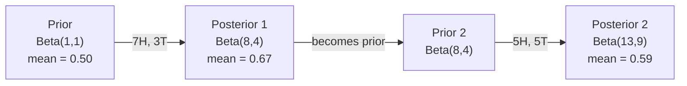

# نظرية بايز

> احتمالية  الاهتمام هو ما تتوقعه من حدوثها.

**类型：**بناء
**语言：**بايثون
**前置要求：**المرحلة الأولى، الدروس 06 ((أساسيات الاحتمال)
**时间：**75 دقيقة

## 學习目标

- تطبيق نظرية بايز، على أساس الاحتمالات السابقة والدليل الحساب الاحتمالات اللاحقة
- من صفر بناء واحد مع معدل Laplace و حسابات الموقع التسجيل البائس البديلة 文本分类器
- مقارنة تقييم MLE و MAP،并解释 MAP 如何对应 L2
- استخدام سابقات المشتركة بين البيتا-بينومية للاختبار A / B  تحقيق التحديث البايسي المتسلسل

## 问题

الاختبار الطبي لديه نسبة دقة 99٪. نتائج الاختبار كانت إيجابية. ما هي احتمالية مرضك الحقيقي؟

يقول معظم الناس أن 99%... الجواب الحقيقي يعتمد على أن هذا المرض نادر جدا... إذا كان واحد فقط من كل 10،000 شخص مصاب، فإن النتيجة الإيجابية واحدة تعني أنك لديك احتمال المرض بنسبة 1% تقريبا...

هذا ليس تحويل سريع في الدماغ. هذا هو نظرية بايز. كل مرشح بريد غير مرغوب فيه. كل تشخيص طبي. كل نموذج من النماذج المختلفة لا يزال يستخدم نفس التفكير.

إذا كنت لا تفهم هذا الأمر في حال تقوم ببناء نظام التكنولوجيا المعلوماتية، فسوف تفهم بشكل خاطئ نتائج النموذج، وتضع عتبة سيئة، وتصدر توقعات ذات ثقة مفرطة.

## 概念

### من احتمال المشترك إلى (بايز)

أنت تعلمت بالفعل في الدروس الستة احتمال الشرطية هي:

```
P(A|B) = P(A and B) / P(B)
```

على أرض الواقع:

```
P(B|A) = P(A and B) / P(A)
```

两个表达式共享同一个分子:P(A وB)。令它们相等并重新整理:

```
P(A and B) = P(A|B) * P(B) = P(B|A) * P(A)

Therefore:

P(A|B) = P(B|A) * P(A) / P(B)
```

هذا هو نظرية بايز.

### أربعة أجزاء

| Part | Name | What it means |
|------|------|---------------|
| P(A\|B) | Posterior | 看到 evidence B 之后，你对 A 的更新后 belief |
| P(B\|A) | Likelihood | 如果 A 为真，evidence B 出现的概率有多大 |
| P(A) | Prior | 在看到任何 evidence 之前，你对 A 的 belief |
| P(B) | Evidence | 在所有可能性下看到 B 的总概率 |

دليل 项 P(B) 起到归一化因子的作用──你可以用总概率法 展开它:

```
P(B) = P(B|A) * P(A) + P(B|not A) * P(not A)
```

### 医学检测 نموذج

يؤثر مرض واحد على 1 شخص من كل 10 آلاف شخص.

```
P(sick)          = 0.0001     (prior: disease is rare)
P(positive|sick) = 0.99       (likelihood: test catches it)
P(positive|healthy) = 0.01    (false positive rate)

P(positive) = P(positive|sick) * P(sick) + P(positive|healthy) * P(healthy)
            = 0.99 * 0.0001 + 0.01 * 0.9999
            = 0.000099 + 0.009999
            = 0.010098

P(sick|positive) = P(positive|sick) * P(sick) / P(positive)
                 = 0.99 * 0.0001 / 0.010098
                 = 0.0098
                 = 0.98%
```

لا يصل إلى 1%.  الهيمنة الاولى. عندما تكون حالات نادرة جدا، حتى الاختبار الدقيق غالبا ما ينتج إيجابيات كاذبة.

### نموذج مرشحات البريد الإلكتروني

هل تلقيت رسالة بريد إلكتروني تتضمن كلمة "لوتري" ؟

```
P(spam)                = 0.3      (30% of email is spam)
P("lottery"|spam)      = 0.05     (5% of spam emails contain "lottery")
P("lottery"|not spam)  = 0.001    (0.1% of legitimate emails contain "lottery")

P("lottery") = 0.05 * 0.3 + 0.001 * 0.7
             = 0.015 + 0.0007
             = 0.0157

P(spam|"lottery") = 0.05 * 0.3 / 0.0157
                  = 0.955
                  = 95.5%
```

كلمة واحدة على الاحتمال من 30% 推高 إلى 95.5% ‬‬‬‬‬‬‬‬‬‬‬‬‬‬‬‬‬‬‬‬‬‬‬‬‬‬‬‬‬‬‬‬‬‬‬‬‬‬‬‬‬‬‬‬‬‬‬‬‬‬‬‬‬‬‬‬‬‬‬‬‬‬‬‬‬‬‬‬‬‬‬‬‬‬‬‬‬‬‬‬‬‬‬‬‬‬‬‬‬‬‬‬‬‬‬‬‬‬‬‬‬‬‬‬‬‬‬‬‬‬‬‬‬‬‬‬‬‬‬‬‬‬‬‬‬‬‬‬‬‬‬‬‬‬‬‬‬‬‬‬‬‬‬‬‬‬‬‬‬‬‬‬‬‬‬‬‬‬‬‬‬‬‬‬‬‬‬‬‬‬‬‬‬‬‬‬‬‬‬‬‬‬‬‬‬‬‬‬‬‬‬‬‬‬‬‬‬‬‬‬‬‬‬‬‬‬‬‬‬‬‬‬‬‬‬‬‬‬‬‬‬‬‬‬‬‬‬‬‬‬‬‬‬‬‬‬‬‬‬‬‬‬‬‬‬‬‬‬‬‬‬‬‬‬‬‬‬‬‬‬‬‬‬‬‬‬‬‬‬‬‬‬‬‬‬‬‬‬‬‬‬‬‬‬‬‬‬‬‬‬‬‬‬‬‬‬‬‬‬‬‬‬‬‬‬‬‬‬‬‬‬‬‬‬‬‬‬‬‬‬‬‬‬‬‬‬‬‬‬‬‬‬‬‬‬‬‬‬‬‬‬‬‬‬‬‬‬‬‬‬‬‬‬‬‬‬‬‬‬‬‬‬‬‬‬‬‬‬‬‬‬‬‬‬‬‬‬‬‬‬‬‬‬‬‬‬‬‬‬‬‬‬‬‬‬‬‬‬‬‬‬‬‬‬‬‬‬‬‬‬‬‬‬‬‬‬‬‬‬‬‬‬‬‬‬‬‬‬‬‬‬‬‬‬‬‬‬‬‬‬‬‬‬‬‬‬‬‬‬‬‬‬‬‬‬‬‬‬‬‬‬‬‬‬‬‬‬‬‬‬‬‬‬‬‬‬‬‬‬‬‬‬‬‬‬‬‬‬‬‬‬‬‬‬

### البراغي (بايس): افتراض الاستقلال

بايز البديل من خلال فرض جميع الميزات في ظل ظروف فئة معينة مستقلة عن بعضها البعض، ووضع هذا الفكر في العديد من الميزات:

```
P(class | feature_1, feature_2, ..., feature_n)
  = P(class) * P(feature_1|class) * P(feature_2|class) * ... * P(feature_n|class)
    / P(feature_1, feature_2, ..., feature_n)
```

جزء من "سافية" هو افتراض الاستقلال. في الكتاب، ظهور الكلمات ليس مستقلًا. ولكن هذا الافتراض يؤدي بشكل غريب في الممارسة العملية، لأن الجهاز التقسيمي يتطلب فقط ترتيب الفئات، وليس إنتاج احتمالات جيدة للتصنيف.

لأن كل الفئات هي نفسها، يمكنك أن تتجاوزها، فقط مقارنة الجزيئات:

```
score(class) = P(class) * product of P(feature_i | class)
```

اختيار أفضل درجة

### تقدير الحد الأقصى للاحتمالات (MLE)

كيفية الحصول على البيانات من التدريب في الميزات في الفئة؟

```
P("free"|spam) = (number of spam emails containing "free") / (total spam emails)
```

هذا هو MLE: اختيار جعل بيانات المشاهدة من الممكن أن تظهر القيمة المعايير.

问题: إذا كان كلمة ما لم تظهر في البريد الإلكتروني خلال التدريب، سوف تعطيه توزيع صفر احتمالات. 问题: إذا كان كلمة ما لم تظهر في البريد الإلكتروني خلال التدريب، سوف تعطيه توزيع صفر احتمالات. 问题:

```
P(word|class) = (count(word, class) + 1) / (total_words_in_class + vocabulary_size)
```

أعط كل عدد إضافة إلى 1، تأكد من أن أي احتمالات لن تكون صفر.

### الحد الأقصى a posteriori (MAP)

MLE 问的是: أي معايير تحسين P(معلومات معايير) ؟

السؤال هو: ما هي المعايير التي تُحدد أكبر قدر من المعايير التي يتم استخدامها في البيانات ؟

وفقًا لنظرية (بايز):

```
P(parameters|data) proportional to P(data|parameters) * P(parameters)
```

MAP سوف تكون في المعلمات نفسها إضافة إلى سابقة. إذا كنت تعتقد أن المعلمات  ينبغي أن تكون أصغر، فلتقوم بتعديلها لتحديد القيمة الكبيرة من قبل.

| Estimation | Optimizes | ML equivalent |
|------------|-----------|---------------|
| MLE | P(data\|params) | 未 regularize 的训练 |
| MAP | P(data\|params) * P(params) | L2 / L1 regularization |

### البايسية مقابل المتكررة:实践差异

يضعون المعايير على أنها مقياس ثابتة غير معروفة. يسألون: إذا قمت بإعادة هذه التجربة مرات عديدة، ماذا سيحدث؟

يضعون المعايير 视为分布── يسألون:  بناء على ما لاحظته، ما هي معتقداتي لهذه المعايير؟

بالنسبة لبناء نظام ML، فإن التفاوتات العملية هي:

| Aspect | Frequentist | Bayesian |
|--------|-------------|----------|
| Output | 点估计 | 值上的 distribution |
| Uncertainty | Confidence intervals（关于过程） | Credible intervals（关于 parameter） |
| Small data | 可能 overfit | Prior 起到 regularization 的作用 |
| Computation | 通常更快 | 通常需要 sampling（MCMC） |

معظم درجات الإنتاج ML هي المتكررة من ((SGD、 نقطة التقدير)  عندما تحتاج إلى تحديد عدم اليقين الجيد (((قرارات طبية、 نظام أمن، أو البيانات قليلة ((تعلم قليل المصاصات、 بداية باردة)) ، ستكون الأساليب البايسية مفيدة جدا ً

### لماذا التفكير البايسي مهم بالنسبة لـ ML

هذا النوع من العلاقات

**Priors 就是 regularization。**الوزن العليا من قبل غوسيان هو L2 التنظيم.

**Posteriors 就是不确定性。**单个预测概率不能告诉你模型对该估算有多信心.                                                                                                                                                                                                                                                      

**Bayes updates 就是 online learning。**ما بعد اليوم سوف يصبح ما قبل الغد. عندما ترى نموذجك البيانات الجديدة، فإنه سوف يزيد من تحديث معتقداته بدلا من إعادة التدريب من الصفر.

**Model comparison 是 Bayesian 的。**معايير المعلومات البايزية (BIC) ‬احتمال هامشية و عوامل البايز ‬‬‬‬‬‬‬‬‬‬‬‬‬‬‬‬‬‬‬‬‬‬‬‬‬‬‬‬‬‬‬‬‬‬‬‬‬‬‬‬‬‬‬‬‬‬‬‬‬‬‬‬‬‬‬‬‬‬‬‬‬‬‬‬‬‬‬‬‬‬‬‬‬‬‬‬‬‬‬‬‬‬‬‬‬‬‬‬‬‬‬‬‬‬‬‬‬‬‬‬‬‬‬‬‬‬‬‬‬‬‬‬‬‬‬‬‬‬‬‬‬‬‬‬‬‬‬‬‬‬‬‬‬‬‬‬‬‬‬‬‬‬‬‬‬‬‬‬‬‬‬‬‬‬‬‬‬‬‬‬‬‬‬‬‬‬‬‬‬‬‬‬‬‬‬‬‬‬‬‬‬‬‬‬‬‬‬‬‬‬‬‬‬‬‬‬‬‬‬‬‬‬‬‬‬‬‬‬‬‬‬‬‬‬‬‬‬‬‬‬‬‬‬‬‬‬‬‬‬‬‬‬‬‬‬‬‬‬‬‬‬‬‬‬‬‬‬‬‬‬‬‬‬‬‬‬‬‬‬‬‬‬‬‬‬‬‬‬‬‬‬‬‬‬‬‬‬‬‬‬‬‬‬‬‬‬‬‬‬‬‬‬‬‬‬‬‬‬‬‬‬‬‬‬‬‬‬‬‬‬‬‬‬‬‬‬‬‬‬‬‬‬‬‬‬‬‬‬‬‬‬‬‬‬‬‬‬‬‬‬‬‬‬‬‬‬‬‬‬‬‬‬‬‬‬‬‬‬‬‬‬‬‬‬‬‬‬‬‬‬‬‬‬‬‬‬‬‬‬‬‬‬‬‬‬‬‬‬‬‬‬‬‬‬‬‬‬‬‬‬‬‬‬‬‬‬‬‬‬‬‬‬‬‬‬‬‬‬‬‬‬‬‬‬‬‬‬‬‬‬‬‬‬‬‬‬‬‬‬‬‬‬‬‬‬‬‬‬‬‬‬‬‬‬‬‬‬‬‬‬‬‬‬‬‬‬‬‬‬‬‬‬‬‬‬‬‬‬‬‬‬‬‬‬


```figure
bayes-update
```

## بناءها
### 步骤 1: وظيفة نظرية بايز

```python
def bayes(prior, likelihood, false_positive_rate):
    evidence = likelihood * prior + false_positive_rate * (1 - prior)
    posterior = likelihood * prior / evidence
    return posterior

result = bayes(prior=0.0001, likelihood=0.99, false_positive_rate=0.01)
print(f"P(sick|positive) = {result:.4f}")
```

### 步骤 2: مؤسسة "نايف بايز"

```python
import math
from collections import defaultdict

class NaiveBayes:
    def __init__(self, smoothing=1.0):
        self.smoothing = smoothing
        self.class_counts = defaultdict(int)
        self.word_counts = defaultdict(lambda: defaultdict(int))
        self.class_word_totals = defaultdict(int)
        self.vocab = set()

    def train(self, documents, labels):
        for doc, label in zip(documents, labels):
            self.class_counts[label] += 1
            words = doc.lower().split()
            for word in words:
                self.word_counts[label][word] += 1
                self.class_word_totals[label] += 1
                self.vocab.add(word)

    def predict(self, document):
        words = document.lower().split()
        total_docs = sum(self.class_counts.values())
        vocab_size = len(self.vocab)
        best_class = None
        best_score = float("-inf")
        for cls in self.class_counts:
            score = math.log(self.class_counts[cls] / total_docs)
            for word in words:
                count = self.word_counts[cls].get(word, 0)
                total = self.class_word_totals[cls]
                score += math.log((count + self.smoothing) / (total + self.smoothing * vocab_size))
            if score > best_score:
                best_score = score
                best_class = cls
        return best_class
```

يمكن منع احتمالات التخفيض. العديد من احتمالات صغيرة جداً تتضاعف إلى نقطة عائمة من أجل عدد صغير جداً.

### الخطوة الثالثة: تدريب على البيانات البريد الإلكتروني

```python
train_docs = [
    "win free money now",
    "free lottery ticket winner",
    "claim your prize today free",
    "urgent offer free cash",
    "congratulations you won free",
    "meeting tomorrow at noon",
    "project update attached",
    "can we schedule a call",
    "quarterly report review",
    "lunch on thursday sounds good",
    "team standup notes attached",
    "please review the pull request",
]

train_labels = [
    "spam", "spam", "spam", "spam", "spam",
    "ham", "ham", "ham", "ham", "ham", "ham", "ham",
]

classifier = NaiveBayes()
classifier.train(train_docs, train_labels)

test_messages = [
    "free money waiting for you",
    "meeting rescheduled to friday",
    "you won a free prize",
    "please review the attached report",
]

for msg in test_messages:
    print(f"  '{msg}' -> {classifier.predict(msg)}")
```

### الخطوة 4: الاختبار تعلم إلى احتمالية

```python
def show_top_words(classifier, cls, n=5):
    vocab_size = len(classifier.vocab)
    total = classifier.class_word_totals[cls]
    probs = {}
    for word in classifier.vocab:
        count = classifier.word_counts[cls].get(word, 0)
        probs[word] = (count + classifier.smoothing) / (total + classifier.smoothing * vocab_size)
    sorted_words = sorted(probs.items(), key=lambda x: x[1], reverse=True)
    for word, prob in sorted_words[:n]:
        print(f"    {word}: {prob:.4f}")

print("\nTop spam words:")
show_top_words(classifier, "spam")
print("\nTop ham words:")
show_top_words(classifier, "ham")
```

## استخدمها
سيكيت-تعلم قدمت عمليات بييز الباهظة يمكن إنتاجها

```python
from sklearn.feature_extraction.text import CountVectorizer
from sklearn.naive_bayes import MultinomialNB
from sklearn.metrics import classification_report

vectorizer = CountVectorizer()
X_train = vectorizer.fit_transform(train_docs)
clf = MultinomialNB()
clf.fit(X_train, train_labels)

X_test = vectorizer.transform(test_messages)
predictions = clf.predict(X_test)
for msg, pred in zip(test_messages, predictions):
    print(f"  '{msg}' -> {pred}")
```

مع الخوارزمية.‬CountVectorizer 处理 Tokenization 和 building vocabulary‬‬‬‬‬‬‬‬‬‬‬‬‬‬‬‬‬‬‬‬‬‬‬‬‬‬‬‬‬‬‬‬‬‬‬‬‬‬‬‬‬‬‬‬‬‬‬‬‬‬‬‬‬‬‬‬‬‬‬‬‬‬‬‬‬‬‬‬‬‬‬‬‬‬‬‬‬‬‬‬‬‬‬‬‬‬‬‬‬‬‬‬‬‬‬‬‬‬‬‬‬‬‬‬‬‬‬‬‬‬‬‬‬‬‬‬‬‬‬‬‬‬‬‬‬‬‬‬‬‬‬‬‬‬‬‬‬‬‬‬‬‬‬‬‬‬‬‬‬‬‬‬‬‬‬‬‬‬‬‬‬‬‬‬‬‬‬‬‬‬‬‬‬‬‬‬‬‬‬‬‬‬‬‬‬‬‬‬‬‬‬‬‬‬‬‬‬‬‬‬‬‬‬‬‬‬‬‬‬‬‬‬‬‬‬‬‬‬‬‬‬‬‬‬‬‬‬‬‬‬‬‬‬‬‬‬‬‬‬‬‬‬‬‬‬‬‬‬‬‬‬‬‬‬‬‬‬‬‬‬‬‬‬‬‬‬‬‬‬‬‬‬‬‬‬‬‬‬‬‬‬‬‬‬‬‬‬‬‬‬‬‬‬‬‬‬‬‬‬‬‬‬‬‬‬‬‬‬‬‬‬‬‬‬‬‬‬‬‬‬‬‬‬‬‬‬‬‬‬‬‬‬‬‬‬‬‬‬‬‬‬‬‬‬‬‬‬‬‬‬‬‬‬‬‬‬‬‬‬‬‬‬‬‬‬‬‬‬‬‬‬‬‬‬‬‬‬‬‬‬‬‬‬‬‬‬‬‬‬‬‬‬‬‬‬‬‬‬‬‬‬‬‬‬‬‬‬‬‬‬‬‬‬‬‬‬‬‬‬‬‬‬‬‬‬‬‬‬‬‬‬‬‬‬‬‬‬‬‬‬‬‬‬‬‬‬‬‬‬‬‬‬‬‬‬‬‬‬‬‬‬‬‬‬‬‬‬‬‬‬‬‬‬‬‬‬‬‬‬‬‬‬‬‬‬‬‬

## 交付 it
هذه هي درجة NaiveBayes التي تم بناؤها  عرضت خط الأنابيب الكامل: التوكينيزة  استخدام تخمين احتمالات تسطيح Laplace  توقعات الموقع`code/bayes.py`يمكن تشغيل الكود من جانب إلى آخر، لا تحتاج إلى أي اعتماد، باستثناء مكتبة Python القياسية.

### الاولى المتزوجة

عندما ينتمي الاسبق واللاحق إلى نفس أسرة التوزيع ، يسمى هذا الاسبق "مشترك"。 وهذا يجعل تحديث البايسية في العدد صافاً جداًلا تحتاج إلى دمج عددي حتى تتمكن من الحصول على شكل مغلق الاسبق‬‬‬‬‬‬‬‬‬‬‬‬‬‬‬‬‬‬‬‬‬‬‬‬‬‬‬‬‬‬‬‬‬‬‬‬‬‬‬‬‬‬‬‬‬‬‬‬‬‬‬‬‬‬‬‬‬‬‬‬‬‬‬‬‬‬‬‬‬‬‬‬‬‬‬‬‬‬‬‬‬‬‬‬‬‬‬‬‬‬‬‬‬‬‬‬‬‬‬‬‬‬‬‬‬‬‬‬‬‬‬‬‬‬‬‬‬‬‬‬‬‬‬‬‬‬‬‬‬‬‬‬‬‬‬‬‬‬‬‬‬‬‬‬‬‬‬‬‬‬‬‬‬‬‬‬‬‬‬‬‬‬‬‬‬‬‬‬‬‬‬‬‬‬‬‬‬‬‬‬‬‬‬‬‬‬‬‬‬‬‬‬‬‬‬‬‬‬‬‬‬‬‬‬‬‬‬‬‬‬‬‬‬‬‬‬‬‬‬‬‬‬‬‬‬‬‬‬‬‬‬‬‬‬‬‬‬‬‬‬‬‬‬‬‬‬‬‬‬‬‬‬‬‬‬‬‬‬‬‬‬‬‬‬‬‬‬‬‬‬‬‬‬‬‬‬‬‬‬‬‬‬‬‬‬‬‬‬‬‬‬‬‬‬‬‬‬‬‬‬‬‬‬‬‬‬‬‬‬‬‬‬‬‬‬‬‬‬‬‬‬‬‬‬‬‬‬‬‬‬‬‬‬‬‬‬‬‬‬‬‬‬‬‬‬‬‬‬‬‬‬‬‬‬‬‬‬‬‬‬‬‬‬‬‬‬‬‬‬‬‬‬‬‬‬‬‬‬‬‬‬‬‬‬‬‬‬‬‬‬‬‬‬‬‬‬‬‬‬‬‬‬‬‬‬‬‬‬‬‬‬‬‬‬‬‬‬‬‬‬‬‬‬‬‬‬‬‬‬‬‬‬‬‬‬‬‬‬‬‬‬‬‬

| Likelihood | Conjugate Prior | Posterior | Example |
|-----------|----------------|-----------|---------|
| Bernoulli | Beta(a, b) | Beta(a + successes, b + failures) | Coin flip bias estimation |
| Normal (known variance) | Normal(mu_0, sigma_0) | Normal(weighted mean, smaller variance) | Sensor calibration |
| Poisson | Gamma(a, b) | Gamma(a + sum of counts, b + n) | Modeling arrival rates |
| Multinomial | Dirichlet(alpha) | Dirichlet(alpha + counts) | Topic modeling, language models |

هذا ما يهم: عندما لا توجد سابقات متضاربة، تحتاج إلى عينات مونت كارلو أو استنتاجات تغيرية من قريبة إلى عقب.

التوزيع البيتا هو الأكثر شيوعاً في الممارسة التجريبية.

حالة خاصة من قبل البيتا:
- بيتا ((1، 1) = متساوية。 أنت على المعيار 没有意见。
- بيتا ((10, 10) = في 0.5  بالقرب من الوصول إلى القمة.
- بيتا ((1، 10) = إلى 0 偏斜──你相信参数 很小──

更新规则极其简单:

```
Prior:     Beta(a, b)
Data:      s successes, f failures
Posterior: Beta(a + s, b + f)
```

لا يوجد أي نموذج، لا يوجد سوى إضافة

### تحديث بايزي متسلسل

استنتاج بايسي 天然是序列的── اليوم اللاحق سوف تصبح قبل الغد── هذا هو كيفية تعلم النظام الواقعي في حالة عدم إعادة معالجة جميع البيانات التاريخية──

مثال محدد: تقدير ما إذا كان واحد العملة عادلة.

**Day 1：还没有数据。**
من Beta ((1, 1) 开始一个制服前──你没有意见──
- متوسط سابق: 0.5
- السابق في [0, 1] 上是平坦的

**Day 2：观察到 7 次正面，3 次反面。**
الخلفي = بيتا ((1 + 7 ، 1 + 3) = بيتا ((8, 4)
- متوسط الخلفي:8/12 = 0.667
- الأدلة تظهر أن العملة الرقمية متجهة نحو الصواب

**Day 3：又观察到 5 次正面，5 次反面。**
استخدام البارحة اللاحقة كـ الاسبوع الراهن
الخلفي = بيتا ((8 + 5 ، 4 + 5) = بيتا ((13, 9)
- المتوسط الخلفي: 13/22 = 0.591
- و قد عادت قيمة التوازن الجديدة إلى حوالي 0.5



观测顺序不重要――Beta(1,1) 一次性用全部12次正面和8次反面更新,也会得到Beta(13, 9) 结果相同── 序列更新和批次更新 在数学上等价──但序列更新 允许你在每一步做决定,而不必存储原始数据──

هذا هو أساس التعلم عبر الإنترنت في نظام ML من الدرجة الإنتاجية. تستخدم عينة تومبسون للصوص.

### الاتصال مع اختبار A/B

اختبار A/B هو في الأساس استنتاج بايزي من التخيليات التي نشأت.

设定:你正在测试两种按颜色──A蓝色和B绿色──你想知道哪一个得到更多点击──

اختبار بييزيان A/B:

1. **Prior。**2 فاريان                                                                                                                                                                                                                                                            
2. **Data。**الفارقة A:1000 مرة عرضها 50 مرة点击── الفارقة B:1000 مرة عرضها 65 مرة点击──
3. **Posteriors。**
   - أ:بيتا ((1 + 50 ، 1 + 950) = بيتا ((51, 951)
   - ب:بيتا ((1 + 65، 1 + 935) = بيتا ((66, 936) ――المتوسط = 0.066
4. **Decision。**计算 P(B > A) B ٪ معدلات التحويل الحقيقية 高于 A 的概率──

解析地计算 P(B > A) 很困难――但 مونت كارلو 让它变得非常简单:

```
1. Draw 100,000 samples from Beta(51, 951)  -> samples_A
2. Draw 100,000 samples from Beta(66, 936)  -> samples_B
3. P(B > A) = fraction of samples where B > A
```

إذا كان P(B > A) > 0.95, فلنصدر الفارقة B.

مقارنة مع اختبار A/B المتكرر:
- ستحصل على احتمال مباشر:
- 没有 p-value 混──没有  failed to reject the null hypothesis  这种回避表述──
- يمكنك مشاهدة النتائج في أي وقت، دون رفع معدلات الإيجابية الكاذبة ((ليس هناك مشكلة في البحث))
- يمكنك أن تضم المعرفة السابقة، على سبيل المثال، التجارب السابقة التي أظهرت معدلات التحويل عادة ما تكون 3-8٪

| Aspect | Frequentist A/B | Bayesian A/B |
|--------|----------------|--------------|
| Output | p-value | P(B > A) |
| Interpretation | “如果 A=B，这些数据有多令人意外？” | “B 比 A 更好的可能性有多大？” |
| Early stopping | 会抬高 false positives | 任意时点都是安全的（前提是 prior 选择合理且 model specification 正确） |
| Prior knowledge | 不使用 | 编码为 Beta prior |
| Decision rule | p < 0.05 | P(B > A) > threshold |

## التدريب
1. **Multiple tests。**كان مريض واحد مثير للإيجابية في اثنين من الاختبارات المستقلة، والتي كانت 99٪ صحيحة، معدل انتشار المرض هو 1 شخص من كل 10,000 شخص.

2. **Smoothing impact。**استخدام 0.01、0.1、1.0 و 10.0 من قيم التسهيل 运行垃圾邮件 تصنيف.

3. **Add features。**扩展 NaiveBayes class, make it apart from word counts 之外,也使用消息长度(短/长) كميزة──从训练数据中估计 P((((((((短短的),并把它合并到预测分数 中──

4. **MAP by hand。**给定观测数据 ((10 مرات مناقشة العملة في وسط 7 مرات الرأس) ، باستخدام Beta(2,2) قبل 计算 التحيز التقديرات المخططات.

## 关键术语
| Term | What people say | What it actually means |
|------|----------------|----------------------|
| Prior | “我的初始猜测” | 观测 evidence 之前的 P(hypothesis)。在 ML 中：regularization 项。 |
| Likelihood | “数据拟合得有多好” | P(evidence\|hypothesis)。在特定 hypothesis 下，观测数据出现的概率有多大。 |
| Posterior | “我更新后的 belief” | P(hypothesis\|evidence)。Prior 乘以 likelihood，然后归一化。 |
| Evidence | “归一化常数” | 所有 hypotheses 下的 P(data)。确保 posterior 求和为 1。 |
| Naive Bayes | “那个简单的文本分类器” | 一个假设 features 在给定 class 时相互独立的分类器。尽管该假设不成立，效果仍然很好。 |
| Laplace smoothing | “Add-one smoothing” | 给每个 feature 增加一个小计数，以防止未见数据产生零概率。 |
| MLE | “直接用频率” | 选择最大化 P(data\|parameters) 的 parameters。没有 prior。在小数据上可能 overfit。 |
| MAP | “带 prior 的 MLE” | 选择最大化 P(data\|parameters) * P(parameters) 的 parameters。等价于 regularized MLE。 |
| Log-probability | “在 log space 中工作” | 使用 log(P) 而不是 P，避免许多小数相乘时发生 floating-point underflow。 |
| False positive | “错误警报” | 检测结果为阳性，但真实状态为阴性。它会推动 base rate fallacy。 |

## 延伸阅读
- [3Blue1Brown: Bayes' theorem](https://www.youtube.com/watch?v=HZGCoVF3YvM)- استخدام الاختبار الطبي مثالات التفسير
- [Stanford CS229: Generative Learning Algorithms](https://cs229.stanford.edu/notes2022fall/cs229-notes2.pdf)- صلة بايز البديهي مع النماذج المتميزة
- [Think Bayes](https://greenteapress.com/wp/think-bayes/)- 免费书籍,包含 Python 代码的贝塞亚统计
- [scikit-learn Naive Bayes](https://scikit-learn.org/stable/modules/naive_bayes.html)- تطبيق مستوى الإنتاج ومتى استخدام كل فارنت
