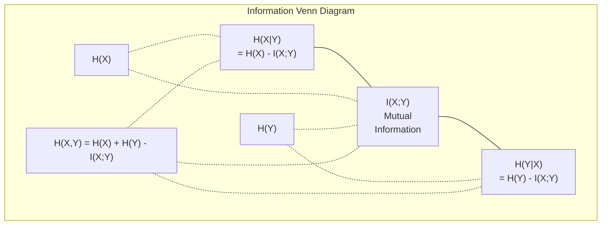

# نظرية المعلومات

> نظرية المعلومات قياس المفاجأة.

**Type:** Learn
**Language:**بايثون
**Prerequisites:** Phase 1, Lesson 06 (Probability)
**Time:** ~60 分钟

## 學习目标

- من صفر حساب الانتروبيا ‧الإنتروبيا المتقاطعة و KL التباين، ومفسرة العلاقة بينها
- 推导为什么 تقليل الخسارة المتقاطعة للاندروبي 等价格 إلى زيادة احتمالات التسجيل
- المعلومات المتبادلة بين ميزات الحساب والهدف، لتنظيم أهمية الميزات
- 将困惑 解释为语言模型 从中选择的有效词汇规模

## 问题

كل نموذج تصنيف في التدريب سيتم استخدامه`CrossEntropyLoss()` ترى في كل نموذج لغوي في مقال كل شيء تعارض  تراه في VAEs والتقطير و RLHF تقرأ إلى اختلاف KL♦ هذه المفاهيم ليست متفرقة بعضها البعض♦ هي نفس الفكر على ملابس خارجية مختلفة♦

نظرية المعلومات 为你提供推理不确定性、压缩 和预测的语言──كلود شانون في 1948، اخترعها، لتحل مشكلة الاتصال‬، نتيجة تثبت، تدريب شبكة العصبية أيضا مشكلة الاتصال: النموذج 正试图通过学习权重 组成的噪音频道 传递正确标签‬‬

هذا الدروس سوف يبدأ من الصفر بناء كل فورمولا، دعونا نرى من أين تأتي، ولماذا هي فعالة.

## 概念

### 信息量(فاجأة)

عندما يحدث ما لا يمكن أن يحدث، فإنه يحمل المزيد من المعلومات.

概率 للحدث                                                                                                                                                                                                                                                                                                                                                                                                                                                                                                                         

```
I(x) = -log(p(x))
```

استخدام 2 لأساسات  الحصول على بعض القطع  استخدام الطبيعي  الحصول على نفس الفكر ، وحدات مختلفة 

```
Event              Probability    Surprise (bits)
Fair coin heads    0.5            1.0
Rolling a 6        0.167          2.58
1-in-1000 event    0.001          9.97
Certain event      1.0            0.0
```

تحديد الحدث يحمل معلومات لا تكتشفها

### (الإنتروبيا)

الإنتروبي هو توزيع مفاجأة متوقعة من جميع النتائج المحتملة.

```
H(P) = -sum( p(x) * log(p(x)) )  for all x
```

العملة العادلة بالنسبة المتغير الثنائي  مع أقصى إنتروبيّة: 1 بت ‬‬‬‬‬‬‬‬‬‬‬‬‬‬‬‬‬‬‬‬‬‬‬‬‬‬‬‬‬‬‬‬‬‬‬‬‬‬‬‬‬‬‬‬‬‬‬‬‬‬‬‬‬‬‬‬‬‬‬‬‬‬‬‬‬‬‬‬‬‬‬‬‬‬‬‬‬‬‬‬‬‬‬‬‬‬‬‬‬‬‬‬‬‬‬‬‬‬‬‬‬‬‬‬‬‬‬‬‬‬‬‬‬‬‬‬‬‬‬‬‬‬‬‬‬‬‬‬‬‬‬‬‬‬‬‬‬‬‬‬‬‬‬‬‬‬‬‬‬‬‬‬‬‬‬‬‬‬‬‬‬‬‬‬‬‬‬‬‬‬‬‬‬‬‬‬‬‬‬‬‬‬‬‬‬‬‬‬‬‬‬‬‬‬‬‬‬‬‬‬‬‬‬‬‬‬‬‬‬‬‬‬‬‬‬‬‬‬‬‬‬‬‬‬‬‬‬‬‬‬‬‬‬‬‬‬‬‬‬‬‬‬‬‬‬‬‬‬‬‬‬‬‬‬‬‬‬‬‬‬‬‬‬‬‬‬‬‬‬‬‬‬‬‬‬‬‬‬‬‬‬‬‬‬‬‬‬‬‬‬‬‬‬‬‬‬‬‬‬‬‬‬‬‬‬‬‬‬‬‬‬‬‬‬‬‬‬‬‬‬‬‬‬‬‬‬‬‬‬‬‬‬‬‬‬‬‬‬‬‬‬‬‬‬‬‬‬‬‬‬‬‬‬‬‬‬‬‬‬‬‬‬‬‬‬‬‬‬‬‬‬‬‬‬‬‬‬‬‬‬‬‬‬‬‬‬‬‬‬‬‬‬‬‬‬‬‬‬‬‬‬‬‬‬‬‬‬‬‬‬‬‬‬‬‬‬‬‬‬‬‬‬‬‬‬‬‬‬‬‬‬‬‬‬‬‬‬‬‬‬‬‬‬‬‬‬‬‬‬‬‬‬‬‬‬‬‬‬‬‬‬‬‬‬‬‬‬‬‬‬‬‬‬‬‬‬‬‬‬‬‬‬‬‬

```
Fair coin:    H = -(0.5 * log2(0.5) + 0.5 * log2(0.5)) = 1.0 bit
Biased coin:  H = -(0.99 * log2(0.99) + 0.01 * log2(0.01)) = 0.08 bits
```

الإنتروبي يقيس توزيعاً لا يمكن تحديده من عدم اليقين.

### التقاطع (تداول الخسارة في كل يوم)

التوزيع المتقاطع الاندروبي قياس عندما تستخدم التوزيع Q 来编码 فعليا من التوزيع P 的事件时,平均惊喜是多少──

```
H(P, Q) = -sum( p(x) * log(q(x)) )  for all x
```

إن ق هو التوزيع الحقيقي، والتي تُسمّي بالملفات، فإن ق هو التنبؤات الخاصة بنموذجك، وإذا كان ق مع P يتماشى تماما، فإن الإنتروبي المتقاطع، والذي يشبه الإنتروبي، فإن أيّ شيء غير متوافق سيجعل ذلك يتغير.

في التصنيف، P هو متجه واحد حار (التوقعات للطبقة الحقيقية هي 1، والآخرين كلها هي 0).

```
H(P, Q) = -log(q(true_class))
```

هذا هو التصنيف كاملة الخسارة المتقاطعة للاندروبي 公式──最大化正确类的预测概率──

### KL التباين (توزيعات  بين المسافة)

الاختلافات الكليترونية  قياس استخدام Q بدلا من P سوف تجلب الكثير من المفاجأة الإضافية 

```
D_KL(P || Q) = sum( p(x) * log(p(x) / q(x)) )  for all x
             = H(P, Q) - H(P)
```

الانتروبيا المتقاطعة هي الانتروبيا加 KL التباين.

الاختلاف KL 不是对称的:D_KL(P  Q) != D_KL(Q  P)── انها ليست مقياسة مسافة حقيقية‬

### المعلومات المتبادلة

المعلومات المتبادلة  قياس معرفة متغير 能告诉你另一个 متغير 多少信息──

```
I(X; Y) = H(X) - H(X|Y)
        = H(X) + H(Y) - H(X, Y)
```

إذا كان X و Y مستقلة، المعلومات المتبادلة هي صفر. تعرف واحدة منها لن تخبرك بأي معلومات من الأخرى. إذا كانت مرتبطة تماما، المعلومات المتبادلة مثل الانتروبية المتغيرات.

في اختيار الميزات، المعلومات المتبادلة بين الميزة والهدف  高، يعني أن الميزة لديها استخدام.

### الإنتروبي المشروط

H(Y في X) 衡观察到X 后, حول Y مازال هناك الكثير من عدم اليقين.

```
H(Y|X) = H(X,Y) - H(X)
```

两个极端:
- إذا كان X 完全 يقرر Y، ثم H  Y X  ) = 0──علم X                                                                                                                                                                                                                                                  
- إذا كان X على Y 没有任何信息,then H(Y في X) = H() ・・・ تعرف X 完全 لن يقلل من عدم اليقين الخاص بك‬‬‬‬‬‬‬‬‬‬‬‬‬‬‬‬‬‬‬‬‬‬‬‬‬‬‬‬‬‬‬‬‬‬‬‬‬‬‬‬‬‬‬‬‬‬‬‬‬‬‬‬‬‬‬‬‬‬‬‬‬‬‬‬‬‬‬‬‬‬‬‬‬‬‬‬‬‬‬‬‬‬‬‬‬‬‬‬‬‬‬‬‬‬‬‬‬‬‬‬‬‬‬‬‬‬‬‬‬‬‬‬‬‬‬‬‬‬‬‬‬‬‬‬‬‬‬‬‬‬‬‬‬‬‬‬‬‬‬‬‬‬‬‬‬‬‬‬‬‬‬‬‬‬‬‬‬‬‬‬‬‬‬‬‬‬‬‬‬‬‬‬‬‬‬‬‬‬‬‬‬‬‬‬‬‬‬‬‬‬‬‬‬‬‬‬‬‬‬‬‬‬‬‬‬‬‬‬‬‬‬‬‬‬‬‬‬‬‬‬‬‬‬‬‬‬‬‬‬‬‬‬‬‬‬‬‬‬‬‬‬‬‬‬‬‬‬‬‬‬‬‬‬‬‬‬‬‬‬‬‬‬‬‬‬‬‬‬‬‬‬‬‬‬‬‬‬‬‬‬‬‬‬‬‬‬‬‬‬‬‬‬‬‬‬‬‬‬‬‬‬‬‬‬‬‬‬‬‬‬‬‬‬‬‬‬‬‬‬‬‬‬‬‬‬‬‬‬‬‬‬‬‬‬‬‬‬‬‬‬‬‬‬‬‬‬‬‬‬‬‬‬‬‬‬‬‬‬‬‬‬‬‬‬‬‬‬‬‬‬‬‬‬‬‬‬‬‬‬‬‬‬‬‬‬‬‬‬‬‬‬‬‬‬‬‬‬‬‬‬‬‬‬‬‬‬‬‬‬‬‬‬‬‬‬‬‬‬‬‬‬‬‬‬‬‬‬‬‬‬‬‬‬‬‬‬‬‬‬‬‬‬‬‬‬‬‬‬‬‬‬‬‬‬‬‬‬‬‬‬‬‬‬‬‬‬‬‬‬‬‬‬‬

الإنتروبي المشروط 始终非负,并且永远不超过 H(Y):

```
0 <= H(Y|X) <= H(Y)
```

في التعلم الآلي، إنتروبيا المشروطة تظهر في أشجار القرارات. في كل فصل، الجيروتيم سوف يختار جعل H(Y يصل إلى X) أقل ميزة X، وذلك يعني إزالة عن علامة Y أكثر ميزة عدم اليقين.

### الإنتروبي المشترك

H(X,Y) هي الانتروبية المشتركة لتوزيع X وY واحد.

```
H(X,Y) = -sum sum p(x,y) * log(p(x,y))   for all x, y
```

关键性质:

```
H(X,Y) <= H(X) + H(Y)
```

عندما تشكل X و Y 独立时等号. إذا كانت تشارك المعلومات، فإن الانتروبيا المشتركة تكون أقل من الانتروبيا المشتركة.



هذه العلاقات:
- H(X,Y) = H(X) + H(Y أن يكون X) = H(Y) + H(X أن يكون
- (X;Y) = H(X) - H(IX
- H(X,Y) = H(X) + H(Y) - I(X;Y)

### المعلومات المتبادلة ((غوص عميق)

المعلومات المتبادلة I  X;Y) 量化知道 واحد المتغير سوف تقلل من عدم اليقين حول المتغير الآخر كم

```
I(X;Y) = H(X) - H(X|Y)
       = H(Y) - H(Y|X)
       = H(X) + H(Y) - H(X,Y)
       = sum sum p(x,y) * log(p(x,y) / (p(x) * p(y)))
```

جنسية:
- أنا (X;Y) >= 0 始终成立──观察某事永远不会让你失去信息──
- عندما يكون فقط عندما يكون X 和 Y 独立时,I(X;Y) = 0。
- I(X;Y) = I(Y;X)。 هو对称的, مختلف عن الاختلاف KL。
- I(X;X) = H(X)。 متغير مع نفسها مشاركة كل المعلومات‬

**用于 feature selection 的 mutual information。**في ML، تتميز الميزات التي تريدها من أجل الهدف بكمية المعلومات.

1. لكل ميزة X_i، حساب I(X_i؛ Y) ، من بينها Y هو المتغير المستهدف.
2. 按MI 排序特征──
3. حافظ على الخصائص

هذا ينطبق على أي علاقة بين الميزة والهدف: الخطية وغير الخطية، والوحدة أو العلاقات الأخرى.

| Method | Detects | Computational cost | Handles categorical? |
|--------|---------|-------------------|---------------------|
| Pearson correlation | Linear relationships | O(n) | No |
| Spearman correlation | Monotonic relationships | O(n log n) | No |
| Mutual information | 任意 statistical dependency | O(n log n) with binning | Yes |

### التسمين و التسريع المتقاطع

标准分类 使用硬目标:[0, 0, 1, 0]──真类 的概率为 1,其他全部为 0──标签滑滑 会用软目标 替换它们:

```
soft_target = (1 - epsilon) * hard_target + epsilon / num_classes
```

عندما الـ epsilon = 0.1 且有 4 个类 时:
- الهدف الصعب: [0، 0، 1، 0]
- الهدف الناعم: [0.025, 0.025, 0.925, 0.025]

من نظرية المعلومات 视角看,تسمية اللوحات 增加了 هدف التوزيع  انتروبيا الأهداف الحار واحد حار  0,也就是没有不确定性

لماذا هذا يساعد:
- 防止 model 将 logits 推向极端值 ((在交叉内,要完美匹配一个热目标 需要无限大的 logits)
- 作为规则化:模型 不能 100%自信
- تحسين التصفية:预测概率更好地 يعكس عدم اليقين الحقيقي
- 缩小训练行为与推断行为之间的差距

استخدام تسهيل اللقب 变为:

```
L = (1 - epsilon) * CE(hard_target, prediction) + epsilon * H_uniform(prediction)
```

الثانية: تعاقب التنبؤات بعيدة عن المواحدة، أي: التنظيم المباشر للثقة.

### لماذا التشويق المتقاطع هو جوهر فقدان التصنيف

ثلاثى وجهات نظر، مع الاستنتاج

**Information Theory 视角。**التوزيع المتقاطع للاندروبي قياس استخدام نموذجك بدلا من التوزيع الحقيقي 浪ست كم البيتات ‬‬‬‬‬‬‬‬‬‬‬‬‬‬‬‬‬‬‬‬‬‬‬‬‬‬‬‬‬‬‬‬‬‬‬‬‬‬‬‬‬‬‬‬‬‬‬‬‬‬‬‬‬‬‬‬‬‬‬‬‬‬‬‬‬‬‬‬‬‬‬‬‬‬‬‬‬‬‬‬‬‬‬‬‬‬‬‬‬‬‬‬‬‬‬‬‬‬‬‬‬‬‬‬‬‬‬‬‬‬‬‬‬‬‬‬‬‬‬‬‬‬‬‬‬‬‬‬‬‬‬‬‬‬‬‬‬‬‬‬‬‬‬‬‬‬‬‬‬‬‬‬‬‬‬‬‬‬‬‬‬‬‬‬‬‬‬‬‬‬‬‬‬‬‬‬‬‬‬‬‬‬‬‬‬‬‬‬‬‬‬‬‬‬‬‬‬‬‬‬‬‬‬‬‬‬‬‬‬‬‬‬‬‬‬‬‬‬‬‬‬‬‬‬‬‬‬‬‬‬‬‬‬‬‬‬‬‬‬‬‬‬‬‬‬‬‬‬‬‬‬‬‬‬‬‬‬‬‬‬‬‬‬‬‬‬‬‬‬‬‬‬‬‬‬‬‬‬‬‬‬‬‬‬‬‬‬‬‬‬‬‬‬‬‬‬‬‬‬‬‬‬‬‬‬‬‬‬‬‬‬‬‬‬‬‬‬‬‬‬‬‬‬‬‬‬‬‬‬‬‬‬‬‬‬‬‬‬‬‬‬‬‬‬‬‬‬‬‬‬‬‬‬‬‬‬‬‬‬‬‬‬‬‬‬‬‬‬‬‬‬‬‬‬‬‬‬‬‬‬‬‬‬‬‬‬‬‬‬‬‬‬‬‬‬‬‬‬‬‬‬‬‬‬‬‬‬‬‬‬‬‬‬‬‬‬‬‬‬‬‬‬‬‬‬‬‬‬‬‬‬‬‬‬‬‬‬‬‬‬‬‬‬‬‬‬‬‬‬‬‬‬‬‬‬‬‬‬‬‬‬‬‬‬‬‬‬‬‬‬‬‬‬‬‬‬‬

**Maximum likelihood 视角。**对于 N 个真类 为 y_i من عينات التدريب:

```
Likelihood     = product( q(y_i) )
Log-likelihood = sum( log(q(y_i)) )
Negative log-likelihood = -sum( log(q(y_i)) )
```

آخر خط هو فقدان الإنتروبي المتقاطع.

**Gradient 视角。**التقاطع الانتروبية  حول المنطقات 简单地是(توقع - صحيح) 干净、稳定、计算快速── هذا هو السبب في أن تكون مع softmax 完美配合──

### البيتس مقابل الناتس

الفرق الوحيد هو عدد الأسفل من السجلات

```
log base 2   -> bits      (information theory tradition)
log base e   -> nats      (machine learning convention)
log base 10  -> hartleys  (rarely used)
```

1 نات = 1/ln(2) بيت = 1.4427 بيتس。PyTorch 和 TensorFlow 默认使用自然log(ناتس)。

### الارتباك

الارتباك هو مؤشر التشويق المتقاطع. يخبرك النموذج غير المؤكد.

```
Perplexity = 2^H(P,Q)   (if using bits)
Perplexity = e^H(P,Q)   (if using nats)
```

الارتباك هو نموذج 50 لغة، على المتوسط، مثل يجب أن يكون من 50 个可能的下一个代币中均选择一样困惑──越低越好──

يصل GPT-2 في المعايير المرجعية العادية إلى حوالي 30 من الارتباكات.


```figure
entropy-kl
```

## بناءها

### 第 1 步:حجم المعلومات و الإنتروبي

```python
import math

def information_content(p, base=2):
    if p <= 0 or p > 1:
        return float('inf') if p <= 0 else 0.0
    return -math.log(p) / math.log(base)

def entropy(probs, base=2):
    return sum(
        p * information_content(p, base)
        for p in probs if p > 0
    )

fair_coin = [0.5, 0.5]
biased_coin = [0.99, 0.01]
fair_die = [1/6] * 6

print(f"Fair coin entropy:   {entropy(fair_coin):.4f} bits")
print(f"Biased coin entropy: {entropy(biased_coin):.4f} bits")
print(f"Fair die entropy:    {entropy(fair_die):.4f} bits")
```

### 步骤 2: الانتروبيا المتقاطعة والانحراف KL

```python
def cross_entropy(p, q, base=2):
    total = 0.0
    for pi, qi in zip(p, q):
        if pi > 0:
            if qi <= 0:
                return float('inf')
            total += pi * (-math.log(qi) / math.log(base))
    return total

def kl_divergence(p, q, base=2):
    return cross_entropy(p, q, base) - entropy(p, base)

true_dist = [0.7, 0.2, 0.1]
good_model = [0.6, 0.25, 0.15]
bad_model = [0.1, 0.1, 0.8]

print(f"Entropy of true dist:     {entropy(true_dist):.4f} bits")
print(f"CE (good model):          {cross_entropy(true_dist, good_model):.4f} bits")
print(f"CE (bad model):           {cross_entropy(true_dist, bad_model):.4f} bits")
print(f"KL divergence (good):     {kl_divergence(true_dist, good_model):.4f} bits")
print(f"KL divergence (bad):      {kl_divergence(true_dist, bad_model):.4f} bits")
```

### الخطوة الثالثة: التشابه المتقاطع كخسارة التصنيف

```python
def softmax(logits):
    max_logit = max(logits)
    exps = [math.exp(z - max_logit) for z in logits]
    total = sum(exps)
    return [e / total for e in exps]

def cross_entropy_loss(true_class, logits):
    probs = softmax(logits)
    return -math.log(probs[true_class])

logits = [2.0, 1.0, 0.1]
true_class = 0

probs = softmax(logits)
loss = cross_entropy_loss(true_class, logits)

print(f"Logits:      {logits}")
print(f"Softmax:     {[f'{p:.4f}' for p in probs]}")
print(f"True class:  {true_class}")
print(f"Loss:        {loss:.4f} nats")
print(f"Perplexity:  {math.exp(loss):.2f}")
```

### الخطوة الرابعة: التقاطع بين النخاعات يساوي احتمال التسجيل السلبي

```python
import random

random.seed(42)

n_samples = 1000
n_classes = 3
true_labels = [random.randint(0, n_classes - 1) for _ in range(n_samples)]
model_logits = [[random.gauss(0, 1) for _ in range(n_classes)] for _ in range(n_samples)]

ce_loss = sum(
    cross_entropy_loss(label, logits)
    for label, logits in zip(true_labels, model_logits)
) / n_samples

nll = -sum(
    math.log(softmax(logits)[label])
    for label, logits in zip(true_labels, model_logits)
) / n_samples

print(f"Cross-entropy loss:      {ce_loss:.6f}")
print(f"Negative log-likelihood: {nll:.6f}")
print(f"Difference:              {abs(ce_loss - nll):.2e}")
```

### الخطوة 5: المعلومات المتبادلة

```python
def mutual_information(joint_probs, base=2):
    rows = len(joint_probs)
    cols = len(joint_probs[0])

    margin_x = [sum(joint_probs[i][j] for j in range(cols)) for i in range(rows)]
    margin_y = [sum(joint_probs[i][j] for i in range(rows)) for j in range(cols)]

    mi = 0.0
    for i in range(rows):
        for j in range(cols):
            pxy = joint_probs[i][j]
            if pxy > 0:
                mi += pxy * math.log(pxy / (margin_x[i] * margin_y[j])) / math.log(base)
    return mi

independent = [[0.25, 0.25], [0.25, 0.25]]
dependent = [[0.45, 0.05], [0.05, 0.45]]

print(f"MI (independent): {mutual_information(independent):.4f} bits")
print(f"MI (dependent):   {mutual_information(dependent):.4f} bits")
```

## استخدمها

استخدام NumPy للإعلان عن نفس المفهوم، وذلك هو الطريقة التي تستخدمها في الممارسة:

```python
import numpy as np

def np_entropy(p):
    p = np.asarray(p, dtype=float)
    mask = p > 0
    result = np.zeros_like(p)
    result[mask] = p[mask] * np.log(p[mask])
    return -result.sum()

def np_cross_entropy(p, q):
    p, q = np.asarray(p, dtype=float), np.asarray(q, dtype=float)
    mask = p > 0
    return -(p[mask] * np.log(q[mask])).sum()

def np_kl_divergence(p, q):
    return np_cross_entropy(p, q) - np_entropy(p)

true = np.array([0.7, 0.2, 0.1])
pred = np.array([0.6, 0.25, 0.15])
print(f"Entropy:    {np_entropy(true):.4f} nats")
print(f"Cross-ent:  {np_cross_entropy(true, pred):.4f} nats")
print(f"KL div:     {np_kl_divergence(true, pred):.4f} nats")
```

لقد بنيت من الصفر`torch.nn.CrossEntropyLoss()`ما يحدث داخلها. الآن تعرف لماذا الخسارة تنخفض في عملية التدريب: التوزيع المتوقع لنموذجك يقترب من التوزيع الحقيقي، باستخدام ناطس المعلومات المضطربة لقياسها.

## التدريب

1. 假设英文字母表服从统一分布(26 个字母),计算它的透──然后使用实际字母频率来估计它──哪个更高,为什么?

2. نموذج على نموذج الفئة الحقيقية 为 1  النتائج الخروج [5.0، 2.0، 0.5]`cross_entropy_loss`أية أساسات ستعطى خسارة صفر؟

3. 证明 KL divergence 不是对称的──选择两个分布 P 和 Q,计算 D_KL(P   Q) 和 D_K  L                                                                                                                                                                                                                                            

4. 构建一个函数,为一段符号预测 序列计算困难――给定一个由 (true_token_index, predicted_logits) زوجات 组成的列表,返回该序列的困难──

## 关键术语

| Term | What people say | What it actually means |
|------|----------------|----------------------|
| Information content | “Surprise” | 编码一个事件所需的 bits（或 nats）数量：-log(p) |
| Entropy | “Randomness” | 一个 distribution 中所有 outcomes 的平均 surprise。衡量不可约 uncertainty。 |
| Cross-entropy | “The loss function” | 使用 model distribution Q 编码来自 true distribution P 的事件时的平均 surprise。 |
| KL divergence | “Distance between distributions” | 使用 Q 而不是 P 所浪费的额外 bits。等于 cross-entropy 减 entropy。不是对称的。 |
| Mutual information | “How related are X and Y” | 知道 Y 后，关于 X 的 uncertainty 减少量。为零表示独立。 |
| Softmax | “Turn logits into probabilities” | 取指数并归一化。将任意 real-valued vector 映射为有效 probability distribution。 |
| Perplexity | “How confused the model is” | Cross-entropy 的指数。model 在每一步从中选择的有效 vocabulary size。 |
| Bits | “Shannon's unit” | 使用以 2 为底的 log 衡量的信息。一个 bit 解决一次公平抛硬币。 |
| Nats | “ML's unit” | 使用 natural log 衡量的信息。PyTorch 和 TensorFlow 默认使用。 |
| Negative log-likelihood | “NLL loss” | 对 one-hot labels 来说，与 cross-entropy loss 完全相同。最小化它会最大化正确 predictions 的概率。 |

## 延伸阅读

- [Shannon 1948: A Mathematical Theory of Communication](https://people.math.harvard.edu/~ctm/home/text/others/shannon/entropy/entropy.pdf)- المقالة الأولى، حتى الآن لا يزال سهلاً للقراءة
- [Visual Information Theory (Chris Olah)](https://colah.github.io/posts/2015-09-Visual-Information/)- أفضل تفسير مرئي للاندروبي و KL الانحراف
- [PyTorch CrossEntropyLoss docs](https://pytorch.org/docs/stable/generated/torch.nn.CrossEntropyLoss.html)- الإطار  كيفية تحقيق المحتوى الذي قمت ببناءه
