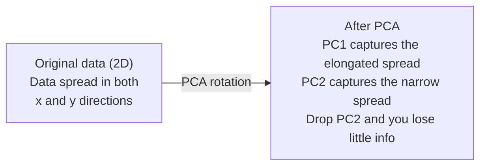

# تقليل الجهد

> البيانات عالية الدرجة لديها بنية.

**Type:** Build
**Language:**بايثون
**Prerequisites:** Phase 1, Lessons 01（Linear Algebra Intuition）、02（Vectors, Matrices & Operations）、03（Eigenvalues & Eigenvectors）、06（Probability & Distributions）
**Time:** ~90 分钟

## أهداف التعلم

- من التنفيذ من PCA:مراكز البيانات ‬حساب المصفوفة التغيرات ‬مجموعة واحدة، ومشروع
- استخدام شرح نسبة التباين و طريقة الكوع  اختيار المكونات الرئيسية
- مقارنة نتائج أرقام PCA ̊t-SNE و UMAP في 2D قابل للتصور من MNIST، وتفسير وزنها
- استخدام مع RBF النواة النواة PCA تفصل عن المعيار PCA  غير خطية لا يمكن معالجة هياكل البيانات

## المشكلة

لديك نموذج واحد يحتوي على 784 مجموعة بيانات من الميزات. ربما هو القيم البيكسلية الرقمية المكتوبة يدويا. ربما هو مستويات التعبير الجيني. ربما هو إشارات سلوك المستخدم.

ولكن هذه الـ 784 هي ميزات غير كافية. المعلومات الحقيقية موجودة على سطح صغير جدا. لا تحتاج إلى 784 رقم مستقل عن بعضها البعض لتوصيفها.

سوف يجد تقليل الأبعاد تلك السطح الأصغر. يضغط بياناتك البعدية 784 إلى 2 أو 10 أو 50 بعدة، مع الحفاظ على الهيكل المهم.

## المفهوم

### لعنة الأبعاد

الكوّة لا تتوافق مع الحسّن. مع نمو الخصّة، هناك ثلاثة أشياء ستفشل.

**距离变得没有意义。**في الارتفاع، فإن المسافة بين نقطتين عشوائية تصل إلى نفس القيمة. إذا كانت كل نقطة إلى كل نقطة أخرى تبعد عن كل نقطة أخرى، فإن البحث عن أقرب جيران سوف يفشل.

```
Dimension    Avg distance ratio (max/min between random points)
2            ~5.0
10           ~1.8
100          ~1.2
1000         ~1.02
```

**体积集中在角落。**d 维 واحد كوب هائبركوب لديه 2 个角. في 100 维, تقريبا كل الحجم في كوب, بعيدا عن المركز. نقاط البيانات سوف تنتشر إلى الحافة, و النماذج الخاصة بك في المنطقة الداخلية سوف تفتقر إلى البيانات.

**你需要指数级更多的数据。**للحفاظ على نفس كثافة العينات في الفضاء، من 2D إلى 20D يعني أنك بحاجة إلى 10^18 مضاعفة البيانات.

### الـ "PCA": العثور على الاتجاهات التي تهم

تحليل المكون الرئيسي (PCA) سوف تجد أكبر تغير في البيانات.

算法:

```
1. Center the data        (subtract the mean from each feature)
2. Compute covariance     (how features move together)
3. Eigendecomposition     (find the principal directions)
4. Sort by eigenvalue     (biggest variance first)
5. Project               (keep top k eigenvectors, drop the rest)
```

لماذا استخدام التكوين الخاص؟ المصفوفة التجاويزية هي متماثلة 且正ية شبه محددة ∙ المتجهات الخاصة بها هي الاتجاهات العصبية في الفضاء المميز ∙ القيم الخاصة تخبرك في كل اتجاه كم التغيرات تم القبض عليها ∙ المتجهات الخاصة لديها أقصى قيمة خاصة تحدد الاتجاهات المتجهة إلى أقصى التغيرات ∙



- **Before PCA:**سحابة البيانات  على طول x و y 两个 محور على طول الزاوية
- **After PCA:**坐标系被旋转,使 PC1对齐最大差异的方向(延长 انتشار) ، PC2对齐最小差异的方向(窄 spread)
- **Dimensionality reduction:**يُهجرُ الكمبيوتر 2 سَيَضِعُ البياناتِ إلقاءَ إلى الكمبيوتر 1 فوق، فقط يَضيعُ قليلُ من المعلوماتِ

### نسبة التباين المفسرة

كل مكون رئيسي يحتوي على جزء من التباين الكلي.

```
Component    Eigenvalue    Explained ratio    Cumulative
PC1          4.73          0.473              0.473
PC2          2.51          0.251              0.724
PC3          1.12          0.112              0.836
PC4          0.89          0.089              0.925
...
```

عندما يصل التباين التراكمي إلى 0.95 ، تعرف أن هذه المكونات تمكن من استيعاب 95% من المعلومات.

### اختيار عدد المكونات

ثلاث استراتيجيات:

1. **Threshold.**الحفاظ على العديد من المكونات، لتفسير التباين 90-95%
2. **Elbow method.**رسم التباين الموضح لكل مكون.
3. **Downstream performance.**سوف تستخدم PCA باستخدام عملية التحضير المسبق.

### الحفاظ على الأحياء

ت-توزيع استوتشاسيك الجارية التضمين (ت-SNE) هو للصميم المرئي.

直觉是: في الفضاء الأصلي، حسب المسافة بين النقاط تحسب توزيع الاحتمالات. نقطة قريبة تحصل على احتمالات عالية. نقطة بعيدة تحصل على احتمالات منخفضة. ثم العثور على 2D التنفيذ، مما يجعل نفس توزيع الاحتمالات.

النوعية الرئيسية:
- غير خطي. يمكن أن يفتح مجموعة متنوعة معقدة لا يمكن معالجتها.
- ستوكاستيكا ً مختلفة النشاطات ستحدث ترتيب مختلف
- الارتباكات 参数控制考虑多少邻居(典型范围:5-50)
- 输出中集群 距离没有意义――只有集群本身有意义――
- في مجموعات بيانات كبيرة 上很慢──默认是 O(n^2)。

### الـ UMAP: هيكل عالمي أسرع وأفضل

طريقة عمل التقرب والتحديد المتعدد الموحد (UMAP) مشابهة لـ t-SNE ، ولكن لديها مزين:
- 更快── يستخدم تقريباً الرسوم البيانية القريبة من الجوار، بدلاً من حساب جميع المسافات المتزدوجة──
- بنية عالمية أفضل. أماكن النفط المتقاربة بين المجموعات.

يُبني UMAP في كُلّ فَضْلٍ مُزنّةً ([1]) ، ثم يُبحث عن تخطيطٍ منخفضٍ، ويحافظ على هذا الرسم البياني قدر الإمكان.

关键参数:
- `n_neighbors`: كم الجوار يحددون الهيكل المحلي (((شبه الارتباك)──更高的值会保留更多 الهيكل العالمي──
- `min_dist`: الناتج النقطة الوسطى تجمع أكثر وترتيبا.

### متى تستخدم أي

| Method | Use case | Preserves | Speed |
|--------|----------|-----------|-------|
| PCA | Preprocessing before training | Global variance | Fast (exact), works on millions of samples |
| PCA | Quick exploratory visualization | Linear structure | Fast |
| t-SNE | Publication-quality 2D plots | Local neighborhoods | Slow (< 10k samples ideal) |
| UMAP | 2D visualization at scale | Local + some global structure | Medium (handles millions) |
| PCA | Feature reduction for models | Variance-ranked features | Fast |
| t-SNE / UMAP | Understanding cluster structure | Cluster separation | Medium to slow |

 تجربة قانون: باستخدام PCA القيام بعملية معالجة مسبقة و ضغط البيانات.

### الكهرباء الكهربائية

ستجد PCA القياسية الفضاءات الفرعية الخطية. ستدور في محركك وتترك المحور. ولكن إذا كانت البيانات تقع في مجموعة متنوعة غير خطية. كيف يمكن أن يتم إعادة تحديد المجموعة؟

الكرنيل PCA في الفضاء المكون من الميزات عالية الجودة التي تُحثّر من قبل وظيفة الكرنيل  تطبيق PCA، دون حساب واضح لل坐标 في هذا الفضاء ‒ هذا هو خدعة الكرنيل، ويعني نفس الفكرة وراء SVMs ‒

算法:
1. 计算 نجم المصفوفة K، من بينها K_ij = k(x_i، x_j)
2. في مساحة الميزات وسط ماتريكس النواة
3. لتركيز المصفوفة النواة صنع نفسه
4. 顶部 eigenvectors(按1/sqrt(eigenvalue) 缩放)就是 التنبؤات

وظائف النواة العادية:

| Kernel | Formula | Good for |
|--------|---------|----------|
| RBF (Gaussian) | exp(-gamma * \|\|x - y\|\|^2) | 大多数 nonlinear data、smooth manifolds |
| Polynomial | (x . y + c)^d | Polynomial relationships |
| Sigmoid | tanh(alpha * x . y + c) | Neural network-like mappings |

何時使用内核 PCA وليس PCA القياسية:

| Criterion | Standard PCA | Kernel PCA |
|-----------|-------------|------------|
| Data structure | Linear subspace | Nonlinear manifold |
| Speed | O(min(n^2 d, d^2 n)) | O(n^2 d + n^3) |
| Interpretability | Components are linear combinations of features | Components lack direct feature interpretation |
| Scalability | Works on millions of samples | Kernel matrix is n x n, memory-limited |
| Reconstruction | Direct inverse transform | Requires pre-image approximation |

مثال كلاسيكي: نقطة حلقة مركزة في 2D: نقطة حلقة واحدة داخل حلقة أخرى: ستضع PCA المعيارية كلتا الحلقتين على نفس الخط ، وهذا لا يستخدم التصنيف.

### خطأ إعادة الإعمار

هل خفض الابعاد جيد؟ قمت بتقليص 784 إلى 50 طول؟ ماذا فقدت؟

خطأ إعادة بناء القياس:
1. 将数据投影到 k 维:X_reduced = X @ W_k
2. 重建: X_hat = X_reduced @ W_k^T
3. 计算 MSE:معدل (((X - X_hat) ^2)

بالنسبة لـ PCA، خطأ إعادة الإعمار مع التباين الموضح

```
Reconstruction error = sum of eigenvalues NOT included
Total variance = sum of ALL eigenvalues
Fraction lost = (sum of dropped eigenvalues) / (sum of all eigenvalues)
```

نسبة التباين الموضحة لكل مكون هي:

```
explained_ratio_k = eigenvalue_k / sum(all eigenvalues)
```

وضع التباين المكتمل الموضح للمكونات عدد الصور، سوف تحصل على منحنى "كوع"
- 曲线变平的位置(收益递减)
- التباين التراكمي  عبر عتبة الخاص بك مكانة ((عادة 0.90 أو 0.95)
- أداء المهام التدريجية 进入平台期的位置

خطأ إعادة التكوين ليس فقط للاختيار. يمكنك استخدامه للكشف عن الفجوة: خطأ إعادة التكوين عالية النموذج هي فجوات، فهي لا تتوافق مع الفضاء الفرعي المتعلم.


```figure
pca-axes
```

## بناءها

### الخطوة الأولى: PCA من الصفر

```python
import numpy as np

class PCA:
    def __init__(self, n_components):
        self.n_components = n_components
        self.components = None
        self.mean = None
        self.eigenvalues = None
        self.explained_variance_ratio_ = None

    def fit(self, X):
        self.mean = np.mean(X, axis=0)
        X_centered = X - self.mean

        cov_matrix = np.cov(X_centered, rowvar=False)

        eigenvalues, eigenvectors = np.linalg.eigh(cov_matrix)

        sorted_idx = np.argsort(eigenvalues)[::-1]
        eigenvalues = eigenvalues[sorted_idx]
        eigenvectors = eigenvectors[:, sorted_idx]

        self.components = eigenvectors[:, :self.n_components].T
        self.eigenvalues = eigenvalues[:self.n_components]
        total_var = np.sum(eigenvalues)
        self.explained_variance_ratio_ = self.eigenvalues / total_var

        return self

    def transform(self, X):
        X_centered = X - self.mean
        return X_centered @ self.components.T

    def fit_transform(self, X):
        self.fit(X)
        return self.transform(X)
```

### الخطوة الثانية: اختبار البيانات الاصطناعية

```python
np.random.seed(42)
n_samples = 500

t = np.random.uniform(0, 2 * np.pi, n_samples)
x1 = 3 * np.cos(t) + np.random.normal(0, 0.2, n_samples)
x2 = 3 * np.sin(t) + np.random.normal(0, 0.2, n_samples)
x3 = 0.5 * x1 + 0.3 * x2 + np.random.normal(0, 0.1, n_samples)

X_synthetic = np.column_stack([x1, x2, x3])

pca = PCA(n_components=2)
X_reduced = pca.fit_transform(X_synthetic)

print(f"Original shape: {X_synthetic.shape}")
print(f"Reduced shape:  {X_reduced.shape}")
print(f"Explained variance ratios: {pca.explained_variance_ratio_}")
print(f"Total variance captured: {sum(pca.explained_variance_ratio_):.4f}")
```

### الخطوة الثالثة: أرقام MNIST في 2D

```python
from sklearn.datasets import fetch_openml

mnist = fetch_openml("mnist_784", version=1, as_frame=False, parser="auto")
X_mnist = mnist.data[:5000].astype(float)
y_mnist = mnist.target[:5000].astype(int)

pca_mnist = PCA(n_components=50)
X_pca50 = pca_mnist.fit_transform(X_mnist)
print(f"50 components capture {sum(pca_mnist.explained_variance_ratio_):.2%} of variance")

pca_2d = PCA(n_components=2)
X_pca2d = pca_2d.fit_transform(X_mnist)
print(f"2 components capture {sum(pca_2d.explained_variance_ratio_):.2%} of variance")
```

### الخطوة الرابعة: مقارنة مع sklearn

```python
from sklearn.decomposition import PCA as SklearnPCA
from sklearn.manifold import TSNE

sklearn_pca = SklearnPCA(n_components=2)
X_sklearn_pca = sklearn_pca.fit_transform(X_mnist)

print(f"\nOur PCA explained variance:     {pca_2d.explained_variance_ratio_}")
print(f"Sklearn PCA explained variance: {sklearn_pca.explained_variance_ratio_}")

diff = np.abs(np.abs(X_pca2d) - np.abs(X_sklearn_pca))
print(f"Max absolute difference: {diff.max():.10f}")

tsne = TSNE(n_components=2, perplexity=30, random_state=42)
X_tsne = tsne.fit_transform(X_mnist)
print(f"\nt-SNE output shape: {X_tsne.shape}")
```

### الخطوة 5: مقارنة UMAP

```python
try:
    from umap import UMAP

    reducer = UMAP(n_components=2, n_neighbors=15, min_dist=0.1, random_state=42)
    X_umap = reducer.fit_transform(X_mnist)
    print(f"UMAP output shape: {X_umap.shape}")
except ImportError:
    print("Install umap-learn: pip install umap-learn")
```

## استخدمها

وضع PCA باستخدام تصنيف  السابقة المعالجة المسبقة:

```python
from sklearn.decomposition import PCA as SklearnPCA
from sklearn.linear_model import LogisticRegression
from sklearn.model_selection import train_test_split
from sklearn.metrics import accuracy_score

X_train, X_test, y_train, y_test = train_test_split(
    X_mnist, y_mnist, test_size=0.2, random_state=42
)

results = {}
for k in [10, 30, 50, 100, 200]:
    pca_k = SklearnPCA(n_components=k)
    X_tr = pca_k.fit_transform(X_train)
    X_te = pca_k.transform(X_test)

    clf = LogisticRegression(max_iter=1000, random_state=42)
    clf.fit(X_tr, y_train)
    acc = accuracy_score(y_test, clf.predict(X_te))
    var_captured = sum(pca_k.explained_variance_ratio_)
    results[k] = (acc, var_captured)
    print(f"k={k:>3d}  accuracy={acc:.4f}  variance={var_captured:.4f}")
```

الأداء سيكون أقل من 784 ساعة في مدة دخول المنصة.

## أرسله

本课会产出:
- `outputs/skill-dimensionality-reduction.md`- مهارة تقنية تستخدم لتحديد مهمة معينة

## التمارين

1. 修改 PCA class 以支持 `inverse_transform` باستخدام 10、50 和 200 个组件 重建 MNIST ارقام‬分别打印重建错误(相对于原始数据的平均平方差)‬

2. في نفس مجموعة فرعية من MNIST 上运行 t-SNE، تعرقلة 值分别为 5、30 和 100──وصف كيفية تغير المخرج── لماذا تعرقلة سوف تؤثر على ضيق الكلاستر؟

3. خذ واحد لديه 50 ميزة ولكن فقط 5 ميزات معلومات مجموعة بيانات`sklearn.datasets.make_classification`生成) ・ تطبيق PCA،并检查 شرح منحنى التباين نعم أم لا صحيحة التعرف على البيانات في الواقع هو 5 بعدها‬‬‬‬‬‬‬‬‬‬‬‬‬‬‬‬‬‬‬‬‬‬‬‬‬‬‬‬‬‬‬‬‬‬‬‬‬‬‬‬‬‬‬‬‬‬‬‬‬‬‬‬‬‬‬‬‬‬‬‬‬‬‬‬‬‬‬‬‬‬‬‬‬‬‬‬‬‬‬‬‬‬‬‬‬‬‬‬‬‬‬‬‬‬‬‬‬‬‬‬‬‬‬‬‬‬‬‬‬‬‬‬‬‬‬‬‬‬‬‬‬‬‬‬‬‬‬‬‬‬‬‬‬‬‬‬‬‬‬‬‬‬‬‬‬‬‬‬‬‬‬‬‬‬‬‬‬‬‬‬‬‬‬‬‬‬‬‬‬‬‬‬‬‬‬‬‬‬‬‬‬‬‬‬‬‬‬‬‬‬‬‬‬‬‬‬‬‬‬‬‬‬‬‬‬‬‬‬‬‬‬‬‬‬‬‬‬‬‬‬‬‬‬‬‬‬‬‬‬‬‬‬‬‬‬‬‬‬‬‬‬‬‬‬‬‬‬‬‬‬‬‬‬‬‬‬‬‬‬‬‬‬‬‬‬‬‬‬‬‬‬‬‬‬‬‬‬‬‬‬‬‬‬‬‬‬‬‬‬‬‬‬‬‬‬‬‬‬‬‬‬‬‬‬‬‬‬‬‬‬‬‬‬‬‬‬‬‬‬‬‬‬‬‬‬‬‬‬‬‬‬‬‬‬‬‬‬‬‬‬‬‬‬‬‬‬‬‬‬‬‬‬‬‬‬‬‬‬‬‬‬‬‬‬‬‬‬‬‬‬‬‬‬‬‬‬‬‬‬‬‬‬‬‬‬‬‬‬‬‬‬‬‬‬‬‬‬‬‬‬‬‬‬‬‬‬‬‬‬‬‬‬‬‬‬‬‬‬‬‬‬‬‬‬‬‬‬‬‬‬‬‬‬‬‬‬‬‬‬‬‬‬‬‬‬‬‬‬‬‬‬‬‬‬‬‬‬‬‬‬‬‬‬‬‬‬‬‬‬‬‬‬‬‬

## الشروط الرئيسية

| Term | What people say | What it actually means |
|------|----------------|----------------------|
| Curse of dimensionality | "Too many features" | 随着维度增长，距离、体积和数据密度都会表现得反直觉。Models 需要指数级更多的数据来补偿。 |
| PCA | "Reduce dimensions" | 旋转你的坐标系，使各轴与 maximum variance 的方向对齐，然后丢弃 low-variance axes。 |
| Principal component | "An important direction" | Covariance matrix 的一个 eigenvector。Feature space 中数据变化最大的方向。 |
| Explained variance ratio | "How much info this component has" | 一个 principal component 捕获的 total variance 比例。对前 k 个 ratios 求和，就能看到 k 个 components 保留了多少信息。 |
| Covariance matrix | "How features correlate" | 一个 symmetric matrix，其中 entry (i,j) 衡量 feature i 和 feature j 如何共同变化。Diagonal entries 是各自的 variances。 |
| t-SNE | "That cluster plot" | 一种 nonlinear 方法，通过保留 pairwise neighborhood probabilities 将高维数据映射到 2D。适合可视化，不适合 preprocessing。 |
| UMAP | "Faster t-SNE" | 一种基于 topological data analysis 的 nonlinear 方法。既保留 local structure，也保留部分 global structure。比 t-SNE 更容易扩展。 |
| Perplexity | "A t-SNE knob" | 控制每个点考虑的有效邻居数量。低 perplexity 聚焦非常 local 的结构。高 perplexity 捕获更宽泛的模式。 |
| Manifold | "The surface the data lives on" | Embedding在更高维空间中的低维表面。一张在 3D 中揉皱的纸是一个 2D manifold。 |

## المزيد من القراءة

- [A Tutorial on Principal Component Analysis](https://arxiv.org/abs/1404.1100)(شلينز) - از零开始清晰推导 PCA
- [How to Use t-SNE Effectively](https://distill.pub/2016/misread-tsne/)(واتينبرغ وغيره) -  حول ت-SNE 陷 و参数选择的交互式指南
- [UMAP documentation](https://umap-learn.readthedocs.io/)- من مؤلف UMAP نظرية ومبادئ التوجيه
