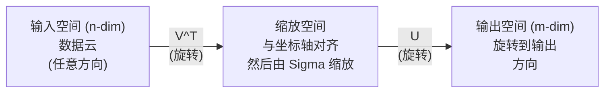
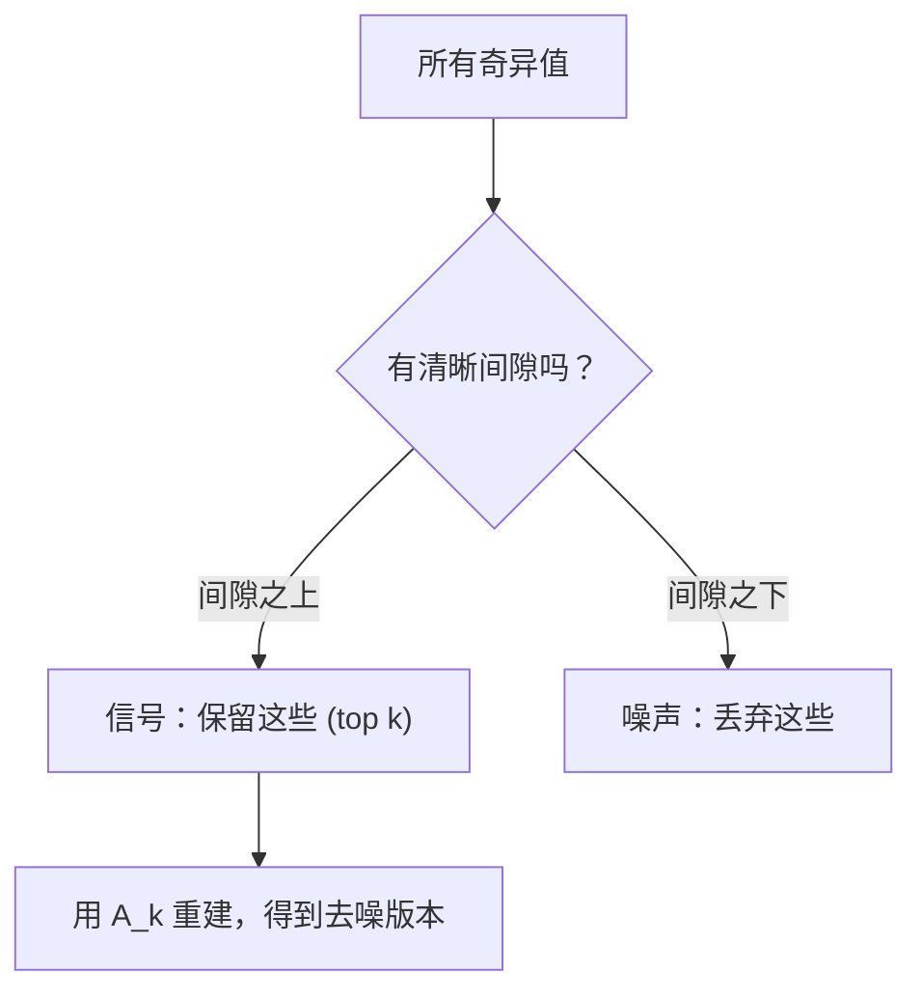

# التفكك في القيمة الفريدة

> SVD هو الوسيلة الروسية في العدد الالكتروني. كل ماتريكس لديها SVD. كل عالم بيانات يحتاج إلى SVD.

**Type:** Build
**Languages:** Python, Julia
**Prerequisites:** Phase 1，Lessons 01 (Linear Algebra Intuition)、02 (Vectors & Matrices Operations)、03 (Matrix Transformations)
**Time:** ~120 minutes

## 學习目标
- 通過 التكرار القوى 实现 SVD,并解释 U、Sigma 和 V^T 的几何含义
- تطبيق SVD المختصرة إجراء ضغط الصورة، ومقياس العلاقة بين معدل الضغط والخطأ في إعادة البناء
-                                                                                                                                                                                                                                                                                                                                                                                                                                                                                                                              
- أن تكون SVD مع PCA、推系统(عوامل متخفية) وكذلك التحليل اليمني المتخف في النمط النووي

## 问题
لديك ماتريكس 1000x2000. انها قد تكون مستخدم-فيديو تقييمات. قد تكون تعدد تعدد الكلمات. قد تكون أيضا قيمة الصورة. تحتاج إلى ضغطها، والضوضاء، والاكتشاف من بينها الهيكل الخفي، أو استخدامها لتحليل نظام أقل مربعات.

SVD تطبق على أي ماتريكس. أي شكل. أي رتبة. لا توجد قيود. ينفصل المصفوفة إلى ثلاثة عوامل، يوضح أن المصفوفة تتغير في الهندسة.

## 概念
### س.و.د. في كيفية القيام به

كل ماتريكس، بغض النظر عن شكلها، تقوم بتنفيذ ثلاث عمليات حسب الترتيب: تدوير، تكميل، تدوير.

```
A = U * Sigma * V^T

      m x n     m x m    m x n    n x n
     (任意)    (旋转)   (缩放)   (旋转)
```

给定任意 Matrix A,SVD 将其分解为:
- V^T 旋转输入空间 ((n 维) في المتجه
- إضافة إلى كل محور يتم تقليصها
- سوف تحولت النتيجة إلى المجال الخارجي



يمكن فهم ذلك. تُعطى ماتريكس إلى SVD. سوف تخبرك:  هذه المصفوفة سوف تستخدم أولاً V^T دوارها إلى داخل الكرة، ثم تستخدم Sigma لتمددها إلى كرة، وأخيراً تستخدم U دوار هذه الكرة.

### التفكك الكامل

بالنسبة للشكل مكس n من المصفوفة A:

```
A = U * Sigma * V^T

其中：
  U     是 m x m，正交 (U^T U = I)
  Sigma 是 m x n，对角（奇异值位于对角线上）
  V     是 n x n，正交 (V^T V = I)

奇异值 sigma_1 >= sigma_2 >= ... >= sigma_r > 0
其中 r = rank(A)
```

يُدعى صف U باسم Left Odd Vector. صف V باسم Right Odd Vector.

### المتجهات الفردية اليسرى قيمات الفردية  متجهات الفردية اليمنى

كل جزء من SVD له معنى مختلف.

**Right singular vectors（V 的列）：**它们为输入空间 (R^n) تشكل مجموعة من الأساسيات الطبيعية. 它们是输入空间中的方向, ماتريكس سوف تضع هذه الاتجاهات في الاتجاهات الصحيحة في输出空间.

**Singular values（Sigma 的对角线）：**它们是缩放因子──第一个奇异值告诉你,矩阵 沿第一个右边奇异向量 方向将把向量 拉伸多少──奇异值为零意味着矩阵将把该方向完全压──

**Left singular vectors（U 的列）：**它们为输出空间(R^m) تشكل مجموعة من أساسات الوسائط العادية.

العلاقات بينها:

```
A * v_i = sigma_i * u_i

Matrix A 接收第 i 个右奇异Vector v_i，
用 sigma_i 对其缩放，并将其映射到第 i 个左奇异Vector u_i。
```

هذا يعطي أي ماتريكس تفعل ما في كل صورة.

### شكل المنتج الخارجي

يمكن أن يكتب SVD إلى صف-1 المصفوفة

```
A = sigma_1 * u_1 * v_1^T + sigma_2 * u_2 * v_2^T + ... + sigma_r * u_r * v_r^T

每一项 sigma_i * u_i * v_i^T 都是一个 rank-1 Matrix（一个 outer product）。
完整 Matrix 是 r 个这类 Matrix 的和，其中 r 是 rank。
```

هذا النوع من النماذج هو أساس التقريب منخفض الرتبة. كل شيء يضيف طبقة من الهيكل. الأول هو الوصول إلى أهم نموذج واحد.

```
Rank-1 approx:    A_1 = sigma_1 * u_1 * v_1^T
                  (捕获主导模式)

Rank-2 approx:    A_2 = sigma_1 * u_1 * v_1^T + sigma_2 * u_2 * v_2^T
                  (捕获两个最重要的模式)

Rank-k approx:    A_k = top k 项之和
                  (根据 Eckart-Young theorem，这是最优的)
```

### العلاقة مع التكوين الخاص

SVD و التكوين الخاص لديه علاقة عميقة بـ A من القيم الخاصة و الجهاز المميز  مباشرة من A^T A و A^T من القيم الخاصة و الجهاز المميز 

```
A^T A = V * Sigma^T * U^T * U * Sigma * V^T
      = V * Sigma^T * Sigma * V^T
      = V * D * V^T

其中 D = Sigma^T * Sigma 是一个对角 Matrix，其对角线上为 sigma_i^2。

因此：
- 右奇异Vector (V) 是 A^T A 的 eigenvectors
- 奇异值的平方 (sigma_i^2) 是 A^T A 的 eigenvalues

类似地：
A A^T = U * Sigma * V^T * V * Sigma^T * U^T
      = U * Sigma * Sigma^T * U^T

因此：
- 左奇异Vector (U) 是 A A^T 的 eigenvectors
- A A^T 的 eigenvalues 也都是 sigma_i^2
```

هذا الاتصال يخبرك ثلاث أشياء:
1. 奇异值总是实数且非负((它们 هي قيم المصفوفات المثبتة الجيدة للصف المحدد) 
2. يمكنك من خلال A^T A القيام بتكوين خاص لحساب SVD، ولكن هذا سوف يكون عدد الحالة المربعة ومعدل الخسارة من دقة القيمة.
3. عندما يكون A يمثل ويكون مثاليًا شبه محددًا ، فإن SVD وتركيبها هو الشيء نفسه.

### التقريبات المتقصرة: تقريب منخفض

نظرية إيكارت-يوغ-ميرسكي ظهرت، أن أفضل رتبة-ك قريبة ((( في معايير فروبنيوس و معايير الطيف أسفل) يمكن من خلال الحفاظ فقط على أعلى k 个奇异值 و متجهاتها 得到:

```
A_k = U_k * Sigma_k * V_k^T

其中：
  U_k     是 m x k  (U 的前 k 列)
  Sigma_k 是 k x k  (Sigma 的左上 k x k 块)
  V_k     是 n x k  (V 的前 k 列)

近似误差 = sigma_{k+1}  (在 spectral norm 下)
         = sqrt(sigma_{k+1}^2 + ... + sigma_r^2)  (在 Frobenius norm 下)
```

هذا ليس فقطامثل جيد

| Component | Relative magnitude | Kept in rank-3 approx? |
|-----------|-------------------|------------------------|
| sigma_1 | 最大 | 是 |
| sigma_2 | 大 | 是 |
| sigma_3 | 中等偏大 | 是 |
| sigma_4 | 中等 | 否（误差） |
| sigma_5 | 中等偏小 | 否（误差） |
| sigma_6 | 小 | 否（误差） |
| sigma_7 | 很小 | 否（误差） |
| sigma_8 | 极小 | 否（误差） |

保留 top 3:A_3 捕获三个最大的奇异值──误差 = 剩余值(sigma_4到sigma_8)。

إذا كان التناقصات الغريبة تتراجع بسرعة، فيمكن لـ k صغير جداً أن يكتسب معظم المصفوفات المعلمية.

### استخدام SVD  لإجراء ضغط الصورة

الصورة الحمراء هي المصفوفة التي تتكون من قوة الصورة.

```
原始图像：800 x 600 = 480,000 个值

rank k 的 SVD：
  U_k:      800 x k 个值
  Sigma_k:  k 个值
  V_k:      600 x k 个值
  总计:     k * (800 + 600 + 1) = k * 1401 个值

  k=10:   14,010 个值   (原始的 2.9%)
  k=50:   70,050 个值  (原始的 14.6%)
  k=100: 140,100 个值  (原始的 29.2%)

  k 越小，压缩率越好，
  但视觉质量会下降。
```

关键洞察: الاختلافات في الصور الطبيعية تتراجع بسرعة. الاختلافات الأولى تمكن من الوصول إلى هيكل كبير.

### SVD تستخدم لتقديم النظام

جائزة نتفليكس 让这一点广为人知──你有一个用户电影评分矩阵,大多数条目是缺失的──

```
             Movie1  Movie2  Movie3  Movie4  Movie5
  User1      [  5      ?       3       ?       1  ]
  User2      [  ?      4       ?       2       ?  ]
  User3      [  3      ?       5       ?       ?  ]
  User4      [  ?      ?       ?       4       3  ]

  ? = 未知评分
```

核心思想: هذا التصنيف المصفوفة 具有低排名──用户的品味不是完全独立──有几个隐藏因素(动作vs剧情、旧vs新、理性vs感官) قادرة على تفسير معظم الاختيارات──

على ((ملء بعد) تقييم المصفوفة تصنع SVD، سوف يتم تقسيمها إلى:
- U: مساحة العوامل المتخفية 中的用户配置文件
- إيجاما: أهمية كل عامل غامض
- V^T: الفضاء العامل المتخفي 中的电影资料

المستخدم على بعض الأفلام، هو الملف المستخدم وملف الفيلم المنتج البقعة.

في الممارسة العملية، ستستخدم SVD أو ALS الإضافية لـ Simon Funk (بالتبديل من أقل المربعات) ، هذه النوعية يمكن أن تتعامل مباشرة مع تغيرات البيانات المفقودة. ولكن الفكرة الأساسية هي نفسها: من خلال SVD القيام بتفكك العوامل الخفية.

### النمط النووي 中的SVD: التحليل النيزكي المتخفي

تحليل اللاتنت المفصل (LSA) ، يطلق عليه أيضًا مؤشر اللاتنت المفصل (LSI) ، سيتم استخدام SVD 应用于术语文档矩阵。

```
             Doc1   Doc2   Doc3   Doc4
  "cat"      [  3      0      1      0  ]
  "dog"      [  2      0      0      1  ]
  "fish"     [  0      4      1      0  ]
  "pet"      [  1      1      1      1  ]
  "ocean"    [  0      3      0      0  ]

rank k=2 的 SVD 之后：

  每个文档变成 2D “概念空间”中的一个点。
  每个词项变成同一个 2D 空间中的一个点。
  主题相似的文档会聚在一起。
  含义相似的词项会聚在一起。

  "cat" 和 "dog" 最终会靠近彼此（陆地宠物）。
  "fish" 和 "ocean" 最终会靠近彼此（水相关概念）。
  如果 Doc1 和 Doc3 共享相似主题，它们会聚在一起。
```

LSA هي واحدة من أوائل الطرق الناجحة للاستيعاب إلى التشابه بين الكلمات من المستندات الأصلية.

### الـ SVD للحد من الضوضاء

عادة ما يركز بيانات الضجيج على الإشارة في أعلى القيم المختلفة، بينما يُنتشر الضجيج على جميع القيم المختلفة. يمكن أن يتمّ تحويل القيادة من الضجيج.

**干净信号的奇异值：**

| Component | Magnitude | Type |
|-----------|-----------|------|
| sigma_1 | 非常大 | 信号 |
| sigma_2 | 大 | 信号 |
| sigma_3 | 中等 | 信号 |
| sigma_4 | 接近零 | 可忽略 |
| sigma_5 | 接近零 | 可忽略 |

**有噪声信号的奇异值（噪声会加到所有分量上）：**

| Component | Magnitude | Type |
|-----------|-----------|------|
| sigma_1 | 非常大 | 信号 |
| sigma_2 | 大 | 信号 |
| sigma_3 | 中等 | 信号 |
| sigma_4 | 小 | 噪声 |
| sigma_5 | 小 | 噪声 |
| sigma_6 | 小 | 噪声 |
| sigma_7 | 小 | 噪声 |



هذا يستخدم في معالجة الإشارات والقياسات العلمية وتنظيف البيانات. في أي وقت، طالما أن ماتريسك مصاب بتلوث ضجيج إضافي، فإن SVD المختصرة هي طريقة مبدئية لتنفيس الضجيج.

### الاختلافات السوداء عبر SVD

مور-بينروز الاختلافية A + سوف تعديل المصفوفة 推广到非方阵和奇异矩阵──SVD 让它的计算变得非常简单──

```
如果 A = U * Sigma * V^T，那么：

A+ = V * Sigma+ * U^T

其中 Sigma+ 的构造方式为：
  1. 转置 Sigma（交换行和列）
  2. 将每个非零对角元素 sigma_i 替换为 1/sigma_i
  3. 零保持为零

对于 A (m x n)：      A+ 是 (n x m)
对于 Sigma (m x n)：  Sigma+ 是 (n x m)
```

يمكن أن يطلب الفكاكهة القصوى من المربع 问题── إذا كان Ax = b 没有精确解(超定系统), ثم x = A + b 就是最小的平方 解(最小化 解Ax - b 时时时) 

```
超定系统（方程数多于未知数）：

  [1  1]         [3]
  [2  1] x   =   [5]       不存在精确解。
  [3  1]         [6]

  x_ls = A+ b = V * Sigma+ * U^T * b

  这给出了使残差平方和最小的 x。
  结果与 normal equations (A^T A)^(-1) A^T b 相同，
  但数值上更稳定。
```

### الاستقرار الرقمي 优势

计算 A^T A's eigenendecomposition 会平方奇异值(أقيم eigenvalue of A^T A هي sigma_i^2)。 هذا سيصبح عدد شرط مربع، وبالتالي يزيد من عدد الأخطاء في القيمة。

```
示例：
  A 的奇异值为 [1000, 1, 0.001]
  A 的 condition number：1000 / 0.001 = 10^6

  A^T A 的 eigenvalues 为 [10^6, 1, 10^{-6}]
  A^T A 的 condition number：10^6 / 10^{-6} = 10^{12}

  直接计算 SVD：使用 condition number 10^6
  通过 A^T A 计算：使用 condition number 10^{12}
                   （额外损失 6 位精度）
```

现代 SVD 算法(Golub-Kahan بيدiagonalization) مباشرة في A 上工作,从不构建 A^T A──这就是为什么你应该始终优先使用`np.linalg.svd(A)`بدلاً من ذلك`np.linalg.eig(A.T @ A)`.

### اتصال مع PCA

PCA هي SVD للبيانات المركزية. هذا ليس كلاسيب.

```
给定数据 Matrix X (n_samples x n_features)，已中心化（减去均值）：

Covariance Matrix: C = (1/(n-1)) * X^T X

PCA 寻找 C 的 eigenvectors。但：

  X = U * Sigma * V^T    (X 的 SVD)

  X^T X = V * Sigma^2 * V^T

  C = (1/(n-1)) * V * Sigma^2 * V^T

所以 principal components 恰好就是右奇异Vector V。
每个 component 的 explained variance 是 sigma_i^2 / (n-1)。

在 sklearn 中，PCA 使用 SVD 实现，而不是 eigendecomposition。
它更快，数值上也更稳定。
```

هذا يعني أن كل ما تعلمته في الدروس 10 حول تقليل الجهاز الأبعاد، هي SVD.


```figure
svd-rank-reconstruction
```

## بناءها
### 步骤 1: SVD من الصفر باستخدام التكرار الطاقة

فكرت: لكي تجد أكبر قيمة غريبة و متجهة لها، يمكنك استخدام A^T A( أو A^T) التكرار القوى، ثم تجد المصفوفة،并重复寻找下一个奇异值.

```python
import numpy as np

def power_iteration(M, num_iters=100):
    n = M.shape[1]
    v = np.random.randn(n)
    v = v / np.linalg.norm(v)

    for _ in range(num_iters):
        Mv = M @ v
        v = Mv / np.linalg.norm(Mv)

    eigenvalue = v @ M @ v
    return eigenvalue, v

def svd_from_scratch(A, k=None):
    m, n = A.shape
    if k is None:
        k = min(m, n)

    sigmas = []
    us = []
    vs = []

    A_residual = A.copy().astype(float)

    for _ in range(k):
        AtA = A_residual.T @ A_residual
        eigenvalue, v = power_iteration(AtA, num_iters=200)

        if eigenvalue < 1e-10:
            break

        sigma = np.sqrt(eigenvalue)
        u = A_residual @ v / sigma

        sigmas.append(sigma)
        us.append(u)
        vs.append(v)

        A_residual = A_residual - sigma * np.outer(u, v)

    U = np.column_stack(us) if us else np.empty((m, 0))
    S = np.array(sigmas)
    V = np.column_stack(vs) if vs else np.empty((n, 0))

    return U, S, V
```

### 步骤 2: اختبار ومقارنة مع NumPy

```python
np.random.seed(42)
A = np.random.randn(5, 4)

U_ours, S_ours, V_ours = svd_from_scratch(A)
U_np, S_np, Vt_np = np.linalg.svd(A, full_matrices=False)

print("Our singular values:", np.round(S_ours, 4))
print("NumPy singular values:", np.round(S_np, 4))

A_reconstructed = U_ours @ np.diag(S_ours) @ V_ours.T
print(f"Reconstruction error: {np.linalg.norm(A - A_reconstructed):.8f}")
```

### 步骤 3: عرض ضغط الصورة

```python
def compress_image_svd(image_matrix, k):
    U, S, Vt = np.linalg.svd(image_matrix, full_matrices=False)
    compressed = U[:, :k] @ np.diag(S[:k]) @ Vt[:k, :]
    return compressed

image = np.random.seed(42)
rows, cols = 200, 300
image = np.random.randn(rows, cols)

for k in [1, 5, 10, 20, 50]:
    compressed = compress_image_svd(image, k)
    error = np.linalg.norm(image - compressed) / np.linalg.norm(image)
    original_size = rows * cols
    compressed_size = k * (rows + cols + 1)
    ratio = compressed_size / original_size
    print(f"k={k:>3d}  error={error:.4f}  storage={ratio:.1%}")
```

### 步骤 4: خفض الضوضاء

```python
np.random.seed(42)
clean = np.outer(np.sin(np.linspace(0, 4*np.pi, 100)),
                 np.cos(np.linspace(0, 2*np.pi, 80)))
noise = 0.3 * np.random.randn(100, 80)
noisy = clean + noise

U, S, Vt = np.linalg.svd(noisy, full_matrices=False)
denoised = U[:, :5] @ np.diag(S[:5]) @ Vt[:5, :]

print(f"Noisy error:    {np.linalg.norm(noisy - clean):.4f}")
print(f"Denoised error: {np.linalg.norm(denoised - clean):.4f}")
print(f"Improvement:    {(1 - np.linalg.norm(denoised - clean) / np.linalg.norm(noisy - clean)):.1%}")
```

### الخطوة 5: الاختلاف

```python
A = np.array([[1, 1], [2, 1], [3, 1]], dtype=float)
b = np.array([3, 5, 6], dtype=float)

U, S, Vt = np.linalg.svd(A, full_matrices=False)
S_inv = np.diag(1.0 / S)
A_pinv = Vt.T @ S_inv @ U.T

x_svd = A_pinv @ b
x_lstsq = np.linalg.lstsq(A, b, rcond=None)[0]
x_pinv = np.linalg.pinv(A) @ b

print(f"SVD pseudoinverse solution:  {x_svd}")
print(f"np.linalg.lstsq solution:   {x_lstsq}")
print(f"np.linalg.pinv solution:    {x_pinv}")
```

## استخدمها
完整可运行 demo 位于 `code/svd.py` النشاط يمكن أن ترى SVD 应用于图像压缩、推系统、 latente semantic analysis 和噪声降低──

```bash
python svd.py
```

`code/svd.jl`中的 جوليا 版本使用 جوليا 原生 `svd()`函数和 `LinearAlgebra`الحزمة 演示相同概念──

```bash
julia svd.jl
```

## 交付 it
本课会产出:
- `outputs/skill-svd.md`- مهارة تستخدم لفهم متى وكيفية تطبيق SVD في المشاريع الحقيقية

## التدريب
1. من التحقق من الصفر كامل SVD، لا استخدام التكرار القوى.

2. · تحميل صورة ذات رماد حقيقية (بالإنجليزية: 張真灰度图像) · أو تحويل صورة إلى رمادية (بالإنجليزية: 張真灰度图像)  تحميل صورة في الصفوف 1、5、10、25、50、100  تحميلها  تحميل معدل الضغط والخطأ النسبي لكل صفوف  تحديد الصورة على الصفوف التي تصبح مقبولة على الرؤية‬

3. 构建一个微型推系统──创建一个10x8的用户电影评分矩阵,其中包含一些已知条目──使用行平均值填补缺失条目──计算SVD 并重建排名-3 近似──使用重建矩阵 预测缺失评分──验证预测结果是合理的──

4. 创建一个100x50的文档术语矩阵,包含3 合成主题──每个主题有5 关联词项──添加噪声──应用SVD,并验证前3 个奇异值明显大于其余奇异值──将文档投影到3D潜空,并检查来自同一主题的文档是否聚集在一起──

5. 生成一个干净的低级矩阵(排名 3,大小 50x40),并不同水平下添加高斯噪音(sigma = 0.1、0.5、1.0、2.0)  على كل مستوى الضوضاء، من خلال k=1 إلى 40 扫描并测量相对于干净矩阵重建误差,找到最佳截断级别──绘制最佳 k 如何随噪音水平变化──

## 关键术语
| Term | What people say | What it actually means |
|------|----------------|----------------------|
| SVD | “Factor 任意 Matrix” | 将 A 分解为 U Sigma V^T，其中 U 和 V 是正交的，Sigma 是具有非负元素的对角 Matrix。适用于任意形状的任意 Matrix。 |
| Singular value | “这个 component 有多重要” | Sigma 的第 i 个对角元素。衡量 Matrix 沿第 i 个 principal direction 拉伸的程度。总是非负，并按降序排列。 |
| Left singular vector | “输出方向” | U 的一列。第 i 个右奇异Vector 经过 sigma_i 缩放后映射到的输出空间方向。 |
| Right singular vector | “输入方向” | V 的一列。输入空间中的一个方向，Matrix 会将其映射到第 i 个左奇异Vector（经过 sigma_i 缩放后）。 |
| Truncated SVD | “Low-rank approximation” | 只保留 top k 个奇异值及其 Vector。生成原始 Matrix 的可证明最佳 rank-k 近似（Eckart-Young theorem）。 |
| Rank | “真实维度” | 非零奇异值的数量。告诉你 Matrix 实际使用了多少个独立方向。 |
| Pseudoinverse | “广义逆” | V Sigma+ U^T。对非零奇异值取倒数，零保持为零。为非方阵或奇异 Matrix 求解 least-squares 问题。 |
| Condition number | “对误差有多敏感” | sigma_max / sigma_min。大的 condition number 意味着很小的输入变化会造成很大的输出变化。SVD 直接揭示这一点。 |
| Latent factor | “隐藏变量” | SVD 发现的 low-rank space 中的一个维度。在推荐中，latent factor 可能对应类型偏好。在 NLP 中，它可能对应一个主题。 |
| Frobenius norm | “Matrix 的总大小” | 所有元素平方和的平方根。等于所有奇异值平方和的平方根。用于衡量近似误差。 |
| Eckart-Young theorem | “SVD 给出最佳压缩” | 对任意目标 rank k，truncated SVD 会在所有可能的 rank-k Matrix 中最小化近似误差。 |
| Power iteration | “找到最大的 eigenvector” | 反复用 Matrix 乘以一个随机 Vector 并归一化。会收敛到具有最大 eigenvalue 的 eigenvector。它是许多 SVD 算法的构建模块。 |

## 延伸阅读
- [Gilbert Strang: Linear Algebra and Its Applications, Chapter 7](https://math.mit.edu/~gs/linearalgebra/)- شرح عميق لـ SVD وتطبيقها
- [3Blue1Brown: But what is the SVD?](https://www.youtube.com/watch?v=vSczTbgc8Rc)- SVD
- [We Recommend a Singular Value Decomposition](https://www.ams.org/publicoutreach/feature-column/fcarc-svd)- جمعية الرياضيات الأمريكية  المقدمة                                                                                                                                                                                                                                                                                                                                                                                                                                                                                                                 
- [Netflix Prize and Matrix Factorization](https://sifter.org/~simon/journal/20061211.html)- سيمون فانك  حول سيفيد استخدام لتقديم مقالات في المدونة الأصلية
- [Latent Semantic Analysis](https://en.wikipedia.org/wiki/Latent_semantic_analysis)- التطبيق المبكر في SVD في NLP
- [Numerical Linear Algebra by Trefethen and Bau](https://people.maths.ox.ac.uk/trefethen/text.html)- فهم خوارزميات SVD وطبيعة القدر العددي
