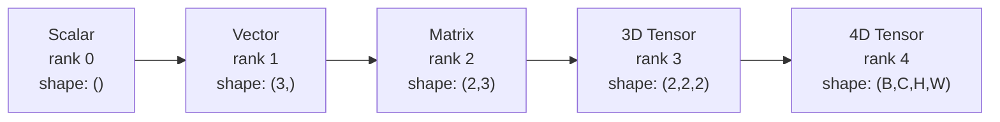
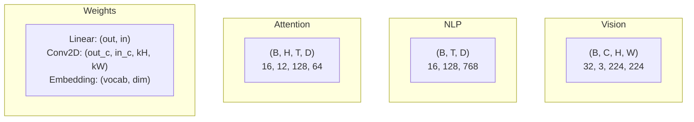
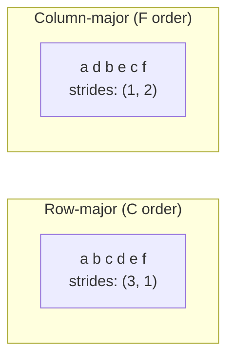
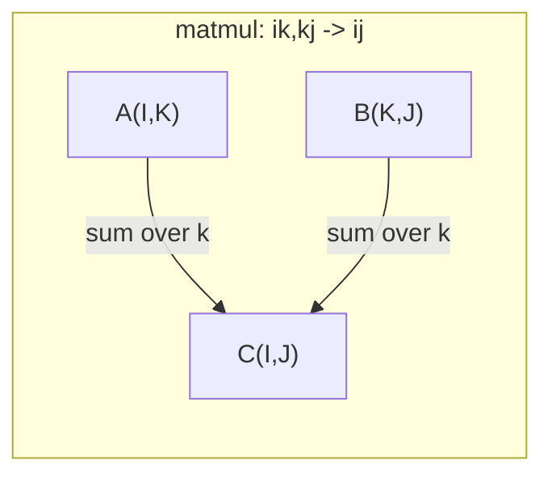

# عمليات التنسور

> العجلات هي اللغة العامة بين البيانات والتعلم العميق. كل صورة، كل جملة، كل درجة تتدفق من خلالها.

**Type:** Build
**Language:**بايثون
**前置要求：**المرحلة الأولى الدروس 01 (الجهبرية الخطية) ،02 (المتجهات والمعادلات والعمليات)
**Time:** ~90 分钟

## 學习目标
- من التنفيذ من الصف التنسوري، دعم تشكيل، خطوات، إعادة تشكيل، نقل و عمليات معينة
- تطبيق قواعد البث، في حالة عدم وجود بيانات مضغوطة على مضغوطات مختلفة الشكل
- المنتجات البقعة المصفوفات المضاعفات المنتجات الخارجية والعمليات المجموعة
- تتبع الاهتمام متعدد الرؤوس كل خطوة من أشكال مضغوطة دقيقة

## 问题
لقد بنيت محولًا.`RuntimeError: mat1 and mat2 shapes cannot be multiplied (32x768 and 512x768)`أنت تُحاول نقل هذه الأشكال`Expected 4D input (got 3D input)`لقد أضفتُ مُضغوطةً أخرى، ثمّة مكان آخر قد تُفسدُ.

أخطاء الشكل هي الأكثر شيوعا في التعليم العميق الكود. أنها ليست صعبة على النظرية - كل عملية لديها عقد شكل - ولكن سوف تتعرض بسرعة.

المصفوفات  معالجة العلاقة بين مجموعتين من الأشياء  الحقيقية البيانات لا يمكن وضعها في بُعدين  32 张 224x224 صور RGB من مجموعة واحدة هي تنسر 4D:`(32, 3, 224, 224)`مع 12 رأسًا من الاهتمام الذاتي هو أيضاً 4D:`(batch, heads, seq_len, head_dim)` تحتاج إلى نوع يمكن أن يتناسب مع أي أبعاد، وبعض البيانات، وتشغيلها يمكن أن تكون في جميع الأبعاد.

## 概念
### ما هو الـ (تنسور)

العدس هو عدد من الأبعاد التي لديها نوع بيانات موحدة.**rank**(أو **order**كل بعد هو واحد**axis**.**shape**هو واحد توبل،列出 كل محور 上大小──



总元素数 = جميع الأحجام 乘积──形`(2, 3, 4)`包含 `2 * 3 * 4 = 24`العناصر

### أشكال التنسور في دراسة العميقة

 حسب المعتاد، أنواع البيانات المختلفة سوف يتم تصويرها إلى أشكال مضغرة محددة‬



PyTorch استخدام NCHW(قنوات-أول) ――TensorFlow 默认使用 NHWC(قنوات-أخيرة)── غير مطابقة من التخطيطات سوف يؤدي إلى التغير الصامت أو التخطيط.

### كيف يعمل ترتيب الذاكرة

المجموعة 2D في النموذج هو 1段 1D بايتات 序列。**Strides**أخبرك على كل محور قبل أن تحتاج إلى القفز أكثر من عدد العناصر



نقل بيانات غير متحركة. يتبادل الخطوات، يجعل الجهاز مضغوط**non-contiguous**-- العناصر في صف واحد في الـ"内存" لم تعد متقاربة

### قواعد الإذاعة

الإذاعة  تسمح لك في حالة عدم نسخ البيانات، على مختلف الأشكال من التنسورات  إجراء عمليات الحساب   من الجانب الأيمن إلى الأشكال ٬ بجانب الأبعاد في الصورة أو واحدة منها لمدة 1   ⋅ 兼容 ٬ بجانب الأبعاد ٬ بجانب الأبعاد ٬ بجانب اليسار ٬ بجانب الجهة الأيمن ٬ بجانب الجهة الأيمن ٬ بجانب الصورة

```
Tensor A:     (8, 1, 6, 1)
Tensor B:        (7, 1, 5)
Padded B:     (1, 7, 1, 5)
Result:       (8, 7, 6, 5)
```

### إنسم: عملية تنسور عامة

جمع أينشتاين باستخدام حرف تعيين كل محور. يظهر في المدخل ولكن لا يظهر في المخرج. المحورات في الوسط سوف تكون مطلوبة.



关键模式:`i,i->`(المنتج النقطة)`i,j->ij`(المنتج الخارجي)`ii->`(تعقب)`ij->ji`(تحول)`bij,bjk->bik`(بارتش ماتمول)`bhtd,bhsd->bhts`(نقطة الاهتمام)


```figure
tensor-broadcast
```

## بناءها
代码 تقع `code/tensors.py`كل خطوة ستستشهد من تحقيقها

### الخطوة 1: التنسور خزن وخطوات

الجهاز الاحتياطي الجهاز الجهاز الجهاز الجهاز الجهاز الجهاز الجهاز الجهاز الجهاز الجهاز الجهاز الجهاز الجهاز الجهاز الجهاز الجهاز الجهاز الجهاز الجهاز الجهاز الجهاز الجهاز الجهاز الجهاز الجهاز الجهاز الجهاز الجهاز الجهاز الجهاز الجهاز الجهاز الجهاز الجهاز الجهاز الجهاز الجهاز الجهاز الجهاز الجهاز الجهاز الجهاز الجهاز الجهاز الجهاز الجهاز الجهاز الجهاز الجهاز الجهاز الجهاز الجهاز الجهاز الجهاز الجهاز الجهاز الجهاز الجهاز الجهاز الجهاز الجهاز الجهاز الجهاز الجهاز الجهاز الجهاز الجهاز الجهاز الجهاز الجهاز الجهاز الجهاز الجهاز الجهاز الجهاز الجهاز الجهاز الجهاز الجهاز الجهاز الجهاز الجهاز الجهاز الجهاز الجهاز الجهاز الجهاز الجهاز الجهاز الجهاز الجهاز الجهاز الجهاز الجهاز الجهاز الجهاز الجهاز الجهاز الجهاز الجهاز الجهاز الجهاز الجهاز الجهاز الجهاز الجهاز الجهاز الجهاز الجهاز الجهاز الجهاز الجهاز الجهاز الجهاز الجهاز الجهاز الجهاز الجهاز الجهاز الجهاز ال الجهاز الجهاز الجهاز الجهاز ال الجهاز الجهاز ال الجهاز

```python
class Tensor:
    def __init__(self, data, shape=None):
        if isinstance(data, (list, tuple)):
            self._data, self._shape = self._flatten_nested(data)
        elif isinstance(data, np.ndarray):
            self._data = data.flatten().tolist()
            self._shape = tuple(data.shape)
        else:
            self._data = [data]
            self._shape = ()

        if shape is not None:
            total = reduce(lambda a, b: a * b, shape, 1)
            if total != len(self._data):
                raise ValueError(
                    f"Cannot reshape {len(self._data)} elements into shape {shape}"
                )
            self._shape = tuple(shape)

        self._strides = self._compute_strides(self._shape)

    @staticmethod
    def _compute_strides(shape):
        if len(shape) == 0:
            return ()
        strides = [1] * len(shape)
        for i in range(len(shape) - 2, -1, -1):
            strides[i] = strides[i + 1] * shape[i + 1]
        return tuple(strides)
```

على الشكل`(3, 4)`, خطوات هو`(4, 1)`-- قبل دخول صف قفز 4 عناصر، قبل دخول صف قفز 1 عنصر

### 步骤 2: إعادة تصميم، ضغط، إزالة الضغط

إعادة التأهيل  تغيير الشكل، ولكن لا تغير ترتيب العناصر  عدد العناصر يجب أن يبقى غير متغير  استخدام `-1`让某一个维度自动推断其大小──

```python
t = Tensor(list(range(12)), shape=(2, 6))
r = t.reshape((3, 4))
r = t.reshape((-1, 3))
```

Squeeze 会移除大小为 1 ──Squeeze 会插入一个──Squeeze 对广播 至关重要 -- 一个偏向向向`(D,)`إضافة إلى اللحظة`(B, T, D)`-إنه لا يضغط`(1, 1, D)`.

```python
t = Tensor(list(range(6)), shape=(1, 3, 1, 2))
s = t.squeeze()
v = Tensor([1, 2, 3])
u = v.unsqueeze(0)
```

### 第3 步: نقل و تحويل

نقل  تبادل محورين。 إعادة التنظيم 重新排序 جميع المحور── هذا هو طريقة تحويل بين NCHW و NHWC‬‬‬‬‬‬‬‬‬‬‬‬‬‬‬‬‬‬‬‬‬‬‬‬‬‬‬‬‬‬‬‬‬‬‬‬‬‬‬‬‬‬‬‬‬‬‬‬‬‬‬‬‬‬‬‬‬‬‬‬‬‬‬‬‬‬‬‬‬‬‬‬‬‬‬‬‬‬‬‬‬‬‬‬‬‬‬‬‬‬‬‬‬‬‬‬‬‬‬‬‬‬‬‬‬‬‬‬‬‬‬‬‬‬‬‬‬‬‬‬‬‬‬‬‬‬‬‬‬‬‬‬‬‬‬‬‬‬‬‬‬‬‬‬‬‬‬‬‬‬‬‬‬‬‬‬‬‬‬‬‬‬‬‬‬‬‬‬‬‬‬‬‬‬‬‬‬‬‬‬‬‬‬‬‬‬‬‬‬‬‬‬‬‬‬‬‬‬‬‬‬‬‬‬‬‬‬‬‬‬‬‬‬‬‬‬‬‬‬‬‬‬‬‬‬‬‬‬‬‬‬‬‬‬‬‬‬‬‬‬‬‬‬‬‬‬‬‬‬‬‬‬‬‬‬‬‬‬‬‬‬‬‬‬‬‬‬‬‬‬‬‬‬‬‬‬‬‬‬‬‬‬‬‬‬‬‬‬‬‬‬‬‬‬‬‬‬‬‬‬‬‬‬‬‬‬‬‬‬‬‬‬‬‬‬‬‬‬‬‬‬‬‬‬‬‬‬‬‬‬‬‬‬‬‬‬‬‬‬‬‬‬‬‬‬‬‬‬‬‬‬‬‬‬‬‬‬‬‬‬‬‬‬‬‬‬‬‬‬‬‬‬‬‬‬‬‬‬‬‬‬‬‬‬‬‬‬‬‬‬‬‬‬‬‬‬‬‬‬‬‬‬‬‬‬‬‬‬‬‬‬‬‬‬‬‬‬‬‬‬‬‬‬‬‬‬‬‬‬‬‬‬‬‬‬‬‬‬‬‬‬‬‬‬‬‬‬‬‬‬‬‬‬‬‬‬‬‬‬‬‬‬‬‬‬‬‬‬‬‬‬‬‬‬‬‬‬‬

```python
mat = Tensor(list(range(6)), shape=(2, 3))
tr = mat.transpose(0, 1)

t4d = Tensor(list(range(24)), shape=(1, 2, 3, 4))
perm = t4d.permute((0, 2, 3, 1))
```

بعد نقل أو تحويل، كان التنسور في الـ "内存中是非连接的──在 PyTorch 中,`view`会在非连接的子 上失败 -- 使用 `reshape`أو أولاً`.contiguous()`.

### الخطوة 4: عمليات و خفضات حسب العناصر

العناصر الحكيمة العمليات ((اضافة ▌متضاعفة ▌سحب) سوف تطبق بشكل مستقل على كل عنصر،并保持 الشكل 不变── تخفيضات ((الصفقة ‧ المتوسط ‧ أقصى) سوف تتجاوز محور واحد أو أكثر‬‬‬‬‬‬‬‬‬‬‬‬‬‬‬‬‬‬‬‬‬‬‬‬‬‬‬‬‬‬‬‬‬‬‬‬‬‬‬‬‬‬‬‬‬‬‬‬‬‬‬‬‬‬‬‬‬‬‬‬‬‬‬‬‬‬‬‬‬‬‬‬‬‬‬‬‬‬‬‬‬‬‬‬‬‬‬‬‬‬‬‬‬‬‬‬‬‬‬‬‬‬‬‬‬‬‬‬‬‬‬‬‬‬‬‬‬‬‬‬‬‬‬‬‬‬‬‬‬‬‬‬‬‬‬‬‬‬‬‬‬‬‬‬‬‬‬‬‬‬‬‬‬‬‬‬‬‬‬‬‬‬‬‬‬‬‬‬‬‬‬‬‬‬‬‬‬‬‬‬‬‬‬‬‬‬‬‬‬‬‬‬‬‬‬‬‬‬‬‬‬‬‬‬‬‬‬‬‬‬‬‬‬‬‬‬‬‬‬‬‬‬‬‬‬‬‬‬‬‬‬‬‬‬‬‬‬‬‬‬‬‬‬‬‬‬‬‬‬‬‬‬‬‬‬‬‬‬‬‬‬‬‬‬‬‬‬‬‬‬‬‬‬‬‬‬‬‬‬‬‬‬‬‬‬‬‬‬‬‬‬‬‬‬‬‬‬‬‬‬‬‬‬‬‬‬‬‬‬‬‬‬‬‬‬‬‬‬‬‬‬‬‬‬‬‬‬‬‬‬‬‬‬‬‬‬‬‬‬‬‬‬‬‬‬‬‬‬‬‬‬‬‬‬‬‬‬‬‬‬‬‬‬‬‬‬‬‬‬‬‬‬‬‬‬‬‬‬‬‬‬‬‬‬‬‬‬‬‬‬‬‬‬‬‬‬‬‬‬‬‬‬‬‬‬‬‬‬‬‬‬‬‬‬‬‬‬‬‬‬‬‬‬‬‬‬‬‬‬‬‬‬‬‬‬‬‬‬‬‬‬‬‬‬

```python
a = Tensor([[1, 2], [3, 4]])
b = Tensor([[10, 20], [30, 40]])
c = a + b
d = a * 2
s = a.sum(axis=0)
```

المجموعة العالمية المتوسطة في CNN:`(B, C, H, W).mean(axis=[2, 3])` تكوين `(B, C)`السلسلة في NLP تعني التجميع:`(B, T, D).mean(axis=1)` تكوين `(B, D)`.

### 步骤 5: الإذاعة مع NumPy

`tensors.py`وسط`demo_broadcasting_numpy()`وظيفة  عرضت النمط الأساسي

```python
activations = np.random.randn(4, 3)
bias = np.array([0.1, 0.2, 0.3])
result = activations + bias

images = np.random.randn(2, 3, 4, 4)
scale = np.array([0.5, 1.0, 1.5]).reshape(1, 3, 1, 1)
result = images * scale

a = np.array([1, 2, 3]).reshape(-1, 1)
b = np.array([10, 20, 30, 40]).reshape(1, -1)
outer = a * b
```

通過 الإذاعة 计算 زوجية المسافة:将 `(M, 2)`إعادة تشكيل`(M, 1, 2)`،将 `(N, 2)`إعادة تشكيل`(1, N, 2)`,相减、平方、沿最后 محور 求和、取平方根──`(M, N)`.

### الخطوة 6: عمليات الـ Einsum

`demo_einsum()`和 `demo_einsum_gallery()`وظائف ستظهر تدريجياً كل نمط عادي

```python
a = np.array([1.0, 2.0, 3.0])
b = np.array([4.0, 5.0, 6.0])
dot = np.einsum("i,i->", a, b)

A = np.array([[1, 2], [3, 4], [5, 6]], dtype=float)
B = np.array([[7, 8, 9], [10, 11, 12]], dtype=float)
matmul = np.einsum("ik,kj->ij", A, B)

batch_A = np.random.randn(4, 3, 5)
batch_B = np.random.randn(4, 5, 2)
batch_mm = np.einsum("bij,bjk->bik", batch_A, batch_B)
```

تكلفة حسابية للتقلص هي كل حجم المؤشرات ({\\displaystyle {\\mathbb {\\mathbb {\\mathbb {\\mathbb {mathbb}}}) من ضرباتها.`bij,bjk->bik`:`32 * 128 * 64 * 128 = 33,554,432`ثانياً مضاعفة-إضافة

### الخطوة 7: آلية الاهتمام عبر المجموع

`demo_attention_einsum()`وظيفة 端到端实现 Multi-Head Attention。

```python
B, H, T, D = 2, 4, 8, 16
E = H * D

X = np.random.randn(B, T, E)
W_q = np.random.randn(E, E) * 0.02

Q = np.einsum("bte,ek->btk", X, W_q)
Q = Q.reshape(B, T, H, D).transpose(0, 2, 1, 3)

scores = np.einsum("bhtd,bhsd->bhts", Q, K) / np.sqrt(D)
weights = softmax(scores, axis=-1)
attn_output = np.einsum("bhts,bhsd->bhtd", weights, V)

concat = attn_output.transpose(0, 2, 1, 3).reshape(B, T, E)
output = np.einsum("bte,ek->btk", concat, W_o)
```

كل خطوة هي عملية مضغرة:الاعلان(من خلال واحد  تنفيذ المواد)  التقسيم الرأس  إعادة تشكيل + نقل)  نقاط الاهتمام(من خلال واحد  تنفيذ المواد)  المبلغ الموزن   من خلال واحد  تنفيذ المواد)  دمج الرأس  تنفيذ + إعادة تشكيل)  توقيع الخروج  من خلال واحد  تنفيذ المواد) ‬

## استخدمها
### الخدش مقابل النومبي

| Operation | Scratch (Tensor class) | NumPy |
|---|---|---|
| Create | `Tensor([[1,2],[3,4]])` | `np.array([[1,2],[3,4]])` |
| Reshape | `t.reshape((3,4))` | `a.reshape(3,4)` |
| Transpose | `t.transpose(0,1)` | `a.T` or `a.transpose(0,1)` |
| Squeeze | `t.squeeze(0)` | `np.squeeze(a, 0)` |
| Sum | `t.sum(axis=0)` | `a.sum(axis=0)` |
| Einsum | N/A | `np.einsum("ij,jk->ik", a, b)` |

### الخدش مقابل بيتورش

```python
import torch

t = torch.tensor([[1, 2, 3], [4, 5, 6]], dtype=torch.float32)
t.shape
t.stride()
t.is_contiguous()

t.reshape(3, 2)
t.unsqueeze(0)
t.transpose(0, 1)
t.transpose(0, 1).contiguous()

torch.einsum("ik,kj->ij", A, B)
```

زيادة PyTorch  إضافة autograd、GPU دعم 和 تحسين بلايس النواة。 الشكل من النطق هو نفسه。 إذا كنت تفهم نسخة الرمب،

### كل طبقة من شبكة العصبية هي عملية مضغوطة

| Operation | Tensor Form | Einsum |
|---|---|---|
| Linear layer | `Y = X @ W.T + b` | `"bd,od->bo"` + bias |
| Attention QKV | `Q = X @ W_q` | `"btd,dh->bth"` |
| Attention scores | `Q @ K.T / sqrt(d)` | `"bhtd,bhsd->bhts"` |
| Attention output | `softmax(scores) @ V` | `"bhts,bhsd->bhtd"` |
| Batch norm | `(X - mu) / sigma * gamma` | element-wise + broadcast |
| Softmax | `exp(x) / sum(exp(x))` | element-wise + reduction |

## 交付 it
هذا المقال يخرج من اثنين من المشاريع القابلة للرد:

1. **`outputs/prompt-tensor-shapes.md`**-- واحد يستخدم لإزالة عدم توافقات شكل Tensor نظامية الاستعلامات. يحتوي على كل نوع من العمليات العادية:

2. **`outputs/prompt-tensor-debugger.md`**-- خطوة خطوة خطوة إزالة الخطأ، عندما تشكل خطأ 阻塞你时، يمكن لصقها إلى أي مساعد AI في.

## التدريب
1. **Easy -- Reshape round-trip.**خذ شكل`(2, 3, 4)`ستقوم بإعادة تشكيلها`(6, 4)`, إعادة تشكيل`(24,)`ثمّ تغير مرة أخرى`(2, 3, 4)` من خلال طباعة البيانات المُسطحة 验证 كل خطوة من عناصر الترتيب تم الاحتفاظها 

2. **Medium -- Implement broadcasting.**لأجل`Tensor`الفئة 扩展一个 `broadcast_to(shape)`طريقة، ستصبح أبعاد 1   توسع إلى شكل الهدف ‬ ثم تعديل ‬`_elementwise_op`, جعلها في التشغيل قبل البث الذاتي.`(3, 1)`和 `(1, 4)` إجراء اختبار، النتيجة يجب أن تظهر `(3, 4)`.

3. **Hard -- Build einsum from scratch.**تحقيق أساس`einsum(subscripts, *tensors)`الوظيفة، على الأقل دعم:قطة المنتج`i,i->`)、المصفوفة مضاعفة`ij,jk->ik`)、المنتج الخارجي`i,j->ij`) وترانسبوس`ij->ji`)── تحليل سلسلة المخططات الفرعية، وتعرف المؤشرات المقلدة،并遍历 جميع مجموعات المؤشرات──将你的结果与 `np.einsum`مقابل ذلك

4. **Hard -- Attention shape tracker.**编写一个函数,输入 `batch_size`.`seq_len`.`embed_dim`和 `num_heads`,并印印多 الرأس الاهتمام كل خطوة من الشكل الدقيق: إدخال  Q / K / V التنبيه  رأس تقسيم  نقاط الاهتمام  ثقلات اللونة  المجموع الموزن  دمج الرأس  التنبيه الخارجي `demo_attention_einsum()`الناتج  إجراء التحقق

## 关键术语
| Term | What people say | What it actually means |
|---|---|---|
| Tensor | “一个 Matrix，但有更多 dimensions” | 一个具有统一 type 以及已定义 shape、strides 和 operations 的多维数组 |
| Rank | “dimensions 的数量” | axes 的数量。一个 Matrix 的 rank 是 2，而不是等于它的 matrix rank |
| Shape | “Tensor 的大小” | 一个 tuple，列出每个 axis 上的大小。`(2, 3)` 表示 2 行、3 列 |
| Stride | “内存如何排列” | 沿每个 axis 前进一个位置需要跳过的元素数量 |
| Broadcasting | “shapes 不同时它也能直接工作” | 一组严格规则：从右对齐，dimensions 必须相等，或其中一个必须是 1 |
| Contiguous | “Tensor 是正常的” | 元素在内存中按逻辑 layout 顺序连续存储，没有间隙或重排 |
| Einsum | “一种花哨的 matmul 写法” | 一种通用记法，可以用一行表达任意 Tensor contraction、outer product、trace 或 transpose |
| View | “和 reshape 一样” | 一个共享相同 memory buffer，但具有不同 shape/stride metadata 的 Tensor。会在 non-contiguous data 上失败 |
| Contraction | “对某个 index 求和” | Tensor 之间共享的 index 被相乘并求和，从而产生更低 rank 结果的一般 operation |
| NCHW / NHWC | “PyTorch vs TensorFlow format” | image tensors 的 memory layout conventions。NCHW 把 channels 放在 spatial dims 之前，NHWC 把它们放在之后 |

## 延伸阅读
- [NumPy Broadcasting](https://numpy.org/doc/stable/user/basics.broadcasting.html)-- قواعد القواعد التي تحمل أمثلة مرئية
- [PyTorch Tensor Views](https://pytorch.org/docs/stable/tensor_view.html)-- مشاهدات,何时可用,何时会复制
- [einops](https://github.com/arogozhnikov/einops)-- a جعل تنسور إعادة تشكيل أكثر قابلية للقراءة
- [The Illustrated Transformer](https://jalammar.github.io/illustrated-transformer/)-- قابل للتأثير الاهتمام
- [Einstein Summation in NumPy](https://numpy.org/doc/stable/reference/generated/numpy.einsum.html)-- مع نموذج من الوثائق الكاملة
