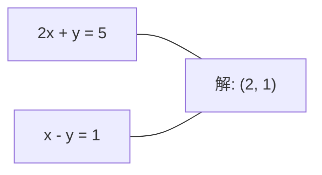
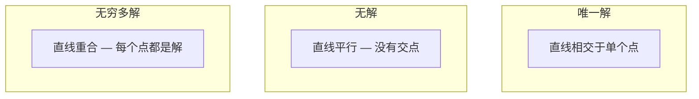

# الأنظمة الخطية

> محاولة حل Ax = b هي واحدة من أقدم المشاكل في الرياضيات، ومازالت تعمل حتى الآن على شبكة عصبيةك

**Type:** Build
**Language:**بايثون
**前置要求：**المرحلة الأولى: الدروس 01 (الجهاب الخطية) ،02 (المتنقلات والمصفوفات) ،03 (تحول المصفوفات)
**Time:** ~120 minutes

## 學习目标
- استخدام带 محور جزئي و استبدال الظهر من القضاء على غوسيان 求解 Ax = b
- استخدام LU、QR 和 تشولسكي التفكيكات تفصل المصفوفة، ومفسرة كل طريقة مناسبة المشهد
- 推导最小 مربع من المعادلات الطبيعية،并将其与线性回归和脊回归 联系起来
- استخدام رقم حالة  تشخيص أنظمة سيئة الحالة,并 تطبيق التنظيم لتحقيق استقرارها

## 问题
كل مرة تدرب فيها على التراجع الخطى , كنت في محاولة لتحديد نظام خطى . كل مرة حساب أقل مربعات تناسب , كنت في محاولة لتحديد نظام خطى . كل مرة طبقة الشبكة العصبية`y = Wx + b`عندما، فإنه في تقييم الجانب الآخر من النظام الخطى. عندما تشارك في التنظيم، أنت في تغيير هذا النظام. عندما تستخدم عمليات غوسيان، أنت في حل ماتريكس.

方程 Ax = b 无处不在──A هو المتريج المعرفي للقطاع المكون──b هو المتريج المعرفي للخروج المكون──x هو ما تريد العثور عليه من متريج غير المعرفي──بالموجب العائد، A هو متريج البيانات الخاص بك، b هو متريج الهدف الخاص بك، x هو متريج الوزن──يمكن أن يختتم النموذج بأكمله إلى: العثور على x، مما يجعل Ax 尽可能 يقترب من b──

سوف يفهم هذا الدروس جميع الطرق الرئيسية لحل هذه المعادلة من الصفر. سوف تفهم لماذا بعض الطرق أسرع وأخرى أكثر استقرارًا ، لماذا بعض الطرق تطبق فقط على الأنظمة المربعة بينما يمكن للآخرين معالجة الأنظمة المبالغ فيها ، وكذلك لماذا عدد حالة المصفوفة يقرر ما إذا كان هناك معنى في إجابتك.

## 概念
### ماذا يعني هذا في العلم

نظام معادلات خطية 具有几何解释── كل معادلة 定义一个超级平面──解就是所有超级平面相交的点(或点集)──

```
2x + y = 5          2D 中的两条直线。
x - y  = 1          它们相交于 x=2, y=1。
```



قد تكون هناك ثلاثة حالات:



في المصفوفة 形式中, "حل واحد" يعني A هو قابلة للتعديل.

### صورة العمود مقابل صورة الصف

هناك طريقتان لفهم Ax = b:

**Row picture.**كل خط من تعريف معادلة. كل معادلة هي طائرة فائقة.

**Column picture.**كل صف في A هو متجه. والمسألة تتحول إلى: ما هو الجمع الخطي من أعمدة A يمكن أن تنتج b؟

```
A = | 2  1 |    b = | 5 |
    | 1 -1 |        | 1 |

Row picture: 同时求解 2x + y = 5 和 x - y = 1。

Column picture: 找到 x1, x2，使得：
  x1 * [2, 1] + x2 * [1, -1] = [5, 1]
  2 * [2, 1] + 1 * [1, -1] = [4+1, 2-1] = [5, 1]   check.
```

صورة العمود 更根本── إذا كان b 位于 A من المجال العمودية، النظام يكون هناك حل. إذا كان b ليس في ذلك، كنت تجد الفضاء العمودية وسطها من نقطة قريبة.

### القضاء على غوسيان

القضاء على غوسيان 将 Ax = b 转换为上三角系统 Ux = c,然后使用后置替换 求解──这是最直接的方法──

算法:

```
1. 对每一列 k（pivot column）：
   a. 在第 k 行及其下方，找到 column k 中最大的 entry（partial pivoting）。
   b. 将该行与第 k 行交换。
   c. 对 k 下方的每一行 i：
      - 计算 multiplier m = A[i][k] / A[k][k]
      - 从第 i 行中减去 m 倍的第 k 行。
2. Back substitute：从最后一个 equation 向上求解。
```

نموذج:

```
Original:
| 2  1  1 | 8 |       R2 = R2 - (2)R1     | 2  1   1 |  8 |
| 4  3  3 |20 |  -->  R3 = R3 - (1)R1 --> | 0  1   1 |  4 |
| 2  3  1 |12 |                            | 0  2   0 |  4 |

                       R3 = R3 - (2)R2     | 2  1   1 |  8 |
                                       --> | 0  1   1 |  4 |
                                           | 0  0  -2 | -4 |

Back substitute:
  -2 * x3 = -4    -->  x3 = 2
  x2 + 2  = 4     -->  x2 = 2
  2*x1 + 2 + 2 = 8 --> x1 = 2
```

تكلفة حساب القضاء على غوسيان هي O  n ^ 3)  بالنسبة لنظام 1000x1000، هذا حوالي عشرة مليارات مرة عمليات نقطة عائمة‬‬‬‬‬‬‬‬‬‬‬‬‬‬‬‬‬‬‬‬‬‬‬‬‬‬‬‬‬‬‬‬‬‬‬‬‬‬‬‬‬‬‬‬‬‬‬‬‬‬‬‬‬‬‬‬‬‬‬‬‬‬‬‬‬‬‬‬‬‬‬‬‬‬‬‬‬‬‬‬‬‬‬‬‬‬‬‬‬‬‬‬‬‬‬‬‬‬‬‬‬‬‬‬‬‬‬‬‬‬‬‬‬‬‬‬‬‬‬‬‬‬‬‬‬‬‬‬‬‬‬‬‬‬‬‬‬‬‬‬‬‬‬‬‬‬‬‬‬‬‬‬‬‬‬‬‬‬‬‬‬‬‬‬‬‬‬‬‬‬‬‬‬‬‬‬‬‬‬‬‬‬‬‬‬‬‬‬‬‬‬‬‬‬‬‬‬‬‬‬‬‬‬‬‬‬‬‬‬‬‬‬‬‬‬‬‬‬‬‬‬‬‬‬‬‬‬‬‬‬‬‬‬‬‬‬‬‬‬‬‬‬‬‬‬‬‬‬‬‬‬‬‬‬‬‬‬‬‬‬‬‬‬‬‬‬‬‬‬‬‬‬‬‬‬‬‬‬‬‬‬‬‬‬‬‬‬‬‬‬‬‬‬‬‬‬‬‬‬‬‬‬‬‬‬‬‬‬‬‬‬‬‬‬‬‬‬‬‬‬‬‬‬‬‬‬‬‬‬‬‬‬‬‬‬‬‬‬‬‬‬‬‬‬‬‬‬‬‬‬‬‬‬‬‬‬‬‬‬‬‬‬‬‬‬‬‬‬‬‬‬‬‬‬‬‬‬‬‬‬‬‬‬‬‬‬‬‬‬‬‬‬‬‬‬‬‬‬‬‬‬‬‬‬‬‬‬‬‬‬‬‬‬‬‬‬‬‬‬‬‬‬‬‬‬‬‬‬‬‬‬‬‬‬‬‬‬‬‬‬‬‬‬‬‬‬‬‬‬‬‬‬‬‬‬‬‬‬‬‬‬‬‬‬‬‬‬‬‬‬‬

### التحول الجزئي: لماذا مهم

 بدون محور، القضاء على غوسيان قد يفشل أو ينتج نتائج قمامة‬‬‬‬‬‬‬‬‬‬‬‬‬‬‬‬‬‬‬‬‬‬‬‬‬‬‬‬‬‬‬‬‬‬‬‬‬‬‬‬‬‬‬‬‬‬‬‬‬‬‬‬‬‬‬‬‬‬‬‬‬‬‬‬‬‬‬‬‬‬‬‬‬‬‬‬‬‬‬‬‬‬‬‬‬‬‬‬‬‬‬‬‬‬‬‬‬‬‬‬‬‬‬‬‬‬‬‬‬‬‬‬‬‬‬‬‬‬‬‬‬‬‬‬‬‬‬‬‬‬‬‬‬‬‬‬‬‬‬‬‬‬‬‬‬‬‬‬‬‬‬‬‬‬‬‬‬‬‬‬‬‬‬‬‬‬‬‬‬‬‬‬‬‬‬‬‬‬‬‬‬‬‬‬‬‬‬‬‬‬‬‬‬‬‬‬‬‬‬‬‬‬‬‬‬‬‬‬‬‬‬‬‬‬‬‬‬‬‬‬‬‬‬‬‬‬‬‬‬‬‬‬‬‬‬‬‬‬‬‬‬‬‬‬‬‬‬‬‬‬‬‬‬‬‬‬‬‬‬‬‬‬‬‬‬‬‬‬‬‬‬‬‬‬‬‬‬‬‬‬‬‬‬‬‬‬‬‬‬‬‬‬‬‬‬‬‬‬‬‬‬‬‬‬‬‬‬‬‬‬‬‬‬‬‬‬‬‬‬‬‬‬‬‬‬‬‬‬‬‬‬‬‬‬‬‬‬‬‬‬‬‬‬‬‬‬‬‬‬‬‬‬‬‬‬‬‬‬‬‬‬‬‬‬‬‬‬‬‬‬‬‬‬‬‬‬‬‬‬‬‬‬‬‬‬‬‬‬‬‬‬‬‬‬‬‬‬‬‬‬‬‬‬‬‬‬‬‬‬‬‬‬‬‬‬‬‬‬‬‬‬‬‬‬‬‬‬‬‬‬‬‬‬‬‬‬‬‬‬‬‬‬‬‬‬‬‬‬‬‬‬‬‬‬‬‬‬‬‬‬‬‬‬‬‬‬‬‬‬‬‬‬‬‬‬‬‬‬‬‬‬‬‬‬‬‬‬‬

```
Bad pivot:                       With partial pivoting:
| 0.001  1 | 1.001 |            先交换行：
| 1      1 | 2     |            | 1      1 | 2     |
                                 | 0.001  1 | 1.001 |
m = 1/0.001 = 1000              m = 0.001/1 = 0.001
R2 = R2 - 1000*R1               R2 = R2 - 0.001*R1
| 0.001  1     | 1.001   |      | 1      1     | 2     |
| 0     -999   | -999.0  |      | 0      0.999 | 0.999 |

x2 = 1.000（正确）              x2 = 1.000（正确）
x1 = (1.001 - 1)/0.001          x1 = (2 - 1)/1 = 1.000（正确）
   = 0.001/0.001 = 1.000        稳定，因为 multiplier 很小。
```

في الحسابات المحدودة للنقطة المتحركة في الدقة، يمكن أن تفقد إصدارات غير المحور الأرقام الهامة.

### تدهور LU

سوف تفكيك LU A إلى ماتريكس مثلثية أدن L و ماتريكس مثلثية أعلى U:A = LU──L ماتريكس خزن القضاء الغوسي وسط المضاعفات。 U ماتريكس هي نتيجة القضاء。

```
A = L @ U

| 2  1  1 |   | 1  0  0 |   | 2  1   1 |
| 4  3  3 | = | 2  1  0 | @ | 0  1   1 |
| 2  3  1 |   | 1  2  1 |   | 0  0  -2 |
```

لماذا يجب أن يكون العامل بدلا من القضاء على مباشرة؟ لأنه بمجرد وجود L و U، على أي ب جديد طلب حل Ax = b فقط تحتاج O(n^2):

```
Ax = b
LUx = b
令 y = Ux:
  Ly = b    (forward substitution, O(n^2))
  Ux = y    (back substitution, O(n^2))
```

تكلفة O  n^3) فقط في الفاكتورية  دفع مرة واحدة بعد كل مرة الحل 都是 O  n^2)♦ إذا كنت بحاجة إلى استخدام نفس A  مختلف ب متجهات  حل 1000  أنظمة،LU جعل إجمالي حجم العمل الادخار جلسة 1000/3 

باستخدام محور جزئي 时, تحصل على PA = LU, من بينها P هو سجل المصفوفة المتحولات المبادلة الصفرية.

### تدمير QR

تدمير QR سوف تفصل A إلى المصفوفة المثبتة Q و المصفوفة الثلاثية العليا R:A = QR。

المصفوفة المُتَقَرَّبَة 具有 Q^T Q = I 的性质── عموداتها هي متجهاتٍ عاديّة──乘以 Q 会保持长度 和角度──

```
A = Q @ R

Q has orthonormal columns: Q^T Q = I
R is upper triangular

To solve Ax = b:
  QRx = b
  Rx = Q^T b    (只需乘以 Q^T，不需要 inversion)
  Back substitute to get x.
```

في محاولة لحل مشاكل أقل مربعات 时,QR比 LU في الاستقرار الرقمي 上更好── عملية غرام-شميدت 逐列构建 Q:

```
Given columns a1, a2, ... of A:

q1 = a1 / ||a1||

q2 = a2 - (a2 . q1) * q1        (减去到 q1 上的 projection)
q2 = q2 / ||q2||                (normalize)

q3 = a3 - (a3 . q1) * q1 - (a3 . q2) * q2
q3 = q3 / ||q3||

R[i][j] = qi . aj    for i <= j
```

كل خطوة سوف تنتقل على طول جميع مكونات المتجهات القديمة، فقط ترك الاتجاه العكسي الجديد.

### تدمير تشوليسكي

عندما يكون A متماثل (((A = A^T) ومؤكد إيجابي (((كل القيم الخاصة 都为正) ، يمكنك تحديدها إلى A = L^T ، من بينها L هو مثلث أدنى.

```
A = L @ L^T

| 4  2 |   | 2  0 |   | 2  1 |
| 2  5 | = | 1  2 | @ | 0  2 |

L[i][i] = sqrt(A[i][i] - sum(L[i][k]^2 for k < i))
L[i][j] = (A[i][j] - sum(L[i][k]*L[j][k] for k < j)) / L[j][j]    for i > j
```

تشوليسكي 快两倍比 لو ، ويستغرق فقط نصف مساحة التخزين.

- المصفوفات التناغمية هي شبه محددة إيجابية متماثلة (من خلال التنظيم 可变为 مثبت محدد)
- ماتريكس النواة في وسط عمليات غوسيان هي محادثة مثبتة محددة
- وظيفة مخروطة في الحد الأدنى 处 من هيسيان هي التوافق الجانبي المحدد.
- A^T A 总是 متماثل الإيجابي شبه محدد

في عمليات غوسيان، تستخدم تشوليسكي لتفريق ماتريكس النواة K، ثم تبحث عن حل K ألفا = y كي تحصل على معنى تنبؤي── العامل تشوليسكي أيضاً يعطي الحد الأقصى من احتمالات الحد الأقصى:log det(K) = 2 * جمع

### أقل مربعات:当 Ax = b 没有精确解时

إذا كان A هو m x n 且 m > n(معادلات 多于未知), النظام هو أكثر تحديدًا.

```
minimize ||Ax - b||^2

这是 squared residuals 的总和：
  sum((A[i,:] @ x - b[i])^2 for i in range(m))
```

الحد الأدنى 满足 المعادلات الطبيعية:

```
A^T A x = A^T b
```

推导:展开A 求 Gradient,并令其为零:2 A  A x - 2 A  T b = 0

```
Original system (overdetermined, 4 equations, 2 unknowns):
| 1  1 |         | 3 |
| 1  2 | x     = | 5 |       没有精确的 x 能满足全部 4 个 equations。
| 1  3 |         | 6 |
| 1  4 |         | 8 |

Normal equations:
A^T A = | 4  10 |    A^T b = | 22 |
        | 10 30 |            | 63 |

Solve: x = [1.5, 1.7]

这就是 linear regression。x[0] 是 intercept，x[1] 是 slope。
```

### المعادلات الطبيعية = التراجع الخطى

هذه الصفحة دقيقة. في التراجع الخطى، المصفوفة البيانات X كل صف على عينة، كل صف على صفحة واحدة.

```
X^T X w = X^T y
w = (X^T X)^(-1) X^T y
```

هذا هو حل في شكل مغلق للعودة الخطية.`sklearn.linear_model.LinearRegression.fit()`مدينة حساب هذا النتيجة ((أو من خلال QR أو SVD  حساب نتائج السعر)

إلى المصفوفة إضافة مصطلح التنظيم lambda * I، أنت حصلت على رجعة القمة:

```
(X^T X + lambda * I) w = X^T y
w = (X^T X + lambda * I)^(-1) X^T y
```

تنظيم سوف يجعل تكييف المصفوفة أفضل(أسهل准确求 العكس) ،并通过将权重向零收缩以防止过应应──当兰布达 > 0 时,Matrix X^T X +兰布达 * I 总是对称正确,因此可以使用乔尔斯基 求解──

### الاختلاف السوداني (مور-بينروز)

سيدوينفيرس A + سوف تغير المصفوفة 推广到 غير مربع 和 المصفوفات الفردية。 بالنسبة لأي المصفوفة A:

```
x = A+ b

where A+ = V Sigma+ U^T    (computed via SVD)
```

إيجاما+ 通過對每個非零 singular value 取相互并转置结果构成──如果 A = U إيجاما V^T,then A+ = V إيجاما+ U^T──

```
A = U Sigma V^T        (SVD)

Sigma = | 5  0 |       Sigma+ = | 1/5  0  0 |
        | 0  2 |                | 0  1/2  0 |
        | 0  0 |

A+ = V Sigma+ U^T
```

الاختلاف السوداني  اعطى الحل الحد الأدنى من المعايير
- حل الوحيد: A+ b 给出该解――
- 无解:A+b 给出最小平方 حل
- لا يوجد الكثير من الحلول: A + b                                                                                                                                                                                                                                                                                                                                                                                                                                                                                                                    

عدد`np.linalg.lstsq`和 `np.linalg.pinv`内部都使用 SVD。

### رقم الحالة

عدد الحالة قياس الحل على التغيرات الصغيرة في المدخلات لديه حساسية كبيرة  بالنسبة للمصفوفة A، رقم الحالة هو:

```
kappa(A) = ||A|| * ||A^(-1)|| = sigma_max / sigma_min
```

من بينها sigma_max 和 sigma_min 分别是最大和最小单数值──

```
Well-conditioned (kappa ~ 1):        Ill-conditioned (kappa ~ 10^15):
b 中的小变化 -->                    b 中的小变化 -->
x 中的小变化                         x 中的巨大变化

| 2  0 |   kappa = 2/1 = 2          | 1   1          |   kappa ~ 10^15
| 0  1 |   safe to solve            | 1   1+10^(-15) |   solution is garbage
```

经验法则:
- كابا < 100:安全,Solution 准确。
- كابا ~ 10^k: أنت大约会 من نقطة عائمة الحسابات 中损失 k 位精度
- كابا ~ 10^16( بالنسبة للطائرة64):الحل 没有意义── ماتريكس 实际上是单一──

في ML، سوء التشريع يحدث في الميزات  تقريبا التقاطع 时──تعيين اضافة lambda * I) سوف يكون عدد الحالة من sigma_max / sigma_min  تحسين为 (sigma_max + lambda) / (sigma_min + lambda) 

### الأساليب المتكررة:تراجع المشترك

بالنسبة للأنظمة النادرة جداً ((ملايين من المجهولات) ، أساليب مباشرة مثل LU أو Cholesky 成本过高──.

تراجيع الموافقة (CG) في A هو التوافق الجانبي المحدد 时求解 Ax = b。 فإنه في الحساب الدقيق في أعظم n مرات代 العثور على حل تحديد، ولكن إذا A القيم الخاصة 聚集، عادة سوف تكون أسرع وصول 。

```
Algorithm sketch:
  x0 = initial guess (often zero)
  r0 = b - A x0           (residual)
  p0 = r0                 (search direction)

  For k = 0, 1, 2, ...:
    alpha = (rk . rk) / (pk . A pk)
    x_{k+1} = xk + alpha * pk
    r_{k+1} = rk - alpha * A pk
    beta = (r_{k+1} . r_{k+1}) / (rk . rk)
    p_{k+1} = r_{k+1} + beta * pk
    if ||r_{k+1}|| < tolerance: stop
```

CG استخدام:
- التحسين على نطاق واسع ((طريقة نيوتون-سي جي)
- 求解 تخفيفات PDE
- أساليب النواة، من بينها ماتريكس النواة 太大无法因素
- كـ "مُحَلِّلَاتٍ متكررةٍ أخرى "

معدل التقارب يعتمد على عدد الحالات.

### الصورة الكاملة:何时使用哪种方法

| Method | Requirements | Cost | Use case |
|--------|-------------|------|----------|
| Gaussian elimination | Square, nonsingular A | O(n^3) | 对 square system 的一次性求解 |
| LU decomposition | Square, nonsingular A | O(n^3) factor + O(n^2) solve | 使用相同 A 的多次求解 |
| QR decomposition | Any A (m >= n) | O(mn^2) | Least squares，numerically stable |
| Cholesky | Symmetric positive definite A | O(n^3/3) | Covariance matrices，Gaussian processes，ridge regression |
| Normal equations | Overdetermined (m > n) | O(mn^2 + n^3) | Linear regression（小 n） |
| SVD / pseudoinverse | Any A | O(mn^2) | Rank-deficient systems，minimum-norm solutions |
| Conjugate gradient | Symmetric positive definite, sparse A | O(n * k * nnz) | Large sparse systems，k = iterations |

### اتصال مع ML

كل طريقة في هذا الدراسة تظهر في درجة الإنتاج ML:

**Linear regression.**حل شكل مغلق 求解 المعادلات الطبيعية X^T X w = X^T y。 هذا يمكن أن يمر من خلال تشولسكي (((إذا n 很小)、QR(إذا استقرار الرقمية 很重要) أو SVD(إذا ماتريكس قد يكون ناقصا في الدرجة)完成。

**Ridge regression.**إلى X^T X 添加 لامبدا * I。 النظام المنظم (X^T X + lambda * I) w = X^T y 总是可以通过Cholesky 求解,因为当 lambda > 0 时,X^T X + lambda * I 是对称正确的──

**Gaussian processes.**المتوسط التنبؤي 需要求解 K الفا = y، من بينها K هو المصفوفة النواة。对 K做 تشولسكي عاملة 是标准方法。 Log احتمال هامش استخدام سجل det(K) = 2 جمع(log(diag(L)))。

**Neural network initialization.**التبديل المُستقيم باستخدام تدمير QR إنشاء أعمدة لأجل ماتريص الوزن المُعتادة، مما يمنع انهيار الإشارة في الشبكات العميقة.

**Preconditioning.**المتحفسين على نطاق واسع استخدام تشولسكي غير كامل أو غير كامل LU 作为 conjugate gradient solvers的预条件──

**Feature engineering.**رقم الحالة X^T X  أخبرك الميزات نعم أو لا التقاطعية.


```figure
linear-system-conditioning
```

## بناءها
### 步骤 1: القضاء على غوسيان مع محور جزئي

```python
import numpy as np

def gaussian_elimination(A, b):
    n = len(b)
    Ab = np.hstack([A.astype(float), b.reshape(-1, 1).astype(float)])

    for k in range(n):
        max_row = k + np.argmax(np.abs(Ab[k:, k]))
        Ab[[k, max_row]] = Ab[[max_row, k]]

        if abs(Ab[k, k]) < 1e-12:
            raise ValueError(f"Matrix is singular or nearly singular at pivot {k}")

        for i in range(k + 1, n):
            m = Ab[i, k] / Ab[k, k]
            Ab[i, k:] -= m * Ab[k, k:]

    x = np.zeros(n)
    for i in range(n - 1, -1, -1):
        x[i] = (Ab[i, -1] - Ab[i, i+1:n] @ x[i+1:n]) / Ab[i, i]

    return x
```

### الخطوة الثانية: تدهور ال LU

```python
def lu_decompose(A):
    n = A.shape[0]
    L = np.eye(n)
    U = A.astype(float).copy()
    P = np.eye(n)

    for k in range(n):
        max_row = k + np.argmax(np.abs(U[k:, k]))
        if max_row != k:
            U[[k, max_row]] = U[[max_row, k]]
            P[[k, max_row]] = P[[max_row, k]]
            if k > 0:
                L[[k, max_row], :k] = L[[max_row, k], :k]

        for i in range(k + 1, n):
            L[i, k] = U[i, k] / U[k, k]
            U[i, k:] -= L[i, k] * U[k, k:]

    return P, L, U

def lu_solve(P, L, U, b):
    n = len(b)
    Pb = P @ b.astype(float)

    y = np.zeros(n)
    for i in range(n):
        y[i] = Pb[i] - L[i, :i] @ y[:i]

    x = np.zeros(n)
    for i in range(n - 1, -1, -1):
        x[i] = (y[i] - U[i, i+1:] @ x[i+1:]) / U[i, i]

    return x
```

### الخطوة الثالثة: تدمير تشولسكي

```python
def cholesky(A):
    n = A.shape[0]
    L = np.zeros_like(A, dtype=float)

    for i in range(n):
        for j in range(i + 1):
            s = A[i, j] - L[i, :j] @ L[j, :j]
            if i == j:
                if s <= 0:
                    raise ValueError("Matrix is not positive definite")
                L[i, j] = np.sqrt(s)
            else:
                L[i, j] = s / L[j, j]

    return L
```

### 步骤 4: أقل مربعات من خلال المعادلات الطبيعية

```python
def least_squares_normal(A, b):
    AtA = A.T @ A
    Atb = A.T @ b
    return gaussian_elimination(AtA, Atb)

def ridge_regression(A, b, lam):
    n = A.shape[1]
    AtA = A.T @ A + lam * np.eye(n)
    Atb = A.T @ b
    L = cholesky(AtA)
    y = np.zeros(n)
    for i in range(n):
        y[i] = (Atb[i] - L[i, :i] @ y[:i]) / L[i, i]
    x = np.zeros(n)
    for i in range(n - 1, -1, -1):
        x[i] = (y[i] - L.T[i, i+1:] @ x[i+1:]) / L.T[i, i]
    return x
```

### الخطوة 5: رقم الحالة

```python
def condition_number(A):
    U, S, Vt = np.linalg.svd(A)
    return S[0] / S[-1]
```

## استخدمها
لتجميع هذه الأجزاء، إجراء الرجوع الخطي و الرجوع القلع على البيانات الحقيقية:

```python
np.random.seed(42)
X_raw = np.random.randn(100, 3)
w_true = np.array([2.0, -1.0, 0.5])
y = X_raw @ w_true + np.random.randn(100) * 0.1

X = np.column_stack([np.ones(100), X_raw])

w_ols = least_squares_normal(X, y)
print(f"OLS weights (ours):    {w_ols}")

w_np = np.linalg.lstsq(X, y, rcond=None)[0]
print(f"OLS weights (numpy):   {w_np}")
print(f"Max difference: {np.max(np.abs(w_ols - w_np)):.2e}")

w_ridge = ridge_regression(X, y, lam=1.0)
print(f"Ridge weights (ours):  {w_ridge}")

from sklearn.linear_model import Ridge
ridge_sk = Ridge(alpha=1.0, fit_intercept=False)
ridge_sk.fit(X, y)
print(f"Ridge weights (sklearn): {ridge_sk.coef_}")
```

## 交付 it
本课产出:
- `code/linear_systems.py`، يتضمن من صفر تحقيق القضاء الغوسيانية  تدهور LU  تدهور تشولسكي  أقصى مربعات و تراجع التلال
- عرض قابل للتنفيذ، عرض المعادلات الطبيعية و التراجع الخطي للخيارات

## التدريب
1. استخدم حلول غوسيان الخاص بك`np.linalg.solve`نظام طلب الحل`[[1,2,3],[4,5,6],[7,8,10]] x = [6, 15, 27]` تجربة: 3 شخص في تسامح نقطة عائمة

2. 生成 50x5 المصفوفة عشوائية X 和 الهدف y = X @ w_true + ضجيج──分别使用正常方程式、QR(通过 `np.linalg.qr`(、SVD(مرافقة `np.linalg.svd`) و `np.linalg.lstsq`求解 w―比较四个解决方案──测量 X^T X 的条件数,并解释它如何影响你信任哪种方法──

3. 通過让两列几乎相同来创建一个几乎单一矩阵(例如، العمود 2 = العمود 1 + 1e-10 * ضجيج)  حساب عدد الحالات لها──分别在有规律化和无规律化的情况下求解 Ax = b(添加 0.01 * I)  مقارنة الحلول 和残留──解释为什么规律化有帮助──

4. ل 100 × 100 نمطية عشوائية مثبتة محددة المصفوفة 实现 conjugate gradient algorithm。统计它收到容忍 1e-8 需要多少次的代代──与n 代的理论最大值进行比较──

5. في غضون 10 50 200 500 المصفوفات المحددة الإيجابية التوافقية فوق، لحلولك تشولسكي`np.linalg.solve`计时――绘制结果――验证 تشوليسكي 大约比 LU 快 2倍――

## 关键术语
| Term | What people say | What it actually means |
|------|----------------|----------------------|
| Linear system | "Solve for x" | 一组 linear equations Ax = b。找到 x 意味着找到在 transformation A 下产生 output b 的 input。 |
| Gaussian elimination | "Row reduce" | 使用 row operations 系统性地将 diagonal 下方的 entries 置零，产生可通过 back substitution 求解的 upper triangular system。O(n^3)。 |
| Partial pivoting | "Swap rows for stability" | 在 column k 中进行 elimination 前，将该 column 中 absolute value 最大的行交换到 pivot 位置。防止除以很小的数。 |
| LU decomposition | "Factor into triangles" | 写成 A = LU，其中 L 是 lower triangular（存储 multipliers），U 是 upper triangular（eliminated matrix）。将 O(n^3) 成本摊销到多次求解中。 |
| QR decomposition | "Orthogonal factorization" | 写成 A = QR，其中 Q 的 columns 是 orthonormal，R 是 upper triangular。对于 least squares，比 LU 更稳定。 |
| Cholesky decomposition | "Square root of a matrix" | 对 symmetric positive definite A，写成 A = LL^T。成本是 LU 的一半。用于 covariance matrices、kernel matrices 和 ridge regression。 |
| Least squares | "Best fit when exact is impossible" | 当 system overdetermined（equations 多于 unknowns）时，最小化 squared residuals 的总和 ||Ax - b||^2。 |
| Normal equations | "The calculus shortcut" | A^T A x = A^T b。将 ||Ax - b||^2 的 Gradient 设为零。这就是 linear regression 的 closed-form solution。 |
| Pseudoinverse | "Inversion for non-square matrices" | A+ = V Sigma+ U^T via SVD。对于任意 Matrix，无论 square 或 rectangular、singular 与否，给出 minimum-norm least-squares solution。 |
| Condition number | "How trustworthy is this answer" | kappa = sigma_max / sigma_min。衡量对 input perturbations 的敏感性。大约损失 log10(kappa) 位精度。 |
| Ridge regression | "Regularized least squares" | 求解 (X^T X + lambda I) w = X^T y。添加 lambda I 改善 conditioning，并将 weights 向零收缩。防止 overfitting。 |
| Conjugate gradient | "Iterative Ax=b for big matrices" | 用于 symmetric positive definite systems 的 iterative solver。最多 n 步收敛。适合 factorization 成本过高的大型 sparse systems。 |
| Overdetermined system | "More data than parameters" | 在 m-by-n system 中 m > n。不存在精确解。Least squares 找到最佳近似。这就是每个 regression problem。 |
| Back substitution | "Solve from the bottom up" | 给定 upper triangular system，先求解最后一个 equation，然后向后 substitute。O(n^2)。 |
| Forward substitution | "Solve from the top down" | 给定 lower triangular system，先求解第一个 equation，然后向前 substitute。O(n^2)。用于 LU solves 中的 L step。 |

## 延伸阅读
- [MIT 18.06: Linear Algebra](https://ocw.mit.edu/courses/18-06-linear-algebra-spring-2010/)(غيلبرت سترانغ) --  حول الأنظمة الخطية و المصفوفات المصفوفة
- [Numerical Linear Algebra](https://people.maths.ox.ac.uk/trefethen/text.html)(تريفثن و باو) -- فهم الاستقرار العددي والتكييف والخوارزميات لماذا يفشل المعيار المرجح
- [Matrix Computations](https://www.cs.cornell.edu/cv/GolubVanLoan4/golubandvanloan.htm)(Golub & Van Loan) -- تغطي كل أنواع خوارزميات المصفوفة
- [3Blue1Brown: Inverse Matrices](https://www.3blue1brown.com/lessons/inverse-matrices)-- لتحديد محور الأكس = ب 几何义的可见化直觉
