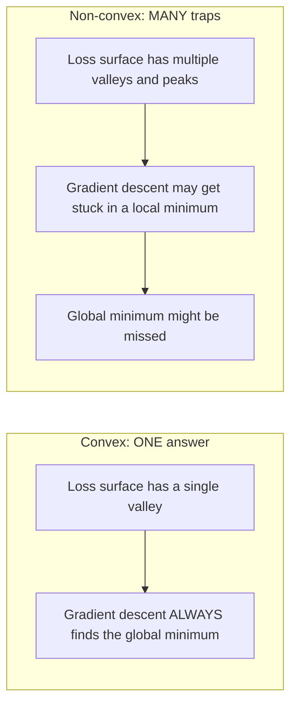
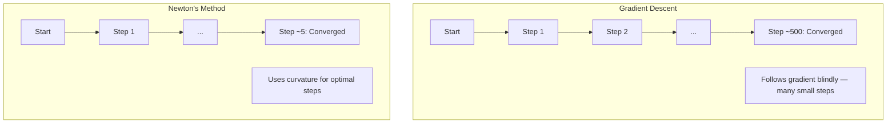
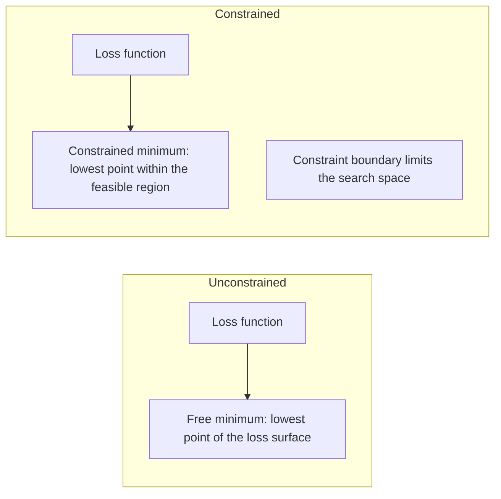
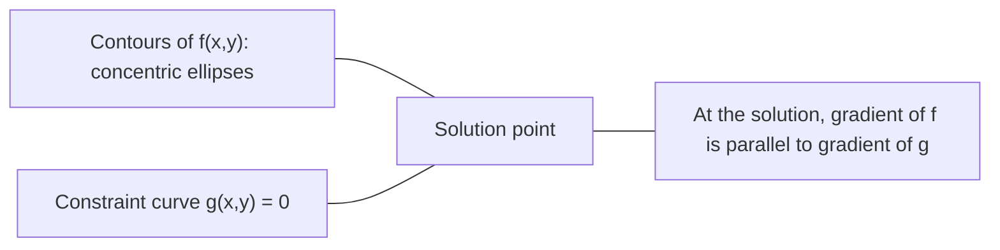

# 凸优化

> المشكلة المميزة هي أن هناك مجموعة واحدة فقط.

**类型：**الإنشاء
**语言：**بايثون
**前置要求：**المرحلة الأولى، الدروس 04 ((حسابات للدراسة)
**时间：**حوالي 90 دقيقة

## 學习目标

- استخدام تعريف 、二阶导数和 هيسيان 判据测试
- 实现 Newton's method,并将其二次收速度与渐进下降 进行比较
- استخدام مضاعفات اللجرنج بحث حل مشكلة تحسين الضمير،并 تفسير ظروف KKT
- لم تكن هذه المشهد الضارة واضحة، لكن الجيش العصبي لا يزال يجد حلًا جيدًا

## 问题

الدروس الثامنة تعلّمك التنحى الدرجيّة، والحزمة و آدم. . . . يمكن أن تتحرك هذه المحفزات على أي سطح على الدرجيّة، ولكنّها لا تضمن. . . . التنحى الدرجيّة في المشهد غير المكبّر، ويمكن أن يقع في الحد الأدنى من القيمة المحلية السيئة، أو في نقطة السرير، أو دائماً تتذبذب. . .

ولكن العديد من المشاكل في ML هي كامبها. الرجعة الخطية، الرجعة اللوجستية، SVMs، LASSO، الرج الرجعة.

فهم الكمبيوتر لديه قيمة ثلاث نقاط. أولاً، فإنه يخبرك المشكلة متى هو بسيط، متى هو صعب، متى هو غير كمبيوتر.

## 概念

### 凸集

إذا بالنسبة لمجموعة S بين أي نقطتين ، فإن الخط بينها يقع تماما في S ، فإن المجموعة S هي كاميرا.

| 凸集 | 非凸 |
|---|---|
| **矩形**：内部任意两点都可以用一条仍在内部的线段连接 | **星形/月牙形**：两个内部点之间的线段可能穿过集合外部 |
| **三角形**：对所有内部点都满足相同性质 | **甜甜圈/环形**：中间的孔意味着某些线段会离开集合 |
| 任意两点之间的线段都留在集合内 | 某些点对之间的线段会离开集合 |

形式化测试: بالنسبة S 中任意点 x、y، فضلاً عن أي t في [0, 1],点 tx + (1-t) y 也在 S 中。

凸集 مثال:
- 1 条直线 ∙ 1 平面 ∙ ∙ ∙ ∙ ∙ ∙
- واحد كرة ((圆、球体、超球)
- واحد نصف فضاء: {x: a^T x <= b}
- أي عدد من الكمبيوترات

غير المكونات المثالية:
- أحداث حلية
- 两个不相交交的并集
- أي مجموعة من المفخاخ

### 凸函数

إذا كان المجال المحدد للعمل f هو مجموعة، وبالنسبة إلى أي نقطتين x、y، و t في [0, 1]:

```
f(tx + (1-t)y) <= t*f(x) + (1-t)*f(y)
```

几何上看: الخط بين أي نقطتين على الصورة يقع فوق الصورة أو على الصورة.

| 属性 | 凸函数 | 非凸函数 |
|---|---|---|
| **线段测试** | 图像上任意两点之间的线段位于曲线**之上或之上** | 图像上某些点之间的线段会下探到曲线**之下** |
| **形状** | 单个向上弯曲的碗/谷底 | 多个峰和谷，曲率混合 |
| **局部最小值** | 每个局部最小值都是全局最小值 | 可能存在多个高度不同的局部最小值 |

常见凸函数:
- f(x) = x^2(抛物线)
- f(x) =) ‬ ‬ ‬ ‬ ‬ ‬ ‬ ‬ ‬ ‬ ‬ ‬ ‬ ‬ ‬ ‬ ‬ ‬ ‬ ‬ ‬ ‬
- f(x) = e^x(指数)
- f(x) = أقصى ((0, x) ((ReLU، على الرغم من أنه جزء من الخط)
- f(x) = -log(x) لـ x > 0(负对数)
- 任意线性函数 f(x) = a^T x + b(既凸又)

### 测试凸性

ثلاث اختبارات عملية، من أسهل إلى أكثر صرامة

**测试 1：二阶导数测试（1D）。**إذا كان لكل x هناك f'(x) >= 0، ف فهي وظيفة كيمب

- f(x) = x^2:f'(x) = 2 >= 0。凸。
- f(x) = x^3:f'(x) = 6x。x < 0 时为负──非凸──
- f(x) = e^x: f'(x) = e^x > 0。凸。

**测试 2：Hessian 测试（多变量）。**إذا كانت المصفوفة الهسسي H(x) لكل x تكون شبه محددة إيجابية، فإن f هي وظيفة كعبها.

**测试 3：定义测试。**直接检查不等式 f(tx + (1-t) y) <= t*f(x) + (1-t) *f(y)。适用于导数难以计算的函数。

### لماذا مهم

النظام الأساسي للتحسين:

**对于凸函数，每个局部最小值都是全局最小值。**

هذا يعني أن التسلل المتدريج لن يُعثر. أي طريق إلى أسفل يُوجه إلى نفس الإجابة.



结果:
- لا تحتاج إلى إعادة تشغيل
- لا تحتاج إلى تعقيدات معقدة
- يمكن أن يثبت استحواذ ((سرعة تعتمد على نوعية الوظيفة)
- 解是唯一的 (بعد المنطقة المضطربة)

### المكملات والغير المكملات في المادة

| 问题 | 凸？ | 原因 |
|---------|---------|-----|
| Linear regression (MSE) | 是 | Loss 关于权重是二次的 |
| Logistic regression | 是 | Log-loss 关于权重是凸的 |
| SVM (hinge loss) | 是 | 线性函数的最大值 |
| LASSO (L1 regression) | 是 | 凸函数之和是凸的 |
| Ridge regression (L2) | 是 | 二次 + 二次 = 凸 |
| Neural Network（任意 Loss） | 否 | 非线性 activations 会产生非凸 landscape |
| k-means clustering | 否 | 离散分配步骤 |
| Matrix factorization | 否 | 未知量的乘积 |

النموذج الحي للخسارة هو الحي. عندما يتم دمج الطبقة الخفية من التفعيلات غير الحي.

### المصفوفة الهيسي

函数 f: R^n -> R of Hessian H 是由二阶偏导数组成的 n x n ماتريكس。

```
H[i][j] = d^2 f / (dx_i dx_j)
```

对于 f ((x, y) = x^2 + 3xy + y^2:

```
df/dx = 2x + 3y       d^2f/dx^2 = 2      d^2f/dxdy = 3
df/dy = 3x + 2y       d^2f/dydx = 3      d^2f/dy^2 = 2

H = [ 2  3 ]
    [ 3  2 ]
```

هيسيان  أخبرك 曲率信息:
- القيم الخاصة 全为正: وظيفة في كل اتجاه على كل ارتفاع曲(在该点凸)
- القيم الخاصة 全为负: في كل اتجاه على كل اتجاه الى أسفل 曲
- 符号混合: نقطة السرير ((بعض الاتجاهات إلى الأعلى 曲، أما الاتجاهات الأخرى إلى أسفل 曲)
- 零 eigenvalue:该方向上是平坦的(退化)

بالنسبة لكونكوم ، يجب أن تكون جميع القيم الخاصة >= 0) في جميع المواقع شبه محددة إيجابية ، وليس فقط في نقطة واحدة.

### طريقة نيوتن

التراجع الدرجي استخدام معلومات مرحلة واحدة(Gradient)。 طريقة نيوتن استخدام معلومات مرحلة ثانية(Hessian)。 انها في النقطة الحالية تصل إلى مقربة ثانية، ثم قفز مباشرة إلى الحد الأدنى من هذه الوظيفة الثانية。

```
Update rule:
  x_new = x - H^(-1) * gradient

Compare to gradient descent:
  x_new = x - lr * gradient
```

طريقة نيوتن باستخدام عكس هيسيان بدل معدل التعلم .



优点:
- 接近最小值时二次收(每步误差平方级下降)
- لا حاجة إلى تعديل معدل التعلم
- 尺度不变 ((مهما كنتم تعملون في الحسابات))

缺点:
- 计算 Hessian 需要 O(n^2) 内存,求逆需要 O(n^3)
- بالنسبة لشبكة عصبية ذات 100 مليون وزن، هذا يعني 10^12 مقالات و 10^18 عملية
- لا يمكن استخدامها في التعلم العميق

### 约束优化

无约束优化: 在所有 x 上最小化 f(x)。
约束优化: في ظل الظروف الحد الأدنى من f ((x))

المشكلة الواقعية لديها قيود. أنت تريد تقليل التكلفة، ولكن الميزانية محدودة.



### مضاعفات اللجرنج

مضاعفات اللغرانج 方法把束问题转换为无束问题.

问题:在 g(x) = 0 的约束下最小化 f(x)。

解法:引入一个新变量 ((المرعب المُضاعف lambda) ،并求解无约束问题:

```
L(x, lambda) = f(x) + lambda * g(x)
```

في فَيْنَ، L's درجة 为零:

```
dL/dx = df/dx + lambda * dg/dx = 0
dL/dlambda = g(x) = 0
```

几何直觉: في الحزم أدنى قيمة، ف من المعدل 必须与束 g من المعدل 平行.



نموذج: في x + y = 1 من约束下最小化 f(x,y) = x^2 + y^2。

```
L = x^2 + y^2 + lambda(x + y - 1)

dL/dx = 2x + lambda = 0  =>  x = -lambda/2
dL/dy = 2y + lambda = 0  =>  y = -lambda/2
dL/dlambda = x + y - 1 = 0

From first two: x = y
Substituting: 2x = 1, so x = y = 0.5, lambda = -1
```

الخط المباشر x + y = 1 فوق المسافة من النقطة الأصلية القريبة من النقطة هي (0.5, 0.5)。

### شروط الـ KKT

ظروف كاروش-كوهن-توكر سوف تضاعفات اللجرنج  توسع إلى غير مساوية حولها

问题:在 g_i(x) <= 0,i = 1, ..., m 的约束下最小化 f(x) 』

شروط كيه كيه (أفضل شروط)

```
1. Stationarity:    df/dx + sum(lambda_i * dg_i/dx) = 0
2. Primal feasibility:  g_i(x) <= 0  for all i
3. Dual feasibility:    lambda_i >= 0  for all i
4. Complementary slackness:  lambda_i * g_i(x) = 0  for all i
```

الإبطاء الإضافي هو المفتاح.

ظروف ك ك ك ت هي جوهر SVMs.

### التنظيم  كحد من تحسين

L1 و L2 التنظيم ليسوا مهارات متواضعة.

**L2 regularization (Ridge)：**

```
minimize  Loss(w)  subject to  ||w||^2 <= t

Equivalent unconstrained form:
minimize  Loss(w) + lambda * ||w||^2
```

约束 约束 约束 约束 约束 约束 约束 约束 约束 约束 约束 约束 约束 约束 约束 约束 约束 约束 约束 约束 约束 约束 约束 约束 约束 约束 约束 约束 约束 约束 约束 约束 约束 约束 约束 约束 约束 约束 约束 约束 约束 约束 约束 约束 约束 约束 约束 约束 约束 约束 约束 约束 约束 约束 约束 约束 约束 约束 约束 约束 约束 约束 约 约 约 约 约 约 约 约 约 约 约 约 约 约 约 约 约 约 约 约 约 约 约 约 约 约 约 约 约 约 约 约 约 约 约 约 约 约 约 约 约 约 约 约 约 约 约 约 约 约 约 约 约 约 约 约 约 约 约 约 约 约 约 约 约 约 约 约 约 约 约 约 约 约 约 约 约 约 约 约 约 约 约 约 约 约 约 约 约 约 约 约 约 约 约 约 约 约 约 约 约 约 约    约 约 约 约 约 约 约 约  约 约                                                                                              

**L1 regularization (LASSO)：**

```
minimize  Loss(w)  subject to  ||w||_1 <= t

Equivalent unconstrained form:
minimize  Loss(w) + lambda * ||w||_1
```

约束 束 束 束 束 束 束 束 束 束 束 束 束 束 束 束 束 束 束 束 束 束 束 束 束 束 束 束 束 束 束 束 束 束 束 束 束 束 束 束 束 束 束 束 束 束 束 束 束 束 束 束 束 束 束 束 束 束 束 束 束 束 束 束 束 束 束 束 束 束 束 束 束 束 束 束 束 束 束 束 束 束 束 束 束 束 束 束 束 束 束 束 束 束 束 束 束 束 束 束 束 束 束 束 束 束 束 束 束 束 束 束 束 束 束 束 束 束 束 束 束 束 束 束 束 束 束 束 束 束 束 束 束 束 束 束 束 束 束 束 束 束 束 束 束 束 束 束 束 束 束 束 束 束 束 束                                                                                                                                                                                                     

| 属性 | L2 约束（圆） | L1 约束（菱形） |
|---|---|---|
| **约束形状** | 圆（更高维中是球面） | 菱形（2D 中旋转的正方形） |
| **Loss 等高线接触的位置** | 光滑边界：圆上的任意点 | 角点：与某个轴对齐 |
| **解的行为** | 权重较小但非零 | 某些权重恰好为零（稀疏） |
| **结果** | 权重收缩 | 特征选择 |

هذا يفسر لماذا L1 سوف تنتج نموذج نادرة (تخصيص اختيار) ، بينما L2  مجرد تقليل الوزن.شكل مع معينة مع محور على طول الزاوية.خسارة وغيرها من خطوط عالية أكثر احتمالاً لمواصلة الزاوية، وبالتالي سوف يكون واحد أو أكثر من الوزن في الواقع وضعها إلى صفر.

### الثنائي

لكل مشكلة تحسين القيادة ((الأولى) لديها مشكلة معينة ((المزدوجة)  بالنسبة لل مشكلة الكم، والأولى 和 المزدوجة 具有相同的最佳优值── هذه هي الثنائيات القوية──

وظيفة مزدوجة لجرنجيان:

```
Primal: minimize f(x) subject to g(x) <= 0
Lagrangian: L(x, lambda) = f(x) + lambda * g(x)
Dual function: d(lambda) = min_x L(x, lambda)
Dual problem: maximize d(lambda) subject to lambda >= 0
```

لماذا الثنائيات مهمة:
- مشكلة مزدوجة أحياناً أكثر سهولة من البدائية
- SVMs باستخدام شكل مزدوج طلب الحل، والمسألة تعتمد على البيانات النقاط بين منتجات النقاط (تاخذ خدعة النواة)
- المزدوج  يوفر أصل أساسي أفقي                                                                                                                                                                                                                                                                                                                                                                                                                                                                                                               

具体到SVM:

```
Primal: find w, b that maximize the margin 2/||w|| subject to
        y_i(w^T x_i + b) >= 1 for all i

Dual:   maximize sum(alpha_i) - 0.5 * sum_ij(alpha_i * alpha_j * y_i * y_j * x_i^T x_j)
        subject to alpha_i >= 0 and sum(alpha_i * y_i) = 0

The dual only involves dot products x_i^T x_j.
Replace x_i^T x_j with K(x_i, x_j) to get the kernel trick.
```

### لماذا التعلم العميق لا يزال يعمل على الرغم من عدم وجود قوة

وظيفة فقدان الشبكة العصبية 极其非凸── وفقا لكل معيار كلاسيكي، تحسينهم يجب أن يفشل── ومع ذلك، يمكن أن يجد التراجع التدريجي الستوكاستي بشكل موثوق حلًا جيدًا── عدة عوامل تفسر هذا النقطة──

**大多数局部最小值已经足够好。**في الفضاء العالي، تكون النقاط الحرجة في المرتبة العليا هي نقاط القيادة، وليس القيمة المحلية الحد الأدنى.

**真正的障碍是 saddle points，而不是局部最小值。**في وظيفة ذات n 个参数، نقطة الساحة نفس الوقت مع معدل التوتر الصائب والسلبي الاتجاهات. بالنسبة للنقطة الحرجة المختلفة في الارتفاع، جميع القيم الخاصة الخاصة كلها للصواب.

**Overparameterization 会平滑 landscape。** عدد العناصر أكثر من نموذج التدريب شبكة لديها أسطح الخسارة أكثر سلاسة  أكثر ربطا  شبكة واسعة لديها أقل من الحد الأدنى للجزء السيئة  هذا يتعارض مع الهواية، ولكن يتفق مع نتائج التجربة 

**Loss landscape 结构：**

| 属性 | 低维空间 | 高维空间 |
|---|---|---|
| **Landscape** | 许多孤立的峰和谷 | 平滑连通的谷 |
| **最小值** | 许多孤立局部最小值 | 很少有糟糕局部最小值；大多数接近最优 |
| **导航** | 难以找到全局最小值 | 许多路径通向好的解 |
| **Critical points** | 局部最小值和 saddle points 混合 | 压倒性地是 saddle points，而非局部最小值 |

**随机噪声充当隐式 regularization。**المجموعة الصغيرة SGD  إدخال الضجيج، منع سقوط في الحد الأدنى الحاد.

###  عملية الثانية

طريقة نيوتن المباشرة لموديل كبير غير عملية.

**L-BFGS (Limited-memory BFGS)：**استخدام الأخير m 个 差分近似逆 Hessian──需要 O(mn) 内存, وليس O(n^2)── تطبق على ما يزيد عن 10,000 个参数的问题── تطبق على كلاسيكية ML(رجسيا اللوجستية、CRFs), ولكن لا تستخدم Deep Learning──

**Natural gradient：**استخدام مصفوفة معلومات فيشر ({{log-probability expectations Hessian}}) بدلا من المعيار فيشر.

**Hessian-free optimization：**استخدام تراجع المشترك 求解 Hx = g، لا يظهر لتشكيل H。 فقط تحتاج إلى منتجات المتجهات الهسسي، وهذا يمكن من خلال التمييز الآلي في O(n) 时间内计算。

**Diagonal approximations：**اللحظة الثانية لآدم هي هيسيان على طول خطة على طول خطة.

| 方法 | 内存 | 每步成本 | 何时使用 |
|--------|--------|--------------|-------------|
| Gradient Descent | O(n) | O(n) | Baseline，大模型 |
| Newton's method | O(n^2) | O(n^3) | 小型凸问题 |
| L-BFGS | O(mn) | O(mn) | 中型凸问题 |
| Adam | O(n) | O(n) | Deep Learning 默认选择 |
| K-FAC | O(n) | 每层 O(n) | 研究、大 batch training |


```figure
convex-vs-nonconvex
```

## بناءها

### الخطوة 1: المفتش

构建一个函数,通过采样点并检查定义来经验性测试凸性──

```python
import random
import math

def check_convexity(f, dim, bounds=(-5, 5), samples=1000):
    violations = 0
    for _ in range(samples):
        x = [random.uniform(*bounds) for _ in range(dim)]
        y = [random.uniform(*bounds) for _ in range(dim)]
        t = random.uniform(0, 1)
        mid = [t * xi + (1 - t) * yi for xi, yi in zip(x, y)]
        lhs = f(mid)
        rhs = t * f(x) + (1 - t) * f(y)
        if lhs > rhs + 1e-10:
            violations += 1
    return violations == 0, violations
```

### الخطوة 2: استخدام طريقة نيوتن في 2D

استخدام واضحة هيسيان 实现 نيوتن طريقة.

```python
def newtons_method(f, grad_f, hessian_f, x0, steps=50, tol=1e-12):
    x = list(x0)
    history = [x[:]]
    for _ in range(steps):
        g = grad_f(x)
        H = hessian_f(x)
        det = H[0][0] * H[1][1] - H[0][1] * H[1][0]
        if abs(det) < 1e-15:
            break
        H_inv = [
            [H[1][1] / det, -H[0][1] / det],
            [-H[1][0] / det, H[0][0] / det],
        ]
        dx = [
            H_inv[0][0] * g[0] + H_inv[0][1] * g[1],
            H_inv[1][0] * g[0] + H_inv[1][1] * g[1],
        ]
        x = [x[0] - dx[0], x[1] - dx[1]]
        history.append(x[:])
        if sum(gi ** 2 for gi in g) < tol:
            break
    return history
```

### 步骤 3:مضاعف الكبيرة 求解器

通過在拉格兰吉上执行 渐进下降 来求解约束优化──

```python
def lagrange_solve(f_grad, g_val, g_grad, x0, lr=0.01,
                   lr_lambda=0.01, steps=5000):
    x = list(x0)
    lam = 0.0
    history = []
    for _ in range(steps):
        fg = f_grad(x)
        gv = g_val(x)
        gg = g_grad(x)
        x = [
            xi - lr * (fgi + lam * ggi)
            for xi, fgi, ggi in zip(x, fg, gg)
        ]
        lam = lam + lr_lambda * gv
        history.append((x[:], lam, gv))
    return history
```

### الخطوة 4: مقارنة الخطوة الأولى والخطوة الثانية

في نفس وظيفة ثانوية على النشاط التسلل التدريجي و طريقة نيوتن.

```python
def quadratic(x):
    return 5 * x[0] ** 2 + x[1] ** 2

def quadratic_grad(x):
    return [10 * x[0], 2 * x[1]]

def quadratic_hessian(x):
    return [[10, 0], [0, 2]]
```

طريقة نيوتن سوف تكون في 1 步内收(إنها تتعامل مع وظيفة ثانوية هي دقيقة)。 سوف يتطلب التنزل الدرجي مئات الخطوات، لأن قيم الهيسيان الخاصة相差 5 倍، شكلت وادي طويل‬‬‬‬‬‬‬‬‬‬‬‬‬‬‬‬‬‬‬‬‬‬‬‬‬‬‬‬‬‬‬‬‬‬‬‬‬‬‬‬‬‬‬‬‬‬‬‬‬‬‬‬‬‬‬‬‬‬‬‬‬‬‬‬‬‬‬‬‬‬‬‬‬‬‬‬‬‬‬‬‬‬‬‬‬‬‬‬‬‬‬‬‬‬‬‬‬‬‬‬‬‬‬‬‬‬‬‬‬‬‬‬‬‬‬‬‬‬‬‬‬‬‬‬‬‬‬‬‬‬‬‬‬‬‬‬‬‬‬‬‬‬‬‬‬‬‬‬‬‬‬‬‬‬‬‬‬‬‬‬‬‬‬‬‬‬‬‬‬‬‬‬‬‬‬‬‬‬‬‬‬‬‬‬‬‬‬‬‬‬‬‬‬‬‬‬‬‬‬‬‬‬‬‬‬‬‬‬‬‬‬‬‬‬‬‬‬‬‬‬‬‬‬‬‬‬‬‬‬‬‬‬‬‬‬‬‬‬‬‬‬‬‬‬‬‬‬‬‬‬‬‬‬‬‬‬‬‬‬‬‬‬‬‬‬‬‬‬‬‬‬‬‬‬‬‬‬‬‬‬‬‬‬‬‬‬‬‬‬‬‬‬‬‬‬‬‬‬‬‬‬‬‬‬‬‬‬‬‬‬‬‬‬‬‬‬‬‬‬‬‬‬‬‬‬‬‬‬‬‬‬‬‬‬‬‬‬‬‬‬‬‬‬‬‬‬‬‬‬‬‬‬‬‬‬‬‬‬‬‬‬‬‬‬‬‬‬‬‬‬‬‬‬‬‬‬‬‬‬‬‬‬‬‬‬‬‬‬‬‬‬‬‬‬‬‬‬‬‬‬‬‬‬‬‬‬‬‬‬‬‬‬‬‬‬‬‬‬‬‬‬‬‬‬‬‬‬‬‬‬‬‬‬‬‬‬‬‬‬‬‬‬‬‬‬‬‬‬‬‬‬

## استخدمها

في اختيار ML 模型和 solver 时, يمكن تطبيق تحليل الكمبيوتر مباشرة.

对于凸问题: (التراجع اللوجستي
- استخدام الحل الخاص ((liblinear、CVXPY、scipy.optimize.minimize with method='L-BFGS-B')
-  توقع الحصول على الوحيدة والكامل حل
- 2 مرحلة طريقة عملية وسرعة

对于非凸问题:
- استخدام一阶方法 ((SGD、 آدم)
-  قبول التبعية التأريخ والشكل
- استخدام إضافية المقاييس، ضجيج وتحديد معدل التعلم كإضفاء التنظيم
- لا تضيعي الوقت في البحث عن الحد الأدنى للمكان

```python
from scipy.optimize import minimize

result = minimize(
    fun=lambda w: sum((y - X @ w) ** 2) + 0.1 * sum(w ** 2),
    x0=np.zeros(d),
    method='L-BFGS-B',
    jac=lambda w: -2 * X.T @ (y - X @ w) + 0.2 * w,
)
```

بالنسبة لـ SVM، صيغة مزدوجة يمكنك استخدام خدعة النواة:

```python
from sklearn.svm import SVC

svm = SVC(kernel='rbf', C=1.0)
svm.fit(X_train, y_train)
print(f"Support vectors: {svm.n_support_}")
```

## التدريب

1. **凸性画廊。**استخدام الاختبارات الاختبار هذه المهام الكمبية: f(x) = x^4、f(x) = sin(x)、f(x,y) = x^2 + y^2、f(x,y) = x*y、f(x) = max(x, 0)。 شرح لماذا كل نتيجة معقولة。

2. **Newton vs Gradient Descent 竞赛。**من النقطة الناشئة (10, 10) 出发,在 f(x,y) = 50*x^2 + y^2 上运行两种方法── كل طريقة تحتاج إلى عدد الخطوات لتحقيق الخسارة < 1e-10؟ عند عدد الحالة ((( أكبر قيمة هيسيانية ذاتية مع الحد الأدنى قيمة هيسيانية ذاتية) زيادة، ماذا يحدث التراجع التدريجي؟

3. **Lagrange multiplier 几何。**في حزمة x + 2y = 4 下最小化 f(x,y) = (x-3)^2 + (y-3)^2── من خلال فحص الحل في ف من الدرجة و g من الدرجة 平行来验证解──

4. **Regularization 约束。**实现 L1-محدود التحسين: في ‬ ‬ ‬ ‬ ‬ ‬ ‬ ‬ ‬ ‬ ‬ ‬ ‬ ‬ ‬ ‬ ‬ ‬ ‬ ‬ ‬ ‬ ‬ ‬ ‬ ‬ ‬ ‬ ‬ ‬ ‬ ‬ ‬ ‬ ‬ ‬ ‬ ‬ ‬ ‬ ‬ ‬ ‬ ‬ ‬ ‬ ‬ ‬ ‬ ‬ ‬ ‬ ‬ ‬ ‬ ‬ ‬ ‬ ‬ ‬ ‬ ‬ ‬ ‬ ‬ ‬ ‬ ‬ ‬ ‬ ‬ ‬ ‬ ‬ ‬ ‬ ‬ ‬ ‬ ‬ ‬ ‬ ‬ ‬ ‬ ‬ ‬ ‬ ‬ ‬ ‬ ‬ ‬ ‬ ‬ ‬ ‬ ‬ ‬ ‬ ‬ ‬ ‬ ‬ ‬ ‬ ‬ ‬ ‬ ‬ ‬ ‬ ‬ ‬ ‬ ‬ ‬ ‬ ‬ ‬ ‬ ‬ ‬ ‬ ‬ ‬ ‬ ‬ ‬ ‬ ‬ ‬ ‬ ‬ ‬ ‬ ‬ ‬ ‬ ‬ ‬ ‬ ‬ ‬ ‬ ‬ ‬ ‬ ‬ ‬ ‬ ‬ ‬ ‬ ‬ ‬ ‬ ‬ ‬ ‬ ‬ ‬ ‬ ‬ ‬ ‬ ‬ ‬ ‬ ‬ ‬ ‬ ‬ ‬ ‬ ‬ ‬ ‬ ‬ ‬ ‬ ‬ ‬ ‬ ‬ ‬ ‬ ‬ ‬ ‬ ‬ ‬ ‬ ‬ ‬ ‬ ‬ ‬ ‬ ‬ ‬ ‬ ‬ ‬ ‬ ‬ ‬ ‬ ‬ ‬ ‬ ‬ ‬ ‬ ‬ ‬ ‬ ‬ ‬ ‬ ‬ ‬ ‬ ‬ ‬ ‬ ‬ ‬ ‬ ‬ ‬ ‬ ‬ ‬ ‬ ‬ ‬ ‬ ‬ ‬ ‬ ‬ ‬ ‬ ‬ ‬ ‬ ‬ ‬ 

5. **Hessian eigenvalue 分析。** حساب وظيفة روزنبروك في (1,1) و (-1,1) 处的赫سيان。 حساب القيم الخاصة من نقطتين。 القيم الخاصة  تخبرك ما هي الفرق بين معدل التوتر في القيمة الحد الأدنى بالقرب من القيمة الحد الأدنى بعيدا عن القيمة الحد الأدنى؟

## 关键术语

| 术语 | 含义 |
|------|---------------|
| 凸集 | 集合中任意两点之间的线段仍留在集合内部的集合 |
| 凸函数 | 图像上任意两点之间的线段位于图像之上或图像上的函数。等价地，Hessian 在所有位置都是 positive semidefinite |
| 局部最小值 | 比所有邻近点都低的点。对于凸函数，每个局部最小值都是全局最小值 |
| 全局最小值 | 函数在其整个定义域上的最低点 |
| Hessian Matrix | 所有二阶偏导数组成的 Matrix。编码曲率信息 |
| Positive semidefinite | Eigenvalues 全部非负的 Matrix。是“二阶导数 >= 0”的多维类比 |
| Condition number | Hessian 的最大 eigenvalue 与最小 eigenvalue 的比值。高 condition number 意味着拉长的谷和缓慢的 Gradient Descent |
| Newton's method | 使用逆 Hessian 确定步进方向和大小的二阶 Optimizer。接近最小值时二次收敛 |
| Lagrange multiplier | 为了将约束优化问题转换为无约束问题而引入的变量 |
| KKT conditions | 不等式约束下最优性的必要条件。推广了 Lagrange multipliers |
| Complementary slackness | 在解处，约束要么是 active 的，要么其 multiplier 为零。二者不会同时非零 |
| Duality | 每个约束问题都有一个伴随的 dual problem。对于凸问题，二者具有相同的最优值 |
| Strong duality | Primal 和 dual 的最优值相等。对满足 Slater's condition 的凸问题成立 |
| L-BFGS | 近似二阶方法，存储最近 m 个 Gradient 差分，而不是完整 Hessian |
| Saddle point | Gradient 为零，但在某些方向上是最小值、在另一些方向上是最大值的点 |
| Overparameterization | 使用比训练样本更多的参数。会平滑 Loss landscape 并减少糟糕局部最小值 |

## 延伸阅读

- [Boyd & Vandenberghe: Convex Optimization](https://web.stanford.edu/~boyd/cvxbook/)- 标准教材,在线免费提供
- [Bottou, Curtis, Nocedal: Optimization Methods for Large-Scale Machine Learning (2018)](https://arxiv.org/abs/1606.04838)- 连凸优化理论与深度学习 实践
- [Choromanska et al.: The Loss Surfaces of Multilayer Networks (2015)](https://arxiv.org/abs/1412.0233)- لماذا لا تبدو المناظر الطبيعية الشبكة العصبية سيئة
- [Nocedal & Wright: Numerical Optimization](https://link.springer.com/book/10.1007/978-0-387-40065-5)- طريقة نيوتن L-BFGS وترتيبات تحسين القيود
