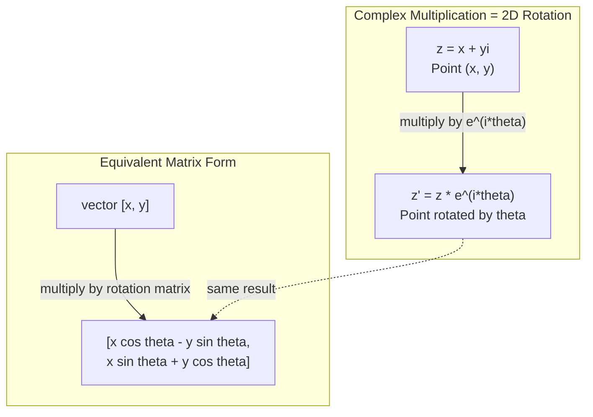
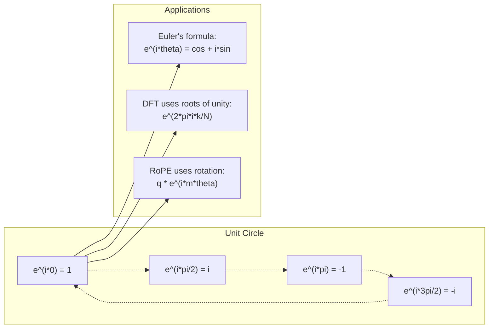

# عدد عدد الـ

> الجذر التربيعي للـ -1 ليس كلياً. إنه مفتاح في مجال التدوير والتكثيف والنصف من مجال معالجة الإشارات.

**Type:** Learn
**Language:**بايثون
**Prerequisites:** Phase 1, Lessons 01-04（linear algebra, calculus）
**Time:** ~60 分钟

## 學习目标
- في صيغة مستقيمة واصطناعية كبيرة تنفيذ عدد عمليات الحسابات
-  تطبيق صيغة أولي في الثلاثة نقاط
- استخدام عدد الوحدات لتحقيق تحويل فوريه متواضع
-  شرح عدد المتحول كيفية تشكيل المحول 中 RoPE 和正弦位置编码的基础

## 问题
أنت تفتح مقال حول تحويلات فوريير، كل شيء في كل مكان`i`✿你查看 محول 位置编码, انظر مختلف التردد تحت `sin`和 `cos` 也就是复指数的实部和虚部──你读量子计算,又发现一切都用复向 空间来表达──

يبدو عدد الـ 复数 مجردة. نظام عدد مبني على الجذر التربيعي من -1، يشعر مثل بعض المهارات الرياضية. لكنه ليس مهارة. إنه لغة طبيعية للتدوير والزج.

إذا لم تفهم عدد النقاط، فإنك لن تفهم تحويل فوريه المميز.

هذا الدروس سوف يبدأ من خيارات التكوين والتنسيق مع الحسابات الجوهرية، ويتصل مع الجوهرات، ويدل على إظهار مكانات العدد في التعلم الآلي.

## 概念
### ما هو العدد؟

هناك قسمين: حقيقة و حقيقة

```
z = a + bi

where:
  a is the real part
  b is the imaginary part
  i is the imaginary unit, defined by i^2 = -1
```

هذا هو الحال. أنت تضع محور العدد يمتد إلى مسطح واحد. العدد الحقيقي يقع على محور واحد، والعدد الفارغ يقع على محور آخر. كل عدد مضاعف هو نقطة واحدة على هذه المسطح.

### 复数运算

**加法。**实部相加,虚部相加.

```
(a + bi) + (c + di) = (a + c) + (b + d)i

Example: (3 + 2i) + (1 + 4i) = 4 + 6i
```

**乘法。**استخدام قانون التوزيع،并记住 i^2 = -1──

```
(a + bi)(c + di) = ac + adi + bci + bdi^2
                 = ac + adi + bci - bd
                 = (ac - bd) + (ad + bc)i

Example: (3 + 2i)(1 + 4i) = 3 + 12i + 2i + 8i^2
                            = 3 + 14i - 8
                            = -5 + 14i
```

**共轭。**翻转虚部的符号──

```
conjugate of (a + bi) = a - bi
```

عدد واحد مضاعف مع عدد واحد هو عدد حقيقي:

```
(a + bi)(a - bi) = a^2 + b^2
```

**除法。**分子和分母同时乘以分母的共──

```
(a + bi) / (c + di) = (a + bi)(c - di) / (c^2 + d^2)
```

هذا سوف يزيل الجزء الخالي من المجموعة، الحصول على عدد نظيف من المعدلات.

### 复平面

复平面把每个复数映射到一个2D点──水平轴是实轴,垂直轴是虚轴──

```
z = 3 + 2i  corresponds to the point (3, 2)
z = -1 + 0i corresponds to the point (-1, 0) on the real axis
z = 0 + 4i  corresponds to the point (0, 4) on the imaginary axis
```

复数同时是一点,也是从原点出发的向量. هذا التفسير الثنائي هو السبب المفيد في عدد العدد في الهندسة.

### 极坐标形式

يمكن استخدام أي نقطة في المسطح لوصفها على مسافة نقطة الأصل، وكذلك لوصفها من زاوية المحور الحقيقي نسبيا.

```
z = r * (cos(theta) + i*sin(theta))

where:
  r = |z| = sqrt(a^2 + b^2)     (magnitude, or modulus)
  theta = atan2(b, a)             (phase, or argument)
```

مباشرة على النحو المُباشر

**极坐标形式下的乘法。**模长相乘, زاوية相加.

```
z1 = r1 * e^(i*theta1)
z2 = r2 * e^(i*theta2)

z1 * z2 = (r1 * r2) * e^(i*(theta1 + theta2))
```

هذا هو السبب في أن عدد العدد مناسب جدا لتعبير الدوران.

### صيغة أولر

الجسر بين 复指数 و三角函数:

```
e^(i*theta) = cos(theta) + i*sin(theta)
```

هذه هي أهم الصيغة في هذا الصف:

```
e^(i*pi) = cos(pi) + i*sin(pi) = -1 + 0i = -1

Therefore: e^(i*pi) + 1 = 0
```

五个基本常数 ((e, i, pi, 1, 0) تم ربطها معا فى مربع واحد

### لماذا صيغة أولر بالنسبة لـ ML مهمة جداً

صيغة (أولير) تظهر`e^(i*theta)`会随着太太 变化描绘单位圆――当太太 = 0 时,你在 (1, 0) ・当太太 = pi/2 时,你在 (0, 1) ・当太太 = pi 时,你在 (-1, 0) ・当太太 = 3*pi/2 时,你在 (0, -1) ・完整一圈旋转是太太 = 2*pi。

هذا يعني أن المعدل الثاني هو التدوير، والدوار لا يوجد في معالجة الإشارات والإم إل.

### الاتصال مع 2D دوار

将复数 (x + yi) 乘以 e^(i*theta),会把点 (x, y) 周围原点旋转 theta 角──

```
Rotation via complex multiplication:
  (x + yi) * (cos(theta) + i*sin(theta))
  = (x*cos(theta) - y*sin(theta)) + (x*sin(theta) + y*cos(theta))i

Rotation via matrix multiplication:
  [cos(theta)  -sin(theta)] [x]   [x*cos(theta) - y*sin(theta)]
  [sin(theta)   cos(theta)] [y] = [x*sin(theta) + y*cos(theta)]
```

تُنتج نفس النتائج تماما ً.



### الفازور و إشارة التحول

复指数 e^(i*omega*t) هو نقطة في حلقة حول الفئة المتحركة.

هذا الجانب الحقيقي من نقطة التحول هو cos(وميغا*t)。虚部是 sin(وميغا*t)。正弦信号就是旋转复数投下的影子。

```
e^(i*omega*t) = cos(omega*t) + i*sin(omega*t)

Real part:      cos(omega*t)    -- a cosine wave
Imaginary part: sin(omega*t)    -- a sine wave
```

هذا هو الفازور يعبر عن طريقة. أنت لم تعد تتبع موجة الصدرية المرتفعة، بل تتبع شريحة من المدار المُسطح.

### 单位根

N الجدول الجدول هو N نقطة من الجدول على حدة

```
w_k = e^(2*pi*i*k/N)    for k = 0, 1, 2, ..., N-1
```

عندما N = 4 时,根是:1, i, -1, -i(四个罗盘方向)
عندما N = 8، سوف تحصل على أربعة مسارات، و إضافة أربعة مسارات مقابل الزاوية.

وحدة الجذر هي أساس تحويل فوريه المميز. سوف تقوم DFT بتقسيم الإشارات إلى N 个等 على التردد المتردد.

### الاتصال مع DFT

信号 x[0], x[1], ..., x[N-1] من تحويل فوريه منفصل هو:

```
X[k] = sum_{n=0}^{N-1} x[n] * e^(-2*pi*i*k*n/N)
```

كل إكس [ك] يقيّم الإشارة إلى درجة ارتباطها بالجزء الثاني من الجذر، وذلك إلى درجة ارتباطها بالدرجة الثانية من الموجات الثنائية في الجوانب الثنائية.

### لماذا أنا لستُ كاذبة

خيالية هذا الكلمة هي صدفة تاريخية‬‬‬‬‬‬‬‬‬‬‬‬‬‬‬‬‬‬‬‬‬‬‬‬‬‬‬‬‬‬‬‬‬‬‬‬‬‬‬‬‬‬‬‬‬‬‬‬‬‬‬‬‬‬‬‬‬‬‬‬‬‬‬‬‬‬‬‬‬‬‬‬‬‬‬‬‬‬‬‬‬‬‬‬‬‬‬‬‬‬‬‬‬‬‬‬‬‬‬‬‬‬‬‬‬‬‬‬‬‬‬‬‬‬‬‬‬‬‬‬‬‬‬‬‬‬‬‬‬‬‬‬‬‬‬‬‬‬‬‬‬‬‬‬‬‬‬‬‬‬‬‬‬‬‬‬‬‬‬‬‬‬‬‬‬‬‬‬‬‬‬‬‬‬‬‬‬‬‬‬‬‬‬‬‬‬‬‬‬‬‬‬‬‬‬‬‬‬‬‬‬‬‬‬‬‬‬‬‬‬‬‬‬‬‬‬‬‬‬‬‬‬‬‬‬‬‬‬‬‬‬‬‬‬‬‬‬‬‬‬‬‬‬‬‬‬‬‬‬‬‬‬‬‬‬‬‬‬‬‬‬‬‬‬‬‬‬‬‬‬‬‬‬‬‬‬‬‬‬‬‬‬‬‬‬‬‬‬‬‬‬‬‬‬‬‬‬‬‬‬‬‬‬‬‬‬‬‬‬‬‬‬‬‬‬‬‬‬‬‬‬‬‬‬‬‬‬‬‬‬‬‬‬‬‬‬‬‬‬‬‬‬‬‬‬‬‬‬‬‬‬‬‬‬‬‬‬‬‬‬‬‬‬‬‬‬‬‬‬‬‬‬‬‬‬‬‬‬‬‬‬‬‬‬‬‬‬‬‬‬‬‬‬‬‬‬‬‬‬‬‬‬‬‬‬‬‬‬‬‬‬‬‬‬‬‬‬‬‬‬‬‬‬‬‬‬‬‬‬‬‬‬‬‬‬‬‬‬‬‬‬‬‬‬‬‬‬‬‬‬‬‬‬‬‬‬‬‬‬‬‬‬‬‬‬‬‬‬‬‬‬‬‬‬‬‬‬‬‬‬‬‬‬‬‬‬‬‬‬‬‬‬‬‬‬‬

أكثر فهما هو:i هو محاسبة تدور 90 درجة. اضع عدد حقيقي ضرب i مرة واحدة، أنت تدور 90 درجة إلى虚轴.

هذا هو السبب في وجود الكمبيوتر في المهندسة. أي شيء يتناوب: الطائرات الكهرومغناطيسية، الحالة الكمية، التذبذب الإشاراتي، وضعية التدوين.

### 复指数 vs 三角函数

في صيغة أويلر  قبل، المهندس وضع الإشارة إلى A*cos(وميغا*t + في)  振幅 A、频率 omega、相位 phi。 هذا ممكن، ولكن سوف تجعل النظام يصبح مؤلمة。相加两个相位 مختلفة 余弦需要三角恒等式。

استخدام 复指数 بعد، نفس الإشارة يمكن أن تكتب في A*e^(i*(وميغا*t + في))。相加两个信号只是相加两个复数。相乘(调制) مجرد模长相乘、角度相加。相位偏移变成角度加法──频率偏移变成乘相节──

تحول كل مجال معالجة الإشارات إلى إعدادات الحسابات، لأن الرياضيات أكثر نقاهة.

### الاتصال مع Transformer

**正弦位置编码**(أصلى تحويلات:

```
PE(pos, 2i) = sin(pos / 10000^(2i/d))
PE(pos, 2i+1) = cos(pos / 10000^(2i/d))
```

و مع ذلك، فإنها تظهر على نحو مختلف، وهي جزء حقيقي و افتراضي من المعدلات التالية. كل من هذه المعدلات تُقدّم موقعاً محدداً لتقديم طريقة مختلفة للتحديد.

**RoPE（Rotary Position Embedding）**علاوة على ذلك، فإنه يستخدم بشكل واضح ثنائي المصفوفة المتحركة ضربة السؤال ومركز مفتاح.

| Operation | Algebraic Form | Geometric Meaning |
|-----------|---------------|-------------------|
| 加法 | (a+c) + (b+d)i | 平面中的 Vector 加法 |
| 乘法 | (ac-bd) + (ad+bc)i | 旋转并缩放 |
| 共轭 | a - bi | 关于实轴反射 |
| 模长 | sqrt(a^2 + b^2) | 到原点的距离 |
| 相位 | atan2(b, a) | 相对正实轴的角度 |
| 除法 | multiply by conjugate | 反向旋转并重新缩放 |
| 幂 | r^n * e^(i*n*theta) | 旋转 n 次，按 r^n 缩放 |




```figure
roots-of-unity
```

## بناءها
### الخطوة 1: المشكلة

بناء مجموعة من الأرقام المعقدة، دعم عمليات الحساب، والطول، والمرحلة، والتحويل بين النموذج المباشر والمناسبة.

```python
import math

class Complex:
    def __init__(self, real, imag=0.0):
        self.real = real
        self.imag = imag

    def __add__(self, other):
        return Complex(self.real + other.real, self.imag + other.imag)

    def __mul__(self, other):
        r = self.real * other.real - self.imag * other.imag
        i = self.real * other.imag + self.imag * other.real
        return Complex(r, i)

    def __truediv__(self, other):
        denom = other.real ** 2 + other.imag ** 2
        r = (self.real * other.real + self.imag * other.imag) / denom
        i = (self.imag * other.real - self.real * other.imag) / denom
        return Complex(r, i)

    def magnitude(self):
        return math.sqrt(self.real ** 2 + self.imag ** 2)

    def phase(self):
        return math.atan2(self.imag, self.real)

    def conjugate(self):
        return Complex(self.real, -self.imag)
```

### 步骤 2: 极坐标转换 مع صيغة أولر

```python
def to_polar(z):
    return z.magnitude(), z.phase()

def from_polar(r, theta):
    return Complex(r * math.cos(theta), r * math.sin(theta))

def euler(theta):
    return Complex(math.cos(theta), math.sin(theta))
```

验证:`euler(theta).magnitude()`يجب أن تكون في نهاية المطاف 1.0`euler(0)`应给出 (1, 0)`euler(pi)`应给出 (-1, 0)

### 步骤 3: تحويل

将点 (x, y) 旋转 the theta 角, only need once复数乘法:

```python
point = Complex(3, 4)
rotated = point * euler(math.pi / 4)
```

模长保持不变──只有角度发生变化──

### الخطوة 4: DFT على أساس عمليات عدد عديدة

```python
def dft(signal):
    N = len(signal)
    result = []
    for k in range(N):
        total = Complex(0, 0)
        for n in range(N):
            angle = -2 * math.pi * k * n / N
            total = total + Complex(signal[n], 0) * euler(angle)
        result.append(total)
    return result
```

هذا هو DFT من O(N^2) ⋅ كل إصدار X[k] 都是信号样本乘以单位根后的总和──

### 步骤 5: DFT العكسية

يتغير DFT العكسي عن التردد من تعديل الإشارات الأصلية. مقارنة مع DFT الصريحة، والتحول الوحيد هو: رمز في مؤشر التحول، ومزدوج N.

```python
def idft(spectrum):
    N = len(spectrum)
    result = []
    for n in range(N):
        total = Complex(0, 0)
        for k in range(N):
            angle = 2 * math.pi * k * n / N
            total = total + spectrum[k] * euler(angle)
        result.append(Complex(total.real / N, total.imag / N))
    return result
```

هذا سوف يمنح إعادة التكوين الكامل. أولا تطبيق DFT، وإعادة تطبيق IDFT، سوف تحصل على الإشارة الأصلية في حدود دقة الآلة.

### الخطوة 6: الوحدة

```python
def roots_of_unity(N):
    return [euler(2 * math.pi * k / N) for k in range(N)]
```

الاختبار ذو نوعين:
- كل أصل من أصل ما كان صارمًا
- يملكون كل واحد من نفسها ويملكون كل واحد من نفسها.

هذه الصفات تجعل DFT قابل للتعديل.

## استخدمها
Python 内置支持复数──字面量 `j`أظهرت عدد الوحدات

```python
z = 3 + 2j
w = 1 + 4j

print(z + w)
print(z * w)
print(abs(z))

import cmath
print(cmath.phase(z))
print(cmath.exp(1j * cmath.pi))
```

对于数组,numpy 原生支持复数:

```python
import numpy as np

z = np.array([1+2j, 3+4j, 5+6j])
print(np.abs(z))
print(np.angle(z))
print(np.conj(z))
print(np.real(z))
print(np.imag(z))

signal = np.sin(2 * np.pi * 5 * np.linspace(0, 1, 128))
spectrum = np.fft.fft(signal)
freqs = np.fft.fftfreq(128, d=1/128)
```

## 交付 it
运行 `code/complex_numbers.py`لإنتاج`outputs/skill-complex-arithmetic.md`.

## التدريب
1. **手算复数运算。**計算 (2 + 3i) * (4 - i) ،并用代码验证──然后计算 (5 + 2i) / (1 - 3i)──把两个结果都画在复平面上,并检查乘法是否旋转并缩放第一数──

2. **旋转序列。**من النقطة (1, 0) 开始──连续乘以 e^(i*pi/6) 十二次──验证 12 次乘法后你会回到 (1, 0)──打印每一步的坐标,并确认它们描绘出一个正 12 边形──

3. **已知信号的 DFT。**创建一个信号,它在32个点上采样 sin(2*pi*3*t) 与 0.5*sin(2*pi*7*t) 之和──运行你的DFT──验证幅度频谱在频率 3 和 7 处有峰值,并且频率 7 处的峰值高度是频率 3 处的一半──

4. **单位根可视化。**計算 8 次单位根──验证它们的和为零──验证任意根乘以本原根 e^(2*pi*i/8) 都会得到下一个根──

5. **旋转 Matrix 等价性。**على 10 زاوية عشرة و 10 نقاط عشرة، فإن نتائج تجربة ضرب العدد المقدمة هي نفسها باستخدام 2x2  تحويل المصفوفة  إجراء المصفوفة- المتجهة  ضرب المصفوفة ‬‬‬‬‬‬‬‬‬‬‬‬‬‬‬‬‬‬‬‬‬‬‬‬‬‬‬‬‬‬‬‬‬‬‬‬‬‬‬‬‬‬‬‬‬‬‬‬‬‬‬‬‬‬‬‬‬‬‬‬‬‬‬‬‬‬‬‬‬‬‬‬‬‬‬‬‬‬‬‬‬‬‬‬‬‬‬‬‬‬‬‬‬‬‬‬‬‬‬‬‬‬‬‬‬‬‬‬‬‬‬‬‬‬‬‬‬‬‬‬‬‬‬‬‬‬‬‬‬‬‬‬‬‬‬‬‬‬‬‬‬‬‬‬‬‬‬‬‬‬‬‬‬‬‬‬‬‬‬‬‬‬‬‬‬‬‬‬‬‬‬‬‬‬‬‬‬‬‬‬‬‬‬‬‬‬‬‬‬‬‬‬‬‬‬‬‬‬‬‬‬‬‬‬‬‬‬‬‬‬‬‬‬‬‬‬‬‬‬‬‬‬‬‬‬‬‬‬‬‬‬‬‬‬‬‬‬‬‬‬‬‬‬‬‬‬‬‬‬‬‬‬‬‬‬‬‬‬‬‬‬‬‬‬‬‬‬‬‬‬‬‬‬‬‬‬‬‬‬‬‬‬‬‬‬‬‬‬‬‬‬‬‬‬‬‬‬‬‬‬‬‬‬‬‬‬‬‬‬‬‬‬‬‬‬‬‬‬‬‬‬‬‬‬‬‬‬‬‬‬‬‬‬‬‬‬‬‬‬‬‬‬‬‬‬‬‬‬‬‬‬‬‬‬‬‬‬‬‬‬‬‬‬‬‬‬‬‬‬‬‬‬‬‬‬‬‬‬‬‬‬‬‬‬‬‬‬‬‬‬‬‬‬‬‬‬‬‬‬‬‬‬‬‬‬‬‬‬‬‬‬‬‬‬‬‬‬‬‬‬‬‬‬‬‬‬‬‬‬‬‬‬‬‬‬‬‬‬‬‬‬‬‬‬‬‬‬‬‬‬‬‬‬‬

## 关键术语
| Term | What it means |
|------|---------------|
| 复数 | 形如 a + bi 的数，其中 a 是实部，b 是虚部，并且 i^2 = -1 |
| 虚数单位 | 数 i，定义为 i^2 = -1。它在哲学意义上并不“虚”——它是一个旋转算子 |
| 复平面 | x 轴为实轴、y 轴为虚轴的 2D 平面。也称为 Argand plane |
| 模长（模） | 到原点的距离：sqrt(a^2 + b^2)。写作 \|z\| |
| 相位（辐角） | 相对正实轴的角度：atan2(b, a)。写作 arg(z) |
| 共轭 | 关于实轴的镜像：a + bi 的共轭是 a - bi |
| 极坐标形式 | 将 z 表示为 r * e^(i*theta)，而不是 a + bi。让乘法变得容易 |
| Euler's formula | e^(i*theta) = cos(theta) + i*sin(theta)。连接指数函数与三角函数 |
| Phasor | 表示正弦信号的旋转复数 e^(i*omega*t) |
| 单位根 | k = 0 到 N-1 时的 N 个复数 e^(2*pi*i*k/N)。单位圆上等间隔的 N 个点 |
| DFT | Discrete Fourier Transform。使用单位根将信号分解为复正弦分量 |
| RoPE | Rotary Position Embedding。使用复数乘法在 Transformer Attention 中编码相对位置 |

## 延伸阅读
- [Visual Introduction to Euler's Formula](https://betterexplained.com/articles/intuitive-understanding-of-eulers-formula/)- إقامة إدراك في حالة عدم استخدام الصحافة الثقيلة
- [Su et al.: RoFormer (2021)](https://arxiv.org/abs/2104.09864)-  طرح استخدام عدد عدة من الدورانات المتحركات المتحركة وضع إضافة
- [Vaswani et al.: Attention Is All You Need (2017)](https://arxiv.org/abs/1706.03762)-  طرح موقع الصور 编码的原始变压器 论文
- [3Blue1Brown: Euler's formula with introductory group theory](https://www.youtube.com/watch?v=mvmuCPvRoWQ)- على لماذا e^(i*pi) = -1
- [Needham: Visual Complex Analysis](https://global.oup.com/academic/product/visual-complex-analysis-9780198534464)- حول أفضل تفسير مرئي للعدد، مليء بالفهم
- [Strang: Introduction to Linear Algebra, Ch. 10](https://math.mit.edu/~gs/linearalgebra/)- العدد والمعايير في الحالة
