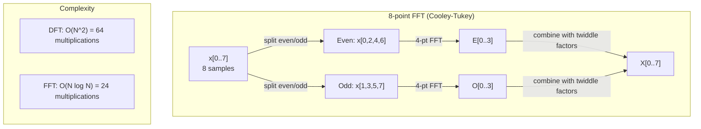
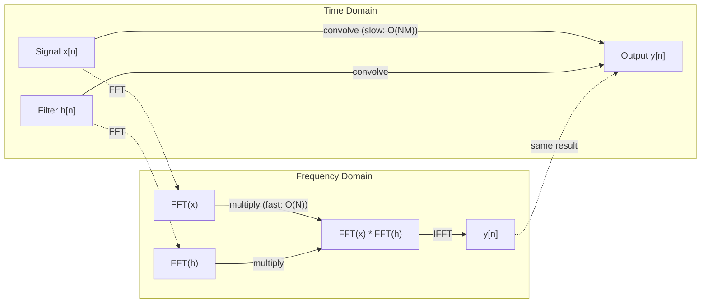

# تحويل فوريه

> كل إشارة هي تعليقات موجات الصناعي.

**Type:** Build
**Language:**بايثون
**Prerequisites:** Phase 1, Lessons 01-04, 19 (complex numbers)
**Time:** ~90 分钟

## 學习目标
- من التحقق من DFT،并使用 O(N log N) من كولي-توكي FFT 验证它
- فهم معايير التردد: من الإشارة إلى النطاق النطاق والمرحلة و الطيف الكهربائي
- تطبيق نظرية التخزين، من خلال مضاعفة FFT  تنفيذ التخزين
- سوف تتميز تدمير تردد فوريير مع ترانسفورمات التشفير الموضعي و CNN طبقات التحول

## 问题
段音频录音 هو سلسلة من القيم القياسية للضغط المتغيرة مع الوقت. الأسعار هي سلسلة من القيم القياسية حسب الترتيب السماوي. الصورة هي شبكة كثافة البيكسل في الفضاء.

ولكن العديد من الأنماط في مجال الزمن غير مرئية. هل هذه الإشارة الصوتية هي النغمة النقية أو التوت؟ هل يوجد دورة أسبوعية؟ هل هذه الصورة لها نسيج متكرر؟

تحويل فوريه سوف تحويل البيانات من مجال الزمن  إلى مجال الترددات‬‬‬‬‬‬‬‬‬‬‬‬‬‬‬‬‬‬‬‬‬‬‬‬‬‬‬‬‬‬‬‬‬‬‬‬‬‬‬‬‬‬‬‬‬‬‬‬‬‬‬‬‬‬‬‬‬‬‬‬‬‬‬‬‬‬‬‬‬‬‬‬‬‬‬‬‬‬‬‬‬‬‬‬‬‬‬‬‬‬‬‬‬‬‬‬‬‬‬‬‬‬‬‬‬‬‬‬‬‬‬‬‬‬‬‬‬‬‬‬‬‬‬‬‬‬‬‬‬‬‬‬‬‬‬‬‬‬‬‬‬‬‬‬‬‬‬‬‬‬‬‬‬‬‬‬‬‬‬‬‬‬‬‬‬‬‬‬‬‬‬‬‬‬‬‬‬‬‬‬‬‬‬‬‬‬‬‬‬‬‬‬‬‬‬‬‬‬‬‬‬‬‬‬‬‬‬‬‬‬‬‬‬‬‬‬‬‬‬‬‬‬‬‬‬‬‬‬‬‬‬‬‬‬‬‬‬‬‬‬‬‬‬‬‬‬‬‬‬‬‬‬‬‬‬‬‬‬‬‬‬‬‬‬‬‬‬‬‬‬‬‬‬‬‬‬‬‬‬‬‬‬‬‬‬‬‬‬‬‬‬‬‬‬‬‬‬‬‬‬‬‬‬‬‬‬‬‬‬‬‬‬‬‬‬‬‬‬‬‬‬‬‬‬‬‬‬‬‬‬‬‬‬‬‬‬‬‬‬‬‬‬‬‬‬‬‬‬‬‬‬‬‬‬‬‬‬‬‬‬‬‬‬‬‬‬‬‬‬‬‬‬‬‬‬‬‬‬‬‬‬‬‬‬‬‬‬‬‬‬‬‬‬‬‬‬‬‬‬‬‬‬‬‬‬‬‬‬‬‬‬‬‬‬‬‬‬‬‬‬‬‬‬‬‬‬‬‬‬‬‬‬‬‬‬‬‬‬‬‬‬‬‬‬‬‬‬‬‬‬‬‬‬‬‬‬‬‬‬‬‬‬‬‬‬‬‬‬‬‬‬‬‬‬‬‬‬‬‬‬‬‬‬‬‬‬‬‬

هذا بالنسبة إلى ML  مهم جداً ، لأن التفكير في مجال التردد 隨處可见。 الشبكات العصبية التطورية  تنفيذ التحول ، بينما التحول في مجال التردد هو النتيجة。 تحويل التشفيرات الموضعية استخدام التفكك التردد ‬ ‬ ‬ ‬ ‬ ‬ ‬ ‬ ‬ ‬ ‬ ‬ ‬ ‬ ‬ ‬ ‬ ‬ ‬ ‬ ‬ ‬ ‬ ‬ ‬ ‬ ‬ ‬ ‬ ‬ ‬ ‬ ‬ ‬ ‬ ‬ ‬ ‬ ‬ ‬ ‬ ‬ ‬ ‬ ‬ ‬ ‬ ‬ ‬ ‬ ‬ ‬ ‬ ‬ ‬ ‬ ‬ ‬ ‬ ‬ ‬ ‬ ‬ ‬ ‬ ‬ ‬ ‬ ‬ ‬ ‬ ‬ ‬ ‬ ‬ ‬ ‬ ‬ ‬ ‬ ‬ ‬ ‬ ‬ ‬ ‬ ‬ ‬ ‬ ‬ ‬ ‬ ‬ ‬ ‬ ‬ ‬ ‬ ‬ ‬ ‬ ‬ ‬ ‬ ‬ ‬ ‬ ‬ ‬ ‬ ‬ ‬ ‬ ‬ ‬ ‬ ‬ ‬ ‬ ‬ ‬ ‬ ‬ ‬ ‬ ‬ ‬ ‬ ‬ ‬ ‬ ‬ ‬ ‬ ‬ ‬ ‬ ‬ ‬ ‬ ‬ ‬ ‬ ‬ ‬ ‬ ‬ ‬ ‬ ‬ ‬ ‬ ‬ ‬ ‬ ‬ ‬ ‬ ‬ ‬ ‬ ‬ ‬ ‬ ‬ ‬ ‬ ‬ ‬ ‬ ‬ ‬ ‬ ‬ ‬ ‬ ‬ ‬ ‬ ‬ ‬ ‬ ‬ ‬ ‬ ‬ ‬ ‬ ‬ ‬ ‬ ‬ ‬ ‬ ‬ ‬ ‬ ‬ ‬ ‬ ‬ ‬ ‬ ‬ ‬ ‬ ‬ ‬ ‬ ‬ ‬ ‬ ‬ ‬ ‬ ‬ ‬ ‬ ‬ ‬

## 概念
### تعريف DFT

给定 N 个样本 x[0],x[1], ..., x[N-1],Discrete Fourier Transform 会生成 N 个频率系数 X[0],X[1], ...,X[N-1]:

```
X[k] = sum_{n=0}^{N-1} x[n] * e^(-2*pi*i*k*n/N)

for k = 0, 1, ..., N-1
```

كل X[k] هو عدد معقد. حجمها. X[k] أيضا يعبر عن عرض التردد k.

关键洞见:`e^(-2*pi*i*k*n/N)`هو فازور يدور في تردد k.DFT. يعد التواصل بين الإشارة و N 个等间隔频率. إذا كان الإشارة تحتوي على طاقة في تردد k، فإن التواصل كبير جدا.

### معنى كل عدد

**X[0]: DC component。**هذا هو مجموع جميع العينات، مع متوسط النسبة 成比例── يعبر عن ثابتة الإشارة ((صفر التردد) المُعاقبة──

```
X[0] = sum_{n=0}^{N-1} x[n] * e^0 = sum of all samples
```

**X[k] for 1 <= k <= N/2: positive frequencies。**X[k] يعبر عن كل نموذج من النقاط في الدورات الكلية.

**X[N/2]: Nyquist frequency。**هذا هو أعلى تردد يمكن أن يعرضه عينات N 个.

**X[k] for N/2 < k < N: negative frequencies。**بالنسبة للإشارات ذات القيمة الحقيقية، X[N-k] = conj(X[k])。 الترددات السلبية هي صور الإيجابية── هذا هو السبب في وجود المعلومات المفيدة في وسط معايير N/2 + 1 ‬‬‬‬‬‬‬‬‬‬‬‬‬‬‬‬‬‬‬‬‬‬‬‬‬‬‬‬‬‬‬‬‬‬‬‬‬‬‬‬‬‬‬‬‬‬‬‬‬‬‬‬‬‬‬‬‬‬‬‬‬‬‬‬‬‬‬‬‬‬‬‬‬‬‬‬‬‬‬‬‬‬‬‬‬‬‬‬‬‬‬‬‬‬‬‬‬‬‬‬‬‬‬‬‬‬‬‬‬‬‬‬‬‬‬‬‬‬‬‬‬‬‬‬‬‬‬‬‬‬‬‬‬‬‬‬‬‬‬‬‬‬‬‬‬‬‬‬‬‬‬‬‬‬‬‬‬‬‬‬‬‬‬‬‬‬‬‬‬‬‬‬‬‬‬‬‬‬‬‬‬‬‬‬‬‬‬‬‬‬‬‬‬‬‬‬‬‬‬‬‬‬‬‬‬‬‬‬‬‬‬‬‬‬‬‬‬‬‬‬‬‬‬‬‬‬‬‬‬‬‬‬‬‬‬‬‬‬‬‬‬‬‬‬‬‬‬‬‬‬‬‬‬‬‬‬‬‬‬‬‬‬‬‬‬‬‬‬‬‬‬‬‬‬‬‬‬‬‬‬‬‬‬‬‬‬‬‬‬‬‬‬‬‬‬‬‬‬‬‬‬‬‬‬‬‬‬‬‬‬‬‬‬‬‬‬‬‬‬‬‬‬‬‬‬‬‬‬‬‬‬‬‬‬‬‬‬‬‬‬‬‬‬‬‬‬‬‬‬‬‬‬‬‬‬‬‬‬‬‬‬‬‬‬‬‬‬‬‬‬‬‬‬‬‬‬‬‬‬‬‬‬‬‬‬‬‬‬‬‬‬‬‬‬‬‬‬‬‬‬‬‬‬‬‬‬‬‬‬‬‬‬‬‬‬‬‬‬‬‬‬‬‬‬‬‬‬‬‬‬‬‬‬‬‬‬‬‬‬‬‬‬‬‬‬‬‬‬‬‬‬‬‬

### الـ DFT العكس

عكس DFT تجمع من معايير التردد 重建原始信号:

```
x[n] = (1/N) * sum_{k=0}^{N-1} X[k] * e^(2*pi*i*k*n/N)

for n = 0, 1, ..., N-1
```

الفرق الوحيد بينها وبين DFT المقبلة هو: العضو وسط رمز لل正(ليس منخفض) ، ويكون هناك عامل تطبيع 1/N.

إن DFT العكسية هي إعادة بناء مثالية، ولا تفقد أي معلومات، يمكنك التحول من نطاق الزمن إلى نطاق التردد، والعودة مرة أخرى، دون أي خطأ.

### الـ (ف.إف.تي): جعل الأمر سريعاً

إذا حدد DFT هو O(N^2): لكل واحد من معايير الناتج N 个, يجب أن يكون على عينات المدخل N 求和── عندما N = 1 مليون 时, هذا هو 10^12 مرات العمليات──

سوف يتم تحويل فوريه سريع (FFT) باستخدام O  N log N) 计算同样结果──当 N = 1 مليون 时,这大约是20000000次操作,而不是10亿次──这使频率分析 变得可行──

خوارزمية كولي-توكي ((أسوأ شيوع في FFT) استخدام تقسيم والغزو:

1. سوف تفرق الإشارة إلى عينات متصفحة مساوية ومعينة متصفحة غير مساوية
2. 递归计算每一半的DFT──
3. استخدام "عاملات مزدوجة" e^(-2*pi*i*k/N) 合并两个 DFT نصف حجمها

```
X[k] = E[k] + e^(-2*pi*i*k/N) * O[k]          for k = 0, ..., N/2 - 1
X[k + N/2] = E[k] - e^(-2*pi*i*k/N) * O[k]    for k = 0, ..., N/2 - 1

where E = DFT of even-indexed samples
      O = DFT of odd-indexed samples
```

هذه التناظرة تعني أن كل طبقة من المرجعي تقوم بعمل O  N ، و هناك أيضاً علامة 2  N                                                                                                                                                                                                                                               



في الممارسة العملية، الإشارات عادة ما تكون صفر-مدخل إلى القادم 2 من──

### تحليل الطيف

**power spectrum**نعم، هو X [k] في^2، أي أن معدل كل تردد هو حجم مربعها.

**phase spectrum**هو الزاوية ((X[k]),也就是 كل تكرار من مراحل التكفيف.

```
Power at frequency k:  P[k] = |X[k]|^2 = X[k].real^2 + X[k].imag^2
Phase at frequency k:  phi[k] = atan2(X[k].imag, X[k].real)
```

### تحديد التردد

قرار تردد DFT يعتمد على عينات عدد N و معدل أخذ العينات fs。

```
Frequency of bin k:      f_k = k * fs / N
Frequency resolution:    delta_f = fs / N
Maximum frequency:       f_max = fs / 2  (Nyquist)
```

لتحديد ترددات قريبة جداً، تحتاج إلى المزيد من العينات، لتمسيق ترددات عالية، تحتاج إلى معدل أعلى من العينات.

### نظرية التخزين

هذه واحدة من أهم نتائج معالجة الإشارات، ويرتبط مباشرة مع سي أن إن.

**time domain 中的 convolution 等于 frequency domain 中的 pointwise multiplication。**

```
x * h = IFFT(FFT(x) . FFT(h))

where * is convolution and . is element-wise multiplication
```

لماذا هذا مهم:

- 两个长度为 N 和 M من الإشارات 直接 convolution 需要 O(N*M) العمليات。
- 基于 FFT 的卷曲 需要 O(N log N):تحويل 两者、乘、تحويل مرة أخرى‬
- بالنسبة للجذور الكبيرة، سوف تكون صيغة FFT سريعة.
- هذا ما يحدث في الطبقات المتحركة التي لديها مجالات استقبلية كبيرة

انتباه:DFT  حساب هو التخدير الدائري ((إشارة 会 لف حول) ・・・ بالنسبة للتخدير الخطى ((( بدون لف) ، يرجى في حساب قبل سوف تكون الإشارات صفر-باد إلى طول N + M - 1 ・・・



### النوافذ

إشارة DFT افتراضية هي دورية ، أي أن نضع عينات                                                                                                                                                                                                                                                      

في حسابات النوافذ، سوف يقلل الإشارة من النقطة إلى الصفر، مما يقلل من التسرب.

常见 نوافذ:

| Window | Shape | Main lobe width | Side lobe level | Use case |
|--------|-------|----------------|-----------------|----------|
| Rectangular | 平坦（无 window） | 最窄 | 最高 (-13 dB) | 当 signal 在 N 个 samples 中正好 periodic 时 |
| Hann | Raised cosine | 中等 | 低 (-31 dB) | 通用 spectral analysis |
| Hamming | Modified cosine | 中等 | 更低 (-42 dB) | Audio processing、speech analysis |
| Blackman | Triple cosine | 宽 | 非常低 (-58 dB) | 当 side lobe suppression 至关重要时 |

```
Hann window:    w[n] = 0.5 * (1 - cos(2*pi*n / (N-1)))
Hamming window: w[n] = 0.54 - 0.46 * cos(2*pi*n / (N-1))
```

قبل DFT ، سوف نستخدم نافذة مع إشارة جعل مضاعفة العنصر الحكيمة لنفذة:`X = DFT(x * w)`.

### خصائص DFT

| Property | Time Domain | Frequency Domain |
|----------|-------------|-----------------|
| Linearity | a*x + b*y | a*X + b*Y |
| Time shift | x[n - k] | X[f] * e^(-2*pi*i*f*k/N) |
| Frequency shift | x[n] * e^(2*pi*i*f0*n/N) | X[f - f0] |
| Convolution | x * h | X * H (pointwise) |
| Multiplication | x * h (pointwise) | X * H (circular convolution, scaled by 1/N) |
| Parseval's theorem | sum \|x[n]\|^2 | (1/N) * sum \|X[k]\|^2 |
| Conjugate symmetry (real input) | x[n] real | X[k] = conj(X[N-k]) |

نظرية بارسيفال تعبر عن الطاقة الإجمالية في مجالاتين متشابهة. الطاقة في عملية التحول.

### الاتصال مع التشفيرات الموضعية

المصدر الأصلي استخدام تشفيرات المواقع السينوسيدالية:

```
PE(pos, 2i)   = sin(pos / 10000^(2i/d_model))
PE(pos, 2i+1) = cos(pos / 10000^(2i/d_model))
```

كل واحد على الأبعاد (2i، 2i+1) يختلف في ترددات ترددها. ترددات من ارتفاع (أبعاد) 0.1) إلى انخفاض (أبعاد) في التنظيم الهندسية. هذا يجعل كل موقف في جميع فئات التردد لديه نمط فريد، مثل معايير فوريير كيفية التعرف على إشارة واحدة بشكل فريد.

وهي توفر خصائص رئيسية:

- **Uniqueness:**أي موقعين لن يكون لديهم نفس التشفير.
- **Bounded values:**و معنى ذلك
- **Relative position:**يمكن أن يعبر عن التشفير للوضع p 处 التشفير للعمل الخطى。 النموذج يمكن أن يتعلم التركيز على المواقع النسبية。

### اتصال مع قنوات سي إن إن

طبقة التحويل 通过在信号或图像 上滑动一个学习过器(核心),将将其应用到输入──数学上,这就是 التحويل العملية──

وفقاً لنظرية التخفيف، هذا يساوي:
1. لإنتاج المدخلات
2. لـ " النواة "
3. في مجال التردد مضاعفة
4. لنتائج تنفيذ IFFT

标准 CNN 实现使用直接 convolution(对小型3x3 kernels 更快) ・・・ ولكن بالنسبة للنواة الكبيرة أو التحويل العالمي، فإن طريقة FFT القائمة على FFT سوف تكون أكثر سرعة كبيرة. بعض الهندسة المعمارية (مثل FNet) تستخدم FFT بشكل كامل 替代 الاهتمام، في O(N log N) بدلا من O(N^2) تعقيد أسفل الحصول على دقة متنافسة.

### الطيفيات و تحويل فوريه قصير الوقت

فقط FFT سوف تعطى محتوى تردد الإشارة بأكملها، ولكن لا يمكن أن تخبرك هذه الترددات متى تظهر.‬‬‬‬‬‬‬‬‬‬‬‬‬‬‬‬‬‬‬‬‬‬‬‬‬‬‬‬‬‬‬‬‬‬‬‬‬‬‬‬‬‬‬‬‬‬‬‬‬‬‬‬‬‬‬‬‬‬‬‬‬‬‬‬‬‬‬‬‬‬‬‬‬‬‬‬‬‬‬‬‬‬‬‬‬‬‬‬‬‬‬‬‬‬‬‬‬‬‬‬‬‬‬‬‬‬‬‬‬‬‬‬‬‬‬‬‬‬‬‬‬‬‬‬‬‬‬‬‬‬‬‬‬‬‬‬‬‬‬‬‬‬‬‬‬‬‬‬‬‬‬‬‬‬‬‬‬‬‬‬‬‬‬‬‬‬‬‬‬‬‬‬‬‬‬‬‬‬‬‬‬‬‬‬‬‬‬‬‬‬‬‬‬‬‬‬‬‬‬‬‬‬‬‬‬‬‬‬‬‬‬‬‬‬‬‬‬‬‬‬‬‬‬‬‬‬‬‬‬‬‬‬‬‬‬‬‬‬‬‬‬‬‬‬‬‬‬‬‬‬‬‬‬‬‬‬‬‬‬‬‬‬‬‬‬‬‬‬‬‬‬‬‬‬‬‬‬‬‬‬‬‬‬‬‬‬‬‬‬‬‬‬‬‬‬‬‬‬‬‬‬‬‬‬‬‬‬‬‬‬‬‬‬‬‬‬‬‬‬‬‬‬‬‬‬‬‬‬‬‬‬‬‬‬‬‬‬‬‬‬‬‬‬‬‬‬‬‬‬‬‬‬‬‬‬‬‬‬‬‬‬‬‬‬‬‬‬‬‬‬‬‬‬‬‬‬‬‬‬‬‬‬‬‬‬‬‬‬‬‬‬‬‬‬‬‬‬‬‬‬‬‬‬‬‬‬‬‬‬‬‬‬‬‬‬‬‬‬‬‬‬‬‬‬‬‬‬‬‬‬‬‬‬‬‬‬‬‬‬‬‬‬‬‬‬‬‬‬‬‬‬‬‬‬‬‬‬‬‬‬‬‬‬‬‬‬‬‬‬‬‬‬‬‬‬‬

تحويل فوريه في الوقت القصير (STFT) 通過 فانسترات التداخل في الإشارة 上 حساب FFT لتحل هذه المشكلة. النتيجة هي عرضية: تمثيل ثنائي الأبعاد، أحد المحورات هو الوقت، والمحور الآخر هو التردد.

```
STFT procedure:
1. Choose a window size (e.g., 1024 samples)
2. Choose a hop size (e.g., 256 samples -- 75% overlap)
3. For each window position:
   a. Extract the windowed segment
   b. Apply a Hann/Hamming window
   c. Compute FFT
   d. Store the magnitude spectrum as one column of the spectrogram
```

المجموعات هي تقديم المدخلات القياسية لنماذج ML الصوتية. نماذج التعرف على الكلام.

### التعبير

إذا كان الإشارة 包含高于 fs/2 (تردد Nyquist) ، في معدل fs العينات سوف تنتج نسخة مستعارة.

```
Example:
  True signal: 90 Hz sine wave
  Sampling rate: 100 Hz
  Apparent frequency: 100 - 90 = 10 Hz

  The samples from the 90 Hz signal at 100 Hz sampling rate
  are identical to the samples from a 10 Hz signal.
  No amount of math can recover the original 90 Hz.
```

هذا هو السبب في أن محولات التناظر إلى الرقمي سوف تحتوي على مرشحات مكافحة التحالف ، في الاختبار قبل نقل عالية إلى ترددات Nyquist. في ML ، عندما لا يكون هناك تصفية منخفضة المدى المناسبة في خرائط الميزات عندما يتم خفض الاختبار ، ستظهر التحالف ؛ بعض الهندسة المعمارية تستخدم طبقات تجمع مكافحة التحالف لمعالجة هذه المشكلة.

### الصفر لا يزيد من التوصل إلى القرار

واحد من الأسوأ المعروف هو: في FFT قبل إشارة  إجراء إضافة الصفرة 会提升 تردد القرارات── انها لن تكون── صفر إضافة  مجرد بين القمامة الموجودة تردد  القيمة، جعل الطيف تبدو أكثر سلاسة── ولكن لا يمكن أن تكشف التفاصيل المترددة التي لا توجد في عينات الأصل──

إنّ قرار التردد الحقيقي يعتمد فقط على وقت الملاحظة T = N / fs‬‬‬‬‬‬‬‬‬‬‬‬‬‬‬‬‬‬‬‬‬‬‬‬‬‬‬‬‬‬‬‬‬‬‬‬‬‬‬‬‬‬‬‬‬‬‬‬‬‬‬‬‬‬‬‬‬‬‬‬‬‬‬‬‬‬‬‬‬‬‬‬‬‬‬‬‬‬‬‬‬‬‬‬‬‬‬‬‬‬‬‬‬‬‬‬‬‬‬‬‬‬‬‬‬‬‬‬‬‬‬‬‬‬‬‬‬‬‬‬‬‬‬‬‬‬‬‬‬‬‬‬‬‬‬‬‬‬‬‬‬‬‬‬‬‬‬‬‬‬‬‬‬‬‬‬‬‬‬‬‬‬‬‬‬‬‬‬‬‬‬‬‬‬‬‬‬‬‬‬‬‬‬‬‬‬‬‬‬‬‬‬‬‬‬‬‬‬‬‬‬‬‬‬‬‬‬‬‬‬‬‬‬‬‬‬‬‬‬‬‬‬‬‬‬‬‬‬‬‬‬‬‬‬‬‬‬‬‬‬‬‬‬‬‬‬‬‬‬‬‬‬‬‬‬‬‬‬‬‬‬‬‬‬‬‬‬‬‬‬‬‬‬‬‬‬‬‬‬‬‬‬‬‬‬‬‬‬‬‬‬‬‬‬‬‬‬‬‬‬‬‬‬‬‬‬‬‬‬‬‬‬‬‬‬‬‬‬‬‬‬‬‬‬‬‬‬‬‬‬‬‬‬‬‬‬‬‬‬‬‬‬‬‬‬‬‬‬‬‬‬‬‬‬‬‬‬‬‬‬‬‬‬‬‬‬‬‬‬‬‬‬‬‬‬‬‬‬‬‬‬‬‬‬‬‬‬‬‬‬‬‬‬‬‬‬‬‬‬‬‬‬‬‬‬‬‬‬‬‬‬‬‬‬‬‬‬‬‬‬‬‬‬‬‬‬‬‬‬‬‬‬‬‬‬‬‬‬‬‬‬‬‬‬‬‬‬‬‬‬‬‬‬‬‬‬‬‬‬‬‬‬‬‬‬‬‬‬‬‬‬‬‬‬‬‬‬‬‬‬‬‬‬‬‬‬‬‬


```figure
fourier-synthesis
```

## بناءها
### الخطوة 1: DFT من الصفر

O  N^2) DFT  مباشرة من تعريف

```python
import math

class Complex:
    ...

def dft(x):
    N = len(x)
    result = []
    for k in range(N):
        total = Complex(0, 0)
        for n in range(N):
            angle = -2 * math.pi * k * n / N
            w = Complex(math.cos(angle), math.sin(angle))
            xn = x[n] if isinstance(x[n], Complex) else Complex(x[n])
            total = total + xn * w
        result.append(total)
    return result
```

### 步骤 2: DFT العكسية

结构相同,المجرد 为正,并除以 N。

```python
def idft(X):
    N = len(X)
    result = []
    for n in range(N):
        total = Complex(0, 0)
        for k in range(N):
            angle = 2 * math.pi * k * n / N
            w = Complex(math.cos(angle), math.sin(angle))
            total = total + X[k] * w
        result.append(Complex(total.real / N, total.imag / N))
    return result
```

### 步骤 3: FFT (كولي-توكي)

التكرارية FFT 要求长度为 2 的──拆分为 even 和 odd,递归, ثم باستخدام عوامل الدوج 合并──

```python
def fft(x):
    N = len(x)
    if N <= 1:
        return [x[0] if isinstance(x[0], Complex) else Complex(x[0])]
    if N % 2 != 0:
        return dft(x)

    even = fft([x[i] for i in range(0, N, 2)])
    odd = fft([x[i] for i in range(1, N, 2)])

    result = [Complex(0)] * N
    for k in range(N // 2):
        angle = -2 * math.pi * k / N
        twiddle = Complex(math.cos(angle), math.sin(angle))
        t = twiddle * odd[k]
        result[k] = even[k] + t
        result[k + N // 2] = even[k] - t
    return result
```

### الخطوة 4: مساعدي تحليل الطيف

```python
def power_spectrum(X):
    return [xk.real ** 2 + xk.imag ** 2 for xk in X]

def convolve_fft(x, h):
    N = len(x) + len(h) - 1
    padded_N = 1
    while padded_N < N:
        padded_N *= 2

    x_padded = x + [0.0] * (padded_N - len(x))
    h_padded = h + [0.0] * (padded_N - len(h))

    X = fft(x_padded)
    H = fft(h_padded)

    Y = [xk * hk for xk, hk in zip(X, H)]

    y = idft(Y)
    return [y[n].real for n in range(N)]
```

## استخدمها
في العمل الحقيقي، باستخدام FFT من numpy، انها من قبل المكتبات C عاليا المثلى 支持──

```python
import numpy as np

signal = np.sin(2 * np.pi * 5 * np.arange(256) / 256)
spectrum = np.fft.fft(signal)
freqs = np.fft.fftfreq(256, d=1/256)

power = np.abs(spectrum) ** 2

positive_freqs = freqs[:len(freqs)//2]
positive_power = power[:len(power)//2]
```

لتحليل الطيف المتقدم للنوافذ:

```python
from scipy.signal import windows, stft

window = windows.hann(256)
windowed = signal * window
spectrum = np.fft.fft(windowed)
```

 بالنسبة للقلب:

```python
from scipy.signal import fftconvolve

result = fftconvolve(signal, kernel, mode='full')
```

بالنسبة للفئات الطيفية:

```python
from scipy.signal import stft

frequencies, times, Zxx = stft(signal, fs=sample_rate, nperseg=256)
spectrogram = np.abs(Zxx) ** 2
```

شكل المصفوفة المصفوفة هو (n_frequencies, n_time_frames)。 كل صف هو نافذة وقت واحدة فوق الطيف الطاقة。 هذا هو النماذج الصوتية ML 作为输入 消费的内容。

## 交付 it
运行 `code/fourier.py`生成 `outputs/prompt-spectral-analyzer.md`.

## التدريب
1. **Pure tone identification。**创建信号,其中包含单个阴影波 (不知频率(1到50Hz 之间) ,以128Hz采样1秒──使用你的DFT 识别频率──验证答案是否匹配──现在加入标准偏差为0.5的高斯噪音,并重复──噪音 如何影响频谱?

2. **FFT vs DFT verification。**生成一个长度为 64 随机信号――同时计算 DFT(O(N^2)) و FFT──验证所有系数在 1e-10 以内匹配──在长度为 256、512、1024 和 2048 信号 上分别计时两个函数──绘制 DFT时间与 FFT时间的比例──

3. **Convolution theorem proof by example。**创建信号 x = [1, 2, 3, 4, 0, 0, 0, 0] 和过 h = [1, 1, 1, 0, 0, 0, 0, 0]──直接计算它们的圆形卷曲 (圈圈)──然后通过FFT 计算(转换、乘、逆转转)──验证结果匹配──现在通过适当的零 执行线性卷曲──

4. **Windowing effects。**إنشاء إشارة، إنها 10 هرتز و 12 هرتز ((قريب جداً) موجات الصناعيين و ‬‬بإستعراض 128 هرتز 1 ثانية‬‬‬‬‬‬‬‬‬‬‬‬‬‬‬‬‬‬‬‬‬‬‬‬‬‬‬‬‬‬‬‬‬‬‬‬‬‬‬‬‬‬‬‬‬‬‬‬‬‬‬‬‬‬‬‬‬‬‬‬‬‬‬‬‬‬‬‬‬‬‬‬‬‬‬‬‬‬‬‬‬‬‬‬‬‬‬‬‬‬‬‬‬‬‬‬‬‬‬‬‬‬‬‬‬‬‬‬‬‬‬‬‬‬‬‬‬‬‬‬‬‬‬‬‬‬‬‬‬‬‬‬‬‬‬‬‬‬‬‬‬‬‬‬‬‬‬‬‬‬‬‬‬‬‬‬‬‬‬‬‬‬‬‬‬‬‬‬‬‬‬‬‬‬‬‬‬‬‬‬‬‬‬‬‬‬‬‬‬‬‬‬‬‬‬‬‬‬‬‬‬‬‬‬‬‬‬‬‬‬‬‬‬‬‬‬‬‬‬‬‬‬‬‬‬‬‬‬‬‬‬‬‬‬‬‬‬‬‬‬‬‬‬‬‬‬‬‬‬‬‬‬‬‬‬‬‬‬‬‬‬‬‬‬‬‬‬‬‬‬‬‬‬‬‬‬‬‬‬‬‬‬‬‬‬‬‬‬‬‬‬‬‬‬‬‬‬‬‬‬‬‬‬‬‬‬‬‬‬‬‬‬‬‬‬‬‬‬‬‬‬‬‬‬‬‬‬‬‬‬‬‬‬‬‬‬‬‬‬‬‬‬‬‬‬‬‬‬‬‬‬‬‬‬‬‬‬‬‬‬‬‬‬‬‬‬‬‬‬‬‬‬‬‬‬‬‬‬‬‬‬‬‬‬‬‬‬‬‬‬‬‬‬‬‬‬‬‬‬‬‬‬‬‬‬‬‬‬‬‬‬‬‬‬‬‬‬‬‬‬‬‬‬‬‬‬‬‬‬‬‬‬‬‬‬‬‬‬‬‬‬‬‬‬‬‬‬‬‬‬‬‬‬‬‬‬‬‬‬‬‬‬‬‬‬‬‬

5. **Positional encoding analysis。**نسبة d_model = 128 和 max_pos = 512 生成 سينوسايدال وضعية التشفيرات. على كل واحد من المواقع (p1, p2), حسابها التشفيرات من نقطة المنتج.

## 关键术语
| Term | What it means |
|------|---------------|
| DFT (Discrete Fourier Transform) | 将 N 个 time-domain samples 转换为 N 个 frequency-domain coefficients。每个 coefficient 都是与该 frequency 上 complex sinusoid 的 correlation |
| FFT (Fast Fourier Transform) | 用于计算 DFT 的 O(N log N) algorithm。Cooley-Tukey algorithm 递归拆分 even/odd indices |
| Inverse DFT | 从 frequency coefficients 重建 time-domain signal。公式与 DFT 相同，但 exponent sign 相反，并带有 1/N scaling |
| Frequency bin | DFT output 中的每个 index k 表示 frequency k*fs/N Hz。"bin" 是离散的 frequency slot |
| DC component | X[0]，zero-frequency coefficient。与 signal mean 成比例 |
| Nyquist frequency | fs/2，在 sampling rate fs 下可表示的最大 frequency。高于它的 frequencies 会 alias |
| Power spectrum | \|X[k]\|^2，每个 frequency coefficient 的 squared magnitude。显示 energy 在 frequencies 上的分布 |
| Phase spectrum | angle(X[k])，每个 frequency component 的 phase offset。在 analysis 中通常会忽略 |
| Spectral leakage | 将 non-periodic signal 当作 periodic 处理导致的虚假 frequency content。可通过 windowing 减少 |
| Window function | 在 DFT 前应用的 tapering function（Hann、Hamming、Blackman），用于减少 spectral leakage |
| Twiddle factor | FFT butterfly computation 中用于合并 sub-DFTs 的 complex exponential e^(-2*pi*i*k/N) |
| Convolution theorem | time domain 中的 convolution 等于 frequency domain 中的 pointwise multiplication。它是 signal processing 和 CNNs 的基础 |
| Circular convolution | signal 会 wrap around 的 convolution。这是 DFT 自然计算的内容 |
| Linear convolution | 没有 wraparound 的标准 convolution。通过在 DFT 前 zero-padding 实现 |
| Parseval's theorem | 总 energy 在 Fourier transform 中保持不变。sum \|x[n]\|^2 = (1/N) sum \|X[k]\|^2 |
| Aliasing | 当 sampling rate 不足时，高于 Nyquist 的 frequencies 表现为较低 frequencies |

## 延伸阅读
- [Cooley & Tukey: An Algorithm for the Machine Calculation of Complex Fourier Series (1965)](https://www.ams.org/journals/mcom/1965-19-090/S0025-5718-1965-0178586-1/)-  تغيير الحوسبة 论文
- [3Blue1Brown: But what is the Fourier Transform?](https://www.youtube.com/watch?v=spUNpyF58BY)- حول أفضل طريقة للتصور في تحويلات فوري
- [Lee-Thorp et al.: FNet: Mixing Tokens with Fourier Transforms (2021)](https://arxiv.org/abs/2105.03824)- في المحولات 中用 FFT بدل الاهتمام الذاتي
- [Smith: The Scientist and Engineer's Guide to Digital Signal Processing](http://www.dspguide.com/)- 免费在线教材,深入覆盖 FFT,窗户和光谱分析
- [Vaswani et al.: Attention Is All You Need (2017)](https://arxiv.org/abs/1706.03762)- من تشريحات التشغيل الموضعي السينوسيدال من تكوين تردد فوريير
- [Radford et al.: Whisper (2022)](https://arxiv.org/abs/2212.04356)- استخدام الميل-متفرقات  كتمثيل المدخلات التعرف على الكلام
