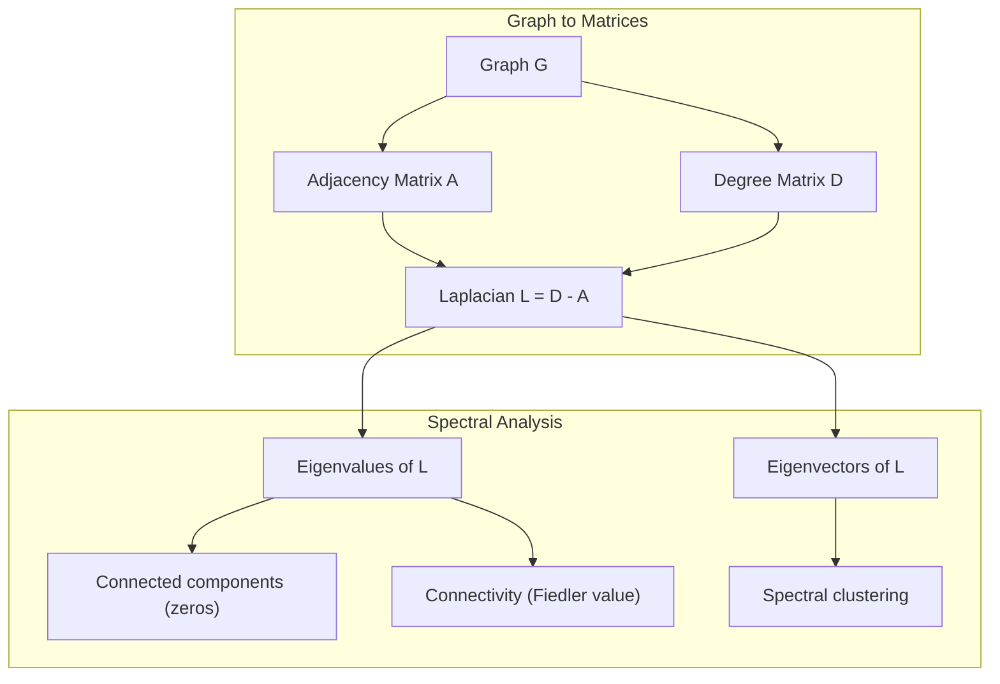
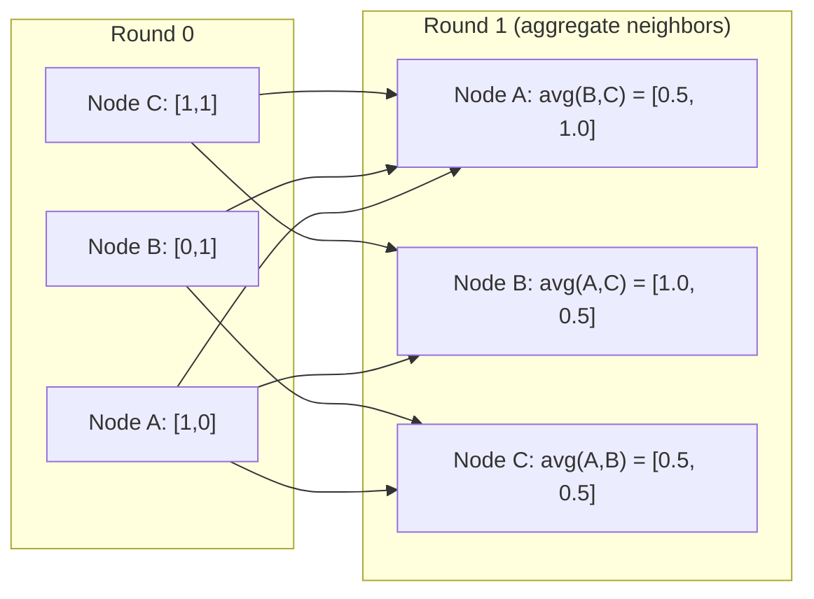

# 面向 آلة التعلم نظرية الرسومات

> الرسم البياني هو بنية البيانات العلاقة. إذا كانت البيانات الخاصة بك تحتوي على اتصال، فأنت بحاجة إلى نظرية الرسم البياني.

**Type:** Build
**Language:**بايثون
**Prerequisites:** Phase 1, Lessons 01-03（linear algebra, matrices）
**Time:** ~90 分钟

## 學习目标
- 构建一个图类,包含邻行矩阵/清单表示,并实现 BFS 和 DFS 遍历
- 计算 graph Laplacian,并使用其 eigenvalues 检测 متصلة المكونات 和对节点 聚类
- 将一轮 GNN 风格的消息传递 实现为正常化邻接矩阵乘法
- استخدام فيدلر المتجه  تطبيق التجميع الطيفي للفصل الرسم البياني

## 问题
الشبكات الاجتماعية والجزيئات قواعد المعرفة والشبكات الإقتباسية والخرائط السريعة هي الرسوم البيانية. التقليدية تعتبر المعلومات على شكل مسطح. كل سطر مستقل. كل صفة هي صف واحد. ولكن عندما تكون الهيكل المتصل مهمة، فإن الشكل قد يفقد صلاحيته.

考虑一个社交网络――你想预测某用户会购买什么产品――他们的购买历史很重要――但他们朋友的购买历史更重要――连接本身承载信号――

أو فكر في جزيء. أنت تفكر في التنبؤ ما إذا كان سيصبح مع بعض البروتين. الذرات. مهم جدا، ولكن المهم حقا هو كيفية الذرات تكلفت بعضها البعض.

شبكات العصبية الرسمية (GNNs) هي أسرع مجالات نمو في مجال التعلم العميق. أنها تدفع اكتشاف المخدرات والتوصيات الاجتماعية، وكشف الاحتيال، والنظرية الرسمية المعرفة. كل GNN تم بناءها على نفس الأساس: نظرية الرسم البياني الأساسية.

تحتاجين إلى أربعة أشياء:
1. 1- ستقوم الرسوم البيانية بتعبير المصفوفات بطريقة ((( بحيث يمكنك القيام بـ (بعد)
2. تستخدم لاستكشاف هيكل الرسم البياني خوارزميات التقاطع
3. (لابلاسي) ، هذه هي نظرية الرسومات الطيفية
4. إرسال الرسالة، هذا يجعل GNNs 工作的操作

## 概念
### الرسوم البيانية: العقد والحواف

واحد الرسم البياني G = (V, E) بواسطة العوائق (العقد) V 和 الحواف E 组成──每条 edge 连接两个节点──

**Directed vs undirected。**في الرسم البياني غير الموجّه، يُظهر الطرف (u, v) u 连接到 v، ويزيد v أيضاً يُصل إلى u── في الرسم البياني غير الموجّه، يُظهر الطرف (u, v) u 指向 v، ولكن في المقابل لا يُمكن أن يكون ذلك──

**Weighted vs unweighted。**في الرسم البياني غير الموزن، الحواف يجب أن تكون موجودة أو لا تكون موجودة. في الرسم البياني الموزن، كل حافة لديها وزن قياسي، مثل المسافة أو التكلفة أو القوة.

| Graph type | Example |
|-----------|---------|
| Undirected, unweighted | Facebook friendship network |
| Directed, unweighted | Twitter follow network |
| Undirected, weighted | Road map（distances） |
| Directed, weighted | Web page links（PageRank scores） |

### المصفوفة المجاورة

المصفوفة المجاورة A هو تعبير الأساسي.

```
A[i][j] = 1    if there is an edge from node i to node j
A[i][j] = 0    otherwise
```

بالنسبة للجرافات غير الموجزة، A هو متماثل: A[i][j] = A[j][i]。 بالنسبة للجرافات الموزعة، A[i][j] = وزن الحافة (i، j)。

**示例：一个 triangle：**

```
Nodes: 0, 1, 2
Edges: (0,1), (1,2), (0,2)

A = [[0, 1, 1],
     [1, 0, 1],
     [1, 1, 0]]
```

المصفوفة المجاورة هي كل إدخال من GNN.

### درجة

درجة العقدة هي متصلة إلى حوافها 数量── بالنسبة للجرافات الموجزة، لديك في درجة(حواف الدخول) والخارج درجة(حواف الخروج)──

المصفوفة D هي المقطع:

```
D[i][i] = degree of node i
D[i][j] = 0    for i != j
```

对于三角形示例:D = diag(2,2,2),因为 كل عقدة كانت متصلة إلى عقدتين أخرى.

الدرجة 告诉你节点的重要性──درجة عالية = عقدة العقدة──درجة توزيع شبكة 揭示了它的结构──شبكات اجتماعية 遵循 القوانين القوية(عدد قليل من العقدة، العديد من عقدة الورق)── الرسومات العشوائية 具有波يسون-موزع الدرجات──

### الـ BFS و الـ DFS

هناك قواعد إثنان لتجاوز الرسم البياني.

**Breadth-First Search (BFS)：**先探索所有邻居,再探索邻居的邻居──使用队列 (FIFO)──

```
BFS from node 0:
  Visit 0
  Queue: [1, 2]        (neighbors of 0)
  Visit 1
  Queue: [2, 3]        (add neighbors of 1)
  Visit 2
  Queue: [3]           (neighbors of 2 already visited)
  Visit 3
  Queue: []            (done)
```

BFS في الرسوم البيانية غير الموزعة تجد أقصر المسارات. المسافة من نقطة الوصول إلى أي عقدة. مثل هذا العقد. المستوى BFS التي تم اكتشافها للمرة الأولى. هذا هو السبب في استخدام BFS في الشبكات الاجتماعية.

**Depth-First Search (DFS)：**في العودة إلى الوراء قبل أن تكون قد دخلت إلى أعماقها.

```
DFS from node 0:
  Visit 0
  Stack: [1, 2]        (neighbors of 0)
  Visit 2               (pop from stack)
  Stack: [1, 3]         (add neighbors of 2)
  Visit 3               (pop from stack)
  Stack: [1]
  Visit 1               (pop from stack)
  Stack: []             (done)
```

DFS يمكن استخدامها:
- 查找 متصلة المكونات ((从未访问的节点 运行 DFS)
- اكتشاف الدورة ((شجرة DFS 中的后边)
- التنظيم الترتيبي الترتيبي الترتيبي الترتيبي الترتيبي الترتيبي الترتيبي الترتيبي الترتيبي الترتيبي الترتيبي الترتيبي الترتيبي الترتيبي الترتيبي الترتيبي الترتيبي الترتيبي الترتيبي الترتيبي الترتيبي الترتيبي الترتيبي الترتيبي الترتيبي الترتيبي الترتيبي الترتيبي الترتيبي الترتيبي الترتيبي الترتيبي الترتيبي الترتيبي الترتيبي الترتيبي الترتيبي الترتيبي الترتيبي الترتيبي الترتيبي الترتيبي الترتيبي الترتيبي الترتيبييبي الترتيبي الترتيبي الترتيبي الترتيبييبي الترتيبييبي الترتيبي الترتيبييبي الترتيبييبي الترتيبييبي الترتيبي الترتيبييبي الترتيبي الترتيبي الترتيبي الترتيبي الترتيبي الترتيبي الترتيبي الترتيبي الترتيبي الترتيبي الترتيبي الترتيبي الترتيبي الترتيبي الترتيبي الترتيبي الترتيبي الترتيبي الترتيبي الترتيبي الترتيبي الترتيبي الترتيبي الترتيبي الترتيبي الترتيبي الترتيبي الترتيبي الترتية الترتيبي الترتيبي الترتيبي الترتيبي الترت الترتيبي الترت الترتيبي الترتيبي الترتيبي الترت الترتيبي الترت الترتيبي الترت الترتيبية الترتيبية

| Algorithm | Data structure | Finds | Use case |
|-----------|---------------|-------|----------|
| BFS | Queue | Shortest paths | Social network distance, knowledge graph traversal |
| DFS | Stack | Components, cycles | Connectivity, topological sort |

### الرسم البياني لابلاسي

L = D - A。 نظرية الرسوم البياني الطيفية 中最重要的矩阵。

بالنسبة للمثلث:

```
D = [[2, 0, 0],    A = [[0, 1, 1],    L = [[2, -1, -1],
     [0, 2, 0],         [1, 0, 1],         [-1, 2, -1],
     [0, 0, 2]]         [1, 1, 0]]         [-1, -1,  2]]
```

اللابلاسي 具有非常重要的性质:

1. **L 是 positive semi-definite。**جميع القيم الخاصة كانت >= 0

2. **zero eigenvalues 的数量等于 connected components 的数量。**واحد من الرسوم البيانية المتصلة 恰好 أن هناك قيمة خاصة صفر ∙ واحد من 3 مكونات منفصلة من الرسوم البيانية لديه ثلاثة قيم خاصة صفر ∙

3. **最小的 non-zero eigenvalue（Fiedler value）衡量 connectivity。**较大的Fiedler值表示图 连接良好──较小的Fiedler值表示图 有一个薄弱点,也就是瓶──

4. **Fiedler value 的 eigenvector（Fiedler vector）揭示最佳切分。**值为正的节点 进入一组,值为负的节点 进入另一组──这就是光谱集群──



### الخصائص المتطرفة

يمكن أن تكشف قيم المصفوفة المجاورة و قيمها الخاصة لبلاتسي في حالة عدم القيام بأي عبورات

**Spectral clustering**عن طريق العمل على النحو التالي:
1. 计算 لابلاسي L
2. 找到 L 的 k 个最小 eigenvectors(跳过第一个; بالنسبة للصفحات المتصلة ، فإنه هو全 1)
3. استخدام هذه المتجهات الخاصة كمركز جديد لكل عقدة
4. في هذه المراكز تعمل ك-معنى

لماذا هذا فعال؟ L من الجهازات الفعلية 编码图 上最平滑的函数──连接良好的节点会得到相似的 eigenvector值──被瓶分离的节点会得到不同的值──eigenvectors会自然地分离集群──

**Random walk connection。**الطبيعية لابلاسي مع الرسم البياني 上的随机行走 有关──随机行走的静止分布 与节点程度 成比例──混合时间(行走 收得有多快)取决于光谱差距──

### إرسال الرسالة

هذا هو العملية الأساسية للشبكات العصبية الرسمية. كل عقد من جيرانه يجمع الرسائل، ويمجمعه، ثم يجدد حالته.

```
h_v^(k+1) = UPDATE(h_v^(k), AGGREGATE({h_u^(k) : u in neighbors(v)}))
```

في أبسط الصيغة، الجمع = المتوسط، تحديث = تحويل خطي + تفعيل:

```
h_v^(k+1) = sigma(W * mean({h_u^(k) : u in neighbors(v)}))
```

هذا هو في الواقع مزيف في شكل آخر من أشكال مضاعفة المصفوفة. إذا H هو المصفوفة من جميع عناصر العقدة، A هو المصفوفة المجاورة:

```
H^(k+1) = sigma(A_norm * H^(k) * W)
```

من بينها A_norm هي المصفوفة المجاورة المعتادة (((

واحد دورة الرسالة المرور 让每个节点 看到它的邻居......两轮让它看到邻居的邻居――K 轮让每个节点 获得来自其K-hop社区的信息――



### 概念与 ML 应用

| Concept | ML Application |
|---------|---------------|
| Adjacency matrix | GNN input representation |
| Graph Laplacian | Spectral clustering, community detection |
| BFS/DFS | Knowledge graph traversal, path finding |
| Degree distribution | Node importance, feature engineering |
| Message passing | GNN layers (GCN, GAT, GraphSAGE) |
| Eigenvalues of L | Community detection, graph partitioning |
| Spectral clustering | Unsupervised node grouping |
| PageRank | Node importance, web search |


```figure
graph-degree-distribution
```

## بناءها
### الخطوة الأولى: من الصفر إلى التنفيذ الرسم البياني

```python
class Graph:
    def __init__(self, n_nodes, directed=False):
        self.n = n_nodes
        self.directed = directed
        self.adj = {i: {} for i in range(n_nodes)}

    def add_edge(self, u, v, weight=1.0):
        self.adj[u][v] = weight
        if not self.directed:
            self.adj[v][u] = weight

    def neighbors(self, node):
        return list(self.adj[node].keys())

    def degree(self, node):
        return len(self.adj[node])

    def adjacency_matrix(self):
        import numpy as np
        A = np.zeros((self.n, self.n))
        for u in range(self.n):
            for v, w in self.adj[u].items():
                A[u][v] = w
        return A

    def degree_matrix(self):
        import numpy as np
        D = np.zeros((self.n, self.n))
        for i in range(self.n):
            D[i][i] = self.degree(i)
        return D

    def laplacian(self):
        return self.degree_matrix() - self.adjacency_matrix()
```

قائمة المجاورة`self.adj`يمكن أن تكون متراكمة في المصفوفة المجاورة، لأن جميع العمليات الطيفية تحتاج إليها.

### 步骤 2: BFS و DFS

```python
from collections import deque

def bfs(graph, start):
    visited = set()
    order = []
    distances = {}
    queue = deque([(start, 0)])
    visited.add(start)
    while queue:
        node, dist = queue.popleft()
        order.append(node)
        distances[node] = dist
        for neighbor in graph.neighbors(node):
            if neighbor not in visited:
                visited.add(neighbor)
                queue.append((neighbor, dist + 1))
    return order, distances


def dfs(graph, start):
    visited = set()
    order = []
    stack = [start]
    while stack:
        node = stack.pop()
        if node in visited:
            continue
        visited.add(node)
        order.append(node)
        for neighbor in reversed(graph.neighbors(node)):
            if neighbor not in visited:
                stack.append(neighbor)
    return order
```

BFS استخدام deque(مرة نهاية مزدوجة) لتحقيق O(1) popleft。DFS استخدام القائمة 作为 stack。两者都会恰好访问每个节点 一次,时间复杂度为 O(V + E)。

### 步骤 3:المكونات المتصلة و القيم الخاصة اللابلاكية

```python
def connected_components(graph):
    visited = set()
    components = []
    for node in range(graph.n):
        if node not in visited:
            order, _ = bfs(graph, node)
            visited.update(order)
            components.append(order)
    return components


def laplacian_eigenvalues(graph):
    import numpy as np
    L = graph.laplacian()
    eigenvalues = np.linalg.eigvalsh(L)
    return eigenvalues
```

`eigvalsh`يستخدم المصفوفات التوافقية، بينما لابلاسيون للخطوط غير الموجزة دائما متوافقة. فإنه يعود حسب الترتيب إلى القيم الخاصة.

### الخطوة 4: التجميع المتطويع

```python
def spectral_clustering(graph, k=2):
    import numpy as np
    L = graph.laplacian()
    eigenvalues, eigenvectors = np.linalg.eigh(L)
    features = eigenvectors[:, 1:k+1]

    labels = np.zeros(graph.n, dtype=int)
    for i in range(graph.n):
        if features[i, 0] >= 0:
            labels[i] = 0
        else:
            labels[i] = 1
    return labels
```

بالنسبة k=2, سيتم تقسيم الرسم البياني إلى مجموعتين. بالنسبة k>2, سوف تكون في الجهاز المباشر.

### 步骤 5: إرسال الرسالة

```python
def message_passing(graph, features, weight_matrix):
    import numpy as np
    A = graph.adjacency_matrix()
    row_sums = A.sum(axis=1, keepdims=True)
    row_sums[row_sums == 0] = 1
    A_norm = A / row_sums
    aggregated = A_norm @ features
    output = aggregated @ weight_matrix
    return output
```

هذه هي جولة من إرسال رسائل GNN. الميزات الجديدة لكل عقدة هي المتوسط الموزن لميزات جيرانها، ثم تمر عبر المصفوفة الوزنية.

## استخدمها
استخدام شبكةx و numpy، نفس العملية هي واحدة خط:

```python
import networkx as nx
import numpy as np

G = nx.karate_club_graph()

A = nx.adjacency_matrix(G).toarray()
L = nx.laplacian_matrix(G).toarray()

eigenvalues = np.linalg.eigvalsh(L.astype(float))
print(f"Smallest eigenvalues: {eigenvalues[:5]}")
print(f"Connected components: {nx.number_connected_components(G)}")

communities = nx.community.greedy_modularity_communities(G)
print(f"Communities found: {len(communities)}")

pr = nx.pagerank(G)
top_nodes = sorted(pr.items(), key=lambda x: x[1], reverse=True)[:5]
print(f"Top 5 PageRank nodes: {top_nodes}")
```

يمكن استخدام شبكة x من خلال تحسين الخلفيات C  معالجة الرسوم البيانية من أي حجم  في الإنتاج استخدامها  باستخدام نسخة من الصفر للفهم ما الذي يفعله 

### تحليل الطيف النمبي

```python
import numpy as np

A = np.array([
    [0, 1, 1, 0, 0],
    [1, 0, 1, 0, 0],
    [1, 1, 0, 1, 0],
    [0, 0, 1, 0, 1],
    [0, 0, 0, 1, 0]
])

D = np.diag(A.sum(axis=1))
L = D - A

eigenvalues, eigenvectors = np.linalg.eigh(L)
print(f"Eigenvalues: {np.round(eigenvalues, 4)}")
print(f"Fiedler value: {eigenvalues[1]:.4f}")
print(f"Fiedler vector: {np.round(eigenvectors[:, 1], 4)}")

fiedler = eigenvectors[:, 1]
group_a = np.where(fiedler >= 0)[0]
group_b = np.where(fiedler < 0)[0]
print(f"Cluster A: {group_a}")
print(f"Cluster B: {group_b}")
```

متجهات Fiedler 承担了主要工作──正值条目位于一个集群,负值条目位于另一个集群──不需要循环优化,只需要一次自构──

## 交付 it
本课产出:
- `outputs/skill-graph-analysis.md`: تستخدم لتحليل البيانات المهيكلة على الرسم البياني

## العلاقات

| Concept | Where it shows up |
|---------|------------------|
| Adjacency matrix | GCN, GAT, GraphSAGE input |
| Laplacian | Spectral clustering, ChebNet filters |
| BFS | Knowledge graph traversal, shortest path queries |
| Message passing | Every GNN layer, neural message passing |
| Spectral gap | Graph connectivity, mixing time of random walks |
| Degree distribution | Power-law networks, node feature engineering |
| Connected components | Preprocessing, handling disconnected graphs |
| PageRank | Node importance ranking, attention initialization |

تستخدم GNNs 值得特别说明──GCN(Kipf & Welling, 2017) في عملية تحويل الرسم البياني استخدام إضافة المصفوفة المجاورة للطواق الذاتية، A_hat = A + I:

```text
H^(l+1) = sigma(D_hat^(-1/2) * A_hat * D_hat^(-1/2) * H^(l) * W^(l))
```

بينها A_hat = A + I(adjacency加 self-loops) ، D_hat هو A_hat من المصفوفات الدرجة。 self-loops  ضمان كل عقدة في عملية التجميع  包含 خصائصها  هذا هو مع وجود التطبيع التناظرية من خلال إرسال الرسالة──D_hat^(-1/2) * A_hat * D_hat^(-1/2) هو المصفوفة التناظرية المعتادة──Laplacian ظهرت هنا، لأن هذا التطبيع مع L_sym = I - D^(-1/2) * A * D^(-1/2) 相关── فهم Laplacian،就 يعني فهم GCNs لماذا فعال.

## التدريب
1. **从零实现 PageRank。**من نقاط متساوية 开始──每一步:score(v) = (1-d) / n + d * sum(score(u) /out_degree(u)), من بينها u 是所有指向 v 的节点──使用 d=0.85──运行直到收(改变 < 1e-6)──在一个小型网页图 上测试──

2. **使用 spectral clustering 查找 communities。**创建图包含两个明显分离集群的图表 (على سبيل المثال، اثنين من النصائح 通过一条边缘 连接) 运行 الطيفية التجميع،并验证它能找到正确分──当你添加更多跨集群边缘 时会发生什么?

3. **为 weighted graphs 中的 shortest paths 实现 Dijkstra's algorithm。**في نفس الرسم البياني من أوزان متساوية، ستنتج النتيجة مقارنة مع BFS

4. **构建一个 2-layer message passing network。**استخدام مختلف المصفوفات الوزن 应用两次消息传递──展示经过2轮后,每个节都拥有来自其2hop社区的信息──

5. **分析一个真实世界 graph。**استخدام الرسم البياني لـ Karate Club ((34 عقدة، 78 حافة)  حساب التوزيع الدرجة、قيم خاصة لابلاسي و التجميع الطيفي。 سوف يتم تجميع الطيفي ‬

## 关键术语
| Term | What people say | What it actually means |
|------|----------------|----------------------|
| Graph | “Nodes and edges” | 一种数学结构 G=(V,E)，用于编码 pairwise relationships |
| Adjacency matrix | “The connection table” | 一个 n x n matrix，其中如果 nodes i 和 j 相连，则 A[i][j] = 1 |
| Degree | “一个 node 有多 connected” | 接触某个 node 的 edges 数量 |
| Laplacian | “D minus A” | L = D - A，其 eigenvalues 会揭示 graph structure 的 matrix |
| Fiedler value | “The algebraic connectivity” | L 的最小 non-zero eigenvalue，用于衡量 graph 连接得有多好 |
| BFS | “Level-by-level search” | 在深入之前先访问所有 neighbors 的 traversal，可找到 shortest paths |
| DFS | “Go deep first” | 在回溯之前沿一条 path 走到末端的 traversal |
| Message passing | “Nodes talk to neighbors” | 每个 node 从其 neighbors 聚合信息，这是 GNNs 的核心 |
| Spectral clustering | “Cluster by eigenvectors” | 使用 graph 的 Laplacian 的 eigenvectors 来划分 graph |
| Connected component | “A separate piece” | 一个 maximal subgraph，其中每个 node 都能到达其他每个 node |

## 延伸阅读
- **Kipf & Welling (2017)**:التصنيف شبه المشرف مع شبكات تحويل الرسومات‬‬‬‬‬‬‬‬‬‬‬‬‬‬‬‬‬‬‬‬‬‬‬‬‬‬‬‬‬‬‬‬‬‬‬‬‬‬‬‬‬‬‬‬‬‬‬‬‬‬‬‬‬‬‬‬‬‬‬‬‬‬‬‬‬‬‬‬‬‬‬‬‬‬‬‬‬‬‬‬‬‬‬‬‬‬‬‬‬‬‬‬‬‬‬‬‬‬‬‬‬‬‬‬‬‬‬‬‬‬‬‬‬‬‬‬‬‬‬‬‬‬‬‬‬‬‬‬‬‬‬‬‬‬‬‬‬‬‬‬‬‬‬‬‬‬‬‬‬‬‬‬‬‬‬‬‬‬‬‬‬‬‬‬‬‬‬‬‬‬‬‬‬‬‬‬‬‬‬‬‬‬‬‬‬‬‬‬‬‬‬‬‬‬‬‬‬‬‬‬‬‬‬‬‬‬‬‬‬‬‬‬‬‬‬‬‬‬‬‬‬‬‬‬‬‬‬‬‬‬‬‬‬‬‬‬‬‬‬‬‬‬‬‬‬‬‬‬‬‬‬‬‬‬‬‬‬‬‬‬‬‬‬‬‬‬‬‬‬‬‬‬‬‬‬‬‬‬‬‬‬‬‬‬‬‬‬‬‬‬‬‬‬‬‬‬‬‬‬‬‬‬‬‬‬‬‬‬‬‬‬‬‬‬‬‬‬‬‬‬‬‬‬‬‬‬‬‬‬‬‬‬‬‬‬‬‬‬‬‬‬‬‬‬‬‬‬‬‬‬‬‬‬‬‬‬‬‬‬‬‬‬‬‬‬‬‬‬‬‬‬‬‬‬‬‬‬‬‬‬‬‬‬‬‬‬‬‬‬‬‬‬‬‬‬‬‬‬‬‬‬‬‬‬‬‬‬‬‬‬‬‬‬‬‬‬‬‬‬‬‬‬‬‬‬‬‬‬‬‬‬‬‬‬‬‬‬‬‬‬‬‬‬‬‬‬‬‬‬‬‬‬‬‬‬‬‬‬‬‬‬‬‬‬‬‬‬‬‬‬‬‬‬‬‬‬‬‬‬‬‬‬‬‬‬‬‬‬‬‬‬‬
- **Spielman (2012)**: نظرية الرسم البياني المتطرفة ملاحظات المحاضرة‬ حول Laplacians‬ الفجوات المتطرفة 和 تقسيم الرسم البياني‬
- **Hamilton (2020)**:تعلم تمثيل الرسم البياني‬‬‬‬‬‬‬‬‬‬‬‬‬‬‬‬‬‬‬‬‬‬‬‬‬‬‬‬‬‬‬‬‬‬‬‬‬‬‬‬‬‬‬‬‬‬‬‬‬‬‬‬‬‬‬‬‬‬‬‬‬‬‬‬‬‬‬‬‬‬‬‬‬‬‬‬‬‬‬‬‬‬‬‬‬‬‬‬‬‬‬‬‬‬‬‬‬‬‬‬‬‬‬‬‬‬‬‬‬‬‬‬‬‬‬‬‬‬‬‬‬‬‬‬‬‬‬‬‬‬‬‬‬‬‬‬‬‬‬‬‬‬‬‬‬‬‬‬‬‬‬‬‬‬‬‬‬‬‬‬‬‬‬‬‬‬‬‬‬‬‬‬‬‬‬‬‬‬‬‬‬‬‬‬‬‬‬‬‬‬‬‬‬‬‬‬‬‬‬‬‬‬‬‬‬‬‬‬‬‬‬‬‬‬‬‬‬‬‬‬‬‬‬‬‬‬‬‬‬‬‬‬‬‬‬‬‬‬‬‬‬‬‬‬‬‬‬‬‬‬‬‬‬‬‬‬‬‬‬‬‬‬‬‬‬‬‬‬‬‬‬‬‬‬‬‬‬‬‬‬‬‬‬‬‬‬‬‬‬‬‬‬‬‬‬‬‬‬‬‬‬‬‬‬‬‬‬‬‬‬‬‬‬‬‬‬‬‬‬‬‬‬‬‬‬‬‬‬‬‬‬‬‬‬‬‬‬‬‬‬‬‬‬‬‬‬‬‬‬‬‬‬‬‬‬‬‬‬‬‬‬‬‬‬‬‬‬‬‬‬‬‬‬‬‬‬‬‬‬‬‬‬‬‬‬‬‬‬‬‬‬‬‬‬‬‬‬‬‬‬‬‬‬‬‬‬‬‬‬‬‬‬‬‬‬‬‬‬‬‬‬‬‬‬‬‬‬‬‬‬‬‬‬‬‬‬‬‬‬‬‬‬‬‬‬‬‬‬‬‬‬‬‬‬‬‬‬‬‬‬‬‬‬‬‬‬‬‬‬‬‬‬‬‬‬‬‬‬‬‬‬‬‬‬‬‬‬‬‬‬‬‬‬‬‬‬‬‬‬
- **Bronstein et al. (2021)**:التعلم العميق الجغرافي: الشبكات والجماعات والرسوم البيانية والجيوديسيك والمقاييس.
- **Veličković et al. (2018)**:شبكات الاهتمام الرسمية‬‬‬‬‬‬‬‬‬‬‬‬‬‬‬‬‬‬‬‬‬‬‬‬‬‬‬‬‬‬‬‬‬‬‬‬‬‬‬‬‬‬‬‬‬‬‬‬‬‬‬‬‬‬‬‬‬‬‬‬‬‬‬‬‬‬‬‬‬‬‬‬‬‬‬‬‬‬‬‬‬‬‬‬‬‬‬‬‬‬‬‬‬‬‬‬‬‬‬‬‬‬‬‬‬‬‬‬‬‬‬‬‬‬‬‬‬‬‬‬‬‬‬‬‬‬‬‬‬‬‬‬‬‬‬‬‬‬‬‬‬‬‬‬‬‬‬‬‬‬‬‬‬‬‬‬‬‬‬‬‬‬‬‬‬‬‬‬‬‬‬‬‬‬‬‬‬‬‬‬‬‬‬‬‬‬‬‬‬‬‬‬‬‬‬‬‬‬‬‬‬‬‬‬‬‬‬‬‬‬‬‬‬‬‬‬‬‬‬‬‬‬‬‬‬‬‬‬‬‬‬‬‬‬‬‬‬‬‬‬‬‬‬‬‬‬‬‬‬‬‬‬‬‬‬‬‬‬‬‬‬‬‬‬‬‬‬‬‬‬‬‬‬‬‬‬‬‬‬‬‬‬‬‬‬‬‬‬‬‬‬‬‬‬‬‬‬‬‬‬‬‬‬‬‬‬‬‬‬‬‬‬‬‬‬‬‬‬‬‬‬‬‬‬‬‬‬‬‬‬‬‬‬‬‬‬‬‬‬‬‬‬‬‬‬‬‬‬‬‬‬‬‬‬‬‬‬‬‬‬‬‬‬‬‬‬‬‬‬‬‬‬‬‬‬‬‬‬‬‬‬‬‬‬‬‬‬‬‬‬‬‬‬‬‬‬‬‬‬‬‬‬‬‬‬‬‬‬‬‬‬‬‬‬‬‬‬‬‬‬‬‬‬‬‬‬‬‬‬‬‬‬‬‬‬‬‬‬‬‬‬‬‬‬‬‬‬‬‬‬‬‬‬‬‬‬‬‬‬‬‬‬‬‬‬‬‬‬‬‬‬‬‬‬‬‬‬‬‬‬‬‬‬‬‬‬‬‬‬‬‬‬‬‬‬‬‬‬‬‬
