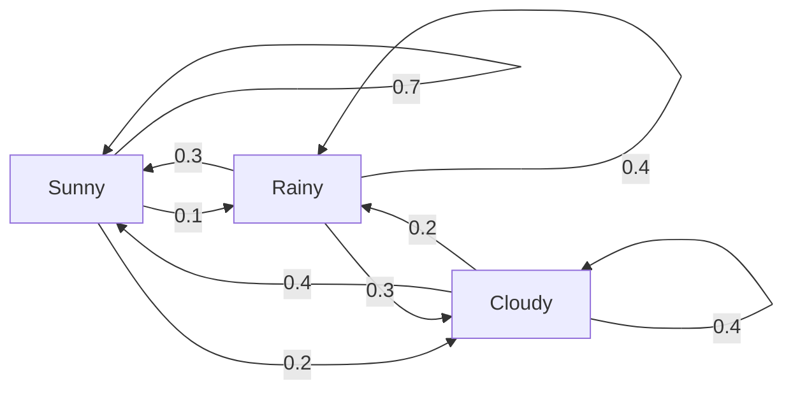
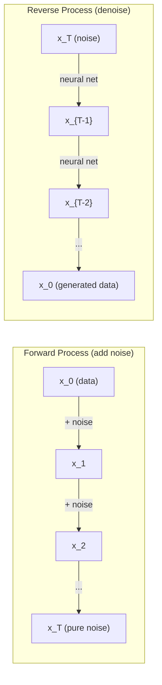

# العمليات الستوكاستية

> 具有结构的随机性──随机走行、马尔科夫链 和 انتشار النماذج 背后的数学──

**Type:** Learn
**Language:**بايثون
**Prerequisites:** Phase 1, Lessons 06-07（probability, Bayes）
**Time:** ~75 分钟

## 學习目标
- 模拟 1D 和 2D عشوائية المشي،并验证位移的平方(n) 缩放规律
- 构建 Markov chain 模拟器,并通过自身组合 计算其静止分布
- 实现 متروبوليس-هاستينغز MCMC و لنجفين الديناميكيات، للاستخدام من الهدف التوزيع
- سوف نصل إلى عملية التوزيع إلى الأمام مع حركة براونية، ونفس عملية العكس كيفية توليد البيانات

## 问题
العديد من أنظمة الذكاء الاصطناعي تتعلق بالشكل التطوري مع مرور الوقت، وليس بالشكل الحالي، بل بالشكل المهيكلي، والتي تعتمد كل خطوة على ما حدث من قبل.

نموذج اللغة أحياناً تخلق رمز. كل رمز يعتمد على السياق المباشر. النموذج يخرج توزيع احتمالي، من بين الاستخدام، ثم يستمر.

نماذج الانتشار  تدريجيا نحو الصورة إضافة الضجيج، حتى يصبح صوتاً صريحاً.

وكلاء التعلم المُعزز يتخذون إجراءات في البيئة. كل إجراء يؤدي إلى حالة جديدة باحتمالٍ ما. وكيل في عالمٍ متوافق يتبع سياسة متوافقة.

العينات MCMC هي ركيزة استنتاج بايزي، وهي تشكل سلسلة ماركوف، وتوزيعها الثابت هو

كل هذا مبني على أربعة أفكار أساسية:
1. المشي عشوائي  أسهل عملية استوكاستية
2. سلسلة ماركوف  带有过渡矩阵的结构化随机性
3. ديناميكيّة لانجفين  带噪声的渐进下降
4. "ميتروبوليس-هستنغز"

## 概念
### المشي العشوائي

من موقع 0 开始── كل خطوة،抛一枚公平硬币──正面:向右移动(+1)──反面:向左移动(-1)──

بعد مرور n 步骤, موقعك هو n 个随机 +/-1 值的总和──期望位置是 0(هذا المشي هو غير متحيزة)──لكن المسافة من النقطة الأصلية هو المسافة المتوقعة من حيث مربع(n) 增长──

هذا هناك نقطة ضد الهواء. هذا المشي عادلاً، لا يوجد أي انحدار في الاتجاهين. ولكن مع مرور الوقت، فإنه سوف يتوقف عن نقطة الظهور ويتباعد بعيداً.

```
Step 0:  Position = 0
Step 1:  Position = +1 or -1
Step 2:  Position = +2, 0, or -2
...
Step 100: Expected distance from origin ~ 10 (sqrt(100))
Step 10000: Expected distance from origin ~ 100 (sqrt(10000))
```

**在 2D 中**,المشي 以相等概率向上、向下、向左或向右移动── المسافة من النقطة الأصلية تتبع أيضاً قواعد التكفيض.

**为什么是 sqrt(n)？**كل خطوة في الصورة هي على الأرجح +1 أو -1──n 步后, موقع S_n = X_1 + X_2 + ... + X_n, من بينها كل X_i 都是 +/-1── كل خطوة من التباين هو 1, وكل خطوة مستقلة عن بعضها البعض, لذلك Var(S_n) = n──المتفاوت القياسي = sqrt(n)──وفقا للنظرية الحد المركزي,S_n / sqrt(n) 收到 تقسيم طبيعي قياسي──

هذا النوع من المربع ((n) 缩放放在ML 中随处可见;;SGD 噪声按1/sqrt(批量_size) 缩放;;Embedding 维度按平方(d) 缩放;;平方根是独立随机加和的标志;;

**与 Brownian motion 的联系。**取一个步骤尺寸为 1/sqrt(n) 、每单位时间 n 步的随机走行──当 n 趋近无穷时,这个走行会收到布朗运动 B(t)  一个连续时间过程,其中 B(t) 服从平均值为 0、变量为 t 的正常分布──

حركة براون هي الأساس الرياضي للتوزيع. إنها ترسم حركة حركة الجسيمات في الجسم، وتغيرات أسعار الأسهم، وكذلك عملية الضجيج في نماذج التوزيع.

**Gambler's ruin。**واحد المشي عشوائي من موقع k  بدأ، في 0 和 N 处有吸收障碍──到达 N 早于到达 0 概率是多少? بالنسبة للمشي العادل:P(وصول N) = k/N── هذا بسيط جدا و جميل──

### سلاسل ماركوف

سلسلة ماركوف هي نظام، وهي تتحرك حسب احتمالات ثابتة بين الولايات.

```
P(X_{t+1} = j | X_t = i, X_{t-1} = ...) = P(X_{t+1} = j | X_t = i)
```

هذا هو خاصية ماركوف. هذا يعني أنه يمكنك استخدام المصفوفة الانتقالية P لوصف الديناميكية بأكملها:

```
P[i][j] = probability of going from state i to state j
```

كل خط من طلبات و 1 ((أنت يجب أن تذهب إلى مكان ما))

**示例 —— Weather：**

```
States: Sunny (0), Rainy (1), Cloudy (2)

P = [[0.7, 0.1, 0.2],    (if sunny: 70% sunny, 10% rainy, 20% cloudy)
     [0.3, 0.4, 0.3],    (if rainy: 30% sunny, 40% rainy, 30% cloudy)
     [0.4, 0.2, 0.4]]    (if cloudy: 40% sunny, 20% rainy, 40% cloudy)
```

من أي حالة 开始──经过多次过渡 后,الوضعات من التوزيع سوف تستقبل إلى التوزيع الثابت pi, منها pi * P = pi── هي قيمة P الخاصة 为 1 من الجهاز الخليوي الخاص.

بالنسبة لسلسلة الطقس، التوزيع الثابت ربما يكون [0.53، 0.18, 0.29]  长期来看، مهما كانت الحالة الابتدائية هي ما، 53٪ من الوقت هو مشمس.



**计算 stationary distribution。**هناك طريقتان:

1. **Power method**: سوف يكون التوزيع الأولية المتكررة بشكل متكرر ب P.
2. **Eigenvalue method**: العثور على قيمة ذاتية P 为 1 من الجهاز ذاتية يسارها.

两种方法都要求链 满足收条件――

**收敛条件。**إذا سلسلة ماركوف  تلبي الشروط التالية، فإنها سوف تتلقى إلى التوزيع الثابت الوحيد:
- **Irreducible**كل ولاية يمكنها الوصول من أي ولاية أخرى
- **Aperiodic**: السلسلة لن تكون دورة دورية ثابتة

معظم السلاسل التي تواجهها في مجال التكنولوجيا الإلكترونية تلبي هذه الشروط

**Absorbing states。**إذا دخلت إلى حالة ما ، لن تغادر أبدا ((P[i][i] = 1) ، هذه الحالة هي امتصاصاتها.

**Mixing time。**需要多少步,chain 才会接近stationary distribution?形式化地说,就是 المسافة الإجمالية للتباين مع المسافة الثابتة يقل إلى عدد الخطوات المطلوبة في حد ما值以下──速混合 = 需要步数少──P's spectral gap(1 减去第二大 eigenvalue) 控制混合时间──gap 越大,mixing 越快──

### علاقات مع نماذج اللغة

نموذج اللغة 中的代币生成 近似是一个马科夫过程──给定当前文本,模型输出下一个代币 上的分布──温度 控制敏度:

```
P(token_i) = exp(logit_i / temperature) / sum(exp(logit_j / temperature))
```

- درجة الحرارة = 1.0:
- درجة الحرارة < 1.0:更尖(更确定)
- درجة الحرارة > 1.0:更平坦(更随机)
- درجة الحرارة -> 0:argmax(طمأنين)

العينات العليا إلى احتمال أعلى من الـ k 个 رموز──علي p                                                                                                                                                                                                                                                     

### الحركة البروونية

الحد المتواصل للوقت المنتظم للمشي عشوائية.
1. B(0) = 0
2. B(t) - B(s) 服从平均值为 0、变化 为 t - s -- s -- s -- s -- s -- s -- t
3. الزيادات على منطقة غير متكلفة

حركة براونية هي متواصلة، ولكن في كل مستوى من الأبعاد هي في كل مستوى من الأبعاد.

في الحركة الانفصالية، يمكنك أن تقترب من حركة براون:

```
B(t + dt) = B(t) + sqrt(dt) * z,    where z ~ N(0, 1)
```

sqrt(dt) 缩放很重要── انها من النظرية الحد المركزي للتجربة المستخدمة في المشيات العشوائية──

### ديناميكيات لانجفين

التراجع الدرجي بحث عن الحد الأدنى من وظيفة. ديناميكا لانجفين بحث مع exp(-U(x) /T) 成正比 من توزيع الاحتمالات، من بينها U هي وظيفة الطاقة، T هي درجة الحرارة.

```
x_{t+1} = x_t - dt * gradient(U(x_t)) + sqrt(2 * T * dt) * z_t
```

هناك نوعان من النشاطات في الجسيمات:
1. **Gradient force**(-dt * تراجع ((U)):推向低能量(类似 دراديينت هبوط)
2. **Random force**(مقطوعة) * ز:推向随机方向(التنقيب)

عندما ت = 0 时، هذا هو النزول البحتة. ارتفاع درجة الحرارة.

**与 diffusion models 的联系。**عملية التوسع المستقبلية لنموذج التوزيع هي:

```
x_t = sqrt(alpha_t) * x_{t-1} + sqrt(1 - alpha_t) * noise
```

هذا هو سلسلة ماركوف تدريجياً لتخليط البيانات مع الضجيج بعد خطوات كافية

عملية عكسية  من الضجيج للعودة إلى البيانات  هو أيضا سلسلة ماركوف، ولكن احتمالات انتقالها من قبل شبكة العصبية تعلم الحصول على‬‬‬‬‬‬‬‬‬‬‬‬‬‬‬‬‬‬‬‬‬‬‬‬‬‬‬‬‬‬‬‬‬‬‬‬‬‬‬‬‬‬‬‬‬‬‬‬‬‬‬‬‬‬‬‬‬‬‬‬‬‬‬‬‬‬‬‬‬‬‬‬‬‬‬‬‬‬‬‬‬‬‬‬‬‬‬‬‬‬‬‬‬‬‬‬‬‬‬‬‬‬‬‬‬‬‬‬‬‬‬‬‬‬‬‬‬‬‬‬‬‬‬‬‬‬‬‬‬‬‬‬‬‬‬‬‬‬‬‬‬‬‬‬‬‬‬‬‬‬‬‬‬‬‬‬‬‬‬‬‬‬‬‬‬‬‬‬‬‬‬‬‬‬‬‬‬‬‬‬‬‬‬‬‬‬‬‬‬‬‬‬‬‬‬‬‬‬‬‬‬‬‬‬‬‬‬‬‬‬‬‬‬‬‬‬‬‬‬‬‬‬‬‬‬‬‬‬‬‬‬‬‬‬‬‬‬‬‬‬‬‬‬‬‬‬‬‬‬‬‬‬‬‬‬‬‬‬‬‬‬‬‬‬‬‬‬‬‬‬‬‬‬‬‬‬‬‬‬‬‬‬‬‬‬‬‬‬‬‬‬‬‬‬‬‬‬‬‬‬‬‬‬‬‬‬‬‬‬‬‬‬‬‬‬‬‬‬‬‬‬‬‬‬‬‬‬‬‬‬‬‬‬‬‬‬‬‬‬‬‬‬‬‬‬‬‬‬‬‬‬‬‬‬‬‬‬‬‬‬‬‬‬‬‬‬‬‬‬‬‬‬‬‬‬‬‬‬‬‬‬‬‬‬‬‬‬‬‬‬‬‬‬‬‬‬‬‬‬‬‬‬‬‬‬‬‬‬‬‬‬‬‬‬‬‬‬‬‬‬‬‬‬‬‬‬‬‬‬‬‬‬‬‬‬‬‬‬‬‬‬‬‬‬‬‬‬‬‬‬‬‬‬‬‬‬‬‬‬‬‬‬‬‬‬‬‬‬



### MCMC: سلسلة ماركوف مونتي كارلو

في بعض الأحيان تحتاج إلى الحصول على قيمة يمكن أن تسمح بعرض عدد ثابت) ولكن لا يمكن أن تأخذ مباشرة مثل التوزيع p(x) 中采样。 البايسية اللاحقة هي مثال كلاسيكي  تعرف احتمال 乘以 السابق، ولكن تطبيع ثابت 难以处理。

**Metropolis-Hastings**构造一个静止分布 为 p(x) من سلسلة ماركوف:

1. من مكان ما
2. من تقسيم المقترحات Q(x' ن ن ن ن ن ن ن ن ن ن ن ن ن ن ن ن ن ن ن ن ن ن ن ن ن ن ن ن ن ن ن ن ن ن ن ن ن ن ن ن ن ن ن ن ن ن ن ن ن ن ن ن ن ن ن ن ن ن ن ن ن ن ن ن ن ن ن ن ن ن ن ن ن ن ن ن ن ن ن ن ن ن ن ن ن ن ن ن ن ن ن ن ن ن ن ن ن ن ن ن ن ن ن ن ن ن ن ن ن ن ن ن ن ن ن ن ن ن ن ن ن ن ن ن ن ن ن ن ن ن ن ن ن ن ن ن ن ن ن ن ن ن ن ن ن ن ن ن ن ن ن ن ن ن ن ن ن ن ن ن ن ن ن ن ن ن ن ن ن ن ن ن ن ن ن ن ن ن ن ن ن ن ن ن ن ن ن ن ن ن ن ن ن ن ن ن ن ن ن ن ن ن ن ن ن ن ن ن ن ن ن ن ن ن ن ن ن ن ن ن ن ن ن ن ن ن ن ن ن ن ن ن ن ن ن ن ن ن ن ن ن ن ن ن ن ن ن ن ن ن ن ن ن ن ن ن ن ن ن ن ن ن ن ن ن ن ن ن ن ن ن ن ن ن ن ن ن ن ن ن ن ن ن ن ن ن ن ن ن ن ن ن ن ن ن ن ن ن ن ن ن ن ن ن ن ن ن ن ن ن ن ن ن ن ن ن ن ن ن ن ن ن ن ن ن ن ن ن ن ن ن ن ن ن ن ن ن ن ن ن ن ن ن ن ن ن ن ن ن ن ن ن ن ن ن ن ن ن ن ن ن ن ن ن ن ن ن ن ن ن ن ن ن ن ن ن ن ن ن ن ن ن ن ن ن ن ن ن ن ن ن ن ن ن ن ن ن ن ن ن ن ن ن ن ن ن ن ن ن ن ن ن ن ن ن ن ن ن ن ن ن ن ن ن ن ن ن ن ن ن ن ن ن ن ن ن ن ن ن ن ن ن ن ن ن ن ن ن ن ن ن ن ن ن ن ن ن ن ن ن ن ن ن ن ن ن ن ن ن ن ن ن ن ن ن ن ن ن ن ن ن ن ن ن ن ن ن ن ن ن ن ن ن ن ن ن ن ن
3. 计算 قبول ratio:a(x') * Q(x من الممكن أن يكون) / (p(x) * Q(x' من الممكن أن يكون)
4. 以概率 min(1, a) 接受 x'──否则留在 x──
5. -أرجوك

إذا كان Q هو متماثل من (((مثل Q((x'x من) = Q(x من) = N(x, من) = sigma^2) ، النسبة 可简化为 a = p(x') / p(x)──你只需要概率的比例 正常化 ثابت 会相互抵消──

في ظل الظروف الحرارية، فإن هذه السلسلة 保证收到 p(x) ・・・ ولكن إذا كان الاقتراح 太小(random walk) أو 太大(高拒绝),收可能很慢──调节 الاقتراح هو MCMC 艺术──

**为什么它有效。**نسبة قبول  ضمان التوازن التفصيلي: في موقع x وليس يتحرك إلى x' احتمالية، يساوي موقع x' وليس يتحرك إلى x' احتمالية.

**实践注意事项：**
- **Burn-in**: تركب قبل N 个 عينات‬ سلسلة 需要时间从起点到静止分布‬
- **Thinning**: كل عينة في الفصل حافظ عليها واحدة، لتقليل التواصل الذاتي.
- **Multiple chains**: من نقاط مختلفة تنطلق سلسلة متعددة. إذا تمتهم نفس التوزيع، هناك دليل على وصولهم.
- **Acceptance rate**: بالنسبة لمقترحات غوسيان، أفضل معدل قبول هو حوالي 23% ((روبرتس و روزنتال، 2001) 

### العمليات الاستوكاستية في الذكاء الاصطناعي

| Process | AI Application |
|---------|---------------|
| Random walk | RL 中的 exploration、Node2Vec embeddings |
| Markov chain | Text generation、MCMC sampling |
| Brownian motion | Diffusion models（forward process） |
| Langevin dynamics | Score-based generative models、SGLD |
| Markov decision process | Reinforcement learning |
| Metropolis-Hastings | Bayesian inference、posterior sampling |


```figure
random-walk-diffusion
```

## بناءها
### الخطوة 1: محاكاة المشي عشوائية

```python
import numpy as np

def random_walk_1d(n_steps, seed=None):
    rng = np.random.RandomState(seed)
    steps = rng.choice([-1, 1], size=n_steps)
    positions = np.concatenate([[0], np.cumsum(steps)])
    return positions


def random_walk_2d(n_steps, seed=None):
    rng = np.random.RandomState(seed)
    directions = rng.choice(4, size=n_steps)
    dx = np.zeros(n_steps)
    dy = np.zeros(n_steps)
    dx[directions == 0] = 1   # right
    dx[directions == 1] = -1  # left
    dy[directions == 2] = 1   # up
    dy[directions == 3] = -1  # down
    x = np.concatenate([[0], np.cumsum(dx)])
    y = np.concatenate([[0], np.cumsum(dy)])
    return x, y
```

1D المشي خزن المبالغ المتراكمة── كل خطوة هي +1 أو -1── خلال n 步后, موقع هو总和──المتغير 随 n 线性增长, لذلك الانحراف القياسي 按平方(n) 增长──

### 步骤 2: سلسلة ماركوف

```python
class MarkovChain:
    def __init__(self, transition_matrix, state_names=None):
        self.P = np.array(transition_matrix, dtype=float)
        self.n_states = len(self.P)
        self.state_names = state_names or [str(i) for i in range(self.n_states)]

    def step(self, current_state, rng=None):
        if rng is None:
            rng = np.random.RandomState()
        probs = self.P[current_state]
        return rng.choice(self.n_states, p=probs)

    def simulate(self, start_state, n_steps, seed=None):
        rng = np.random.RandomState(seed)
        states = [start_state]
        current = start_state
        for _ in range(n_steps):
            current = self.step(current, rng)
            states.append(current)
        return states

    def stationary_distribution(self):
        eigenvalues, eigenvectors = np.linalg.eig(self.P.T)
        idx = np.argmin(np.abs(eigenvalues - 1.0))
        stationary = np.real(eigenvectors[:, idx])
        stationary = stationary / stationary.sum()
        return np.abs(stationary)
```

التوزيع الثابت هو قيمة خاصة P 为 1 من الجهاز الخارجي الخاص بـ P^T. نحن من خلال حساب الجهاز الخارجي الخاص بـ P^T للوصول إليها.

### الخطوة 3: ديناميكي لنجفين

```python
def langevin_dynamics(grad_U, x0, dt, temperature, n_steps, seed=None):
    rng = np.random.RandomState(seed)
    x = np.array(x0, dtype=float)
    trajectory = [x.copy()]
    for _ in range(n_steps):
        noise = rng.randn(*x.shape)
        x = x - dt * grad_U(x) + np.sqrt(2 * temperature * dt) * noise
        trajectory.append(x.copy())
    return np.array(trajectory)
```

ستقوم الدرجة x                                                                                                                                                                                                                                                                                                                                                                                                                                                                                                                        

### الخطوة الرابعة: "ميتروبوليس"

```python
def metropolis_hastings(target_log_prob, proposal_std, x0, n_samples, seed=None):
    rng = np.random.RandomState(seed)
    x = np.array(x0, dtype=float)
    samples = [x.copy()]
    accepted = 0
    for _ in range(n_samples - 1):
        x_proposed = x + rng.randn(*x.shape) * proposal_std
        log_ratio = target_log_prob(x_proposed) - target_log_prob(x)
        if np.log(rng.rand()) < log_ratio:
            x = x_proposed
            accepted += 1
        samples.append(x.copy())
    acceptance_rate = accepted / (n_samples - 1)
    return np.array(samples), acceptance_rate
```

يقدم هذا الخوارزمي نقطة جديدة، فانظر ما إذا كان لديه احتمالات أعلى (أو على النسب مع احتمالات النسب المثالي) ، ثم أكررها.

## استخدمها
في الممارسة العملية، ستستخدم المكتبات الكبيرة لتنفيذ هذه الخوارزميات. ولكن فهم الآلية للتحليل والتحديد مهم جدا.

```python
import numpy as np

rng = np.random.RandomState(42)
walk = np.cumsum(rng.choice([-1, 1], size=10000))
print(f"Final position: {walk[-1]}")
print(f"Expected distance: {np.sqrt(10000):.1f}")
print(f"Actual distance: {abs(walk[-1])}")
```

### باستخدام المصفوفات الانتقالية

```python
import numpy as np

P = np.array([[0.7, 0.1, 0.2],
              [0.3, 0.4, 0.3],
              [0.4, 0.2, 0.4]])

distribution = np.array([1.0, 0.0, 0.0])
for _ in range(100):
    distribution = distribution @ P

print(f"Stationary distribution: {np.round(distribution, 4)}")
```

بعد تكرار كافٍ، فإنه سيحصل على التوزيع الثابت، مهما كنت تبدأ من أين.

### مع الإطار الحقيقي

- **PyTorch diffusion：**العناق في الوجه`diffusers`وسط`DDPMScheduler`实现了 للأمام و العكس سلاسل ماركوف
- **NumPyro / PyMC：**باستخدام MCMC(NUTS عينات، انها تحسينات على متروبوليس-هستنغز) إجراء استنتاج بايزيان
- **Gymnasium (RL)：**وظيفة خطوة البيئة  حدد عملية قرار ماركوف

### 验证 التقارب في سلسلة ماركوف

```python
import numpy as np

P = np.array([[0.9, 0.1], [0.3, 0.7]])

eigenvalues = np.linalg.eigvals(P)
spectral_gap = 1 - sorted(np.abs(eigenvalues))[-2]
print(f"Eigenvalues: {eigenvalues}")
print(f"Spectral gap: {spectral_gap:.4f}")
print(f"Approximate mixing time: {1/spectral_gap:.1f} steps")
```

الفجوة الطيفية  أخبرك سلسلة  نسيت السرعة في حالتها الأولية── الفجوة 0.2 يعني حوالي 5 خطوات即可混合── الفجوة 0.01 يعني حوالي 100 خطوة──

## 交付 it
本课产出:
- `outputs/prompt-stochastic-process-advisor.md` إشارة سريعة لمساعدة في تحديد المشكلة المحددة تطبق على أي إطار عمل استوتشستيكي

## العلاقات

| Concept | Where it shows up |
|---------|------------------|
| Random walk | Node2Vec graph embeddings、RL 中的 exploration |
| Markov chain | LLMs 中的 Token generation、MCMC sampling |
| Brownian motion | DDPM 中的 forward diffusion process、SDE-based models |
| Langevin dynamics | Score-based generative models、stochastic gradient Langevin dynamics (SGLD) |
| Stationary distribution | MCMC convergence target、PageRank |
| Metropolis-Hastings | Bayesian posterior sampling、simulated annealing |
| Temperature | LLM sampling、RL 中的 Boltzmann exploration、simulated annealing |
| Mixing time | MCMC 的 convergence speed、spectral gap analysis |
| Absorbing state | End-of-sequence token、RL 中的 terminal states |
| Detailed balance | MCMC samplers 的 correctness guarantee |

نماذج الانتشار 值得特别关注──DDPM(Ho et al., 2020) حددت سلسلة ماركوف متقدمة:

```
q(x_t | x_{t-1}) = N(x_t; sqrt(1-beta_t) * x_{t-1}, beta_t * I)
```

من بينها beta_t هو جدول ضجيج  عبر T 步后,x_T 近似为 N(0, I)  العملية العكسية من قبل أحد التوقعات الضجيج شبكة عصبية 参数化:

```
p_theta(x_{t-1} | x_t) = N(x_{t-1}; mu_theta(x_t, t), sigma_t^2 * I)
```

كل خطوة من التوليد هي خطوة تعلمت من سلسلة ماركوف. فهم سلسلة ماركوف يعني فهم نماذج التوزيع كيف ولماذا قادرة على توليد البيانات.

SGLD(Stochastic Gradient Langevin Dynamics) سوف تقوم بتحديد الحزمة الصغيرة من التراجع الدرجي مع ضجيج لنجفين 结起来──你不计算完整 gradient,而是使用 stochastic estimate 并添加校化的 الضجيج──随着学习率 衰退,SGLD 会从优化 过渡到采样  你几乎免费得到近似的贝叶斯后样品──这是从神经网络 获得不确定性估算的最简单方式之一──

穿穿 these links 见见的关键洞见是:العمليات الاستوائية ليست مجرد أدوات نظرية. إنها آلية حسابية في داخل النظام الحديث AI. عندما تقوم بتنظيم درجة حرارة LLM.

## التدريب
1. **模拟 1000 条 10000 步的 random walks。**رسم التوزيع الموقف النهائي. تجربة تقاربها إلى المتوسط 0. انحراف معيار مربع.

2. **使用 Markov chain 构建 text generator。**في فئة صغيرة 上 тренинг: على كل كلمة،统计到下一个词的过渡――بناء ماتريكيس الانتقال──通过从链中采样生成新句子──

3. **使用 Metropolis-Hastings 实现 simulated annealing。**من درجة الحرارة العالية 开始(تقريباً تقبل كل شيء) ، ثم تدريجياً降温(تقبل فقط التحسين) ―― باستخدامها البحث عن الحد الأدنى من وظائف مع العديد من الحد الأدنى المحلية‬

4. **比较不同 temperatures 下的 Langevin dynamics。**من إمكانات البئر المزدوجة U(x) = (x^2 - 1)^2 中采样── درجة حرارة منخفضة 时,样本 聚集在一个井中──高温度 时,它们分布在两个井中──找到链 在井中──混合的关键温度──

5. **实现 forward diffusion process。**من إشارة 1D (مثل موجة السينوس) البدء في استخدام جدول ضوضاء خطي، في 100 خطوة تدريجيا إضافة الضوضاء.

## 关键术语
| Term | What people say | What it actually means |
|------|----------------|----------------------|
| Random walk | “抛硬币式移动” | 一个 position 在每一步按随机 increments 改变的过程 |
| Markov property | “无记忆性” | future 只依赖当前 state，而不依赖 history |
| Transition matrix | “概率表” | P[i][j] = 从 state i 移动到 state j 的概率 |
| Stationary distribution | “长期平均” | 满足 pi*P = pi 的分布 pi —— chain 的 equilibrium |
| Brownian motion | “随机抖动” | random walk 的 continuous-time limit，B(t) ~ N(0, t) |
| Langevin dynamics | “带噪声的 Gradient Descent” | 结合 deterministic Gradient 与 random perturbation 的 update rule |
| MCMC | “向目标行走” | 构造一个 stationary distribution 为你想要的分布的 Markov chain |
| Metropolis-Hastings | “提议并接受/拒绝” | 使用 acceptance ratios 来确保收敛的 MCMC algorithm |
| Temperature | “随机性旋钮” | 控制 exploration 与 exploitation 之间权衡的参数 |
| Diffusion process | “噪声进，噪声出” | Forward：逐渐添加 noise。Reverse：逐渐移除 noise。生成 data。 |

## 延伸阅读
- **Ho, Jain, Abbeel (2020)**  إدانة النماذج المحتملة للتنشر.  افتتاح نموذج التنشر 革命的 DDPM 论文──清晰推导了前和逆马尔科夫链──
- **Song & Ermon (2019)**  النمذجة الجينارية من خلال تقدير درجات توزيع البيانات. استخدام ديناميكي لنجفين  إجراء أخذ العينات 方法基于得点──
- **Roberts & Rosenthal (2004)** الوضع العام الفضاء سلسلة ماركوف وخوارزميات MCMC.   حول MCMC 何時以及为什么有效的理论──
- **Norris (1997)**  ماركوف سلسلة. 标准教材──涵盖 التقارب、تقسيمات ثابتة 和 ضربات الأوقات──
- **Welling & Teh (2011)** التعلم البايسي عن طريق ديناميكة لانجفين التدريجية الستوكاستية. سوف يتم دمج SGD مع ديناميكة لانجفين 结合,用于可扩展推理ة بايسي.
