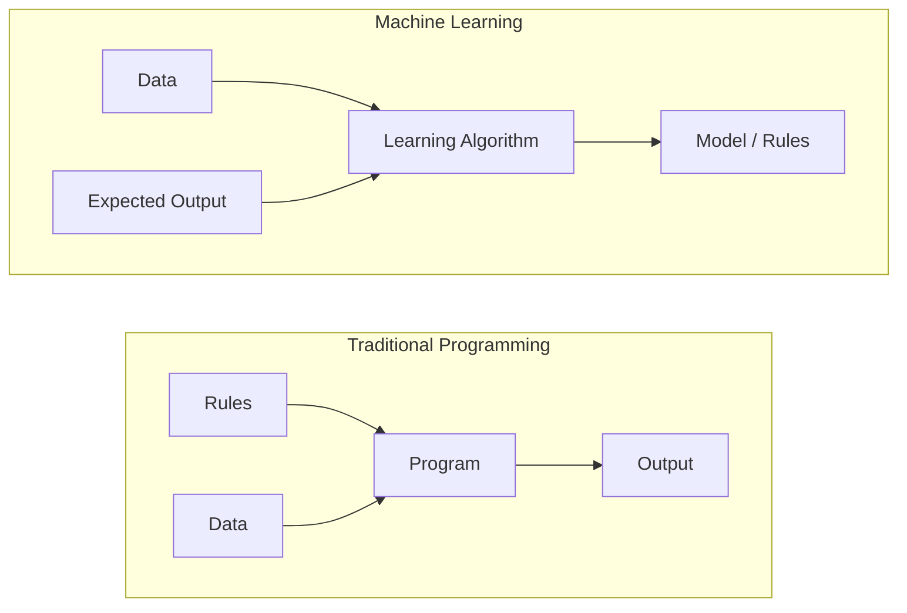
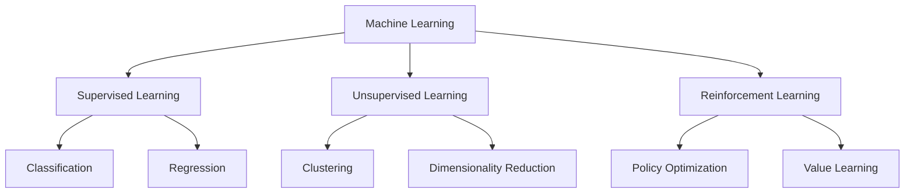
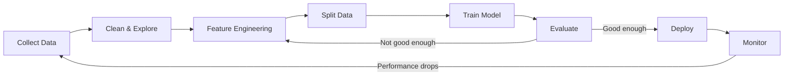
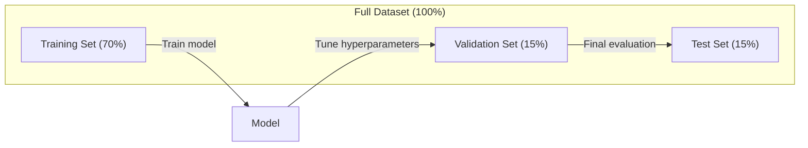
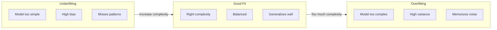
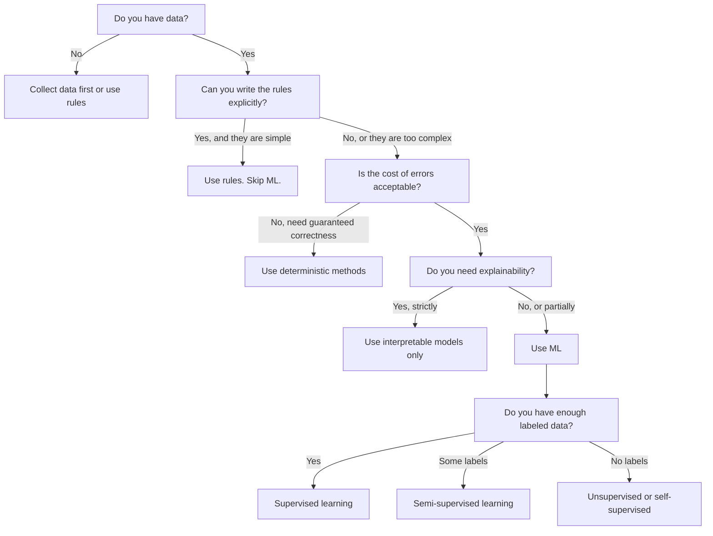

# ما هو التعلم الآلي

> تعلم الآلة هو تحديد النمط في البيانات من قبل الكمبيوتر، وليس قواعد الكتابة اليدوية.

**类型：**學习
**语言：**بايثون
**先修要求：**المرحلة الأولى (الأساسيات الرياضية)
**时间：**45 دقيقة

## 學习目标

- 解释 المشرفين 无监督 和 تعزيز التعلم,并判断给定问题适用哪种类型
- من صفر لتحقيق أقرب مصنف مركزي، لا تستخدم خط أساسي عشوائي لتقييمها
- 区分 تصنيف و رجعة  المهمة,并为每种任务选择合适的损失函数
- قيام مشكلة العمل المحددة بما يصلح استخدام ML، أم هو أكثر ملاءمة لحل قواعد التأكد

## 问题

هل تريد بناء مُصفّح بريد فضائي؟ الممارسة التقليدية هي: الجلوس و كتابة عدة مئات من القواعد. إذا كان البريد يحتوي على "مال مجاني"، قم بتسميته بريد فضائي. إذا كان لديه أكثر من ثلاثة شعاع، قم بتسميته بريد فضائي.

تعلم الآلة  غير هذا الطرق. توقف عن كتابة القواعد، ولكن أعط الكمبيوتر آلاف البريد المُعَلَّم بـ ((سبام أو ليس سبام) ، دعها تجد قواعدها نفسها.

هذا التحول من قواعد الكتابة إلى التعلم من البيانات هو جوهر التعلم الآلي. كل محرك التوصية ومساعد الصوت والسيارات ذاتية القيادة ونموذج اللغة يعمل بهذه الطريقة.

## 概念

### من البيانات والتعلم بدلا من القواعد

التخطيط التقليدي والتعلم الآلي في الاتجاه المعاكس لحل المشاكل.



传统编程:你编写规则──程序把规则应用到数据上并产生输出──

تعلم الآلة: تُقدم بيانات وتوقعات الناتج.

 نموذج تم تدريبها 本身就是规则,以数字形式编码(وزن 参数) .

### ثلاثة أنواع من التعلم الآلي



**Supervised Learning**لديك زوج المدخل والخروج. نموذج تعلم إدخال المخطط إلى الخروج.
-  هنا هناك 10،000 张 تم تدوينها لقط أو كلب الصور.
-  هنا يوجد خصائص وتسعيرات المنازل.

**Unsupervised Learning**: 你只有输入──没有标签──模型 自己寻找结构──
-  هنا هناك 10،000 条客户购买历史──找出自然分组──
-  هنا هناك 1000 维的数据点── في الاحتفاظ بهيكل في نفس الوقت انخفض إلى 2 维──

**Reinforcement Learning**: العميل في البيئة يتخذ تحركا، ويحصل على مكافأة أو عقوبة.
- لعب هذه اللعبة، فزت +1، خسرت -1، وجدت استراتيجية
-  التحكم في هذا الجهاز اليد  إلتقاط الأشياء +1 , لكل ضريبة من ثانية -0.01 

ستبني في الممارسة الغالبية العظمى من المحتوى باستخدام التعلم المشرف.

### 超越三大类型

الصف الثلاثة العليا واضحة جدا، ولكن العالم الحقيقي ML  غالبا ما يكون غامض الحدود.

**Semi-supervised learning**استخدام جزء صغير من البيانات الملصقة وكمية كبيرة من البيانات غير الملصقة.

- **Label propagation：**构建一个连接相似数据点的图――标签 通过图 从标签节点 传播到无标签邻居──
- **Pseudo-labeling：**في البيانات المعلقة 上 تمرين نموذج، باستخدامها التنبؤ على علامة البيانات غير المعلقة، ثم في جميع البيانات إعادة التدريب.
- **Consistency regularization：**بالنسبة إلى إدخال ونسخة خفيفة التأثير، يجب أن يقدم النموذج نفس التنبؤ. حتى بدون ملصق، يمكن أن يعمل.

**Self-supervised learning**من البيانات نفسها إنشاء الإشراف. تماما لا حاجة إلى علامات اصطناعية. النموذج بناء على البيانات بنية إنشاء مهمة التنبؤ الخاصة بك.

- **Masked language modeling (BERT)：**藏句中 15% 的词,训练模型 预测缺失的词──标签 来自原始文本──
- **Contrastive learning (SimCLR)：**取一张图像,创建两个增强版本──训练模型 识别它们来自同一张图像,同时将它们与其他图像的增强版本区分──
- **Next-token prediction (GPT)：**给定前面所有词,预测下一个词―― كل نسخة من الملفات تصبح نموذج تدريب

هذه ليست مستقلة عن الفئات الخارقة من النوع الثلاث الكبير. وهي مزيج من استراتيجيات التعلم المشرف و غير المشرف.

### التصنيف مقابل الرجوع

هذه مهمتين رئيسيتين للتعلم المشرف عليه

| 方面 | Classification | Regression |
|--------|---------------|------------|
| 输出 | 离散类别 | 连续数值 |
| 示例 | “这封邮件是垃圾邮件吗？” | “房价会是多少？” |
| 输出空间 | {cat, dog, bird} | 任意实数 |
| Loss Function | Cross-entropy, accuracy | Mean squared error, MAE |
| 决策 | 类别之间的边界 | 拟合数据的曲线 |

التصنيف 回答属于哪个类别?退缩 回答多少?

بعض المشاكل يمكن أن تُعبر عن طريق طريقتين.

### ML 工作流

كل مشروع للتعلم الآلي يتبع نفس الخط الأساسي، بغض النظر عن أي خوارزمية تستخدم.



**Collect Data**جمع البيانات الأصلية. أكثر البيانات أفضل تقريباً، ولكن الجودة أكثر أهمية من الكمية.

**Clean & Explore**: معالجة القيمة المفقودة، حذف المشاريع المُجددة، توزيع الملاحظة، اكتشاف المُختلفات، عادة ما يُسهم هذا الخطوة في 60-80% من إجمالي وقت المشروع.

**Feature Engineering**:把原始数据转换成模型可用功能──把日期转换为星期几──归结数值列──编码类别变量──好功能比花哨的算法更重要──

**Split Data**:划分为训练、验证 和测试集──模型 在训练数据上训练,你在验证数据上调超参数,并在测试数据上报告最终表现──

**Train Model**: ضع بيانات التدريب 输入算法──算法调整内部参数,以最小化 Loss Function──

**Evaluate**: في بيانات التحقق/التجارب 上衡性能── إذا كان الأداء غير مقبول،就回去尝试不同的功能、算法或超参数──

**Deploy**: وضع النموذج في بيئة الإنتاج، دعها تتوقع البيانات الجديدة.

**Monitor**:تتبع مستمر الأداء.تغيرات في توزيع البيانات.تحركات البيانات.تخفيض النموذج.تخفيض الأداء.تخفيض الأداء.تدريب جديد.

### التدريب والتحقق والاختبار

هذا هو المفهوم الأساسي الذي يسهل على المبتدئين الاختباء فيه. يجب عليك تقييم النموذج على البيانات التي لم ترىها من قبل خلال التدريب. وإلا فإنك تقيس الذاكرة وليس التعلم.



| 划分 | 目的 | 使用时机 | 典型大小 |
|-------|---------|-----------|-------------|
| Training | model 从这些数据中学习 | 训练期间 | 60-80% |
| Validation | 调整 hyperparameter、比较 model | 每次训练运行之后 | 10-20% |
| Test | 最终无偏 performance 估计 | 只在最后使用一次 | 10-20% |

مجموعة الاختبارات هي مقدسة. يمكنك فقط مشاهدتها مرة واحدة. إذا كنت تستمر في تعديل النموذج وفق أداء الاختبار، كنت في الواقع في مجموعة الاختبارات.

对于小数据集,使用k-fold cross-validation:把数据分成k 份,在k-1 份训练,在剩余1 份验证,轮换进行,并对结果取平均──

### التكيف المفرط مقابل التكيف السهل



**Underfitting**: النموذج  بسيط جدا، لا يمكن أن تلتقط النموذج في البيانات ∙ مثل استخدام 曲关系 ∙ خطأ التدريب 高── خطأ الاختبار 也高──

**Overfitting**: النموذج  معقد جدا، تذكر بيانات التدريب، بما في ذلك الضجيج.‬ مثل واحد من خلال كل نقطة التدريب 曲曲线، ولكن في بيانات جديدة فشل.‬ خطأ التدريب ‬ ‬ خطأ الاختبار ‬ 高‬

**Good fit**: النموذج 捕捉真实模式,而不记忆噪声── training error 和 test error 都相对较低──

علامات الإفراط:
- دقة التدريب 远高于 دقة التحقق
- النموذج في بيانات التدريب أعلى أداء جيد، ولكن في بيانات جديدة أداء سيء جدا
- 增加更多训练数据 会提升性能(نموذج 原本是在记忆而不是学习)

修复 إعادة التأقلم:
-  الحصول على المزيد من البيانات التدريبية
- 降低模型复杂性 ((更少参数、更简单架构)
- التنظيم (بالإضافة إلى الوزن الأكبر)
- التخلي عن الدورة الدماغية
- توقف مبكر ((من خطأ التحقق 开始上升时停止训练)

修复 عدم الوصول:
- استخدام أكثر تعقيدا نموذج
- 添加更多 ميزة
- 降低 التنظيم
- 訓練更久

### التجارة المتعددة التغيرات

هذا هو الإطار الرياضي الخلفي المُتلائم والذو نقص

**Bias**: من النموذج 错假设的错误──当真相关系非线性时, 线性模型会有高偏 bias──高偏会导致不适应──

**Variance**: من بيانات التدريبات 中微小波动敏感性错误――模型 المتغيرات العالية في مختلف مجموعات البيانات على التدريبات، سوف تعطى توقعات مختلفة جدا ً.

| Model complexity | Bias | Variance | 结果 |
|-----------------|------|----------|--------|
| 过低（用 linear model 拟合弯曲数据） | High | Low | Underfitting |
| 刚好合适 | Medium | Medium | 良好的 generalization |
| 过高（用 degree-20 polynomial 拟合 10 个点） | Low | High | Overfitting |

总 error = تعصب^2 + تغير + ضجيج لا يمكن تحديده

أنت لا تستطيع تقليل الضجيج غير القابل للتقليل ((إنه هو الوضع في البيانات نفسها)

### لا يوجد نظرية الغداء المجانية

لا يوجد خوارزمية واحدة أفضل للجميع من المشاكل. في نوع واحد من المشاكل، يمكن أن تؤدي بشكل جيد على نوع آخر من المشاكل. لهذا السبب يقوم عالم البيانات بمحاولة العديد من خوارزميات ومقارنة النتائج.

实践中,选择取决于:
- لديك كم من البيانات
- هناك الكثير من الميزات
- العلاقة خطية أو غير خطية
- نعم لا تحتاج إلى تفسير
- يمكنك تحمل كمية الموارد الحسابية

### 什么时候不要使用机器学习

المعلمين القويين، ولكن ليس دائما أداة صحيحة. قبل استخدام النموذج، اسأل نفسك أولاً ما إذا كنت حقاً بحاجة إليها.

**不要在以下情况下使用 ML：**

- **规则简单且定义明确。**税费计算、排序算法、单位转换── إذا كنت تستطيع استخدام عدة إف-إعلانات 写出逻辑، النموذج سوف يزيد فقط من التعقيد، دون أي مكاسب‬‬‬‬‬‬‬‬‬‬‬‬‬‬‬‬‬‬‬‬‬‬‬‬‬‬‬‬‬‬‬‬‬‬‬‬‬‬‬‬‬‬‬‬‬‬‬‬‬‬‬‬‬‬‬‬‬‬‬‬‬‬‬‬‬‬‬‬‬‬‬‬‬‬‬‬‬‬‬‬‬‬‬‬‬‬‬‬‬‬‬‬‬‬‬‬‬‬‬‬‬‬‬‬‬‬‬‬‬‬‬‬‬‬‬‬‬‬‬‬‬‬‬‬‬‬‬‬‬‬‬‬‬‬‬‬‬‬‬‬‬‬‬‬‬‬‬‬‬‬‬‬‬‬‬‬‬‬‬‬‬‬‬‬‬‬‬‬‬‬‬‬‬‬‬‬‬‬‬‬‬‬‬‬‬‬‬‬‬‬‬‬‬‬‬‬‬‬‬‬‬‬‬‬‬‬‬‬‬‬‬‬‬‬‬‬‬‬‬‬‬‬‬‬‬‬‬‬‬‬‬‬‬‬‬‬‬‬‬‬‬‬‬‬‬‬‬‬‬‬‬‬‬‬‬‬‬‬‬‬‬‬‬‬‬‬‬‬‬‬‬‬‬‬‬‬‬‬‬‬‬‬‬‬‬‬‬‬‬‬‬‬‬‬‬‬‬‬‬‬‬‬‬‬‬‬‬‬‬‬‬‬‬‬‬‬‬‬‬‬‬‬‬‬‬‬‬‬‬‬‬‬‬‬‬‬‬‬‬‬‬‬‬‬‬‬‬‬‬‬‬‬‬‬‬‬‬‬‬‬‬‬‬‬‬‬‬‬‬‬‬‬‬‬‬‬‬‬‬‬‬‬‬‬‬‬‬‬‬‬‬‬‬‬‬‬‬‬‬‬‬‬‬‬‬‬‬‬‬‬‬‬‬‬‬‬‬‬‬‬‬‬‬‬‬‬‬‬‬‬‬‬‬‬‬‬‬‬‬‬‬‬‬‬‬‬‬‬‬‬‬‬‬‬‬‬‬‬‬‬
- **你没有数据或数据很少。**المعلمين بحاجة إلى تعلم من نموذج. عندما يكون هناك 10 نقاط فقط من البيانات، لا يمكن تدريب شيء ذي معنى.
- **错误成本是灾难性的，并且你需要保证正确性。** حساب الجرعات الطبية  تحكم المفاعل النووي  رمز علمي  نموذج ML هو احتمالية  أحيانا يكون خطأ
- **lookup table 或 heuristic 可以解决问题。**إذا كان هناك عتبة بسيطة أو جدول يغطى 99% من الحالة، فإن إضافة ML ستزيد من تكاليف الصيانة، ولكن لا يوجد أي تحسينات ذات مغزى.
- **你无法解释决策，而 explainability 又是必需的。**في بعض الأحيان يتطلب كل قرار يمكن تفسيره بشكل كامل. في بعض الأحيان يمكن تفسير نموذج ML.
- **问题变化得比你重新训练还快。**إذا كانت القواعد تتغير كل يوم، وتتطلب التدريبات مرة أخرى أسبوع، النموذج هو دائما متجاوز.

استخدم هذا مخطط تدفق القرار:




```figure
f3-learning-boundary
```

## بناءها

`code/ml_intro.py`يظهر الرمز الأساسي: التعلم من البيانات، ثم التنبؤ بالبيانات الجديدة.

### الخطوة 1: من الصفر لتحقيق أقرب مركزية التصنيف

أقرب مركز مركزية تقسيمات حسابات بيانات التدريب في مركز كل فئة (معدل) 

```python
class NearestCentroid:
    def fit(self, X, y):
        self.classes = np.unique(y)
        self.centroids = np.array([
            X[y == c].mean(axis=0) for c in self.classes
        ])

    def predict(self, X):
        distances = np.array([
            np.sqrt(((X - c) ** 2).sum(axis=1))
            for c in self.centroids
        ])
        return self.classes[distances.argmin(axis=0)]
```

هذا هو الحساب كله. فيت 计算两个 معنى. التنبؤ 计算距离.

### الخطوة 2: في بيانات الاصطناعية 上訓練

نخلق مجموعة بيانات تصنيف ثنائية الأبعاد، من بينها فئتين لديها تفاعل خفيف.

```python
rng = np.random.RandomState(42)
X_class0 = rng.randn(100, 2) + np.array([1.0, 1.0])
X_class1 = rng.randn(100, 2) + np.array([-1.0, -1.0])
X = np.vstack([X_class0, X_class1])
y = np.array([0] * 100 + [1] * 100)
```

### الخطوة 3: مقارنة مع خط الأساس

كل نموذج ML يجب أن يكون مقارنة مع خط أساسي بسيط. هنا خط أساسي سوف يتوقع فئة. إذا كان نموذج ML الخاص بك لا يمكن أن يتجاوز التخمينات، فذلك يعني أن هناك مشكلة.

```python
baseline_preds = rng.choice([0, 1], size=len(y_test))
baseline_acc = np.mean(baseline_preds == y_test)
```

في هذا المجموعة البيانية الصافية، يجب أن يصل تصنيف المركز إلى 90٪ + دقة.

### لماذا هذا مهم

أقرب تصنيف مركزي 极其简单―― لا يوجد فيها مفاتيح فائقة، لا توجد تكرار، لا يوجد هبوط درجي، ولكنّها تلتقط النمط الأساسي للعلم المعرفي:

1. من بيانات التدريب**学习**一种表示(مركز)
2. استخدامها لإثبات بيانات جديدة**预测**(أقرب مسافة)
3. مع خط الأساس**评估**(随机猜测)

كل خوارزمية ML، من الرجوع اللوجستي إلى المحولات، تتبع نفس النمط الثلاث الخطوات.

### الخطوة 4: مركز التصنيف

أقرب تصنيف مركزي  افترض كل فئة تكوين نقطة واحدة ‬‬‬‬‬‬‬‬‬‬‬‬‬‬‬‬‬‬‬‬‬‬‬‬‬‬‬‬‬‬‬‬‬‬‬‬‬‬‬‬‬‬‬‬‬‬‬‬‬‬‬‬‬‬‬‬‬‬‬‬‬‬‬‬‬‬‬‬‬‬‬‬‬‬‬‬‬‬‬‬‬‬‬‬‬‬‬‬‬‬‬‬‬‬‬‬‬‬‬‬‬‬‬‬‬‬‬‬‬‬‬‬‬‬‬‬‬‬‬‬‬‬‬‬‬‬‬‬‬‬‬‬‬‬‬‬‬‬‬‬‬‬‬‬‬‬‬‬‬‬‬‬‬‬‬‬‬‬‬‬‬‬‬‬‬‬‬‬‬‬‬‬‬‬‬‬‬‬‬‬‬‬‬‬‬‬‬‬‬‬‬‬‬‬‬‬‬‬‬‬‬‬‬‬‬‬‬‬‬‬‬‬‬‬‬‬‬‬‬‬‬‬‬‬‬‬‬‬‬‬‬‬‬‬‬‬‬‬‬‬‬‬‬‬‬‬‬‬‬‬‬‬‬‬‬‬‬‬‬‬‬‬‬‬‬‬‬‬‬‬‬‬‬‬‬‬‬‬‬‬‬‬‬‬‬‬‬‬‬‬‬‬‬‬‬‬‬‬‬‬‬‬‬‬‬‬‬‬‬‬‬‬‬‬‬‬‬‬‬‬‬‬‬‬‬‬‬‬‬‬‬‬‬‬‬‬‬‬‬‬‬‬‬‬‬‬‬‬‬‬‬‬‬‬‬‬‬‬‬‬‬‬‬‬‬‬‬‬‬‬‬‬‬‬‬‬‬‬‬‬‬‬‬‬‬‬‬‬‬‬‬‬‬‬‬‬‬‬‬‬‬‬‬‬‬‬‬‬‬‬‬‬‬‬‬‬‬‬‬‬‬‬‬‬‬‬‬‬‬‬‬‬‬‬‬‬‬‬‬‬‬‬‬‬‬‬‬‬‬‬‬‬‬‬‬‬‬‬‬‬‬‬‬‬‬‬‬‬‬‬‬‬‬‬‬‬‬‬‬‬‬‬‬‬‬‬‬‬‬‬

- الصف لديه العديد من المجموعات (على سبيل المثال، الرقم 1 يمكن استخدامها في العديد من الطرق المختلفة لكتابة)
- الحدود القرارية غير خطية (على سبيل المثال ، فئة واحدة تحيط فئة أخرى)
- ميزة 差异很大( المسافة 被最大规模的特征 主导)

هذه الحدود تسبب في جميع الخوارزميات الأخرى التي سوف تتعلمها. يمكن أن يعالج أقرب جيران K العديد من المجموعات. يمكن أن يعالج شجرة القرار حدود غير خطية.

## استخدمها

التعلم  المقدمة `NearestCentroid`و مولد بيانات اصطناعية:

```python
from sklearn.neighbors import NearestCentroid
from sklearn.datasets import make_classification
from sklearn.model_selection import train_test_split

X, y = make_classification(
    n_samples=500, n_features=2, n_redundant=0,
    n_clusters_per_class=1, random_state=42
)
X_train, X_test, y_train, y_test = train_test_split(X, y, test_size=0.3)

clf = NearestCentroid()
clf.fit(X_train, y_train)
print(f"Accuracy: {clf.score(X_test, y_test):.3f}")
```

## 交付 it

本课会生成 `outputs/prompt-ml-problem-framer.md`، هذا هو عزم ، يمكن تحويل مشكلة الأعمال المضطربة إلى مهمة ML محددة. أعطها وصف مشكلة ((نريد تقليل التكلفة أو التنبؤ بالطلب للربع القادم)) ، فإنه سوف يدرك نوع التعلم ، ويحدد هدف التنبؤ ، ويحدد ميزة المرشح ، ويحدد مقياس النجاح ، ويحدد خط أساسي ، ويعين تسرب البيانات أو عدم توازن الفئة وغيرها من المثابير.

## 关键术语

| 术语 | 人们常说 | 实际含义 |
|------|----------------|----------------------|
| Model | “The AI” | 一个带有可学习 parameter 的数学函数，用于把输入映射到输出 |
| Training | “Teaching the AI” | 运行 optimization algorithm 来调整 model parameter，使预测匹配已知输出 |
| Feature | “An input column” | 数据中可测量的属性，model 用它进行预测 |
| Label | “The answer” | training example 的已知输出，用于计算 error signal |
| Hyperparameter | “A setting you tweak” | 训练前设置的 parameter，用于控制学习过程（learning rate、layer 数量） |
| Loss Function | “How wrong the model is” | 衡量预测输出与实际输出之间差距的函数，训练会尝试将其最小化 |
| Overfitting | “It memorized the test” | model 学到了 training-specific noise，而不是通用模式，因此在新数据上失败 |
| Underfitting | “It didn't learn anything” | model 太简单，无法捕捉数据中的真实模式 |
| Generalization | “It works on new data” | model 对未训练过的数据做出准确预测的能力 |
| Cross-validation | “Testing on different chunks” | 反复把数据拆分为 train/test fold 并对结果取平均，从而得到更稳健的 performance 估计 |
| Regularization | “Keeping weights small” | 向 Loss Function 添加 penalty term，以抑制过于复杂的 model |
| Data drift | “The world changed” | 传入数据的统计分布随时间发生变化，导致 model performance 下降 |

## التدريب

1. 选择任意数据集 ((مثلاً Iris、Titanic) 』按 70/15/15 拆分为火车/验证/测试──解释为什么不应该在测试集上调整超参数──
2. 列出三个真世界问题──对每一个问题,判断它是分类、退缩还是集群,以及它是监督还是无监督──
3. نموذج واحد في بيانات التدريب يصل إلى دقة 99٪، ولكن في بيانات الاختبار فقط 60٪.

## 延伸阅读

- [An Introduction to Statistical Learning](https://www.statlearning.com/)- 免费教材, تغطي جميع أساليب التعلم الكلاسيكية,并配有实践示例
- [Google's Machine Learning Crash Course](https://developers.google.com/machine-learning/crash-course)- تعريف بسيط لمفهوم ML
- [Scikit-learn User Guide](https://scikit-learn.org/stable/user_guide.html)- في Python لتنفيذ ML المرجح
