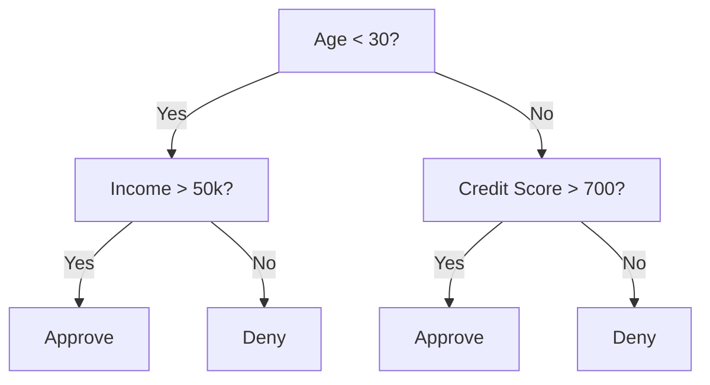
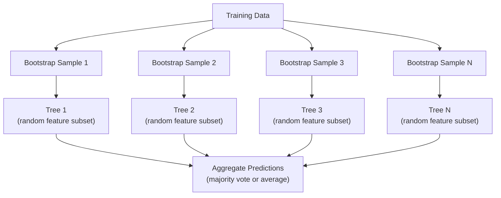

# الأشجار القرارية والغابات العشوائية

> شجرة القرار مجرد خطة عمل ولكن الغابة التي تتكون من العديد من الأشجار هي واحدة من أقوى الأدوات في ML

**类型：**بناء
**语言：**بايثون
**先修要求：**المرحلة الأولى ((الدرس 09 نظرية المعلومات، 06 احتمال)
**时间：**حوالي 90 دقيقة

## 學习目标

- 实现 Gini impurity、entropy 和 معلومات اكتساب 计算, لتحديد أفضل شجرة القرار تقسيم
- من零构建一个决策树分类器,并加入预剪切 控制(最大深度、min样本)
- استخدام عينات التشغيل و ميزة التعشير  بناء الغابة العشوائية،并 شرح لماذا يمكن أن تقلل من التباين
- مقارنة أهمية الميزات MDI مع أهمية المحوّل،并识别 MDI

## 问题

لديك بيانات جدولية، وتتبع نموذج، وتتبع ميزة، وهناك أيضا عمود هدف كنت تريد التنبؤ به. يمكنك مباشرة على شبكة عصبية. ولكن بالنسبة للبيانات الجدولية، النماذج القائمة على الأشجار، أشجار القرار، الغابات العشوائية، الأشجار المرتفعة بدرجة) تستمر بشكل أفضل من التعلم العميق.

لماذا؟ الأشجار  لا تحتاج إلى معالجة مسبقة 就能處理混合特征 类型(عددي 和 فصائي)  لا تحتاج إلى هندسة الميزات 就能處理 غير الخطية العلاقات‬‬‬‬‬‬‬‬‬‬‬‬‬‬‬‬‬‬‬‬‬‬‬‬‬‬‬‬‬‬‬‬‬‬‬‬‬‬‬‬‬‬‬‬‬‬‬‬‬‬‬‬‬‬‬‬‬‬‬‬‬‬‬‬‬‬‬‬‬‬‬‬‬‬‬‬‬‬‬‬‬‬‬‬‬‬‬‬‬‬‬‬‬‬‬‬‬‬‬‬‬‬‬‬‬‬‬‬‬‬‬‬‬‬‬‬‬‬‬‬‬‬‬‬‬‬‬‬‬‬‬‬‬‬‬‬‬‬‬‬‬‬‬‬‬‬‬‬‬‬‬‬‬‬‬‬‬‬‬‬‬‬‬‬‬‬‬‬‬‬‬‬‬‬‬‬‬‬‬‬‬‬‬‬‬‬‬‬‬‬‬‬‬‬‬‬‬‬‬‬‬‬‬‬‬‬‬‬‬‬‬‬‬‬‬‬‬‬‬‬‬‬‬‬‬‬‬‬‬‬‬‬‬‬‬‬‬‬‬‬‬‬‬‬‬‬‬‬‬‬‬‬‬‬‬‬‬‬‬‬‬‬‬‬‬‬‬‬‬‬‬‬‬‬‬‬‬‬‬‬‬‬‬‬‬‬‬‬‬‬‬‬‬‬‬‬‬‬‬‬‬‬‬‬‬‬‬‬‬‬‬‬‬‬‬‬‬‬‬‬‬‬‬‬‬‬‬‬‬‬‬‬‬‬‬‬‬‬‬‬‬‬‬‬‬‬‬‬‬‬‬‬‬‬‬‬‬‬‬‬‬‬‬‬‬‬‬‬‬‬‬‬‬‬‬‬‬‬‬‬‬‬‬‬‬‬‬‬‬‬‬‬‬‬‬‬‬‬‬‬‬‬‬‬‬‬‬‬‬‬‬‬‬‬‬‬‬‬‬‬‬‬‬‬‬‬‬‬‬‬‬‬‬‬‬‬‬‬‬‬‬‬‬‬‬‬‬‬‬‬‬‬‬‬‬‬‬‬‬

هذا الدروس سوف تستخدم التقسيم التكراري من صفر بناء شجرة القرار ، ثم بناء الغابة العشوائية عليها.

## مفهوم الأساسي

### شجرة القرار تفعل ماذا

شجرة القرار 通過 طرح سلسلة من الأسئلة نعم / لا ، قم بتقسيم مساحة الميزات إلى منطقة مربعة



كل عقدة داخلية تستخدم عتبة واحدة اختبار ميزة واحدة ‬ كل عقدة ورقة إجراء توقعات‬‬‬‬‬‬‬‬‬‬‬‬‬‬‬‬‬‬‬‬‬‬‬‬‬‬‬‬‬‬‬‬‬‬‬‬‬‬‬‬‬‬‬‬‬‬‬‬‬‬‬‬‬‬‬‬‬‬‬‬‬‬‬‬‬‬‬‬‬‬‬‬‬‬‬‬‬‬‬‬‬‬‬‬‬‬‬‬‬‬‬‬‬‬‬‬‬‬‬‬‬‬‬‬‬‬‬‬‬‬‬‬‬‬‬‬‬‬‬‬‬‬‬‬‬‬‬‬‬‬‬‬‬‬‬‬‬‬‬‬‬‬‬‬‬‬‬‬‬‬‬‬‬‬‬‬‬‬‬‬‬‬‬‬‬‬‬‬‬‬‬‬‬‬‬‬‬‬‬‬‬‬‬‬‬‬‬‬‬‬‬‬‬‬‬‬‬‬‬‬‬‬‬‬‬‬‬‬‬‬‬‬‬‬‬‬‬‬‬‬‬‬‬‬‬‬‬‬‬‬‬‬‬‬‬‬‬‬‬‬‬‬‬‬‬‬‬‬‬‬‬‬‬‬‬‬‬‬‬‬‬‬‬‬‬‬‬‬‬‬‬‬‬‬‬‬‬‬‬‬‬‬‬‬‬‬‬‬‬‬‬‬‬‬‬‬‬‬‬‬‬‬‬‬‬‬‬‬‬‬‬‬‬‬‬‬‬‬‬‬‬‬‬‬‬‬‬‬‬‬‬‬‬‬‬‬‬‬‬‬‬‬‬‬‬‬‬‬‬‬‬‬‬‬‬‬‬‬‬‬‬‬‬‬‬‬‬‬‬‬‬‬‬‬‬‬‬‬‬‬‬‬‬‬‬‬‬‬‬‬‬‬‬‬‬‬‬‬‬‬‬‬‬‬‬‬‬‬‬‬‬‬‬‬‬‬‬‬‬‬‬‬‬‬‬‬‬‬‬‬‬‬‬‬‬‬‬‬‬‬‬‬‬‬‬‬‬‬‬‬‬‬‬‬‬‬‬‬‬‬‬‬‬‬‬‬‬‬‬‬‬‬‬‬‬‬‬‬‬‬

الشجرة  من أعلى إلى أسفل  طريقة بناء: في كل عقدة، اختيار أفضل قدرة على فصل البيانات و العدوان.

### المعايير المفصلة: قياس النقاش

في كل عقدة، لدينا مجموعة من العينات. نريد أن يتم تقسيمها، حتى يتم إنتاج عقدة الطفل الصافية قدر الإمكان.

**Gini impurity**قياس هو: إذا وفقا لتوزيع الفئة من هذا العقد عطى علامة 贴 نموذج من اختيار عشوائي، فإنه يتم تصنيفه بشكل خاطئ‬‬‬‬‬‬‬‬‬‬‬‬‬‬‬‬‬‬‬‬‬‬‬‬‬‬‬‬‬‬‬‬‬‬‬‬‬‬‬‬‬‬‬‬‬‬‬‬‬‬‬‬‬‬‬‬‬‬‬‬‬‬‬‬‬‬‬‬‬‬‬‬‬‬‬‬‬‬‬‬‬‬‬‬‬‬‬‬‬‬‬‬‬‬‬‬‬‬‬‬‬‬‬‬‬‬‬‬‬‬‬‬‬‬‬‬‬‬‬‬‬‬‬‬‬‬‬‬‬‬‬‬‬‬‬‬‬‬‬‬‬‬‬‬‬‬‬‬‬‬‬‬‬‬‬‬‬‬‬‬‬‬‬‬‬‬‬‬‬‬‬‬‬‬‬‬‬‬‬‬‬‬‬‬‬‬‬‬‬‬‬‬‬‬‬‬‬‬‬‬‬‬‬‬‬‬‬‬‬‬‬‬‬‬‬‬‬‬‬‬‬‬‬‬‬‬‬‬‬‬‬‬‬‬‬‬‬‬‬‬‬‬‬‬‬‬‬‬‬‬‬‬‬‬‬‬‬‬‬‬‬‬‬‬‬‬‬‬‬‬‬‬‬‬‬‬‬‬‬‬‬‬‬‬‬‬‬‬‬‬‬‬‬‬‬‬‬‬‬‬‬‬‬‬‬‬‬‬‬‬‬‬‬‬‬‬‬‬‬‬‬‬‬‬‬‬‬‬‬‬‬‬‬‬‬‬‬‬‬‬‬‬‬‬‬‬‬‬‬‬‬‬‬‬‬‬‬‬‬‬‬‬‬‬‬‬‬‬‬‬‬‬‬‬‬‬‬‬‬‬‬‬‬‬‬‬‬‬‬‬‬‬‬‬‬‬‬‬‬‬‬‬‬‬‬‬‬‬‬‬‬‬‬‬‬‬‬‬‬‬‬‬‬‬‬‬‬‬‬‬‬‬‬‬‬‬‬‬‬‬‬‬‬‬‬‬‬‬‬‬‬‬‬‬‬‬‬‬‬‬‬‬‬‬‬‬‬‬

```
Gini(S) = 1 - sum(p_k^2)

where p_k is the proportion of class k in set S.
```

بالنسبة للعقدة النقية (((كل تنتمي إلى نفس الفئة) ، جيني = 0。 بالنسبة للفصول الثنائية 50/50 ، جيني = 0.5。越低越好。

```
Example: 6 cats, 4 dogs

Gini = 1 - (0.6^2 + 0.4^2) = 1 - (0.36 + 0.16) = 0.48
```

**Entropy**衡量 node 中的信息量(混乱程度) ――المرحلة 1 الدروس 09 已覆盖。

```
Entropy(S) = -sum(p_k * log2(p_k))
```

بالنسبة للعقدة النقية، الإنتروبي = 0، بالنسبة للقسيم الثنائي 50/50, الإنتروبي = 1.0،越低越好.

```
Example: 6 cats, 4 dogs

Entropy = -(0.6 * log2(0.6) + 0.4 * log2(0.4))
        = -(0.6 * -0.737 + 0.4 * -1.322)
        = 0.442 + 0.529
        = 0.971 bits
```

**Information gain**يُقسم بعد انخفاض النسبية

```
IG(S, feature, threshold) = Impurity(S) - weighted_avg(Impurity(S_left), Impurity(S_right))

where the weights are the proportions of samples in each child.
```

كل عقدة أعلى الخوارزمية الفاسدة: حاول كل ميزة و كل عتبة ممكنة.`(feature, threshold)`组合──

### تقسيم 如何工作

بالنسبة للعقدة الحالية 上包含 n 个 خصائص m 个 عينات مجموعة بيانات:

1. لكل صفة j ((j = 1 إلى n):
   - 按特征 j对样本 排序
   - ستقوم بـ كل نقطة وسط بين القيم المختلفة
   - 计算每门的信息收益
2.  اختيار المعلومات الحصول على أعلى ميزة و العد
3. سوف تقسيم البيانات إلى اليسار ((الميزة <= العدالة) واليمين ((الميزة > العدالة)
4. لكل طفل

هذا النوع من الطمع لا يضمن الحصول على أفضل شجرة على مستوى العالم.

### 停止条件

إذا لم يتوقف الشجرة، ستستمر في النمو حتى كل ورقة تكون نقية، كل ورقة عينة.

**Pre-pruning**سأقفز قبل أن يتصاعد
- أعمق أقصى: عندما يصل الأشجار إلى أعمق محدد
- الحد الأدنى من العينات لكل ورقة: إذا كانت عينات العقدة أقل من k، فإنها ستوقف
- الحد الأدنى من المعلومات: إذا كان أفضل الانقسام على النقية تحسن أقل من عتبة معينة، ثم توقف
- الحد الأقصى لعدد العقدة الورقية: الحد من مجموع الأوراق

**Post-pruning**أولاً، أخلق شجرة كاملة، ثمّ أعود إلى الوراء
- تعقيد التكلفة (التقطيع) استخدام: إضافة واحدة مع الأوراق عدد النسب العادلة.
- خفض خطأ القص: إذا تم تحويل شجرة فرعية لن يزيد من خطأ التحقق ، فلتحذفها

قبل القصص 更简单也更快── بعد القصص عادة ما تكون الأشجار أفضل، لأنه لن يتوقف من قبل تلك الأجزاء اللاحقة التي قد تجلب تقسيم مفيد.

### تستخدم شجرة القرارات للعودة

بالنسبة للعودة، فإن التنبؤ بالورقة هو متوسط قيمة الهدف في هذه الورقة.

**Variance reduction**替代 معلومات المكاسب:

```
VR(S, feature, threshold) = Var(S) - weighted_avg(Var(S_left), Var(S_right))
```

选择使变化 降低最多的分裂―― Tree 会把输入空间 划分成多个区域,并预测一个常数(平均值) 

### الغابات العشوائية: قوة الجمع

شجرة القرارات ذات التباين العالي. يمكن أن تحدث تغيرات صغيرة في البيانات. يمكن أن تحدث أشجار مختلفة تماما.



两种随机性 让树木 多样性:

**Bagging（bootstrap aggregating）：**كل شجرة تمت في عينة من الشريط التدريب، أي أن هناك إعادة إلى النموذج الذي يتم استخراجها من بيانات التدريب.

**Feature randomization：**في كل فصل ، فقط النظر في مجموعة فرعية من الميزات العشوائية. بالنسبة للتصنيف ، فإن الاعتراف هو مربع.

关键洞见: بالنسبة للعديد من الأشجار المتحولة 求平均, يمكن أن تقلل من التباين في حالة عدم زيادة التحيزات ∙ كل شجرة منفصلة قد تظهر بشكل عام, ولكن الجمع 很强──

### أهمية الميزات

الغابات العشوائية تُقدم نمطاً هاماً..

**Mean Decrease in Impurity (MDI)：**على كل ميزة، في جميع الأشجار، في جميع العقدة التي تستخدم هذه الميزة                                                                                                                                                                                                                                                                                                                                                                                                                                                                                                        

```
importance(feature_j) = sum over all nodes where feature_j is used:
    (n_samples_at_node / n_total_samples) * impurity_decrease
```

هذه الطريقة سريعة جداً (يمكن حسابها خلال التدريب) ، ولكن سوف تكون مخصصة لميزات عالية الكاردينالية ولها العديد من نقاط الانقسام المحتملة.

**Permutation importance**هو طريقة أخرى:打乱某特征的值,并衡量模型精度下降了多少;;;;;;;;;;;;;;;;;;;;;;;;;;;;;;;;;;;;;;;;;;;;;;;;;;;;;;;;;;;;;;;;;;;;;;;;;;;;;;;;;;;;;;;;;;;;;;;;;;;;;;;;;;;;;;;;;;;;;;;;;;;;;;;;;;;;;;;;;;;;;;;;;;;;;;;;;;;;;;;;;;;;;;;;;;;;;;;;;;;;;;;;;;;;;;;;;;;;;;;;;;;;;;;;;;;;;;;;;;;;;;;;;;;;;;;;;;;;;;;;;;;;;;;;;;;;;;;;;;;;;;;;;;;;;;;;;;;;;;;;;;;;;;;;;;;;;;;;;;;;;;;;;;;;;;;;;;;;;;;;;;;;;;;;;;;;;;;;;;;;;;;;;;;;;;;;;;;;;;;;;;;;;;;;;;;;;;;;;;;;;;;;;;;;;;;;;;;;;;;;;;;;;;;;;;;;;;;;;;;;;;;;;;;;;;;;;;;;;;;;;;;;;;;;;;;;;;;;;;;;;;;;;;;;;;;;;;;;;;;;;;;;;;;;;

### شجرة 何時胜過 شبكة عصبية

الأشجار والغابات في بيانات الجدول العريض عادة ما تغلب على شبكات الأعصاب.

| Factor | Trees | Neural networks |
|--------|-------|----------------|
| Mixed types (numeric + categorical) | 原生支持 | 需要 encoding |
| Small datasets (< 10k rows) | 表现良好 | 容易 overfit |
| Feature interactions | 通过 splitting 找到 | 需要 architecture design |
| Interpretability | 完全透明 | Black box |
| Training time | 分钟级 | 小时级 |
| Hyperparameter sensitivity | 低 | 高 |

عندما يكون للبيانات هيكل فضائي أو متسلسل (صور، نص، صوت) ، والشبكات العصبية 更强.


```figure
decision-tree-depth
```

## بناءها

### الخطوة 1:الأنثار والانتروبيا

من الصورة التكوينية هذه المعايير المزدوجة ، ومثبتها على أي من الانقسامات هي أحكام جيدة للانقسامات.

```python
import math

def gini_impurity(labels):
    n = len(labels)
    if n == 0:
        return 0.0
    counts = {}
    for label in labels:
        counts[label] = counts.get(label, 0) + 1
    return 1.0 - sum((c / n) ** 2 for c in counts.values())

def entropy(labels):
    n = len(labels)
    if n == 0:
        return 0.0
    counts = {}
    for label in labels:
        counts[label] = counts.get(label, 0) + 1
    return -sum(
        (c / n) * math.log2(c / n) for c in counts.values() if c > 0
    )
```

### 步骤 2: إيجاد أفضل تقسيم

尝试每个功能 和每个门──返回信息收获最高那个──

```python
def information_gain(parent_labels, left_labels, right_labels, criterion="gini"):
    measure = gini_impurity if criterion == "gini" else entropy
    n = len(parent_labels)
    n_left = len(left_labels)
    n_right = len(right_labels)
    if n_left == 0 or n_right == 0:
        return 0.0
    parent_impurity = measure(parent_labels)
    child_impurity = (
        (n_left / n) * measure(left_labels) +
        (n_right / n) * measure(right_labels)
    )
    return parent_impurity - child_impurity
```

### 步骤 3: بناء قراراتشجرة

التقسيم المتكرر والتنبؤ و تتبع أهمية الميزات

```python
class DecisionTree:
    def __init__(self, max_depth=None, min_samples_split=2,
                 min_samples_leaf=1, criterion="gini",
                 max_features=None):
        self.max_depth = max_depth
        self.min_samples_split = min_samples_split
        self.min_samples_leaf = min_samples_leaf
        self.criterion = criterion
        self.max_features = max_features
        self.tree = None
        self.feature_importances_ = None

    def fit(self, X, y):
        self.n_features = len(X[0])
        self.feature_importances_ = [0.0] * self.n_features
        self.n_samples = len(X)
        self.tree = self._build(X, y, depth=0)
        total = sum(self.feature_importances_)
        if total > 0:
            self.feature_importances_ = [
                fi / total for fi in self.feature_importances_
            ]

    def predict(self, X):
        return [self._predict_one(x, self.tree) for x in X]
```

### 步骤 4: بناء فئة RandomForest

اختبار القفز العرضية، تعديل الميزات، التصويت الأغلبية

```python
class RandomForest:
    def __init__(self, n_trees=100, max_depth=None,
                 min_samples_split=2, max_features="sqrt",
                 criterion="gini"):
        self.n_trees = n_trees
        self.max_depth = max_depth
        self.min_samples_split = min_samples_split
        self.max_features = max_features
        self.criterion = criterion
        self.trees = []

    def fit(self, X, y):
        n = len(X)
        for _ in range(self.n_trees):
            indices = [random.randint(0, n - 1) for _ in range(n)]
            X_boot = [X[i] for i in indices]
            y_boot = [y[i] for i in indices]
            tree = DecisionTree(
                max_depth=self.max_depth,
                min_samples_split=self.min_samples_split,
                max_features=self.max_features,
                criterion=self.criterion,
            )
            tree.fit(X_boot, y_boot)
            self.trees.append(tree)

    def predict(self, X):
        all_preds = [tree.predict(X) for tree in self.trees]
        predictions = []
        for i in range(len(X)):
            votes = {}
            for preds in all_preds:
                v = preds[i]
                votes[v] = votes.get(v, 0) + 1
            predictions.append(max(votes, key=votes.get))
        return predictions
```

完整实现及所有 أساليب المساعدة 见 `code/trees.py`.

## استخدمها

استخدام المعلمين، تدريب الغابة عشوائية فقط تحتاج إلى ثلاثة صفات:

```python
from sklearn.ensemble import RandomForestClassifier
from sklearn.datasets import load_iris
from sklearn.model_selection import train_test_split

X, y = load_iris(return_X_y=True)
X_train, X_test, y_train, y_test = train_test_split(X, y, random_state=42)

rf = RandomForestClassifier(n_estimators=100, random_state=42)
rf.fit(X_train, y_train)
print(f"Accuracy: {rf.score(X_test, y_test):.4f}")
print(f"Feature importances: {rf.feature_importances_}")
```

في الممارسة العملية، الأشجار المرتفعة بدرجة عالية ((XGBoost、LightGBM、CatBoost) عادة ما تكون أقوى من الغابات العشوائية، لأنّها تتم بناء الأشجار على نحوٍٍٍٍٍٍٍٍٍٍٍٍٍٍٍٍٍٍٍٍٍٍٍٍٍٍٍٍٍٍٍٍٍٍٍٍٍٍٍٍٍٍٍٍٍٍٍٍٍٍٍٍٍٍٍٍٍٍٍٍٍٍٍٍٍٍٍٍٍٍٍٍٍٍٍٍٍٍٍٍٍٍٍٍٍٍٍٍٍٍٍٍٍٍٍٍٍٍٍٍٍٍٍٍٍٍٍٍٍٍٍٍٍٍٍٍٍٍٍٍٍٍٍٍٍٍٍٍٍٍٍٍٍٍٍٍٍٍٍٍٍٍٍٍٍٍٍٍٍٍٍٍٍٍٍٍٍٍٍٍٍٍٍٍٍٍٍٍٍٍٍٍٍٍٍٍٍٍٍٍٍٍٍٍٍٍٍٍٍٍٍٍٍٍٍٍٍٍٍٍٍٍٍٍٍٍٍٍٍٍٍٍٍٍٍٍٍٍٍٍٍٍٍٍٍٍٍٍٍٍٍٍٍٍٍٍٍٍٍٍٍٍٍٍٍٍٍٍٍٍٍٍٍٍٍٍٍٍٍٍٍٍٍٍٍٍٍٍٍٍٍٍٍٍٍٍٍٍٍٍٍٍٍٍٍٍٍٍٍٍٍٍٍٍٍٍٍٍٍٍٍٍٍٍٍٍٍٍٍٍٍٍٍٍٍٍٍٍٍٍٍٍٍٍٍٍٍٍٍٍٍٍٍٍٍٍٍٍٍٍٍٍٍٍٍٍٍٍٍٍٍٍٍٍٍٍٍٍٍٍٍٍٍٍٍٍٍٍٍٍٍٍٍٍٍٍٍٍٍٍٍٍٍٍٍٍٍٍٍٍٍٍٍٍٍٍٍٍٍٍٍٍٍٍٍٍٍٍٍٍٍٍٍٍٍٍٍٍٍٍٍٍٍٍٍٍٍٍٍٍٍٍٍٍٍٍٍٍٍٍٍٍٍٍٍٍٍٍٍٍ

## 交付 it

本课会产出 `outputs/prompt-tree-interpreter.md`، هو عرض يستخدم لأصحاب الأعمال لتفسير تقسيمات الأشجار القرارية. إلى ذلك النموذج المُدرّب من الشجرة. عمقها، والخصائص، والحدّات المُقسمة، الدقة، فإنه يُعد النموذج إلى قواعد عادة، لدرجة أهمية الميزات، وتسجيل الإفراط أو التسريب، ومُقدمة الخطوة التالية للعمل.

## التدريب

1. في مجموعة بيانات ثنائية الأبعاد التي تحتوي على 3 فئات 上训练单棵决策树──手动追踪分裂,并绘出矩形决策界限──比较max_depth=2 与max_depth=10 时的界限──

2. لـ شجرة التراجعة 实现 المتغيرات تخفيض الانقسام ∙为 200 个点生成 y = sin(x) + noise,并拟合你的回归树──将树的碎片式-恒定预测与真曲线一起绘图──

3. 构建包含1、5、10、50 和 200 شجرة غابات عشوائية.

4. في مجموعات بيانات مختلفة 5 تم مقارنة نقاس جيني مع الانتروبيا كمعايير تقسيم.

5. 实现 permutation importance── في مجموعة بيانات 上将它与 MDI importance比较, أحد ميزاتها هو الضجيج العشوائي, ولكن له خطوة عالية── MDI 会把噪音功能排得很高──

## 关键术语

| Term | 人们常说 | 实际含义 |
|------|----------------|----------------------|
| Decision tree | “用于 predictions 的流程图” | 一种通过学习一系列 if/else splits，将 feature space 划分为矩形区域的 model |
| Gini impurity | “node 有多混杂” | 在某个 node 上 misclassify 一个 random sample 的概率。0 = pure，0.5 = binary 情况下的最大 impurity |
| Entropy | “node 中的混乱程度” | node 上的信息量。0 = pure，1.0 = binary 情况下的最大 uncertainty。来自 information theory |
| Information gain | “split 有多好” | split 后 impurity 的降低量。用于选择 splits 的 greedy criterion |
| Pre-pruning | “提前停止 tree” | 通过设置 max depth、min samples 或 min gain thresholds，提前停止 tree growth |
| Post-pruning | “事后修剪 tree” | 先生成完整 tree，再移除不会提升 validation performance 的 subtrees |
| Bagging | “在随机 subsets 上训练” | Bootstrap aggregating。在不同的有放回 random sample 上训练每个 model |
| Random forest | “一堆 trees” | Decision trees 的 ensemble，每棵 tree 都在 bootstrap sample 上训练，并在每次 split 使用 random feature subsets |
| Feature importance (MDI) | “哪些 features 重要” | 每个 feature 贡献的总 impurity decrease，在所有 trees 和 nodes 上求和 |
| Permutation importance | “打乱后检查” | 随机打乱某个 feature 的 values 时 accuracy 的下降量。对于 noisy features，比 MDI 更可靠 |
| Variance reduction | “info gain 的 regression 版本” | Information gain 的 regression tree 对应形式。选择使 target variance 降低最多的 split |
| Bootstrap sample | “带重复的 random sample” | 从原始 dataset 中有放回抽取得到的 random sample。大小相同，但包含 duplicates |

## 延伸阅读

- [Breiman: Random Forests (2001)](https://link.springer.com/article/10.1023/A:1010933404324)- الغابة العشوائية الأصلية
- [Grinsztajn et al.: Why do tree-based models still outperform deep learning on tabular data? (2022)](https://arxiv.org/abs/2207.08815)-  حول الأشجار مقابل الشبكات العصبية في المهام الجدولية
- [scikit-learn Decision Trees documentation](https://scikit-learn.org/stable/modules/tree.html)- 带可视化工具 的实践指南
- [XGBoost: A Scalable Tree Boosting System (Chen & Guestrin, 2016)](https://arxiv.org/abs/1603.02754)- 主导 كاغل من التراجع تعزيز 论文
