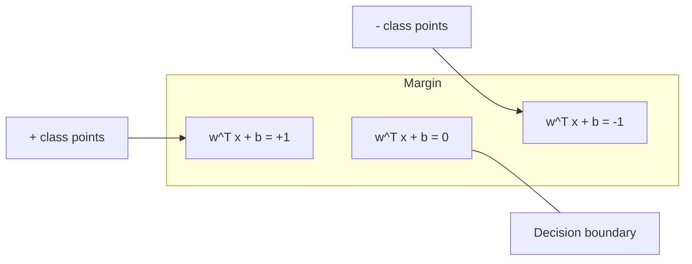
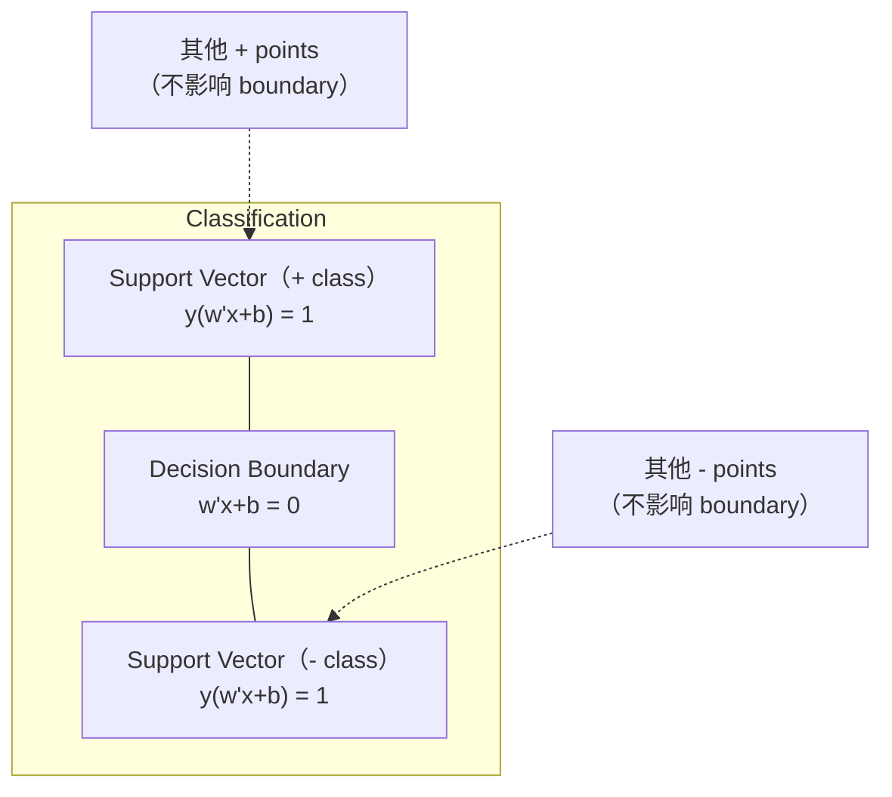
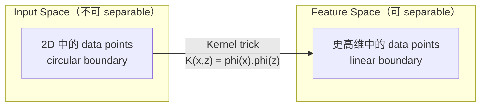

# آلات الدعم المتجهة

> بين فئتين أجدوا الطريق الأوسع.. هذا كل الفكر..

**Type:** Build
**Language:**بايثون
**先修要求：**المرحلة الأولى ((الدرس 08 تحسين، 14 معايير ومرحلة، 18 تحسين متواصل)
**Time:** ~90 分钟

## 學习目标
- استخدام خسارة الزجاجات 和 الصيغة الأساسية ارتفاع نسبة التراجع، من الصفر تحقيق SVM خطي
-  شرح مبدأ الحد الأقصى من الهامش،并从训练好的模型中识别支持向量
- مقارنة خطوطي متعدد الحدود و RBF الأساسية، ومفاحة حيلة الأساسية كيفية تجنب التخطيط الكبير
-  التقييم بواسطة المعلم C  الوزن بين عرض الهامش والخطأ في التصنيف 

## 问题
لديك نوعان من النقاط البيانية، تحتاج إلى رسم خط مستقيم (أو طائرة فائقة) لتفصلها.

选择边界 最大的那一条──边界是决定边界与两侧最近数据点之间的距离──较宽的边界意味着分类者更有信心,并且能更好地概括到未见数据──

هذا الإحساس أدى إلى أن أجهزة الدعم المتجهة، وهي واحدة من أفضل خوارزميات في الرياضيات المتوسطة المعلمية. كانت SVMs قبل التعلم العميق هي الطريقة السائدة للتصنيف، وما زالت أفضل خيار في مجتمعات البيانات الصغيرة والبيانات العالية، ومع مشكلة نموذج يتطلب وجود مبادئ وفهم كامل، مع ضمانات النظرية.

الـ SVM 直接连接到阶段1:التحسين هو متواصلة ️درس 18،الـ هامش باستخدام القواعد 来度量️درس 14) ، بينما خدعة النواة استغلال منتجات النقاط، في حالة غير واقعية حساب高维空间 معالجة الحدود غير الخطية‬

## 概念
### أكبر فصيلة

给定标签 y_i في {-1, +1} 和 ميزة المتجهات x_i من البيانات القابلة للفصل بشكل خطي، نحن نريد العثور على طائرة فائقة w^T x + b = 0 来分离类别。

المسافة من x_i إلى hyperplane هي:

```
distance = |w^T x_i + b| / ||w||
```

بالنسبة للنقطة: y_i * (w^T x_i + b) > 0。الفرق هو من المرحلة العابرة إلى الجانب الأقرب من النقطة بضع مرات.



مشكلة تحسين:

```
maximize    2 / ||w||     (margin width)
subject to  y_i * (w^T x_i + b) >= 1  for all i
```

等地(حد من أسعار النفقات المعدلة)

```
minimize    (1/2) ||w||^2
subject to  y_i * (w^T x_i + b) >= 1  for all i
```

هذا هو برنامج مربع متواصلة. لديها حل عالمي وحيد. يقع في حدود الحدود العليا.

### متجهات الدعم:关键的少数点



معظم نقاط التدريب لا علاقة لها بالضرورة. فقط متجهات الدعم مهمة. هذا هو السبب في أن المجهزة الخاصة بتقديم التنبؤات في الوقت المناسب تكون فعالة في الذاكرة. تحتاج فقط إلى تخزين متجهات الدعم، وليس مجموعة التدريب بأكملها.

عدد المتجهات الداعمة أيضاً أعطى حد خطأ التعميم.

### الحد الناعم: استخدام C المعلم 处理噪声

البيانات الحقيقية نادرًا ما تكون قابلة للانفصال بالكامل. بعض النقاط قد تكون على الجانب الخطأ من الحدود، أو في الحافة.

```
minimize    (1/2) ||w||^2 + C * sum(xi_i)
subject to  y_i * (w^T x_i + b) >= 1 - xi_i
            xi_i >= 0  for all i
```

المتغيرات السريعة xi_i 衡量点 i 违反 الهامش 的程度──C 控制

| C value | Behavior |
|---------|----------|
| Large C | 对 violations 施加重罚。margin 窄，misclassifications 更少。Overfits |
| Small C | 允许更多 violations。margin 宽，misclassifications 更多。Underfits |

C هو قوة التنظيمات.

### خسارة المضغوطة: وظيفة الخسارة SVM

يمكن إعادة كتابة SVM الحد الناعم لتحسين غير مقيد:

```
minimize    (1/2) ||w||^2 + C * sum(max(0, 1 - y_i * (w^T x_i + b)))
```

项 max(0, 1 - y_i * f(x_i)) هو خسارة الزجاجات.

```
单个点的 Hinge loss：

loss
  |
  | \
  |  \
  |   \
  |    \
  |     \_______________
  |
  +-----|-----|-------->  y * f(x)
       0     1

当 y*f(x) >= 1 时为 zero loss（正确分类，位于 margin 外）。
当 y*f(x) < 1 时为 linear penalty。
```

مقارنة مع الخسارة اللوجستية

```
Hinge:     max(0, 1 - y*f(x))          在 margin 处 hard cutoff
Logistic:  log(1 + exp(-y*f(x)))        平滑，永远不会精确为零
```

فقدان الجهازات التشويلية  تسبب حلول نادرة                                                                                                                                                                                                                                                       

### 用 نسبة هبوط  تدريب خطي SVM

يمكنك استخدام خسارة الزجاجات زائد L2 التنظيم الصعودية التنحدر لتدريب SVM خطية، دون الحاجة إلى حل QP المحدود:

```
L(w, b) = (lambda/2) * ||w||^2 + (1/n) * sum(max(0, 1 - y_i * (w^T x_i + b)))

关于 w 的 Gradient：
  If y_i * (w^T x_i + b) >= 1:  dL/dw = lambda * w
  If y_i * (w^T x_i + b) < 1:   dL/dw = lambda * w - y_i * x_i

关于 b 的 Gradient：
  If y_i * (w^T x_i + b) >= 1:  dL/db = 0
  If y_i * (w^T x_i + b) < 1:   dL/db = -y_i
```

هذا يسمى الصيغة الأساسية. وقت عمل كل عصر هو O(n * d) ، من بينها n هو عدد العينات، d هو عدد الميزات.

### صياغة مزدوجة و خدعة النواة

مشكلة SVM من لغرانجيين مزدوجة ((من المرحلة 1 الدروس 18، ككت) هي:

```
maximize    sum(alpha_i) - (1/2) * sum_ij(alpha_i * alpha_j * y_i * y_j * (x_i . x_j))
subject to  0 <= alpha_i <= C
            sum(alpha_i * y_i) = 0
```

يتعلق الأمر فقط بمنتجات النقاط بين النقاط البيانية x_i . x_j。 هذا هو المفتاح فى رؤيةها. باستخدام وظيفة النواة K(x_i, x_j) بدل كل منتج نقطة، SVM 就能学习非线性界限, دون الحاجة إلى تحويلات حسابية واضحة。

```
Linear kernel:      K(x, z) = x . z
Polynomial kernel:  K(x, z) = (x . z + c)^d
RBF (Gaussian):     K(x, z) = exp(-gamma * ||x - z||^2)
```

يُمكن أن يتعلم أي حد قرار سلس.



خدعة النواة في حالة عدم دخول عالية القدر من الفضاء، حساب النقاط في الفضاء عالية القدر من النواة. بالنسبة ل D 维 中度 d من النواة الكلياتية، واضحة الفضاء الميزة لديه O (D ^ d) 维。 ولكن K (x, z) يمكن أن يكون في O (D) 时间内计算。

### (SVR)

دعم الانسحاب المتجهة سوف تتحيط بالبيانات الملائمة لرياضة عرضة للأنبوب.

```
minimize    (1/2) ||w||^2 + C * sum(xi_i + xi_i*)
subject to  y_i - (w^T x_i + b) <= epsilon + xi_i
            (w^T x_i + b) - y_i <= epsilon + xi_i*
            xi_i, xi_i* >= 0
```

المعلمة الايبسونية 控制管宽──tube 越宽 = متجهات دعم 越少 = تناسب 更平滑──tube 越窄 = متجهات دعم 越多 = تناسب 更紧──

### لماذا يُعطى الـ SVM التعلم العميق و ما الذي يزال ينجح في ذلك ؟

من نهاية 1990s حتى أوائل 2010s، استحوذت المعلمات العميقة على التعلم لأسباب عدة:

| Factor | SVMs | Deep learning |
|--------|------|---------------|
| Feature engineering | 需要它 | 学习 features |
| Scalability | kernel 为 O(n^2) 到 O(n^3) | 使用 SGD 时每个 epoch 为 O(n) |
| Image/text/audio | 需要 handcrafted features | 从 raw data 学习 |
| Large datasets (>100k) | 慢 | 扩展良好 |
| GPU acceleration | 收益有限 | 巨大加速 |

في هذه المواقف مازالوا ينتصرون:
- مجموعات بيانات صغيرة ((مئات إلى ألاف عينة)
- 高维 بيانات نادرة(带 TF-IDF ميزات 的文本)
- عندما تحتاج إلى ضمان رياضي
- عندما وقت التدريب 必须最小化(SVM خطي 非常快)
- التصنيف الثنائي لهيكل الهامش الواضح
- الكشف عن التشوهات (معدل التحكم في المعدات السريعة من فئة واحدة)


```figure
svm-margin
```

## بناءها
### 步骤 1: فقدان الدرع والتحرك

基础── حساب فقدان الزجاجات من مجموعة  وتحديدها──

```python
def hinge_loss(X, y, w, b):
    n = len(X)
    total_loss = 0.0
    for i in range(n):
        margin = y[i] * (dot(w, X[i]) + b)
        total_loss += max(0.0, 1.0 - margin)
    return total_loss / n
```

### 步骤 2: SVM خطي عبر انخفاض التراجع

通過 تقليل فقدان الزجاجات المنتظم 来训练──不需要 QP solver──

```python
class LinearSVM:
    def __init__(self, lr=0.001, lambda_param=0.01, n_epochs=1000):
        self.lr = lr
        self.lambda_param = lambda_param
        self.n_epochs = n_epochs
        self.w = None
        self.b = 0.0

    def fit(self, X, y):
        n_features = len(X[0])
        self.w = [0.0] * n_features
        self.b = 0.0

        for epoch in range(self.n_epochs):
            for i in range(len(X)):
                margin = y[i] * (dot(self.w, X[i]) + self.b)
                if margin >= 1:
                    self.w = [wj - self.lr * self.lambda_param * wj
                              for wj in self.w]
                else:
                    self.w = [wj - self.lr * (self.lambda_param * wj - y[i] * X[i][j])
                              for j, wj in enumerate(self.w)]
                    self.b -= self.lr * (-y[i])

    def predict(self, X):
        return [1 if dot(self.w, x) + self.b >= 0 else -1 for x in X]
```

### 步骤 3: وظائف النواة

实现 خطية、عدد العدد 和 RBF kernels。

```python
def linear_kernel(x, z):
    return dot(x, z)

def polynomial_kernel(x, z, degree=3, c=1.0):
    return (dot(x, z) + c) ** degree

def rbf_kernel(x, z, gamma=0.5):
    diff = [xi - zi for xi, zi in zip(x, z)]
    return math.exp(-gamma * dot(diff, diff))
```

### الخطوة 4: تحديد الحافة والمتجهات الداعمة

بعد التدريب، حدد أي نقاط هي المتجهات الداعمة،并计算 الهامش عرضها.

```python
def find_support_vectors(X, y, w, b, tol=1e-3):
    support_vectors = []
    for i in range(len(X)):
        margin = y[i] * (dot(w, X[i]) + b)
        if abs(margin - 1.0) < tol:
            support_vectors.append(i)
    return support_vectors
```

完整实现和所有示范 见 `code/svm.py`.

## استخدمها
استخدام المعلم:

```python
from sklearn.svm import SVC, LinearSVC, SVR
from sklearn.preprocessing import StandardScaler
from sklearn.pipeline import Pipeline

clf = Pipeline([
    ("scaler", StandardScaler()),
    ("svm", SVC(kernel="rbf", C=1.0, gamma="scale")),
])
clf.fit(X_train, y_train)
print(f"Accuracy: {clf.score(X_test, y_test):.4f}")
print(f"Support vectors: {clf['svm'].n_support_}")
```

مهم: تدريب SVM  قبل أن يكون دائما على مقياس خصائصك.

对于大数据集,使用 `LinearSVC`(الصيغة الأولية، كل عصر 为 O  n)) بدلا من `SVC`(الصيغة المزدوجة،O  n^2) إلى O  n^3)):

```python
from sklearn.svm import LinearSVC

clf = Pipeline([
    ("scaler", StandardScaler()),
    ("svm", LinearSVC(C=1.0, max_iter=10000)),
])
```

## التدريب
1. 生成 2D خطيا قابل للنفصل مجموعة بيانات──訓練你的 LinearSVM,并识别支持向量──验证支持向量是最接近决策边界的点──

2. في مجموعة بيانات ضوضاء 上将 C من 0.001 变化 إلى 1000──为每 C 值 رسم الحدود القرارية──观察从宽边缘(不合适) إلى ضيق边缘(超合) 过渡──

3. 创建一个类界限 为圆形(非线性) 的数据集──展示线性SVM 会失败──计算RBF内核矩阵,并展示类别在内核诱导功能空间 中变得可分离──

4. في مجموعة بيانات واحدة، على مقارنة خسارة العقدة مع الخسارة اللوجستية. تدريب SVM خطي و رجعة اللوجستية.

5. 实现 SVR(إكسيلون-غير حساسية الخسارة) ――将它拟合到 y = sin(x) + noise── رسم التنبؤات 周围的epsilon tube,并突出显示支持向量(tube 外的点)。

## 关键术语
| Term | What it actually means |
|------|----------------------|
| Support vectors | 最接近 decision boundary 的 training points。唯一决定 hyperplane 的点 |
| Margin | decision boundary 与最近 support vectors 之间的距离。SVMs 会最大化它 |
| Hinge loss | max(0, 1 - y*f(x))。正确分类且位于 margin 外时为零。否则为 linear penalty |
| C parameter | margin width 与 classification errors 之间的 trade-off。Large C = narrow margin，small C = wide margin |
| Soft margin | 通过 slack variables 允许 margin violations 的 SVM formulation。处理 non-separable data |
| Kernel trick | 在不显式映射到高维 feature space 的情况下，计算该空间中的 dot products |
| Linear kernel | K(x, z) = x . z。等价于标准 dot product。用于 linearly separable data |
| RBF kernel | K(x, z) = exp(-gamma * \|\|x-z\|\|^2)。映射到 infinite dimensions。学习任意 smooth boundary |
| Polynomial kernel | K(x, z) = (x . z + c)^d。映射到 polynomial combinations 的 feature space |
| Dual formulation | SVM problem 的重写形式，只依赖数据点之间的 dot products。支持 kernels |
| SVR | Support Vector Regression。围绕数据拟合 epsilon-tube。tube 内的点具有 zero loss |
| Slack variables | xi_i：衡量一个点违反 margin 的程度。正确分类且位于 margin 外的点为零 |
| Maximum margin | 选择能够最大化到每个类别最近点距离的 hyperplane 的原则 |

## 延伸阅读
- [Vapnik: The Nature of Statistical Learning Theory (1995)](https://link.springer.com/book/10.1007/978-1-4757-3264-1)- حول الـ "SVM" و التعلم الإحصائي
- [Cortes & Vapnik: Support-vector networks (1995)](https://link.springer.com/article/10.1007/BF00994018)- ورق SVM الأصلي
- [Platt: Sequential Minimal Optimization (1998)](https://www.microsoft.com/en-us/research/publication/sequential-minimal-optimization-a-fast-algorithm-for-training-support-vector-machines/)- جعل تدريبات الـ SVM أصبحت عملية
- [scikit-learn SVM documentation](https://scikit-learn.org/stable/modules/svm.html)- 包含 تفاصيل تنفيذ
- [LIBSVM: A Library for Support Vector Machines](https://www.csie.ntu.edu.tw/~cjlin/libsvm/)- 大多数 SVM تنفيذات  خلف مكتبة C ++
