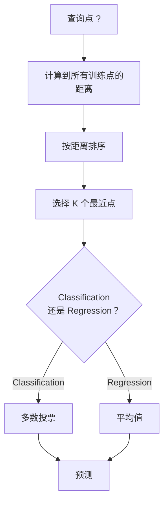
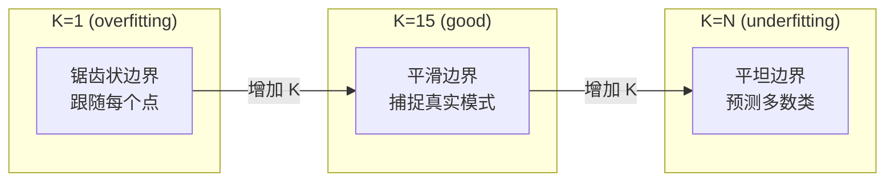
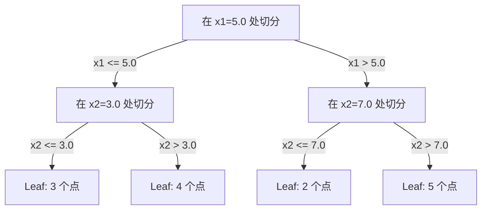

# أقرب جيران و المسافات

> تخزين كل شيء. من خلال النظر إلى جيرانهم لتنبؤ.

**Type:** Build
**Language:**بايثون
**前置要求：**المرحلة الأولى ((المدرسة 14 القواعد والمسافات)
**Time:** ~90 分钟

## 學习目标
- من التحقق من KNN التصنيف و الرجوع، دعم المخصصة K و المسافة إضافة الحق في التصويت
- مقارنة L1、L2、كوسين و Minkowski  المسافة القياسية، ومحاولة اختيار نوع البيانات المحدد مناسبة للقياس
-  شرح الكوارث الكبيرة، ومعرض لماذا KNN في كاوفيس وسط التراجع
- بناء شجرة كيه دي لتحقيق عالية الكفاءة في البحث عن القريب القريب،并 تحليل ذلك هو أفضل من القوة الوحشية

## 问题
لديك مجموعة بيانات جديدة. نقطة بيانات جديدة قد وصلت. تحتاج إلى تصنيفها أو توقع قيمتها. مع العناصر التي تتعلم من البيانات مثل التراجع السطحي أو SVMs ، تحتاج فقط إلى العثور على نقطة تدريب K قريبة من النقطة الجديدة ، وجعلها تصوت.

هذا هو أقرب جيران K. لا يوجد مرحلة تدريبية. لا حاجة إلى تعلّم العناصر. لا حاجة إلى تقليل وظيفة الخسارة.

يبدو الأمر بسيطًا إلى عدم وجود قدرة على العمل. ولكن KNN تنافس بشكل متوقع على العديد من القضايا ، خاصة في المجموعة الصغيرة والمتوسطة من البيانات.

KNN أيضاً باسم مختلف في مختلف أماكن الذكاء الاصطناعي الحديث. قواعد البيانات المتجهة في Embeddings على تنفيذ بحث KNN.

## 概念
### كيف تعمل KNN

أعطينا مجموعة بيانات مع نقطة تعيين ومنها نقطة استفسار جديدة:

1.  حساب المسافة بين نقطة استفسار إلى مركز البيانات
2.  حسب المسافة
3. 取最近的 K 个点
4. 对于分类: فى K 个邻居进行多数投票
5. 对于回归:对 K 个邻居的值取平均 (معدل)



هذا هو الحساب الكامل. لا يوجد أي إعداد. لا يوجد نسبة التراجع.

### اختيار K

K هو المعيار المفرط الوحيد.

| K | 行为 |
|---|----------|
| K = 1 | 决策边界跟随每一个点。训练误差为零。高方差。Overfits |
| Small K (3-5) | 对局部结构敏感。可以捕捉复杂边界 |
| Large K | 边界更平滑。对噪声更稳健。可能 underfit |
| K = N | 对每个点都预测多数类。最大 bias |

常见起点是对包含N 个点的数据集使用 K = sqrt(N)。二分类时使用奇数 K,以避免平票。



### مقاييس المسافة

距离函数定义了什么叫近──不同度量会产生不同的邻居、不同的预测──

**L2 (Euclidean)**هو اختيار متوقع.

```
d(a, b) = sqrt(sum((a_i - b_i)^2))
```

حساسة للميزات. استخدام L2 و KNN.

**L1 (Manhattan)**على الاختلافات المطلقة.

```
d(a, b) = sum(|a_i - b_i|)
```

**Cosine distance**衡量                                                                                                                                                                                                                                                             

```
d(a, b) = 1 - (a . b) / (||a|| * ||b||)
```

**Minkowski**استخدام المعايير p 泛化 L1 و L2

```
d(a, b) = (sum(|a_i - b_i|^p))^(1/p)

p=1: Manhattan
p=2: Euclidean
p->inf: Chebyshev (max absolute difference)
```

استخدام أي نوع من القياسات يعتمد على البيانات:

| 数据类型 | 最佳度量 | 原因 |
|-----------|------------|-----|
| 数值特征，尺度相近 | L2 (Euclidean) | 默认选择，适用于空间数据 |
| 数值特征，存在 outliers | L1 (Manhattan) | 稳健，不会放大大差异 |
| Text embeddings | Cosine | 大小是噪声，方向是含义 |
| 高维稀疏 | Cosine 或 L1 | L2 受维度灾难影响严重 |
| 混合类型 | Custom distance | 按特征类型组合度量 |

### KNN الموزن

标准 KNN يعطي جميع الجيران الـ K نفس الوزن. ولكن المسافة من جيرانه 0.1 يجب أن تكون أكثر أهمية من مسافة جيرانه 5.0.

**Distance-weighted KNN**按距离的倒数为每个邻居加权:

```
weight_i = 1 / (distance_i + epsilon)

For classification: weighted vote
For regression:     weighted average = sum(w_i * y_i) / sum(w_i)
```

عندما تتطابق نقاط الاستفسار مع نقاط التدريب تماما، يمكن أن يمنع الاختلاف إلى صفر.

الوزن KNN لا حساس جدا لخيار K، لأن الجيران البعيدين  مهما كان المساهمة  هم صغير جدا.

### 维度灾难

إن الأداء في الكونغرس يزداد تدهورًا.

**问题 1：距离会收敛。**مع زيادة الدرجة، فإن النسبة بين أقصى مسافة وأقصر مسافة تقترب من 1 ∙ كل النقاط تصبح مثل نقاط الاستفسار ∙

```
In d dimensions, for random uniform points:

d=2:    max_dist / min_dist = varies widely
d=100:  max_dist / min_dist ~ 1.01
d=1000: max_dist / min_dist ~ 1.001

When all distances are nearly equal, "nearest" is meaningless.
```

**问题 2：体积会爆炸。**لتحقيق نسبة ثابتة من البيانات للاستكشاف من قوارب K، تحتاج إلى توسيع نصف البحث، لتغطية جزء كبير من المجال.

**问题 3：角落占主导。**في d 维单位超立方体، تركز معظم الكمبيوترات حول الزاوية، وليس في المركز. مع نمو d , يتجه عدد الكمبيوترات المحتوية على الكواكب إلى داخل d  إلى زيادة نحو صفر.

النتيجة الفعلية: كينن تبدوا بشكل جيد في حوالي 20-50 خصائص. بعد تجاوز هذا المدى، تحتاج إلى إجراء تخفيض الأبعاد في تطبيق KNN قبل (PCA 、UMAP、t-SNE) ، أو استخدام استخدام قادر على استخدام البيانات داخل بنية بحث شجرة على أساس الهياكل المنخفضة.

### شجرة كيه دي: أسرع سرعت الجار القريب 搜索

قوة القوة الخامة KNN سوف يحسب نقطة استفسار إلى مسافة كل نقطة تدريب. تعقيد كل استفسار هو O(n * d) ◊ بالنسبة لمجموعة بيانات كبيرة، وهذا بطيء جدا.

كيه دي-شجرة سوف تتبع خصائص المحور المرتدي إلى الفضاء المقطوع. في كل طبقة، فإنه يتم القيام بتقطيعها على طول طول واحد حسب الوسط.



为了 البحث عن أقرب جيران، أولاً عبر الأشجار إلى تحتوي على ورقة من نقاط البحث، ثم العودة، ويمكن فقط في المنطقة المجاورة أن تحتوي على نقاط أقرب فقط فحصها.

平均查询时间:低维时为 O(log n) ・・・ ولكن الأشجار KD 在高维(d > 20) سوف تتحول إلى O(n) ، لأن التداول يمكن إزالة التداولات

### أشجار الكرة: 更适合中等维度

ستقوم أشجار الكرة بتقسيم البيانات إلى كُرُكَةٍ فوق كُرُكَةٍ في خيوطٍ، بدلاً من صندوقٍ محوريٍ. كل نقطة تعريف كرةٍ واحدةٍ، مركزٍ + نصف قطر، وتحتوي على كل نقطةٍ في هذه الشجرة.

مقارنة شجرة كيه دي
- في الوسط الوسط أفضل
- 能处理 غير محور على بنية
- أكثر حدة الحدود يعني أنه عند البحث يمكن قطع المزيد من الأغصان

شجرة كيه دي و شجرة الكرة كلها خطوات دقيقة.

### التعلم الباكس مقابل التعلم السعيد

ك.ن.ن. هو متعلم لاعب: تدريب في الوقت لا يفعل العمل، كل العمل كله في الوقت التنبؤ يتم الانتهاء. معظم الخوارزميات الأخرى ((الانسحاب الخطى، SVMs، شبكات العصبية) هي متعلمين حريصين: يقومون في التدريب بعمل الحسابات الكبيرة لبناء نماذج صارمة، ثم التنبؤ سريعًا.

| 方面 | Lazy (KNN) | Eager (SVM, neural net) |
|--------|------------|------------------------|
| 训练时间 | O(1)，只存储数据 | O(n * epochs) |
| 预测时间 | 每次查询 O(n * d) | O(d) 或 O(parameters) |
| 预测时内存 | 存储整个训练集 | 只存储模型参数 |
| 适应新数据 | 立即添加点 | 重新训练模型 |
| 决策边界 | 隐式，在运行时计算 | 显式，训练后固定 |

التعلم الباكس 适合以下场景:
- اعداد و شمار集频繁变化 ((无需重新训练即可添加/删除点)
- فقط تحتاج إلى استفسار قليل من التنبؤ
- أنت تريد تدريب الوقت إلى صفر
- "تلك هي القوة الوحشية"

### KNN للعودة

إن رجعة KNN لا تقوم بأغلبية التصويت، بل تحدد قيمة الأهداف المتوسطة للجيران.

```
prediction = (1/K) * sum(y_i for i in K nearest neighbors)

Or with distance weighting:
prediction = sum(w_i * y_i) / sum(w_i)
where w_i = 1 / distance_i
```

إن رجعة KNN 产生分段常数预测(استخدام加权时为分段平滑) ・・・ لا يمكن أن يتم خارجها خارج نطاق بيانات التدريب。 إذا كان هدف التدريب كله بين 0 إلى 100 ، فإن KNN 永远 لن يتوقع 200。


```figure
knn-smoothness
```

## بناءها
### 步骤 1: وظائف المسافة

实现 L1、L2、cosine 和 Minkowski 距离──这些内容直接连接到阶段 1 课堂 14──

```python
import math

def l2_distance(a, b):
    return math.sqrt(sum((ai - bi) ** 2 for ai, bi in zip(a, b)))

def l1_distance(a, b):
    return sum(abs(ai - bi) for ai, bi in zip(a, b))

def cosine_distance(a, b):
    dot_val = sum(ai * bi for ai, bi in zip(a, b))
    norm_a = math.sqrt(sum(ai ** 2 for ai in a))
    norm_b = math.sqrt(sum(bi ** 2 for bi in b))
    if norm_a == 0 or norm_b == 0:
        return 1.0
    return 1.0 - dot_val / (norm_a * norm_b)

def minkowski_distance(a, b, p=2):
    if p == float('inf'):
        return max(abs(ai - bi) for ai, bi in zip(a, b))
    return sum(abs(ai - bi) ** p for ai, bi in zip(a, b)) ** (1 / p)
```

### 步骤 2: تصنيف KNN ومرجع

- بناء KNN كامل، دعم K  مقياس المسافة ومزيد من المسافة المختارة

```python
class KNN:
    def __init__(self, k=5, distance_fn=l2_distance, weighted=False,
                 task="classification"):
        self.k = k
        self.distance_fn = distance_fn
        self.weighted = weighted
        self.task = task
        self.X_train = None
        self.y_train = None

    def fit(self, X, y):
        self.X_train = X
        self.y_train = y

    def predict(self, X):
        return [self._predict_one(x) for x in X]
```

### 步骤 3: شجرة كيه دي للبحث الفعال

من صفر بناء شجرة كد، حسب كل درجة من المتوسط العدد يعود إلى

```python
class KDTree:
    def __init__(self, X, indices=None, depth=0):
        # Recursively partition the data
        self.axis = depth % len(X[0])
        # Split on median of the current axis
        ...

    def query(self, point, k=1):
        # Traverse to leaf, then backtrack
        ...
```

完整实现见 `code/knn.py`ويحتوى فيه كل الأساليب والإعراضات المساعدة

### الخطوة 4: تحديد الميزات

يُريد KNN أن يُقَدِّم الميزات، لأن المسافة إلى الميزات ذات الحساسية الكبيرة.

```python
def standardize(X):
    n = len(X)
    d = len(X[0])
    means = [sum(X[i][j] for i in range(n)) / n for j in range(d)]
    stds = [
        max(1e-10, (sum((X[i][j] - means[j]) ** 2 for i in range(n)) / n) ** 0.5)
        for j in range(d)
    ]
    return [[((X[i][j] - means[j]) / stds[j]) for j in range(d)] for i in range(n)], means, stds
```

## استخدمها
استخدام المعلم:

```python
from sklearn.neighbors import KNeighborsClassifier
from sklearn.preprocessing import StandardScaler
from sklearn.pipeline import Pipeline

clf = Pipeline([
    ("scaler", StandardScaler()),
    ("knn", KNeighborsClassifier(n_neighbors=5, metric="euclidean")),
])
clf.fit(X_train, y_train)
print(f"Accuracy: {clf.score(X_test, y_test):.4f}")
```

عندما يكون المجموعة البيانية كبيرة بما فيه الكفاية وعلى درجة منخفضة بما فيه الكفاية، سيتم استخدام الشجرة الكهربائية أو الشجرة الكرة تلقائياً.`algorithm`الحكم على هذا النقطة

对于大规模近邻搜索 ((数百万个矢量), باستخدام قاعدة بيانات FAISS、Annoy أو Vector:

```python
import faiss

index = faiss.IndexFlatL2(dimension)
index.add(embeddings)
distances, indices = index.search(query_vectors, k=5)
```

## التدريب
1. في مجموعة بيانات ثنائية الأبعاد التي تحتوي على 3 فئات لتحقيق تصنيف KNN. رسم K=1 K=5 K=15 و K=N الحدود القرارية. مراقبة من التحول من الملاءمة المفرطة إلى عدم الملاءمة.

2. في 2、5、10、50、100 和 500 维中生成 1000 个随机点──对每维度,计算最大对距离与最小对距离的比值──绘制该比值随维度变化的图,以可视化维度灾难──

3. في المقال التصنيف  مشكلة على مقارنة KNN L1、L2 و المسافة الكوسينية ((استخدام متجهات TF-IDF)  أي نوع من القياسات تعطى أفضل دقة؟ لماذا الكوسين 往往在文本胜出؟

4. 实现 KD-tree، و في 2D、10D و 50D، بشكل منفصل على 1k、10k و 100k نقطة مجموعة بيانات قياس استفسار الوقت مع مقارنة القوة الخامة.

5. 为 y = sin(x) + ضجيج 构建一个重量KNregressor──将它与K=3、10、30的不重量KN比较──展示加权会产生更平滑的预测,特别是在K 较大时──

## 关键术语
| 术语 | 它实际意味着什么 |
|------|----------------------|
| K-nearest neighbors | 一种非参数算法，通过寻找距离查询点最近的 K 个训练点来预测 |
| Lazy learning | 训练时不进行计算。所有工作都发生在预测时。KNN 是典型例子 |
| Eager learning | 训练时进行大量计算以构建紧凑模型。大多数 ML 算法都是 eager |
| Curse of dimensionality | 在高维中，距离会收敛，neighborhoods 会扩展到覆盖空间的大部分，使 KNN 失效 |
| KD-tree | 沿特征轴递归划分空间的二叉树。在低维中查询为 O(log n) |
| Ball tree | 嵌套超球体构成的树。在中等维度（最高约 ~50）中比 KD-trees 表现更好 |
| Weighted KNN | neighbors 按距离倒数加权。更近的 neighbors 对预测影响更大 |
| Feature scaling | 将特征归一化到可比较范围。KNN 等基于距离的方法需要它 |
| Majority vote | 通过统计 K 个 neighbors 中哪个类别最常见来进行 Classification |
| Brute force search | 计算到每个训练点的距离。每次查询 O(n*d)。精确但在大 n 时很慢 |
| Approximate nearest neighbor | 能比精确搜索快得多地找到近似最近点的算法（HNSW、LSH、IVF） |
| Voronoi diagram | 一种空间划分，其中每个区域包含所有比任何其他训练点都更接近某个训练点的点。K=1 KNN 会产生 Voronoi 边界 |

## 延伸阅读
- [Cover & Hart: Nearest Neighbor Pattern Classification (1967)](https://ieeexplore.ieee.org/document/1053964)- 奠基性的 KNN 论文, يثبت معدل خطأها إلى حد ما لـ Bayes المثالي
- [Friedman, Bentley, Finkel: An Algorithm for Finding Best Matches in Logarithmic Expected Time (1977)](https://dl.acm.org/doi/10.1145/355744.355745)- 原始 كدي-شجرة 论文
- [Beyer et al.: When Is "Nearest Neighbor" Meaningful? (1999)](https://link.springer.com/chapter/10.1007/3-540-49257-7_15)- أقرب جيران 维度灾难的形式化分析
- [scikit-learn Nearest Neighbors documentation](https://scikit-learn.org/stable/modules/neighbors.html)- 包含算法选择的实践指南
- [FAISS: A Library for Efficient Similarity Search](https://github.com/facebookresearch/faiss)- الميتا تستخدم في درجة مليارات تقريبي بحث القريب القريب من مخزن
