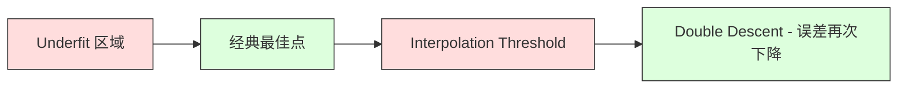
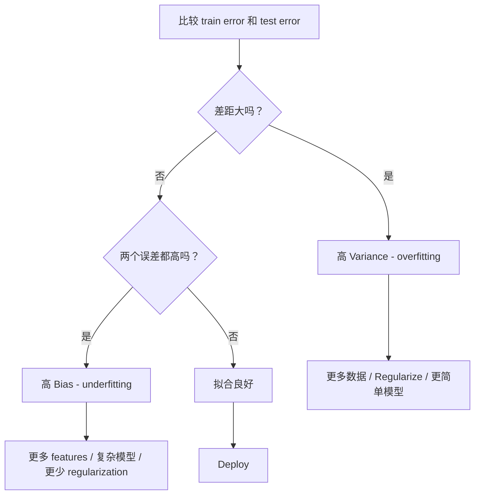
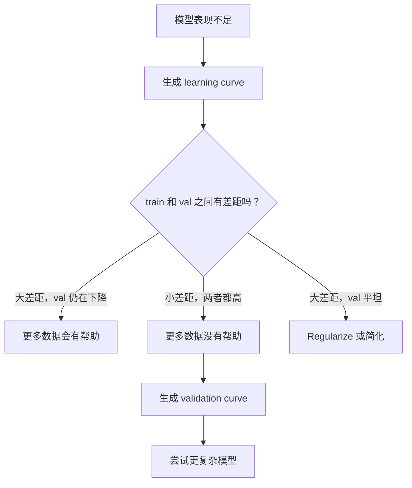

# التجارة المتعددة التغيرات

> كل نوع من الأخطاء النموذجية تأتي من ثلاثة مصادر: التحيز أو التغير أو الضجيج.

**Type:** Learn
**Language:**بايثون
**Prerequisites:** Phase 2, Lessons 01-09（ML 基础、Regression、Classification、评估）
**Time:** ~75 分钟

## 學习目标
- 推导期望预测 خطأ التمييز- المتغيرات تفصل،并 تفسير تأثير الضجيج غير المقرب
- استخدام تدريب خطأ و اختبار خطأ نموذج تشخيص ما إذا كان هناك تعصب أو اختلاف كبير
- 解释 تنظيم 技术(L1、L2、إسقاط、وقف مبكر) كيف تستخدم التحيز 换取 التغير
- 实现 تجربة،可视化不同复杂性模型 التداول التمييز-التغيرات

## 问题
أنت تدرب على نموذج. هناك خطأ في بيانات الاختبار. من أين يأتي هذا الخطأ؟

إذا كان نموذجك بسيطًا جدًا (على سبيل المثال ، باستخدام التراجع الخطي في مجموعات البيانات المزمنة) ، فسوف يستمر في خطأ ما فوق النموذج الحقيقي. هذا هو التحيز. إذا كان نموذجك معقدًا جدًا (على سبيل المثال ، باستخدام تعدد درجة 20 على 15 نقطة بيانات) ، فسوف يصل إلى التدريب الكامل للبيانات ، ولكن في البيانات الجديدة يقدم توقعات تغيرات كبيرة. هذا هو التباين.

 بالنسبة إلى قدرة النموذج الثابتة، لا يمكنك تحدّيد الاثنين في نفس الوقت  تخفيض التحيزات، والبوارث تتزايد  تخفيض التغيرات، والبوارث تتزايد  فهم هذا التنازل هو مهارة التشخيص الأكثر فائدة في التعلم الآلي  يخبرك أنه يجب أن يجعل النموذج أكثر تعقيدا أو بسيطة، يجب أن يحصل على المزيد من البيانات أو تصميم ميزات أفضل، يجب أن يُقويض أو يضعف التنظيم 

## 概念
### التحيز: 系统性错差

تعصب هو درجة التباين بين متوسط التنبؤات والقيمة الحقيقية للموديل. إذا كنت تدرب على نفس النموذج في مجموعة من التدريبات المختلفة من نفس التوزيع، ومع ذلك، تعصب هو الفرق بين متوسط القيمة والقيمة الحقيقية.

تعني العنصرية العالية أن النموذج صعب جداً، لا يمكن أن يلتقط النموذج الحقيقي.

```
高 Bias（underfitting）：
  模型总是预测大致相同的错误结果。
  训练误差：高
  测试误差：高
  二者差距：小
```

### التباين: حساسية بيانات التدريب

تغيرات متغيرة: تغيرات متغيرة في التدريبات، وذلك عندما تتدرب على مجموعة مختلفة من البيانات.

تعني التباين العالي أن النموذج يستخدم ضجيج في بيانات التدريب الملائمة، وليس إشارة أسفل.

```
高 Variance（overfitting）：
  模型完美拟合训练数据，但在新数据上失败。
  训练误差：低
  测试误差：高
  二者差距：大
```

### التفكك

يمكن تحليل الخطأ المتوقع عند أي نقطة x إلى:

```
Expected Error = Bias^2 + Variance + Irreducible Noise

where:
  Bias^2   = (E[f_hat(x)] - f(x))^2
  Variance = E[(f_hat(x) - E[f_hat(x)])^2]
  Noise    = E[(y - f(x))^2]             (sigma^2)
```

- `f(x)`هو فعل حقيقي
- `f_hat(x)`是模型预测
- `E[...]`هو توقعات مختلفة
- `y`هو مشاهدة إلى اللقب (((

噪音项是不可约束的. في بيانات الضوضاء، لا يوجد نموذج يمكن أن تفعل أفضل من sigma^2. مهمتك هي إيجاد التوازن الصحيح بين التحيز^2 والاختلاف.

### تعقيد النموذج مقابل خطأ


经典的U 形曲线:

| Complexity | Bias | Variance | Total Error |
|-----------|------|----------|-------------|
| 过低 | 高 | 低 | 高（underfitting） |
| 刚刚好 | 中等 | 中等 | 最低 |
| 过高 | 低 | 高 | 高（overfitting） |

### 作为偏差变化 控制的规范

التنظيم سوف يكون له علاقة بزيادة التحيزات لتقليل التباينات.

- **L2 (Ridge):**سوف يعيد الملكية إلى الصفر.
- **L1 (Lasso):**将某些权重精确推推到零──执行 الاختيار الميزة──
- **Dropout:**في أثناء التدريب مع وقف استخدام الخلايا العصبية.
- **Early stopping:**في الموديل تماماً مُعدّل التدريبات قبل أن توقف التدريبات

التنظيم 强度(lambda、 dropup rate、epoch 数) سيسيطر مباشرة على موقعك على منحنى التنظيم 更多 التنظيم يعني المزيد من التنظيم 更多

### النزول المزدوج: 现代视角

النظرية الكلاسيكية تقول: بعد تجاوز أفضل النقاط، فإن المزيد من التعقيدات دائمًا مؤذية. ولكن أظهرت الدراسات منذ عام 2019 ظاهرة غير متوقعة. إذا استمرت في زيادة قدرة النموذج إلى حد بعيد عن حد التقاطع.



هذا النوع من "النزول المزدوج"  الظاهرة تفسر لماذا الشبكات العصبية المفرطة في الحجم الكبير (عدد العناصر بعيد عن النموذج المدرب) لا يزال يمكن تعميمها بشكل جيد.

حول النزول المزدوج
- يظهر في النماذج الخطية، شجرة القرار والشبكات العصبية
- في التقاطع  منطقة, المزيد من البيانات في الواقع قد تكون ضارة
- 更多 تدريب دور أيضا قد يؤدي إلى ذلك ((التراجع المزدوج في العصر)
- التنظيم سوف يُسطح القيمة القصوى، ولكن لن يُزيلها

لماذا يحدث هذا؟ في عتبة التقاطع، فإن النموذج كان جيداً لديه قدرة كافية لتلائم جميع نقاط التدريب. تم إضطلاعه إلى حل محدد للغاية، وهذا الحل عبر كل نقطة، والاضطرابات الصغيرة في البيانات يؤدي إلى تغيير كبير في المعدل. هنا هو التباين.

| Regime | Parameters vs Samples | Behavior |
|--------|----------------------|----------|
| Underparameterized | p << n | 经典 tradeoff 适用 |
| Interpolation threshold | p ~ n | Variance 达到峰值，测试误差激增 |
| Overparameterized | p >> n | Implicit regularization 开始起作用，测试误差下降 |

من وجهة نظر عملية: إذا كنت تستخدم شبكات عصبية أو مجموعات شجرة كبيرة، لا تقف في عتبة التقاطع.

### تشخيص نموذجك



| Symptom | Diagnosis | Fix |
|---------|-----------|-----|
| 高 train error，高 test error | Bias | 更多 features、复杂模型、更少 regularization |
| 低 train error，高 test error | Variance | 更多数据、regularization、更简单模型、dropout |
| 低 train error，低 test error | 拟合良好 | Ship it |
| Train error 下降，test error 上升 | Overfitting 正在发生 | Early stopping |

### استراتيجيات عملية

**当 Bias 是问题时：**
- 添加 تعدد أو ميزات التفاعل
- استخدام أكثر لونية النموذج (مثل استخدام مجموعة الأشجار بدلا من الخط)
- حد من قوة التنظيم
- 訓練更久 ((إذا لم تتلقى)

**当 Variance 是问题时：**
-  الحصول على المزيد من التدريبات
- استخدام الأدغال (غابات عشوائية)
- زيادة التنظيم ((更高 لامبدا、更多 التخلي عن العمل)
- اختيار الميزات (تحويل الميزات الضوضاء)
- استخدم التحقق المتقاطع

### تجميع الأساليب 和方差降低

أساليب الجمع هي أداة عملية في مجال مقاومة التباين

**Bagging (Bootstrap Aggregating)**في بعض العينات التدريبية، يتم تدريب العديد من النماذج، ثم يتم أخذ المتوسط. في كل نموذج منفرد، هناك اختلافات عالية، ولكن المتوسط من المتغيرات يجب أن يكون أقل بكثير.

السبب في أنه فعال في الرياضيات هو: إذا كان متوسط N 个独立预测، كل تغير في التنبؤات هو sigma^2, ثم المتوسط في التغير هو sigma^2 / N.

**Boosting**通過 ترتيب بناء النماذج لتقليل التحيزات، كل نموذج جديد منهم يركز على الأخطاء الحالية الجمعية.

| Method | Primary Effect | Bias Change | Variance Change |
|--------|---------------|-------------|-----------------|
| Bagging | 降低 Variance | 不变 | 降低 |
| Boosting | 降低 Bias | 降低 | 可能增加 |
| Stacking | 同时降低两者 | 取决于 meta-learner | 取决于 base models |
| Dropout | Implicit bagging | 略微增加 | 降低 |

**实践规则：**إذا كان نموذجك الأساسي لديه متغيرات عالية ((شجرة عميقة ‒ تعدد الكلمات عالية الدرجة) ، استخدم التعبئة‬‬‬‬إن كان نموذجك الأساسي لديه تعصب عالية‬‬العصبات الضفيفة‬‬‬الموديلات الخطية البسيطة‬‬‬‬‬‬استعمال تعزيز‬‬‬‬‬‬‬‬‬‬‬‬‬‬‬‬‬‬‬‬‬‬‬‬‬‬‬‬‬‬‬‬‬‬‬‬‬‬‬‬‬‬‬‬‬‬‬‬‬‬‬‬‬‬‬‬‬‬‬‬‬‬‬‬‬‬‬‬‬‬‬‬‬‬‬‬‬‬‬‬‬‬‬‬‬‬‬‬‬‬‬‬‬‬‬‬‬‬‬‬‬‬‬‬‬‬‬‬‬‬‬‬‬‬‬‬‬‬‬‬‬‬‬‬‬‬‬‬‬‬‬‬‬‬‬‬‬‬‬‬‬‬‬‬‬‬‬‬‬‬‬‬‬‬‬‬‬‬‬‬‬‬‬‬‬‬‬‬‬‬‬‬‬‬‬‬‬‬‬‬‬‬‬‬‬‬‬‬‬‬‬‬‬‬‬‬‬‬‬‬‬‬‬‬‬‬‬‬‬‬‬‬‬‬‬‬‬‬‬‬‬‬‬‬‬‬‬‬‬‬‬‬‬‬‬‬‬‬‬‬‬‬‬‬‬‬‬‬‬‬‬‬‬‬‬‬‬‬‬‬‬‬‬‬‬‬‬‬‬‬‬‬‬‬‬‬‬‬‬‬‬‬‬‬‬‬‬‬‬‬‬‬‬‬‬‬‬‬‬‬‬‬‬‬‬‬‬‬‬‬‬‬‬‬‬‬‬‬‬‬‬‬‬‬‬‬‬‬‬‬‬‬‬‬‬‬‬‬‬‬‬‬‬‬‬‬‬‬‬‬‬‬‬‬‬‬‬‬‬‬‬‬‬‬‬‬‬‬‬‬‬‬‬‬‬‬‬‬‬‬‬‬‬‬‬‬‬‬‬‬‬‬‬‬‬‬‬‬‬‬‬‬‬‬‬‬‬‬‬‬‬‬‬‬‬‬‬‬‬‬

### منحنى التعلم

تعتبر منحنى التعلم خطورة للتدريب والخطأ في التحقق من الخطأ رسمها على غرار وظيفة كبيرة من مجموعات التدريب.


كيف تفهمهمهم:

| Scenario | Training Error | Validation Error | Gap | What It Means | What to Do |
|----------|---------------|-----------------|-----|---------------|------------|
| 高 Bias | 高 | 高 | 小 | 模型无法捕捉模式 | 更多 features、复杂模型、更少 regularization |
| 高 Variance | 低 | 高 | 大 | 模型记忆训练数据 | 更多数据、regularization、更简单模型 |
| 拟合良好 | 中等 | 中等 | 小 | 模型 generalizes well | Ship it |
| 高 Variance，正在改善 | 低 | 随更多数据下降 | 缩小 | 数据可以修复的 Variance 问题 | 收集更多数据 |
| 高 Bias，平坦 | 高 | 高且平坦 | 小且平坦 | 更多数据没有帮助 | 改变 model architecture |

关键洞察: إذا كانت المياه المتحركة في المياه، فإن الفجوة صغيرة جداً ولكن الثانية مرتفعة، فلن يكون هناك المزيد من البيانات المفيدة. تحتاج إلى نموذج أفضل.

### كيفية إنشاء منحنى التعلم

هناك طريقتان:

**Approach 1: 改变训练集大小，固定模型。**保持模型和高参数 不变──在越来越大的训练数据集上训练──测量每大小下面的训练错误和验证错误──这是标准学习曲线──

**Approach 2: 改变模型复杂度，固定数据。**保持数据不变──扫描一个复杂度参数(درجة متعددة الحدود、عمق الأشجار、طبقات 数量)── قياس كل خطأ تدريبية وتحقيق خطأ التحقق تحت التعقيد── هذا منحنى التحقق، سوف يظهر مباشرة التداول بين التغيرات المتضايقة──

هذه الطرق تكتمل بعضها البعض. الأول يخبرك ما إذا كان البيانات أكثر مفيدا. الثاني يخبرك ما إذا كان النموذج المختلف مفيدا. قبل اتخاذ قرار الخطوة التالية، يجب أن تعمل كلاهما.




```figure
bias-variance
```

## بناءها
`code/bias_variance.py`وسط كودجية تعمل كاملة من التغيرات الحيزية تفصل تجربة.

### الخطوة 1: من وظيفة معروفة توليد بيانات مركبة

نحن نستخدم مع ضجيج غوسيان `f(x) = sin(1.5x) + 0.5x`◊ تعرف وظيفة حقيقية جعلنا يمكن حساب تحيزات ودوائرات دقيقة‬

```python
def true_function(x):
    return np.sin(1.5 * x) + 0.5 * x

def generate_data(n_samples=30, noise_std=0.5, x_range=(-3, 3), seed=None):
    rng = np.random.RandomState(seed)
    x = rng.uniform(x_range[0], x_range[1], n_samples)
    y = true_function(x) + rng.normal(0, noise_std, n_samples)
    return x, y
```

### الخطوة 2: bootstrap عينات و تعدد الكلمات

对于每一个多项式度,我们抽取许多bootstrap training sets,拟合多项式,并固定测试格 上记录预测――这将为每一个测试点提供一个预测分布――

```python
def fit_polynomial(x_train, y_train, degree, lam=0.0):
    X = np.column_stack([x_train ** d for d in range(degree + 1)])
    if lam > 0:
        penalty = lam * np.eye(X.shape[1])
        penalty[0, 0] = 0
        w = np.linalg.solve(X.T @ X + penalty, X.T @ y_train)
    else:
        w = np.linalg.lstsq(X, y_train, rcond=None)[0]
    return w
```

نحن نستخدم 200 عينات مختلفة من الشرائح التابعة للشروع، كل عينة من الشرائح التابعة للشرائح التابعة لها تم استخراجها من نفس التوزيع الأساسي، ولكن تحتوي على نقاط مختلفة.

### 步骤 3: الحساب التحيز^2, التفكك المتغير

مع 200 مجموعة من التوقعات على كل نقطة اختبار، يمكننا تحليلها مباشرة حسب التعريف:

```python
mean_pred = predictions.mean(axis=0)
bias_sq = np.mean((mean_pred - y_true) ** 2)
variance = np.mean(predictions.var(axis=0))
total_error = np.mean(np.mean((predictions - y_true) ** 2, axis=1))
```

- `mean_pred`هو من عينات التشغيل  التقديرات E[f_hat(x)
- `bias_sq`هو مربع الفجوة بين متوسط التوقعات والقيمة الحقيقية
- `variance`هو عبر عينات التشغيل
- `total_error`应该近似等于 تحيز^2 + تغير + ضجيج

### الخطوة الرابعة: منحنى التعلم

منحنى التعلم في الحفاظ على تعقيد النموذج ثابتة في نفس الوقت مسح التدريبات الكبيرة.

```python
def demo_learning_curves():
    sizes = [10, 15, 20, 30, 50, 75, 100, 150, 200, 300]
    degree = 5

    for n in sizes:
        train_errors = []
        test_errors = []
        for seed in range(50):
            x_train, y_train = generate_data(n_samples=n, seed=seed * 100)
            w = fit_polynomial(x_train, y_train, degree)
            train_pred = predict_polynomial(x_train, w)
            train_mse = np.mean((train_pred - y_train) ** 2)
            test_pred = predict_polynomial(x_test, w)
            test_mse = np.mean((test_pred - y_test) ** 2)
            train_errors.append(train_mse)
            test_errors.append(test_mse)
        # 对多次运行取平均，得到 learning curve 上的点
```

对于高变化 模型 ((小数据上的级 5), سوف ترى:
- التدريبات الفارق في البداية منخفضة جدا، مع المزيد من البيانات جعل الذاكرة صعبة وتزداد
- التقييمات الفارغة في البداية مرتفعة جدا، مع نموذج الحصول على المزيد من الإشارات وتراجع
- الفجوة تتقلص مع المزيد من البيانات

对于高偏 模型 ((درجة 1), خطأين تتراوح بسرعة إلى نفس القيمة العالية, المزيد من البيانات لا يساعد.

### 第5 步:تدريب التنظيم

代码 أيضاً `demo_regularization_sweep()`، فإنه يثبت تعدد درجة عالية ((درجة 15) ،并将 Ridge تنظيم قوة من 0.001 扫描 إلى 100 ⋅ هذا من زاوية أخرى يظهر التداول التفاوتية التفاوتية: نحن لا نغير تعقيد النموذج، ولكن تغيير قوة القيود.

```python
def demo_regularization_sweep():
    alphas = [0.001, 0.005, 0.01, 0.05, 0.1, 0.5, 1.0, 5.0, 10.0, 50.0, 100.0]
    for alpha in alphas:
        results = bias_variance_decomposition([15], lam=alpha)
        r = results[15]
        print(f"alpha={alpha:.3f}  bias={r['bias_sq']:.4f}  var={r['variance']:.4f}")
```

في درجة منخفضة من الفا، تحت 15 تعدد  تقريبا غير مقيدة.

هذا مع تغيير درجة الكتلة  تحصل على نفس U 曲线، فقط عبر هنا باستخدام سلسلة الدوران بدلا من اختيارات الانفصال للسيطرة. في الممارسة العملية، التنظيم هو الطريقة الأولى للسيطرة على هذا التداول، لأنه يسمح للسيطرة على الجزيئات الصغيرة، دون الحاجة إلى تغيير مجموعة الميزات.

## استخدمها
التعلم  المقدمة `learning_curve`和 `validation_curve`،يمكنك تلقائيّة هذه التشخيصات، دون الحاجة إلى كتابة حلقات التشغيل

### منحنى التحقق: مسح تعقيد النموذج

```python
from sklearn.model_selection import validation_curve
from sklearn.pipeline import make_pipeline
from sklearn.preprocessing import PolynomialFeatures
from sklearn.linear_model import Ridge

degrees = list(range(1, 16))
train_scores_all = []
val_scores_all = []

for d in degrees:
    pipe = make_pipeline(PolynomialFeatures(d), Ridge(alpha=0.01))
    train_scores, val_scores = validation_curve(
        pipe, X, y, param_name="polynomialfeatures__degree",
        param_range=[d], cv=5, scoring="neg_mean_squared_error"
    )
    train_scores_all.append(-train_scores.mean())
    val_scores_all.append(-val_scores.mean())
```

هذا سوف يعطيك مباشرة التداول التفاوت التفاوت التفاوت التفاوت التفاوت التفاوت التفاوت التفاوت التفاوت التفاوت التفاوت التفاوت التفاوت التفاوت التفاوت التفاوت التفاوت التفاوت التفاوت التفاوت التفاوت التفاوت التفاوت التفاوت التفاوت التفاوت التفاوت التفاوت التفاوت التفاوت التفاوت التفاوت التفاوت التفاوت التفاوت التفاوت التفاوت التفاوت التفاوت التفاوت التفاوت التفاوت التفاوت التفاوت التفاوت التفاوت التفاوت التفاوت التفاوت التفاوت التفاوت التفاوت التفاوت التفاوت التفاوت التفاوت التفاوت التفاوت التفاوت التفاوت التفاوت التفاوت التفاوت التفاوت التفاوت التفاوت التفاوت التفاوت التفاوت التفاوت التفاوت التفاوت التفاوت التفاوت التفاوت التفاوت التفاوت التفاوت التفاوت التفاوت التفاوت التفاوت التفاوت التفاوت التفاوت التفاوت التفاوت التفاوت التفاوت التفاوت التفاوت التفاوت التفاوت التفاوت التفاوت التفاوت التفاوت التفاوت التفاو التفاو التفاو التفاو التفاو التفاو التفاو التفاو التفاو التفاو التفاو التفاو التفاو التفاو التفاو التفاو التفاو التفاو التفاو التفاو التفاو التفاو التفاو التفاو التفاو التفاو التفاو التفاو التفاو التفاو التفاو التفاو التفاو التفاو التفاو التفاو التفاو التفاو التفاو التفاو التفاو التفاو التفاو التفاو التفاو التفاو التفاو التفاو التفاو التفاو التفاو التفاو التفاو التفاو التفاو التفاو التفاو التفاو التفاو التفاو التفاو التفاو التفاو التفاو التفاو التاو التفاو التفاو التفاو الت

### منحنى التعلم: مسح حجم مجموعة التدريب

```python
from sklearn.model_selection import learning_curve

pipe = make_pipeline(PolynomialFeatures(5), Ridge(alpha=0.01))
train_sizes, train_scores, val_scores = learning_curve(
    pipe, X, y, train_sizes=np.linspace(0.1, 1.0, 10),
    cv=5, scoring="neg_mean_squared_error"
)
train_mse = -train_scores.mean(axis=1)
val_mse = -val_scores.mean(axis=1)
```

ستعمل`train_mse`和 `val_mse`مقارنة`train_sizes`رسمها ستخبرك كل شيء عن النموذج

### استخدام التطبيقات 扫描的 交叉验证

```python
from sklearn.model_selection import cross_val_score

alphas = [0.001, 0.01, 0.1, 1.0, 10.0, 100.0]
for alpha in alphas:
    pipe = make_pipeline(PolynomialFeatures(10), Ridge(alpha=alpha))
    scores = cross_val_score(pipe, X, y, cv=5, scoring="neg_mean_squared_error")
    print(f"alpha={alpha:>7.3f}  MSE={-scores.mean():.4f} +/- {scores.std():.4f}")
```

هذا سوف يكون بسبب الصعبية المثبتة من النموذج مسح قوة التنظيم. سوف ترى نفس التحيز-التفاوت التجارية:

### 整合起来: كامل التشخيص سير العمل

في الممارسة، ستقوم بتنظيم هذه التشخيصات:

1. 訓練你的模型──计算火车 和 测试错误──
2. إذا كان كلتا مرتفعتين: لديك تحيزات  مشكلة  قفز إلى الخطوة 4‬
3. إذا كان التدريب 低但测试 高:你有变化 问题──生成学习曲线,看看看更多数据是否有帮助──如果没有,就定期化──
4. 生成 اعتبار منحنى، مسح العناصر المختلفة الرئيسية.
5. في أفضل النقاط، إنتاج منحنى التعلم. إذا كان الفجوة لا تزال كبيرة، تحتاج إلى المزيد من البيانات أو التنظيم.
6. استخدام `cross_val_score`尝试不同 ألفا 值的Ridge/Lasso──选择交叉验证错误 最低的 ألفا──

بالنسبة لمعظم مجموعات البيانات الجدولية، هذا يتطلب 10-15 دقيقة من الوقت الحساب، ولكن يمكن أن توفر عدد من ساعات التخمين.

## 交付 it
本课产出:`outputs/prompt-model-diagnostics.md`

## التدريب
1. استخدام `noise_std=0`(دون ضوضاء) عمل التفريق.

2. ستقوم التدريب على حجم مجموعة من 30  زيادة إلى 300  كيف يؤثر هذا على عنصر التباين؟

3. إلى تجربة إضافة L2 التنظيم ((رج رجسي)  بالنسبة لثابتة عالية الدرجة البولينومال ((درجة 15) ، سوف lambda من 0 扫描 إلى 100‬‬ رسم التحيز^2 和 التباين 随 lambda 变化的函数图‬‬‬‬‬‬‬‬‬‬‬‬‬‬‬‬‬‬‬‬‬‬‬‬‬‬‬‬‬‬‬‬‬‬‬‬‬‬‬‬‬‬‬‬‬‬‬‬‬‬‬‬‬‬‬‬‬‬‬‬‬‬‬‬‬‬‬‬‬‬‬‬‬‬‬‬‬‬‬‬‬‬‬‬‬‬‬‬‬‬‬‬‬‬‬‬‬‬‬‬‬‬‬‬‬‬‬‬‬‬‬‬‬‬‬‬‬‬‬‬‬‬‬‬‬‬‬‬‬‬‬‬‬‬‬‬‬‬‬‬‬‬‬‬‬‬‬‬‬‬‬‬‬‬‬‬‬‬‬‬‬‬‬‬‬‬‬‬‬‬‬‬‬‬‬‬‬‬‬‬‬‬‬‬‬‬‬‬‬‬‬‬‬‬‬‬‬‬‬‬‬‬‬‬‬‬‬‬‬‬‬‬‬‬‬‬‬‬‬‬‬‬‬‬‬‬‬‬‬‬‬‬‬‬‬‬‬‬‬‬‬‬‬‬‬‬‬‬‬‬‬‬‬‬‬‬‬‬‬‬‬‬‬‬‬‬‬‬‬‬‬‬‬‬‬‬‬‬‬‬‬‬‬‬‬‬‬‬‬‬‬‬‬‬‬‬‬‬‬‬‬‬‬‬‬‬‬‬‬‬‬‬‬‬‬‬‬‬‬‬‬‬‬‬‬‬‬‬‬‬‬‬‬‬‬‬‬‬‬‬‬‬‬‬‬‬‬‬‬‬‬‬‬‬‬‬‬‬‬‬‬‬‬‬‬‬‬‬‬‬‬‬‬‬‬‬‬‬‬‬‬‬‬‬‬‬‬‬‬‬‬‬‬‬‬‬‬‬‬‬‬‬‬‬‬‬‬‬‬‬‬‬‬‬‬‬‬‬‬‬‬‬‬‬‬‬‬‬‬‬‬‬‬‬‬‬‬‬‬

4. 将真实函数 من الكلمات المتعددة 修改为 `sin(x)`◊ تغير التغيرات الحيزية كيف تتغير؟ هل لا يزال هناك أفضل درجة واضحة؟

5. 实现 a simple bootstrap aggregating(bagging) wrapper: في عينات bootstrap 上训练 10 个模型并平均预测──展示这会降低变化,且几乎不增加偏见──

## 关键术语
| Term | What people say | What it actually means |
|------|----------------|----------------------|
| Bias | “模型太简单” | 来自错误假设的系统性误差。平均模型预测与真实值之间的差距。 |
| Variance | “模型在 overfitting” | 来自对训练数据敏感性的误差。预测在不同训练集之间变化的程度。 |
| Irreducible error | “数据中的噪声” | 来自真实数据生成过程中的随机性的误差。没有模型能消除它。 |
| Underfitting | “学得不够” | 模型有高 Bias。即使在训练数据上也会错过真实模式。 |
| Overfitting | “记住了数据” | 模型有高 Variance。它拟合了训练数据中无法 generalize 的噪声。 |
| Regularization | “约束模型” | 添加惩罚来降低模型复杂度，用 Bias 换取更低 Variance。 |
| Double descent | “更多参数可能有帮助” | 当模型容量远超 interpolation threshold 时，测试误差会再次下降。 |
| Model complexity | “模型有多灵活” | 模型拟合任意模式的容量。由 architecture、features 或 regularization 控制。 |

## 延伸阅读
- [Hastie, Tibshirani, Friedman: Elements of Statistical Learning, Ch. 7](https://hastie.su.domains/ElemStatLearn/)-- تغيرات التحيزات 分解的权威论述
- [Belkin et al., Reconciling modern machine learning practice and the bias-variance trade-off (2019)](https://arxiv.org/abs/1812.11118)-- نزول مزدوج
- [Nakkiran et al., Deep Double Descent (2019)](https://arxiv.org/abs/1912.02292)-- من خلال العصر و نموذج من خلال النزول المزدوج
- [Scott Fortmann-Roe: Understanding the Bias-Variance Tradeoff](http://scott.fortmann-roe.com/docs/BiasVariance.html)-- 清晰的可视化解释
