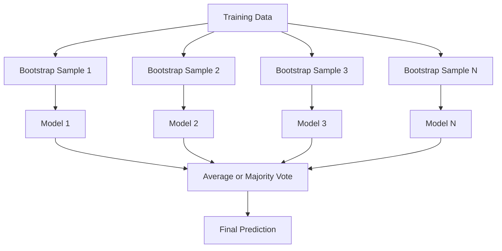
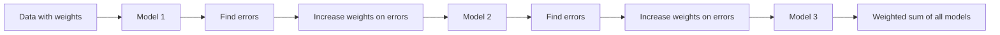
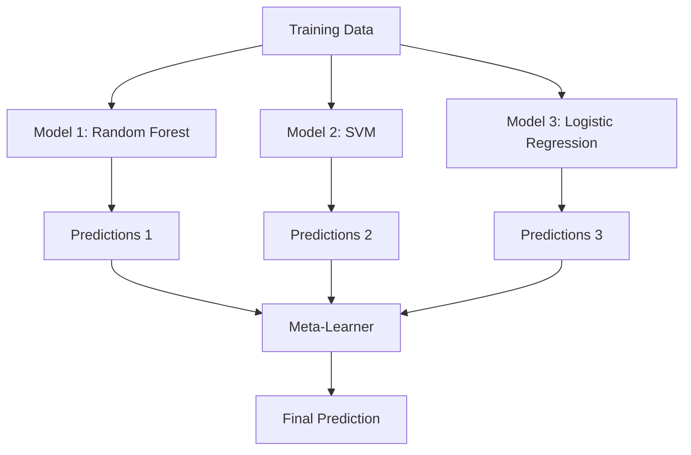

# تجميع الطرق

> مجموعة من المتعلمين الضعفاء، إذا كان صحيحاً، سوف يصبح متعلم قوياً.

**Type:** Build
**Language:**بايثون
**Prerequisites:** Phase 2, Lesson 10 (Bias-Variance Tradeoff)
**Time:** ~120 分钟

## 學习目标

- من التحقق من التدفقات التدريبية والتحركات التدريبية،并 شرح تعزيزات  كيفية تقليل التحديدات
- إنشاء مجموعة التعبئة، وتعرض على النموذج المتعلق للحصول على متوسط كيفية تقليل التباين في حالة عدم زيادة التحيز
- من كل طريقة تستهدف عنصر الخطأ
- 评估 ensemble diversity,并解释为什么随着更多独立弱的学习者加入,

## 问题

شجرة قرار واحدة  تدريب سريع وسهل التفسير ، ولكن سوف تتجاوزها  النموذج الخطري واحد في الحدود المعقدة سوف تتجاوزها  يمكنك قضاء أيام قليلة من الوقت تصميم بنية نموذج كاملة  أو يمكنك جمع مجموعة من النماذج غير كاملة ، والحصول على نتيجة أفضل من أي من النماذج الواحدة منها 

أساليب الجمع هي بالضبط ما يتم القيام به. إنها في بيانات الجدولية 上赢 Kaggle 比赛最可靠ة التقنية، دعم على معظم إنتاج ML 系统، وأظهرت بشكل حيوي النتائج الفعلية للتداول بين التباينات التباينية-التباينات.

## 概念

### لماذا الجماعات فعالة

假设你有N 个独立分类器, كل من دقة 都是 p > 0.5──دقة أغلبية الأصوات 为:

```
P(majority correct) = sum over k > N/2 of C(N,k) * p^k * (1-p)^(N-k)
```

بالنسبة لـ 21 تصنيف دقيق ٪ 60 من التصنيفات، دقة غالبية الأصوات حوالي 74٪.

关键要求是 **diversity** إذا كانت جميع النماذج ترتكب نفس الأخطاء، فإن الجمع بينها لا يساعد على أي شيء.

- مختلفة عن التدريبات
- مختلفة من الميزات الفرعية ((غابات عشوائية)
- 顺序式 تصحيح الخطأ(تعزيز)
- مختلفة عن النموذج عائلة

### التجميع (التجميع من الشريط)

التعبئة من خلال مختلف عينات التدريب من بيانات التدريب



عينة البوتستراب هي نفس العينة التي تم استخراجها من البيانات الأصلية، والتي تظهر في كل عينة البوتستراب 63.2% من العينات الفريدة.

التعبئة في حالة عدم زيادة التحيز تقريباً تقلل من التباينات. كل شجرة منفصلة تتكيف مع عينات الشروع الخاصة بها، ولكن التكيف المفرط لكل شجرة مختلف، وبالتالي فإن متوسط التكيف مع الضوضاء يتطلب ذلك.

**Random Forests**يحتوي على آلية إضافية للتعبئة: في كل فصيل، فقط النظر في أي مجموعة فرعية من الميزات. هذا يضطر إلى خلق المزيد من التنوع بين الأشجار.`sqrt(n_features)`و الرجوع في المرحلة الوسطى`n_features / 3`.

### تعزيز (顺序式 خطأ تصحيح)

تعزيز 按顺序训练模型──每个新模型都关注之前模型预测错误的例子──



تعزيز  تقليل التحيز  كل نموذج جديد سيتم تصحيح الخطأ النظامي للمجموعة السابقة التنبؤ النهائي هو المبلغ الموزن لجميع النماذج، والذي يقدم نموذج أفضل يحصل على وزنه أعلى

الوزن هو: إذا تم تشغيل الكثير من الجولة، قد يكون الزيادة أكثر من اللازم، لأنه سوف يستمر في تكييف أمثلة أكثر صعوبة، بينما بعضها قد يكون مجرد ضجيج.

### إدارة

إدارة التكيف (التعزيز التكيفي) هي أول خوارزمية تعزيز عملية. يمكن استخدامها مع أي متعلم أساسي. عادة ما تستخدم جذوع القرار.

算法:

```
1. Initialize sample weights: w_i = 1/N for all i

2. For t = 1 to T:
   a. Train weak learner h_t on weighted data
   b. Compute weighted error:
      err_t = sum(w_i * I(h_t(x_i) != y_i)) / sum(w_i)
   c. Compute model weight:
      alpha_t = 0.5 * ln((1 - err_t) / err_t)
   d. Update sample weights:
      w_i = w_i * exp(-alpha_t * y_i * h_t(x_i))
   e. Normalize weights to sum to 1

3. Final prediction: H(x) = sign(sum(alpha_t * h_t(x)))
```

النموذج الذي يقل عن الخطأ يحصل على ألفا أعلى. يتم تقسيم العينات بشكل خاطئ يحصل على وزنه أعلى.

### زيادة تدريجية

تعزيز التدريجية سوف تعزيز 泛化 إلى أي وظيفة الخسارة.

```
1. Initialize: F_0(x) = argmin_c sum(L(y_i, c))

2. For t = 1 to T:
   a. Compute pseudo-residuals:
      r_i = -dL(y_i, F_{t-1}(x_i)) / dF_{t-1}(x_i)
   b. Fit a tree h_t to the residuals r_i
   c. Find optimal step size:
      gamma_t = argmin_gamma sum(L(y_i, F_{t-1}(x_i) + gamma * h_t(x_i)))
   d. Update:
      F_t(x) = F_{t-1}(x) + learning_rate * gamma_t * h_t(x)

3. Final prediction: F_T(x)
```

بالنسبة لخسارة الخطأ المربع، السدّ البقايا هي البقايا الفعلية:`r_i = y_i - F_{t-1}(x_i)`كل شجرة في الواقع كلها في حالة إعداد مجموعة سابقة

معدل التعلم (التقلص) تحكم درجة المساهمة في كل شجرة.

### XGBoost: لماذا يُستمر في تحديد بيانات الجدول

XGBoost (eXtreme Gradient Boosting) هو إضافة إلى تحسين التدفقات المرتفعة ، مما يجعلها سريعة الصمود ، وليس من السهل تجاوز:

- **Regularized objective:**على أوزان الأوراق إضافة عقوبات لـ 1 و لـ 2 ، لمنع شجرة واحدة
- **Second-order approximation:**مع استخدام المشتقات المرتبة الأولى والثانية من الخسارة، وبالتالي اتخاذ قرارات تقسيم أفضل
- **Sparsity-aware splits:**من خلال تعلم أفضل اتجاهات البيانات المفقودة في كل فصل
- **Column subsampling:**مثل الغابات العشوائية، كما في كل فصل، تظهر خصائص لزيادة التنوع
- **Weighted quantile sketch:**في البيانات الموزعة 上高效 البحث عن الميزات المستمرة من نقاط الانقسام
- **Cache-aware block structure:** لخطوط التخزين المتجهة لـ CPU  تحسين ترتيب الذاكرة

بالنسبة للبيانات الجدولية، فإن XGBoost ومتابعةها LightGBM) تستمر بشكل أفضل من شبكة العصبية. هذا لن يتغير في الأجل القريب. إذا كان بإمكانك وضع بياناتك في جدول الصفوف والعمود، فمن فضلكم قموا بتعزيز التدفقات.

### التجميع (التعلم المتوسط)

ستقوم التجميع بتنبؤات العديد من النماذج الأساسية كخصائص المتعلم المتحرك.



سيتعلم المتعلم المنتظم لأي مدخلات يجب أن يثق بها في أي نموذج أساسي. إذا كان الغابة العشوائية أفضل في بعض المناطق، بينما يتقدم التعلم المنتظم في المناطق الأخرى بشكل أفضل، سيتعلم المتعلم المنتظم على التوافقات.

 لتجنب تسرب البيانات، يجب أن تمرّ التنبؤات النموذج الأساسيّة بمجموعة تدريبية للتحقق من التحقق من الصلاحية المتقاطعة.

### التصويت

أسهل مجموعة... توقعات مجموعة مباشرة...

- **Hard voting:**على علامات الفئة  التصويت بأغلبية
- **Soft voting:**بالنسبة للإحتمالات المتوقعة طلب متوسط، اختر متوسط الإحتمالات أعلى فئة 


```figure
f3-ensemble-average
```

## بناءها

### الخطوة الأولى: القرارات القاسية

`code/ensembles.py`نَشَرْنا من قذف القرارِ  البدء: واحد واحد فقط شجرة مُنقسمة

```python
class DecisionStump:
    def __init__(self):
        self.feature_idx = None
        self.threshold = None
        self.polarity = 1
        self.alpha = None

    def fit(self, X, y, weights):
        n_samples, n_features = X.shape
        best_error = float("inf")

        for f in range(n_features):
            thresholds = np.unique(X[:, f])
            for thresh in thresholds:
                for polarity in [1, -1]:
                    pred = np.ones(n_samples)
                    pred[polarity * X[:, f] < polarity * thresh] = -1
                    error = np.sum(weights[pred != y])
                    if error < best_error:
                        best_error = error
                        self.feature_idx = f
                        self.threshold = thresh
                        self.polarity = polarity

    def predict(self, X):
        n = X.shape[0]
        pred = np.ones(n)
        idx = self.polarity * X[:, self.feature_idx] < self.polarity * self.threshold
        pred[idx] = -1
        return pred
```

### الخطوة 2: من الصفر لتحقيق AdaBoost

```python
class AdaBoostScratch:
    def __init__(self, n_estimators=50):
        self.n_estimators = n_estimators
        self.stumps = []
        self.alphas = []

    def fit(self, X, y):
        n = X.shape[0]
        weights = np.full(n, 1 / n)

        for _ in range(self.n_estimators):
            stump = DecisionStump()
            stump.fit(X, y, weights)
            pred = stump.predict(X)

            err = np.sum(weights[pred != y])
            err = np.clip(err, 1e-10, 1 - 1e-10)

            alpha = 0.5 * np.log((1 - err) / err)
            weights *= np.exp(-alpha * y * pred)
            weights /= weights.sum()

            stump.alpha = alpha
            self.stumps.append(stump)
            self.alphas.append(alpha)

    def predict(self, X):
        total = sum(a * s.predict(X) for a, s in zip(self.alphas, self.stumps))
        return np.sign(total)
```

### الخطوة الثالثة: من الصفر تحقيق التدريجية

```python
class GradientBoostingScratch:
    def __init__(self, n_estimators=100, learning_rate=0.1, max_depth=3):
        self.n_estimators = n_estimators
        self.lr = learning_rate
        self.max_depth = max_depth
        self.trees = []
        self.initial_pred = None

    def fit(self, X, y):
        self.initial_pred = np.mean(y)
        current_pred = np.full(len(y), self.initial_pred)

        for _ in range(self.n_estimators):
            residuals = y - current_pred
            tree = SimpleRegressionTree(max_depth=self.max_depth)
            tree.fit(X, residuals)
            update = tree.predict(X)
            current_pred += self.lr * update
            self.trees.append(tree)

    def predict(self, X):
        pred = np.full(X.shape[0], self.initial_pred)
        for tree in self.trees:
            pred += self.lr * tree.predict(X)
        return pred
```

### الخطوة 4: مقارنة مع

代码会验证 تنفيذاتنا من الصفر هل يمكن أن تنتج مع التجارة `AdaBoostClassifier`和 `GradientBoostingClassifier`مع دقة قريبة،并将所有方法并排比较.

## استخدمها

### كيف تستخدم كل طريقة

| Method | Reduces | Best for | Watch out for |
|--------|---------|----------|---------------|
| Bagging / Random Forest | Variance | noisy data、features 很多 | 对 bias 没有帮助 |
| AdaBoost | Bias | clean data、简单 base learners | 对 outliers 和 noise 敏感 |
| Gradient Boosting | Bias | tabular data、比赛 | 训练慢，不调参容易 overfit |
| XGBoost / LightGBM | Both | 生产环境 tabular ML | hyperparameters 很多 |
| Stacking | Both | 争取最后 1-2% accuracy | 复杂，存在 meta-learner overfitting 风险 |
| Voting | Variance | 快速组合 diverse models | 只有在模型足够 diverse 时才有帮助 |

### بيانات الجدولية

بالنسبة لمعظم مشاكل التنبؤ الجدولي، يُوصى بالقيام بالقيام بالقيام بالقيام بالقيام بالقيام بالقيام بالقيام بالقيام بالقيام بالقيام بالقيام بالقيام بالقيام بالقيام بالقيام بالقيام بالقيام بالقيام بالقيام بالقيام بالقيام بالقيام بالقيام بالقيام بالقيام بالقيام بالقيام بالقيام بالقيام بالقيام بالقيام بالقيام بالقيام بالقيام بالقيام بالقيام بالقيام بالقيام بالقيام بالقيام بالقيام بالقيام بالقيام بالقيام بالقيام بالقيام بالقيام بالقيام بالقيام بالقيام بالقيام:

1. استخدام الاختيارات**LightGBM 或 XGBoost**
2. 调优 n_estimators、تعلم_متعدد、أقصى_عمق、أقصر_وزن الطفل
3. إذا كنت بحاجة إلى 0.5% النهائي، بناء مجموعة التجميع التي تحتوي على 3-5 نماذج متنوعة
4. 全程使用 التحقق المتقاطع

على الرغم من أن البحوث لا تزال مستمرة، فإن شبكة العصبية في البيانات الجدولية تقريباً دائماً تتطلب زيادة التدفقات 差──TabNet、NODE وآخر بنية مماثلة يمكن أن تقترب من ذلك في بعض الأحيان، ولكن القليل يمكن أن يتجاوز المعدل XGBoost الجيد.

## 交付 it

本课会产出 `outputs/prompt-ensemble-selector.md`-- a help you for a given dataset  select adapt ensemble method                                                                                                                                                                                                                                                                                                                                                                                                                                                                                                                `outputs/skill-ensemble-builder.md`، يحتوي على كاملة

## التدريب

1. 修改 AdaBoost 实现, تتبع دقة التدريب بعد كل دورة  رسم دقة مقابل عدد من المقدرات 

2. 通過向回归树 添加随机特征子样本,从零实现一个随机森林──使用 `max_features=sqrt(n_features)`訓練 100 شجرة 并对预测 求平均──将变化减少与单树比较──

3. في زيادة التدرج 实现中添加早期停止: بعد كل دورة تتبع الخسارة التحقق، إذا لم يصل 10 دورات على التوتر فإنه توقف.

4. 构建一个包含三个基模型(لوجستية التراجع、 شجرة القرار、k- أقرب الجيران) و مجموعة تخزين للوجستية التراجعية المتحفز المتعلمة 使用五倍交叉验证 生成 meta-特征──与每个基模型 单独使用时比较──

5. في مجموعة بيانات واحدة، استخدام العناصر المخصصة لتشغيل XGBoost. هل ستعمل دقةها مع تراجعك من الصفر لتعزيز المقاربة.

## 关键术语

| Term | 常见说法 | 实际含义 |
|------|----------------|----------------------|
| Bagging | “在 random subsets 上训练” | Bootstrap aggregating：在 bootstrap samples 上训练模型，对 predictions 求平均以降低 variance |
| Boosting | “关注 hard examples” | 按顺序训练模型，每个模型纠正当前 ensemble 的错误，以降低 bias |
| AdaBoost | “重新加权数据” | 通过 sample weight updates 实现 boosting；misclassified points 会在下一个 learner 中获得更高 weight |
| Gradient boosting | “拟合 residuals” | 通过让每个新模型拟合 Loss Function 的 negative Gradient 来实现 boosting |
| XGBoost | “Kaggle 武器” | 带有 regularization、second-order optimization 和系统级加速技巧的 gradient boosting |
| Stacking | “模型叠在模型上” | 将 base models 的 predictions 作为 meta-learner 的 input features |
| Random forest | “许多 randomized trees” | 使用 decision trees 的 bagging，并在每次 split 时加入 random feature subsampling 以增加 diversity |
| Ensemble diversity | “犯不同错误” | 模型的错误必须不相关，ensemble 才能优于单个模型 |
| Out-of-bag error | “免费 validation” | 不在某次 bootstrap draw 中的 samples（约 36.8%）可作为 validation set，无需单独 holdout |

## 延伸阅读

- [Schapire & Freund: Boosting: Foundations and Algorithms](https://mitpress.mit.edu/9780262526036/)-- AdaBoost 创建者所著的书
- [Friedman: Greedy Function Approximation: A Gradient Boosting Machine (2001)](https://statweb.stanford.edu/~jhf/ftp/trebst.pdf)-- تطور التراجع الأصلي
- [Chen & Guestrin: XGBoost (2016)](https://arxiv.org/abs/1603.02754)-- XGBoost 论文
- [Wolpert: Stacked Generalization (1992)](https://www.sciencedirect.com/science/article/abs/pii/S0893608005800231)-- 原始堆叠 论文
- [scikit-learn Ensemble Methods](https://scikit-learn.org/stable/modules/ensemble.html)-- 实用参考
