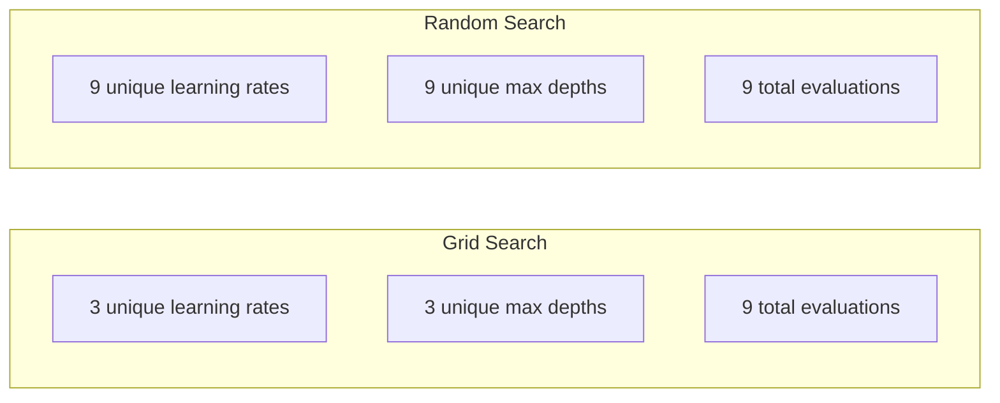
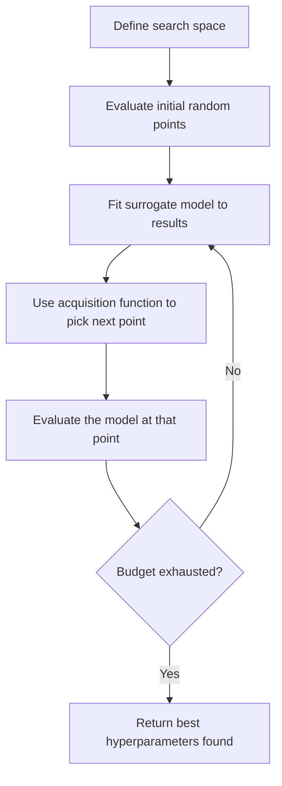
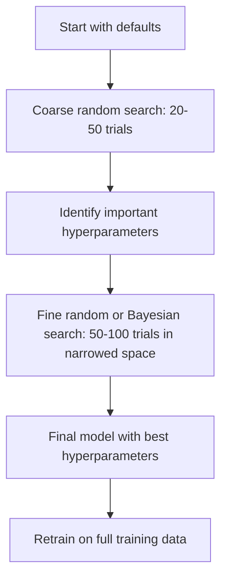
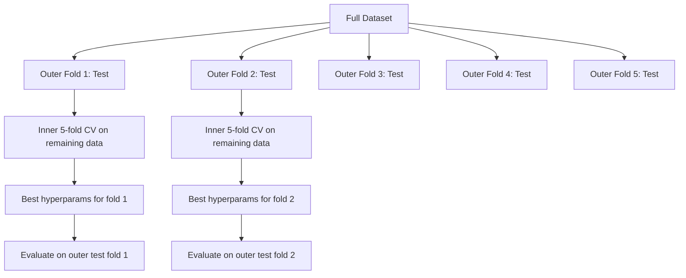

# التنسيق بين المعلمين

> المعلمات المعدنية هي التدريب قبل أن تبدأ في ضبط الدوران.

**Type:** Build
**Language:**بايثون
**Prerequisites:** Phase 2, Lesson 11 (Ensemble Methods)
**Time:** ~90 分钟

## 學习目标
- من تحقيق البحث عن الشبكة ‬البحث العشوائي و التحسين البايسي، ومقارنة كفاءة الاختبار
-  شرح لماذا عندما تكون الدرجة الفعالة لمعظم المعلمات المضادة أقل ، فإن البحث العشوائي سيكون أفضل من البحث عن الشبكة
- استخدام النموذج بديل و وظيفة الاستحواذ  بناء تحسين بايسي  دورة لتوجيه البحث
- تصميم طريقة للتأقلم على المعلمات المفرطة استراتيجية، من خلال الصلاحية المتقاطعة الملائمة  تجنب مجموعة التأقلم المماثل

## 问题
تعزيز التدرج الخاص بك  نموذج لديه معدل التعلم  عدد الأشجار  أعمق أقصى  دقيقة عينات لكل ورقة  نسب العينات و نسب العينات و نسب العمدة ٬ يعادل ستة معايير ٬ إذا كان لكل منها 5                                                                                                                                                                                                                                                                                                                                                                                                                                                             

البحث عن الشبكة هو الطريقة الأكثر مباشرة، ويعتبر أيضاً أسوأ طريقة بعد التغيرات في الحجم. البحث عن العشوائي باستخدام كمية أقل من الحسابات يمكن أن يتم بشكل أفضل.

## 概念
### المعلمات مقابل المعلمات المعدنية

المعلمين يستخدمون المعلمين في التدريب لتسيير كيفية حدوثها.

| Hyperparameter | 控制什么 | 典型范围 |
|---------------|-----------------|---------------|
| Learning rate | 每次更新的步长 | 0.001 到 1.0 |
| Number of trees/epochs | 训练时长 | 10 到 10,000 |
| Max depth | 模型复杂度 | 1 到 30 |
| Regularization (lambda) | 防止过拟合 | 0.0001 到 100 |
| Batch size | Gradient 估计噪声 | 16 到 512 |
| Dropout rate | 被丢弃的 neurons 比例 | 0.0 到 0.5 |

### البحث عن الشبكة

بحث الشبكة سوف تقييم كل مجموعة من المحدد قيمة. انها مفيدة جدا، وسهلة الفهم، ولكن سوف تزداد مع المعلمات العالية.

```
Grid for 2 hyperparameters:

  learning_rate: [0.01, 0.1, 1.0]
  max_depth:     [3, 5, 7]

  Evaluations: 3 x 3 = 9 combinations

  (0.01, 3)  (0.01, 5)  (0.01, 7)
  (0.1,  3)  (0.1,  5)  (0.1,  7)
  (1.0,  3)  (1.0,  5)  (1.0,  7)
```

البحث عن الشبكة لديه نقص أساسي: إذا كان أحد المعايير المفرطة مهمة، والآخر غير مهم، معظم التقييمات سوف تكون ضائعة.

### البحث العشوائي

البحث العشوائي ليس من الشبكة، ولكن من التوزيع من خلال استنتاج المعايير العابرة.



لماذا العشوائية 会胜过网(برغستر & بنغيو، 2012):

- معظم المعلمات المضطربة تكون ذات نسبة فعالة منخفضة جدا. بالنسبة للمشكلة المحددة، عادة ما تكون هناك 1-2 مادة فقط من المعلمات المضطربة.
- بحث الشبكة سوف تقييم التضخم على مستوى غير مهم
- في نفس الميزانية، البحث العشوائي سوف يغطي أكثر كثافة الالتفاصيل المهمة.
- في 60 تجربة عشوائية، إذا كان هناك أفضل نقاط في مساحة البحث، لديك احتمال 95% للعثور على نقطة أفضل نقاط في حدود 5%

### تحسين البايزية

البحث العشوائي سوف يتجاهل النتائج. لن يتعلم مع معدلات التعلم العالية سوف يؤدي إلى الانحراف. لن يتعلم إلى عمق 3



两个关键组件:

**Surrogate model:**نموذج تقييم منخفض التكلفة (معادة عملية غوسيان) ، يستخدم في وظيفة موضوعية باهظة الثمن تقريبًا.

**Acquisition function:**通過 توازن الاستغلال ((في البحث في المواقع المشهورة) والبحث ((في البحث في المناطق غير المحددة) ، قرر الخطوة التالية لتقييم أين.

- **Expected Improvement (EI):**ما هو المبلغ الذي نتوقع أن يرتفع هذا النقطة مقارنة مع أفضل القيمة الحالية؟
- **Upper Confidence Bound (UCB):**预测值加上某倍数不确定性――更高的UCB表示这个点有潜力,或还没有充分探索――
- **Probability of Improvement (PI):**ما هو احتمالية هذا النقطة تتجاوز القيمة المثلى الحالية؟

تحسين بايزيان عادة يمكن استخدامها مقارنة بالبحث العشوائي أقل من 2-5 مرات من عدد حالات التقييم للعثور على أفضل المعايير المضادة للعملية.

### التوقف المبكر

ليس كل تدريب يحتاج إلى أن يكتمل. إذا كان هناك إعدادات في 10 حقول بعد فترة من الزمن غير واضحة، فانقطاعها واصلت التدريب التالي.

策略:
- **Patience-based:**إذا فقدان التحقق من التحقق من التحقق من التحقق من التحقق من التحقق من التحقق من التحقق من التحقق من التحقق من التحقق من التحقق من التحقق من التحقق من التحقق من التحقق من التحقق من التحقق من التحقق من التحقق من التحقق من التحقق من التحقق من التحقق من التحقق من التحقق من التحقق من التحقق من التحقق من التحقق من التحقق من التحقق من التحقق من التحقق من التحقق من التحقق من التحقق من التحقق من التحقق من التحقق من التحقق من التحقق من التحقق من التحقق من التحقق من التحقق من التحقق من التحقق من التحقق من التحقق من التحقق من التحقق من التحقق من التحقق من التحقق من التحقق من التحقق من التحقق من التحقق من التحقق من التحقق من التحقق من التحقق من التحقق من التحقق من التحقق من التحقق من التحقق من التحقق من التحقق من التحقق من التحقق من التحقق من التحقق من التحقق من التحقق من التحقق من التحقق من التحقق من التحقق من التحقق من التحقق من التحقق من التحقق من التحقق من التحقق
- **Median pruning:**إذا كان متوسط النتيجة في المحاكمة أقل من متوسط النتيجة في المحاكمات التي تم إتمامها في نفس الخطوة ، فانقطاع
- **Hyperband:**تخصيص العديد من التخصيصات على ميزانية صغيرة ثم زيادة ميزانية التخصيصات المثلى تدريجيا

يستخدم الـ "هيبر باند" بشكل خاص فعالاً. يستخدم الـ "هايبر باند" أولاً لتحقيق 81 إعداد، ويحتفظ بـ "هايبر باند" في الـ "هايبر باند" في الـ "هايبر باند" في الـ "هايبر باند" في الـ "هايبر باند" في الـ "هايبر باند" في الـ "هايبر باند" في الـ "هايبر باند" في الـ "هايبر باند" في الـ "هايبر باند" في الـ "هايبر باند" في الـ "هايبر باند" في الـ "هايبر باند" في الـ "هايبر باند" في الـ "هايبر باند" في الـ "هايبر باند" في الـ "هايبراند" في الـ "هايبراند" في الـ "هايبراند" في الـ "هايبراند" في الـ "هايبراند" في الـ "هايبراند" في الـ "هايبراند" في الـ "هايبراند" في الـ "هايبراند" في الـ "هايبراند" في الـ "هايبراند" في الـ "هايبراند" في الـ "هايبراند" "هايبراند" في الـ "هايبراند" "هايبراند" في الـ "هايبراند" "هايبراند" في الـ "هايبراند" "هاي" "هاي" "هاي" "هاي" "هاي" "هاي "هاي "هاي "هاي "هاي "هاي "هاي "هاي "هاي "هاي "هاي "هاي " " " "هاي " " " " " " " " " " " " " " " " " " " " " " " " " " " " " " " " " " " " " " " " " " " " " " " " " " " " " " " " " " " " " " " " " " " " " " " " " " " " " " " " " " " " " " " " " " " " " " " " " " " " " " " " "

### المخططات المعدلة للتعلم

معدل التعلم  تقريبا دائماً هو المعيار المفرط الأكثر أهمية ٬ مع الحفاظ على ثابتة، لا يستخدم المخططون في عملية التدريب لتعديلها ٬

| Scheduler | Formula | 何时使用 |
|-----------|---------|-------------|
| Step decay | 每 N 个 epochs 乘以 0.1 | 经典 CNN 训练 |
| Cosine annealing | lr * 0.5 * (1 + cos(pi * t / T)) | 现代默认选择 |
| Warmup + decay | 先线性增加，再 cosine decay | Transformers |
| One-cycle | 在一个 cycle 内先增加再减少 | 快速收敛 |
| Reduce on plateau | 指标停滞时按因子降低 | 稳妥默认选择 |

### أهمية المعلمات العالية

ليس كل المعلمات المضادة ذات الأهمية نفسها.

**高重要性：**
- معدل التعلم (始终优先调)
- عدد من المقدرات / الأوقات ((استعمل التوقف المبكر ، بدلا من调它)
- قوة التنظيم

**中等重要性：**
- أعمق أقصى / عدد الطبقات
- أرقام صغيرة لكل ورقة / تفكك الوزن
- نسبة النموذج الفرعي

**低重要性：**
- الميزات القصوى ((للأراضي العشوائية)
- 具体激活函数 的选择
- حجم اللحظة ((在合理范围内)

الأول هو المهم، والباقي يحتفظ بالقيمة المتوقعة.

### استراتيجية عملية



具体工作流:

1. **从库的默认值开始。**يتم اختيارها من قبل ممارسي غني الخبرة، وعادة ما يصل إلى 80% من النتائج.
2. **粗粒度 random search。**استخدام واسع المدى، 20-50 مرة التجارب.
3. **分析结果。**ما هي المعايير المفرطة المتعلقة بالقدرة على البحث؟
4. **精细搜索。**في مساحة التكفيض بعد استخدام تحسين بايسي أو البحث العشوائي المركز  50-100 مرة التجارب 
5. **使用找到的最佳 hyperparameters 在全部训练数据上重新训练。**

### التحقق المتقاطع 集成

في منفصلة التحقق من التحقق من الصفحة الصفحة العليا هناك خطورة. أفضل المعلمات الصفحة المعدلة قد تكون مناسبة للفولد التحقق المحدد.

- **Outer loop**(قياس): سيتم تقسيم البيانات إلى قطار+ال و اختبار.
- **Inner loop**(调优):将 train+val 拆分为 train 和 val──بحث عن أفضل المعايير المضافة──



كل مجلد خارجي يجد بشكل مستقل أفضل معايير فائقة له.

استخدام:

```python
from sklearn.model_selection import cross_val_score, GridSearchCV
from sklearn.ensemble import GradientBoostingRegressor

inner_cv = GridSearchCV(
    GradientBoostingRegressor(),
    param_grid={
        "learning_rate": [0.01, 0.05, 0.1],
        "max_depth": [2, 3, 5],
        "n_estimators": [50, 100, 200],
    },
    cv=5,
    scoring="neg_mean_squared_error",
)

outer_scores = cross_val_score(
    inner_cv, X, y, cv=5, scoring="neg_mean_squared_error"
)

print(f"Nested CV MSE: {-outer_scores.mean():.4f} +/- {outer_scores.std():.4f}")
```

هذا مكلف جداً ((5 طوابق خارجية × 5 طوابق داخلية × 27 نقطة شبكة = 675 مرة نموذج يناسب) ، ولكن يمكن أن يمنح تقديرات موثوقة للأداء.

### نصائح مفيدة

**从 learning rate 开始。**بالنسبة إلى طريقة القائمة على التراجع، فإنه دائماً هو أهم المعيار المضاد. سعر التعلم السيء سوف يجعل كل الإعدادات الأخرى تفقد معنىها. أولاً، تحديد المعايير المضاد الأخرى على أنها القيمة الاختيارية، وتسحيب معدل التعلم.

**对 learning rate 和 regularization 使用 log-uniform distributions。**الفرق بين 0.001 و 0.01، والفرق بين 0.1 و 1.0، هو أمر مهم جدا.

**使用 early stopping，而不是调 n_estimators。**على تعزيز شبكات العصبية، فلتضع n_estimators أو epochs 设得高, دع توقف مبكر يقرر متى توقف.

**预算分配。**تمتلك 60% من ميزانية تعديل الميزانية في أول 2 ملامح فرعية أهمية.

**尺度很重要。**永遠不要在日志尺度上搜索批量尺寸 ((16、32、64 就可以) ◦始终在日志尺度上搜索学习率──让搜索分布匹配超参数 影响模型的方式──

| Model Type | Top Hyperparameters | Recommended Search | Budget |
|-----------|--------------------|--------------------|--------|
| Random Forest | n_estimators, max_depth, min_samples_leaf | Random search，50 次 trials | 低（训练快） |
| Gradient Boosting | learning_rate, n_estimators, max_depth | Bayesian，100 次 trials + early stopping | 中 |
| Neural Network | learning_rate, weight_decay, batch_size | Bayesian 或 random，100+ 次 trials | 高（训练慢） |
| SVM | C, gamma (RBF kernel) | 在 log scale 上 grid，25-50 次 trials | 低（2 个参数） |
| Lasso/Ridge | alpha | 在 log scale 上 1D search，20 次 trials | 很低 |
| XGBoost | learning_rate, max_depth, subsample, colsample | Bayesian，100-200 次 trials + early stopping | 中 |

**拿不准时：**استخدام البحث العشوائي، التجارب عدد على الأقل لعدد 2 倍 للبراميرات العشوائية، على سبيل المثال، 6 个超参数 = على الأقل 12 مرة التجارب) ―― سوف تفاجأ على الاطلاق، 50 مرة التجارب البحث العشوائي 经常能击败精心设计的网格搜索──


```figure
k-fold-cv
```

## بناءها
### الخطوة الأولى: من الصفر لتحقيق البحث عن الشبكة

`code/tuning.py`من الصفر تم تحقيق الشبكة البحث ‬البحث العشوائي وحدة تحسين البايسية البسيطة‬

```python
def grid_search(model_fn, param_grid, X_train, y_train, X_val, y_val):
    keys = list(param_grid.keys())
    values = list(param_grid.values())
    best_score = -float("inf")
    best_params = None
    n_evals = 0

    for combo in itertools.product(*values):
        params = dict(zip(keys, combo))
        model = model_fn(**params)
        model.fit(X_train, y_train)
        score = evaluate(model, X_val, y_val)
        n_evals += 1

        if score > best_score:
            best_score = score
            best_params = params

    return best_params, best_score, n_evals
```

### الخطوة الثانية: من الصفر لتحقيق البحث العشوائي

```python
def random_search(model_fn, param_distributions, X_train, y_train,
                  X_val, y_val, n_iter=50, seed=42):
    rng = np.random.RandomState(seed)
    best_score = -float("inf")
    best_params = None

    for _ in range(n_iter):
        params = {k: sample(v, rng) for k, v in param_distributions.items()}
        model = model_fn(**params)
        model.fit(X_train, y_train)
        score = evaluate(model, X_val, y_val)

        if score > best_score:
            best_score = score
            best_params = params

    return best_params, best_score, n_iter
```

### 步骤 3: تحسين البايسية

核心思想:将高斯过程 拟合到已观测的(超参数,得分)配对上,然后用收购函数决定下一步看哪里──

```python
class SimpleBayesianOptimizer:
    def __init__(self, search_space, n_initial=5):
        self.search_space = search_space
        self.n_initial = n_initial
        self.X_observed = []
        self.y_observed = []

    def _kernel(self, x1, x2, length_scale=1.0):
        dists = np.sum((x1[:, None, :] - x2[None, :, :]) ** 2, axis=2)
        return np.exp(-0.5 * dists / length_scale ** 2)

    def _fit_gp(self, X_new):
        X_obs = np.array(self.X_observed)
        y_obs = np.array(self.y_observed)
        y_mean = y_obs.mean()
        y_centered = y_obs - y_mean

        K = self._kernel(X_obs, X_obs) + 1e-4 * np.eye(len(X_obs))
        K_star = self._kernel(X_new, X_obs)

        L = np.linalg.cholesky(K)
        alpha = np.linalg.solve(L.T, np.linalg.solve(L, y_centered))
        mu = K_star @ alpha + y_mean

        v = np.linalg.solve(L, K_star.T)
        var = 1.0 - np.sum(v ** 2, axis=0)
        var = np.maximum(var, 1e-6)

        return mu, var

    def _expected_improvement(self, mu, var, best_y):
        sigma = np.sqrt(var)
        z = (mu - best_y) / (sigma + 1e-10)
        ei = sigma * (z * norm_cdf(z) + norm_pdf(z))
        return ei

    def suggest(self):
        if len(self.X_observed) < self.n_initial:
            return sample_random(self.search_space)

        candidates = [sample_random(self.search_space) for _ in range(500)]
        X_cand = np.array([to_vector(c) for c in candidates])
        mu, var = self._fit_gp(X_cand)
        ei = self._expected_improvement(mu, var, max(self.y_observed))
        return candidates[np.argmax(ei)]

    def observe(self, params, score):
        self.X_observed.append(to_vector(params))
        self.y_observed.append(score)
```

في كل نقطة مرشحة، يقدم GP بديل شيئين: توقعات النسبة المحددة (م) و عدم اليقين (م) ، والتحسين المتوقع (م) ، والتحسين المتوقع (م) ، والتي تستهدف النقاط المحددة (م) ، والتي تستهدف النقاط المحددة (م) ، والتي تستهدف النقاط المحددة (م) ، والتي تستهدف النقاط المحددة (م) ، والتي تستهدف النقاط المحددة (م) ، والتي تستهدف النقاط المحددة (م) ، والتي تستهدف النقاط المحددة (م) ، والتي تستهدف النقاط المحددة (م) ، والتي تستهدف النقاط المحددة (م) ، والتي تستهدف النقاط المحددة (م) ، والتي تستهدف النقاط المحددة (م) ، والتي تستهدف النقاط المحددة (م) ، والتي تستهدف النقاط المحددة (م) ، والتي تستهدف (م) ، والتي تستهدف (م) ، والتي تستهدف (م) ، والتي تستهدف (م) ، والتي تستهدف (م) ، والتي تستهدف (م) ، والتي تستهدف (م) ، والتي تستهدف (م) ، والتي تستهدف (م) ، والتي تستهدف (م) ، والتي تستهدف (م) ، والتي تستهدف (م) ، وال (م) ، والتي تستهدف (م) ، وال (م) ، والتي تتمثل ().

### الخطوة الرابعة: مقارنة جميع الطرق

في نفس الهدف الاصطناعي 上运行三种方法并比较. هذا المقارنة تستخدم لفقة بسيطة، مباشرة باستخدام وظيفة موضوعية 调用每个优化器(没有模型训练), لذلك فإن API و فوق النموذج القائم على التنفيذ مختلف:

```python
def synthetic_objective(params):
    lr = params["learning_rate"]
    depth = params["max_depth"]
    return -(np.log10(lr) + 2) ** 2 - (depth - 4) ** 2 + 10

param_grid = {
    "learning_rate": [0.001, 0.01, 0.1, 1.0],
    "max_depth": [2, 3, 4, 5, 6, 7, 8],
}

grid_best = None
grid_score = -float("inf")
grid_history = []
for combo in itertools.product(*param_grid.values()):
    params = dict(zip(param_grid.keys(), combo))
    score = synthetic_objective(params)
    grid_history.append((params, score))
    if score > grid_score:
        grid_score = score
        grid_best = params

param_dist = {
    "learning_rate": ("log_float", 0.001, 1.0),
    "max_depth": ("int", 2, 8),
}

rand_best = None
rand_score = -float("inf")
rand_history = []
rng = np.random.RandomState(42)
for _ in range(28):
    params = {k: sample(v, rng) for k, v in param_dist.items()}
    score = synthetic_objective(params)
    rand_history.append((params, score))
    if score > rand_score:
        rand_score = score
        rand_best = params

optimizer = SimpleBayesianOptimizer(param_dist, n_initial=5)
bayes_history = []
for _ in range(28):
    params = optimizer.suggest()
    score = synthetic_objective(params)
    optimizer.observe(params, score)
    bayes_history.append((params, score))
bayes_score = max(s for _, s in bayes_history)

print(f"{'Method':<20} {'Best Score':>12} {'Evaluations':>12}")
print("-" * 50)
print(f"{'Grid Search':<20} {grid_score:>12.4f} {len(grid_history):>12}")
print(f"{'Random Search':<20} {rand_score:>12.4f} {len(rand_history):>12}")
print(f"{'Bayesian Opt':<20} {bayes_score:>12.4f} {len(bayes_history):>12}")
```

في نفس الميزانية، يمكن لتحسين البايسية عادةً أن يجد أفضل النتائج بسرعة، لأنه لن يقدر التضخم في منطقة سيئة بشكل واضح.

## استخدمها
### أوبتونا في الممارسة

اختيار هو تقديم تقديمات صيغة لتحديد المعلمات العالية.

```python
import optuna

def objective(trial):
    lr = trial.suggest_float("learning_rate", 1e-4, 1e-1, log=True)
    n_est = trial.suggest_int("n_estimators", 50, 500)
    max_depth = trial.suggest_int("max_depth", 2, 10)

    model = GradientBoostingRegressor(
        learning_rate=lr,
        n_estimators=n_est,
        max_depth=max_depth,
    )
    model.fit(X_train, y_train)
    return mean_squared_error(y_val, model.predict(X_val))

study = optuna.create_study(direction="minimize")
study.optimize(objective, n_trials=100)

print(f"Best params: {study.best_params}")
print(f"Best MSE: {study.best_value:.4f}")
```

الميزات الرئيسية لـ Optuna:
- `suggest_float(..., log=True)`تستخدم لأفضل تناسب في مقياس السجل أعلى العناصر البحث ((معدل التعلم  تنظيم)
- `suggest_int`باستخدام العنصر الكامل
- `suggest_categorical`تستخدم للاختيار
- إعداد المتوسط، المستخدمة في تجارب سيئة  إجراء وقف مبكر
- `study.trials_dataframe()`تستخدم في التحليل

### أوبتونة مع القص

الحصص 会提前停止 بدون أمل من المحاكمات، وبالتالي توفير الكثير من الحسابات:

```python
import optuna
from sklearn.model_selection import cross_val_score

def objective(trial):
    params = {
        "learning_rate": trial.suggest_float("lr", 1e-4, 0.5, log=True),
        "max_depth": trial.suggest_int("max_depth", 2, 10),
        "n_estimators": trial.suggest_int("n_estimators", 50, 500),
        "subsample": trial.suggest_float("subsample", 0.5, 1.0),
    }

    model = GradientBoostingRegressor(**params)
    scores = cross_val_score(model, X_train, y_train, cv=3,
                             scoring="neg_mean_squared_error")
    mean_score = -scores.mean()

    trial.report(mean_score, step=0)
    if trial.should_prune():
        raise optuna.TrialPruned()

    return mean_score

pruner = optuna.pruners.MedianPruner(n_startup_trials=10, n_warmup_steps=5)
study = optuna.create_study(direction="minimize", pruner=pruner)
study.optimize(objective, n_trials=200)
```

`MedianPruner`في محاكمة معينة، فإن متوسط القيمة في المحاكمات المكتملة أقل من نفس الخطوة.`trial.report()`报告中间指标,并调用 `trial.should_prune()`查看该审判 是否应该停止──`n_startup_trials=10`تأكد من وجود 10 تجارب على الأقل بعد الانتهاء الكامل، والحذف فقط سوف يبدأ.

### المنسقات المدمجة في sklearn

للتجربة السريعة، تعلم ما تقدمه`GridSearchCV`.`RandomizedSearchCV`和 `HalvingRandomSearchCV`:

```python
from sklearn.model_selection import RandomizedSearchCV
from scipy.stats import loguniform, randint

param_dist = {
    "learning_rate": loguniform(1e-4, 0.5),
    "max_depth": randint(2, 10),
    "n_estimators": randint(50, 500),
}

search = RandomizedSearchCV(
    GradientBoostingRegressor(),
    param_dist,
    n_iter=100,
    cv=5,
    scoring="neg_mean_squared_error",
    random_state=42,
    n_jobs=-1,
)
search.fit(X_train, y_train)
print(f"Best params: {search.best_params_}")
print(f"Best CV MSE: {-search.best_score_:.4f}")
```

لمعدل التعلم والتعديل استخدام التعلم`loguniform`◊ لعدد كامل من المعلمات`randint`.`n_jobs=-1`سيقوم العلامات في جميع نواة المعالجة المركزية

### إصلاح الحدود المتعددة

**通过 preprocessing 产生 data leakage。**إذا كنت في التحقق المتقاطع قبل قبل في مجموعة بيانات كاملة فوق تناسب مقياس، معلومات التحقق من طيّة سوف تتسرب في التدريب.`Pipeline`، لذا فهي فقط ستعمل في التدريب المثوب فوق تناسب

**对 validation set 过拟合。**运行数千次 التجارب 实际上等于在验证套上训练――最终性能估算应使用嵌套交叉验证,或留出一个在调优期间从不碰的独立测试套――

**搜索范围太窄。**إذا كان أفضل قيمتك تقع على الحدود من مساحة البحث، اشرح أن نطاق البحث ليس واسع بما فيه الكفاية.

**忽略交互效应。**في زيادة، معدلات التعلم وعدد المقدّرين لديهم صلات قوية.

**没有对 iterative models 使用 early stopping。**على تعزيز التدرج و شبكات العصبية، سوف ن_تقديرات أو دورات وضع لقيام قيمة أعلى ومستخدم وقف مبكر.

## التدريب
1. مع نفس الميزانية إجمالية عمليات البحث في الشبكة و البحث العشوائي مثل 50 مرة تقييم) ―― مقارنة أفضل النسبة المكتسبة وجدت‬ مع مختلف البذور 运行实验 10 مرات‬‬‬‬‬‬‬‬‬‬‬‬‬‬‬‬‬‬‬‬‬‬‬‬‬‬‬‬‬‬‬‬‬‬‬‬‬‬‬‬‬‬‬‬‬‬‬‬‬‬‬‬‬‬‬‬‬‬‬‬‬‬‬‬‬‬‬‬‬‬‬‬‬‬‬‬‬‬‬‬‬‬‬‬‬‬‬‬‬‬‬‬‬‬‬‬‬‬‬‬‬‬‬‬‬‬‬‬‬‬‬‬‬‬‬‬‬‬‬‬‬‬‬‬‬‬‬‬‬‬‬‬‬‬‬‬‬‬‬‬‬‬‬‬‬‬‬‬‬‬‬‬‬‬‬‬‬‬‬‬‬‬‬‬‬‬‬‬‬‬‬‬‬‬‬‬‬‬‬‬‬‬‬‬‬‬‬‬‬‬‬‬‬‬‬‬‬‬‬‬‬‬‬‬‬‬‬‬‬‬‬‬‬‬‬‬‬‬‬‬‬‬‬‬‬‬‬‬‬‬‬‬‬‬‬‬‬‬‬‬‬‬‬‬‬‬‬‬‬‬‬‬‬‬‬‬‬‬‬‬‬‬‬‬‬‬‬‬‬‬‬‬‬‬‬‬‬‬‬‬‬‬‬‬‬‬‬‬‬‬‬‬‬‬‬‬‬‬‬‬‬‬‬‬‬‬‬‬‬‬‬‬‬‬‬‬‬‬‬‬‬‬‬‬‬‬‬‬‬‬‬‬‬‬‬‬‬‬‬‬‬‬‬‬‬‬‬‬‬‬‬‬‬‬‬‬‬‬‬‬‬‬‬‬‬‬‬‬‬‬‬‬‬‬‬‬‬‬‬‬‬‬‬‬‬‬‬‬‬‬‬‬‬‬‬‬‬‬‬‬‬‬‬‬‬‬‬‬‬‬‬‬‬‬‬‬‬‬‬‬‬‬‬‬‬‬‬‬‬‬‬‬‬‬‬‬‬‬‬‬‬‬‬‬‬‬‬‬‬‬‬‬‬‬‬‬

2. من التطبيق على الهايبر باند. ومن 81 تكوين يبدأ كل تدريب على 1 دور. من الحفاظ على 1 / 3 من الجولة، ويزيد ميزانيتها إلى 3 مرات.

3. 给 Lesson 11 中的梯度增强 实现添加一个学习率调度器 ()                                                                                                                                                                                                                                                   

4. استخدام أوبتونا في مجموعة بيانات حقيقية (مثل مجموعة بيانات سرطان الثدي في sklearn) 上调 RandomForestClassifier。使用 `optuna.visualization.plot_param_importances(study)`انظر ما هي المعايير المضادة الأهم. هل تتطابق مع ترتيب الأهمية في هذه الدورة؟

5. 实现 a simple acquisition function ((التحسين المتوقع) ،并演示 الاستكشاف مقابل الاستغلال。 رسم نموذج بديل 的平均值和不确定性,并展示 EI 选择下一步评估的位置──

## 关键术语
| Term | 人们通常说 | 实际含义 |
|------|----------------|----------------------|
| Hyperparameter | “你选择的一个设置” | 训练前设置的值，用来控制学习过程，不是从数据中学习得到的 |
| Grid search | “尝试每一种组合” | 在指定 parameter grid 上进行穷举搜索。成本呈指数级增长。 |
| Random search | “就是随机采样” | 从分布中采样 hyperparameters。比 grid search 更好地覆盖重要维度。 |
| Bayesian optimization | “智能搜索” | 使用 objective 的 surrogate model 来决定下一步评估哪里，平衡 exploration 和 exploitation |
| Surrogate model | “一个便宜的近似” | 一个模型（通常是 Gaussian process），根据已观测评估来近似昂贵的 objective function |
| Acquisition function | “下一步看哪里” | 通过平衡 expected improvement 和不确定性，为候选点打分。EI 和 UCB 是常见选择。 |
| Early stopping | “停止浪费时间” | 当 validation performance 停止提升时，提前终止训练 |
| Hyperband | “配置的锦标赛分组” | 自适应资源分配：用小预算启动许多 configs，保留最好的并增加它们的预算 |
| Learning rate scheduler | “训练期间改变 lr” | 一个函数，用于在训练过程中调整 learning rate，以获得更好的收敛 |

## 延伸阅读
- [Bergstra & Bengio: Random Search for Hyper-Parameter Optimization (2012)](https://jmlr.org/papers/v13/bergstra12a.html)-- 证明 random 胜过网 的论文
- [Snoek et al., Practical Bayesian Optimization of Machine Learning Algorithms (2012)](https://arxiv.org/abs/1206.2944)-- باستخدام تحسين بايزي من ML
- [Li et al., Hyperband: A Novel Bandit-Based Approach (2018)](https://jmlr.org/papers/v18/16-558.html)-- فرقة النطاقات
- [Optuna: A Next-generation Hyperparameter Optimization Framework](https://arxiv.org/abs/1907.10902)-- Optuna 论文
- [Probst et al., Tunability: Importance of Hyperparameters (2019)](https://jmlr.org/papers/v20/18-444.html)-- 哪些 hyperparameters  مهم
