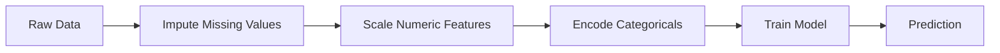
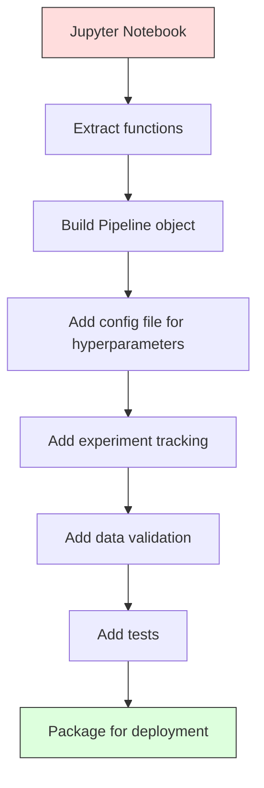

# خطوط أنابيب ML

> النموذج ليس منتجها. ‧الخطوط الأنابيبية ‧الخطوط الأنابيبية ‧الخطوط الأنابيبية ‧الخطوط الأنابيبية ‧الخطوط الأنابيبية ‧الخطوط الأنابيبية ‧الخطوط الأنابيبية ‧الخطوط الأنابيبية ‧الخطوط الأنابيبية ‧الخطوط الأنابيبية ‧الخطوط الأنابيبية ‧الخطوط الأنابيبية ‧الخطوط الأنابيبية ‧الخطوط الأنابيبية ‧الخطوط الأنابيبية ‧الخطوط الأنابيبية ‧الخطوط الأنابيبية ‧الخطوط الأنابيبية ‧الخطوط الأنابية ‧الخطوط الإنباءية ‧الخطوة التنابية

**Type:** Build
**Language:**بايثون
**Prerequisites:** Phase 2, Lesson 12 (Hyperparameter Tuning)
**Time:** ~120 minutes

## 學习目标
- من الصفر إلى بناء خط أنابيب ML، سيتم إعطاء الإسباب والتوسيع والتشفير وتدريب النموذج 串联 إلى عبارة واحدة قابلة للتحقيق
- 识别数据泄漏 场景,并解释管道 如何通过仅在训练数据 上拟合变压器以防止泄漏
-  بناء عمودTransformer، على الميزات العددية و الفئوية  تطبيق مختلف المعالجة المسبقة
- 实现 خط الأنابيب التسلسل، ومثبت نفس خط الأنابيب المعدل في التدريب والإنتاج

## 问题
لديك دفتر مذكرات: يُحمل البيانات، يُستخدم المتوسط ملء القيم المفقودة، وتكبير الميزات، وتدريب النموذج، ومطبوع دقة.

بعد شهر، قام أحد بإعادة تدريب النموذج، ولكن حصل على نتائج مختلفة. متوسط هو في مجموعة بيانات كاملة تحتوي على بيانات الاختبار.

هذه ليست حالة افتراضية. إنها السبب الأكثر شيوعا لفشل أنظمة التكنولوجيا المهنية في الإنتاج.

## 概念
### ما هو خط الأنابيب

خط الأنابيب هو مجموعة من تحويلات البيانات المسلسلة، ولاحقاً على نموذج. كل خطوة هي خطوة سابقة من الخروج كإدخال.



خط الأنابيب
- التحويلات فقط في بيانات التدريب
- التأثير 时应用 تماما نفس التحويلات
- يمكن أن يتم تصنيف الكائن بأكمله كصورة، ويعمل كصورة
- التحقق المتقاطع في كل طابق في تنفيذ خط الأنابيب، لمنع التسريبات الصغيرة

### إفشاحات البيانات: قاتل صامت

تسرب البيانات يحدث في مجموعة الاختبارات أو في البيانات المستقبلية أثناء تدريبات التلوث المعلومات. يمكن أن يمنع خط الأنابيب من أكثر أشكال التسرب شيوعاً.

**Leaky（错误）：**
```python
X = df.drop("target", axis=1)
y = df["target"]

scaler = StandardScaler()
X_scaled = scaler.fit_transform(X)

X_train, X_test = X_scaled[:800], X_scaled[800:]
y_train, y_test = y[:800], y[800:]
```

المقياسة نظر إلى بيانات الاختبار. المتوسط و الانحراف القياسي يحتوي على عينات الاختبار.

**Correct：**
```python
X_train, X_test = X[:800], X[800:]

scaler = StandardScaler()
X_train_scaled = scaler.fit_transform(X_train)
X_test_scaled = scaler.transform(X_test)
```

استخدام خط الأنابيب 时,你不需要专门思考这个问题――خط الأنابيب 会自动处理――

### خط أنابيب السكلارن

التسجيلات`Pipeline`مع محولات ومتقدّر.`.fit()`.`.predict()`和 `.score()`، حسب الترتيب تطبيق كل الخطوات

```python
from sklearn.pipeline import Pipeline
from sklearn.preprocessing import StandardScaler
from sklearn.linear_model import LogisticRegression

pipe = Pipeline([
    ("scaler", StandardScaler()),
    ("model", LogisticRegression()),
])

pipe.fit(X_train, y_train)
predictions = pipe.predict(X_test)
```

عندما ت调用`pipe.fit(X_train, y_train)`时:
1. المعدل في X_train 上调用 `fit_transform`
2. النموذج في مقياس X_train 上调用 `fit`

عندما ت调用`pipe.predict(X_test)`时:
1. Scaler 在 X_test 上调用 `transform`(不是 fit_transform)
2. النموذج في مقياس X_test 上调用 `predict`

في عملية التثبيت لن ترى أبدا بيانات الاختبار. هذا هو الغرض الأساسي.

### العمودالمتحول:不同列使用不同管道

المجموعة البيانية الحقيقية تتضمن عمودات عددية و فصلية، وتحتاج إلى معالجة مسبقة مختلفة.`ColumnTransformer`负责处理这种情况――

```python
from sklearn.compose import ColumnTransformer
from sklearn.preprocessing import StandardScaler, OneHotEncoder
from sklearn.impute import SimpleImputer

numeric_pipe = Pipeline([
    ("impute", SimpleImputer(strategy="median")),
    ("scale", StandardScaler()),
])

categorical_pipe = Pipeline([
    ("impute", SimpleImputer(strategy="most_frequent")),
    ("encode", OneHotEncoder(handle_unknown="ignore")),
])

preprocessor = ColumnTransformer([
    ("num", numeric_pipe, ["age", "income", "score"]),
    ("cat", categorical_pipe, ["city", "gender", "plan"]),
])

full_pipeline = Pipeline([
    ("preprocess", preprocessor),
    ("model", GradientBoostingClassifier()),
])
```

OneHotEncoder 中的 `handle_unknown="ignore"`بالنسبة للإنتاج 至关重要── عندما تظهر فئة جديدة (مثل نموذج مدن لم يسبق لها أن أشهدها) فإنها تنتج متجهًا كاملًا، وليس انهيارًا مباشرًا.

### تتبع التجربة

أنبوب جعلت التدريب قابلة للتعديل، ولكنك تحتاج أيضاً لتتبع التجارب ‬ما حدث بينها: استخدم أي مفرات متطرفة‬‬‬‬‬‬‬‬‬‬‬‬‬‬‬‬‬‬‬‬‬‬‬‬‬‬‬‬‬‬‬‬‬‬‬‬‬‬‬‬‬‬‬‬‬‬‬‬‬‬‬‬‬‬‬‬‬‬‬‬‬‬‬‬‬‬‬‬‬‬‬‬‬‬‬‬‬‬‬‬‬‬‬‬‬‬‬‬‬‬‬‬‬‬‬‬‬‬‬‬‬‬‬‬‬‬‬‬‬‬‬‬‬‬‬‬‬‬‬‬‬‬‬‬‬‬‬‬‬‬‬‬‬‬‬‬‬‬‬‬‬‬‬‬‬‬‬‬‬‬‬‬‬‬‬‬‬‬‬‬‬‬‬‬‬‬‬‬‬‬‬‬‬‬‬‬‬‬‬‬‬‬‬‬‬‬‬‬‬‬‬‬‬‬‬‬‬‬‬‬‬‬‬‬‬‬‬‬‬‬‬‬‬‬‬‬‬‬‬‬‬‬‬‬‬‬‬‬‬‬‬‬‬‬‬‬‬‬‬‬‬‬‬‬‬‬‬‬‬‬‬‬‬‬‬‬‬‬‬‬‬‬‬‬‬‬‬‬‬‬‬‬‬‬‬‬‬‬‬‬‬‬‬‬‬‬‬‬‬‬‬‬‬‬‬‬‬‬‬‬‬‬‬‬‬‬‬‬‬‬‬‬‬‬‬‬‬‬‬‬‬‬‬‬‬‬‬‬‬‬‬‬‬‬‬‬‬‬‬‬‬‬‬‬‬‬‬‬‬‬‬‬‬‬‬‬‬‬‬‬‬‬‬‬‬‬‬‬‬‬‬‬‬‬‬‬‬‬‬‬‬‬‬‬‬‬‬‬‬‬‬‬‬‬‬‬‬‬‬‬‬‬‬‬‬‬‬‬‬‬‬‬‬‬‬‬‬‬‬‬‬‬‬‬‬‬‬‬‬‬‬‬‬‬‬‬‬‬‬‬‬‬‬‬‬‬‬‬‬‬‬‬‬‬‬‬‬‬‬‬‬‬‬‬‬‬‬

**MLflow**هو أكثر حلول مفتوحة المصدر شيوعاً:

```python
import mlflow

with mlflow.start_run():
    mlflow.log_param("max_depth", 5)
    mlflow.log_param("n_estimators", 100)
    mlflow.log_param("learning_rate", 0.1)

    pipe.fit(X_train, y_train)
    accuracy = pipe.score(X_test, y_test)

    mlflow.log_metric("accuracy", accuracy)
    mlflow.sklearn.log_model(pipe, "model")
```

كل مرة يتم تشغيلها ستسجل المعلمات والمقاييس والقطع الأثرية و النموذج الكامل. يمكنك مقارنة الجرائد، و إعادة تشغيل أي تجربة، و نشر أي نسخة نموذج.

**Weights & Biases (wandb)**提供相同功能,并带有 ميزة التحكم المضيفة:

```python
import wandb

wandb.init(project="my-pipeline")
wandb.config.update({"max_depth": 5, "n_estimators": 100})

pipe.fit(X_train, y_train)
accuracy = pipe.score(X_test, y_test)

wandb.log({"accuracy": accuracy})
```

### النموذج الإصدار

بعد إتمام التتبع التجريبي، تحتاج إلى إدارة نسخ النموذج.

سجل النموذج MLflow 提供:
- **Version tracking:**كل نموذج يتم حفظه يحصل على رقم نسخ
- **Stage transitions:**"مُقامة" ‧"إنتاج"‧"مُخزنة"
- **Approval workflow:**يجب أن يتم تعزيزها بشكل واضح إلى الإنتاج
- **Rollback:**立即切回 قبل النسخة

### إصدار البيانات مع DVC

代码用 git做版本化──数据也应该被版本化,但 git 无法处理大文件──DVC (Data Version Control) 解决了这个问题──

```
dvc init
dvc add data/training.csv
git add data/training.csv.dvc data/.gitignore
git commit -m "Track training data"
dvc push
```

DVC سوف تخزن المعلومات الحقيقية في التخزين عن بعد ((S3、GCS、Azure) ، ويحفظ في الموقع واحد صغير جدا `.dvc`عندما تقوم بتسجيل التسجيلات`dvc checkout`سأستعيد البيانات المستخدمة في ذلك الوقت

هذا يعني أن كل عمل يقوم به في نفس الوقت مع إصلاح الكود والبيانات.

### التجارب المتكاملة

تجربة قابلة للتطبيق تحتاج إلى أربعة أشياء:

1. **Fixed random seeds:**و "مُتَعَدّدُ" و "إطارُ"
2. **Pinned dependencies:**استخدام مع إصدار محدد من المتطلبات.txt أو poetry.lock
3. **Versioned data:**استخدام DVC أو أدوات مماثلة
4. **Config files:**جميع المعايير المضادة وضعت في التكوين، وليس في شفرة صلبة

```python
import numpy as np
import random

def set_seed(seed=42):
    random.seed(seed)
    np.random.seed(seed)
    try:
        import torch
        torch.manual_seed(seed)
        torch.cuda.manual_seed_all(seed)
        torch.backends.cudnn.deterministic = True
    except ImportError:
        pass
```

### من المذكرة إلى خط الإنتاج



العملية النموذجية:

1. **Notebook exploration:**التجارب السريعة
2. **Extract functions:**سوف تقوم بتعديل المواد المسبقة
3. **Build Pipeline:**سوف تتحول إلى سلسلة أنابيب التجارة أو فئة مخصصة
4. **Config management:**ستقوم جميع المعايير الضخمة 移 into YAML/JSON config
5. **Experiment tracking:**添加 MLflow أو التسجيل
6. **Data validation:**في التدريبات قبل الاختبار مخططات التوزيعات ونماطير القيمة المفقودة
7. **Tests:**للمتحولات  إعداد اختبارات الوحدة، و لخط الأنابيب الكامل  إعداد اختبارات التكامل
8. **Deployment:**التسلسل لخط الأنابيب، باستخدام API ((FastAPI、Flask)封装،并 containerize

### أخطاء عامة في خط الأنابيب

| Mistake | Why it is bad | Fix |
|---------|-------------|-----|
| 在 splitting 前对完整数据 fitting | Data leakage | 使用带 cross_val_score 的 Pipeline |
| 在 Pipeline 外做 feature engineering | Train 与 serve 时 transforms 不一致 | 把所有 transforms 放入 Pipeline |
| 不处理 unknown categories | Production 中出现新值会崩溃 | OneHotEncoder(handle_unknown="ignore") |
| Hardcoded column names | schema 变化时会出错 | 从 config 使用 column name lists |
| 没有 data validation | bad data 会导致悄无声息的错误 predictions | 在 prediction 前添加 schema checks |
| Training/serving skew | 模型在 prod 中看到不同 features | training 和 serving 共用一个 Pipeline 对象 |


```figure
f3-pipeline-flow
```

## بناءها
`code/pipeline.py`中的代码 من الصفر بناء خط أنابيب ML كامل:

### الخطوة 1: المحول المخصص

```python
class CustomTransformer:
    def __init__(self):
        self.means = None
        self.stds = None

    def fit(self, X):
        self.means = np.mean(X, axis=0)
        self.stds = np.std(X, axis=0)
        self.stds[self.stds == 0] = 1.0
        return self

    def transform(self, X):
        return (X - self.means) / self.stds

    def fit_transform(self, X):
        return self.fit(X).transform(X)
```

### الخطوة الثانية: من الصفر بناء خط الأنابيب

```python
class PipelineFromScratch:
    def __init__(self, steps):
        self.steps = steps

    def fit(self, X, y=None):
        X_current = X.copy()
        for name, step in self.steps[:-1]:
            X_current = step.fit_transform(X_current)
        name, model = self.steps[-1]
        model.fit(X_current, y)
        return self

    def predict(self, X):
        X_current = X.copy()
        for name, step in self.steps[:-1]:
            X_current = step.transform(X_current)
        name, model = self.steps[-1]
        return model.predict(X_current)
```

### الخطوة الثالثة: استخدام خط الأنابيب

代码演示了使用管道的交叉验证 如何防止数据泄漏:scaler 会分别在每个折叠的训练数据上合――

### 第4 步: استخدام مخزن التجارة كاملة

خط أنابيب كامل، يتضمن`ColumnTransformer`、多条 مسارات المعالجة المسبقة 和一个模型,并使用正确的交叉验证与实验记录 进行训练──

## 交付 it
本课产出:
- `outputs/prompt-ml-pipeline.md`-- باستخدام مهارات بناء وتحديث خطوط أنابيب ML
- `code/pipeline.py`-- خط أنابيب كامل، من الصفر  التنفيذ إلى التسجيل  نسخة

## التدريب
1. إنشاء خط أنابيب، معالجة تحتوي على 3 أعمدة رقمية و 2 أعمدة فصلية مجموعة بيانات ‬‬‬‬‬‬‬‬‬‬‬‬‬‬‬‬‬‬‬‬‬‬‬‬‬‬‬‬‬‬‬‬‬‬‬‬‬‬‬‬‬‬‬‬‬‬‬‬‬‬‬‬‬‬‬‬‬‬‬‬‬‬‬‬‬‬‬‬‬‬‬‬‬‬‬‬‬‬‬‬‬‬‬‬‬‬‬‬‬‬‬‬‬‬‬‬‬‬‬‬‬‬‬‬‬‬‬‬‬‬‬‬‬‬‬‬‬‬‬‬‬‬‬‬‬‬‬‬‬‬‬‬‬‬‬‬‬‬‬‬‬‬‬‬‬‬‬‬‬‬‬‬‬‬‬‬‬‬‬‬‬‬‬‬‬‬‬‬‬‬‬‬‬‬‬‬‬‬‬‬‬‬‬‬‬‬‬‬‬‬‬‬‬‬‬‬‬‬‬‬‬‬‬‬‬‬‬‬‬‬‬‬‬‬‬‬‬‬‬‬‬‬‬‬‬‬‬‬‬‬‬‬‬‬‬‬‬‬‬‬‬‬‬‬‬‬‬‬‬‬‬‬‬‬‬‬‬‬‬‬‬‬‬‬‬‬‬‬‬‬‬‬‬‬‬‬‬‬‬‬‬‬‬‬‬‬‬‬‬‬‬‬‬‬‬‬‬‬‬‬‬‬‬‬‬‬‬‬‬‬‬‬‬‬‬‬‬‬‬‬‬‬‬‬‬‬‬‬‬‬‬‬‬‬‬‬‬‬‬‬‬‬‬‬‬‬‬‬‬‬‬‬‬‬‬‬‬‬‬‬‬‬‬‬‬‬‬‬‬‬‬‬‬‬‬‬‬‬‬‬‬‬‬‬‬‬‬‬‬‬‬‬‬‬‬‬‬‬‬‬‬‬‬‬‬‬‬‬‬‬‬‬‬‬‬‬‬‬‬‬‬‬‬‬‬‬‬‬‬‬‬‬‬‬‬‬‬‬‬‬‬‬‬‬‬‬‬‬‬‬‬‬‬‬‬‬‬‬‬‬‬‬‬‬‬‬‬‬‬‬‬‬‬‬‬‬‬‬`ColumnTransformer`على الرقميات  تطبيق الوصف المتوسط + التوسع ، على الفئات  تطبيق التوصف الأكثر تكرارا + تشفير واحد حار── استخدام التحقق المتقاطع 5 مرات  إجراء تدريبات──

2. بسبب إدخال تسرب البيانات: في الانقسام 前对完整数据集 fit scaler──比较                                                                                                                                                                                                                                                  

3. استخدام `joblib.dump`تسلسل خط أنابيبك. في كتاب واحد.

4. إلى خط الأنابيب اضافة محول خصيص، لقطعتين رقمية أهم إنشاء ميزات متعددة الحدود  درجة 2)── وينبغي أن يوضع في أي موقع من خط الأنابيب؟

5. 为 خط الأنابيب 设置MLflow تتبعها──使用不同超参数 运行 5次实验──使用MLflow UI(`mlflow ui`) مقارنة الجري،并选择最佳模型──

## 关键术语
| Term | What people say | What it actually means |
|------|----------------|----------------------|
| Pipeline | "Chain of transforms + model" | 一组有序的已拟合 transformers 和一个模型，作为一个整体应用以防止泄漏 |
| Data leakage | "Test info leaked into training" | 使用 training set 之外的信息构建模型，从而夸大 performance estimates |
| ColumnTransformer | "Different preprocessing per column" | 对不同列子集应用不同 Pipelines，并合并结果 |
| Experiment tracking | "Logging your runs" | 为每次 training run 记录 parameters、metrics、artifacts 和 code versions |
| MLflow | "Track and deploy models" | 用于 experiment tracking、model registry 和 deployment 的 open-source platform |
| DVC | "Git for data" | 面向 large data files 的 version control system，在 git 中存储 hashes，在 remote storage 中存储数据 |
| Model registry | "Model version catalog" | 使用 stage labels（staging、production、archived）追踪 model versions 的系统 |
| Training/serving skew | "It worked in the notebook" | Training 与 inference 期间数据处理方式存在差异，导致 silent errors |
| Reproducibility | "Same code, same result" | 使用相同代码、数据和配置获得完全相同结果的能力 |

## 延伸阅读
- [scikit-learn Pipeline docs](https://scikit-learn.org/stable/modules/compose.html)-- 官方 إشارة خط الأنابيب
- [MLflow documentation](https://mlflow.org/docs/latest/index.html)-- تتبع التجربة و سجل النموذج
- [DVC documentation](https://dvc.org/doc)-- إصدار البيانات
- [Sculley et al., Hidden Technical Debt in Machine Learning Systems (2015)](https://papers.nips.cc/paper/2015/hash/86df7dcfd896fcaf2674f757a2463eba-Abstract.html)--  حول تعقيد أنظمة ML
- [Google ML Best Practices: Rules of ML](https://developers.google.com/machine-learning/guides/rules-of-ml)--  عمليات الإنتاج ML 建议
