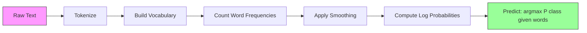

# البراغي (بايز)

> الابتكارية الاعتقاد خاطئ، ولكن لا يزال فعالا. هذا هو الجانب الجميل من ذلك.

**Type:** Build
**Language:**بايثون
**先修要求：**المرحلة الثانية، الدروس 01-07 ((التصنيف، نظرية بايز)
**Time:** ~75 分钟

## 學习目标
- من零实现带 Laplace smoothing of Multinomial Naive Bayes، تستخدم لتصنيف الكتابة
- تفسير لماذا افتراض الاستقلال البطيء هو خاطئ في الرياضيات ، ولكن في الممارسة لا يزال يمكن أن تنتج ترتيب الفئات الصحيحة
- مقارنة متعددة الأقسام ‧ برنوولي 和 غوسيان غايب بايز 变体,并为给定特征类型选择合适的版本
- في درجة عالية من النادرة على البيانات سوف البديل Bayes والعودة اللوجستية  لتقييم النقاشات، وتفسير الدور الذي يلعب فيه التداول التفاوت التفاوتية التفاوتية

## 问题
تحتاج إلى تصنيف المقال. تفرق الرسائل إلى الرسائل غير الرسائل غير الرسائل غير الرسائل غير الرسائل الرسائل. تفرق تعليقات العملاء إلى الإيجابية أو السلبية.

غالبية المصنفين هنا سوف يستهلكون. الرجعة المنطقية تحتاج إلى عينة كافية لتقدير الآلاف من الوزن. شجرة القرار يتم تقسيمها مرة واحدة فقط حسب كلمة واحدة، وسوف تكون مفرطة بشكل كبير.

البغاء بايز  قادر على التعامل مع هذه الحالة.  لقد وضع افتراضًا خاطئًا رياضيًا بعد فئة معينة ، كل سمة مستقلة عن جميع الخصائص الأخرى) ، ولكن في التصنيف الكتابي لا يزال يمكن أن يتجاوز تلك النماذج الأكثر ذكاءً ، خاصة في مجموعات التدريب مقارنة بالوقت الصغير. 

فهم لماذا فرضية خاطئة يمكن أن تجلب توقعات جيدة، سوف تسمح لك لتعلم حقيقة أساسية للتعلم الآلي: أفضل النموذج ليس أفضل النموذج صحيح، ولكن على بياناتك لديها أفضل النموذج التجارة التفاوتية التفاوتية التحيز.

## 概念
### نظرية بايز ((快速回顾)

نظرية بايز 会反转条件概率:

```
P(class | features) = P(features | class) * P(class) / P(features)
```

نريد`P(class | features)`ويعني بعد كلمة في المستند المحدد، فإن المستند ينتمي إلى فئة معينة من احتمالات.
- `P(features | class)`: احتمال رؤية هذه الكلمات في هذه الملفات
- `P(class)`:类别: احتمالات سابقة
- `P(features)`:دليل، على جميع الفئات هي نفسها، لذلك يمكن تجاهل مقارنة الفئات

`P(class | features)`أفضل فئة للفوز

### افتراض غبية عن الاستقلال

精确计算 `P(features | class)`تحتاج إلى تقدير احتمالية ظهور جميع الخصائص المشتركة. بالنسبة لمجموعة من الكلمات التي تحتوي على 10،000 كلمة، تحتاج إلى تقدير 2^10،000 قسم من المحتملات المجموعة.

افتراض ساذج هو: بعد كل فئة محددة، كل خصائص مستقلة مشروطا.

```
P(w1, w2, ..., wn | class) = P(w1 | class) * P(w2 | class) * ... * P(wn | class)
```

لم تعد تقيم توزيع مشترك مستحيل، بل تقيم توزيع بسيط لكل خصائص. كل توزيع يحتاج فقط إلى عدد واحد.

هذا الافتراض هو خطأ بوضوح. "الآلة" و "التعلم" في أي وثيقة ليست مستقلة. ولكن المصنف لا يحتاج إلى تقدير احتمال صحيح.

### لماذا لا يزال يعمل

ثلاثة أسباب:

1. **排序优先于校准。**التصنيف فقط يحتاج إلى تصنيف أعلى فئة صحيحة. حتى P(سبام) = 0.99999, بينما احتمال الحقيقي هو 0.7,Classifier  مازال سيختار صحيحة سبام.

2. **高 bias，低 variance。**افتراض الاستقلال هو نموذج قوي من قبل. فإنه يمثل نموذج قوي من أجل منع المبالغة في التنفيذ. في التدريبات المحدودة، فإن نموذج صغير خاطئ ولكن ثابت، سوف يفوز على نموذج صحيح ولكن غير مستقرة نظريا.

3. **特征冗余会相互抵消。**相关特征提供冗余证据──Classifier 会重复计算这些证据,但它也会为正确类别重复计算──如果 "آلات" و "تعلم" 总是出现,它们都会为"技术"类提供证据──NB 会把它们计算两次,但它是正确类别计算两次──

第四个实践原因:Naive Bayes 极快――训练只是单次遍历数据并统计频率――预测是一次矩阵乘法――你可以在几秒钟内完成训练――这种速度意味着你可以更快代、尝试更多特征集,并运行比慢速模型更多实验――

### الرياضيات خطوة بخطوة

让我们跟踪一个具体例――假设我们有两个类别:垃圾邮件和非垃圾邮件―― لدينا ثلاث كلمات: "免费"、"资金"","会议"、

訓練数据:
- الرسائل غير المرغوب فيها يذكر "الحرة" 80 مرات"",المال" 60 مرات"",الاجتماع" 10 مرات ((جميع 150 个词)
- لا عنصري 邮件 ذكر "مجان" 5 مرات"",مال" 10 مرات"",اجتماع" 100 مرة ((جميع 115 个词)
- 40% من الرسائل هي الرسائل غير المرسلة، 60% هي غير الرسائل غير المرسلة

استخدام ليبلاس تسطيحة ((الفا=1):

```
P(free | spam)    = (80 + 1) / (150 + 3) = 81/153 = 0.529
P(money | spam)   = (60 + 1) / (150 + 3) = 61/153 = 0.399
P(meeting | spam) = (10 + 1) / (150 + 3) = 11/153 = 0.072

P(free | not-spam)    = (5 + 1) / (115 + 3) = 6/118 = 0.051
P(money | not-spam)   = (10 + 1) / (115 + 3) = 11/118 = 0.093
P(meeting | not-spam) = (100 + 1) / (115 + 3) = 101/118 = 0.856
```

新邮件包含:"مجان"(2 次) 、"مال"(1 次) 、"اجتماع"(0 次) ✿

```
log P(spam | email) = log(0.4) + 2*log(0.529) + 1*log(0.399) + 0*log(0.072)
                    = -0.916 + 2*(-0.637) + (-0.919) + 0
                    = -3.109

log P(not-spam | email) = log(0.6) + 2*log(0.051) + 1*log(0.093) + 0*log(0.856)
                        = -0.511 + 2*(-2.976) + (-2.375) + 0
                        = -8.838
```

الرداء على المعلومات عن طريق البريد الإلكتروني. الرداء على المعلومات عن طريق البريد الإلكتروني. الرداء على المعلومات عن طريق البريد الإلكتروني. الرداء على المعلومات عن طريق البريد الإلكتروني.

### ثلاثة طرق

البديهية البديهية لديها ثلاثة أشكال. كل منها يستخدم طريقة مختلفة.`P(feature | class)`.

#### البيانات البديلة متعددة الاسماء

سوف تقوم بتحديد كل خصائص على حسابها.

```
P(word_i | class) = (count of word_i in class + alpha) / (total words in class + alpha * vocab_size)
```

`alpha`هو تسطيح اللابلاس ((下文解释) ・・・ هذا变体 هو تصنيف النص 的主力。

#### غوسيان البراغي بييز

سوف تقوم بتوزيع كل خصائص بشكل صحيح.

```
P(x_i | class) = (1 / sqrt(2 * pi * var)) * exp(-(x_i - mean)^2 / (2 * var))
```

كل فئة لديها قيمة وفرقها الخاصة لكل صفة. عندما تتبع الصفات داخل كل فئة بالفعل منحنى الزر، فإن هذه الطريقة تعمل بشكل جيد.

#### برنولي البراغي بييز

将每个特征建模为二值变量(出现或未出现) ⋅最适合短文本或二值特征矢量⋅

```
P(word_i | class) = (docs in class containing word_i + alpha) / (total docs in class + 2 * alpha)
```

على عكس المتعدد، برنولي سوف يعاقب بشكل واضح عدم وجود كلمة ما. إذا كان "حرة" عادة ما تظهر في الرسائل غير المرسلة، ولكن في هذه الرسائل غير موجودة، برنولي سوف يعتبر ذلك كدليل ضد الرسائل غير المرسلة.

### متى تستخدم كل نوع

| Variant | Feature Type | Best For | Example |
|---------|-------------|----------|---------|
| Multinomial | 计数或频率 | 文本 classification、bag-of-words | Email spam、topic classification |
| Gaussian | 连续值 | 具有近似正态特征的表格数据 | Iris classification、传感器数据 |
| Bernoulli | 二值（0/1） | 短文本、二值特征 Vector | SMS spam、presence/absence features |

### "لابلاز"

إذا ظهرت كلمة في بيانات الاختبار، ولكن لم تظهر أبدا في فئة معينة من بيانات التدريب، ماذا سيحدث؟

لا يوجد مسطح:`P(word | class) = 0/N = 0`◊ واحد صفر ضرب إلى كل ضرب بعد، سوف يجعل `P(class | features) = 0`مهما كانت الأدلة الأخرى هناك الكثير من القوة كلمة واحدة لم تُرى ستدمّر التنبؤ بأكمله، مهما كانت هناك الكثير من الأدلة الأخرى تدعمها

سيسهل المكان سيعطي كل خصائص معينة بالإضافة إلى معينة صغيرة`alpha`(عادةً على 1):

```
P(word_i | class) = (count(word_i, class) + alpha) / (total_words_in_class + alpha * vocab_size)
```

عندما ألفا = 1 时, كل كلمة على الأقل لديها احتمال صغير جدا. في البريد الاختبار يظهر "تفكيك" 不再会让垃圾邮件 概率归零.

الفا أعلى يعني تسريع أقوى ((توزيع أكثر均) ◦ الفا أقل يعني نموذج أكثر اعتمادًا في البيانات♦ الفا هي الحاجة إلى تعديل المعايير المضطربة♦

تأثير الفا:

| Alpha | Effect | When to use |
|-------|--------|-------------|
| 0.001 | 几乎没有 smoothing，信任数据 | 非常大的训练集，预计不会有未见特征 |
| 0.1 | 轻度 smoothing | 大型训练集 |
| 1.0 | 标准 Laplace smoothing | 默认起点 |
| 10.0 | 重度 smoothing，会压平分布 | 非常小的训练集，预计有许多未见特征 |

### حسابات الموقع

ضرب مئات الاحتمالات في كل نقطة صغيرة من 1) يؤدي إلى تدفق نقطة عائمة. حتى لو كان القيمة الحقيقية هو عدد صحيح صغير جدا، فإن الارتفاع في عدد النقاط العائمة سوف يتحول إلى صفر.

الحل: في الفضاء السجل: لا تعمل على الاحتمالات المتعددة، بل على الاضافة إلى عددها:

```
log P(class | x1, x2, ..., xn) = log P(class) + sum_i log P(xi | class)
```

هذا سيُحوّل التنبؤ إلى منتج نقطة:

```
log_scores = X @ log_feature_probs.T + log_class_priors
prediction = argmax(log_scores)
```

مضاعفة المصفوفة، وهذا هو سبب التنبؤ السريع جداً، وهو نفس النموذج الحسابي.

### البراغي (بايس) مقابل التراجع اللوجستي

كلتا منهما يستخدمان في تصنيف النصوص اللاسلكية.

| Aspect | Naive Bayes | Logistic Regression |
|--------|------------|-------------------|
| Type | Generative（建模 P(X\|Y)） | Discriminative（建模 P(Y\|X)） |
| Training | 统计频率 | 优化 Loss Function |
| Small data | 更好（强 prior 有帮助） | 更差（不足以估计权重） |
| Large data | 更差（错误假设会拖累） | 更好（更灵活的边界） |
| Features | 假设独立 | 能处理相关性 |
| Speed | 单次遍历，非常快 | 迭代优化 |
| Calibration | 概率较差 | 概率更好 |

 تجربة قانون: من البديهية البديهية  البداية ‬‬‬‬‬‬‬‬‬‬‬‬‬‬‬‬‬‬‬‬‬‬‬‬‬‬‬‬‬‬‬‬‬‬‬‬‬‬‬‬‬‬‬‬‬‬‬‬‬‬‬‬‬‬‬‬‬‬‬‬‬‬‬‬‬‬‬‬‬‬‬‬‬‬‬‬‬‬‬‬‬‬‬‬‬‬‬‬‬‬‬‬‬‬‬‬‬‬‬‬‬‬‬‬‬‬‬‬‬‬‬‬‬‬‬‬‬‬‬‬‬‬‬‬‬‬‬‬‬‬‬‬‬‬‬‬‬‬‬‬‬‬‬‬‬‬‬‬‬‬‬‬‬‬‬‬‬‬‬‬‬‬‬‬‬‬‬‬‬‬‬‬‬‬‬‬‬‬‬‬‬‬‬‬‬‬‬‬‬‬‬‬‬‬‬‬‬‬‬‬‬‬‬‬‬‬‬‬‬‬‬‬‬‬‬‬‬‬‬‬‬‬‬‬‬‬‬‬‬‬‬‬‬‬‬‬‬‬‬‬‬‬‬‬‬‬‬‬‬‬‬‬‬‬‬‬‬‬‬‬‬‬‬‬‬‬‬‬‬‬‬‬‬‬‬‬‬‬‬‬‬‬‬‬‬‬‬‬‬‬‬‬‬‬‬‬‬‬‬‬‬‬‬‬‬‬‬‬‬‬‬‬‬‬‬‬‬‬‬‬‬‬‬‬‬‬‬‬‬‬‬‬‬‬‬‬‬‬‬‬‬‬‬‬‬‬‬‬‬‬‬‬‬‬‬‬‬‬‬‬‬‬‬‬‬‬‬‬‬‬‬‬‬‬‬‬‬‬‬‬‬‬‬‬‬‬‬‬‬‬‬‬‬‬‬‬‬‬‬‬‬‬‬‬‬‬‬‬‬‬‬‬‬‬‬‬‬‬‬‬‬‬‬‬‬‬‬‬‬‬‬‬‬‬‬‬‬‬‬‬‬‬‬‬‬‬‬‬‬‬‬‬‬‬‬‬‬‬‬‬‬‬‬‬‬‬‬‬‬‬‬‬‬‬‬‬‬‬‬‬‬‬‬‬‬‬‬‬‬‬‬

### خط أنابيب التصنيف



في الممارسة العملية، نعمل في الفضاء السجل، لتجنب تدفق نقطة عائمة.

```
log P(class | features) = log P(class) + sum_i log P(feature_i | class)
```


```figure
naive-bayes
```

## بناءها
`code/naive_bayes.py`中的代码从零实现了多数号NB 和高斯语NB──

### المتعددة النسبNB

من التحقق:

1. **fit(X, y)**: لل كل فئة،统计每个特征的频率──加入拉普拉斯平滑──计算日志概率──存储类的前──类别频率的日志)──

2. **predict_log_proba(X)**: لكل نموذج، حساب كل كل نوع من السجلات P(فئة) + جمع السجلات P(ميزة_i ‬فئة) ‬‬‬‬‬‬‬‬‬‬‬‬‬‬‬‬‬‬‬‬‬‬‬‬‬‬‬‬‬‬‬‬‬‬‬‬‬‬‬‬‬‬‬‬‬‬‬‬‬‬‬‬‬‬‬‬‬‬‬‬‬‬‬‬‬‬‬‬‬‬‬‬‬‬‬‬‬‬‬‬‬‬‬‬‬‬‬‬‬‬‬‬‬‬‬‬‬‬‬‬‬‬‬‬‬‬‬‬‬‬‬‬‬‬‬‬‬‬‬‬‬‬‬‬‬‬‬‬‬‬‬‬‬‬‬‬‬‬‬‬‬‬‬‬‬‬‬‬‬‬‬‬‬‬‬‬‬‬‬‬‬‬‬‬‬‬‬‬‬‬‬‬‬‬‬‬‬‬‬‬‬‬‬‬‬‬‬‬‬‬‬‬‬‬‬‬‬‬‬‬‬‬‬‬‬‬‬‬‬‬‬‬‬‬‬‬‬‬‬‬‬‬‬‬‬‬‬‬‬‬‬‬‬‬‬‬‬‬‬‬‬‬‬‬‬‬‬‬‬‬‬‬‬‬‬‬‬‬‬‬‬‬‬‬‬‬‬‬‬‬‬‬‬‬‬‬‬‬‬‬‬‬‬‬‬‬‬‬‬‬‬‬‬‬‬‬‬‬‬‬‬‬‬‬‬‬‬‬‬‬‬‬‬‬‬‬‬‬‬‬‬‬‬‬‬‬‬‬‬‬‬‬‬‬‬‬‬‬‬‬‬‬‬‬‬‬‬‬‬‬‬‬‬‬‬‬‬‬‬‬‬‬‬‬‬‬‬‬‬‬‬‬‬‬‬‬‬‬‬‬‬‬‬‬‬‬‬‬‬‬‬‬‬‬‬‬‬‬‬‬‬‬‬‬‬‬‬‬‬‬‬‬‬‬‬‬‬‬‬‬‬‬‬‬‬‬‬‬‬‬‬‬‬‬‬‬‬‬‬‬‬‬‬‬‬‬‬‬‬‬‬‬‬‬‬‬‬‬‬‬‬‬‬‬‬‬‬‬‬‬‬‬‬

3. **predict(X)**: عودة احتمالات السجل أعلى من الفئة

```python
class MultinomialNB:
    def __init__(self, alpha=1.0):
        self.alpha = alpha

    def fit(self, X, y):
        classes = np.unique(y)
        n_classes = len(classes)
        n_features = X.shape[1]

        self.classes_ = classes
        self.class_log_prior_ = np.zeros(n_classes)
        self.feature_log_prob_ = np.zeros((n_classes, n_features))

        for i, c in enumerate(classes):
            X_c = X[y == c]
            self.class_log_prior_[i] = np.log(X_c.shape[0] / X.shape[0])
            counts = X_c.sum(axis=0) + self.alpha
            self.feature_log_prob_[i] = np.log(counts / counts.sum())

        return self
```

关键洞察: بعد التكامل، التنبؤ مجرد مضاعفة المصفوفة بالإضافة إلى التحيزات.

### غوسيانNB

بالنسبة للميزات المتواصلة، نحن نقدر متوسط الفئة لكل خصائص والفرق:

```python
class GaussianNB:
    def __init__(self):
        pass

    def fit(self, X, y):
        classes = np.unique(y)
        self.classes_ = classes
        self.means_ = np.zeros((len(classes), X.shape[1]))
        self.vars_ = np.zeros((len(classes), X.shape[1]))
        self.priors_ = np.zeros(len(classes))

        for i, c in enumerate(classes):
            X_c = X[y == c]
            self.means_[i] = X_c.mean(axis=0)
            self.vars_[i] = X_c.var(axis=0) + 1e-9
            self.priors_[i] = X_c.shape[0] / X.shape[0]

        return self
```

预测会对每个特征使用高斯语 PDF,并跨特征相乘(在日志空间中相加)

### التجربة: تصنيف النص

代码会生成合成袋-of-words 数据,模拟两个类别(مقالات التكنولوجيا ومقالات الرياضة) ・・・ كل فئة لديها مختلف كلمة频分布──MultinomialNB استخدام الكلمات الاحتسابية لها للتصنيف──

طريقة عمل البيانات الاصطناعية هي: نحن خلقنا 200 个词(特征列) ―― الكلمات 0-39 في مقالات التكنولوجيا عالية التردد ٬ في الرياضة عالية التردد ٬ في الرياضة عالية التردد ٬ في التكنولوجيا عالية التردد ٬ في الرياضة 80-119 كلمات 40-79 في اثنين من كل من التردد المتوسط ٬ هذا سيخلق منظر واقع: بعض الكلمات هي مؤشرات فئة قوية ، والبعض الآخر الكلمات هي الضجيج ٬

### التجربة: الميزات المستمرة

代码会生成类似于 Iris 的数据(3 个类别、4 个特征、Gaussian clusters) ・・・GaussianNB باستخدام كل فئة من متوسط القيمة والفرق لإجراء التصنيف。 كل فئة لديها مركز مختلفة(متوسط المتجه) و مختلف درجة الانتشار (((مختلفة)) ،模拟现实数据中各类测量值系统性不同的情况──

代码还演示了:
- **Smoothing comparison：**استخدام مختلف الفا 值 تدريب MultinomialNB، إظهار تأثير التسهيل 强度对准确率──
- **Training size experiment：**مع نمو التدريب من 20 نموذج يزداد إلى 1600 نموذج، كيف يرتفع نسبة الادقة في النظام الأساسي. حتى لو كانت النموذجات قليلة، نسبة الادقة في النظام الأساسي يمكن أن تصل إلى خطأ أيضا.
- **Confusion matrix：**كل فئة من الدقة، تذكر و F1 النتيجة، للكشف عن NB 在哪里犯错.

### السرعة التنبؤية

البغاء بايز 预测 هو مضاعفة المصفوفة.
- MultinomialNB: مرة مضاعفة المصفوفة (n x d) @ (d x k) = O(n * d * k)
- غوسيانNB:n * k 次 غوسيان PDF 求值,每次覆盖 d 个特征 = O(n * d * k)

 كل منهما على كل بعد هو خطي‬‬‬‬‬‬‬‬‬‬‬‬‬‬‬‬‬‬‬‬‬‬‬‬‬‬‬‬‬‬‬‬‬‬‬‬‬‬‬‬‬‬‬‬‬‬‬‬‬‬‬‬‬‬‬‬‬‬‬‬‬‬‬‬‬‬‬‬‬‬‬‬‬‬‬‬‬‬‬‬‬‬‬‬‬‬‬‬‬‬‬‬‬‬‬‬‬‬‬‬‬‬‬‬‬‬‬‬‬‬‬‬‬‬‬‬‬‬‬‬‬‬‬‬‬‬‬‬‬‬‬‬‬‬‬‬‬‬‬‬‬‬‬‬‬‬‬‬‬‬‬‬‬‬‬‬‬‬‬‬‬‬‬‬‬‬‬‬‬‬‬‬‬‬‬‬‬‬‬‬‬‬‬‬‬‬‬‬‬‬‬‬‬‬‬‬‬‬‬‬‬‬‬‬‬‬‬‬‬‬‬‬‬‬‬‬‬‬‬‬‬‬‬‬‬‬‬‬‬‬‬‬‬‬‬‬‬‬‬‬‬‬‬‬‬‬‬‬‬‬‬‬‬‬‬‬‬‬‬‬‬‬‬‬‬‬‬‬‬‬‬‬‬‬‬‬‬‬‬‬‬‬‬‬‬‬‬‬‬‬‬‬‬‬‬‬‬‬‬‬‬‬‬‬‬‬‬‬‬‬‬‬‬‬‬‬‬‬‬‬‬‬‬‬‬‬‬‬‬‬‬‬‬‬‬‬‬‬‬‬‬‬‬‬‬‬‬‬‬‬‬‬‬‬‬‬‬‬‬‬‬‬‬‬‬‬‬‬‬‬‬‬‬‬‬‬‬‬‬‬‬‬‬‬‬‬‬‬‬‬‬‬‬‬‬‬‬‬‬‬‬‬‬‬‬‬‬‬‬‬‬‬‬‬‬‬‬‬‬‬‬‬‬‬‬‬‬‬‬‬‬‬‬‬‬‬‬‬‬‬‬‬‬‬‬‬‬‬‬‬‬‬‬‬‬‬‬‬‬‬‬‬‬‬‬‬‬‬‬‬‬‬‬‬‬‬‬‬‬‬‬‬‬‬‬‬‬‬‬‬‬‬‬‬‬‬‬‬‬

## استخدمها
استخدام التجارة، هذه التغيرات هي نفس الطريقة:

```python
from sklearn.naive_bayes import GaussianNB, MultinomialNB

gnb = GaussianNB()
gnb.fit(X_train, y_train)
print(f"GaussianNB accuracy: {gnb.score(X_test, y_test):.3f}")

mnb = MultinomialNB(alpha=1.0)
mnb.fit(X_train_counts, y_train)
print(f"MultinomialNB accuracy: {mnb.score(X_test_counts, y_test):.3f}")
```

استخدام التعلم تصنيف النص:

```python
from sklearn.feature_extraction.text import CountVectorizer
from sklearn.naive_bayes import MultinomialNB
from sklearn.pipeline import Pipeline

text_clf = Pipeline([
    ("vectorizer", CountVectorizer()),
    ("classifier", MultinomialNB(alpha=1.0)),
])

text_clf.fit(train_texts, train_labels)
accuracy = text_clf.score(test_texts, test_labels)
```

`naive_bayes.py`سيتم مقارنة الكود المتوسط مع الكود المتوسط على نفس البيانات من الصفر للتحقق من صحةها.

### (تف-إيدف) مع (بايز) البديل

تعتبر الحسابات الأولى من الكلمات التي تظهر في كل مرة نفس الوزن. ولكن مثل "ال" و "هو" مثل الكلمات العادة تحدث في كل فئة.

```python
from sklearn.feature_extraction.text import TfidfVectorizer
from sklearn.naive_bayes import MultinomialNB
from sklearn.pipeline import Pipeline

text_clf = Pipeline([
    ("tfidf", TfidfVectorizer()),
    ("classifier", MultinomialNB(alpha=0.1)),
])
```

قيمة TF-IDF غير سلبية ، لذلك يمكن استخدامها مع MultinomialNB.

### يستخدم في قصص قصيرة

对于短文本(tweets、SMS、chat messages),BernoulliNB可能优于多文本.

```python
from sklearn.naive_bayes import BernoulliNB
from sklearn.feature_extraction.text import CountVectorizer

text_clf = Pipeline([
    ("vectorizer", CountVectorizer(binary=True)),
    ("classifier", BernoulliNB(alpha=1.0)),
])
```

CountVectorizer 中的 `binary=True`标志会将所有计数转换为0/1──没有它,BernoulliNB 仍然能运行,但它看到的是并非为其设计的计数──

### تحديد المعدل NB احتمالات

ن.ب. 概率校准很差.ب.ب.ب. عندما نقول P(سبام) = 0.95 时, احتمال الحقيقي قد يكون 0.7.

```python
from sklearn.calibration import CalibratedClassifierCV

calibrated_nb = CalibratedClassifierCV(MultinomialNB(), cv=5, method="sigmoid")
calibrated_nb.fit(X_train, y_train)
proba = calibrated_nb.predict_proba(X_test)
```

هذا من خلال التحقق من التحقق من الصلاحية المتقاطعة، في النب المرتبطة على العدد الأصلي من النسب، والعودة اللوجستية.

### القوطس المشتركة

1. **负特征值。**المتعددة النسب تطلب خصائص غير سلبية. إذا كان لديك قيمة سلبية، مثل بعض الإعدادات تحت TF-IDF، أو خصائص بعد قياسها، فان استخدم GAUSsianNB، أو ضع خصائصها على الحالة.

2. **零方差特征。**غوسيانNB سوف تفرق في الاختلافات. إذا كان الاختلافات في صفة واحدة من الخصائص هي صفر (كل القيم هي نفسها) ، فإن احتمال الحساب سوف يظهر مشكلة.

3. **类别不平衡。**إذا 99% من المراسلات هي غير مرئية، قبل P(غير مرئية) = 0.99 会非常强, حتى تم الضغط على دليل الاحتمالات. يمكنك تحديد المراتب الأولية للصف, أو استخدام sklearn 中的 class_prior 参数.

4. **特征缩放。**MultinomialNB لا تحتاج إلى تراكم ((يعالج حسابات) ―― غوسيانNB أيضا لا تحتاج إلى تراكم ((يعتقد خصائصاً على حدة) ―― هذا هو هو ميزة لها مقارنة بالعودة اللوجستية و SVM، والآخرين حساسين للمقاييس الخاصة بها。

## 交付 it
本课会产出:
- `outputs/skill-naive-bayes-chooser.md`: مهارة اتخاذ القرارات المستخدمة في اختيار الحق
- `code/naive_bayes.py`: من صفر تحقيق MultinomialNB و غوسيانNB، ومحتوي على التكامل مع النسبة

### عندما يفشل بايز البطيء

عندما يسبب افتراض الاستقلال خطأ في ترتيب النظام (و ليس فقط خطأ احتمالية) ، فإن NB سوف يفشل.

1. **强特征交互。**إذا كان الفئة تعتمد على مجموعة من الصفات ، وليس على أي سمة فردية واحدة مثل نمط XOR ، فإن NB سوف تكون خاطئة تماما.

2. **高度相关且 evidence 相反的特征。**إذا كانت الخصائص A تُحكم في "الافشاش"، والخصائص B تُحكم في "غير الفشاش"، ولكن A 和 B 完全相关(现实中它们总是一致),NB 会看到实际上不存在冲突证据──

3. **非常大的训练集。**عندما يكون هناك الكثير من البيانات، مثل التراجع اللوجستي، فإن النماذج التمييزية سوف تتعلم إلى حدود القرار الحقيقي، وتتجاوز النب.

في الممارسة العملية، بالنسبة لتصنيف النص، هذه الطرق الفاشلة ليست شائعة. عدد من خصائص النص هو أكثر ضعفاً من عدد من خصائص النص، بينما غالباً ما يضاف الأخطاء في افتراض الاستقلال بعضها البعض. بالنسبة لبيانات الشكل ذات الصلة بالقوة القليلة فقط، يرجى الاعتبار الأولويات التراجع اللوجستي أو النماذج القائمة على الأشجار.

## التدريب
1. **Smoothing experiment。**في بيانات النص باستخدام ألفا  قيمة 0.01 、 0.1 、 1.0 、 10.0 و 100.0  التدريب MultinomialNB ٬ رسم دقة مقابل الألفا٬ حيث يصل الأداء إلى القمة؟ لماذا عالية جدا الألفا ٬ يؤذى الأداء؟

2. **Feature independence test。**خذ مجموعة بيانات حقيقية. اختيار كلمات ذات صلة واضحة. (آل) و (تعلم)  حساب P  كلمة 1  فئة) * P  كلمة 2  فئة) ، ومقارنة مع P  كلمة 1 و كلمة 2  فئة) مقارنة.

3. **Bernoulli implementation。**扩展代码,添加一个BernoulliNB类──将包-of-words 转换为二值(present/absent),并在文本数据上与多式NB比较精度──什么时候Bernoulli 会赢?

4. **NB vs Logistic Regression。**في البيانات المقدسة تدريب اثنين من: من 100 نموذج التدريب بدأت، تزداد تدريجيا إلى 10,000: رسم دقة كل منهما مقابل حجم مجموعة التدريبات: رجعة منطقية في أي وقت تتجاوز الباهين؟

5. **Spam filter。**构建一个完整的垃圾邮件分类器:tokenize 原始邮件文本、构建词汇、创建包-of-words features、训练多维数NB,并使用精度和回忆 评估(不只是精度为什么?)

## 关键术语
| Term | What people say | What it actually means |
|------|----------------|----------------------|
| Naive Bayes | “简单的概率 classifier” | 一个使用 Bayes' theorem，并假设给定类别后特征 conditionally independent 的 classifier |
| Conditional independence | “特征彼此不影响” | P(A, B \| C) = P(A \| C) * P(B \| C)——一旦知道 C，知道 B 不会告诉你关于 A 的任何新信息 |
| Laplace smoothing | “Add-one smoothing” | 给每个特征添加一个小计数，防止零概率主导预测 |
| Prior | “看到数据之前你相信什么” | P(class)——观察任何特征之前，每个类别的概率 |
| Likelihood | “数据拟合得有多好” | P(features \| class)——如果类别已知，观察到这些特征的概率 |
| Posterior | “看到数据之后你相信什么” | P(class \| features)——观察到特征后，类别的更新概率 |
| Generative model | “建模数据如何生成” | 学习 P(X \| Y) 和 P(Y)，然后使用 Bayes' theorem 得到 P(Y \| X) 的模型 |
| Discriminative model | “建模 decision boundary” | 不建模 X 如何生成，而是直接学习 P(Y \| X) 的模型 |
| Log probability | “避免 underflow” | 使用 log P 而不是 P，防止许多小数相乘后在浮点数中变成零 |

## 延伸阅读
- [scikit-learn Naive Bayes docs](https://scikit-learn.org/stable/modules/naive_bayes.html) 三种变体及其数学细节
- [McCallum and Nigam, A Comparison of Event Models for Naive Bayes Text Classification (1998)](https://www.cs.cmu.edu/~knigam/papers/multinomial-aaaiws98.pdf) 文本中 متعددة النطقات مقارنة مع Bernoulli الكلاسيكية
- [Rennie et al., Tackling the Poor Assumptions of Naive Bayes Text Classifiers (2003)](https://people.csail.mit.edu/jrennie/papers/icml03-nb.pdf)  تحسينات في النص
- [Ng and Jordan, On Discriminative vs. Generative Classifiers (2001)](https://ai.stanford.edu/~ang/papers/nips01-discriminativegenerative.pdf) ثبت NB في بيانات أقل وقتا من LR 收更快
