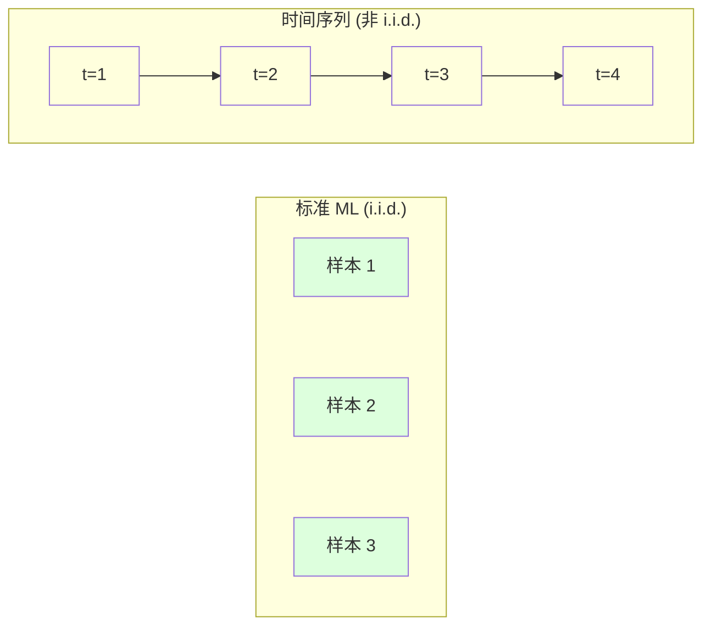
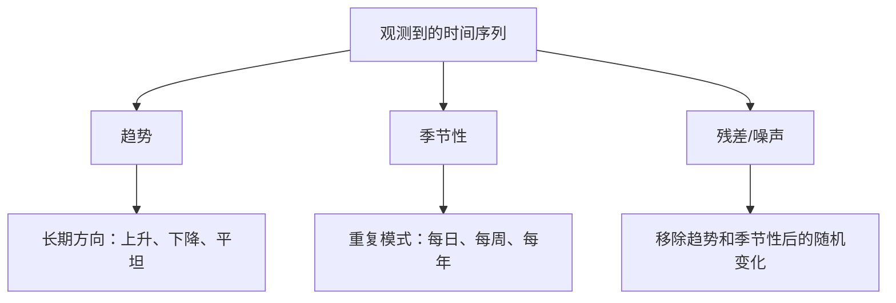
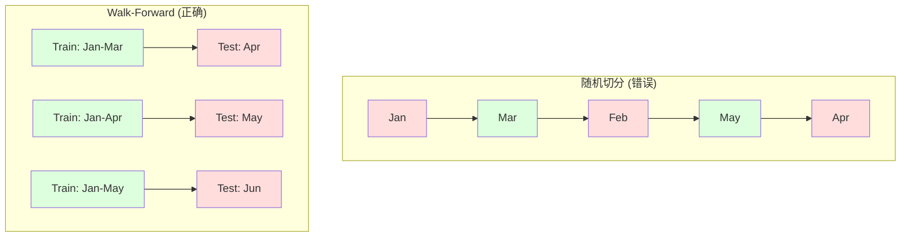

# 时间序列基础

> يمكن أن تتوقع نتائج الماضي بالفعل -- قبل التوقيع هو أولاً فحص التوازن.

**Type:** Build
**Language:**بايثون
**Prerequisites:** Phase 2, Lessons 01-09
**Time:** ~90 分钟

## 學习目标

- تقسيم تسلسل الوقت إلى المواجهات والحصول الموسمي والباقي، ومراقبة الاستقرار
- تطبيق الخصائص المتأخرة والحسابات المتدفقة، تحويل تسلسل الوقت إلى مشكلة مراقبة التعلم
- إنشاء التحقق المباشر  إطار، منع التسريب في المستقبل
- شرح لماذا تقسيم القطار / الاختبار المتواصل على تسلسل الوقت غير فعال ، ويعرض فارق في الأداء بين ذلك والقطع الوقت الحقيقي

## 问题

لديك بيانات حسب التسلسل الزمني. . . . . . . . . . . . . . . . . . . . . . . . . . . . . . . . . . . . . . . . . . . . . . . . . . . . . . . . . . . . . . . . . . . . . . . . . . . . . . . . . . . . . . . . . . . . . . . . . . . . . . . . . . . . . . . . . . . . . . . . . . . . . . . . . . . . . . . . . . . . . . . . . . . . . . . . . . . . . . . . . . . . . . . . . . . . . . . . . . . . . . . . . . . . . . . . . . . . . . . . . . . . . . . . . . . . . . . . . . . . . . . . . . . . . . . . . . . . . . . . . . . . . . . . . . . . . . . . . . . . . . . . . . . . . . . . . . . . . . . . . . . . . . . . . . . . . . . . . . . . . . . . . . . . . . . . . . . . . . . . . . . . . . . . . . . . . . . . . . . . . . . . . . . . . . . . . . . . . . . . . . . . . . . . . . . . . . . . . . . . . . . . . . . . . . . . . . . . . . . . . . . . . . . . . . . . . . . . . . . . . . . . . . . . . . . . . . . . . . . . . . . . . . . . . . . . . . . . . . . . . . . . . . . . . . . . . . . . . . . . . . . . . . . . . . . . . . . . . . . .

ستخرج معايير ML 工具箱:随机火车/测试分分"",تأهل عبر"",输入特征矩阵"",输出预测──每一步都是错的──

序列時間會打破標準 ML 依依假设──样本不独立-- 温度今日依赖昨天的温度──随机切分将未来信息泄漏到过去── 在后测试中看起来很好,到生产环境会失败,因为它们依赖于随时间漂移的模式──

نموذج يستخدم التحقق المتقاطع عشوائيا يحصل على دقة 95%، مع تقييم وقتي صحيح يمكن أن يكون فقط 55%. هذا الفرق ليس تفاصيل تقنية.

هذا الدراسة تغطي محتوى الأساسي: ما هو وقت البيانات مختلفة، كيفية تقييم النموذج بشكل صادق، وكيفية تحويل تسلسل الوقت إلى معيار ML  نموذج يمكن استخدامها.

## 概念

###  الوقت المتسلسل ما هو مختلف

标准 ML 假设 i.i.d. -- 独立同分布── كل نموذج يتم استخراجه من نفس التوزيع، ويكون مستقلًا عن النموذج الآخر── سلسلة الزمن تتعارض مع هذين النقطتين:

- **不独立。**أسعار الأسهم اليوم تعتمد على أسعار الأمس.
- **不同分布。**تُوزع مع مرور الوقت.

هذه الانتهاكات ليست بسيطة. سوف تغير الطريقة التي تقوم بها ببناء الخصائص، طريقة تقييم النموذج، وكذلك ما هي الخوارزميات المتاحة.



في المعلم المعتاد، يمكن تغيير النموذج.

### 时间序列的组成部分

كل سلسلة زمنية هي مجموعة من المحتويات التالية:



- **趋势**:长期方向── ارتفاع الإيرادات سنويا بنسبة 10%── ارتفاع درجة الحرارة العالمية──
- **季节性**: تعدد التداول على فترة فترة فترة فترة فترة فترة فترة فترة فترة فترة فترة فترة فترة فترة فترة فترة فترة فترة فترة فترة فترة فترة فترة فترة فترة فترة فترة فترة فترة فترة فترة فترة فترة فترة فترة فترة فترة فترة فترة فترة فترة فترة فترة فترة فترة فترة فترة فترة فترة فترة فترة فترة فترة فترة فترة فترة فترة فترة فترة فترة فترة فترة فترة فترة فترة فترة فترة فترة فترة فترة فترة فترة فترة فترة فترة فترة فترة فترة فترة فترة فترة فترة فترة فترة فترة فترة فترة فترة فترة فترة فترة فترة فترة فترة فترة فترة فترة فترة فترة فترة فترة فترة فترة فترة فترة فترة فترة فترة فترة فترة فترة فترة فترة فترة فترة فترة فترة فترة فترة فترة فترة فترة فترة فترة فترة فترة فترة فترة فترة فترة فترة فترة فترة فترة فترة فترة فترة فترة فترة فترة فترة فترة فترة فترة فترة فترة فترة فترة فترة فترة فترة فترة فترة فترة فترة ف ف فترة فترة ف ف ف ف ف ف فترة ف ف ف ف ف ف فترة ف ف ف ف ف ف فة ف ف ف ف ف ف ف ف ف ف ف فة ف ف ف ف فة ف ف ف ف ف ف ف ف فة ف فة ف ف ف فة فة ف ف ف ف ف ف ف ف ف فة ف ف ف ف ف فة ف ف ف فة ف ف ف ف ف ف فة ف ف ف ف ف ف فة ف ف ف ف ف ف ف ف ف ف ف ف ف ف ف ف ف ف ف ف ف ف ف ف ف ف ف ف ف ف ف ف فة ف ف ف ف ف ف ف ف ف ف ف ف ف ف ف ف ف ف ف ف ف ف ف ف ف ف ف ف ف ف ف ف ف ف ف ف ف ف ف ف ف ف ف ف ف ف ف ف ف ف ف
- **残差**: تحويل الاتجاهات والجزء المتبقي بعد الموسمية. إذا كان الفجوة تبدو مثل الضجيج البيضاء، فانشأ تفكيك التقاط الإشارة.

### سـمـانـة

إذا كانت الخصائص الإحصائية لسلسلة الوقت ((المتوسط والفرق والانصراف) لا تتغير مع مرور الوقت ، فهو ثابت.

**为什么重要：**في نموذج تدريب على بيانات شهر يبدأ، فإن متوسط القيمة المتعلمة تختلف عن متوسط القيمة المقدمة في شهر يبدأ.

**如何检查：**في النوافذ حساب متوسط التدفق و انحراف المعيار التدفق. إذا كانت تتحرك، فإن المرتبة هي غير متسطعة.

**如何修复：**差分── لا تبدأ في التغيرات بين القيم الأصلية بل تبدأ في التغيرات بين القيم المتصلة:

```
diff[t] = value[t] - value[t-1]
```

إذا كان الفارق في العالم الحقيقي لا يستطيع أن يُسطّد، فلن يُطبق مرة أخرى.

**示例：**

المرتبة الأولى:[100، 102, 106, 112, 120]
一阶差分: [2, 4, 6, 8](ما زال في الاتجاه الصاعد)
二阶差分: [2, 2, 2](常数 -- 平稳)

المسلسل الأول له اتجاهات ثانوية. التقسيم الأول يجعله اتجاهات خطية. التقسيم الثاني يجعله متساويا. في الممارسة العملية، لا تحتاج إلى أكثر من اثنين من التقسيمات.

**形式化检验：**اختبار إضافية ديكي-فولر (ADF) هو اختبار قياسي متساوي. الافتراض الأصلي هو التيجة غير متساوية. . . . . . ..................................................................................................................................................................................................................................

### عن صلة

تتعلق القيمة الزمنية t والقيمة الزمنية t-k( الماضي k 步) بين الارتباطات.

**ACF 告诉你：**
- يمكن أن يتذكر الجدول بعد ذلك. إذا كان ACF في التأخير 5  بعد انخفاض إلى صفر، فإن 5 步 قبل قيمة لا علاقة لها.
- إذا كان هناك قمة في ACF في 12 (حسابات الشهر) ، فستوجد قمة في السنة.
- يجب أن تخلق الكثير من التأخيرات. استخدام حتى ACF أصبح لا يُنظر إليه.

**PACF (Partial Autocorrelation Function)**إذا كان اليوم مرتبطاً بـ 3 天前، فقط لأن الثاني مرتبطاً بالأمس، فإن تأخير 3 من PACF سيكون صفر، أما تأخير 3 من ACF لن يكون صفر.

### 滞后特征:把时间序列转换为监督学习

标准 ML 模型需要 ميزة المصفوفة X 和 هدف y。 تسلسل الوقت فقط يعطي لك قيمة واحدة。 برج梁就是滞后特征。

取序列 [10, 12, 14, 13, 15],创建 lag-1 和 lag-2 خصائص:

| lag_2 | lag_1 | target |
|-------|-------|--------|
| 10    | 12    | 14     |
| 12    | 14    | 13     |
| 14    | 13    | 15     |

الآن لديك معيار للعودة 问题── أي نموذج ML 模型(العودة الخطية、الغابات العشوائية、التزايد الدرجي) يمكن أن يتم من خلال هذه التأخير  التنبؤ الهدف──

يمكنك أن تصنع خصائص أخرى:
- **Rolling statistics:**مؤخرا k 个值的平均、std、min、max
- **Calendar features:**أسبوع ، أسبوع ، عطلة ، عطلة
- **Differenced values:**مقارنة بتغير الخطوة السابقة
- **Expanding statistics:**累计平均 累计 sum
- **Ratio features:**当前值 / المتوسط المتدفق (偏离近期平均值多远)
- **Interaction features:**تأثير عمل على التكامل)

**多少个 lag？**استخدام وظيفة التواصل الذاتي. إذا كان ACF إلى التأخير 10 واضحا، فاستخدم 10 التأخيرات على الأقل. إذا كان هناك ثواني، فيمكن أن يحتوي على التأخير 7 ((ويمكن أن يحتوي على 14)

**target 对齐陷阱。**عند إنشاء خصائص متأخرة ، يجب أن يكون الهدف قيمة الوقت t ، و يجب أن تستخدم جميع الخصائص قيمة الوقت t-1 أو أقدم. إذا لم تكن على استعداد لتفكير في قيمة الوقت t كخصائص مدرجة ، فأنت تمتلك جهازًا للتنبؤ المثالي - و نموذجًا غير مفيد تمامًا.

### التحقق من التحقق

هذا هو أهم مفهوم في هذا الدراسة. المعيار من التحقق عبر الدرجة الكثيفة. سوف يتم توزيع العينات على القطار و الاختبار.



التحقق من التحقق من التحقق من التحقق من التحقق من التحقق من التحقق من التحقق من التحقق من التحقق من التحقق من التحقق من التحقق من التحقق من التحقق من التحقق من التحقق من التحقق من التحقق من التحقق من التحقق من التحقق من التحقق من التحقق من التحقق من التحقق من التحقق من التحقق من التحقق من التحقق من التحقق من التحقق من التحقق من التحقق من التحقق من التحقق من التحقق من التحقق من التحقق من التحقق من التحقق من التحقق من التحقق من التحقق من التحقق من التحقق من التحقق من التحقق من التحقق من التحقق من التحقق من التحقق من التحقق من التحقق من التحقق من التحقق من التحقق من التحقق من التحقق من التحقق من التحقق من التحقق من التحقق من التحقق من التحقق من التحقق من التحقق من التحقق من التحقق من التحقق من التحقق من التحقق من التحقق.
1. في截止 الوقت t' DATA على التدريب
2. 预测时间 t+1( أو تستخدم في التنبؤات المتعددة
3. ستعمل النافذة إلى الأمام
4. 重复

كل طيف اختبار يحتوي فقط على جميع بيانات التدريب بعد ذلك. لا توجد تسريبات مستقبلية. هذا سوف يعطيك تقديرًا صادقًا، يوضح كيفية أداء النموذج بعد نشرها.

**Expanding window**استخدام جميع البيانات التاريخية للتدريب**Sliding window**استخدام ثابتة كبيرة من التدريب النافذة ((انزلع النافذة) ―― عندما تثق أن أكثر البيانات القديمة لا تزال ذات صلة، استخدام توسيعها── عندما العالم يتغير ومع البيانات القديمة مضرة، استخدام التزحلق──

### أريما 直觉

أريما هو نموذج تسلسل الوقت الكلاسيكي.

- **AR (Autoregressive):**من الماضي قيمة للتنبؤ.AR(p) استخدام قريبا p 个值.
- **I (Integrated):**通過差分实现平稳性──I(d) 应用 d 次差分──
- **MA (Moving Average):**من الماضي التوقعات خطأ إجراء التوقعات.

ARIMA(p, d, q) 组合了三者──你基于ACF/PACF 分析或自动搜索(ARIMA-auto)选择 p、d、q──

لن ننجز ARIMA من الصفر - فإنه يتطلب تحسين القيمة العددية، خارج نطاق الدراسة.

### ماذا تستخدم ماذا

| Approach | Best For | Handles Seasonality | Handles External Features |
|----------|---------|-------------------|------------------------|
| 滞后特征 + ML | 有很多外部特征的表格数据 | 通过 calendar features | 是 |
| ARIMA | 单个单变量序列、短期 | SARIMA 变体 | 否（ARIMAX 支持有限） |
| Exponential smoothing | 简单趋势 + 季节性 | 是（Holt-Winters） | 否 |
| Prophet | 业务预测、节假日 | 是（Fourier terms） | 有限 |
| Neural networks (LSTM, Transformer) | 长序列、多序列 | 学习得到 | 是 |

بالنسبة لمعظم المشاكل العملية ، فإن تعزيز الخصائص الخلفية + التدفق هو نقطة البدء الأكثر قوة.

### 预测 الأفق و استراتيجيات

单步预测会预测未来一个时间步――多步预测会预测多个时间步――有三种策略:

**Recursive (iterated):**التنبؤ الخطوة التالية، ضع النتيجة التنبؤية كإدخال الخطوة التالية. بسيط، ولكن الخطأ سوف يتراكم. كل التنبؤ يستخدم التنبؤ العلوي، وبالتالي فإن الخطأ سيكون معقد.

**Direct:**للجميع الأفق  تدريب نموذج منفصل 模型-1 预测 t+1,Model-5 预测 t+5── لا يوجد أي خطأ في التجميع، ولكن نموذج تدريب كل نموذج أقل، ولا يشتركون معلومات‬

**Multi-output:**訓練一同時输出所有水平的模型──跨水平 共享信息,但需要支持多输出模型(或自定义 Loss Function)──

بالنسبة لمعظم المشاكل العملية، الأفق القصير (١-٥ 步) من التكراري 开始, إلى الأفق الطويل استخدام مباشرة

### 时间序列中的常见错误

| Mistake | Why it happens | How to fix |
|---------|---------------|-----------|
| 随机 train/test split | 来自标准 ML 的习惯 | 使用 walk-forward 或 temporal split |
| 使用未来特征 | 误把时间 t 的特征包含进去 | 审计每个特征的时间对齐 |
| 对季节性 overfitting | 模型记住了日历模式 | 在 test set 中留出一个完整季节周期 |
| 忽略尺度变化 | 收入翻倍但模式保持 | 建模百分比变化而非绝对值 |
| 过多滞后特征 | “更多历史更好” | 使用 ACF 确定相关 lag |
| 不做差分 | “模型会自己搞定” | 树模型能处理趋势；线性模型需要平稳性 |


```figure
f3-series-decompose
```

## بناءها

`code/time_series.py`من الصفر تم تحقيق البرمجيات المركزية.

### 滞后特征创建器

```python
def make_lag_features(series, n_lags):
    n = len(series)
    X = np.full((n, n_lags), np.nan)
    for lag in range(1, n_lags + 1):
        X[lag:, lag - 1] = series[:-lag]
    valid = ~np.isnan(X).any(axis=1)
    return X[valid], series[valid]
```

هذا سوف يحول سلسلة 1D إلى المصفوفة المصفوفة، كل سطر منها هو أقرب.`n_lags`个值作为特征,并以当前值作为目标──

### التحقق المتبادل

```python
def walk_forward_split(n_samples, n_splits=5, min_train=50):
    assert min_train < n_samples, "min_train must be less than n_samples"
    step = max(1, (n_samples - min_train) // n_splits)
    for i in range(n_splits):
        train_end = min_train + i * step
        test_end = min(train_end + step, n_samples)
        if train_end >= n_samples:
            break
        yield slice(0, train_end), slice(train_end, test_end)
```

كل مرة يتم التأكد من بيانات التدريب بشكل صارم قبل بيانات الاختبار.

### 简单 السلطة التنقلية 模型

نموذج AR 纯就是 تراجع خطي على الخصائص المتأخرة:

```python
class SimpleAR:
    def __init__(self, n_lags=5):
        self.n_lags = n_lags
        self.weights = None
        self.bias = None

    def fit(self, series):
        X, y = make_lag_features(series, self.n_lags)
        # Solve via normal equations
        X_b = np.column_stack([np.ones(len(X)), X])
        theta = np.linalg.lstsq(X_b, y, rcond=None)[0]
        self.bias = theta[0]
        self.weights = theta[1:]
        return self
```

هذا في المفهوم هو نفس التراجع الخطي في الدروس 02 تماما، فقط تطبيق في النسخة المتأخرة من الوقت من نفس المتغيرات.

### فحص سليم

代码计算滚动统计,用于可视化和数值化评估平稳性:

```python
def check_stationarity(series, window=50):
    rolling_mean = np.array([
        series[max(0, i - window):i].mean()
        for i in range(1, len(series) + 1)
    ])
    rolling_std = np.array([
        series[max(0, i - window):i].std()
        for i in range(1, len(series) + 1)
    ])
    return rolling_mean, rolling_std
```

إذا كان متوسط التدفقات المتدفقة يتغير أو يتغير، فإن المرتبة هي غير متسقة.

يمر الكود أيضاً من خلال النصف الأول والنصف الثاني من سلسلة المقارنة لتحقيق الاستقرار. إذا كان الفارق في القيمة المتوسطة أكثر من نصف الفارق المعياري، أو الفارق في الجانب أكثر من 2x، يتم وضع علامة على النظام بأنه غير مستقر.

### عن صلة

```python
def autocorrelation(series, max_lag=20):
    n = len(series)
    mean = series.mean()
    var = series.var()
    acf = np.zeros(max_lag + 1)
    for k in range(max_lag + 1):
        cov = np.mean((series[:n-k] - mean) * (series[k:] - mean))
        acf[k] = cov / var if var > 0 else 0
    return acf
```

## استخدمها

باستخدام التعلم، يمكنك أن تقوم بتقديم الخصائص المتأخرة مباشرة إلى أي رجعي:

```python
from sklearn.linear_model import Ridge
from sklearn.ensemble import GradientBoostingRegressor

X, y = make_lag_features(series, n_lags=10)

for train_idx, test_idx in walk_forward_split(len(X)):
    model = Ridge(alpha=1.0)
    model.fit(X[train_idx], y[train_idx])
    predictions = model.predict(X[test_idx])
```

对于ARIMA,使用统计模型:

```python
from statsmodels.tsa.arima.model import ARIMA

model = ARIMA(train_series, order=(5, 1, 2))
fitted = model.fit()
forecast = fitted.forecast(steps=30)
```

`time_series.py`عرضت middle code طريقتين، واستخدمت التحقق المباشر للمقارنة.

### التسجيلات التاريخية

التدقيق في التحقق من التحقق من التحقق من التحقق من التحقق من التحقق من التحقق من التحقق من التحقق من التحقق من التحقق من التحقق من التحقق من التحقق من التحقق من التحقق من التحقق من التحقق من التحقق من التحقق من التحقق من التحقق من التحقق من التحقق من التحقق من التحقق من التحقق من التحقق من التحقق من التحقق من التحقق من التحقق من التحقق من التحقق من التحقق من التحقق من التحقق من التحقق من التحقق من التحقق من التحقق من التحقق من التحقق من التحقق من التحقق من التحقق من التحقق من التحقق من التحقق من التحقق من التحقق من التحقق من التحقق من التحقق من التحقق من التحقق من التحقق من التحقق من التحقق من التحقق من التحقق من التحقق من التحقق من التحقق من التحقق من التحقق من التحقق من التحقق من التحقق من التحقق من التحقق من التحقق من التحقق من التحقق من التحقق من التحقق من التحقق من التحقق من التحقق من التحقق من التحقق من التحقق من التحقق من التحقق من التحقق من التحقق من التحقق من التحقق من التحقق من التحقق من التحقق من التحقق من التحقق من التحقق من التحقق من التحقق من التحق.`TimeSeriesSplit`:

```python
from sklearn.model_selection import TimeSeriesSplit

tscv = TimeSeriesSplit(n_splits=5)
for train_index, test_index in tscv.split(X):
    X_train, X_test = X[train_index], X[test_index]
    y_train, y_test = y[train_index], y[test_index]
    model.fit(X_train, y_train)
    score = model.score(X_test, y_test)
```

هذا يساوي ما ننجزه من الصفر`walk_forward_split`ولكن تم تحميلها في إطار التحقق المتقاطع للسكولرن`cross_val_score`إستخدام:

```python
from sklearn.model_selection import cross_val_score

scores = cross_val_score(model, X, y, cv=TimeSeriesSplit(n_splits=5))
print(f"Mean score: {scores.mean():.4f} +/- {scores.std():.4f}")
```

### 评估指标

时间序列预测 استخدام رجعة 指标, ولكن带有时间感知的上下文:

- **MAE (Mean Absolute Error):**الواقع - متوسط قيمة y_prediction 
- **RMSE (Root Mean Squared Error):**متوسط خطأ مربع ⋅ مربع جذور. بالمقارنة مع MAE، فإنه يعاقب على خطأ كبير أكثر ثقيلة.
- **MAPE (Mean Absolute Percentage Error):** خطأ / قيمة صحيحة في * 100 متوسط القيمة.
- **Naive baseline comparison:**始终与简单基线比较――季节性天真基线 会预测上一周期的价值(昨天、上周) ・・・ إذا كان نموذجك لا يستطيع هزيمة الباهين ، فان هناك مشكلة‬

### الميزات المتحركة

يظهر الكود خصائص متأخرة إضافة إحصاءات متداولة على نوافذ 7 天 و 14 天 المتوسط ̊std、min、max)  هذه الخصائص ستقدم نموذج معلومات عن الاتجاهات والتغيرات في الأجل القريب ، بينما هذه المعلومات فقط بسبب الخصائص المتأخرة لا يمكن استيعابها‬

على سبيل المثال، إذا كان المتوسط المتحرك في الصعود، فهناك اتجاهات صعودية. إذا كان المتحرك في الصعود في الزيادة، فهناك اتجاهات تتزايد.

## 交付 it

本课产出:
- `outputs/prompt-time-series-advisor.md`-- إرسال لمشكلة تحديد سلسلة الوقت
- `code/time_series.py`-- 滞后特征、步行前进验证、AR 模型、平稳性检查

### يجب أن تفوز بالخط الأساسي

قبل بناء أي نموذج، أولاً إنشاء خط أساسي:

1. **Last value (persistence).**预测 غداً مثل اليوم  بالنسبة للعديد من المواصفات، هذا من الصعب أن نضرب
2. **Seasonal naive.**预测 اليوم سوف يكون نفس اليوم مثل الأسبوع الماضي أو نفس اليوم من العام الماضي. إذا كان نموذجك لا يستطيع هزيمته، فمن الواضح أنه لم يتعلم أي نموذج مفيد خارج موسمية.
3. **Moving average.**预测 قريباً متوسط قيمة الـ k 个值──能平滑噪音,但不能捕捉突变──

إذا كان نموذج ML الخاص بك المتقدم يعطي خطة أساسية ساهمة موسمية، فأنت لديك حركة. الأكثر شيوعاً هو: التفشيل المستقبلي في الخصائص، طريقة التقييم الخطأ، أو أن الترتيب نفسه هو بالفعل متأثر وغير متوقع.

### 实用建议

1. **从绘图开始。**قبل أي بناء، قم بتخطيط الترتيب الأصلي أولاً. ابحث عن الاتجاهات، والحداثيات، والفروق الهيكلية، والتحول المفاجئ في السلوك.

2. **先差分，再建模。**إذا كان هناك اتجاه واضح في الترتيب، فيمكن إجراء التفريق قبل أن يتم إنشاء خصائص متأخرة. يمكن أن تتعامل النماذج القائمة على الأشجار مع التوجه، ولكن النماذج السريعة لا يمكن، والتفريق عادة ما لا يكون سيئا.

3. **至少留出一个完整季节周期。**إذا كان هناك أسبوع من الموسم، فإن مجموعة الاختبارات تحتاج على الأقل إلى أسبوع كامل. إذا كان هناك أسبوع من الموسم، فإنه يتطلب على الأقل شهر كامل. وإلا لا يمكنك تقييم ما إذا كان النموذج قد تم القبض على نموذج الموسم.

4. **在生产中监控。**مع تغير العالم، فإن نموذج تسلسل الوقت يتدهور مع مرور الوقت.

5. **警惕 regime changes。**لا يمكن أن تتوقع النموذج الذي تم تدريبه على البيانات قبل الوباء السلوك بعد الوباء.

6. **对偏斜序列做 log-transform。**收入、价格和计数通常右偏──取日记可以稳定方差,并把乘法模式变成加法模式,从而让线性模型能够处理──在日记空间预测,再取指数回到原始单位──

## التدريب

1. **平稳性实验。**تطور سلسلة من الاتجاهات ذات الخطوط. استخدام إحصاءات التدفق. تطبيق التوازن. تطبيق التفاوت.

2. **Lag 选择。**في تسلسل موسمي ((مدة = 7) على حساب ACF.‬‬‬‬‬‬‬‬‬‬‬‬‬‬‬‬‬‬‬‬‬‬‬‬‬‬‬‬‬‬‬‬‬‬‬‬‬‬‬‬‬‬‬‬‬‬‬‬‬‬‬‬‬‬‬‬‬‬‬‬‬‬‬‬‬‬‬‬‬‬‬‬‬‬‬‬‬‬‬‬‬‬‬‬‬‬‬‬‬‬‬‬‬‬‬‬‬‬‬‬‬‬‬‬‬‬‬‬‬‬‬‬‬‬‬‬‬‬‬‬‬‬‬‬‬‬‬‬‬‬‬‬‬‬‬‬‬‬‬‬‬‬‬‬‬‬‬‬‬‬‬‬‬‬‬‬‬‬‬‬‬‬‬‬‬‬‬‬‬‬‬‬‬‬‬‬‬‬‬‬‬‬‬‬‬‬‬‬‬‬‬‬‬‬‬‬‬‬‬‬‬‬‬‬‬‬‬‬‬‬‬‬‬‬‬‬‬‬‬‬‬‬‬‬‬‬‬‬‬‬‬‬‬‬‬‬‬‬‬‬‬‬‬‬‬‬‬‬‬‬‬‬‬‬‬‬‬‬‬‬‬‬‬‬‬‬‬‬‬‬‬‬‬‬‬‬‬‬‬‬‬‬‬‬‬‬‬‬‬‬‬‬‬‬‬‬‬‬‬‬‬‬‬‬‬‬‬‬‬‬‬‬‬‬‬‬‬‬‬‬‬‬‬‬‬‬‬‬‬‬‬‬‬‬‬‬‬‬‬‬‬‬‬‬‬‬‬‬‬‬‬‬‬‬‬‬‬‬‬‬‬‬‬‬‬‬‬‬‬‬‬‬‬‬‬‬‬‬‬‬‬‬‬‬‬‬‬‬‬‬‬‬‬‬‬‬‬‬‬‬‬‬‬‬‬‬‬‬‬‬‬‬‬‬‬‬‬‬‬‬‬‬‬‬‬‬‬‬‬‬‬‬‬‬‬‬‬‬‬‬‬‬‬‬‬‬‬‬‬‬‬‬‬‬‬‬‬‬‬‬‬‬‬‬‬‬‬‬‬‬‬‬‬‬‬‬‬‬‬‬‬‬‬‬‬‬‬‬‬‬‬‬‬‬‬

3. **Walk-forward vs random split。**في التأثيرات المتأخرة على التدريب رجعة الرج.

4. **特征工程。**إلى تأخير خصائص إضافة المتوسط التدفق (window=7) ، التدفق التدفق (window=7) وخصائص يوم الأسبوع. استخدام التحقق من المضي قدما.

5. **多步预测。**修改 AR 模型,让它预测未来 5 步而不是 1 步──比较两种策略:

## 关键术语

| Term | What people say | What it actually means |
|------|----------------|----------------------|
| Stationarity | “统计量不随时间变化” | 均值、方差和自相关结构随时间保持不变的序列 |
| Differencing | “连续值相减” | 计算 y[t] - y[t-1] 来移除趋势并实现平稳性 |
| Autocorrelation (ACF) | “一个序列与自身的相关程度” | 时间序列与自身滞后副本之间的相关性，作为 lag 的函数 |
| Partial autocorrelation (PACF) | “只有直接相关” | 移除所有更短 lag 的影响后，lag k 上的自相关 |
| Lag features | “把过去值作为输入” | 使用 y[t-1]、y[t-2]、...、y[t-k] 作为特征来预测 y[t] |
| Walk-forward validation | “尊重时间顺序的 cross-validation” | 训练数据在时间上始终先于测试数据的评估方式 |
| ARIMA | “经典时间序列模型” | AutoRegressive Integrated Moving Average：组合过去值（AR）、差分（I）和过去误差（MA） |
| Seasonality | “重复的日历模式” | 与日历周期（每日、每周、每年）相关的、规则且可预测的时间序列周期 |
| Trend | “长期方向” | 序列水平随时间持续上升或下降 |
| Expanding window | “使用所有历史” | 训练集随每个 fold 增长的 walk-forward validation |
| Sliding window | “固定大小的历史” | 训练集是向前滑动的固定长度窗口的 walk-forward validation |

## 延伸阅读

- [Hyndman and Athanasopoulos, Forecasting: Principles and Practice (3rd ed.)](https://otexts.com/fpp3/)-- أفضل مجاناً وقت التدريبات
- [scikit-learn Time Series Split](https://scikit-learn.org/stable/modules/generated/sklearn.model_selection.TimeSeriesSplit.html)-- التقسيم المباشر للجوار
- [statsmodels ARIMA docs](https://www.statsmodels.org/stable/generated/statsmodels.tsa.arima.model.ARIMA.html)-- 带诊断的ARIMA 实现
- [Makridakis et al., The M5 Competition (2022)](https://www.sciencedirect.com/science/article/pii/S0169207021001874)-- 展示 ML 方法与统计方法大规模预测竞赛
