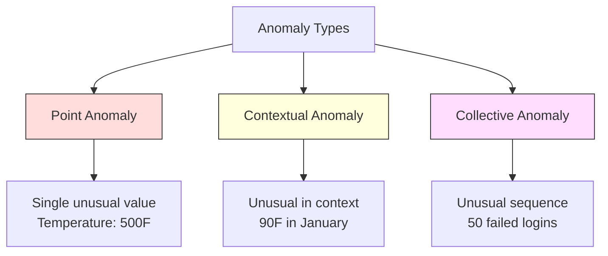
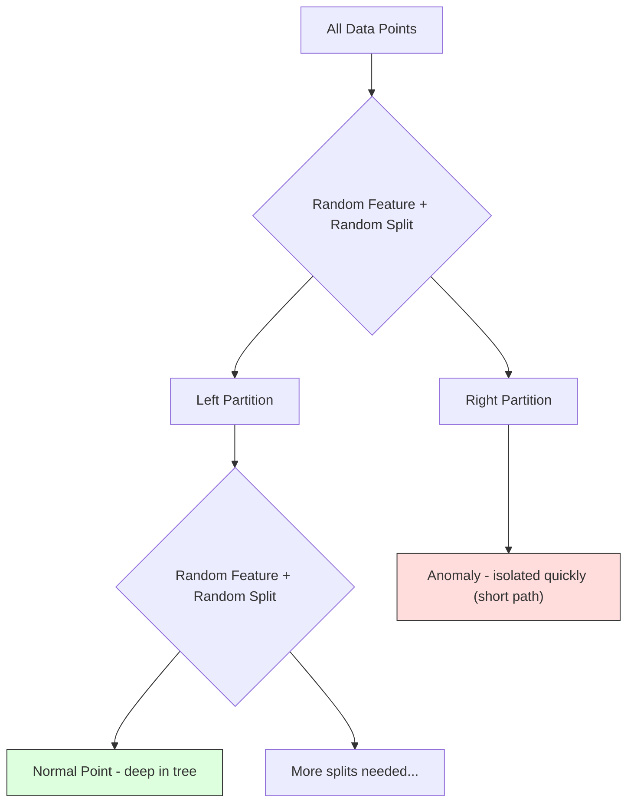
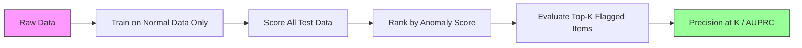

# اكتشاف التشوهات

> عادي                                                                                                                                                                                                                                                                                                                                                                                                                                                                                                                            

**Type:** Build
**Language:**بايثون
**Prerequisites:** Phase 2, Lessons 01-09
**Time:** ~75 minutes

## 學习目标

- من التحقق من صفر Z-نقطة ∆IQR و العزل طريقة اكتشاف الخلل الغابات
- نقطة التفريق 、التناقضات السياقية و الجماعية، ومواصفات لكل طريقة اختبار مناسبة
- 解释为什么 تحديد الانحراف يتم تصريحها على بيانات طبيعية 建模، وليس على الانحرافات
- مقارنة الكشف عن التشوهات غير المشرفة بالتصنيف المشرف ، ومقياس الوزن بين نطاق التشوهات الجديدة والدقة

## 问题

تم استخدام بطاقة ائتمانية في نيويورك بعد الظهر 2 دقيقة ، ثم في طوكيو بعد الظهر 2:05 دقيقة تم استخدامها.

هذه هي الخللات. إيجادها مهم. الغش يؤدي إلى خسارة مليارات الدولارات. تعطيل الأجهزة يؤدي إلى توقف الوقت.

التحدي يكمن في: أنت نادراً ما تملك تشابه مع علامة نموذجها. الغش لا يشكل سوى 0.1% من التداولات.

اكتشاف الفجوة عكس التحويلات المشكلة. لا تتعلم ما هو غير طبيعي، بل تتعلم ما هو طبيعي. أي شيء يتحرك عن الطبيعي أمر مشكوك فيه.

## 概念

### أنواع التشوهات

ليس كل الاختلافات هي نفسها

- **Point anomalies.**单个数据点无论上下文如何都很异常──500 度的温度读数──一个通常消费 $50 的账户发生 $50 ألف صفقة
- **Contextual anomalies.**某数据点在给定下文下异常──90 درجة في الصيف هو طبيعي، في الشتاء هو غير طبيعي──同一个值,不同上下文──
- **Collective anomalies.**مجموعة من نقاط البيانات ككل هي غير عادية، حتى لو كانت كل نقطة بيانات منفصلة قد تكون طبيعية.

大多数方法检测点异常―― 需要时间或位置特征―― 需要序列意识的方法──



### غير مرصدة

في التصنيف المعياري، تملك نوعين من العلامات. في الكشف عن التشوهات، عادة ما تواجه أحد الحالات الثلاثة التالية:

1. **Fully unsupervised.**完全 بدون علامة. أنت في جميع البيانات الملائمة الكاشف،并希望异常 足够稀少,不会污染"طبيعية" النموذج.
2. **Semi-supervised.**لديك مجموعة بيانات صافية تحتوي فقط على البيانات العادية.
3. **Weakly supervised.**ستستخدمها لتقييم، وليس لتدريب. أولاً إجراء تدريب غير مرصد، ثم قياس الدقة/التذكير على مجموعة من العلامات.

关键洞见:اكتشاف الحيوانات السريرية والتصنيف هناك فرق حقيقي في الاختلافات.

### المراقبة ضد غير المراقبة:权衡

إذا كان هناك بالفعل معالم معينة، يجب أن تستخدمها للتدريب على التصنيف المراقب، أم فقط لتقييم التعرف غير المراقب؟

**Supervised（当作 Classification 处理）：**
- يمكن أن تلتقط النوع من الفوضى الحقيقية التي رأيتها من قبل
- للشكل المعروف من الخلل
- سوف تفقد تماماً الفجوة الجديدة
- عندما يظهر نوع جديد من النوع يتطلب إعادة التدريب
-  بحاجة إلى الكثير من النشاطات غير طبيعية نموذج ((عادةً قليلاً جداً)

**Unsupervised（对 normal 建模，标记偏离项）：**
- يمكن أن تلتقط أي حالة خارج عن الطبيعي، بما في ذلك الرومان
- لا حاجة إلى معايير
- معدل الإيجابية الكاذبة 更高(并非所有 غير عادية 都是坏事)
- لتقديم التوزيع أكثر قوة

في الممارسة، أفضل النظم سوف تتجمع بينهما: باستخدام الكشف غير المشرف على الاطلاق، والحصول على تغطية واسعة، باستخدام النماذج المشرفة، ومعالجة الاختلافات ذات الأولوية العالية المعروفة، والنوع، والجعل المراقبة الإصطناعية مضحكة الحالات.

### النتائج

أسهل طريقة: الحساب من المتوسط والانحراف القياسي لكل ميزة:

```text
z_score = (x - mean) / std
anomaly if |z_score| > threshold
```

عتبة الاعتراف هي 3.0 ((بالنسبة لتوزيع غوسيان، 99.7% من البيانات الطبيعية 落在 3 標準偏差 范围内) 

**优点：**简单――快速――可解释("هذا القيمة عن المسافة الطبيعية لديها 4.5 انحرافات قياسية")

**缺点：**假设数据服从正常分布──对训练数据中的异值 敏感 异值 会移动 mean 并增大 std,使它们更难被检测出来)──在多模式分布上失效──

**适用场景：**المعلومات حول التوزيع الواحد المميزة  مراقبة.

**失效场景：**عدد من المجموعات (عدد من المجموعات) ، حيث أن موقع المكتبين يختلفون في الحد الأساسي (درجة الحرارة) ، والبيانات المزيفة (بيانات من حجم الصفقات 1000 دولار) ، والتي لا تبدو غير عادية (ليس من شأنها أن تكون غير عادية) ، والتي تحتوي على بيانات غير عادية.

### IQR 方法

مقارنة بـ Z-score أكثر قوة. استخدام النطاق بين الأربعينيين، بدلاً من متوسط و الاختلاف القياسي.

```
Q1 = 25th percentile
Q3 = 75th percentile
IQR = Q3 - Q1
lower_bound = Q1 - factor * IQR
upper_bound = Q3 + factor * IQR
anomaly if x < lower_bound or x > upper_bound
```

عامل الاعتراف هو 1.5

**优点：**للقياسات المتفردة القوية ((الرسوم غير متأثرة بالقيمة المتحدة)  تطبق على التوزيعات المتحولة  لا يوجد افتراض للطبيعية 

**缺点：**لا يمكن الاختبار إلا في الميزات في فترة النظر في بعضها البعض.

**实践说明：**عامل 1.5 في IQR على مخطط الصندوق في الحلاقة.

### غابة عزل

关键洞见:الاختلافات عدد أقل ومختلفة. عندما يتم تقسيم البيانات بشكل عشوائي، تكون الخلافات أكثر سهولة في الانفصال، فإنها تحتاج فقط إلى تقسيمات عشوائية أقل لتكون قادرة على فصلها عن البيانات المتبقية.



**工作方式：**
1. بناء العديد من الأشجار العشوائية ((جابة عزلة)
2. في كل عقدة، اختيار ميزة، و في هذه الميزة من الدقيقة و ماكس  بين اختيار قيمة تقسيم
3. استمر في الانقسام حتى يتم فصل كل نقطة
4. التشوهات في جميع الأشجار أعلى لديها أطوال مسار متوسط أقصر

**为什么有效：**النقاط الطبيعية تقع في مناطق كثيفة. تحتاج إلى العديد من الانقسامات العشوائية لتحديد نقطة واحدة من جيرانها.

النتيجة الخلوية  على أساس متوسط طول المسار لجميع الأشجار ،并使用随机二进制搜索树的预期路径长度 进行正常化:

```
score(x) = 2^(-average_path_length(x) / c(n))
```

من بينهم`c(n)`هو طول المسار المتوقع للنموذجات. √Score 接近 1 表示异常.‬Score 接近 0.5 表示正常.‬Score 接近 0 表示非常正常.‬

**优点：**لا يوجد افتراضات التوزيع. تطبق على الأبعاد العالية.

**缺点：**صعوبة في معالجة المناطق الكثيفة وسط الخللات (أثر التخفيض)

**关键 hyperparameters：**
- `n_estimators`الأشجار: عددها: 100 عادة ما يكون كافيا: المزيد من الأشجار ستجلب نتائج أكثر استقرارًا، ولكن الحساب أسرع:
- `max_samples`: نموذج كل شجرة عددها. . . . . . . . . . . . . . . . . . . . . . . . . . . . . . . . . . . . . . . . . . . . . . . . . . . . . . . . . . . . . . . . . . . . . . . . . . . . . . . . . . . . . . . . . . . . . . . . . . . . . . . . . . . . . . . . . . . . . . . . . . . . . . . . . . . . . . . . . . . . . . . . . . . . . . . . . . . . . . . . . . . . . . . . . . . . . . . . . . . . . . . . . . . . . . . . . . . . . . . . . . . . . . . . . . . . . . . . . . . . . . . . . . . . . . . . . . . . . . . . . . . . . . . . . . . . . . . . . . . . . . . . . . . . . . . . . . . . . . . . . . . . . . . . . . . . . . . . . . . . . . . . . . . . . . . . . . . . . . . . . . . . . . . . . . . . . . . . . . . . . . . . . . . . . . . . . . . . . . . . . . . . . . . . . . . . . . . . . . . . . . . . . . . . . . . . . . . . . . . . . . . . . . . . . . . . . . . . . . . . . . . . . . . . . . . . . . . . . . . . . . . . . . . . . . . . . . . . . . . . . . . . . . . . . . . . . . . . . . . . . . . . . . . . . . . . . . . . . . . . .
- `contamination`: 预期异常比例── فقط تستخدم لتحديد العدوان──不影响分数 本身──

### عامل الفائدة المحلية (LOF)

يُقارن الكثافة المحلية حول نقطة مع كثافة الجيران المحيطين.

**工作方式：**
1. لكل نقطة، العثور على أقرب جيرانها
2. 计算 محلية كثافة الوصول
3. مقارنة كثافة كل نقطة مع كثافة جيرانها
4. إذا كانت كثافة نقطة واحدة أقل من جيرانها، فهو خارج

**LOF score：**
- LOF  تقارب 1.0 عرض كثافة مقارنة بجوارها
- LOF أكبر من 1.0 أظهر كثافة أقل من الجيران ((可能 غير طبيعي)
- LOF 远大于 1.0(على سبيل المثال 2.0+) يعبر عن كثافة 显著更低(很可能是异常)

"المحلية"  الجزء الحاسم ⋅ النظر في مجموعة بيانات من المجموعتين: واحد يحتوي على 1000 نقطة الكمبيوتر الكثيف، والآخر يحتوي على 50 نقطة الكمبيوتر النادر.

**优点：**检测 local anomalies ((( في مناطقها المجاورة من نقاط غير عادية، حتى لو لم تكن كلها عادية)  تطبق على مجموعات من كثافة مختلفة‬

**缺点：**في مجموعة بيانات كبيرة بطيئة (تطبيق سذاجة) (تطبيق سائل للخيار في الأبعاد العالية جداً (تطبيق الدرجة غير جيد)

### بالمقارنة

| Method | Assumptions | Speed | Handles High Dims | Detects Local Anomalies |
|--------|------------|-------|-------------------|------------------------|
| Z-score | Normal distribution | 非常快 | 是（逐 feature） | 否 |
| IQR | 无（逐 feature） | 非常快 | 是（逐 feature） | 否 |
| Isolation Forest | 无 | 快 | 是 | 部分 |
| LOF | Distance 有意义 | 慢 | 较差 | 是 |

### 评估 تحديات

قيام كشافات الانحرافات أكثر صعوبة من تقييم المصنفين:

- **Extreme class imbalance.**إذا كانت النشاطات غير طبيعية تشكل 0.1% ، فإن التنبؤات "طبيعية" ستحصل على دقة 99.9%
- **AUROC 具有误导性。**في عدم التوازن الخطير، حتى في النموذج في العدوان العملي، يفتقد معظم الفوارق، و AUROC أيضا قد تبدو خاطئة.
- **更好的 metrics：**(→ (→ (→) (→ (→) (→ (→) (→) (→) (→) (→) (→) (→) (→) (→) (→) (→) (→) (→) (→) (→) (→) (→) (→) (→) (→) (→) (→) (→) (→) (→) (→) (→) (→) (→) (→) (→) (→) (→) (→) (→) (→) (→) (→) (→) (→) (→) (→) (→ (→) (→) (→) (→) (→ (→) (→) (→) (→) (→) (→) (→) (→) (→) (→) (→) (→) (→) (→) (→) (→) (→) (→) (→) (→) (→) (→) (→) (→) (→) (→) (→) (→) (→) (→) (→) (→) (→) (→) (→) (→) (→) (→) (→) (→) (→) (→) (→) (→) (→) (→)) (→) (→)) (→) (→) (→)) (→)) (→) (→)) (→) (→)) (→)) (→)) (→)



### خط أنابيب الكشف عن التشوهات

实践中,الاكتشاف الحذف  اتباع التدفقات التالية:

1. **收集 baseline data.**في الحالة المثالية، اختيار واحد تعرف لا يوجد (((أو تقريبا لا) من الاختلافات
2. **Feature engineering.**الميزات الأولية 加上 المشتقات المستمدة
3. **训练 detector.**في بيانات الأساس 上拟合── نموذج تعلم نمط "طبيعي"──
4. **对新数据打分.**كل ملاحظة جديدة ستحصل على نتيجة غير طبيعية
5. **Threshold selection.**选择分分截止――这是业务决策:更高门意味着假报警更少,但错过异常更多――
6. **Alert and investigate.**نقطة المشاركة في المراجعة الاصطناعية أو الاستجابة الآلية
7. **Feedback collection.**记录被标记项是真异常也是假报警──使用这些数据评估探测器,并随时间调整门──

خط الأنابيب 永遠 ليس "فعل" توزيع البيانات 会漂移, نوع جديد من الانحراف يظهر,الحدود أيضا بحاجة إلى ضبط  تقاطع الاكتشاف من الانحراف عندما تكون نظامًا يعمل بشكل مستمر, وليس نموذجًا فوريًا‬‬‬‬‬‬‬‬‬‬‬‬‬‬‬‬‬‬‬‬‬‬‬‬‬‬‬‬‬‬‬‬‬‬‬‬‬‬‬‬‬‬‬‬‬‬‬‬‬‬‬‬‬‬‬‬‬‬‬‬‬‬‬‬‬‬‬‬‬‬‬‬‬‬‬‬‬‬‬‬‬‬‬‬‬‬‬‬‬‬‬‬‬‬‬‬‬‬‬‬‬‬‬‬‬‬‬‬‬‬‬‬‬‬‬‬‬‬‬‬‬‬‬‬‬‬‬‬‬‬‬‬‬‬‬‬‬‬‬‬‬‬‬‬‬‬‬‬‬‬‬‬‬‬‬‬‬‬‬‬‬‬‬‬‬‬‬‬‬‬‬‬‬‬‬‬‬‬‬‬‬‬‬‬‬‬‬‬‬‬‬‬‬‬‬‬‬‬‬‬‬‬‬‬‬‬‬‬‬‬‬‬‬‬‬‬‬‬‬‬‬‬‬‬‬‬‬‬‬‬‬‬‬‬‬‬‬‬‬‬‬‬‬‬‬‬‬‬‬‬‬‬‬‬‬‬‬‬‬‬‬‬‬‬‬‬‬‬‬‬‬‬‬‬‬‬‬‬‬‬‬‬‬‬‬‬‬‬‬‬‬‬‬‬‬‬‬‬‬‬‬‬‬‬‬‬‬‬‬‬‬‬‬‬‬‬‬‬‬‬‬‬‬‬‬‬‬‬‬‬‬‬‬‬‬‬‬‬‬‬‬‬‬‬‬‬‬‬‬‬‬‬‬‬‬‬‬‬‬‬‬‬‬‬‬‬‬‬‬‬‬‬‬‬‬‬‬‬‬‬‬‬‬‬‬‬‬‬‬‬‬‬‬‬‬‬‬‬‬‬‬‬‬‬‬‬‬‬‬‬‬‬‬‬‬‬‬‬‬‬‬‬‬‬‬‬‬‬‬‬‬‬‬‬‬‬‬‬


```figure
f3-anomaly-fence
```

## بناءها

`code/anomaly_detection.py`من الصفر تم تحقيق الدرجة الزيد، والقيمة العليا والغابة العزلة.

### كاشف الدرجة الزيد

```python
def zscore_detect(X, threshold=3.0):
    mean = X.mean(axis=0)
    std = X.std(axis=0)
    std[std == 0] = 1.0
    z = np.abs((X - mean) / std)
    return z.max(axis=1) > threshold
```

简单且向量化──如果 أي ميزة 超过 العدالة،就标记该点──

### جهاز تحديد IQR

```python
def iqr_detect(X, factor=1.5):
    q1 = np.percentile(X, 25, axis=0)
    q3 = np.percentile(X, 75, axis=0)
    iqr = q3 - q1
    iqr[iqr == 0] = 1.0
    lower = q1 - factor * iqr
    upper = q3 + factor * iqr
    outside = (X < lower) | (X > upper)
    return outside.any(axis=1)
```

### من التحقق من العزل الغابات

من صفر تنفيذ نسخة سوف تكوين أشجار العزل ، على الفضاء الميزة  إجراء قسم عشوائي:

```python
class IsolationTree:
    def __init__(self, max_depth):
        self.max_depth = max_depth

    def fit(self, X, depth=0):
        n, p = X.shape
        if depth >= self.max_depth or n <= 1:
            self.is_leaf = True
            self.size = n
            return self
        self.is_leaf = False
        self.feature = np.random.randint(p)
        x_min = X[:, self.feature].min()
        x_max = X[:, self.feature].max()
        if x_min == x_max:
            self.is_leaf = True
            self.size = n
            return self
        self.threshold = np.random.uniform(x_min, x_max)
        left_mask = X[:, self.feature] < self.threshold
        self.left = IsolationTree(self.max_depth).fit(X[left_mask], depth + 1)
        self.right = IsolationTree(self.max_depth).fit(X[~left_mask], depth + 1)
        return self
```

隔离某个点所需的路径长度决定它的异常分数──更短的路径表示更异常──

`IsolationForest`طبقة 包装了多棵树:

```python
class IsolationForest:
    def __init__(self, n_estimators=100, max_samples=256, seed=42):
        self.n_estimators = n_estimators
        self.max_samples = max_samples

    def fit(self, X):
        sample_size = min(self.max_samples, X.shape[0])
        max_depth = int(np.ceil(np.log2(sample_size)))
        for _ in range(self.n_estimators):
            idx = rng.choice(X.shape[0], size=sample_size, replace=False)
            tree = IsolationTree(max_depth=max_depth)
            tree.fit(X[idx])
            self.trees.append(tree)

    def anomaly_score(self, X):
        avg_path = average path length across all trees
        scores = 2.0 ** (-avg_path / c(max_samples))
        return scores
```

عامل التطبيع`c(n)`يحتوي على n 个元素 من شجرة البحث الثنائية في وسط مرة واحدة من البحث الفاشل طول المسار المتوقع.`2 * H(n-1) - 2*(n-1)/n`، من بينهم`H`هو رقم متناغم. هذا التطبيع يضمن النتائج في مجموعة بيانات مختلفة.

### عرض عرض

代码生成多个测试场景:

1. **Single cluster with outliers.**مجموعة غوسية ثنائية الأبعاد، وتدخل في مكان بعيد عن المركز، في تشوهات.
2. **Multimodal data.**ثلاث مجموعات مختلفة من الحجم والكثافة. النقاط بين المجموعات هي غير طبيعية.
3. **High-dimensional data.**50 ميزة، ولكن الخلل فقط في 5 من هذه الميزات

كل عرض يستخدم دقة، استدعاء، F1 و Precision@k

## استخدمها

استخدام استخدام لغايات، وليس من صفر تحقيق):

```python
from sklearn.ensemble import IsolationForest
from sklearn.neighbors import LocalOutlierFactor

iso = IsolationForest(n_estimators=100, contamination=0.05, random_state=42)
iso.fit(X_train)
predictions = iso.predict(X_test)

lof = LocalOutlierFactor(n_neighbors=20, contamination=0.05, novelty=True)
lof.fit(X_train)
predictions = lof.predict(X_test)
```

انتبه`contamination`تعيين الانتباهات المُنتظَرة على سبيل المثال.

`anomaly_detection.py`في المنتصف، يتم مقارنة النسخة من إنجاز صفر مع الكود على نفس البيانات.

### خيار التلوث

التسجيلات`contamination`يقرر المعلم كيفية تحويل درجات الانحراف المتواصلة إلى عتبة التنبؤات الثنائية.

```python
iso_5 = IsolationForest(contamination=0.05)
iso_10 = IsolationForest(contamination=0.10)
```

                                                                                                                                                                                                                                                              `iso_5`标记 top 5%, و `iso_10`标记前 10%──如果你 لا تعرف معدل الفجوة الحقيقي(عادة لا تعرف) ، سوف تلوث 设置为"自动",并直接使用原始分数──根据假积极与假消极 成本权衡设置自己的门──

### الـ "SVM" ذات الفئة الواحدة

另一个值得了解的未监督异常检测器──One-Class SVM 会在高维特征空间中围绕正常数据 拟合一个边界(使用内核技巧)──

```python
from sklearn.svm import OneClassSVM

oc_svm = OneClassSVM(kernel="rbf", gamma="auto", nu=0.05)
oc_svm.fit(X_train)
predictions = oc_svm.predict(X_test)
```

`nu`المعلمات قريبة تعبر عن نسبة الانحرافات.

### مقاربة التشفير الذاتي

التشفير الذاتي هو تعلم الضغط والتكوين البيانات في شبكة العصبية. في البيانات الطبيعية، في التدريبات، في اختبار، سيكون هناك خطأ إعادة الإعمار أعلى، لأن الشبكة فقط تعلمت إعادة بناء الأنماط الطبيعية.

هذا سوف يكون في المرحلة 3 (التعلم العميق) في المرحلة الثالثة، ولكن المبدأ هو نفسه: على النموذج الطبيعي، علامة التحول.

### تجميع الكشف عن التشوهات

مثل أساليب الجمعية 会改进分类 (درس 11) ، مجموعة من كشفات الانحرافات أيضا سوف تحسن نتائج الاختبار.

1. 运行多个探测器(Z-score、IQR、Isolation Forest、LOF)
2. ستقوم كل جهاز كشف بتعديل درجاتها إلى [0, 1]
3. بالنسبة لدرجات معادلة طلب متوسط
4. 标记平均分高于门 的点

هذا يقلل من الإيجابيات الكاذبة، لأن الطرق المختلفة لديها أوضاع الفشل المختلفة.

تجمع أكثر تعقيدا سوف يعطي الوزن على أساس تقدير موثوقية كل كاشف (إذا كان هناك مجموعة تأكيد من الخلل المعروفة، فيمكن قياسها عليها)

### 生产环境考虑

1. **Threshold drift.**随着数据分布 漂移,固定门 会过时――监控异常度分数的分布,并定期调整――
2. **Alert fatigue.**إنذارات مزيفة 太多时,操作员会停止关注──先使用较高门
3. **Ensemble approach.**في بيئة الإنتاج، تجمع العديد من الكشفات. فقط في العديد من الطرق يعتقدون أن نقطة معينة غير طبيعية عندما يُسمى بها.
4. **Feature engineering.**الميزات الأولية عادة لا تكفي. إضافة إحصاءات التدفق. نسب. الوقت منذ آخر حدث. وميزات محددة للمنطقة. مجموعة الميزات.
5. **Feedback loop.**عندما يقوم المشغلون بتأكيد أو رفض المعلومات المعلنة، يقومون بتحديد هذه المعلومات على النظام المُدخّل.

## 交付 it

本课产出:
- `outputs/skill-anomaly-detector.md`-- مهارة اتخاذ القرارات التي يمكن استخدامها لتحديد الكشف
- `code/anomaly_detection.py`-- من صفر تحقيق Z-نقطة ∆IQR و الغابة العزل، ومقارنة مع السكلارن

### 选择 العدالة

النتيجة المختلفة هي قيمة تسلسل. تحتاج إلى عتبة لاتخاذ قرارات ثنائية.

考虑两个场景:
- **Fraud detection.**漏掉欺诈代价很高(拒付、客户信任) ―― تكلفة الإنذارات الكاذبة هي التحليلات الاصطناعية 5 分钟── سيتم وضع عتبة منخفضة للاستكشاف المزيد من الاحتيال، وموافقة المزيد من الإنذارات الكاذبة──
- **Equipment maintenance.**إنذار مزيف يعني توقف غير ضروري مرة واحدة، تكلفة$50,000。missed failure 意味着 $500،000 من الإصلاحات، وضع عتبة لتحقيق التوازن بين هذه التكاليف.

في الحالتين، يعتمد أفضل العد الأدنى على نسبة التكلفة بين الإيجابيات الخاطئة والسلبيات الخاطئة.

###  توسيع إلى بيئة الإنتاج

对于生产环境中的实时异常检测:

1. **Batch training, online scoring.**定期(每天、每周) في بيانات طبيعية في الأجل الأخير 上训练模型── كل ملاحظة جديدة حتى وصولها إجراء درجات──
2. **Feature computation must match.**إذا كنت تستخدم إحصاءات التدريب في 30天 النوافذ، فستحتاج إلى 30天 للتاريخ لتلاحظ الميزات الجديدة 计算
3. **Score distribution monitoring.**تتبع نقاط الفجوة 随时间的分布──如果 المتوسط يتحرك، إذا كانت البيانات تتغير، أو النموذج 已过时──
4. **Explainability.**عندما تلاحظين انعدام النظام، تشرح السبب. علامة Z: "الميزة X أكثر من الطبيعي ارتفاع 4.2 个标准偏差──" غابة العزل:" هذا النقطة في المتوسط في 3.1 مرات تم فصلها بين نقاط طبيعية 需要 8.5 مرات) 』

## التدريب

1. **Threshold tuning.**استخدم من 1.0 إلى 5.0، خطوة طويلة إلى 0.5 عتبة 运行 Z-score كاشف 绘制每一个门下面的精度和回忆 您的数据最佳平衡点在哪里?

2. **Multivariate anomalies.**创建2D 数据,其中每个功能 单独看都像正常,但组合起来是异常的 (على سبيل المثال,远离主集群对角的点) 展示每个功能的Z-score 会漏掉这些点,但隔离森林能捕捉它们

3. **从零实现 LOF.**استخدام k- أقرب جيران 实现 Local Outlier Factor.

4. **Streaming Anomaly Detection.**修改 Z-score detector, make it in streaming setting 中工作:随着新点到达更新运行平均和变异(ال خوارزمية على الانترنت ويلفورد)

5. **Real-world evaluation.**选择一个带有已知异常的数据集 (例如 كاغل)  استخدام precision@100、precision@500 和 AUPRC 评估全部四种方法──哪种方法效果最好?为什么?

## 关键术语

| Term | 人们通常怎么说 | 它实际意味着什么 |
|------|----------------|----------------------|
| Anomaly | "Outlier，异常点" | 一个明显偏离 normal data 预期模式的数据点 |
| Point anomaly | "单个奇怪的值" | 一个无论上下文如何都异常的单独 observation |
| Contextual anomaly | "normal 值，错误上下文" | 一个在给定上下文（时间、位置等）下异常、但在另一个上下文中可能 normal 的 observation |
| Isolation Forest | "用 random splits 找 outliers" | 一种 random trees 的 ensemble，它能用比 normal points 更少的 splits 隔离 anomalies |
| Local Outlier Factor | "把 density 和 neighbors 比较" | 一种标记 local density 明显低于其 neighbors density 的点的方法 |
| Z-score | "距离 mean 的 standard deviations 数" | (x - mean) / std，用 standard deviation 为单位衡量某个点距离中心有多远 |
| IQR | "Interquartile range" | Q3 - Q1，衡量数据中间 50% 的 spread，用于 robust outlier detection |
| Contamination | "预期 anomalies 比例" | 一个 hyperparameter，用于告诉 detector 应该将数据中多大比例标记为 anomalous |
| Precision@k | "top k flags 中有多少是真的" | 只在 k 个最可疑点上计算的 precision，适用于 imbalanced Anomaly Detection |
| AUPRC | "Precision-recall curve 下的面积" | 一个汇总所有 thresholds 下 precision-recall 表现的 metric，对 imbalanced data 比 AUROC 更好 |

## 延伸阅读

- [Liu et al., Isolation Forest (2008)](https://cs.nju.edu.cn/zhouzh/zhouzh.files/publication/icdm08b.pdf)-- 原始 عزلة الغابة 论文
- [Breunig et al., LOF: Identifying Density-Based Local Outliers (2000)](https://dl.acm.org/doi/10.1145/342009.335388)-- 原始 LOF 论文
- [scikit-learn Outlier Detection docs](https://scikit-learn.org/stable/modules/outlier_detection.html)-- جميع كشافات تشوهات الكهرباء
- [Chandola et al., Anomaly Detection: A Survey (2009)](https://dl.acm.org/doi/10.1145/1541880.1541882)-- التوصل إلى طريقة اكتشاف التشوهات
- [Goldstein and Uchida, A Comparative Evaluation of Unsupervised Anomaly Detection Algorithms (2016)](https://journals.plos.org/plosone/article?id=10.1371/journal.pone.0152173)-- مقارنة بين 10 طرق في مجموعة بيانات حقيقية
