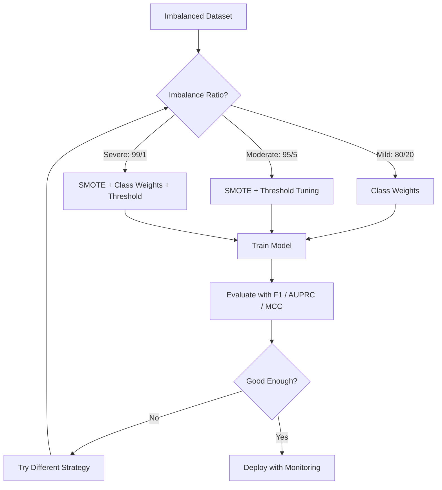
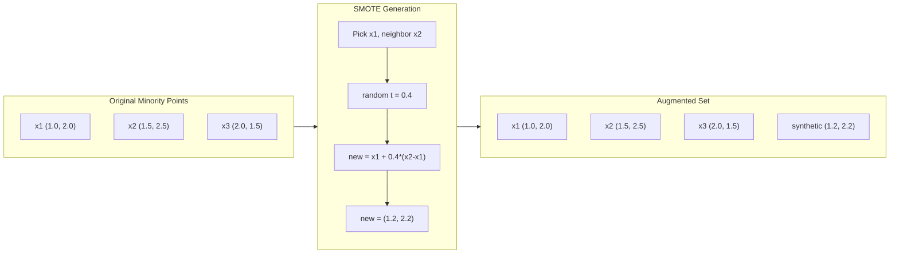
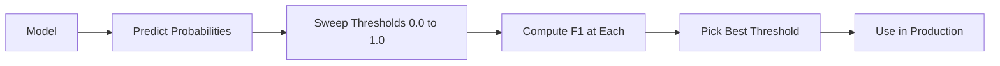
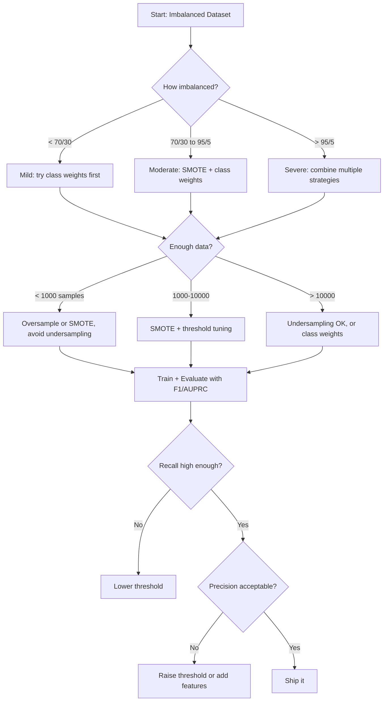

# 处理不平衡数据

> عندما يكون لديك 99٪ من البيانات طبيعية، الدقة هي كذبة.

**类型：**بناء
**语言：**بايثون
**先修要求：**المرحلة الثانية، الدروس 01-09
**时间：**حوالي 90 دقيقة

## 學习目标

- من التحقق من SMOTE،并 تفسير الإجراءات الاصطناعية المفرطة من نسخة
- استخدام F1、AUPRC 和 ماتيوس معدل التواصل  تقييم عدم توازن المصنف، بدلا من استخدام دقة
- مقارنة الوزن الفصل  تغيير العدوان و  تجديد العينات  استراتيجية,并为给定的不平衡比例选择合适方法
- بناء خط أنابيب بيانات غير متوازنة كاملة، مع سموتي٬وزن الفئة وترقية العد

## 问题

أنت بنيت نموذج اختبار الاحتيال. لقد بلغ دقة 99.9٪. أنت سعيد جدا. ثم أدركت أنه يتوقع كل معاملة غير الاحتيال.

هذا ليس خطأا ً عندما يكون 0.1% فقط من المعاملات عملية احتيال ، وهذا هو الممارسة المنطقية ً ما تعلمته النموذج هو: دائماً تخمين فئة الأغلبية يمكن تقليل الأخطاء الكلية ً.

كل شيء مهم حقا التصنيف المشهد، كل شيء يواجه هذا الوضع. تشخيص الأمراض: 1٪ نسبة إيجابية.

التوقعات الصحيحة ستفشل، لأنها تعتبر جميع التوقعات الصحيحة متساوية. التوقعات الصحيحة تعتبر معايير قانونية، والتشغيل الصحيح في عملية احتيال، وتحسب فقط جزءًا من التوقعات. ولكن الاعتراف بالاحتيال هو السبب الكامل لكون النموذج موجود.

## 概念

### لماذا النقدية سوف تفشل

考虑一个包含1000 样本的数据集:990 个负,10 个积极──一个始终预测负的模型:

|  | Predicted Positive | Predicted Negative |
|--|---|---|
| Actually Positive | 0 (TP) | 10 (FN) |
| Actually Negative | 0 (FP) | 990 (TN) |

الدقة = (0 + 990) / 1000 = 99.0%

تم القبض على نموذج صفر مرات الاحتيال. صفر أمراض. صفر عيوب. ولكن الدقة تظهر 99٪.

### أفضل مؤشر

**Precision**= TP / (TP + FP) ―― في جميع المثائل التي تم تسليطها بالإيجابية، هل هناك عدد إيجابي حقيقي؟

**Recall**= TP / (TP + FN) ◊ بين كل عينات الإيجابية الحقيقية، كم قبضنا عليها؟

**F1 Score**= 2 * دقة * التذكر / (دقة + التذكر) ――调和平均数──相比算术平均数,它会更严厉地惩罚 دقة 和 التذكر 之间极端不平衡──

**F-beta Score**= (1 + بيتا^2) * دقة * تذكر / (بيتا^2 * دقة + تذكر) ・・・ عندما بيتا > 1 时,تذكر 更重要。 عندما بيتا < 1 时,دقة 更重要。

**AUPRC**(منطقة تحت منحنى الاستدعاء الدقيق) ―― مشابهة لـ AUC-ROC ، ولكن لا توازن في بيانات أكثر كمية معلومات── AUPRC من التصنيف السريع على نسبة الفئة الإيجابية(不像 ROC 那样是0.5)── مما يجعل التحسينات أكثر سهولة للنظر إلى──

**Matthews Correlation Coefficient**= (TP * TN - FP * FN) / sqrt((TP+FP)(TP+FN)(TN+FP)(TN+FN))。 المدى من -1 إلى +1。 فقط عندما يكون النموذج على كلا الفئتين يعمل بشكل جيد عندها فقط سوف يقدم ارتفاعاً فى النسبة── حتى لو كان اختلاف حجم الفئة كبيرًا، فإنه يبقى متوازن──

对于上始终预测负的模型:精度 = 0/0(未定义,通常设为 0),回忆 = 0/10 = 0,F1 = 0,MCC = 0──这些指标正确地识别出该模型无价值──

### عدم توازن البيانات خط الأنابيب



### المعلومات: تقنية اختبار الأقليات الاصطناعية

عندما يتم أخذ العينات بشكل مفرط، سيتم نسخ النموذج القليلي الحالي.

ستقوم SMOTE بإنشاء نماذج أقلية اصطناعية جديدة، تبدو هذه المماذج معقولة، ولكن ليست副本.

1. لكل قلة نموذج x، في جميع القليات الأخرى نموذج العثور على قريبا لها
2. 随机选择一个邻居
3. في خط بين x و الجيران إخلق نموذج جديد

公式:`new_sample = x + random(0, 1) * (neighbor - x)`

هذا سوف يخلق النموذج في نفس المنطقة من الفضاء الميزاني ، بدلاً من مجرد نسخ البيانات الموجودة.



### عينة  استراتيجية مقابل

**Random Oversampling**: نسخ الأقلية 样本, جعل عددها مطابقة مع الأغلبية
- 优点:简单, بدون فقدان معلومات
- 缺点: كامل重复会导致过拟合, زيادة وقت التدريب

**Random Undersampling**: تحويل الأغلبية 样本, جعل عددها يتناسب مع الأقلية
- 优点: تدريب سريع,简单
- النقص: إزالة أغلبية مفيدة محتملة البيانات، والفرق أعلى

**SMOTE**: من خلال دخول قيمة خلق أقلية اصطناعية 样本。
- 优点: إنتاج نقاط بيانات جديدة، مقارنة مع زيادة العينة العشوائية  تقلل من المعدل
- 缺点:可能在决策边界 创建噪声样本,不考虑多数类的分布

| Strategy | Data Changed | Risk | When to Use |
|----------|-------------|------|-------------|
| Oversample | 复制 minority | 过拟合 | 小数据集，中等不平衡 |
| Undersample | 移除 majority | 信息损失 | 大数据集，需要快速训练 |
| SMOTE | 添加 synthetic minority | 边界噪声 | 中等不平衡，有足够 minority 样本用于 k-NN |

### الوزن الفريقي

بدلاً من تغيير البيانات، لا يمكن تغيير النموذج على طريقة التعامل الخاطئة.

بالنسبة لمشكلة واحدة تحتوي على 950 سلبي و 50 مثيل إيجابي:
- الفئة السلبية = n_samples / (2 * n_negative) = 1000 / (2 * 950) = 0.526
- الفئة الإيجابية = n_samples / (2 * n_positive) = 1000 / (2 * 50) = 10.0

الفئة الإيجابية  حصلت على 19 倍权重── خطأ فصيلة 样本的代价,相当于误分类 19 个负范例──模型被迫关注少数类──

في التراجع اللوجستي، هذا سوف يغير وظيفة الخسارة:

```
weighted_loss = -sum(w_i * [y_i * log(p_i) + (1-y_i) * log(1-p_i)])
```

من بينها تعتمد على نموذج الفئة

الوزن الطبقي في معنى المتوقع مع زيادة العينات في الأسعار الرياضية، ولكن لا تخلق نقاط بيانات جديدة. هذا يجعلها أسرع، وتجنب المخاطر المترتبة على إعادة العينات التي قد تأتي.

### تغيير العدوان

سوف ينتج معظم المصنفين احتمالات. فإن P (إيجابي) >= 0.5، فإن التوقعات تكون إيجابية. ولكن 0.5 هو أي.

流程:
1. 訓練一個模型
2. في مجموعة التحقق 上获取预测概率
3. من 0.0 إلى 1.0  مسح قيمة
4. في كل قيمة حساب F1 ((أو اختيارك المؤشر)
5. 选择使指标最大的值



نموذج واحد يمكن أن ينتج عن عملية احتيال P(احتيال) = 0.15♦ في 值 0.5 ، سيتم تصنيفها كغير احتيال♦ في 值 0.10 ، سيتم القبض عليها بشكل صحيح♦ أهمية تحديد الاحتمال أقل من الترتيب: طالما أن احتمال الحصول على نموذج احتيال أعلى من نموذج غير احتيال، فهناك  قيمة يمكن تفصلها‬

### التعلم الذي لا يتكلف

النوعية العامة من الوزن الطبقي ليس استخدام تكاليف التوحيد، ولكن توزيع تكاليف الفئة المختلفة:

| | Predict Positive | Predict Negative |
|--|---|---|
| Actually Positive | 0 (correct) | C_FN = 100 |
| Actually Negative | C_FP = 1 | 0 (correct) |

漏掉一笔欺诈交易 (FN) 成本比一次误报 (FP) 高 100 倍――模型优化是总成本,而不是总错误数――

عندما يمكنك تقدير تكاليف العالم الحقيقي، فهذه هي الطريقة الأكثر مبدأا. الإصابة بالسرطان والإخطاءات التي أدت إلى إجراء فحوصات إضافية، وتكلفة مختلفة تماما.

###  عملية اتخاذ القرار




```figure
class-imbalance
```

## بناءها

### الخطوة 1: إنشاء مجموعة بيانات غير متوازنة

```python
import numpy as np


def make_imbalanced_data(n_majority=950, n_minority=50, seed=42):
    rng = np.random.RandomState(seed)

    X_maj = rng.randn(n_majority, 2) * 1.0 + np.array([0.0, 0.0])
    X_min = rng.randn(n_minority, 2) * 0.8 + np.array([2.5, 2.5])

    X = np.vstack([X_maj, X_min])
    y = np.concatenate([np.zeros(n_majority), np.ones(n_minority)])

    shuffle_idx = rng.permutation(len(y))
    return X[shuffle_idx], y[shuffle_idx]
```

### الخطوة الثانية: من الصفر لتحقيق SMOTE

```python
def euclidean_distance(a, b):
    return np.sqrt(np.sum((a - b) ** 2))


def find_k_neighbors(X, idx, k):
    distances = []
    for i in range(len(X)):
        if i == idx:
            continue
        d = euclidean_distance(X[idx], X[i])
        distances.append((i, d))
    distances.sort(key=lambda x: x[1])
    return [d[0] for d in distances[:k]]


def smote(X_minority, k=5, n_synthetic=100, seed=42):
    rng = np.random.RandomState(seed)
    n_samples = len(X_minority)
    k = min(k, n_samples - 1)
    synthetic = []

    for _ in range(n_synthetic):
        idx = rng.randint(0, n_samples)
        neighbors = find_k_neighbors(X_minority, idx, k)
        neighbor_idx = neighbors[rng.randint(0, len(neighbors))]
        t = rng.random()
        new_point = X_minority[idx] + t * (X_minority[neighbor_idx] - X_minority[idx])
        synthetic.append(new_point)

    return np.array(synthetic)
```

### الخطوة 3: العينة العشوائية المفرطة و العينة السيئة

```python
def random_oversample(X, y, seed=42):
    rng = np.random.RandomState(seed)
    classes, counts = np.unique(y, return_counts=True)
    max_count = counts.max()

    X_resampled = list(X)
    y_resampled = list(y)

    for cls, count in zip(classes, counts):
        if count < max_count:
            cls_indices = np.where(y == cls)[0]
            n_needed = max_count - count
            chosen = rng.choice(cls_indices, size=n_needed, replace=True)
            X_resampled.extend(X[chosen])
            y_resampled.extend(y[chosen])

    X_out = np.array(X_resampled)
    y_out = np.array(y_resampled)
    shuffle = rng.permutation(len(y_out))
    return X_out[shuffle], y_out[shuffle]


def random_undersample(X, y, seed=42):
    rng = np.random.RandomState(seed)
    classes, counts = np.unique(y, return_counts=True)
    min_count = counts.min()

    X_resampled = []
    y_resampled = []

    for cls in classes:
        cls_indices = np.where(y == cls)[0]
        chosen = rng.choice(cls_indices, size=min_count, replace=False)
        X_resampled.extend(X[chosen])
        y_resampled.extend(y[chosen])

    X_out = np.array(X_resampled)
    y_out = np.array(y_resampled)
    shuffle = rng.permutation(len(y_out))
    return X_out[shuffle], y_out[shuffle]
```

### الخطوة 4: تحمل أوزان الفئة

```python
def sigmoid(z):
    return 1.0 / (1.0 + np.exp(-np.clip(z, -500, 500)))


def logistic_regression_weighted(X, y, weights, lr=0.01, epochs=200):
    n_samples, n_features = X.shape
    w = np.zeros(n_features)
    b = 0.0

    for _ in range(epochs):
        z = X @ w + b
        pred = sigmoid(z)
        error = pred - y
        weighted_error = error * weights

        gradient_w = (X.T @ weighted_error) / n_samples
        gradient_b = np.mean(weighted_error)

        w -= lr * gradient_w
        b -= lr * gradient_b

    return w, b


def compute_class_weights(y):
    classes, counts = np.unique(y, return_counts=True)
    n_samples = len(y)
    n_classes = len(classes)
    weight_map = {}
    for cls, count in zip(classes, counts):
        weight_map[cls] = n_samples / (n_classes * count)
    return np.array([weight_map[yi] for yi in y])
```

### الخطوة 5: إعداد العدالة

```python
def find_optimal_threshold(y_true, y_probs, metric="f1"):
    best_threshold = 0.5
    best_score = -1.0

    for threshold in np.arange(0.05, 0.96, 0.01):
        y_pred = (y_probs >= threshold).astype(int)
        tp = np.sum((y_pred == 1) & (y_true == 1))
        fp = np.sum((y_pred == 1) & (y_true == 0))
        fn = np.sum((y_pred == 0) & (y_true == 1))

        if metric == "f1":
            precision = tp / (tp + fp) if (tp + fp) > 0 else 0.0
            recall = tp / (tp + fn) if (tp + fn) > 0 else 0.0
            score = 2 * precision * recall / (precision + recall) if (precision + recall) > 0 else 0.0
        elif metric == "recall":
            score = tp / (tp + fn) if (tp + fn) > 0 else 0.0
        elif metric == "precision":
            score = tp / (tp + fp) if (tp + fp) > 0 else 0.0

        if score > best_score:
            best_score = score
            best_threshold = threshold

    return best_threshold, best_score
```

### 步骤 6: تقييم وظيفة

```python
def confusion_matrix_values(y_true, y_pred):
    tp = np.sum((y_pred == 1) & (y_true == 1))
    tn = np.sum((y_pred == 0) & (y_true == 0))
    fp = np.sum((y_pred == 1) & (y_true == 0))
    fn = np.sum((y_pred == 0) & (y_true == 1))
    return tp, tn, fp, fn


def compute_metrics(y_true, y_pred):
    tp, tn, fp, fn = confusion_matrix_values(y_true, y_pred)
    accuracy = (tp + tn) / (tp + tn + fp + fn)
    precision = tp / (tp + fp) if (tp + fp) > 0 else 0.0
    recall = tp / (tp + fn) if (tp + fn) > 0 else 0.0
    f1 = 2 * precision * recall / (precision + recall) if (precision + recall) > 0 else 0.0

    denom = np.sqrt(float((tp + fp) * (tp + fn) * (tn + fp) * (tn + fn)))
    mcc = (tp * tn - fp * fn) / denom if denom > 0 else 0.0

    return {
        "accuracy": accuracy,
        "precision": precision,
        "recall": recall,
        "f1": f1,
        "mcc": mcc,
    }
```

### الخطوة 7: مقارنة جميع الطرق

```python
X, y = make_imbalanced_data(950, 50, seed=42)
split = int(0.8 * len(y))
X_train, X_test = X[:split], X[split:]
y_train, y_test = y[:split], y[split:]

# Baseline: no treatment
w_base, b_base = logistic_regression_weighted(
    X_train, y_train, np.ones(len(y_train)), lr=0.1, epochs=300
)
probs_base = sigmoid(X_test @ w_base + b_base)
preds_base = (probs_base >= 0.5).astype(int)

# Oversampled
X_over, y_over = random_oversample(X_train, y_train)
w_over, b_over = logistic_regression_weighted(
    X_over, y_over, np.ones(len(y_over)), lr=0.1, epochs=300
)
preds_over = (sigmoid(X_test @ w_over + b_over) >= 0.5).astype(int)

# SMOTE
minority_mask = y_train == 1
X_minority = X_train[minority_mask]
synthetic = smote(X_minority, k=5, n_synthetic=len(y_train) - 2 * int(minority_mask.sum()))
X_smote = np.vstack([X_train, synthetic])
y_smote = np.concatenate([y_train, np.ones(len(synthetic))])
w_sm, b_sm = logistic_regression_weighted(
    X_smote, y_smote, np.ones(len(y_smote)), lr=0.1, epochs=300
)
preds_smote = (sigmoid(X_test @ w_sm + b_sm) >= 0.5).astype(int)

# Class weights
sample_weights = compute_class_weights(y_train)
w_cw, b_cw = logistic_regression_weighted(
    X_train, y_train, sample_weights, lr=0.1, epochs=300
)
probs_cw = sigmoid(X_test @ w_cw + b_cw)
preds_cw = (probs_cw >= 0.5).astype(int)

# Threshold tuning (tune on held-out validation set, not test set)
probs_val = sigmoid(X_val @ w_cw + b_cw)
best_thresh, best_f1 = find_optimal_threshold(y_val, probs_val, metric="f1")
preds_thresh = (probs_cw >= best_thresh).astype(int)
```

الملفات الكودية تعمل في كتاب واحد كل هذه المحتوى وتطبخ النتائج.

## استخدمها

借助小学学习和不平衡学习, هذه التقنيات كلها تحتاج إلى خط واحد فقط:

```python
from sklearn.linear_model import LogisticRegression
from sklearn.metrics import classification_report, f1_score
from sklearn.model_selection import train_test_split
from imblearn.over_sampling import SMOTE
from imblearn.under_sampling import RandomUnderSampler
from imblearn.pipeline import Pipeline

X_train, X_test, y_train, y_test = train_test_split(X, y, stratify=y)

model_weighted = LogisticRegression(class_weight="balanced")
model_weighted.fit(X_train, y_train)
print(classification_report(y_test, model_weighted.predict(X_test)))

smote = SMOTE(random_state=42)
X_resampled, y_resampled = smote.fit_resample(X_train, y_train)
model_smote = LogisticRegression()
model_smote.fit(X_resampled, y_resampled)
print(classification_report(y_test, model_smote.predict(X_test)))

pipeline = Pipeline([
    ("smote", SMOTE()),
    ("model", LogisticRegression(class_weight="balanced")),
])
pipeline.fit(X_train, y_train)
print(classification_report(y_test, pipeline.predict(X_test)))
```

من النسخة التنفيذية إلى الصفر سوف تظهر بوضوح كل نوع من التقنيات على وجه التحديد ما فعلوها.

## 交付 it

本课会产出:
- `outputs/skill-imbalanced-data.md`-- 份处理不平衡 تصنيف  تصميمات

## التدريب

1. **Borderline-SMOTE**: تعديل SMOTE 实现, فقط لاقلية قريبة من حدود القرار 点生成合成 样本(أي تلك k- أقرب الجيران يحتوي على غالبية الفئة 样本的点)  في المجموعة البيانية المتمثلة على الدرجة المتمثلة على مقياس SMOTE 比较结果──

2. **Cost matrix optimization**: تحقيق التعلم الحساس للتكلفة، حيث تكون المصفوفة التكلفة هي عنصر.

3. **Threshold calibration**: تحقيق التوسع السطحي (((في النموذج الأصلي المنتج على التراجع اللوجستي الملائم، لإنتاج احتمالات الانتقال بعد الانتقال)

4. **Ensemble with balanced bagging**: تدريب العديد من النماذج، كل نموذج يستخدم نموذج تميز متوازن 样本(جميع الأقلية + أغلبية من أي وقت مضى)  للمقارنة مع متوسط التوقعات الخاصة بهم. سيتم مقارنة هذه الطريقة مع نموذج SMOTE المستخدمة لوحده.

5. **Imbalance ratio experiment**:خذ مجموعة بيانات متوازنة، ورفع نسبة عدم توازن تدريجياً ((50/50、70/30、90/10、95/5、99/1)  للتدريب على كل نسبة، بشكل مختلف في استخدام ولا استخدام SMOTE‬‬‬‬‬‬‬‬‬‬‬‬‬‬‬‬‬‬‬‬‬‬‬‬‬‬‬‬‬‬‬‬‬‬‬‬‬‬‬‬‬‬‬‬‬‬‬‬‬‬‬‬‬‬‬‬‬‬‬‬‬‬‬‬‬‬‬‬‬‬‬‬‬‬‬‬‬‬‬‬‬‬‬‬‬‬‬‬‬‬‬‬‬‬‬‬‬‬‬‬‬‬‬‬‬‬‬‬‬‬‬‬‬‬‬‬‬‬‬‬‬‬‬‬‬‬‬‬‬‬‬‬‬‬‬‬‬‬‬‬‬‬‬‬‬‬‬‬‬‬‬‬‬‬‬‬‬‬‬‬‬‬‬‬‬‬‬‬‬‬‬‬‬‬‬‬‬‬‬‬‬‬‬‬‬‬‬‬‬‬‬‬‬‬‬‬‬‬‬‬‬‬‬‬‬‬‬‬‬‬‬‬‬‬‬‬‬‬‬‬‬‬‬‬‬‬‬‬‬‬‬‬‬‬‬‬‬‬‬‬‬‬‬‬‬‬‬‬‬‬‬‬‬‬‬‬‬‬‬‬‬‬‬‬‬‬‬‬‬‬‬‬‬‬‬‬‬‬‬‬‬‬‬‬‬‬‬‬‬‬‬‬‬‬‬‬‬‬‬‬‬‬‬‬‬‬‬‬‬‬‬‬‬‬‬‬‬‬‬‬‬‬‬‬‬‬‬‬‬‬‬‬‬‬‬‬‬‬‬‬‬‬‬‬‬‬‬‬‬‬‬‬‬‬‬‬‬‬‬‬‬‬‬‬‬‬‬‬‬‬‬‬‬‬‬‬‬‬‬‬‬‬‬‬‬‬‬‬‬‬‬‬‬‬‬‬‬‬‬‬‬‬‬‬‬‬‬‬‬‬‬‬‬‬‬‬‬‬‬‬‬‬‬‬‬‬‬‬‬‬‬‬‬‬‬‬‬‬‬‬‬‬‬‬‬‬‬‬‬‬‬‬

## 关键术语

| Term | What people say | What it actually means |
|------|----------------|----------------------|
| Class imbalance | “一个类别的样本多得多” | 数据集中类别分布显著偏斜，导致模型偏向 majority class |
| SMOTE | “Synthetic oversampling” | 通过在现有 minority 样本及其 k-nearest minority neighbors 之间插值，创建新的 minority 样本 |
| Class weights | “让 rare class 上的错误代价更高” | 用特定类别的权重乘以 Loss Function，使模型对 minority 误分类施加更重惩罚 |
| Threshold tuning | “移动 decision boundary” | 将 Classification 的概率 cutoff 从默认 0.5 改为能优化目标指标的值 |
| Precision-recall tradeoff | “你不能两者兼得” | 降低阈值会抓住更多 positive（更高 recall），但也会标记更多 false positive（更低 precision），反之亦然 |
| AUPRC | “PR curve 下的面积” | 将 precision-recall curve 汇总为一个数字；当类别严重不平衡时，比 AUC-ROC 信息量更大 |
| Matthews Correlation Coefficient | “平衡指标” | 预测标签与真实标签之间的相关性；只有模型在两个类别上都表现良好时才会产生高分 |
| Cost-sensitive learning | “不同错误的代价不同” | 将现实世界中的误分类成本纳入训练目标，使模型优化总成本，而不是错误数量 |
| Random oversampling | “复制 minority” | 重复 minority class 样本以平衡类别数量；简单，但有过拟合到重复点的风险 |

## 延伸阅读

- [SMOTE: Synthetic Minority Over-sampling Technique (Chawla et al., 2002)](https://arxiv.org/abs/1106.1813)-- 原始 SMOTE 论文، حتى الآن لا يزال أكثر أعمالاً يتم اقتباسها في دراسة عدم التوازن
- [Learning from Imbalanced Data (He & Garcia, 2009)](https://ieeexplore.ieee.org/document/5128907)-- إجمالي مجموعة من العينات  طريقة حساسة للتكلفة و على مستوى الخوارزمية
- [imbalanced-learn documentation](https://imbalanced-learn.org/stable/)-- Python 库، تقديم SMOTE 变体、تعريف  استراتيجيات وخط الأنابيب 集成
- [The Precision-Recall Plot Is More Informative than the ROC Plot (Saito & Rehmsmeier, 2015)](https://journals.plos.org/plosone/article?id=10.1371/journal.pone.0118432)-- ماذا و لماذا في مشاكل عدم التوازن يجب أن تستخدم منحنى العلاقات العامة أولاً بدلاً من منحنى ROC
