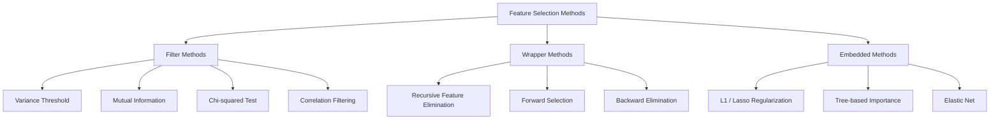
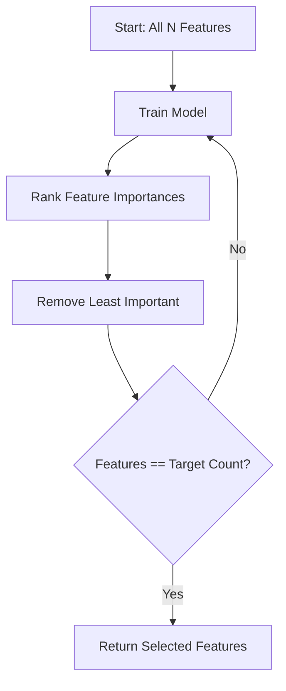
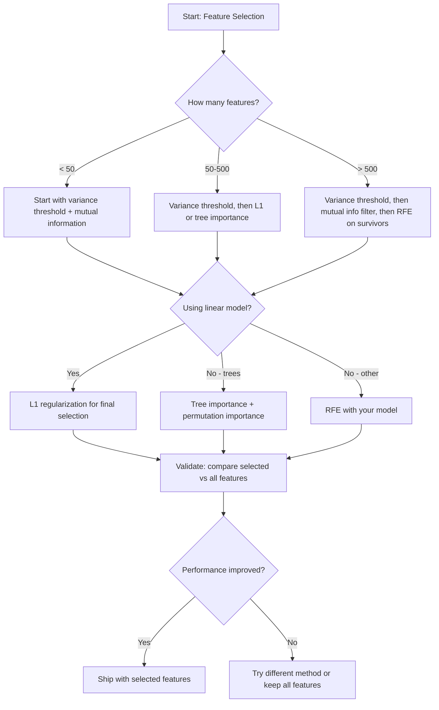

# اختيار الميزات

> المزيد من الميزات ليست أفضل.

**Type:** Build
**Language:**بايثون
**先修要求：**المرحلة الثانية، الدروس 01-09، 08(特征工程)
**Time:** ~75 分钟

## 學习目标
- من طرق التنفيذ الصفريات (متوسطات التغييرات، المعلومات المتبادلة، المربع) و طرق الغلاف (تختيار المواصلات)
- شرح لماذا المعلومات المتبادلة يمكن أن تلتقط التواصلات سوف تفقد
- مقارنة L1 التنظيم (اختيار مدمج) مع RFE (اختيار الملفات) ،并评估它们的计算权衡
- بناء خط أنابيب اختيار الميزات من مجموعة متنوعة من الطرق، وظهور ذلك في البيانات المحتفظة على تحسين تأثير التعميم

## 问题
لديك 500 ميزة. نموذجك يتدرب بطيء جداً، يتجاوز المعدل بشكل دائم، ولا أحد يستطيع تفسير ما تعلمته.

هذا هو العلامة الفعلية لعنة الأبعاد. مع الميزات، يتزايد عدد الميزات، وتتزايد حجم الفضاء.

اختيار الميزات هو حل العلاج. استبعاد الضوضاء. إزالة الإفراط. الحفاظ على تلك الميزات التي تحمل المعلومات المستهدفة. النتيجة هي: تدريب أسرع. التعميم أفضل، ونموذج يمكن تفسيرها.

الهدف ليس استخدام كل المعلومات المتاحة، ولكن استخدام المعلومات الصحيحة.

## 概念
### اختيار الميزات

كل نوع من اختيار الميزات 方法都属于以下三类之一:



**Filter methods**استخدام الحسابات مقياس مستقلًا لكل ميزة 打分──它们 لا تستخدم النموذج──速度快, ولكن سوف تفوت تفاعلات الميزات──

**Wrapper methods**訓練模型來評估功能組組──它们 تستخدم أداء النموذج 作为分数──结果更好,但成本更高,因为需要多次重新训练模型──

**Embedded methods**في عملية تدريب النموذج اختيار الميزات. L1 التنظيم سوف تحويل الأوزان إلى صفر. الأشجار القرارية سوف تستند إلى الميزات الأكثر فائدة. يتم تقسيمها.

### عتبة التباين

أسهل ملفات. إذا كان ميزة واحدة تتغير تقريبا بين العينات، فإنه لا يحمل تقريبا معلومات.

考虑一个特征,在1000 样本中有999 样本都是0.0──它的变化 接近零──没有模型能用它来区分类别──移除它──

```
variance(x) = mean((x - mean(x))^2)
```

وضع عتبة ((مثل 0.01)  تخلى عن كل اختلاف 低 من هذا العتبة  هذا سوف يكون في حالة عدم النظر تماما إلى المتغير الهدف تحويل ثابت أو شبه ثابتة 

استخدام المشهد: كخطوة من قبل المعالجة قبل الأساليب الأخرى.

الحد: ميزة قد يكون لها اختلاف كبير، ولكن لا يزال ضجيج نقي.

### المعلومات المتبادلة

المعلومات المتبادلة  قياس معرفة قيمة ميزة X يمكن أن تقلل إلى أي حد من عدم اليقين في الهدف Y 

```
I(X; Y) = sum_x sum_y p(x, y) * log(p(x, y) / (p(x) * p(y)))
```

إذا X 和 Y 独立,则 p(x,y) = p(x) * p(y), لذلك سجل 项为零,I(X; Y) = 0。X 能告诉你越多关于 Y 的信息,互惠信息就越高。

مقارنة بالعلاقة المفيدة الرئيسية: المعلومات المتبادلة يمكن أن تلتقط العلاقة غير السريرية.

对于连续特征,先分辨成bin(基于历史图的估计) ・数量的bin会影响估计结果:bin 太少会丢失信息,bin 太多会增加噪音──常见选择:sqrt(n) bin 或 Sturges' rule(1 + log2(n))。


### القضاء على الميزة المتكررة (RFE)

RFE هو طريقة لفغاتها. تستخدم النموذج.

1. استخدام جميع الميزات  تدريب نموذج
2. 按重要性对特征 排名(نماذج خطية استخدام المعاملات، الأشجار استخدام تقليل النسب)
3. 移除最不重要特征 (معلومات)
4. 重复، حتى بقية الميزات المتوقعة



سوف يدرس RFE تفاعلات الميزات، لأن النموذج سوف يرى في نفس الوقت جميع الميزات المتبقية.

成本:You need to train model N - target 次。 بالنسبة لـ 500 ميزة 目標 为 10 حالة، هي 490 مرة تدريب。 بالنسبة للنماذج الثمينة، سيكون ذلك بطيئا ً. يمكن من خلال كل خطوة نقل العديد من الميزات لتسريعها (مثل 10% من الحركة في كل جولة)。

### L1 (لاسو) التنظيم

L1 تنظيم 会把重量的绝对值加入 خسارة وظيفة:

```
loss = prediction_error + alpha * sum(|w_i|)
```

الجهاز الجهاز الجهاز الجهاز الجهاز الجهاز الجهاز الجهاز الجهاز الجهاز الجهاز الجهاز الجهاز الجهاز الجهاز الجهاز الجهاز الجهاز الجهاز الجهاز الجهاز الجهاز الجهاز الجهاز الجهاز الجهاز الجهاز الجهاز الجهاز الجهاز الجهاز الجهاز الجهاز الجهاز الجهاز الجهاز الجهاز الجهاز الجهاز الجهاز الجهاز الجهاز الجهاز الجهاز الجهاز الجهاز الجهاز الجهاز الجهاز الجهاز الجهاز الجهاز الجهاز الجهاز الجهاز الجهاز الجهاز الجهاز الجهاز الجهاز الجهاز الجهاز الجهاز الجهاز الجهاز الجهاز الجهاز الجهاز الجهاز الجهاز الجهاز الجهاز الجهاز الجهاز الجهاز الجهاز الجهاز الجهاز الجهاز الجهاز الجهاز الجهاز الجهاز الجهاز الجهاز

لماذا سوف تحدد للصفر؟ جريمة L1 في مساحة الوزن خلق منطقة حزمة 形 形 形 形 形 形 形 形 形 形 形 形 形 形 形 形 形 形 形 形 形 形 形 形 形 形 形 形 形 形 形 形 形 形 形 形 形 形 形 形 形 形 形 形 形 形 形 形 形 形 形 形 形 形 形 形 形 形 形 形 形 形 形 形 形 形 形 形 形 形 形 形 形 形 形 形 形 形 形 形 形 形 形 形 形 形 形 形 形 形 形 形 形 形 形 形 形 形 形 形 形 形 形 形 形 形 形 形 形 形 形 形 形 形 形 形 形 形 形 形 形 形 形 形 形 形 形 形 形 形 形 形 形 形 形 形 形 形 形 形 形 形 形 形 形 形 形 形 形 形 形 形 形 形 形 形 形 形 形 形 形 

هذا هو اختيار الميزات المضمنة: النموذج في التدريب ما هي الميزات التي يجب تجاهلها

优势: فقط تحتاج إلى تدريب واحد،能处理 المتصلة الميزات ((( اختيار واحد من بينها并把其他置零) ،内置 إلى معظم النموذج الخطى 实现中。

الحدود: تطبق فقط على النماذج الخطية. لا يمكن أن تتمكن من فهم أهمية الميزات غير الخطية.

### أهمية الميزة المستندة إلى الأشجار

شجرة القرار  ومجموعاتها  الغابات العشوائية  التزايد التدريجي)  الطبيعي 排名  كل قطعة من المدن  تقليل النسبات  تصنيف استخدام الجيني أو الإنتروبي،الانسحاب استخدام التباين‬‬‬‬‬‬‬‬‬‬‬‬‬‬‬‬‬‬‬‬‬‬‬‬‬‬‬‬‬‬‬‬‬‬‬‬‬‬‬‬‬‬‬‬‬‬‬‬‬‬‬‬‬‬‬‬‬‬‬‬‬‬‬‬‬‬‬‬‬‬‬‬‬‬‬‬‬‬‬‬‬‬‬‬‬‬‬‬‬‬‬‬‬‬‬‬‬‬‬‬‬‬‬‬‬‬‬‬‬‬‬‬‬‬‬‬‬‬‬‬‬‬‬‬‬‬‬‬‬‬‬‬‬‬‬‬‬‬‬‬‬‬‬‬‬‬‬‬‬‬‬‬‬‬‬‬‬‬‬‬‬‬‬‬‬‬‬‬‬‬‬‬‬‬‬‬‬‬‬‬‬‬‬‬‬‬‬‬‬‬‬‬‬‬‬‬‬‬‬‬‬‬‬‬‬‬‬‬‬‬‬‬‬‬‬‬‬‬‬‬‬‬‬‬‬‬‬‬‬‬‬‬‬‬‬‬‬‬‬‬‬‬‬‬‬‬‬‬‬‬‬‬‬‬‬‬‬‬‬‬‬‬‬‬‬‬‬‬‬‬‬‬‬‬‬‬‬‬‬‬‬‬‬‬‬‬‬‬‬‬‬‬‬‬‬‬‬‬‬‬‬‬‬‬‬‬‬‬‬‬‬‬‬‬‬‬‬‬‬‬‬‬‬‬‬‬‬‬‬‬‬‬‬‬‬‬‬‬‬‬‬‬‬‬‬‬‬‬‬‬‬‬‬‬‬‬‬‬‬‬‬‬‬‬‬‬‬‬‬‬‬‬‬‬‬‬‬‬‬‬‬‬‬‬‬‬‬‬‬‬‬‬‬‬‬‬‬‬‬‬‬‬‬‬‬‬‬‬‬‬‬‬‬‬‬‬‬‬‬‬‬‬‬‬‬‬‬‬‬‬‬‬‬‬

بالنسبة لأشجار العشرة:

```
importance(feature_j) = (1/T) * sum over all trees of
    sum over all nodes splitting on feature_j of
        (n_samples * impurity_decrease)
```

هذا سوف يمنح لكل ميزة نقطة أهمية طبيعية. يمكن أن يعالج بشكل تلقائي العلاقات غير السريعة والتفاعلات بين الميزات.

انتباه: أهمية القيمة القائمة على الشجرة 会偏向具有许多独特值的特征(ارتفاع الكاردينالية)。随机 ID 列会显得重要,因为它能完美分割每样品──使用 permutation importance 作为智力检查──

### أهمية التحول

طريقة نموذجية:

1. تمارس النموذج، وتحقيق بيانات التحقق
2. لكل ميزة: إزالة قيمها، انخفاض أداء القياس
3. أسفل أكبر، هذه الميزة أكثر أهمية

إذا كان التشويش في ميزة ما لا يؤثر على الأداء، فلن يكون نموذج يعتمد عليه.

أهمية التحول  evitate cardinality bias of tree-based importance ‬‬‬‬‬‬‬‬‬‬‬‬‬‬‬‬‬‬‬‬‬‬‬‬‬‬‬‬‬‬‬‬‬‬‬‬‬‬‬‬‬‬‬‬‬‬‬‬‬‬‬‬‬‬‬‬‬‬‬‬‬‬‬‬‬‬‬‬‬‬‬‬‬‬‬‬‬‬‬‬‬‬‬‬‬‬‬‬‬‬‬‬‬‬‬‬‬‬‬‬‬‬‬‬‬‬‬‬‬‬‬‬‬‬‬‬‬‬‬‬‬‬‬‬‬‬‬‬‬‬‬‬‬‬‬‬‬‬‬‬‬‬‬‬‬‬‬‬‬‬‬‬‬‬‬‬‬‬‬‬‬‬‬‬‬‬‬‬‬‬‬‬‬‬‬‬‬‬‬‬‬‬‬‬‬‬‬‬‬‬‬‬‬‬‬‬‬‬‬‬‬‬‬‬‬‬‬‬‬‬‬‬‬‬‬‬‬‬‬‬‬‬‬‬‬‬‬‬‬‬‬‬‬‬‬‬‬‬‬‬‬‬‬‬‬‬‬‬‬‬‬‬‬‬‬‬‬‬‬‬‬‬‬‬‬‬‬‬‬‬‬‬‬‬‬‬‬‬‬‬‬‬‬‬‬‬‬‬‬‬‬‬‬‬‬‬‬‬‬‬‬‬‬‬‬‬‬‬‬‬‬‬‬‬‬‬‬‬‬‬‬‬‬‬‬‬‬‬‬‬‬‬‬‬‬‬‬‬‬‬‬‬‬‬‬‬‬‬‬‬‬‬‬‬‬‬‬‬‬‬‬‬‬‬‬‬‬‬‬‬‬‬‬‬‬‬‬‬‬‬‬‬‬‬‬‬‬‬‬‬‬‬‬‬‬‬‬‬‬‬‬‬‬‬‬‬‬‬‬‬‬‬‬‬‬‬‬‬‬‬‬‬‬‬‬‬‬‬‬‬‬‬‬‬‬‬‬‬‬‬‬‬‬‬‬‬‬‬‬‬‬‬‬‬‬‬‬‬‬‬‬‬‬‬‬‬‬‬‬‬‬‬‬‬‬‬‬‬‬‬‬‬‬‬‬‬‬‬‬‬‬‬

### جدول المقارنة

| Method | Type | Speed | Nonlinear | Feature Interactions |
|--------|------|-------|-----------|---------------------|
| Variance threshold | Filter | 非常快 | 否 | 否 |
| Mutual information | Filter | 快 | 是 | 否 |
| Correlation filter | Filter | 快 | 否 | 否 |
| RFE | Wrapper | 慢 | 取决于 model | 是 |
| L1 / Lasso | Embedded | 快 | 否（linear） | 否 |
| Tree importance | Embedded | 中等 | 是 | 是 |
| Permutation importance | Model-agnostic | 慢 | 是 | 是 |

### مخطط تدفق القرار




```figure
f3-feature-prune
```

## بناءها
### الخطوة 1: توليد بيانات اصطناعية مع هيكل الميزات المعروفة

```python
import numpy as np


def make_feature_selection_data(n_samples=500, seed=42):
    rng = np.random.RandomState(seed)

    x1 = rng.randn(n_samples)
    x2 = rng.randn(n_samples)
    x3 = rng.randn(n_samples)
    x4 = x1 + 0.1 * rng.randn(n_samples)
    x5 = x2 + 0.1 * rng.randn(n_samples)

    informative = np.column_stack([x1, x2, x3, x4, x5])

    correlated = np.column_stack([
        x1 * 0.9 + 0.1 * rng.randn(n_samples),
        x2 * 0.8 + 0.2 * rng.randn(n_samples),
        x3 * 0.7 + 0.3 * rng.randn(n_samples),
        x1 * 0.5 + x2 * 0.5 + 0.1 * rng.randn(n_samples),
        x2 * 0.6 + x3 * 0.4 + 0.1 * rng.randn(n_samples),
    ])

    noise = rng.randn(n_samples, 10) * 0.5

    X = np.hstack([informative, correlated, noise])
    y = (2 * x1 - 1.5 * x2 + x3 + 0.5 * rng.randn(n_samples) > 0).astype(int)

    feature_names = (
        [f"info_{i}" for i in range(5)]
        + [f"corr_{i}" for i in range(5)]
        + [f"noise_{i}" for i in range(10)]
    )

    return X, y, feature_names
```

نعرف الحقيقة الأساسية:الميزات 0-4 هي معلوماتية(و 3 و 4 هي نسخة مرتبطة من 0 و 1),الميزات 5-9 مع الميزات المعلوماتية 相关,الميزات 10-19 هي ضوضاء نقية.

### 步骤 2: عتبة التباين

```python
def variance_threshold(X, threshold=0.01):
    variances = np.var(X, axis=0)
    mask = variances > threshold
    return mask, variances
```

### 步骤 3: المعلومات المتبادلة (مختصة)

```python
def discretize(x, n_bins=10):
    min_val, max_val = x.min(), x.max()
    if max_val == min_val:
        return np.zeros_like(x, dtype=int)
    bin_edges = np.linspace(min_val, max_val, n_bins + 1)
    binned = np.digitize(x, bin_edges[1:-1])
    return binned


def mutual_information(X, y, n_bins=10):
    n_samples, n_features = X.shape
    mi_scores = np.zeros(n_features)

    y_vals, y_counts = np.unique(y, return_counts=True)
    p_y = y_counts / n_samples

    for f in range(n_features):
        x_binned = discretize(X[:, f], n_bins)
        x_vals, x_counts = np.unique(x_binned, return_counts=True)
        p_x = dict(zip(x_vals, x_counts / n_samples))

        mi = 0.0
        for xv in x_vals:
            for yi, yv in enumerate(y_vals):
                joint_mask = (x_binned == xv) & (y == yv)
                p_xy = np.sum(joint_mask) / n_samples
                if p_xy > 0:
                    mi += p_xy * np.log(p_xy / (p_x[xv] * p_y[yi]))
        mi_scores[f] = mi

    return mi_scores
```

### الخطوة 4: إزالة الميزة المتكررة

```python
def simple_logistic_importance(X, y, lr=0.1, epochs=100):
    n_samples, n_features = X.shape
    w = np.zeros(n_features)
    b = 0.0

    for _ in range(epochs):
        z = X @ w + b
        pred = 1.0 / (1.0 + np.exp(-np.clip(z, -500, 500)))
        error = pred - y
        w -= lr * (X.T @ error) / n_samples
        b -= lr * np.mean(error)

    return w, b


def rfe(X, y, n_features_to_select=5, lr=0.1, epochs=100):
    n_total = X.shape[1]
    remaining = list(range(n_total))
    rankings = np.ones(n_total, dtype=int)
    rank = n_total

    while len(remaining) > n_features_to_select:
        X_subset = X[:, remaining]
        w, _ = simple_logistic_importance(X_subset, y, lr, epochs)
        importances = np.abs(w)

        least_idx = np.argmin(importances)
        original_idx = remaining[least_idx]
        rankings[original_idx] = rank
        rank -= 1
        remaining.pop(least_idx)

    for idx in remaining:
        rankings[idx] = 1

    selected_mask = rankings == 1
    return selected_mask, rankings
```

### 步骤 5: اختيار ميزة L1

```python
def soft_threshold(w, alpha):
    return np.sign(w) * np.maximum(np.abs(w) - alpha, 0)


def l1_feature_selection(X, y, alpha=0.1, lr=0.01, epochs=500):
    n_samples, n_features = X.shape
    w = np.zeros(n_features)
    b = 0.0

    for _ in range(epochs):
        z = X @ w + b
        pred = 1.0 / (1.0 + np.exp(-np.clip(z, -500, 500)))
        error = pred - y

        gradient_w = (X.T @ error) / n_samples
        gradient_b = np.mean(error)

        w -= lr * gradient_w
        w = soft_threshold(w, lr * alpha)
        b -= lr * gradient_b

    selected_mask = np.abs(w) > 1e-6
    return selected_mask, w
```

### 步骤 6: أهمية القائمة على الأشجار (شجرة القرار البسيطة)

```python
def gini_impurity(y):
    if len(y) == 0:
        return 0.0
    classes, counts = np.unique(y, return_counts=True)
    probs = counts / len(y)
    return 1.0 - np.sum(probs ** 2)


def best_split(X, y, feature_idx):
    values = np.unique(X[:, feature_idx])
    if len(values) <= 1:
        return None, -1.0

    best_threshold = None
    best_gain = -1.0
    parent_gini = gini_impurity(y)
    n = len(y)

    for i in range(len(values) - 1):
        threshold = (values[i] + values[i + 1]) / 2.0
        left_mask = X[:, feature_idx] <= threshold
        right_mask = ~left_mask

        n_left = np.sum(left_mask)
        n_right = np.sum(right_mask)

        if n_left == 0 or n_right == 0:
            continue

        gain = parent_gini - (n_left / n) * gini_impurity(y[left_mask]) - (n_right / n) * gini_impurity(y[right_mask])

        if gain > best_gain:
            best_gain = gain
            best_threshold = threshold

    return best_threshold, best_gain


def tree_importance(X, y, n_trees=50, max_depth=5, seed=42):
    rng = np.random.RandomState(seed)
    n_samples, n_features = X.shape
    importances = np.zeros(n_features)

    for _ in range(n_trees):
        sample_idx = rng.choice(n_samples, size=n_samples, replace=True)
        feature_subset = rng.choice(n_features, size=max(1, int(np.sqrt(n_features))), replace=False)

        X_boot = X[sample_idx]
        y_boot = y[sample_idx]

        tree_imp = _build_tree_importance(X_boot, y_boot, feature_subset, max_depth)
        importances += tree_imp

    total = importances.sum()
    if total > 0:
        importances /= total

    return importances


def _build_tree_importance(X, y, feature_subset, max_depth, depth=0):
    n_features = X.shape[1]
    importances = np.zeros(n_features)

    if depth >= max_depth or len(np.unique(y)) <= 1 or len(y) < 4:
        return importances

    best_feature = None
    best_threshold = None
    best_gain = -1.0

    for f in feature_subset:
        threshold, gain = best_split(X, y, f)
        if gain > best_gain:
            best_gain = gain
            best_feature = f
            best_threshold = threshold

    if best_feature is None or best_gain <= 0:
        return importances

    importances[best_feature] += best_gain * len(y)

    left_mask = X[:, best_feature] <= best_threshold
    right_mask = ~left_mask

    importances += _build_tree_importance(X[left_mask], y[left_mask], feature_subset, max_depth, depth + 1)
    importances += _build_tree_importance(X[right_mask], y[right_mask], feature_subset, max_depth, depth + 1)

    return importances
```

### الخطوة 7: تشغيل جميع الطرق ومقارنة

代码文件会在同一合成数据集上运行全部五种方法,并打印表比较,显示各种方法选择了哪些功能──

## استخدمها
استخدام القليل-تعلم 时,اختيار الميزات 已内置到管道 中:

```python
from sklearn.feature_selection import (
    VarianceThreshold,
    mutual_info_classif,
    RFE,
    SelectFromModel,
)
from sklearn.linear_model import Lasso, LogisticRegression
from sklearn.ensemble import RandomForestClassifier

vt = VarianceThreshold(threshold=0.01)
X_filtered = vt.fit_transform(X)

mi_scores = mutual_info_classif(X, y)
top_k = np.argsort(mi_scores)[-10:]

rfe_selector = RFE(LogisticRegression(), n_features_to_select=10)
rfe_selector.fit(X, y)
X_rfe = rfe_selector.transform(X)

lasso_selector = SelectFromModel(Lasso(alpha=0.01))
lasso_selector.fit(X, y)
X_lasso = lasso_selector.transform(X)

rf = RandomForestClassifier(n_estimators=100)
rf.fit(X, y)
importances = rf.feature_importances_
```

هذه من الصفر  تحقق تحديد ما يحدث داخل كل طريقة  عتبة التغير  مجرد الحساب `var(X, axis=0)`ليس تطبيق قناع. المعلومات المتبادلة هي في جدول الطوارئ و المشتركة والتيارات الهامشية. RFE هي حلقة تدريب.

كليارن  إصدار زيادة في الصلابة مثل استخدام k-NN تقدير كثافة وليس التعبئة)

## 交付 it
本课产出:
- `outputs/skill-feature-selector.md`-- باستخدام طريقة اختيار الميزات الصحيحة

## التدريب
1. **Forward selection**: تطبيق عملية عكس الاتجاه في RFE.  من صفر ميزات  البدء.  كل خطوة إضافة أفضل لتحسين أداء النموذج.  عندما إضافة ميزات غير مساعدة عند وقف.  سيتم اختيار الميزات مع نتائج RFE.  أي أسرع؟ أي نتيجة أفضل؟

2. **Stability selection**: عمل اختيار ميزة L1 50 مرات، كل مرة استخدام البيانات أي 80% من الفرعية، ومستخدم القليل من القيم الفالفية المختلفة.

3. **Multicollinearity detection**: حساب جميع الميزات ماتريكس التواصل. تحقيق وظيفة، حد التواصل المحدد. مثل 0.9، من كل صفة ذات علاقة عالية. تحويل صفة واحدة. الحفاظ على المعلومات المتبادلة مع الهدف.

4. **Feature selection pipeline**: ضع عتبة التباينات、مصفح المعلومات المتبادلة 和 RFE 串成一管道── أولاً نقل ميزات التباينات القريبة من الصفر، ثم وفقاً للمعلومات المتبادلة حفظ أعلى 50%، وإعادة في الناجين على متن RFE── سوف يتم تنفيذ هذا النزيل مع جميع الميزات المباشرة على متن RFE 比较──مصفح الأنابيب 更快吗؟ هل التأكد هو نفسه؟

5. **Permutation importance from scratch**: تحقيق أهمية المحوّلات. . . . . . . . . . . . . . . . . . . . . . . . . . . . . . . . . . . . . . . . . . . . . . . . . . . . . . . . . . . . . . . . . . . . . . . . . . . . . . . . . . . . . . . . . . . . . . . . . . . . . . . . . . . . . . . . . . . . . . . . . . . . . . . . . . . . . . . . . . . . . . . . . . . . . . . . . . . . . . . . . . . . . . . . . . . . . . . . . . . . . . . . . . . . . . . . . . . . . . . . . . . . . . . . . . . . . . . . . . . . . . . . . . . . . . . . . . . . . . . . . . . . . . . . . . . . . . . . . . . . . . . . . . . . . . . . . . . . . . . . . . . . . . . . . . . . . . . . . . . . . . . . . . . . . . . . . . . . . . . . . . . . . . . . . . . . . . . . . . . . . . . . . . . . . . . . . . . . . . . . . . . . . . . . . . . . . . . . . . . . . . . . . . . . . . . . . . . . . . . . . . . . . . . . . . . . . . . . . . . . . . . . . . . . . . . . . . . . . . . . . . . . . . . . . . . . . . . . . . . . . . . . . . . . . . . . . . . . . . . . . . . . . . . . . . . . . . . . . . . .

## 关键术语
| Term | What people say | What it actually means |
|------|----------------|----------------------|
| Filter method | “独立为 features 打分” | 一种 feature selection 方法，不训练 model，而是使用统计度量对 features 排名，并孤立地评估每个 feature |
| Wrapper method | “用 model 挑 features” | 一种 feature selection 方法，通过训练 model 并使用其 performance 作为 selection criterion 来评估 feature subsets |
| Embedded method | “model 在训练期间选择 features” | 作为 model fitting 一部分发生的 feature selection，例如 L1 regularization 会把 weights 推向零 |
| Mutual information | “一个变量能告诉你关于另一个变量的多少信息” | 给定 X 的知识后，关于 Y 的不确定性减少量的度量，能够捕捉线性和非线性 dependencies |
| Recursive Feature Elimination | “训练、排名、剪枝、重复” | 一种迭代式 wrapper method，会训练 model、移除最不重要的 feature(s)，并重复直到达到 target count |
| L1 / Lasso regularization | “会消灭 features 的 penalty” | 将 weight 绝对值之和加入 Loss Function，这会把不重要 feature 的 weights 推到精确为零 |
| Variance threshold | “移除 constant features” | 丢弃在 samples 之间 variance 低于指定 threshold 的 features，过滤掉不携带信息的 features |
| Feature importance | “哪些 features 最重要” | 表示每个 feature 对 model predictions 贡献程度的分数，可由 split gains（trees）或 coefficient magnitudes（linear）计算 |
| Permutation importance | “shuffle 并测量损害” | 通过随机 shuffle 每个 feature 的 values，并测量由此导致的 model performance 下降来评估 feature importance |
| Curse of dimensionality | “features 太多，data 不够” | 添加 features 会使 feature space 的体积指数级增长，导致 data 稀疏且 distances 失去意义的现象 |

## 延伸阅读
- [An Introduction to Variable and Feature Selection (Guyon & Elisseeff, 2003)](https://jmlr.org/papers/v3/guyon03a.html)-- طريقة اختيار الميزات
- [scikit-learn Feature Selection Guide](https://scikit-learn.org/stable/modules/feature_selection.html)-- 关于过包装和嵌入式方法的实用参考,包含代码示例
- [Stability Selection (Meinshausen & Buhlmann, 2010)](https://arxiv.org/abs/0809.2932)-- إعادة الاختيار إلى الاختيار المميز، لتحقيق نتائج قوية قابل للتكرار
- [Beware Default Random Forest Importances (Strobl et al., 2007)](https://bmcbioinformatics.biomedcentral.com/articles/10.1186/1471-2105-8-25)-- ظهور الأهمية القائمة على الأشجار 中的 Kardinality bias,并提出 مشروط الأهمية 作为替代方案
