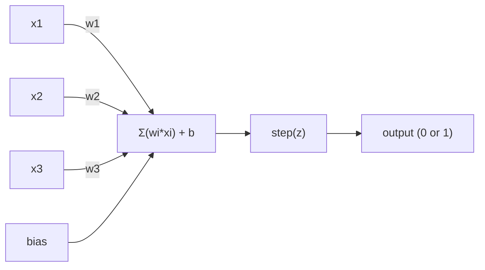
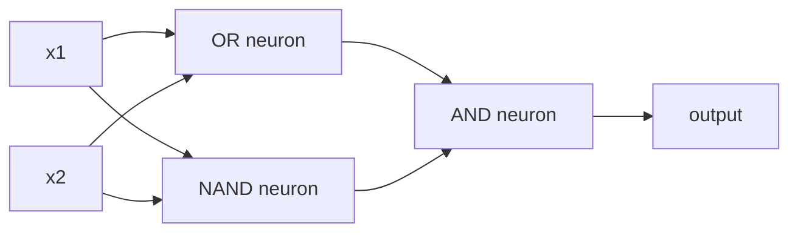

# (أوراق)

> الفكرة هي ذرة الشبكة العصبية، إذا قمت بتفكيكها سترى الوزن، التحيز، والقرار

**类型：**الإنشاء
**语言：**بايثون
**先修要求：**المرحلة 1 ((الجهبرا الخطية 直觉)
**时间：**~ 60 دقيقة

## 學习目标
- باستخدام Python من الصفر لتحقيق Perceptron، بما في ذلك قاعدة تحديث الوزن و وظيفة تفعيل الخطوة
-  شرح لماذا واحد Perceptron فقط يمكن حل خطيا قابل للنفصل  مشكلة،并演示 XOR حالة فشل
- من خلال الجمع OR、NAND 和 AND البوابات بناء عقار متعدد الطبقات لحل XOR
- استخدام تشغيل sigmoid و التنشر الخلفي  تدريب شبكة طبقتين، تجعل من التعلم الذاتي XOR

## 问题
أنت فهمت بالفعل النقاط و النقاط المنتج. أنت تعرف أن المصفوفة سوف تحويل المدخلات إلى الخروج. ولكن كيف يمكن للآلات *التعلم*  استخدام أي نوع من التحويلات؟

أجاب Perceptron على هذا السؤال. إنها أسهل آلة تعلم: تتلقى بعض المدخلات، وتضاعف الوزن، وتضيف التحيز، ثم تتخذ قرار ثنائي.

فهم الفهم، يعني فهم التعليم في الكود تعلم  إلى النهاية هو ما:

## 概念
### نيورون، قرار

واحد Perceptron 接收 n 个输入, 将每个输入 乘以一个重量,求和,加偏,然后把结果传入一个激活函数――



وظيفة الخطوة 非常直接: إذا كان المبلغ الموزن 加 التحيز >= 0, فإن المخرج 为 1──否则,المخرج 为 0──

```
step(z) = 1  if z >= 0
           0  if z < 0
```

هذا هو مصنف خطي. . . . . . . . . . . . . . . . . . . . . . . . . . . . . . . . . . . . . . . . . . . . . . . . . . . . . . . . . . . . . . . . . . . . . . . . . . . . . . . . . . . . . . . . . . . . . . . . . . . . . . . . . . . . . . . . . . . . . . . . . . . . . . . . . . . . . . . . . . . . . . . . . . . . . . . . . . . . . . . . . . . . . . . . . . . . . . . . . . . . . . . . . . . . . . . . . . . . . . . . . . . . . . . . . . . . . . . . . . . . . . . . . . . . . . . . . . . . . . . . . . . . . . . . . . . . . . . . . . . . . . . . . . . . . . . . . . . . . . . . . . . . . . . . . . . . . . . . . . . . . . . . . . . . . . . . . . . . . . . . . . . . . . . . . . . . . . . . . . . . . . . . . . . . . . . . . . . . . . . . . . . . . . . . . . . . . . . . . . . . . . . . . . . . . . . . . . . . . . . . . . . . . . . . . . . . . . . . . . . . . . . . . . . . . . . . . . . . . . . . . . . . . . . . . . . . . . . . . . . . . . . . . . . . . . . . . . . . . . . . . . . . . . . . . . . . . . . . . . . . . . . .

### حدود القرار

بالنسبة إلى مدخلين، فإن Perceptron سوف تكون في الفضاء 2D

```
  x2
  ┤
  │  Class 1        /
  │    (0)          /
  │                /
  │               / w1·x1 + w2·x2 + b = 0
  │              /
  │             /     Class 2
  │            /        (1)
  ┼───────────/──────────── x1
```

線一侧所有点输出 为 0;;另一侧所有点输出 为 1;; عملية التدريب سوف تتحرك هذه الخط حتى يتمكن من فصل هذه الفئات بشكل صحيح;;

### قاعدة التعلم

قاعدة تعلم Perceptron بسيطة جدا:

```
For each training example (x, y_true):
    y_pred = predict(x)
    error = y_true - y_pred

    For each weight:
        w_i = w_i + learning_rate * error * x_i
    bias = bias + learning_rate * error
```

إذا كان التنبؤ صحيحاً، فإن الخطأ = 0، فلن يتغير أي شيء. إذا كان يتنبأ 0، ولكن يجب أن يكون 1, الوزن سوف يزداد. إذا كان يتنبأ 1، ولكن يجب أن يكون 0, الوزن سوف يقلل.

### مشكلة XOR

المشكلة تخرج من هنا. انظروا إلى هذه البوابات المنطقية:

```
AND gate:           OR gate:            XOR gate:
x1  x2  out         x1  x2  out         x1  x2  out
0   0   0           0   0   0           0   0   0
0   1   0           0   1   1           0   1   1
1   0   0           1   0   1           1   0   1
1   1   1           1   1   1           1   1   0
```

و 和 OR هو قابل للفصل خطيا: يمكنك رسم خط واحد،把 0 和 1 分开。XOR 则不是──没有任何条直线能把 [0,1] 和 [1,0] 与 [0,0] 和 [1,1] 分开──

```
AND (separable):        XOR (not separable):

  x2                      x2
  1 ┤  0     1            1 ┤  1     0
    │     /                 │
  0 ┤  0 / 0              0 ┤  0     1
    ┼──/──────── x1         ┼──────────── x1
       line works!          no single line works!
```

هذا هو الحد الأساسي. يمكن لمفهوم واحد فقط حل مشكلة قابلة للفصل بشكل خطي.

الحل: وضع الفكرة على طبقات. يمكن وضع قرارين خطيين في مجموعة قرار غير خطي لحل XOR.


```figure
perceptron-boundary
```

## بناءها
### 步骤 1: فئة Perceptron

```python
class Perceptron:
    def __init__(self, n_inputs, learning_rate=0.1):
        self.weights = [0.0] * n_inputs
        self.bias = 0.0
        self.lr = learning_rate

    def predict(self, inputs):
        total = sum(w * x for w, x in zip(self.weights, inputs))
        total += self.bias
        return 1 if total >= 0 else 0

    def train(self, training_data, epochs=100):
        for epoch in range(epochs):
            errors = 0
            for inputs, target in training_data:
                prediction = self.predict(inputs)
                error = target - prediction
                if error != 0:
                    errors += 1
                    for i in range(len(self.weights)):
                        self.weights[i] += self.lr * error * inputs[i]
                    self.bias += self.lr * error
            if errors == 0:
                print(f"Converged at epoch {epoch + 1}")
                return
        print(f"Did not converge after {epochs} epochs")
```

### الخطوة الثانية:

```python
and_data = [
    ([0, 0], 0),
    ([0, 1], 0),
    ([1, 0], 0),
    ([1, 1], 1),
]

or_data = [
    ([0, 0], 0),
    ([0, 1], 1),
    ([1, 0], 1),
    ([1, 1], 1),
]

not_data = [
    ([0], 1),
    ([1], 0),
]

print("=== AND Gate ===")
p_and = Perceptron(2)
p_and.train(and_data)
for inputs, _ in and_data:
    print(f"  {inputs} -> {p_and.predict(inputs)}")

print("\n=== OR Gate ===")
p_or = Perceptron(2)
p_or.train(or_data)
for inputs, _ in or_data:
    print(f"  {inputs} -> {p_or.predict(inputs)}")

print("\n=== NOT Gate ===")
p_not = Perceptron(1)
p_not.train(not_data)
for inputs, _ in not_data:
    print(f"  {inputs} -> {p_not.predict(inputs)}")
```

### 步骤 3: مشاهدة XOR 失败

```python
xor_data = [
    ([0, 0], 0),
    ([0, 1], 1),
    ([1, 0], 1),
    ([1, 1], 0),
]

print("\n=== XOR Gate (single perceptron) ===")
p_xor = Perceptron(2)
p_xor.train(xor_data, epochs=1000)
for inputs, expected in xor_data:
    result = p_xor.predict(inputs)
    status = "OK" if result == expected else "WRONG"
    print(f"  {inputs} -> {result} (expected {expected}) {status}")
```

انها لن تتناغم أبداً. هذا هو دليل واحد على عدم قدرة الفكريات على تعلم XOR.

### 步骤 4: باستخدام طبقتين  حل XOR

技巧是:XOR = (x1 OR x2) و لا (x1 و x2)



```python
def xor_network(x1, x2):
    or_neuron = Perceptron(2)
    or_neuron.weights = [1.0, 1.0]
    or_neuron.bias = -0.5

    nand_neuron = Perceptron(2)
    nand_neuron.weights = [-1.0, -1.0]
    nand_neuron.bias = 1.5

    and_neuron = Perceptron(2)
    and_neuron.weights = [1.0, 1.0]
    and_neuron.bias = -1.5

    hidden1 = or_neuron.predict([x1, x2])
    hidden2 = nand_neuron.predict([x1, x2])
    output = and_neuron.predict([hidden1, hidden2])
    return output


print("\n=== XOR Gate (multi-layer network) ===")
for inputs, expected in xor_data:
    result = xor_network(inputs[0], inputs[1])
    print(f"  {inputs} -> {result} (expected {expected})")
```

أربعة حالات صحيحة تماما. وضع Perceptron على أكوام، يمكن أن تخلق واحد Perceptron لا يمكن أن تنتج حدود القرار.

### الخطوة 5: تدريب شبكة طبقتين

الخطوة 4 手动连接了重量── هذا فعال على XOR، ولكن بالنسبة لك لم تعرف مسبقاً الصحيحة للوزن الحقيقي أصبح غير مناسب.

```python
class TwoLayerNetwork:
    def __init__(self, learning_rate=0.5):
        import random
        random.seed(0)
        self.w_hidden = [[random.uniform(-1, 1), random.uniform(-1, 1)] for _ in range(2)]
        self.b_hidden = [random.uniform(-1, 1), random.uniform(-1, 1)]
        self.w_output = [random.uniform(-1, 1), random.uniform(-1, 1)]
        self.b_output = random.uniform(-1, 1)
        self.lr = learning_rate

    def sigmoid(self, x):
        import math
        x = max(-500, min(500, x))
        return 1.0 / (1.0 + math.exp(-x))

    def forward(self, inputs):
        self.inputs = inputs
        self.hidden_outputs = []
        for i in range(2):
            z = sum(w * x for w, x in zip(self.w_hidden[i], inputs)) + self.b_hidden[i]
            self.hidden_outputs.append(self.sigmoid(z))
        z_out = sum(w * h for w, h in zip(self.w_output, self.hidden_outputs)) + self.b_output
        self.output = self.sigmoid(z_out)
        return self.output

    def train(self, training_data, epochs=10000):
        for epoch in range(epochs):
            total_error = 0
            for inputs, target in training_data:
                output = self.forward(inputs)
                error = target - output
                total_error += error ** 2

                d_output = error * output * (1 - output)

                saved_w_output = self.w_output[:]
                hidden_deltas = []
                for i in range(2):
                    h = self.hidden_outputs[i]
                    hd = d_output * saved_w_output[i] * h * (1 - h)
                    hidden_deltas.append(hd)

                for i in range(2):
                    self.w_output[i] += self.lr * d_output * self.hidden_outputs[i]
                self.b_output += self.lr * d_output

                for i in range(2):
                    for j in range(len(inputs)):
                        self.w_hidden[i][j] += self.lr * hidden_deltas[i] * inputs[j]
                    self.b_hidden[i] += self.lr * hidden_deltas[i]
```

```python
net = TwoLayerNetwork(learning_rate=2.0)
net.train(xor_data, epochs=10000)
for inputs, expected in xor_data:
    result = net.forward(inputs)
    predicted = 1 if result >= 0.5 else 0
    print(f"  {inputs} -> {result:.4f} (rounded: {predicted}, expected {expected})")
```

إنها مع الخطوة 4 لديها فرقين أساسيين. أولا، السيغميد استبدل وظيفة الخطوة، لأنه مسطح، لذلك وجود درجي.`train`方法把 error from output Backpropagation to hidden layer،并按每重量调整它们──这是 20 行代码中的 Backpropagation──

هذا هو الطريق إلى الدروس 03`d_output`和 `hidden_deltas`وراء الرياضيات، هو وضع قاعدة السلسلة تطبيقها على الرسم البياني للشبكة

## استخدمها
كلّ ما تبني من الصفر، موجود في إحدى الواردات:

```python
from sklearn.linear_model import Perceptron as SkPerceptron
import numpy as np

X = np.array([[0,0],[0,1],[1,0],[1,1]])
y = np.array([0, 0, 0, 1])

clf = SkPerceptron(max_iter=100, tol=1e-3)
clf.fit(X, y)
print([clf.predict([x])[0] for x in X])
```

五行. 五行.`Perceptron`الطبقة تفعل نفس الشيء. Sclearn  الإصدار زاد من التحقق من التقارب 多 نوع من وظائف الخسارة، فضلا عن دعم المدخلات النادرة، ولكن الحلقة الأساسية هي نفسها تماما: المبلغ الموزن  وظيفة الخطوة  في الخطأ  تحديث الوزن‬

التباين الحقيقي سوف يظهر على نطاق واسع.

- عمل الخطوة سوف تصبح sigmoid 、ReLU أو غيرها من التفعيل المُسطح
- الوزن 会通过 الاحتباس الذاتي
- الطبقات سوف تصبح أعمق:
- نفس المبدأ لا يزال قائماً: كل طبقة من المخرجات من الطبقة السابقة خلق ميزات جديدة

ويمكنك رسم أي شكل

## 交付 it
本课会产出:
- `outputs/skill-perceptron.md`-مهارة، تشرح متى تحتاج إلى معمارات طبقة واحدة ومتعددة الطبقات

## التدريب
1. في بوابة NAND ((بوابة عالمية، أي دائرة منطقية يمكن أن تكون من قبل NAND  بنية) على تدريب Perceptron‬ تجربة وزنها 和 التحيز  بنية حدود القرار فعالة‬‬‬‬‬‬‬‬‬‬‬‬‬‬‬‬‬‬‬‬‬‬‬‬‬‬‬‬‬‬‬‬‬‬‬‬‬‬‬‬‬‬‬‬‬‬‬‬‬‬‬‬‬‬‬‬‬‬‬‬‬‬‬‬‬‬‬‬‬‬‬‬‬‬‬‬‬‬‬‬‬‬‬‬‬‬‬‬‬‬‬‬‬‬‬‬‬‬‬‬‬‬‬‬‬‬‬‬‬‬‬‬‬‬‬‬‬‬‬‬‬‬‬‬‬‬‬‬‬‬‬‬‬‬‬‬‬‬‬‬‬‬‬‬‬‬‬‬‬‬‬‬‬‬‬‬‬‬‬‬‬‬‬‬‬‬‬‬‬‬‬‬‬‬‬‬‬‬‬‬‬‬‬‬‬‬‬‬‬‬‬‬‬‬‬‬‬‬‬‬‬‬‬‬‬‬‬‬‬‬‬‬‬‬‬‬‬‬‬‬‬‬‬‬‬‬‬‬‬‬‬‬‬‬‬‬‬‬‬‬‬‬‬‬‬‬‬‬‬‬‬‬‬‬‬‬‬‬‬‬‬‬‬‬‬‬‬‬‬‬‬‬‬‬‬‬‬‬‬‬‬‬‬‬‬‬‬‬‬‬‬‬‬‬‬‬‬‬‬‬‬‬‬‬‬‬‬‬‬‬‬‬‬‬‬‬‬‬‬‬‬‬‬‬‬‬‬‬‬‬‬‬‬‬‬‬‬‬‬‬‬‬‬‬‬‬‬‬‬‬‬‬‬‬‬‬‬‬‬‬‬‬‬‬‬‬‬‬‬‬‬‬‬‬‬‬‬‬‬‬‬‬‬‬‬‬‬‬‬‬‬‬‬‬‬‬‬‬‬‬‬‬‬‬‬‬‬‬‬‬‬‬‬‬‬‬‬‬‬‬‬‬‬‬‬‬‬‬‬‬‬‬‬‬‬‬‬‬‬‬‬‬‬‬‬‬‬‬‬‬‬‬‬‬‬‬‬‬‬
2. 修改 Perceptron class, make it in each epoch 跟踪 decision boundary ((w1*x1 + w2*x2 + b = 0) 』 印印在 AND gate 訓練期间
3. 构建一个3输入 Perceptron: فقط当3输入中至少2 个为1 时才输出1(الاغلبية صوت وظيفة) ―― هل هو قابل لقطعي الانفصال؟ لماذا؟

## 关键术语
| Term | What people say | What it actually means |
|------|----------------|----------------------|
| Perceptron | “一个假的 neuron” | 一个 linear classifier：inputs 与 weights 的 dot product，加上 bias，再通过 step function |
| Weight | “一个 input 有多重要” | 一个 multiplier，用来缩放每个 input 对 decision 的贡献 |
| Bias | “threshold” | 一个 constant，用来平移 decision boundary，让 Perceptron 即使在 inputs 为零时也能触发 |
| Activation function | “压缩数值的东西” | 一个在 weighted sum 之后应用的 function：Perceptron 使用 step function，现代 networks 使用 sigmoid/ReLU |
| Linearly separable | “你能在它们之间画一条线” | 一个 dataset，其中单个 hyperplane 可以完美分离 classes |
| XOR problem | “Perceptron 做不到的那件事” | single-layer networks 无法学习 non-linearly-separable functions 的证明 |
| Decision boundary | “classifier 发生切换的位置” | 将 input space 分成两个 classes 的 hyperplane w*x + b = 0 |
| Multi-layer perceptron | “一个真正的 Neural Network” | 按 layers 堆叠的 Perceptron，其中每一层的 output 会输入到下一层 |

## 延伸阅读
- فرانك روزنبلات، الفهام: نموذج محتمل لتخزين المعلومات والتنظيم في الدماغ(1958) -- 开创这一切的原始论文
- مينسكي و بابرت، بيرسيبترون (1969) -- هذا الكتاب يثبت أن XOR لا يمكن حلها بواسطة شبكات طبقة واحدة ، ولم تجعل دراسة بييرسيبترون تتوقف لمدة عقد
- مايكل نيلسن، شبكات العصبية والتعلم العميق، الفصل 1http://neuralnetworksanddeeplearning.com/）--免费在线资源,是关于Perceptron 如何组建网络的最佳可见解释
