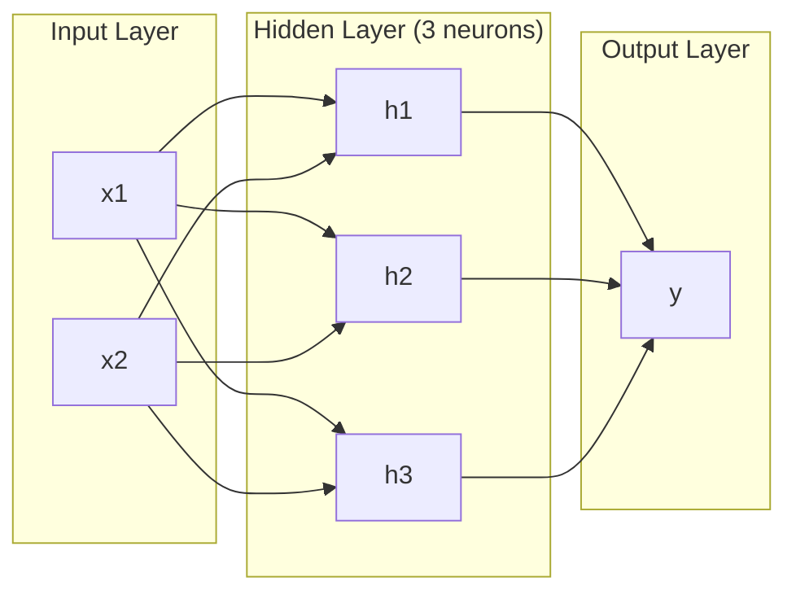
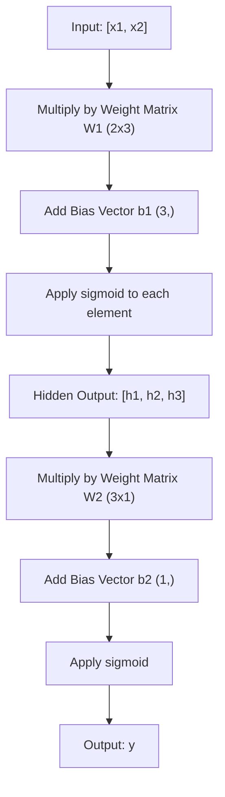
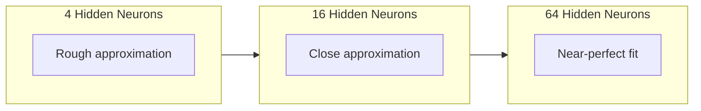

# شبكة متعددة المستويات مع مرور إلى الأمام

> العصب يخطط خطاً... و يجمعها، يمكنك رسم أي شيء

**Type:** 构建
**Languages:** Python
**Prerequisites:** Phase 01（Math Foundations），Lesson 03.01（The Perceptron）
**Time:** 约 90 分钟

## 學习目标

- استخدام الطبقة و شبكة من الصف من الصفر بناء شبكة متعددة المستويات، الانتهاء كاملة من المضي قدما
-  تتبع شبكة كل طبقة المصفوفة 维度,并识别形状不匹配
- 解释堆叠非线性激活 如何让网络学习曲的决策边界
- استخدام 2-2-1 架构和手工调好的 sigmoid 权重解决 XOR 问题

## 问题

العصب الواحد هو جهاز رسم. فقط هذا. يمكن أن يرسم خط مستقيم في بياناتك. كل مشكلة حقيقية في الذكاء الاصطناعي - التعرف على الصور والتعرف على اللغة.

1969، منسكي و ورقة يثبت هذا الحد هو مميت: شبكة ذات طبقة واحدة لا يمكن تعلم XOR. ليس من الصعب جدا التعلم.

هذا جعل دعم التمويل للشبكة العصبية يتوقف لأكثر من عشر سنوات. ومن الناحية الحالية، فإن طريقة التعديل واضحة: لا تستخدم فقط طبقة واحدة.

هذا المجموعة هي شبكة متعددة المستويات. إنها أساس كل نموذج للتعلم العميق في بيئة الإنتاج اليوم.

## 概念

### 层:输入、隐藏、输出

شبكة متعددة المستويات لديها ثلاث طبقات:

**输入层**-- 严格来说不是一层――它保存原始数据――两个特征意味着两个输入节点――这里不发生计算――

**Hidden layer**-- 工作发生的地方── كل عصب يتلقى كل خروج من الطبقة العليا، وتطبيق الوزن والتحيز، ثم نقلها إلى وظيفة تنشيط── يُطلق عليهاHidden، لأنك لن ترى هذه القيم مباشرة في بيانات التدريب──

**输出层**-- 最终答案──对于二分类,使用一个带 sigmoid 的神经元──对于可能类,每个类一个神经元──



هذا هو شبكة 2-3-1  اثنين من الدخول، ثلاثة الخلايا العصبية الخفية، واحد الخروج‬ كل اتصال تحمل وزن واحد‬ كل عصب‬

كل طبقة من هذه الصور تُنتج مجموعة من المتجهات التي تتكون من أرقام، تسمى الحالة الخفية. بالنسبة للنص، الحالة الخفية ستزيد من الدرجة. - وضع كلمة مُعدة إلى 768 رقمًا للاحتفاظ بالمعنى الإفزائي. - بالنسبة للصورة، ستقلل من الدرجة. - وضع ملايين الصور في تعبيرات قابلة للتدبير. - الحالة الخفية هي المكان الذي يحدث فيه التعلم.

### العصبية مع النشاط

كل عصب يفعله ثلاثة أشياء:

1. كل إدخال يُضاعف مع الوزن المتوافق
2. سوف كل ضربة و ضيف على تحيز
3. إعادة هذا و إدخال وظيفة تنشيط

الآن، فعل فعال هو sigmoid:

```
sigmoid(z) = 1 / (1 + e^(-z))
```

سيغمايد سوف تضغط أي رقم إلى (0, 1) 范围内。 أكبر الصواب يدخل إلى 1。 أكبر الناتج من الصواب يدخل إلى 0。 صفر يظهر إلى 0.5。 هذا التسهيل يجعل التعلم ممكن -- غير من المرحلة الصعبة من الفهم، سيغمايد في كل موقع لديه دراديينت。

### المخططات الأمامية:

الممرات المقبلة سوف تدخل البيانات على الصفوف عبر الشبكة حتى تصل إلى المخرجات.



في كل طبقة، ثلاثة عمليات سوف تحدث بالترتيب:

```
z = W * input + b       (linear transformation)
a = sigmoid(z)           (activation)
```

1 طبقة من المشاركة تصبح 1 طبقة من المشاركة

### المصفوفة 维度

 تتبع الدرجة هي أهم مهارات التدريب في التعلم العميق 👇:

| Step | Operation | Dimensions | Result Shape |
|------|-----------|------------|-------------|
| 输入 | x | -- | (2,) |
| Hidden 线性部分 | W1 * x + b1 | W1: (3, 2), b1: (3,) | (3,) |
| Hidden 激活 | sigmoid(z1) | -- | (3,) |
| 输出线性部分 | W2 * h + b2 | W2: (1, 3), b2: (1,) | (1,) |
| 输出激活 | sigmoid(z2) | -- | (1,) |

规则:第 k 层的权重矩阵 W 的形状是 (神经元_in_layer_k,神经元_in_layer_k_minus_1) 』行对应应应应应上一层──列对应应应上一层──如果形对不上,你就有错误──

### نظرية التقريب العالمي

1989، جورج سيبينكو  أثبت أمر غير عادي: امتلاك طبقة واحدة مخفية و عدد كاف من العصبية الشبكة، يمكن أن تقترب من أي وظيفة متواصلة بدقة متوقعة.

هذا لا يعني طبقة مخفية 总是最佳选择── هذا يعني أن هذه البنية لديها قدرة نظرية فى الممارسة العملية، شبكة أعمق 

直觉是: يتعلم كل عصب في الطبقة الخفية عكسًا أو خصائصًا. طالما أن هناك الكثير من العوامل، ووضعها في الموقع الصحيح، فيمكن أن تقترب من أي منحنى مسطح.



### المجموعة

شبكة عصبية هي قابلة للتجميع. يمكنك تكوينها. يمكنك توصيلها. يمكنك أن تعمل بها.


```figure
mlp-forward
```

## بناءها

純 Python──不使用numpy── كل ماتريكس 操作都从零编写──

### 步骤 1: Sigmoid 激活

```python
import math

def sigmoid(x):
    x = max(-500.0, min(500.0, x))
    return 1.0 / (1.0 + math.exp(-x))
```

ضع القيمة على [500، 500] لتجنب التفجير`math.exp(500)`كبيرة ولكن لا تزال محدودة`math.exp(1000)`هو لا يزال كبير

### 步骤 2: طبقة الطبقة

جميع التعلم العميق أهم عمليات هو المصفوفة 乘法── كل طبقة  كل رأس الاهتمام  كل مرة إمام --  طبقة أسفل هي المصفوفة ‬ طبقة خطية ‬ تتلقى مترو إدخال، سوف تضيفها إلى وزن المصفوفة، ومضافة إلى الخصم مترو:y = Wx + b‬‬ هذا التيار الواحد يشكل 90% من حجم الحساب في الشبكة العصبية‬‬

1 طبقة حفظ 1 معادلة الوزن و 1 مترو تحيزها. طريقة إيجابية تتلقى 1 مترو إدخال وتعود إلى الناتج بعد التفعيل.

```python
class Layer:
    def __init__(self, n_inputs, n_neurons, weights=None, biases=None):
        if weights is not None:
            self.weights = weights
        else:
            import random
            self.weights = [
                [random.uniform(-1, 1) for _ in range(n_inputs)]
                for _ in range(n_neurons)
            ]
        if biases is not None:
            self.biases = biases
        else:
            self.biases = [0.0] * n_neurons

    def forward(self, inputs):
        self.last_input = inputs
        self.last_output = []
        for neuron_idx in range(len(self.weights)):
            z = sum(
                w * x for w, x in zip(self.weights[neuron_idx], inputs)
            )
            z += self.biases[neuron_idx]
            self.last_output.append(sigmoid(z))
        return self.last_output
```

权重矩阵的形状是 (n_neurons, n_inputs) ――每一行是一个神经元跨所有输入的权重──前进方法 遍历神经元,计算加权和加偏见,应用 sigmoid,并收集结果──

### الخطوة 3: فئة الشبكة

واحدة من شبكاتها هي قائمة من الطبقات.

```python
class Network:
    def __init__(self, layers):
        self.layers = layers

    def forward(self, inputs):
        current = inputs
        for layer in self.layers:
            current = layer.forward(current)
        return current
```

هذا هو كل المخططات الأمامية، والتي تدخل كل طبقة من المعلومات، وتخرج من الطرف الآخر.

### الخطوة 4: استخدام الوسائل المختلفة لحل XOR

في الدروس 01، نجري من خلال مجموعة OR、NAND 和 AND perceptron  حل XOR。 الآن باستخدام طبقة و شبكة لدينا طبق القيام بنفس الشيء‬‬‬‬‬‬‬‬‬‬‬‬‬‬‬‬‬‬‬‬‬‬‬‬‬‬‬‬‬‬‬‬‬‬‬‬‬‬‬‬‬‬‬‬‬‬‬‬‬‬‬‬‬‬‬‬‬‬‬‬‬‬‬‬‬‬‬‬‬‬‬‬‬‬‬‬‬‬‬‬‬‬‬‬‬‬‬‬‬‬‬‬‬‬‬‬‬‬‬‬‬‬‬‬‬‬‬‬‬‬‬‬‬‬‬‬‬‬‬‬‬‬‬‬‬‬‬‬‬‬‬‬‬‬‬‬‬‬‬‬‬‬‬‬‬‬‬‬‬‬‬‬‬‬‬‬‬‬‬‬‬‬‬‬‬‬‬‬‬‬‬‬‬‬‬‬‬‬‬‬‬‬‬‬‬‬‬‬‬‬‬‬‬‬‬‬‬‬‬‬‬‬‬‬‬‬‬‬‬‬‬‬‬‬‬‬‬‬‬‬‬‬‬‬‬‬‬‬‬‬‬‬‬‬‬‬‬‬‬‬‬‬‬‬‬‬‬‬‬‬‬‬‬‬‬‬‬‬‬‬‬‬‬‬‬‬‬‬‬‬‬‬‬‬‬‬‬‬‬‬‬‬‬‬‬‬‬‬‬‬‬‬‬‬‬‬‬‬‬‬‬‬‬‬‬‬‬‬‬‬‬‬‬‬‬‬‬‬‬‬‬‬‬‬‬‬‬‬‬‬‬‬‬‬‬‬‬‬‬‬‬‬‬‬‬‬‬‬‬‬‬‬‬‬‬‬‬‬‬‬‬‬‬‬‬‬‬‬‬‬‬‬‬‬‬‬‬‬‬‬‬‬‬‬‬‬‬‬‬‬‬‬‬‬‬‬‬‬‬‬‬‬‬‬‬‬‬‬‬‬‬‬‬‬‬‬‬‬‬‬‬‬‬‬‬‬‬‬‬‬‬‬‬‬‬‬‬‬‬‬‬‬‬‬‬‬‬‬‬‬‬‬‬‬‬‬‬‬‬‬‬‬‬‬‬‬‬‬‬‬‬‬‬

```python
hidden = Layer(
    n_inputs=2,
    n_neurons=2,
    weights=[[20.0, 20.0], [-20.0, -20.0]],
    biases=[-10.0, 30.0],
)

output = Layer(
    n_inputs=2,
    n_neurons=1,
    weights=[[20.0, 20.0]],
    biases=[-30.0],
)

xor_net = Network([hidden, output])

xor_data = [
    ([0, 0], 0),
    ([0, 1], 1),
    ([1, 0], 1),
    ([1, 1], 0),
]

for inputs, expected in xor_data:
    result = xor_net.forward(inputs)
    predicted = 1 if result[0] >= 0.5 else 0
    print(f"  {inputs} -> {result[0]:.6f} (rounded: {predicted}, expected: {expected})")
```

较大的权重(20, -20) جعل sigmoid تمثل مثل مرحلة قفز وظيفة。 الأول الخفي الخبيث قريبة OR。 الثاني قريبة NAND。输出神经元把它们组合成 AND,也就是 XOR。

### الخطوة 5: 圆形分类

مشكلة أصعب: أن تكون النقاط الثنائية الأبعاد مركزًا على النقطة الأصلية ، نصف قطرها 0.5 حلقة داخل أو خارج الحلقة.

```python
import random
import math

random.seed(42)

data = []
for _ in range(200):
    x = random.uniform(-1, 1)
    y = random.uniform(-1, 1)
    label = 1 if (x * x + y * y) < 0.25 else 0
    data.append(([x, y], label))

circle_net = Network([
    Layer(n_inputs=2, n_neurons=8),
    Layer(n_inputs=8, n_neurons=1),
])
```

لا ينجح في استخدام الوزن随机, نتج عن النقاط النقدية. ولكن الوصول إلى الأمام 仍然会运行.

```python
correct = 0
for inputs, expected in data:
    result = circle_net.forward(inputs)
    predicted = 1 if result[0] >= 0.5 else 0
    if predicted == expected:
        correct += 1

print(f"Accuracy with random weights: {correct}/{len(data)} ({100*correct/len(data):.1f}%)")
```

عندما يصل الوزن إلى معدل تحديد أقل -- عادة حتى أكثر من تخمين الأغلبية أيضا.

## استخدمها

بايتورش باستخدام أربعة صفوف من الكود لإنجاز كل ما هو أعلاه:

```python
import torch
import torch.nn as nn

model = nn.Sequential(
    nn.Linear(2, 8),
    nn.Sigmoid(),
    nn.Linear(8, 1),
    nn.Sigmoid(),
)

x = torch.tensor([[0.0, 0.0], [0.0, 1.0], [1.0, 0.0], [1.0, 1.0]])
output = model(x)
print(output)
```

`nn.Linear(2, 8)`هذا طبقة طبقاتك:شكل 为 (8, 2) من الوزن المصفوفة،شكل 为 (8,) من الاختيارات المتجهة.`nn.Sigmoid()`هو الخاص بك sigmoid 函数,逐元素应用──`nn.Sequential`هو صف شبكةك: حسب الترتيبات

الفرق يتوقف على السرعة والحجم. يتشغّل PyTorch على GPUs، ويعالج ملايين العينات من المجموعة، ويحسب تلقائيًا لتحديد درجة التنشر الخلفي. ولكن منطق التسلل إلى الأمام هو نفس المحتوى الذي قمت به في التكوين من الصفر تماما.

## 交付 it

هذا المقال يُنتج عن عرض قابل للرد، لتنمية بنية شبكة:

- `outputs/prompt-network-architect.md`

عندما تحتاج إلى تحديد المشكلة لتقرر كم مستوى من العصبية في كل مستوى وكم من المواد المفعولية التي تستخدمها، يمكنك استخدامها

## التدريب

1. 构建一个 2-4-2-1 网络(两个层藏), و استخدام XOR 数据上随机权重运行 前进通行──打印中间隐藏层的输出,观察表示在每层如何变变──

2. ستعمل الطبقة الخفية في الجهاز التقسيمي المُخفيّة. ستعمل الطبقة الخفية في الطبقة التقسيمية. ستعمل الطبقة الخفية في الطبقة التقسيمية. ستعمل الطبقة الخفية في الطبقة التقسيمية. ستعمل الطبقة الخفية في الطبقة التقسيمية. ستعمل الطبقة الخفية في الطبقة التقسيمية. ستعمل الطبقة الخفية في الطبقة التقسيمية. ستعمل الطبقة الخفية في الطبقة الخفية. ستعمل الطبقة الخفية في الطبقة التقسيمية. ستعمل الطبقة الخفية في الطبقة الخفية. ستعمل الطبقة الخفية في الطبقة الخفية. ستعمل الطبقة الخفية في الطبقة الخفية. ستعمل الطبقة الخفية في الطبقة الخفية. ستغير حجم الناتج أو التوزيع. لماذا؟

3. في فئة الشبكة 上 تحقيق واحد `count_parameters`طريقة، عودة التدريب الوزن والتحيزات العدد الإجمالي.

4. لـ 3-4-4-2  شبكة بناء إمام مرورها ‬‬‬‬‬‬‬‬‬‬‬‬‬‬‬‬‬‬‬‬‬‬‬‬‬‬‬‬‬‬‬‬‬‬‬‬‬‬‬‬‬‬‬‬‬‬‬‬‬‬‬‬‬‬‬‬‬‬‬‬‬‬‬‬‬‬‬‬‬‬‬‬‬‬‬‬‬‬‬‬‬‬‬‬‬‬‬‬‬‬‬‬‬‬‬‬‬‬‬‬‬‬‬‬‬‬‬‬‬‬‬‬‬‬‬‬‬‬‬‬‬‬‬‬‬‬‬‬‬‬‬‬‬‬‬‬‬‬‬‬‬‬‬‬‬‬‬‬‬‬‬‬‬‬‬‬‬‬‬‬‬‬‬‬‬‬‬‬‬‬‬‬‬‬‬‬‬‬‬‬‬‬‬‬‬‬‬‬‬‬‬‬‬‬‬‬‬‬‬‬‬‬‬‬‬‬‬‬‬‬‬‬‬‬‬‬‬‬‬‬‬‬‬‬‬‬‬‬‬‬‬‬‬‬‬‬‬‬‬‬‬‬‬‬‬‬‬‬‬‬‬‬‬‬‬‬‬‬‬‬‬‬‬‬‬‬‬‬‬‬‬‬‬‬‬‬‬‬‬‬‬‬‬‬‬‬‬‬‬‬‬‬‬‬‬‬‬‬‬‬‬‬‬‬‬‬‬‬‬‬‬‬‬‬‬‬‬‬‬‬‬‬‬‬‬‬‬‬‬‬‬‬‬‬‬‬‬‬‬‬‬‬‬‬‬‬‬‬‬‬‬‬‬‬‬‬‬‬‬‬‬‬‬‬‬‬‬‬‬‬‬‬‬‬‬‬‬‬‬‬‬‬‬‬‬‬‬‬‬‬‬‬‬‬‬‬‬‬‬‬‬‬‬‬‬‬‬‬‬‬‬‬‬‬‬‬‬‬‬‬‬‬‬‬‬‬‬‬‬‬‬‬‬‬‬‬‬‬‬‬‬‬‬‬‬‬‬‬‬‬‬‬‬‬‬‬‬‬‬‬‬‬‬‬‬‬‬‬‬‬‬‬‬‬‬‬‬‬‬‬‬‬‬‬‬‬‬‬‬‬‬‬‬‬‬

5. باستخدام  خيار  وظيفة استبدال sigmoid: إذا z < 0,则返回 0.01 * z,否则返回 1.0。 باستخدام الخطوة 4 نفس الجهاز اليدوي، في XOR 上运行 前行通过── هل لا يزال سار؟ لماذا سيقميد سلمي أكثر تفضيلًا من قطع صلب؟

## 关键术语

| Term | 人们会怎么说 | 它实际意味着什么 |
|------|----------------|----------------------|
| Forward pass | “运行模型” | 将输入推过每一层 -- 乘以权重、加上 bias、激活 -- 以产生输出 |
| Hidden layer | “中间部分” | 输入和输出之间的任意层，其值不会在数据中被直接观察到 |
| Multi-layer network | “一个深的 Neural Network” | 按顺序堆叠的神经元层，其中每一层的输出会输入到下一层 |
| Activation function | “非线性” | 在线性变换之后应用的函数，用来把曲线引入决策边界 |
| Sigmoid | “S 曲线” | sigma(z) = 1/(1+e^(-z))，将任意实数压缩到 (0,1)，平滑且处处可微 |
| Weight matrix | “参数” | 一个 shape 为 (current_layer_neurons, previous_layer_neurons) 的 Matrix W，包含可学习的连接强度 |
| Bias vector | “偏移量” | 在 Matrix 乘法之后添加的 Vector，使神经元即使在所有输入为零时也能激活 |
| Universal approximation | “Neural Network 可以学习任何东西” | 一个拥有足够多神经元的单 hidden layer 可以逼近任意连续函数 -- 但“足够多”可能意味着数十亿 |
| Linear transformation | “Matrix 乘法步骤” | z = W * x + b，激活前的计算，将输入映射到一个新空间 |
| Decision boundary | “分类器切换的地方” | 输入空间中的一个曲面，网络输出在这里跨过分类阈值 |

## 延伸阅读

- مايكل نيلسن، "الشبكات العصبية والتعلم العميق"، الفصل 1-2 (http://neuralnetworksanddeeplearning.com/) -- 关于                                                                                                                                                                                                                                                             
- سيبينكو، "الاقتراب من خلال التنظيمات الفاعلة السيغمويدية" (1989) -- أول نظرية التقريب العالمي
- 3Blue1Brown، "ولكن ما هي الشبكة العصبية؟"https://www.youtube.com/watch?v=aircAruvnKk) -- 20 دقيقة قابل للتعبيرات الطبقة والوزن والمرور إلى الأمام، مساعدة في بناء نموذج ذهني صحيح
- (مُحَبَّبٌ، (بنجيو) ، (كورفيل) ، "التعلم العميق"، الفصل 6 (https://www.deeplearningbook.org/) -- المتعددة مستويات شبكة المعلومات، قراءة مجانية على الإنترنت
