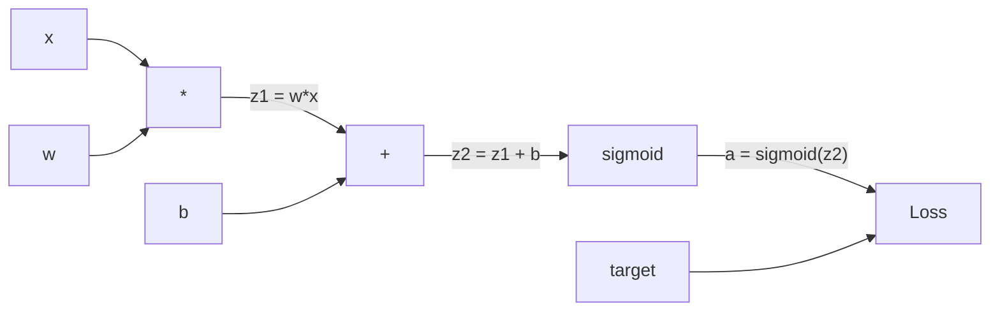
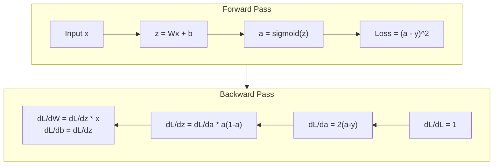
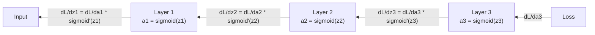

# من صفر تحقيق التنشر الخلفي

> التنشر الخلفي هو جعل التعلم أصبح ممكنة الخوارزمية.

**Type:** Build
**Languages:** Python
**Prerequisites:** Lesson 03.02 (Multi-Layer Networks)
**Time:** ~120 minutes

## 學习目标
- 实现 a القيمة القائمة على محرك autograd، فإنه سوف يكوّن الرسم البياني الحاسوبي، ومرحلة التطبيق التوبولوجي  حساب دراديينت
- استخدام قاعدة سلسلة 推导 إضافة 乘和 sigmoid                                                                                                                                                                                                                                                                                                                                                                                                                                                                                                             
- فقط باستخدامك من صفر تحقيق محرك التنشر الخلفي، في XOR و تصنيف الدائرة
- 识别深层 sigmoid network 中的消失梯度 问题,并解释为什么 渐进指数级缩小

## 问题
شبكةك لديها طبقة مخفية، تحتوي على 768 إدخال و 3072 إخراج. هذا هو 2,359,296 وزن.

الممارسة البسيطة هي: أخذ وزن واحد، وضعه على ضيق قليلاً، وإعادة تشغيله مرة أخرى على المضي قدماً، قياس الخسارة هو صعود أو انخفاض. هذا سوف يمنح هذا الوزن درجة.

التنشر الخلفي  حلها هذه المشكلة. مرة واحدة التقدم إلى الأمام، مرة واحدة التقدم الخلفي، كل المراحل تم حسابها.

## 概念
### قاعدة السلسلة، تطبيق إلى شبكة

你在阶段01 中见过链条规则──快速回顾: إذا y = f(g(x) ، ثم dy/dx = f'(g(x)) * g'(x)──你沿着链条相乘衍生物──

في شبكة العصبية، 链条 هي من المدخل إلى سلسلة العمليات الخسارة. في كل مستوى من التطبيقات، يتم تعيين الوزن، ووضع الوقوف، وإعادة تمرير التفعيل.

### الرسومات الحسابية

كل مرة في Forward Pass مدينة تكوين رسم البيانات. كل عقد هو عملية ((مضاعفة 、ضافة 、 سمويد) ٬ كل حافة إلى الأمام والتي تعود إلى الظهر.



المضي قدما: القيمة من اليسار إلى اليمين流动──x 和 w 产生 z1 = w*x──加上 b 得到 z2──Sigmoid 给出激活 a──使用 Loss Function 将 a 与 target y 比较──

ردّ الخلفي: درجة من اليمين إلى اليسار 流动。从 dL/da 开始(Loss 如何随激活 改变)。乘以 da/dz2(مدفوعة sigmoid)。 الحصول على dL/dz2。拆分成 dL/db((إنه يساوي dL/dz2, لأن z2 = z1 + b) وم dL/dz1。 ثم dL/dw = dL/dz1 * x,dL/dx = dL/dz1 * w。

في الرسم البياني في كل عقدة في خلال مرور الظهر  فقط مهمة واحدة: استلام من الجدارة من الجوار العلوي، ضربها مشتق محلي الخاص بها، ثم إلى الجوار السفلي.

### للأمام مقابل الخلف



المضي قدما سجل كل قيمة متوسطة:z、a、 كل طبقة من المدخلات.

### تدريجية في شبكة

بالنسبة لشبكة ثلاث طبقات، تتواصل الدرجات عبر كل طبقة:



في كل طبقة، Gradent مدينة ضربة مشتقة sigmoid.

### الدرجات المختفية

هذا هو التهاب التدفق  مشكلة. سيتم تقليص الصادرات إلى 0 و ¦1 ¦. مشتقاته ¦ ¦ ¦ ¦ ¦ ¦ ¦ ¦ ¦ ¦ ¦ ¦ ¦ ¦ ¦ ¦ ¦ ¦ ¦ ¦ ¦ ¦ ¦ ¦ ¦ ¦ ¦ ¦ ¦ ¦ ¦ ¦ ¦ ¦ ¦ ¦ ¦ ¦ ¦ ¦ ¦ ¦ ¦ ¦ ¦ ¦ ¦ ¦ ¦ ¦ ¦ ¦ ¦ ¦ ¦ ¦ ¦ ¦ ¦ ¦ ¦ ¦ ¦ ¦ ¦ ¦ ¦ ¦ ¦ ¦ ¦ ¦ ¦ ¦ ¦ ¦ ¦ ¦ ¦ ¦ ¦ ¦ ¦ ¦ ¦ ¦ ¦ ¦ ¦ ¦ ¦ ¦ ¦ ¦ ¦ ¦ ¦ ¦ ¦ ¦ ¦ ¦ ¦ ¦ ¦ ¦ ¦ ¦ ¦ ¦ ¦ ¦ ¦ ¦ ¦ ¦ ¦ ¦ ¦ ¦ ¦ ¦ ¦ ¦ ¦ ¦ ¦ ¦ ¦ ¦ ¦ ¦ ¦ ¦ ¦ ¦ ¦ ¦ ¦ ¦ ¦ ¦ ¦ ¦ ¦ ¦ ¦ ¦ ¦ ¦ ¦ ¦ ¦ ¦ ¦ ¦ ¦ ¦ ¦ ¦ ¦ ¦ ¦ ¦ ¦ ¦ ¦ ¦ ¦ ¦ ¦ ¦ ¦ ¦ ¦ ¦ ¦ ¦    ¦                                                                                                                      

```
sigmoid(z):     Output range [0, 1]
sigmoid'(z):    Max value 0.25 (at z = 0)

After 5 layers:   gradient * 0.25^5 = 0.001x original
After 10 layers:  gradient * 0.25^10 = 0.000001x original
```

هذا هو السبب في أن شبكة سيغمايد العميقة  تقريبا مستحيل التدريب   修复方法 -- ReLU 及其变体 -- هو الدروس 04  الموضوع ٬ الآن، أولا فهم الترويج الخلفي نفسه يعمل بشكل كامل٬ والمسألة تكمن في ما تمر به٬

### 推导 شبكة طبقاتين

فيما يلي مثال رياضي محدد: شبكة لديها مدخل x 带 sigmoid الطبقة الخفية 带 sigmoid الطبقة الخروج، وكذلك خسارة MSE 

التسلل الأمامي:
```
z1 = W1 * x + b1
a1 = sigmoid(z1)
z2 = W2 * a1 + b2
a2 = sigmoid(z2)
L = (a2 - y)^2
```

التراجع (بالإنجليزية: Backward Pass)
```
dL/da2 = 2(a2 - y)
da2/dz2 = a2 * (1 - a2)
dL/dz2 = dL/da2 * da2/dz2 = 2(a2 - y) * a2 * (1 - a2)

dL/dW2 = dL/dz2 * a1
dL/db2 = dL/dz2

dL/da1 = dL/dz2 * W2
da1/dz1 = a1 * (1 - a1)
dL/dz1 = dL/da1 * da1/dz1

dL/dW1 = dL/dz1 * x
dL/db1 = dL/dz1
```

كل درجة هي المشتقات المحلية التي يتم تعقبها من الخسارة إلى الوراء


```figure
backprop-vanishing
```

## بناءها
### الخطوة 1: عقد القيمة

كل رقم في الحسابات سوف تصبح قيمة واحدة. انها تخزن بياناتها، والنسبة، وكيف يتم إنشاؤها.

```python
class Value:
    def __init__(self, data, children=(), op=''):
        self.data = data
        self.grad = 0.0
        self._backward = lambda: None
        self._children = set(children)
        self._op = op

    def __repr__(self):
        return f"Value(data={self.data:.4f}, grad={self.grad:.4f})"
```

لا يوجد أي وظيفة متراجعة`_children`سوف تتبع لتوليد هذه القيمة القيمة الأخرى، وبعد ذلك يمكننا أن نفعل على الرسم البياني نوع التوبولوجي.

### الخطوة 2: 带 Backward Function

كل عملية ستخلق قيمة جديدة، وتحدد التدريجية كيفية التردد من خلالها.

```python
def __add__(self, other):
    other = other if isinstance(other, Value) else Value(other)
    out = Value(self.data + other.data, (self, other), '+')

    def _backward():
        self.grad += out.grad
        other.grad += out.grad

    out._backward = _backward
    return out

def __mul__(self, other):
    other = other if isinstance(other, Value) else Value(other)
    out = Value(self.data * other.data, (self, other), '*')

    def _backward():
        self.grad += other.data * out.grad
        other.grad += self.data * out.grad

    out._backward = _backward
    return out
```

 لضافة: d  a+b) /da = 1,d  a+b) /db = 1‬‬‬‬‬‬‬‬‬‬‬‬‬‬‬‬‬‬‬‬‬‬‬‬‬‬‬‬‬‬‬‬‬‬‬‬‬‬‬‬‬‬‬‬‬‬‬‬‬‬‬‬‬‬‬‬‬‬‬‬‬‬‬‬‬‬‬‬‬‬‬‬‬‬‬‬‬‬‬‬‬‬‬‬‬‬‬‬‬‬‬‬‬‬‬‬‬‬‬‬‬‬‬‬‬‬‬‬‬‬‬‬‬‬‬‬‬‬‬‬‬‬‬‬‬‬‬‬‬‬‬‬‬‬‬‬‬‬‬‬‬‬‬‬‬‬‬‬‬‬‬‬‬‬‬‬‬‬‬‬‬‬‬‬‬‬‬‬‬‬‬‬‬‬‬‬‬‬‬‬‬‬‬‬‬‬‬‬‬‬‬‬‬‬‬‬‬‬‬‬‬‬‬‬‬‬‬‬‬‬‬‬‬‬‬‬‬‬‬‬‬‬‬‬‬‬‬‬‬‬‬‬‬‬‬‬‬‬‬‬‬‬‬‬‬‬‬‬‬‬‬‬‬‬‬‬‬‬‬‬‬‬‬‬‬‬‬‬‬‬‬‬‬‬‬‬‬‬‬‬‬‬‬‬‬‬‬‬‬‬‬‬‬‬‬‬‬‬‬‬‬‬‬‬‬‬‬‬‬‬‬‬‬‬‬‬‬‬‬‬‬‬‬‬‬‬‬‬‬‬‬‬‬‬‬‬‬‬‬‬‬‬‬‬‬‬‬‬‬‬‬‬‬‬‬‬‬‬‬‬‬‬‬‬‬‬‬‬‬‬‬‬‬‬‬‬‬‬‬‬‬‬‬‬‬‬‬‬‬‬‬‬‬‬‬‬‬‬‬‬‬‬‬‬‬‬‬‬‬‬‬‬‬‬‬‬‬‬‬‬‬‬‬‬‬‬‬‬‬‬‬‬‬‬‬‬‬‬‬‬‬‬‬‬‬‬‬‬‬‬‬‬‬‬‬‬‬‬‬‬‬‬‬‬‬‬‬‬‬‬‬‬‬‬‬‬‬‬‬‬‬‬

对于乘法:d(a*b)/da = b,d(a*b)/db = a。 كل مدخل مدينة تحصل على قيمة مدخل أخرى 乘以 output gradient。

`+=`很关键──一个值可能会被多个操作使用──它的渐进是来自所有路径的渐进之和──

### 步骤 3: سيغمويد والخسارة

```python
import math

def sigmoid(self):
    x = self.data
    x = max(-500, min(500, x))
    s = 1.0 / (1.0 + math.exp(-x))
    out = Value(s, (self,), 'sigmoid')

    def _backward():
        self.grad += (s * (1 - s)) * out.grad

    out._backward = _backward
    return out
```

مشتق سيغمويد: sigmoid(x) * (1 - sigmoid(x))。 نحن في Forward Pass 中已计算了 sigmoid(x) = s。复用它──不需要额外工作──

```python
def mse_loss(predicted, target):
    diff = predicted + Value(-target)
    return diff * diff
```

单个输出的 MSE:(预测 -目标)^2──我们把减法表达为加上一个取负的值──

### الخطوة الرابعة: التراجع

النوع التوبولوجي  ضمان أننا على النظام الصحيح معالجة العقد -- حد من العقدة الجريينت 会在通过它继续传播之前被完全累积──

```python
def backward(self):
    topo = []
    visited = set()

    def build_topo(v):
        if v not in visited:
            visited.add(v)
            for child in v._children:
                build_topo(child)
            topo.append(v)

    build_topo(self)
    self.grad = 1.0
    for v in reversed(topo):
        v._backward()
```

من الخسارة 开始(Gradient = 1.0, لأن dL/dL = 1)── على طول الرسم البياني بعد التنظيم 反向遍历── كل عقدة `_backward`سأقوم بإرسال (غريدينت) لأطفالها

### 步骤 5: الطبقة والشبكة

```python
import random

class Neuron:
    def __init__(self, n_inputs):
        scale = (2.0 / n_inputs) ** 0.5
        self.weights = [Value(random.uniform(-scale, scale)) for _ in range(n_inputs)]
        self.bias = Value(0.0)

    def __call__(self, x):
        act = sum((wi * xi for wi, xi in zip(self.weights, x)), self.bias)
        return act.sigmoid()

    def parameters(self):
        return self.weights + [self.bias]


class Layer:
    def __init__(self, n_inputs, n_outputs):
        self.neurons = [Neuron(n_inputs) for _ in range(n_outputs)]

    def __call__(self, x):
        out = [n(x) for n in self.neurons]
        return out[0] if len(out) == 1 else out

    def parameters(self):
        params = []
        for n in self.neurons:
            params.extend(n.parameters())
        return params


class Network:
    def __init__(self, sizes):
        self.layers = []
        for i in range(len(sizes) - 1):
            self.layers.append(Layer(sizes[i], sizes[i + 1]))

    def __call__(self, x):
        for layer in self.layers:
            x = layer(x)
            if not isinstance(x, list):
                x = [x]
        return x[0] if len(x) == 1 else x

    def parameters(self):
        params = []
        for layer in self.layers:
            params.extend(layer.parameters())
        return params

    def zero_grad(self):
        for p in self.parameters():
            p.grad = 0.0
```

واحد العصبية قبل المدخل، حساب المجموع الموزن + التحيز، ثم تطبيق sigmoid──权重初始化按平方(2/n_inputs) 缩放، لتحديد زيادة الاكتفاء في شبكة sigmoid── طبقة هي قائمة العصبية── شبكة هي قائمة الطبقة──`parameters()`الطريقة سوف تجمع كل القيمة التي يمكن تعلمها، حتى نتمكن من تحديثها.

### الخطوة 6: في XOR 上 التدريب

```python
random.seed(42)
net = Network([2, 4, 1])

xor_data = [
    ([0.0, 0.0], 0.0),
    ([0.0, 1.0], 1.0),
    ([1.0, 0.0], 1.0),
    ([1.0, 1.0], 0.0),
]

learning_rate = 1.0

for epoch in range(1000):
    total_loss = Value(0.0)
    for inputs, target in xor_data:
        x = [Value(i) for i in inputs]
        pred = net(x)
        loss = mse_loss(pred, target)
        total_loss = total_loss + loss

    net.zero_grad()
    total_loss.backward()

    for p in net.parameters():
        p.data -= learning_rate * p.grad

    if epoch % 100 == 0:
        print(f"Epoch {epoch:4d} | Loss: {total_loss.data:.6f}")

print("\nXOR Results:")
for inputs, target in xor_data:
    x = [Value(i) for i in inputs]
    pred = net(x)
    print(f"  {inputs} -> {pred.data:.4f} (expected {target})")
```

观察 Loss 下降── من التنبؤ随机 إلى الخروج XOR الصحيح ، بالكامل بواسطة التنشر الخلفي  حساب درجيينت 并向正确方向微调权重来驱动──

### الخطوة 7: تصنيف الدائرة

في الدروس 02، أنت لتصنيف الدورات 手动调过权重──现在让网络自我学习它们──

```python
random.seed(7)

def generate_circle_data(n=100):
    data = []
    for _ in range(n):
        x1 = random.uniform(-1.5, 1.5)
        x2 = random.uniform(-1.5, 1.5)
        label = 1.0 if x1 * x1 + x2 * x2 < 1.0 else 0.0
        data.append(([x1, x2], label))
    return data

circle_data = generate_circle_data(80)

circle_net = Network([2, 8, 1])
learning_rate = 0.5

for epoch in range(2000):
    random.shuffle(circle_data)
    total_loss_val = 0.0
    for inputs, target in circle_data:
        x = [Value(i) for i in inputs]
        pred = circle_net(x)
        loss = mse_loss(pred, target)
        circle_net.zero_grad()
        loss.backward()
        for p in circle_net.parameters():
            p.data -= learning_rate * p.grad
        total_loss_val += loss.data

    if epoch % 200 == 0:
        correct = 0
        for inputs, target in circle_data:
            x = [Value(i) for i in inputs]
            pred = circle_net(x)
            predicted_class = 1.0 if pred.data > 0.5 else 0.0
            if predicted_class == target:
                correct += 1
        accuracy = correct / len(circle_data) * 100
        print(f"Epoch {epoch:4d} | Loss: {total_loss_val:.4f} | Accuracy: {accuracy:.1f}%")
```

هنا نستخدم SGD على الانترنت - بعد كل عينة  بعد تحديث الوزن، بدلا من جمع المجموعة الكاملة. هذا سوف يكون أسرع لتحطيم المكاسب، وتجنب ظهور التشبث السيغمويدي في المشهد الخسارة الكاملة.

没有手动调参──网络 会自己发现圆形决策界限──这是力量的推广:你定义建筑、损失函数和数据──算法会找到权重──

## استخدمها
استخدم PyTorch عدة صيغ من الكود لإكمال كل الأعمال المذكورة أعلاه.

```python
import torch
import torch.nn as nn

model = nn.Sequential(
    nn.Linear(2, 4),
    nn.Sigmoid(),
    nn.Linear(4, 1),
    nn.Sigmoid(),
)
optimizer = torch.optim.SGD(model.parameters(), lr=1.0)
criterion = nn.MSELoss()

X = torch.tensor([[0,0],[0,1],[1,0],[1,1]], dtype=torch.float32)
y = torch.tensor([[0],[1],[1],[0]], dtype=torch.float32)

for epoch in range(1000):
    pred = model(X)
    loss = criterion(pred, y)
    optimizer.zero_grad()
    loss.backward()
    optimizer.step()

print("PyTorch XOR Results:")
with torch.no_grad():
    for i in range(4):
        pred = model(X[i])
        print(f"  {X[i].tolist()} -> {pred.item():.4f} (expected {y[i].item()})")
```

`loss.backward()`هذا لك`total_loss.backward()`.`optimizer.step()`هذا ما كتبته`p.data -= lr * p.grad`.`optimizer.zero_grad()`هذا لك`net.zero_grad()` نفس الخوارزمية، التطبيق الصناعي  PyTorch  مسؤولة عن تسريع GPU  الدقة المختلطة  التفتيش التدريجي، فضلا عن مئات من أنواع الطبقات  ولكن Backward Pass  لا يزال نفس قاعدة السلسلة، تطبيق في نفس الرسم البياني الحاسوبي 

訓練會运行Forward Pass، ثم运行Backward Pass,再更新权重──Inference فقط运行Forward Pass── بدون Gradient, بدون update── هذا الفرق مهم، لأن الاستنتاج 才是 ما يحدث في بيئة الإنتاج── عندما تستخدم كلود أو GPT مثل هذه الإي بي سي، تقوم بتشغيل الاستنتاج -- Your prompt 向前流经网络,Token From the other side output── لا يوجد أي سلطة للقيام بتغييرات── فهم الالترويج الراجعي 很 مهم، لأنه صمم كل سلطة في الشبكة.

## 交付 it
本课会产出:
- `outputs/prompt-gradient-debugger.md`-- إشارة مستمرة تستخدم لتشخيص أي مشكلة في شبكة عصبية

## التدريب
1. عطي فئة القيمة اضافة واحد `__sub__`طريقة ((أ - ب = a + (-1 * ب)))).`__neg__`طريقة: (ب) من خلال تقييم مع عملية التعبير البسيطة (ب) من (أ - ب)^2) ، والتي تثبت أن الدرجة صحيحة:

2. أعط قيمة إضافة واحدة`relu`طريقة ((المخرجة 为最大(0, x),المتأصل في x > 0 时为 1,否则为 0) ・・・ في الطبقة الخفية باستخدام relu 替换 sigmoid,并再次在 XOR 上训练──比较收速度──你应该会看到训练更快--这是第04课的预告──

3. في القيمة على تحقيق قوى كاملة المستخدمة`__pow__`طريقة... استخدمها`mse_loss`بدل حقيقي `(predicted - target) ** 2`تعبير:                                                                                                                                                                                                                                                              

4. 给训练循环 添加梯度剪辑:调用 `backward()`بعد ذلك، ضع كل المرافق إلى [-1, 1]── تدريب شبكة أعمق  4+ طبقات مع sigmoid) ،并比较有无剪切的损失曲线──这是你对抗爆炸梯度的第一防线──

5. 构建一个视觉化:在 XOR 训练完成后,打印网络中每个参数的梯度──找出哪一层的梯度 最小──这会演示你在概念 部分读到的消失梯度 问题──

## 关键术语
| Term | What people say | What it actually means |
|------|----------------|----------------------|
| Backpropagation | “Network 学会了” | 一种算法，通过沿 Computational Graph 反向应用 chain rule，为每个权重计算 dL/dw |
| Computational graph | “Network 结构” | 一个有向无环 graph，其中 node 是 operation，edge 承载 value（forward）和 Gradient（backward） |
| Chain rule | “把 derivative 相乘” | 如果 y = f(g(x))，那么 dy/dx = f'(g(x)) * g'(x) -- Backpropagation 的数学基础 |
| Gradient | “最陡上升方向” | Loss 相对于某个 parameter 的 partial derivative -- 告诉你如何改变该 parameter 来降低 Loss |
| Vanishing gradient | “深层 network 学不会” | 当 Gradient 通过带有 sigmoid 这类 saturating activation 的 layer 传播时，会指数级缩小 |
| Forward pass | “运行 network” | 通过顺序应用每一层的 operation，从 input 计算 output，并存储 intermediate value |
| Backward pass | “计算 Gradient” | 反向遍历 Computational Graph，在每个 node 使用 chain rule 累积 Gradient |
| Learning rate | “学习速度” | 一个控制权重更新步长的 scalar：w_new = w_old - lr * gradient |
| Topological sort | “正确顺序” | 一种 graph node 排序方式，使每个 node 都出现在其依赖的所有 node 之后 -- 确保 Gradient 在传播前已完全累积 |
| Autograd | “自动微分” | 一个在 forward computation 期间构建 Computational Graph，并自动计算 Gradient 的系统 -- PyTorch 的 engine 做的就是这个 |

## 延伸阅读
- روميل هارت، هينتون وويليامز، "تعلم التمثيلات عن طريق أخطاء التنشر الخلفي" (1986) -- هذا المقال جعل التنشر الخلفي أصبح رئيسيا،并解锁了 تدريب الشبكات متعددة الطبقات
- 3Blue1Brown، سلسلة "شبكات العصبية" (https://www.youtube.com/playlist?list=PLZHQObOWTQDNU6R1_67000Dx_ZCJB-3pi) -- حول التنشر الخلفي وكيفية تدريجية التدفق عبر الشبكة
