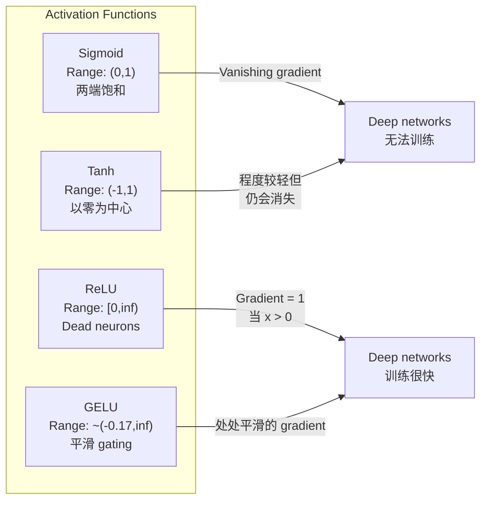
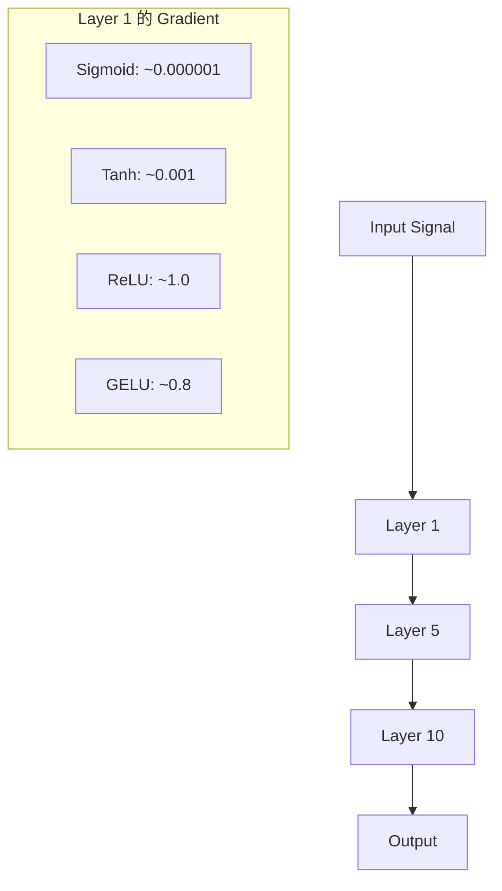
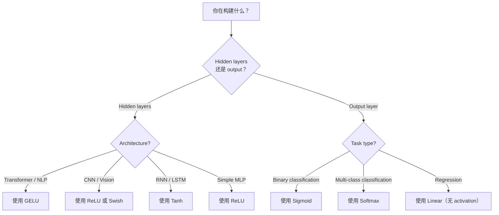

# 激活函数

> لا يوجد غير خطي، شبكتك المكونة من 100 طبقة هي مجرد مضاعفة ماريكس دقيقة واحدة.

**Type:** Build
**Languages:** Python
**Prerequisites:** Lesson 03.03 (Backpropagation)
**Time:** ~75 分钟

## 學习目标

- من صفر تحقيق sigmoid、tanh、ReLU、Leaky ReLU、GELU、Swish 和 softmax  ومشتقاتها
- 通過 قياس مختلف التفعيلات في 10+ مستويات من حجم التفعيل، تشخيص مشكلة التهاب التراجعية
- في شبكة ريلو الميتة، لم يفسر لماذا يمكن لـ GELU تجنب هذا النظام الفاشل
- لتحديد الهندسة المعمارية ((المحول  CNN  RNN  خروجي طبقة) اختيار وظيفة التفعيل الصحيحة

## 问题

堆叠两个 خطي التحويلات:y = W2(W1x + b1) + b2。展开它:y = W2W1x + W2b1 + b2。 هذا مجرد y = Ax + c تحويل خطي واحد。 مهما قمت بتركيب العديد من الطبقات الخطية، فإن النتيجة ستكونتختصر إلى مضاعفة المصفوفة مرة واحدة。 شبكة 100 طبقة الخاصة بك مع طبقة واحدة 具有 نفس القدرة على التعبير。

هذا ليس من النظرية. إنه يعني أن الشبكة الخطية العميقة لا تستطيع تعلم XOR على الصعيد، لا تستطيع تقسيم مجموعة بيانات مستديرة، لا تستطيع التعرف على وجوه الإنسان.

وظائف التفعيل 打破线性── أنها تمر من خلال وظيفة غير خطية 扭曲 كل طبقة من المخرجات، جعل الشبكة 能够曲 القرارات الحدود、 تقريب أي وظيفة،并真正学习── ولكن إذا اخترت خطأ التفعيل، ستختفي تراجعاتك إلى صفر ((السيغمود في الشبكات العميقة)  انفجار إلى لا ينفد كبير (((لا توجد تنشيطات غير محدودة من الاحتياط) ، أو أن الخلايا العصبية الخاصة بك سوف يموت دائما (((مع وجود تحيزات سلبية أكبر ReLU) ‬‬ اختيار وظيفة التفعيل يحدد مباشرة شبكةك

## 概念

### لماذا غير السلكي ضروري

مضاعفة المصفوفة هي قابلة للتجميع. أولاً استخدام المصفوفة A ضرب متجه، ثم استخدام المصفوفة B ضرب النتيجة، يساوي ضرب مباشرة AB. هذا يعني تراكم عشرة طبقات خطية في الرياضيات يساوي طبقة خطية من المصفوفة ذات حجم كبير. جميع هذه المعايير، جميع هذه العميقات كلها ضائعة. تحتاج إلى شيء ما لقطع هذه السلسلة. هذا هو دور وظائف التفعيل.

 下面是证明──一线性层 计算 f(x) = Wx + b──堆叠两个:

```
Layer 1: h = W1 * x + b1
Layer 2: y = W2 * h + b2
```

代入:

```
y = W2 * (W1 * x + b1) + b2
y = (W2 * W1) * x + (W2 * b1 + b2)
y = A * x + c
```

一层──在层之间插入 غير خطي التفعيل g():

```
h = g(W1 * x + b1)
y = W2 * h + b2
```

现在代入被打破了──W2 * g(W1 * x + b1) + b2 不能再简化为单线性转换──网络可以表示非线性函数──每增加一层带激活的层,都会增加表示能力──

### السجمايد

أوائل وظيفة تنشيط شبكة الأعصاب

```
sigmoid(x) = 1 / (1 + e^(-x))
```

输出范围:(0, 1)。平滑、可微، سوف يتم تصوير أي عدد حقيقي إلى قيمة مماثلة للإحتمالات

المشتقات:

```
sigmoid'(x) = sigmoid(x) * (1 - sigmoid(x))
```

هذا المشتق أقصى قيمة هو 0.25, في ظل x = 0. في التنشر الخلفي، الجدارة 会逐层相乘──十层 sigmoid يعني تراجيع 最多会被 0.25 连续乘十次:

```
0.25^10 = 0.000000953674
```

ليس إلى مليون من الإشارات الأصلية. هذا هو مشكلة التهاب المرتفعات. أصبحت التهابات في الطبقات الأولى صغيرة جداً، والوزن تقريباً لا يجدد. الشبكة تبدو في التعلم.

مشكلة أخرى: السجمايد 输出始终为正(0 إلى 1), وهذا يعني الوزن فوق التدرجات 总是同号── هذا يؤدي إلى ظهور صدمات شكل التدرجات في عملية هبوط التدرجات.

### (تان)

إصدار سيقمويد

```
tanh(x) = (e^x - e^(-x)) / (e^x + e^(-x))
```

输出范围: ((-1, 1)──以零为中心,可以消除之字形问题──

المشتقات:

```
tanh'(x) = 1 - tanh(x)^2
```

أكبر مشتق في x = 0 时为 1.0比 sigmoid 好四倍──但消失梯度问题 仍然存在──对于很大的正输入或负输入, مشتق 会趋近零──十层仍然会压碎梯度,只是没有那么激烈──

### -أجل

وحدة خطية تصحيحة. ناير و هينتون في عام 2010 تمت إعلانها إلى التعلم العميق.

```
relu(x) = max(0, x)
```

输出范围:[0, لا نهاية لها) ―― مشتق 非常简单:

```
relu'(x) = 1  if x > 0
            0  if x <= 0
```

بالنسبة للدخول الصحي، لا يوجد تراجع يختفي.

ولكن لديها وضع فشل: مشكلة الخلايا العصبية الميتة. إذا كان المدخل الموزن لخلايا العصبية 始终为负 (بسبب التحيز السلبي الكبير أو بدء الوزن السيئ) ، فإن إصدارها سيكون خاليًا إلى الأبد ، والمرحلة الثابتة إلى الأبد ، لذلك لن يتم تحديثها أبدًا.

### " ريلو " متسرب

الخلايا العصبية الميتة..

```
leaky_relu(x) = x        if x > 0
                alpha * x if x <= 0
```

من بينها الفا هو عدد دائم صغير، عادةً 0.01── نصف نصف النصير لديه منحدر صغير بدلاً من الصفر، وبالتالي فإن الخلايا العصبية الميتة  مازالت قادرة على الحصول على إشارة تراجعية، ومع ذلك، لديها فرصة للعودة إلى الحياة.

### GELU:现代默认选择

غوسيان الخطأ الوحدة الخطية── بواسطة هندريكس وGimpel 于 2016年提出──是BERT、GPT 以及大多数现代变压器中的默认激活──

```
gelu(x) = x * Phi(x)
```

من بينها Phi(x) هي وظيفة التوزيع التراكمي للتوزيع الطبيعي القياسي.

```
gelu(x) ~= 0.5 * x * (1 + tanh(sqrt(2/pi) * (x + 0.044715 * x^3)))
```

في GELU 处平滑,允许较小的负值 ((不像 ReLU 那样硬截断为零), و هناك تفسير احتمالي: وفقًا لكل إدخال في التوزيع الغاوسياني 下为正的可能性对其加权── هذا التسهيل في البوابات المتحولية أفضل من ReLU ، لأنه يوفر تدفق تراجيعي أفضل ،并完全避免死神经元问题──

### سويش / سيلو

بواسطة راماشندران وآخرين في عام 2017 من خلال البحث الآلي

```
swish(x) = x * sigmoid(x)
```

شكل Swish هو x * sigmoid(x)。 Google 通過 في مساحة وظيفة تفعيل 上 إجراء بحث آلي 发现它一个神经网络在设计神经网络的一部分──

مثل GELU ، فإنه يساوي、 غير متوازن،并允许较小的负值──差异很微妙:Swish استخدام sigmoid 作为门,而 GELU استخدام CDF غوسية── في الممارسة العملية، الأداء تقريبا نفسها──Swish استخدام EfficientNet 和 بعض نماذج الرؤية──GELU 则主导语言模型──

### Softmax:输出 تفعيل

غير مستخدمة في الطبقات الخفية. سوف يستخدم Softmax النتائج الخامة.

```
softmax(x_i) = e^(x_i) / sum(e^(x_j) for all j)
```

كل إصدار هو بين 0 إلى 1 ∼ كل إصدار و 1 ∼، مما يجعله النشاط النهائي المعياري لتصنيف الفئات المتعددة.

### 形形对比



### التدفق المتدريج مقابل



### متى تستخدم أي نوع من التفعيل



## 动手构建

### الخطوة الأولى: تحقيق جميع وظائف التفعيل  ومشتقاتها

كل وظيفة تستقبل تعليقة و تعود تعليقة. كل وظيفة مشتقة تستقبل نفس النقل و تعود تراجعة.

```python
import math

def sigmoid(x):
    x = max(-500, min(500, x))
    return 1.0 / (1.0 + math.exp(-x))

def sigmoid_derivative(x):
    s = sigmoid(x)
    return s * (1 - s)

def tanh_act(x):
    return math.tanh(x)

def tanh_derivative(x):
    t = math.tanh(x)
    return 1 - t * t

def relu(x):
    return max(0.0, x)

def relu_derivative(x):
    return 1.0 if x > 0 else 0.0

def leaky_relu(x, alpha=0.01):
    return x if x > 0 else alpha * x

def leaky_relu_derivative(x, alpha=0.01):
    return 1.0 if x > 0 else alpha

def gelu(x):
    return 0.5 * x * (1 + math.tanh(math.sqrt(2 / math.pi) * (x + 0.044715 * x ** 3)))

def gelu_derivative(x):
    phi = 0.5 * (1 + math.erf(x / math.sqrt(2)))
    pdf = math.exp(-0.5 * x * x) / math.sqrt(2 * math.pi)
    return phi + x * pdf

def swish(x):
    return x * sigmoid(x)

def swish_derivative(x):
    s = sigmoid(x)
    return s + x * s * (1 - s)

def softmax(xs):
    max_x = max(xs)
    exps = [math.exp(x - max_x) for x in xs]
    total = sum(exps)
    return [e / total for e in exps]
```

### الخطوة الثانية: رؤية المراحل في مكان الموت

في 100 个间隔点计算梯度从 -5到5 间隔点, طباعة رسومة نصية, عرض كل تراجع من التفعيل, 在哪里接近零.

```python
def gradient_scan(name, derivative_fn, start=-5, end=5, n=100):
    step = (end - start) / n
    near_zero = 0
    healthy = 0
    for i in range(n):
        x = start + i * step
        g = derivative_fn(x)
        if abs(g) < 0.01:
            near_zero += 1
        else:
            healthy += 1
    pct_dead = near_zero / n * 100
    print(f"{name:15s}: {healthy:3d} healthy, {near_zero:3d} near-zero ({pct_dead:.0f}% dead zone)")

gradient_scan("Sigmoid", sigmoid_derivative)
gradient_scan("Tanh", tanh_derivative)
gradient_scan("ReLU", relu_derivative)
gradient_scan("Leaky ReLU", leaky_relu_derivative)
gradient_scan("GELU", gelu_derivative)
gradient_scan("Swish", swish_derivative)
```

### 步骤 3: اختفاء التدريج  تجربة

استخدام sigmoid مع ReLU، جعل إشارة من خلال N 层-pass-forward── قياس حجم تفعيل 如何变化──

```python
import random

def vanishing_gradient_experiment(activation_fn, name, n_layers=10, n_inputs=5):
    random.seed(42)
    values = [random.gauss(0, 1) for _ in range(n_inputs)]

    print(f"\n{name} through {n_layers} layers:")
    for layer in range(n_layers):
        weights = [random.gauss(0, 1) for _ in range(n_inputs)]
        z = sum(w * v for w, v in zip(weights, values))
        activated = activation_fn(z)
        magnitude = abs(activated)
        bar = "#" * int(magnitude * 20)
        print(f"  Layer {layer+1:2d}: magnitude = {magnitude:.6f} {bar}")
        values = [activated] * n_inputs

vanishing_gradient_experiment(sigmoid, "Sigmoid")
vanishing_gradient_experiment(relu, "ReLU")
vanishing_gradient_experiment(gelu, "GELU")
```

### 步骤 4: العصبية الميتة 检测器

إنشاء شبكة ريلو، وسوف تدخل إدخال عشوائي إلى ذلك، والحساب كم عدد الخلايا العصبية لم يتم تنشيطها.

```python
def dead_neuron_detector(n_inputs=5, hidden_size=20, n_samples=1000):
    random.seed(0)
    weights = [[random.gauss(0, 1) for _ in range(n_inputs)] for _ in range(hidden_size)]
    biases = [random.gauss(0, 1) for _ in range(hidden_size)]

    fire_counts = [0] * hidden_size

    for _ in range(n_samples):
        inputs = [random.gauss(0, 1) for _ in range(n_inputs)]
        for neuron_idx in range(hidden_size):
            z = sum(w * x for w, x in zip(weights[neuron_idx], inputs)) + biases[neuron_idx]
            if relu(z) > 0:
                fire_counts[neuron_idx] += 1

    dead = sum(1 for c in fire_counts if c == 0)
    rarely_fire = sum(1 for c in fire_counts if 0 < c < n_samples * 0.05)
    healthy = hidden_size - dead - rarely_fire

    print(f"\nDead Neuron Report ({hidden_size} neurons, {n_samples} samples):")
    print(f"  Dead (never fired):     {dead}")
    print(f"  Barely alive (<5%):     {rarely_fire}")
    print(f"  Healthy:                {healthy}")
    print(f"  Dead neuron rate:       {dead/hidden_size*100:.1f}%")

    for i, c in enumerate(fire_counts):
        status = "DEAD" if c == 0 else "WEAK" if c < n_samples * 0.05 else "OK"
        bar = "#" * (c * 40 // n_samples)
        print(f"  Neuron {i:2d}: {c:4d}/{n_samples} fires [{status:4s}] {bar}")

dead_neuron_detector()
```

### الخطوة 5: التدريب مقابل سيغمايد vs ريلو vs جيلو

في مجموعة بيانات دائرة ((圆内点 = فئة 1،圆外 = فئة 0) ، باستخدام ثلاث أنواع مختلفة من التفعيلات 训练同一个双层网络──比较收速度──

```python
def make_circle_data(n=200, seed=42):
    random.seed(seed)
    data = []
    for _ in range(n):
        x = random.uniform(-2, 2)
        y = random.uniform(-2, 2)
        label = 1.0 if x * x + y * y < 1.5 else 0.0
        data.append(([x, y], label))
    return data


class ActivationNetwork:
    def __init__(self, activation_fn, activation_deriv, hidden_size=8, lr=0.1):
        random.seed(0)
        self.act = activation_fn
        self.act_d = activation_deriv
        self.lr = lr
        self.hidden_size = hidden_size

        self.w1 = [[random.gauss(0, 0.5) for _ in range(2)] for _ in range(hidden_size)]
        self.b1 = [0.0] * hidden_size
        self.w2 = [random.gauss(0, 0.5) for _ in range(hidden_size)]
        self.b2 = 0.0

    def forward(self, x):
        self.x = x
        self.z1 = []
        self.h = []
        for i in range(self.hidden_size):
            z = self.w1[i][0] * x[0] + self.w1[i][1] * x[1] + self.b1[i]
            self.z1.append(z)
            self.h.append(self.act(z))

        self.z2 = sum(self.w2[i] * self.h[i] for i in range(self.hidden_size)) + self.b2
        self.out = sigmoid(self.z2)
        return self.out

    def backward(self, target):
        error = self.out - target
        d_out = error * self.out * (1 - self.out)

        for i in range(self.hidden_size):
            d_h = d_out * self.w2[i] * self.act_d(self.z1[i])
            self.w2[i] -= self.lr * d_out * self.h[i]
            for j in range(2):
                self.w1[i][j] -= self.lr * d_h * self.x[j]
            self.b1[i] -= self.lr * d_h
        self.b2 -= self.lr * d_out

    def train(self, data, epochs=200):
        losses = []
        for epoch in range(epochs):
            total_loss = 0
            correct = 0
            for x, y in data:
                pred = self.forward(x)
                self.backward(y)
                total_loss += (pred - y) ** 2
                if (pred >= 0.5) == (y >= 0.5):
                    correct += 1
            avg_loss = total_loss / len(data)
            accuracy = correct / len(data) * 100
            losses.append(avg_loss)
            if epoch % 50 == 0 or epoch == epochs - 1:
                print(f"    Epoch {epoch:3d}: loss={avg_loss:.4f}, accuracy={accuracy:.1f}%")
        return losses


data = make_circle_data()

configs = [
    ("Sigmoid", sigmoid, sigmoid_derivative),
    ("ReLU", relu, relu_derivative),
    ("GELU", gelu, gelu_derivative),
]

results = {}
for name, act_fn, act_d_fn in configs:
    print(f"\n=== Training with {name} ===")
    net = ActivationNetwork(act_fn, act_d_fn, hidden_size=8, lr=0.1)
    losses = net.train(data, epochs=200)
    results[name] = losses

print("\n=== Final Loss Comparison ===")
for name, losses in results.items():
    print(f"  {name:10s}: start={losses[0]:.4f} -> end={losses[-1]:.4f} (improvement: {(1 - losses[-1]/losses[0])*100:.1f}%)")
```


```figure
softmax-temperature
```

## استخدمها

يوفر PyTorch في نفس الوقت وظيفي وحدة في شكلين من هذه الوظائف:

```python
import torch
import torch.nn as nn
import torch.nn.functional as F

x = torch.randn(4, 10)

relu_out = F.relu(x)
gelu_out = F.gelu(x)
sigmoid_out = torch.sigmoid(x)
swish_out = F.silu(x)

logits = torch.randn(4, 5)
probs = F.softmax(logits, dim=1)

model = nn.Sequential(
    nn.Linear(10, 64),
    nn.GELU(),
    nn.Linear(64, 32),
    nn.GELU(),
    nn.Linear(32, 5),
)
```

معدل خفية: GELU.CNN معدل خفية: ReLU.

RNNs و LSTMs على الحالة الخفية استخدام tanh، على البوابات استخدام sigmoid، ولكن إذا كنت اليوم من الصفر التكوين، أنت على الأرجح لن تستخدم RNNs.

## 交付成果

本课会产出:
- `outputs/prompt-activation-selector.md` إرسال مفرد قابل للاستعادة ، لمساعدتك على أي معماري  اختيار وظيفة تفعيل صحيحة

## التدريب

1. 实现 Parametric ReLU (PReLU) ، والتي هي الميل السلبي ألفا هو مبرمير يمكن التعلم.

2. سوف تجرب التهاب المرجع من 10 طبقة إلى 50 طبقة للعمل. رسم sigmoid  تان  ريلو و GELU في كل طبقة من الكبيرة.

3. 实现 ELU (الوحدة الخطية التكثيفية):elu(x) = x إذا x > 0, ألفا * (e^x - 1) إذا x <= 0── في نفس الشبكة 上将它的死亡神经元率与 ReLU对比──

4. إنشاء مراقب صحيّةٍ متدرّدٍ، يعمل خلال التدريب: في كلّ فترةٍ، يحسب متوسط حجم التدرج في كلّ طبقةٍ، في أيّ طبقةٍ، تدرج أقل من 0.001 أو أكثر من 100 ساعة.

5. 修改训练对比,使用课01中 XOR数据集,而不是圆. 什么类型的激活在 XOR 上收最快?

## 关键术语

| Term | 人们怎么说 | 它实际是什么意思 |
|------|----------------|----------------------|
| Activation function | “非线性部分” | 应用于每个 neuron 输出的函数，用于打破线性，使 network 能够学习 nonlinear mappings |
| Vanishing gradient | “Gradients 在 deep networks 中消失” | 当 activation 的 derivative 小于 1 时，gradients 会通过 layers 指数级缩小，使早期 layers 无法训练 |
| Exploding gradient | “Gradients 爆炸” | 当有效乘数超过 1 时，gradients 会通过 layers 指数级增长，导致训练不稳定 |
| Dead neuron | “停止学习的 neuron” | 输入永久为负的 ReLU neuron，会产生零输出和零 gradient |
| Sigmoid | “把值压缩到 0-1” | logistic function 1/(1+e^-x)，历史上很重要，但会在 deep networks 中导致 vanishing gradients |
| ReLU | “把负数裁剪为零” | max(0, x)——通过保留 gradient magnitude 让 deep learning 变得实用的 activation |
| GELU | “transformer activation” | Gaussian Error Linear Unit，一种平滑 activation，会根据输入为正的概率对输入加权 |
| Swish/SiLU | “Self-gated ReLU” | x * sigmoid(x)，通过 automated search 发现，用于 EfficientNet |
| Softmax | “把分数变成概率” | 将 logits 的 Vector 归一化为 probability distribution，其中所有值都在 (0,1) 内且总和为 1 |
| Leaky ReLU | “不会死亡的 ReLU” | max(alpha*x, x)，其中 alpha 很小（0.01），通过允许较小的 negative gradients 来防止 dead neurons |
| Saturation | “sigmoid 的平坦部分” | activation 的 derivative 趋近于零的区域，会阻断 gradient flow |
| Logit | “softmax 之前的原始分数” | 应用 softmax 或 sigmoid 之前，final layer 的未归一化输出 |

## 延伸阅读

- ناير وهينتون، "وحدات خطية مصحوبة تحسين آلات بولتزمان المحدود" (2010) 介绍 ReLU 并促成深度网络 训练的论文
- هندريكس و جيمبل، "وحدات الخطوط الخطية الغوسية (GELU) " (2016)  طرح بعد ذلك تصبح المحولات 默认选择的激活函数
- راماشندران وغيره، "البحث عن وظائف التفعيل" (2017)استعمال البحث الآلي وجد سويش، عرض التفعيل 设计可以自动化
- غلوروت و بينجيو، "فهم صعوبة تدريب شبكات عصبية متقدمة بعمق" (2010)  تشخيص التدهور / الانفجار التدرج 并提出 Xavier inicialization 的论文
- (جودفيل، بينجيو، كورفيل، "التعلم العميق" الفصل 6.3 (https://www.deeplearningbook.org/) تقرير صارم عن الوحدات المخفية و وظائف التفعيل
