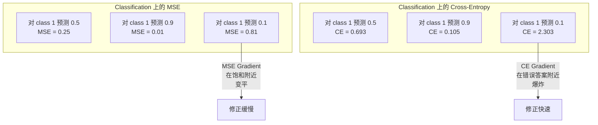
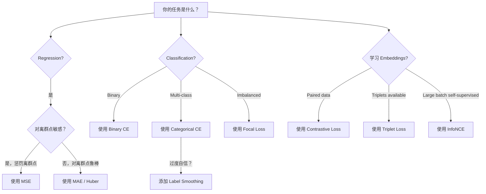
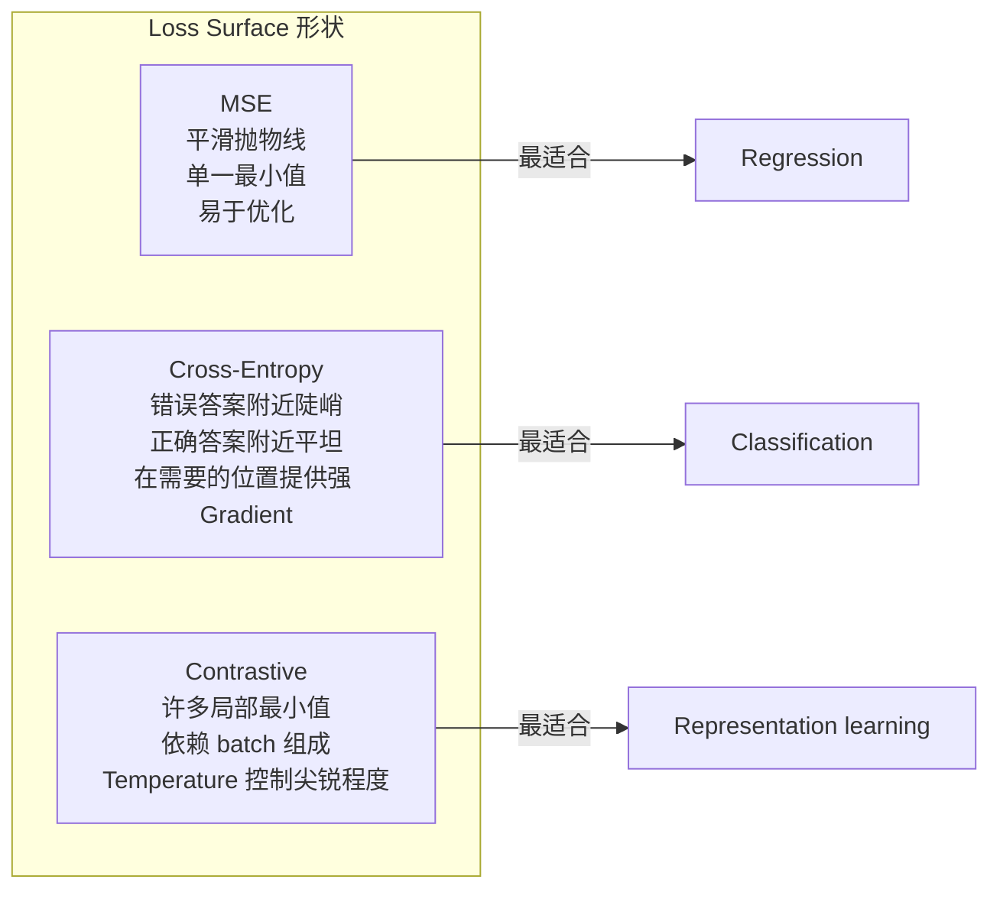

# فقدان الوظائف

> شبكة عصبية الخاصة بك القيام بتنبؤات. الحقيقة الأساسية تُعطى إجابات مختلفة.

**Type:** Build
**Languages:** Python
**Prerequisites:** Lesson 03.04 (Activation Functions)
**Time:** ~75 minutes

## 學习目标

- من التحقق من MSE ‧الاندروبيّة المتقاطعة الثنائية ‧الاندروبيّة المتقاطعة الفئوية و الخسارة المُقارنة (InfoNCE) ، وكذلك درجيّتهم
- من خلال عرض  على جميع النماذج  التنبؤ 0.5 نموذج الفشل، شرح لماذا MSE لا تناسب التصنيف
- سوف تُستخدم تسطيح العلامة التجارية في التشريحات، وتصف كيفية منع التنبؤات المفرطة بالثقة
- للعودة إلى الوراء ‧ التصنيف الثنائي ‧ التصنيف متعدد الفئات 和 إضافة 學習任务选择正确的损失函数

## 问题

في الصفحة  على الحد الأدنى من النموذج من MSE، سوف تكون واثقة جدا من كل شيء توقع 0.5 ⋅ انها حقا في الحد الأدنى من الخسائر ولكن انها أيضا غير مفيدة تماما.

وظيفة الخسارة هي العامل الوحيد الذي يُحسن النموذج فعلياً. ليس الدقة. ليس نتيجة F1. ليس أي مقياس من المدير. سوف يأخذ المحفز درجة وظيفة الخسارة، ويصلح الوزن لجعلها تتغير صغيرة. إذا لم يتمكن وظيفة الخسارة من التقاط ما يهمك حقاً، فإن النموذج سيجد أقل طريقة رياضية لتلبية ذلك، ولكن هذه الطريقة ليست دائماً ما تريد.

هنا هناك مثال محدد. لديك تصنيف ثنائي 任务. 两个类别,50/50 分布. 您使用MSE 作为 Loss. 模型对每输入都预测 0.5  متوسط MSE 是 0.25,这是最小值可能达到在任何没学到的情况下.  هذا النموذج ليس لديه أي قدرة للتمييز، ولكن من الناحية التقنية يقول أنه قلل من خسارة وظيفةك.  بعد تغيير الصفوف المتقابل، نفس النموذج سيتم إضطرار إلى تحويل التنبؤ إلى 0 أو 1, لأن -  log0.5) = 0.693 هو خسارة سيئة جدا، في حين -  log(0.99) = 0.01 سوف يكافئ الثقة والتصديق الصحيحة.  خيار وظيفة الخسارة، هو التمييز بين النموذج المتعلم والمقاسبة الفاضلة.

في التعلم المراقب الذاتي، أنت حتى لا تملك علامة. الخسارة المُتضاربة تعرّف تماماً إشارة التعلم: ما هي المُتضاربة، ما هي المُختلفة، وكذلك ما يجب أن يكون هناك الكثير من المُستخدمين لتمييزها. الخسارة المُتضاربة تكتب خطأً، ستتقلص إدخالاتك إلى نقطة واحدة. كل إدخال يتم رسمها إلى نفس المتجهة.

## 概念

### متوسط الخطأ التربيعي (MSE)

الاختيار المتبني للعودة. حساب التباين بين القيمة التوقعاتية والقيمة المستهدفة.

```
MSE = (1/n) * sum((y_pred - y_true)^2)
```

لماذا مربع مهم: فإنه سوف يعاقب على النحو الثاني الأخطاء الكبيرة. تكلفة الأخطاء 2 هي 4 مرات من 1 خطأ. تكلفة الأخطاء 10 هي 100 مرة. وهذا يجعل MSE حساسة لمجموعة نقاط الانفصال.

الرقم الحقيقي: إذا كان نموذجك يتنبأ بسعر المنزل، فإن معظم المنازل تتفاوت$10,000，但对一栋豪宅偏差 $200 ألف دولار، سوف تحاول إصلاح تلك العقارة، وربما تسبب ضرر في 99 منزل أخرى

MSE 相对预测值 الجريديانت هي:

```
dMSE/dy_pred = (2/n) * (y_pred - y_true)
```

يرتبط الخطأ الخطأ. يُحصل على خطأ أكبر. هذا هو السمة.

### الخسارة المتقاطعة

وظيفة الخسارة التصنيفية. انها من علم المعلومات -- 衡量预测概率分布与真实分布之间的差异.

**Binary Cross-Entropy (BCE):**

```
BCE = -(y * log(p) + (1 - y) * log(1 - p))
```

من بينها y هو العلامات الحقيقية ((0 أو 1),p هو احتمال التوقعات

لماذا -log(p) 有效: عندما يكون العلامة الحقيقية 1 且你预测 p = 0.99 时,Loss 是 -log(0.99) = 0.01。 عندما تكون قد توقع p = 0.01 时,Loss 是 -log(0.01) = 4.6。 هذا الاختلاف 460 倍 هو التقاطع الانتروبي 有效的原因──

الدرجة التالية هي نفس القصة:

```
dBCE/dp = -(y/p) + (1-y)/(1-p)
```

عندما ي = 1 و p 接近零时,الجريديينت هو -1/p, سوف تتجه نحو السلبية لا نهاية لها.

**Categorical Cross-Entropy:**

يستخدم تصنيف متعدد الفئات لتحديد الهدف الموحد

```
CCE = -sum(y_i * log(p_i))
```

只有 الفئة الحقيقية سوف تساهم في الخسارة(لأن جميع الفئات الأخرى y_i 都是零)  إذا كان هناك 10 فئات، فإن احتمال حصول الفئة الصحيحة هو 0.1   تخمينات، الخسارة هو -log  0.1) = 2.3  إذا كان احتمال حصول الفئة الصحيحة هو 0.9, الخسارة هو -log  0.9) = 0.105 

### لماذا لا يتناسب MSE مع التصنيف



عندما يتجه التوقعات إلى 0 أو 1 时، يتغير درجة الميزان في الميزان المختلف، حيث أن درجة التجاوزات المتقاطعة في الميزان الميزانية تعويض هذه النقطة -- - - - - .

### التسمية التسمية

                                                                                                                                                                                                                                                              

```
smooth_label = (1 - alpha) * one_hot + alpha / num_classes
```

عندما ألفا = 0.1 且有 10 个类别时: الغاية لم تعد [0, 0, 1, 0, ...] ، بل [0.01, 0.01, 0.91, 0.01,...]── الغاية من النموذج هي 0.91, وليس 1.0──

لماذا هذا فعال: محاولة من خلال softmax 输出精确 1.0 النموذج، تحتاج إلى وضع اللوجيت 推向无穷── هذا يؤدي إلى ثقة مفرطة، وتضرر من القدرة على التعميم، وتجعل النموذج على التوزيع المتحرك يصبح ضعيف── سجل تسهيل 会把目标限制在0.9( عندما ألفا=0.1 时), جعل اللوجيت 保持在合理范围内── GPT 和大多数现代模型都使用标签滑滑或其等价格形式──

### الخسارة المقابلة

لا يوجد علامة. لا يوجد فئة. فقط إدخال على و سؤال: هل تشبهون أم تختلفون؟

**SimCLR-style contrastive loss (NT-Xent / InfoNCE):**

取一张图像──创建它的两个增强视图 收获,旋转,颜色 jitter)──它们是正对 -它们应该有相似的嵌入式──它们在批量中的每张其他图像都会形成一个负对 -它们应该有不同的嵌入式──

```
L = -log(exp(sim(z_i, z_j) / tau) / sum(exp(sim(z_i, z_k) / tau)))
```

من بينها sim() هو التشابه الكويسيني,z_i 和 z_j هي زوج إيجابي,求和覆盖所有 السلبيات,tau (الدرجة الحرارة) 控制分布的尖程度──更低的温度 = 更难的负面 = 更激进的分离──

رقم حقيقي: حجم المجموعة 256 يعني كل زوج إيجابي هناك 255 ٪ سلبي.

**Triplet Loss:**

接收三个输入:مركز إيجابي 同一类别) 负面 不同类别) 

```
L = max(0, d(anchor, positive) - d(anchor, negative) + margin)
```

الحد الأدنى للفترة المحددة هو: (المرحلة الإيجابية والسلبية) ، والتي تعود إلى 0.2-1.0) ، والتي تسمح بتقديم التدريبات بشكل أكثر كفاءة، ولكن تحتاج إلى استخراج ثلاثي ثنائي محتاط.

### فقدان التركيز

تستخدم في مجموعة بيانات غير متوازنة. المعايير المتقاطعة الاندروبيات تتعامل مع كل النماذج الصحيحة. الخسارة المركزية سوف تقلل من وزن الأمثلة السهلة:

```
FL = -alpha * (1 - p_t)^gamma * log(p_t)
```

ومن بينها p_t هو حقيقي类别的预测概率,غاما 控制聚焦程度──当 gamma = 0 时,这就是标准交叉热量──当 gamma = 2(默认值) 当:

- مثال سهل (p_t = 0.9): الوزن = (0.1)^2 = 0.01──基本被忽略──
- مثال صعب (p_t = 0.1): الوزن = (0.9) ^2 = 0.81──完整的渐变信号──

فقدان التركيز الذي طرحه لين وغيره ، للكشف عن الكائنات ، 99٪ من المناطق المرشحة هي خلفية ((سريء السلبي)  عندما لا يكون هناك فقدان التركيز  عندما تكون هناك فقدان التركيز ، فإن النموذج يغرق في أمثلة خلفية سهلة ، فلن يتعلم أبداً الاختبار من الأشياء.

### وظيفة الخسارة 决策树



### فقدان المشهد




```figure
cross-entropy-loss
```

## بناءها

### الخطوة الأولى: MSE  و Gradient

```python
def mse(predictions, targets):
    n = len(predictions)
    total = 0.0
    for p, t in zip(predictions, targets):
        total += (p - t) ** 2
    return total / n

def mse_gradient(predictions, targets):
    n = len(predictions)
    grads = []
    for p, t in zip(predictions, targets):
        grads.append(2.0 * (p - t) / n)
    return grads
```

### 步骤 2: إنتروبيا ثنائية

لو كانت النموذج على مثال إيجابي 精确预测 0,log(0) = 负无穷──剪剪可以防止这一点──

```python
import math

def binary_cross_entropy(predictions, targets, eps=1e-15):
    n = len(predictions)
    total = 0.0
    for p, t in zip(predictions, targets):
        p_clipped = max(eps, min(1 - eps, p))
        total += -(t * math.log(p_clipped) + (1 - t) * math.log(1 - p_clipped))
    return total / n

def bce_gradient(predictions, targets, eps=1e-15):
    grads = []
    for p, t in zip(predictions, targets):
        p_clipped = max(eps, min(1 - eps, p))
        grads.append(-(t / p_clipped) + (1 - t) / (1 - p_clipped))
    return grads
```

### الخطوة 3: 带 Softmax 的 تصنيفية التقاطع

سوف تقوم Softmax بتحويل المعلومات الأصلية إلى احتمالية، ثم نقوم بحساب الانتروبيا المتقاطعة

```python
def softmax(logits):
    max_val = max(logits)
    exps = [math.exp(x - max_val) for x in logits]
    total = sum(exps)
    return [e / total for e in exps]

def categorical_cross_entropy(logits, target_index, eps=1e-15):
    probs = softmax(logits)
    p = max(eps, probs[target_index])
    return -math.log(p)

def cce_gradient(logits, target_index):
    probs = softmax(logits)
    grads = list(probs)
    grads[target_index] -= 1.0
    return grads
```

التخفيف + التخفيف المتقاطع: بالنسبة للطبقات الحقيقية، فإنه مجرد ((التخفيف المحتمل - 1) ، بالنسبة لجميع الطبقات الأخرى، فإنه مجرد ((التخفيف المحتمل) ‒ هذا التخفيف المحتمل ليس من الصدفة -- هذا هو السبب في استخدام التخفيف ومع التخفيف المتقاطع.

### الخطوة 4: تسطيع اللوحة

```python
def label_smoothed_cce(logits, target_index, num_classes, alpha=0.1, eps=1e-15):
    probs = softmax(logits)
    loss = 0.0
    for i in range(num_classes):
        if i == target_index:
            smooth_target = 1.0 - alpha + alpha / num_classes
        else:
            smooth_target = alpha / num_classes
        p = max(eps, probs[i])
        loss += -smooth_target * math.log(p)
    return loss
```

### الخطوة 5: الخسارة المقابلة

```python
def cosine_similarity(a, b):
    dot = sum(x * y for x, y in zip(a, b))
    norm_a = math.sqrt(sum(x * x for x in a))
    norm_b = math.sqrt(sum(x * x for x in b))
    if norm_a < 1e-10 or norm_b < 1e-10:
        return 0.0
    return dot / (norm_a * norm_b)

def contrastive_loss(anchor, positive, negatives, temperature=0.07):
    sim_pos = cosine_similarity(anchor, positive) / temperature
    sim_negs = [cosine_similarity(anchor, neg) / temperature for neg in negatives]

    max_sim = max(sim_pos, max(sim_negs)) if sim_negs else sim_pos
    exp_pos = math.exp(sim_pos - max_sim)
    exp_negs = [math.exp(s - max_sim) for s in sim_negs]
    total_exp = exp_pos + sum(exp_negs)

    return -math.log(max(1e-15, exp_pos / total_exp))
```

### الخطوة 6: التصنيف أعلى من MSE مقابل التقاطع

استخدام نوعين من وظيفة الخسارة  تدريب الدروس 04 中中同一个神经网络(حلقة بيانات مجموعة) ―― مشاهدة الانتروبيا المتقاطعة 收得更快──

```python
import random

def sigmoid(x):
    x = max(-500, min(500, x))
    return 1.0 / (1.0 + math.exp(-x))

def make_circle_data(n=200, seed=42):
    random.seed(seed)
    data = []
    for _ in range(n):
        x = random.uniform(-2, 2)
        y = random.uniform(-2, 2)
        label = 1.0 if x * x + y * y < 1.5 else 0.0
        data.append(([x, y], label))
    return data


class LossComparisonNetwork:
    def __init__(self, loss_type="bce", hidden_size=8, lr=0.1):
        random.seed(0)
        self.loss_type = loss_type
        self.lr = lr
        self.hidden_size = hidden_size

        self.w1 = [[random.gauss(0, 0.5) for _ in range(2)] for _ in range(hidden_size)]
        self.b1 = [0.0] * hidden_size
        self.w2 = [random.gauss(0, 0.5) for _ in range(hidden_size)]
        self.b2 = 0.0

    def forward(self, x):
        self.x = x
        self.z1 = []
        self.h = []
        for i in range(self.hidden_size):
            z = self.w1[i][0] * x[0] + self.w1[i][1] * x[1] + self.b1[i]
            self.z1.append(z)
            self.h.append(max(0.0, z))

        self.z2 = sum(self.w2[i] * self.h[i] for i in range(self.hidden_size)) + self.b2
        self.out = sigmoid(self.z2)
        return self.out

    def backward(self, target):
        if self.loss_type == "mse":
            d_loss = 2.0 * (self.out - target)
        else:
            eps = 1e-15
            p = max(eps, min(1 - eps, self.out))
            d_loss = -(target / p) + (1 - target) / (1 - p)

        d_sigmoid = self.out * (1 - self.out)
        d_out = d_loss * d_sigmoid

        for i in range(self.hidden_size):
            d_relu = 1.0 if self.z1[i] > 0 else 0.0
            d_h = d_out * self.w2[i] * d_relu
            self.w2[i] -= self.lr * d_out * self.h[i]
            for j in range(2):
                self.w1[i][j] -= self.lr * d_h * self.x[j]
            self.b1[i] -= self.lr * d_h
        self.b2 -= self.lr * d_out

    def compute_loss(self, pred, target):
        if self.loss_type == "mse":
            return (pred - target) ** 2
        else:
            eps = 1e-15
            p = max(eps, min(1 - eps, pred))
            return -(target * math.log(p) + (1 - target) * math.log(1 - p))

    def train(self, data, epochs=200):
        losses = []
        for epoch in range(epochs):
            total_loss = 0.0
            correct = 0
            for x, y in data:
                pred = self.forward(x)
                self.backward(y)
                total_loss += self.compute_loss(pred, y)
                if (pred >= 0.5) == (y >= 0.5):
                    correct += 1
            avg_loss = total_loss / len(data)
            accuracy = correct / len(data) * 100
            losses.append((avg_loss, accuracy))
            if epoch % 50 == 0 or epoch == epochs - 1:
                print(f"    Epoch {epoch:3d}: loss={avg_loss:.4f}, accuracy={accuracy:.1f}%")
        return losses
```

## استخدمها

قام PyTorch بتقديم جميع وظائف الخسارة المعيارية، ووضع في الوضع الثابتة العددية:

```python
import torch
import torch.nn as nn
import torch.nn.functional as F

predictions = torch.tensor([0.9, 0.1, 0.7], requires_grad=True)
targets = torch.tensor([1.0, 0.0, 1.0])

mse_loss = F.mse_loss(predictions, targets)
bce_loss = F.binary_cross_entropy(predictions, targets)

logits = torch.randn(4, 10)
labels = torch.tensor([3, 7, 1, 9])
ce_loss = F.cross_entropy(logits, labels)
ce_smooth = F.cross_entropy(logits, labels, label_smoothing=0.1)
```

استخدام `F.cross_entropy`(بدلاً من`F.nll_loss`加手动软max) ―― سوف تسجل-softmax 和 سلبية سجل احتمالية 合并 إلى عملية ثابتة عددية.

بالنسبة للتعلم المقابل، معظم الفريقات تستخدم تعريف الذاتية لتحقيقها، أو استخدامها`lightly`.`pytorch-metric-learning`مثل هذا الكتب. الدورة الأساسية دائما نفسها: الحسابات إلى التشابه، على أساس الإيجابيات والسلبيات  خلق softmax، ثم Backpropagation.

## 交付 it

本课会产出:
- `outputs/prompt-loss-function-selector.md`-- إرسال مستمر، لتحديد وظيفة الخسارة الصحيحة
- `outputs/prompt-loss-debugger.md`-- إشارة تشخيصية، ليتم التعامل مع الخسارة --

## التدريب

1. 实现 هوبر الخسارة(سريحة فقدان L1) ، فإنه على خطأ صغير باستخدام MSE، على خطأ كبير باستخدام MAE。 تدريب شبكة عصبية رجعة 来预测 y = sin(x) ، و 5% 训练目标被加入随机噪声(离群点) حال مقارنة MSE مع هوبر。 مقارنة اختتامية اختبار خطأ。

2. إضافة إلى التصنيف الثنائي  تدريب الدورات  خلق مجموعة بيانات غير متوازنة ٪ 90 درجة 0.10% درجة 1)  مقارنة معايير BCE مع فقدان التركيز (غاما = 2) في 200 دورة  بعد ذلك على الرد من اقسام قليلة 

3. 实现带带半硬负矿的三重损失──为 5 个类别生成 2D Embedding 数据──对每一个,找到仍然比积极更远的最硬负面(半硬)──将收情况与随机三重选择进行比较──

4. 运行 MSE مقابل الانتروبيا المتقاطعة مقابل، ولكن خلال التدريبات تتبع كل طبقة من الكبيرة الدرجة.

5. 实现 KL divergence loss,并验证当真实分布是单热时,最小化 KL(صحيح الموقع المتنبأ) سوف يعطي مع الصليب الانتروبية 相同的 Gradient──然后尝试软目标(如蒸留 المعرفة) ، منها真实分布来自教师模型的软max 输出──

## 关键术语

| Term | 人们常说的说法 | 它实际意味着什么 |
|------|----------------|----------------------|
| Loss function | “模型错得有多离谱” | 一个可微函数，将预测和目标映射到 Optimizer 要最小化的标量 |
| MSE | “平均平方误差” | 预测和目标之间平方差的均值；以二次方式惩罚大误差 |
| Cross-entropy | “Classification 的 Loss” | 使用 -log(p) 衡量预测概率分布和真实分布之间的差异 |
| Binary cross-entropy | “BCE” | 两个类别的 cross-entropy：-(y*log(p) + (1-y)*log(1-p)) |
| Label smoothing | “软化目标” | 用软值（例如 0.1/0.9）替换硬 0/1 目标，以防止过度自信并提升泛化能力 |
| Contrastive loss | “拉近，推远” | 一种通过让相似对在 Embedding 空间中更近、非相似对更远来学习表示的 Loss |
| InfoNCE | “CLIP/SimCLR Loss” | 对相似度分数进行 normalized temperature-scaled cross-entropy；将 contrastive learning 视为 Classification |
| Focal loss | “不平衡数据修复方案” | 用 (1-p_t)^gamma 加权的 cross-entropy，用于降低 easy examples 的权重并聚焦 hard examples |
| Triplet loss | “Anchor-positive-negative” | 在 Embedding 空间中，使 anchor 比 negative 至少按一个 margin 更接近 positive |
| Temperature | “尖锐度旋钮” | 作用在 logits/相似度上的标量除数，用于控制结果分布的峰值程度；越低越尖锐 |

## 延伸阅读

- لين وغيره، "الخسارة المركزية لاكتشاف الكائنات الكثيفة" (2017) -- 引入焦失,用于处理对象检测 中的极端类别不平衡(RetinaNet)
- تشين وغيرهم، "إطار بسيط للتعلم المضاد للتمثيلات المرئية" (SimCLR، 2020) -- استخدام NT-Xent الخسارة 定义了现代 contrastive learning 流程
- سيزجيدي وغيرهم، "إعادة التفكير في معمارة البداية" (2016) -- 引入标签 smoothing 作为正则化技术,如今已成为多数大模型的标准做法
- هينتون وغيره، "مقطوعة المعرفة في شبكة عصبية" (2015) -- باستخدام أهداف ناعمة و KL الاختلاف من عملية تحلية المعرفة،
