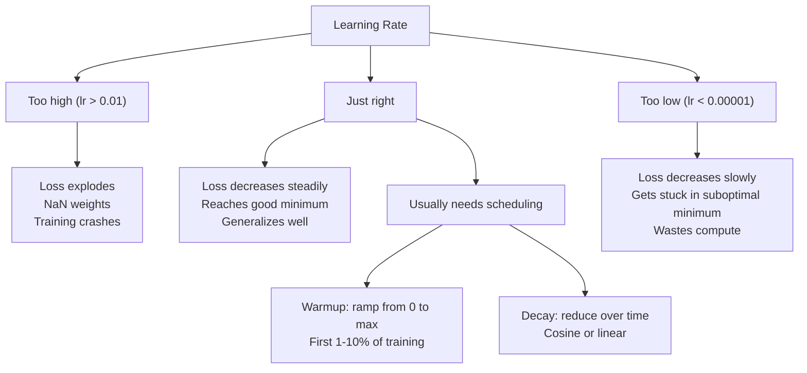
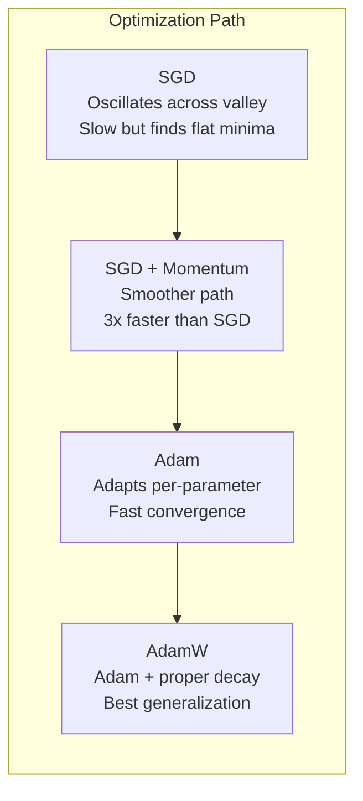
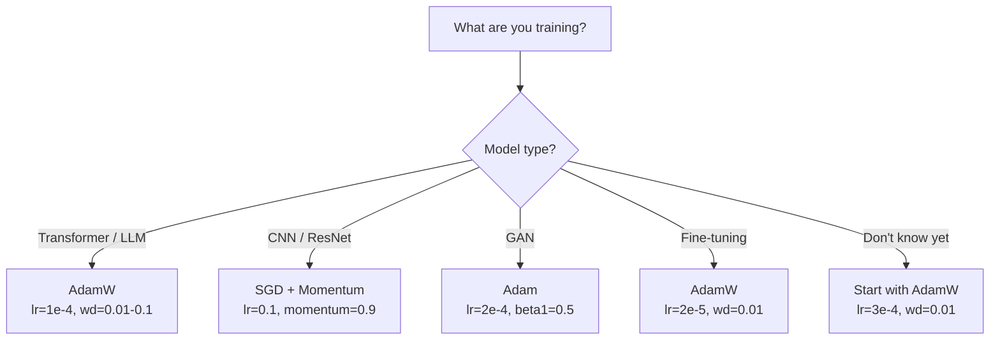

# المُحسنات

> التراجع التدريجي يخبرك بأي اتجاه يجب أن تتحرك. لا يوضح كيفية السير بعيداً، ولا يوضح كيفية السير بسرعة.

**Type:** Build
**Languages:** Python
**Prerequisites:** Lesson 03.05 (Loss Functions)
**Time:** ~75 minutes

## 學习目标

- باستخدام Python من الصفر لتحقيق SGD 带 momentum من SGD  Adami 和 AdamW Optimizers
-  شرح تعديل التحيز آدم  كيفية تعويض التدريب المبكر في الخطوات الاولى من الصفر تقديرات اللحظة
- أظهر لماذا في نفس المهمة، آدمW أكثر من إعادة تنظيم L2 آدم لديه قدرة أفضل على التعميم
- للمتحولات،CNNs،GANs و التنسيق الدقيق

## 问题

أنت قمت بحساب الدرجة. هل تعلم # 4,721 الوزن يجب أن تقلل 0.003 لتقليل الخسارة. ولكن 0.003 الوحدة هي ما؟ على ماذا تقليص؟ الخطوة الأولى والخطوة ال1000 يجب أن تحرك نفس الكمية؟

نسبة الفانيلا التنحدر في كل خطوة على كل معايير  تطبيق نفس معدل التعلم: w = w - lr * نسبة التنحدر.

أولا، التزاوج.والتزاوج الخسارة  نادرًا ما يشبه وعاء مسطح.وهي تبدو أكثر مثل وادي طويل وصغير.والتزاوج يُجهز نحو طريق وادي.والتزاوج يُجهز نحو طريق وادي.والتزاوج يُجهز إلى طريق وادي.والتزاوج يُجهز إلى جانب وراء وراء وراء وراء وراء وراء وراء وراء وراء وراء وراء وراء وراء وراء وراء وراء وراء وراء وراء وراء وراء وراء وراء وراء وراء وراء وراء وراء وراء وراء وراء وراء وراء وراء وراء وراء وراء وراء وراء وراء وراء وراء وراء وراء وراء وراء وراء وراء وراء وراء وراء وراء وراء وراء وراء وراء وراء وراء وراء وراء وراء وراء وراء وراء وراء وراء وراء وراء وراء وراء وراء وراء وراء وراء وراء وراء وراء وراء وراء وراء وراء وراء وراء وراء وراء وراء وراء وراء وراء وراء وراء وراء وراء وراء وراء وراء وراء وراء وراء وراء وراء وراء وراء وراء وراء وراء وراء وراء وراء وراء وراء وراء وراء وراء وراء وراء وراء وراء وراء وراء وراء وراء وراء وراء وراء وراء وراء وراء وراء وراء وراء وراء وراء وراء وراء وراء وراء وراء وراء وراء وراء وراء وراء وراء وراء وراء وراء وراء وراء وراء وراء وراء وراء وراء وراء وراء وراء وراء وراء وراء وراء وراء وراء وراء وراء وراء وراء وراء وراء وراء وراء وراء وراء وراء وراء وراء وراء وراء وراء وراء وراء وراء وراء وراء.

ثانيا، لاستخدام نفس معدل التعلم على جميع المعايير خطأ. بعض الوزنات تحتاج إلى تحديث كبير.

وثالث، نقاط السرير. في الفضاء العالي، هناك منطقة مسطحة كبيرة من المشهد الخسارة، حيث يرتفع الجريديانت  بالقرب من صفر.

آدم  حل هذه المشاكل الثلاثة. انه يحافظ على متوسطين متجاريين لكل معايير -- متوسط التنحدرات، والحركة، ومعالجة الزوال) و متوسط التنحدرات المربعة ((متعدد التكيف، ومعالجة مختلف القياسات) ، وإعادة التواصل مع التصحيح التحديي قبل الخطوات القليلة، فإنه يوفر استخدام مفاتيح الاحترافية القياسية لتعامل مع 80% من المشاكل.

## 概念

### التراجع المتدريج (SGD)

أسهل تحسينات. في المجموعة الصغيرة 上 حساب درجيينت,并朝相反方向前进一步.

```
w = w - lr * gradient
```

استوكاستيك  يظهر أنك تستخدم بيانات من مجموعة صغيرة من المعلومات لتقييم درجات، بدلاً من استخدام مجموعة بيانات كاملة  هذا الضجيج مفيد في الواقع - يساعد على الهروب من الحد الأدنى المحلي الرئيسي  ولكن الضجيج يؤدي أيضاً إلى التذبذب 

معدل التعلم هو المميز.  ارتفاعاً جداً: فقدان الانتشار.  انخفاضاً جداً: يستغرق التدريب وقتًا طويلاً.  تعتمد القيمة المثلى على الهندسة المعمارية والبيانات والحجم المكون، فضلاً عن المرحلة الحالية للتدريب.  بالنسبة للشبكات الحديثة، فإن نطاق التعلم النموذجي للشبكات العليا هو 0.01 إلى 0.1  ولكن حتى خلال عملية التدريب، يتغير معدل التعلم المثالي أيضًا.

### الزخم

يتم استخدام نوع من التسلسلات الكبيرة كثيراً، ولكنّها دقيقة. لا يمكنك فقط أن تحكم على الدرجة الأولى، بل تحافظ على السرعة، لتجمع الدرجات السابقة.

```
m_t = beta * m_{t-1} + gradient
w = w - lr * m_t
```

في بيتا (معظمها 0.9) تحكم الحفاظ على الكثير من المعلومات التاريخية. عندما تكون بيتا = 0.9 时,momentum 大致等于最近 10 个梯次的平均值.

لماذا يمكن أن يعاد التذبذب: يُشير إلى نفس الاتجاه سيتراكم الجراديانز. الاتجاهات المتكررة. سيتم تعويض الجراديانز. في ذلك الشريط الضيق في الوادي، سيتغير كل خطوة ويتقلل الحجم.

الرقم الحقيقي: في ظروف سيئة جداً من المشهد الخسارة، قد تحتاج SGD بمفردها إلى 10،000 قدم.

### RMSProp

أول طريقة فعالة حقاً في معدل التعلم التكيفي لكل معايير ◊ بواسطة هينتون في كورسرا  درجة

```
s_t = beta * s_{t-1} + (1 - beta) * gradient^2
w = w - lr * gradient / (sqrt(s_t) + epsilon)
```

s_t 跟踪平方梯度的运行平均――持续拥有较大的梯度的参数会除以较大的数量 (较小的有效学习率) ――梯度较小的参数会除以较小的数量 (较大的有效学习率) ――

هذا حل كل المعلمات باستخدام نفس معدل التعلم. مشكلة. واحد قد حصل على وزن كبير مستمر. ربما يقترب من الهدف.

عادةً ما يكون الـ 1e-8) في مُعيار ما لم يتم تحديثه حتى الآن.

### آدم: الزخم + RMSProp

آدم 结合了两种思想──它为每个参数 维护两个指数动平均:

```
m_t = beta1 * m_{t-1} + (1 - beta1) * gradient        (first moment: mean)
v_t = beta2 * v_{t-1} + (1 - beta2) * gradient^2       (second moment: variance)
```

**Bias correction**هو معظم التفسيرات سوف تتخطى ∙ ∙ ∙ ∙ ∙ ∙ ∙ ∙ ∙ ∙ ∙ ∙ ∙ ∙ ∙ ∙ ∙ ∙ ∙ ∙ ∙ ∙ ∙ ∙ ∙ ∙ ∙ ∙ ∙ ∙ ∙ ∙ ∙ ∙ ∙ ∙ ∙ ∙ ∙ ∙ ∙ ∙ ∙ ∙ ∙ ∙ ∙ ∙ ∙ ∙ ∙ ∙ ∙ ∙ ∙ ∙ ∙ ∙ ∙ ∙ ∙ ∙ ∙ ∙ ∙ ∙ ∙ ∙ ∙ ∙ ∙ ∙ ∙ ∙ ∙ ∙ ∙ ∙ ∙ ∙ ∙ ∙ ∙ ∙ ∙ ∙ ∙ ∙ ∙ ∙ ∙ ∙ ∙ ∙ ∙ ∙ ∙ ∙ ∙ ∙ ∙ ∙ ∙ ∙ ∙ ∙ ∙ ∙ ∙ ∙ ∙ ∙ ∙ ∙ ∙ ∙ ∙ ∙ ∙ ∙ ∙ ∙ ∙ ∙ ∙ ∙ ∙ ∙ ∙ ∙ ∙ ∙ ∙ ∙ ∙ ∙ ∙ ∙ ∙ ∙ ∙ ∙ ∙ ∙ ∙ ∙ ∙ ∙ ∙ ∙ ∙ ∙ ∙ ∙ ∙ ∙ ∙ ∙ ∙ ∙ ∙ ∙ ∙ ∙ ∙ ∙ ∙ ∙ ∙ ∙ ∙ ∙ ∙ ∙ ∙ ∙ ∙ ∙ ∙ ∙ ∙ ∙ ∙ ∙ ∙ ∙ ∙ ∙ ∙ ∙ ∙ ∙ ∙ ∙ ∙ ∙ ∙ ∙ ∙ ∙ ∙ ∙ ∙ ∙ ∙ ∙ ∙ ∙ ∙ ∙ ∙ ∙ ∙ ∙ ∙ ∙ ∙ ∙ ∙ ∙ ∙ ∙ ∙ ∙ ∙  ∙ ∙ ∙ ∙ ∙ ∙ ∙ ∙ ∙   ∙ ∙ ∙ ∙ ∙ ∙  ∙ ∙           

```
m_hat = m_t / (1 - beta1^t)
v_hat = v_t / (1 - beta2^t)
```

第 1 步且beta1 = 0.9 时:m_hat = m_1 / (1 - 0.9) = m_1 / 0.1 = 实际 Gradient。第 100 步时:(1 - 0.9^100) 约等于 1.0,因此 تصحيح 消失── تصحيح التحيز على قبل ~10 步非常重要, بعد ~50 步基本无关紧要──

更新公式:

```
w = w - lr * m_hat / (sqrt(v_hat) + epsilon)
```

آدم 默认值:lr = 0.001,beta1 = 0.9,beta2 = 0.999,epsilon = 1e-8。 هذه القيم الم默认 تطبق على 80% من المشاكل── عندما لا تطبق، أولاً تغيير lr── ثم تغيير beta2── تقريباً لا تغير beta1 أو epsilon──

### (أدام و) ، صحيح معالجة فقدان الوزن

في المادة الثانية من التنظيم، يتم إضافة اللمبدا * w^2── في المادة الثانية من الفانيليا، وهذا يساوي انخفاض الوزن.

رؤى لوششيلوف وهاتر: عندما تضع L2 في الخسارة، ثم تسمح لأدم  التعامل مع درجة 时، معدل التعلم التكيفي أيضا سوف تقلص من المدى التنظيم.

آدم و                                                                                                                                                                                                                                                                                                                                                                                                                                                                                                                            

```
w = w - lr * m_hat / (sqrt(v_hat) + epsilon) - lr * lambda * w
```

لم يتم تغيير العامل التكيفي لـ آدم 缩放── كل معايير تم الحصول على نفس النسبة من التقلص──

هذا يبدو مثل جزء صغير. ليس. في جميع المهام تقريبا في كل من أدناه كل من أدناه من أدم + L2 التنظيم 收到更好的解. هو PyTorch في استخدام تدريب المحولات والتوزيع نماذج ومعظم الهندسة المعمارية الحديثة المتبنية المثبتة.

### معدل التعلم: أهم معدل فائق



إذا قمت بتحديد معايير فائقة واحدة فقط، فإن ذلك يتعلق بتحديد معدل التعلم.

- SGD: lr = 0.01 إلى 0.1
- آدم/آدمW: lr = 1e-4 إلى 3e-4
- النماذج المُدربة مسبقاً للتحقيق: lr = 1e-5 إلى 5e-5
- دراسة معدل الاحتباس الحراري: في 1-10% من الخطوات السابقة

### تحسين مقارنة



### كل نوع من التحسينات




```figure
optimizer-trajectory
```

## بناءها

### الخطوة الأولى: SGD الفانيليا

```python
class SGD:
    def __init__(self, lr=0.01):
        self.lr = lr

    def step(self, params, grads):
        for i in range(len(params)):
            params[i] -= self.lr * grads[i]
```

### الخطوة الثانية:

```python
class SGDMomentum:
    def __init__(self, lr=0.01, beta=0.9):
        self.lr = lr
        self.beta = beta
        self.velocities = None

    def step(self, params, grads):
        if self.velocities is None:
            self.velocities = [0.0] * len(params)
        for i in range(len(params)):
            self.velocities[i] = self.beta * self.velocities[i] + grads[i]
            params[i] -= self.lr * self.velocities[i]
```

### 步骤 3: آدم

```python
import math

class Adam:
    def __init__(self, lr=0.001, beta1=0.9, beta2=0.999, epsilon=1e-8):
        self.lr = lr
        self.beta1 = beta1
        self.beta2 = beta2
        self.epsilon = epsilon
        self.m = None
        self.v = None
        self.t = 0

    def step(self, params, grads):
        if self.m is None:
            self.m = [0.0] * len(params)
            self.v = [0.0] * len(params)

        self.t += 1

        for i in range(len(params)):
            self.m[i] = self.beta1 * self.m[i] + (1 - self.beta1) * grads[i]
            self.v[i] = self.beta2 * self.v[i] + (1 - self.beta2) * grads[i] ** 2

            m_hat = self.m[i] / (1 - self.beta1 ** self.t)
            v_hat = self.v[i] / (1 - self.beta2 ** self.t)

            params[i] -= self.lr * m_hat / (math.sqrt(v_hat) + self.epsilon)
```

### 步骤 4: آدم

```python
class AdamW:
    def __init__(self, lr=0.001, beta1=0.9, beta2=0.999, epsilon=1e-8, weight_decay=0.01):
        self.lr = lr
        self.beta1 = beta1
        self.beta2 = beta2
        self.epsilon = epsilon
        self.weight_decay = weight_decay
        self.m = None
        self.v = None
        self.t = 0

    def step(self, params, grads):
        if self.m is None:
            self.m = [0.0] * len(params)
            self.v = [0.0] * len(params)

        self.t += 1

        for i in range(len(params)):
            self.m[i] = self.beta1 * self.m[i] + (1 - self.beta1) * grads[i]
            self.v[i] = self.beta2 * self.v[i] + (1 - self.beta2) * grads[i] ** 2

            m_hat = self.m[i] / (1 - self.beta1 ** self.t)
            v_hat = self.v[i] / (1 - self.beta2 ** self.t)

            params[i] -= self.lr * m_hat / (math.sqrt(v_hat) + self.epsilon)
            params[i] -= self.lr * self.weight_decay * params[i]
```

### الخطوة 5: التدريب على

في الدروس 05، على مجموعة بيانات دائرة، باستخدام جميع أربعة من المتحفسينات  التدريب على شبكة ذات مستويين 

```python
import random

def sigmoid(x):
    x = max(-500, min(500, x))
    return 1.0 / (1.0 + math.exp(-x))

def make_circle_data(n=200, seed=42):
    random.seed(seed)
    data = []
    for _ in range(n):
        x = random.uniform(-2, 2)
        y = random.uniform(-2, 2)
        label = 1.0 if x * x + y * y < 1.5 else 0.0
        data.append(([x, y], label))
    return data


class OptimizerTestNetwork:
    def __init__(self, optimizer, hidden_size=8):
        random.seed(0)
        self.hidden_size = hidden_size
        self.optimizer = optimizer

        self.w1 = [[random.gauss(0, 0.5) for _ in range(2)] for _ in range(hidden_size)]
        self.b1 = [0.0] * hidden_size
        self.w2 = [random.gauss(0, 0.5) for _ in range(hidden_size)]
        self.b2 = 0.0

    def get_params(self):
        params = []
        for row in self.w1:
            params.extend(row)
        params.extend(self.b1)
        params.extend(self.w2)
        params.append(self.b2)
        return params

    def set_params(self, params):
        idx = 0
        for i in range(self.hidden_size):
            for j in range(2):
                self.w1[i][j] = params[idx]
                idx += 1
        for i in range(self.hidden_size):
            self.b1[i] = params[idx]
            idx += 1
        for i in range(self.hidden_size):
            self.w2[i] = params[idx]
            idx += 1
        self.b2 = params[idx]

    def forward(self, x):
        self.x = x
        self.z1 = []
        self.h = []
        for i in range(self.hidden_size):
            z = self.w1[i][0] * x[0] + self.w1[i][1] * x[1] + self.b1[i]
            self.z1.append(z)
            self.h.append(max(0.0, z))

        self.z2 = sum(self.w2[i] * self.h[i] for i in range(self.hidden_size)) + self.b2
        self.out = sigmoid(self.z2)
        return self.out

    def compute_grads(self, target):
        eps = 1e-15
        p = max(eps, min(1 - eps, self.out))
        d_loss = -(target / p) + (1 - target) / (1 - p)
        d_sigmoid = self.out * (1 - self.out)
        d_out = d_loss * d_sigmoid

        grads = [0.0] * (self.hidden_size * 2 + self.hidden_size + self.hidden_size + 1)
        idx = 0
        for i in range(self.hidden_size):
            d_relu = 1.0 if self.z1[i] > 0 else 0.0
            d_h = d_out * self.w2[i] * d_relu
            grads[idx] = d_h * self.x[0]
            grads[idx + 1] = d_h * self.x[1]
            idx += 2

        for i in range(self.hidden_size):
            d_relu = 1.0 if self.z1[i] > 0 else 0.0
            grads[idx] = d_out * self.w2[i] * d_relu
            idx += 1

        for i in range(self.hidden_size):
            grads[idx] = d_out * self.h[i]
            idx += 1

        grads[idx] = d_out
        return grads

    def train(self, data, epochs=300):
        losses = []
        for epoch in range(epochs):
            total_loss = 0.0
            correct = 0
            for x, y in data:
                pred = self.forward(x)
                grads = self.compute_grads(y)
                params = self.get_params()
                self.optimizer.step(params, grads)
                self.set_params(params)

                eps = 1e-15
                p = max(eps, min(1 - eps, pred))
                total_loss += -(y * math.log(p) + (1 - y) * math.log(1 - p))
                if (pred >= 0.5) == (y >= 0.5):
                    correct += 1
            avg_loss = total_loss / len(data)
            accuracy = correct / len(data) * 100
            losses.append((avg_loss, accuracy))
            if epoch % 75 == 0 or epoch == epochs - 1:
                print(f"    Epoch {epoch:3d}: loss={avg_loss:.4f}, accuracy={accuracy:.1f}%")
        return losses
```

## استخدمها

معدات PyTorch Optimizers 会处理 المجموعات المعلمات ‧قطع التدريجية وترتيب معدل التعلم:

```python
import torch
import torch.optim as optim

model = torch.nn.Sequential(
    torch.nn.Linear(784, 256),
    torch.nn.ReLU(),
    torch.nn.Linear(256, 10),
)

optimizer = optim.AdamW(model.parameters(), lr=3e-4, weight_decay=0.01)

scheduler = optim.lr_scheduler.CosineAnnealingLR(optimizer, T_max=100)

for epoch in range(100):
    optimizer.zero_grad()
    output = model(torch.randn(32, 784))
    loss = torch.nn.functional.cross_entropy(output, torch.randint(0, 10, (32,)))
    loss.backward()
    torch.nn.utils.clip_grad_norm_(model.parameters(), max_norm=1.0)
    optimizer.step()
    scheduler.step()
```

模式始终是:zero_grad、forward、loss、backward、(clip)、(step、(schedule)。记住这个顺序──弄错它──例如在优化器.step() 之前调用 scheduler.step((是细微 bug 的常见来源──

بالنسبة لسي إن إن، لا يزال العديد من الممارسين يفضلون استخدام SGD بثواني ((lr=0.1،momentum=0.9،weight_decay=1e-4) ،并搭配 step أو cosine schedule。SGD سوف تجد أدنى مستويات أكثر برودة، وهذا عادة ما يكون لديه قدرة أفضل على التعميم。 بالنسبة للمتحولات و LLM، مع ارتفاع درجة الحرارة + التدهور الكوسيني، فإن AdamW هو اختيار متبني عام。 إلا إذا كان هناك سبب لقياس، وإلا لا ينبغي أن يكون هناك توافق على المواجهة。

## 交付 it

本课产出:
- `outputs/prompt-optimizer-selector.md`-- واحد يستخدم للاستعداد الهندسة المعمارية  اختيار صحيح محفز ومعدل التعلم

## التدريب

1. 实现 Nesterov الزخم، من بينها أنت في lookhead 位置(w - lr * beta * v) بدلا من الموقع الحالي حساب درجيент。 في مجموعة بيانات دائرة 上比较它与标准 momentum 的收收情况。

2.  تحقيق جدول التعلم معدل التدفئة: في التدريب 10٪ من الخطوات الأولى من 0 线性 ramp إلى max_lr، ثم التدهور الكويسيني إلى 0  مقارنة آدم + التدفئة مع آدم دون التدفئة  قياسات في مجموعة بيانات دائرية تصل إلى 90٪ دقة  بحاجة إلى عدد العصور 

3. خلال تدريب آدم ‬ تتبع معدل التعلم الفعال لكل مُعايير‬‬‬‬‬‬‬‬‬‬‬‬‬‬‬‬‬‬‬‬‬‬‬‬‬‬‬‬‬‬‬‬‬‬‬‬‬‬‬‬‬‬‬‬‬‬‬‬‬‬‬‬‬‬‬‬‬‬‬‬‬‬‬‬‬‬‬‬‬‬‬‬‬‬‬‬‬‬‬‬‬‬‬‬‬‬‬‬‬‬‬‬‬‬‬‬‬‬‬‬‬‬‬‬‬‬‬‬‬‬‬‬‬‬‬‬‬‬‬‬‬‬‬‬‬‬‬‬‬‬‬‬‬‬‬‬‬‬‬‬‬‬‬‬‬‬‬‬‬‬‬‬‬‬‬‬‬‬‬‬‬‬‬‬‬‬‬‬‬‬‬‬‬‬‬‬‬‬‬‬‬‬‬‬‬‬‬‬‬‬‬‬‬‬‬‬‬‬‬‬‬‬‬‬‬‬‬‬‬‬‬‬‬‬‬‬‬‬‬‬‬‬‬‬‬‬‬‬‬‬‬‬‬‬‬‬‬‬‬‬‬‬‬‬‬‬‬‬‬‬‬‬‬‬‬‬‬‬‬‬‬‬‬‬‬‬‬‬‬‬‬‬‬‬‬‬‬‬‬‬‬‬‬‬‬‬‬‬‬‬‬‬‬‬‬‬‬‬‬‬‬‬‬‬‬‬‬‬‬‬‬‬‬‬‬‬‬‬‬‬‬‬‬‬‬‬‬‬‬‬‬‬‬‬‬‬‬‬‬‬‬‬‬‬‬‬‬‬‬‬‬‬‬‬‬‬‬‬‬‬‬‬‬‬‬‬‬‬‬‬‬‬‬‬‬‬‬‬‬‬‬‬‬‬‬‬‬‬‬‬‬‬‬‬‬‬‬‬‬‬‬‬‬‬‬‬‬‬‬‬‬‬‬‬‬‬‬‬‬‬‬‬‬‬‬‬‬‬‬‬‬‬‬‬‬‬‬‬‬‬‬‬‬‬‬‬‬‬‬‬‬‬‬‬‬‬‬‬‬‬‬‬‬‬‬‬‬‬‬‬‬‬‬‬‬‬‬‬‬‬‬‬‬‬‬‬‬‬‬‬

4. 实现 تراجع تراجع(طبقاً للقاعدة العالمية المحددة) ――将最大梯度 Norm 设置为 1.0──使用较高学习率(Adam 的 lr=0.01)分别在有剪辑和无剪辑的情况下训练──统计 10 种子中,有多少次运行 会发散(Loss 变为 NaN)──

5. في شبكة ذات أوزان كبيرة 上比较 آدم و آدم و.‬ ستقوم بتبداية جميع الأوزان على [-5, 5] من بين أوقات التراجع.‬‬‬‬‬‬‬‬‬‬‬‬‬‬‬‬‬‬‬‬‬‬‬‬‬‬‬‬‬‬‬‬‬‬‬‬‬‬‬‬‬‬‬‬‬‬‬‬‬‬‬‬‬‬‬‬‬‬‬‬‬‬‬‬‬‬‬‬‬‬‬‬‬‬‬‬‬‬‬‬‬‬‬‬‬‬‬‬‬‬‬‬‬‬‬‬‬‬‬‬‬‬‬‬‬‬‬‬‬‬‬‬‬‬‬‬‬‬‬‬‬‬‬‬‬‬‬‬‬‬‬‬‬‬‬‬‬‬‬‬‬‬‬‬‬‬‬‬‬‬‬‬‬‬‬‬‬‬‬‬‬‬‬‬‬‬‬‬‬‬‬‬‬‬‬‬‬‬‬‬‬‬‬‬‬‬‬‬‬‬‬‬‬‬‬‬‬‬‬‬‬‬‬‬‬‬‬‬‬‬‬‬‬‬‬‬‬‬‬‬‬‬‬‬‬‬‬‬‬‬‬‬‬‬‬‬‬‬‬‬‬‬‬‬‬‬‬‬‬‬‬‬‬‬‬‬‬‬‬‬‬‬‬‬‬‬‬‬‬‬‬‬‬‬‬‬‬‬‬‬‬‬‬‬‬‬‬‬‬‬‬‬‬‬‬‬‬‬‬‬‬‬‬‬‬‬‬‬‬‬‬‬‬‬‬‬‬‬‬‬‬‬‬‬‬‬‬‬‬‬‬‬‬‬‬‬‬‬‬‬‬‬‬‬‬‬‬‬‬‬‬‬‬‬‬‬‬‬‬‬‬‬‬‬‬‬‬‬‬‬‬‬‬‬‬‬‬‬‬‬‬‬‬‬‬‬‬‬‬‬‬‬‬‬‬‬‬‬‬‬‬‬‬‬‬‬‬‬‬‬‬‬‬‬‬‬‬‬‬‬‬‬‬‬‬‬‬‬‬‬‬‬‬‬‬‬‬‬‬‬‬‬‬‬‬‬‬‬‬‬‬‬‬‬‬‬‬‬‬‬‬‬‬‬‬‬‬‬‬

## 关键术语

| Term | 人们通常怎么说 | 它实际意味着什么 |
|------|----------------|----------------------|
| Learning rate | “Step size” | Gradient update 上的标量乘数；训练中影响最大的单个 hyperparameter |
| SGD | “Basic gradient descent” | Stochastic Gradient Descent：通过减去 lr * gradient 来更新 weights，Gradient 在 mini-batch 上计算 |
| Momentum | “Rolling ball analogy” | 过去 Gradients 的 exponential moving average；削弱振荡，并加速一致方向 |
| RMSProp | “Adaptive learning rate” | 用近期 Gradients 的 running RMS 除以每个 parameter 的 Gradient；均衡 learning rates |
| Adam | “The default optimizer” | 将 momentum（first moment）和 RMSProp（second moment）结合起来，并对初始 steps 进行 bias correction |
| AdamW | “Adam done right” | 带 decoupled weight decay 的 Adam；直接对 weights 应用 regularization，而不是通过 Gradient |
| Bias correction | “Warmup for running averages” | 除以 (1 - beta^t)，用于补偿 Adam 的 moment estimates 的零初始化 |
| Weight decay | “Shrink the weights” | 每一步减去 weight 值的一部分；一种惩罚大 weights 的 regularizer |
| Learning rate schedule | “Changing lr over time” | 在训练期间调整 learning rate 的函数；warmup + cosine decay 是现代默认方案 |
| Gradient clipping | “Capping the gradient norm” | 当 Gradient Vector 的 norm 超过阈值时对其进行缩放；防止 exploding gradient updates |

## 延伸阅读

- كينغما وبا ، آدام: طريقة للتحسين الاستوكاستي (2014) -- 原始 آدام ورقة ،包含 التقارب تحليل 和 التحيز تصحيح 推导
- لوششيلوف وهاتر، تطبيق التنظيم المرتبط بالتراجع في الوزن (2017) -- ثبت أن تطبيق L2 في آدم مع تراجع الوزن 不等价,并提出 AdamW
- سميث، تطورات التعلم المتكررة للتدريب الشبكات العصبية  (2017) -- تدخيل اختبار مجموعة LR وجدولات دورية، لتقليل الحاجة إلى تعيين معدل التعلم
- رودر، مراجعة عامة لخوارزميات تحسين التراجع التدريجي  (2016) -- 关于所有优化器 变体的最佳单篇综述,比较清晰,直觉解释也明确
