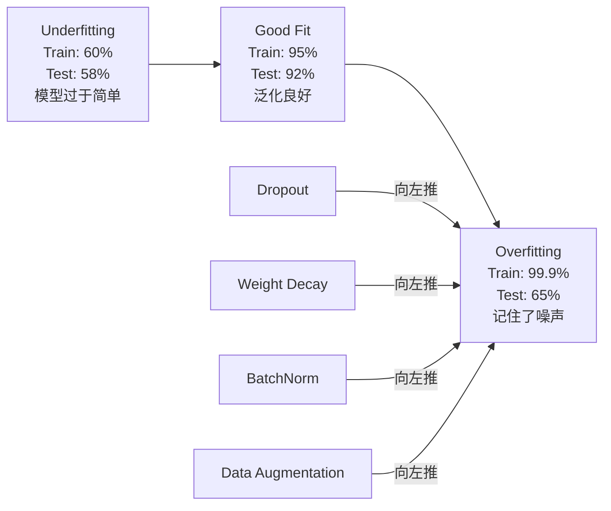
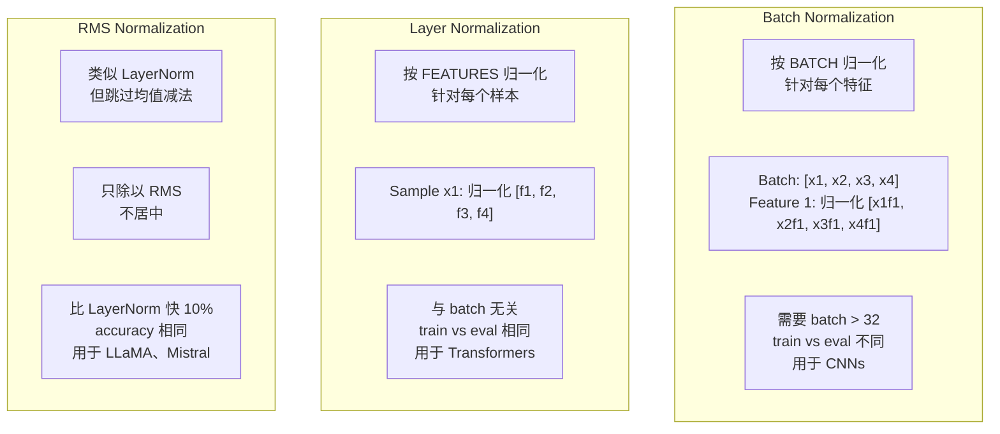
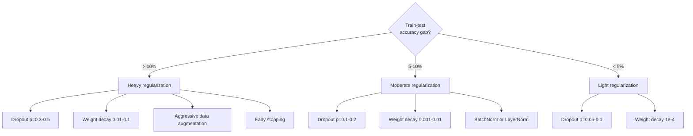

# التنظيم

> نموذجك يصل إلى 99٪ في بيانات التدريب، ولكن فقط 60٪ في بيانات الاختبار.

**Type:** Build
**Languages:** Python
**Prerequisites:** Lesson 03.06 (Optimizers)
**Time:** ~75 minutes

## 學习目标
- من التحقق من التراجع في التوسع مع التراجع التراجع في الوزن L2 التدهور الإطارات التطبيع الطبقة والتطبيع RMSNorm
- قياس الفجوة الدقيقة في اختبار القطار،并 من خلال التنظيم  تجربة التوصية المعدل المفرط
-  شرح لماذا استخدام المحولات الطبقة نورم وليس باتش نورم، وكذلك لماذا الايلم الحديثة أفضل RMS نورم
- وفقا لدرجة المبالغة في التكيف، تطبيق صحيحة التنظيم   技术组合

## 问题
يمكن أن تتذكر شبكة عصبية كبيرة بما فيه الكفاية أي مجموعة من البيانات. هذا ليس افتراضًا  Zhang et al. (2017) 通过  ImageNet                                                                                                                                                                                                                                           

هذه هي المشكلة المفروضة ، والنموذج أكبر ، والمسألة أكثر خطورة. GPT-3 لديها 175 مليار مبرمير.

الفرق بين أداء التدريب وأداء الاختبار هو الفجوة المبالغة في الملاءمة. كل تقنية في هذا الدراسة ستهاجم الفجوة من مختلف الزوايا. التشغيل يضطر الشبكة إلى عدم الاعتماد على أي عصب واحد. التدهور الوزن يمنع أي وزن واحد من أن يصبح كبير جدا. التطبيع على الفجوة التطبيقية. التطبيع على الفجوة الخسارة، مما يجعل من المُحسِّن أن يجد الحد الأدنى أكثر سُطواناً. التطبيع على الطبقة يفعل الشيء نفسه، ولكن يمكن أن يعمل في أماكن التطبيع على الفجوة.

## 概念
### الطيف المتناسب

كل نموذج يقع في مكان ما من غير مناسبة (من أبسط إلى غير قابلة للاستكشاف) إلى أكثر من مناسبة (من المعقدة إلى أكثر من اللازم للاستكشاف من الضجيج)



### التخلي عن العمل

أسهل تقنيات تنظيمية، ولكن هناك تفسيرات أفضل. خلال التدريب، فإن احتمالات إنتاج كل عصبية ستكون صفر.

```
output = activation(z) * mask    where mask[i] ~ Bernoulli(1 - p)
```

عندما p = 0.5 ، كل مرة إلى الأمام تمر مدينة تضع نصف العصب إلى صفر. يجب أن تتعلم الشبكة الإعلانات الزائدة، لأنه لا يمكن التنبؤ بأي العصب المتاحة.

مجموعة  شرح: شبكة واحدة لديها N 个神经元并使用落后的网络会创建2^N 个可能的子网络(所有神经元开关或关联的组合)  استخدام وقف 训练近似于同时训练所有2^N 个子网络,每个都在不同的迷你批量上训练──测试时,你使用所有神经元(无落后),并将输出按 (1 - p) 缩缩,以匹配训练期间的期望值──这等于预测 2^N 个子网络的平均单个模型得到一个巨大的组装──

في الممارسة، يتم تقليص التطبيق خلال التدريب، بدلا من التطبيق خلال التجربة:

```
During training:  output = activation(z) * mask / (1 - p)
During testing:   output = activation(z)   (no change needed)
```

هذا أفضل، لأن كود اختبار تماما لا حاجة إلى معرفة التخلي عن.

默认比例:تحول استخدام p = 0.1,MLPs استخدام p = 0.5,CNNs استخدام p = 0.2-0.3──更高的 dropup = 更强的规范化 = 更高的不适应风险──

### انخفاض الوزن (تعديل L2)

ستضيف الممتلكات إلى خسارة:

```
total_loss = task_loss + (lambda / 2) * sum(w_i^2)
```

إن درجة التنظيم هي lambda * w. وهذا يعني أنه في كل خطوة، سيتم تقليص كل وزن حسب حجم النسبة المئوية إلى الصفر.

لماذا يساعد هذا على التوسيع: النموذج المفرط في الغالب لديه وزنه أكبر ، وسوف يزيد من الضجيج في بيانات التدريب.

المعلم المضاد للامبدا 控制强度──النموذجية:

- المتحول 上的 AdamW استخدام 0.01
- سي أن إيه أعلى من SGD استخدام 1e-4
- 严重 overfit 的模型使用 0.1

如 درسي 06 所讨论:انحدار الوزن 和 L2 تنظيم في SGD 中等价, ولكن في آدم 中不等价.

### التطبيع في الحزمة

قبل نقل كل طبقة من المخرجات إلى الطبقة التالية، أولاً على الارتباط الصغير

لبعض الطائفة من التفعيلات:

```
mu = (1/B) * sum(x_i)           (batch mean)
sigma^2 = (1/B) * sum((x_i - mu)^2)   (batch variance)
x_hat = (x_i - mu) / sqrt(sigma^2 + eps)   (normalize)
y = gamma * x_hat + beta        (scale and shift)
```

غاما وبيتا هي العناصر التي يمكن تعلمها، فيمكن للشبكة في أفضل الأحوال إلغاء هذا التطبيع. بدونها، ستضطر كل مستوى من المخرجات إلى صفر متوسط  فرق في الفئة، وهذا ليس بالضرورة ما تريد الشبكة.

**Training vs inference split:**خلال فترة التدريب، mu 和 sigma من الحالي المجموعة الصغيرة. في فترة التدريب، تم استخدام المتوسطات الجارية المتراكمة خلال فترة التدريب.

لماذا لا يزال هناك جدل في البطارية. الدراسة الأصلية تدعي أنها تقلل من "التحولات المتغيرة الداخلية" ((مع تحديثات المبكرة ، يحدث تغيير في توزيع الدخلات) ،Santurkar et al. (2018)  أظهرت أن هذا التفسير خطأ.

لدى BatchNorm قيود جذرية: تعتمد على إحصاءات المجموعة. عندما يكون حجم المجموعة 为 1 时,均值和方差没有意义. عندما يكون المجموعة 很小(< 32) 时,统计量噪声很大,会损害性能.

### الطبقة الطبيعية

في الخصائص الامتثالية، وليس في الامتثالية الامتثالية للشخصية.

```
mu = (1/D) * sum(x_j)           (feature mean)
sigma^2 = (1/D) * sum((x_j - mu)^2)   (feature variance)
x_hat = (x_j - mu) / sqrt(sigma^2 + eps)
y = gamma * x_hat + beta
```

د هو الخصائص الدرجة. كل نموذج مستقل إلى التحدّيد. لا يعتمد على حجم المجموعة. هذا هو السبب في استخدام المتحول لدرجة الطبقة وليس المجموعة. طول المجموعة يمكن تغييرها.

ستطبق الطبقة العادية في وسط المحول في كل بلوك للاهتمام الذاتي و بعد كل بلوك لتغذية المضي قدما

### RMSNorm

غير تقديم تقرير لعدد متوسط القيمة المعدلة.

```
rms = sqrt((1/D) * sum(x_j^2))
y = gamma * x / rms
```

في هذه الحالات، لا يوجد قيمة متوسطة في الحساب، لا يوجد خيارات بيتا. النتيجة هي: (إعادة توطين الطبقة الطبيعية) (التقليل من القيمة المتوسطة) للمساهمة في أداء النموذج صغيرة جداً، ولكن هناك تكلفة حسابية.

LLaMA、LLaMA 2、LLaMA 3、Mistral وكذلك معظم LLM الحديثة تستخدم RMSNorm بدلا من LayerNorm── في حجم مليارات المعلمات و تريليونات الوهم، هذا 10% من الوفاء كبير جدا.

### مقارنة التطبيع



###  كـ " تنظيم " " زيادة البيانات "

هذا ليس تعديل النموذج، بل تعديل البيانات.

- الصور: حصول عشوائي، التحول، الدوران، الاضطرابات اللونية، القطع
- النص: استبدال المختلفات، الترجمة الخلفية، الحذف العشوائي
- الصوت: التمدد الزمني، تغيير الصوت، إضافة الضوضاء

效果 مع التنظيم مماثلة: فإنه يزيد من حجم المجموعة التدريبية، مما يجعل النموذج أكثر صعوبة في تذكر نموذج محدد.

### التوقف المبكر

أسهل طريقة للتنظيم: عندما يبدأ فقدان التحقق من الصبر  توقف التدريب  في الوقت الحالي لا يوجد ما يزيد من التكيف. في الممارسة العملية، تتبع كل عصر مع فقدان التحقق من الصبر، و حفظ أفضل النموذج، و تستمر في تدريب نافذة "الصبر"  عادة 5-20 فترة)  إذا كان فقدان التحقق من الصبر في نافذة داخل لا تحسن، توقف ومحملة أفضل نموذج للحفاظ على الصبر.

### متى يجب تطبيق ماذا




```figure
l2-regularization
```

## بناءها
### الخطوة 1: التخلي عن (القطار والوضع المتساوي)

```python
import random
import math


class Dropout:
    def __init__(self, p=0.5):
        self.p = p
        self.training = True
        self.mask = None

    def forward(self, x):
        if not self.training:
            return list(x)
        self.mask = []
        output = []
        for val in x:
            if random.random() < self.p:
                self.mask.append(0)
                output.append(0.0)
            else:
                self.mask.append(1)
                output.append(val / (1 - self.p))
        return output

    def backward(self, grad_output):
        grads = []
        for g, m in zip(grad_output, self.mask):
            if m == 0:
                grads.append(0.0)
            else:
                grads.append(g / (1 - self.p))
        return grads
```

### 步骤 2: L2 تدهور الوزن

```python
def l2_regularization(weights, lambda_reg):
    penalty = 0.0
    for w in weights:
        penalty += w * w
    return lambda_reg * 0.5 * penalty

def l2_gradient(weights, lambda_reg):
    return [lambda_reg * w for w in weights]
```

### الخطوة 3: تطبيع اللحظة

```python
class BatchNorm:
    def __init__(self, num_features, momentum=0.1, eps=1e-5):
        self.gamma = [1.0] * num_features
        self.beta = [0.0] * num_features
        self.eps = eps
        self.momentum = momentum
        self.running_mean = [0.0] * num_features
        self.running_var = [1.0] * num_features
        self.training = True
        self.num_features = num_features

    def forward(self, batch):
        batch_size = len(batch)
        if self.training:
            mean = [0.0] * self.num_features
            for sample in batch:
                for j in range(self.num_features):
                    mean[j] += sample[j]
            mean = [m / batch_size for m in mean]

            var = [0.0] * self.num_features
            for sample in batch:
                for j in range(self.num_features):
                    var[j] += (sample[j] - mean[j]) ** 2
            var = [v / batch_size for v in var]

            for j in range(self.num_features):
                self.running_mean[j] = (1 - self.momentum) * self.running_mean[j] + self.momentum * mean[j]
                self.running_var[j] = (1 - self.momentum) * self.running_var[j] + self.momentum * var[j]
        else:
            mean = list(self.running_mean)
            var = list(self.running_var)

        self.x_hat = []
        output = []
        for sample in batch:
            normalized = []
            out_sample = []
            for j in range(self.num_features):
                x_h = (sample[j] - mean[j]) / math.sqrt(var[j] + self.eps)
                normalized.append(x_h)
                out_sample.append(self.gamma[j] * x_h + self.beta[j])
            self.x_hat.append(normalized)
            output.append(out_sample)
        return output
```

### الخطوة 4: الطبقة التطبيعية

```python
class LayerNorm:
    def __init__(self, num_features, eps=1e-5):
        self.gamma = [1.0] * num_features
        self.beta = [0.0] * num_features
        self.eps = eps
        self.num_features = num_features

    def forward(self, x):
        mean = sum(x) / len(x)
        var = sum((xi - mean) ** 2 for xi in x) / len(x)

        self.x_hat = []
        output = []
        for j in range(self.num_features):
            x_h = (x[j] - mean) / math.sqrt(var + self.eps)
            self.x_hat.append(x_h)
            output.append(self.gamma[j] * x_h + self.beta[j])
        return output
```

### الخطوة 5: RMSNorm

```python
class RMSNorm:
    def __init__(self, num_features, eps=1e-6):
        self.gamma = [1.0] * num_features
        self.eps = eps
        self.num_features = num_features

    def forward(self, x):
        rms = math.sqrt(sum(xi * xi for xi in x) / len(x) + self.eps)
        output = []
        for j in range(self.num_features):
            output.append(self.gamma[j] * x[j] / rms)
        return output
```

### الخطوة 6: التدريب مع ولا بدون تنظيم

```python
def sigmoid(x):
    x = max(-500, min(500, x))
    return 1.0 / (1.0 + math.exp(-x))


def make_circle_data(n=200, seed=42):
    random.seed(seed)
    data = []
    for _ in range(n):
        x = random.uniform(-2, 2)
        y = random.uniform(-2, 2)
        label = 1.0 if x * x + y * y < 1.5 else 0.0
        data.append(([x, y], label))
    return data


class RegularizedNetwork:
    def __init__(self, hidden_size=16, lr=0.05, dropout_p=0.0, weight_decay=0.0):
        random.seed(0)
        self.hidden_size = hidden_size
        self.lr = lr
        self.dropout_p = dropout_p
        self.weight_decay = weight_decay
        self.dropout = Dropout(p=dropout_p) if dropout_p > 0 else None

        self.w1 = [[random.gauss(0, 0.5) for _ in range(2)] for _ in range(hidden_size)]
        self.b1 = [0.0] * hidden_size
        self.w2 = [random.gauss(0, 0.5) for _ in range(hidden_size)]
        self.b2 = 0.0

    def forward(self, x, training=True):
        self.x = x
        self.z1 = []
        self.h = []
        for i in range(self.hidden_size):
            z = self.w1[i][0] * x[0] + self.w1[i][1] * x[1] + self.b1[i]
            self.z1.append(z)
            self.h.append(max(0.0, z))

        if self.dropout and training:
            self.dropout.training = True
            self.h = self.dropout.forward(self.h)
        elif self.dropout:
            self.dropout.training = False
            self.h = self.dropout.forward(self.h)

        self.z2 = sum(self.w2[i] * self.h[i] for i in range(self.hidden_size)) + self.b2
        self.out = sigmoid(self.z2)
        return self.out

    def backward(self, target):
        eps = 1e-15
        p = max(eps, min(1 - eps, self.out))
        d_loss = -(target / p) + (1 - target) / (1 - p)
        d_sigmoid = self.out * (1 - self.out)
        d_out = d_loss * d_sigmoid

        for i in range(self.hidden_size):
            d_relu = 1.0 if self.z1[i] > 0 else 0.0
            d_h = d_out * self.w2[i] * d_relu
            self.w2[i] -= self.lr * (d_out * self.h[i] + self.weight_decay * self.w2[i])
            for j in range(2):
                self.w1[i][j] -= self.lr * (d_h * self.x[j] + self.weight_decay * self.w1[i][j])
            self.b1[i] -= self.lr * d_h
        self.b2 -= self.lr * d_out

    def evaluate(self, data):
        correct = 0
        total_loss = 0.0
        for x, y in data:
            pred = self.forward(x, training=False)
            eps = 1e-15
            p = max(eps, min(1 - eps, pred))
            total_loss += -(y * math.log(p) + (1 - y) * math.log(1 - p))
            if (pred >= 0.5) == (y >= 0.5):
                correct += 1
        return total_loss / len(data), correct / len(data) * 100

    def train_model(self, train_data, test_data, epochs=300):
        history = []
        for epoch in range(epochs):
            total_loss = 0.0
            correct = 0
            for x, y in train_data:
                pred = self.forward(x, training=True)
                self.backward(y)
                eps = 1e-15
                p = max(eps, min(1 - eps, pred))
                total_loss += -(y * math.log(p) + (1 - y) * math.log(1 - p))
                if (pred >= 0.5) == (y >= 0.5):
                    correct += 1
            train_loss = total_loss / len(train_data)
            train_acc = correct / len(train_data) * 100
            test_loss, test_acc = self.evaluate(test_data)
            history.append((train_loss, train_acc, test_loss, test_acc))
            if epoch % 75 == 0 or epoch == epochs - 1:
                gap = train_acc - test_acc
                print(f"    Epoch {epoch:3d}: train_acc={train_acc:.1f}%, test_acc={test_acc:.1f}%, gap={gap:.1f}%")
        return history
```

## استخدمها
بيتورش في شكل نمط يقدم جميع التطبيع والتنظيم:

```python
import torch
import torch.nn as nn

model = nn.Sequential(
    nn.Linear(784, 256),
    nn.BatchNorm1d(256),
    nn.ReLU(),
    nn.Dropout(0.3),
    nn.Linear(256, 128),
    nn.BatchNorm1d(128),
    nn.ReLU(),
    nn.Dropout(0.3),
    nn.Linear(128, 10),
)

model.train()
out_train = model(torch.randn(32, 784))

model.eval()
out_test = model(torch.randn(1, 784))
```

`model.train()`- لا ، لا`model.eval()`切换非常关键──它会打开/关闭 dropup,并告诉BatchNorm استخدام إحصاءات البطاقات و أيضا تشغيل الإحصاءات──推理前忘记调用 `model.eval()`يعد أحد أكثر الأخطاء شيوعاً في التعلم العميق. دقة الاختبار الخاصة بك تتحرك بشكل متزايد، لأن التخلي عن التعلم لا يزال في حالة نشاطية، بينما لا يزال BatchNorm يستخدم إحصاءات البطاقات الصغيرة.

بالنسبة لـ Transformer، موډ مختلف:

```python
class TransformerBlock(nn.Module):
    def __init__(self, d_model=512, nhead=8, dropout=0.1):
        super().__init__()
        self.attention = nn.MultiheadAttention(d_model, nhead, dropout=dropout)
        self.norm1 = nn.LayerNorm(d_model)
        self.ff = nn.Sequential(
            nn.Linear(d_model, d_model * 4),
            nn.GELU(),
            nn.Linear(d_model * 4, d_model),
            nn.Dropout(dropout),
        )
        self.norm2 = nn.LayerNorm(d_model)
        self.dropout = nn.Dropout(dropout)

    def forward(self, x):
        attended, _ = self.attention(x, x, x)
        x = self.norm1(x + self.dropout(attended))
        x = self.norm2(x + self.ff(x))
        return x
```

الطبقة النظامية، وليس البطارية النظامية.

## 交付 it
本课会产出:
- `outputs/prompt-regularization-advisor.md`-- واحدة سريعة، للاختبار المبالغ في التشخيص و تقديم استراتيجية التنظيم الصحيح

## التدريب
1. لتحقيق التراجع الفضائي في بيانات ثنائية الأبعاد: لا تخلى عن العصبية الفردية، بل تخلى عن قنوات الميزات بأكملها.

2. سوف تستخدم أربع تدريبات للتصنيف: دوتدو ناتوت، دوتدو droput، دوتدو تسمية للتصنيف، دوتدو تستخدم.

3. في شبكة مجموعة البيانات الخاصة بك، في الطبقة الخفية و بين التفعيل  إضافة طبقة BatchNorm ‬‬‬‬‬‬‬‬‬‬‬‬‬‬‬‬‬‬‬‬‬‬‬‬‬‬‬‬‬‬‬‬‬‬‬‬‬‬‬‬‬‬‬‬‬‬‬‬‬‬‬‬‬‬‬‬‬‬‬‬‬‬‬‬‬‬‬‬‬‬‬‬‬‬‬‬‬‬‬‬‬‬‬‬‬‬‬‬‬‬‬‬‬‬‬‬‬‬‬‬‬‬‬‬‬‬‬‬‬‬‬‬‬‬‬‬‬‬‬‬‬‬‬‬‬‬‬‬‬‬‬‬‬‬‬‬‬‬‬‬‬‬‬‬‬‬‬‬‬‬‬‬‬‬‬‬‬‬‬‬‬‬‬‬‬‬‬‬‬‬‬‬‬‬‬‬‬‬‬‬‬‬‬‬‬‬‬‬‬‬‬‬‬‬‬‬‬‬‬‬‬‬‬‬‬‬‬‬‬‬‬‬‬‬‬‬‬‬‬‬‬‬‬‬‬‬‬‬‬‬‬‬‬‬‬‬‬‬‬‬‬‬‬‬‬‬‬‬‬‬‬‬‬‬‬‬‬‬‬‬‬‬‬‬‬‬‬‬‬‬‬‬‬‬‬‬‬‬‬‬‬‬‬‬‬‬‬‬‬‬‬‬‬‬‬‬‬‬‬‬‬‬‬‬‬‬‬‬‬‬‬‬‬‬‬‬‬‬‬‬‬‬‬‬‬‬‬‬‬‬‬‬‬‬‬‬‬‬‬‬‬‬‬‬‬‬‬‬‬‬‬‬‬‬‬‬‬‬‬‬‬‬‬‬‬‬‬‬‬‬‬‬‬‬‬‬‬‬‬‬‬‬‬‬‬‬‬‬‬‬‬‬‬‬‬‬‬‬‬‬‬‬‬‬‬‬‬‬‬‬‬‬‬‬‬‬‬‬‬‬‬‬‬‬‬‬‬‬‬‬‬‬‬‬‬‬‬‬‬‬‬‬‬‬‬‬‬‬‬‬‬‬‬‬‬‬‬‬‬‬‬‬‬‬‬‬‬‬‬‬‬‬‬‬‬‬‬‬

4. 实现 early stopping: كل عصر 跟踪 test loss, حفظ أفضل الوزن, إذا فقدان الاختبار 连续 20 个时代 没有改善则停止――运行网络规则化 1000 个时代――报告哪个时代 拥有最佳测试精度,以及你节省了多少时代的计算――

5. في شبكة 4 طبقات (((ليس فقط 2 طبقات) على مقارنة LayerNorm و RMSNorm。 باستخدام نفس الوزن في البدء الاثنين── تدريب 200 عصر،并比较 النهائي دقة٬ سرعة التدريب(وقت كل عصر) وكذلك درجات الدرجة الأولى‬‬‬‬‬‬‬‬‬‬‬‬‬‬‬‬‬‬‬‬‬‬‬‬‬‬‬‬‬‬‬‬‬‬‬‬‬‬‬‬‬‬‬‬‬‬‬‬‬‬‬‬‬‬‬‬‬‬‬‬‬‬‬‬‬‬‬‬‬‬‬‬‬‬‬‬‬‬‬‬‬‬‬‬‬‬‬‬‬‬‬‬‬‬‬‬‬‬‬‬‬‬‬‬‬‬‬‬‬‬‬‬‬‬‬‬‬‬‬‬‬‬‬‬‬‬‬‬‬‬‬‬‬‬‬‬‬‬‬‬‬‬‬‬‬‬‬‬‬‬‬‬‬‬‬‬‬‬‬‬‬‬‬‬‬‬‬‬‬‬‬‬‬‬‬‬‬‬‬‬‬‬‬‬‬‬‬‬‬‬‬‬‬‬‬‬‬‬‬‬‬‬‬‬‬‬‬‬‬‬‬‬‬‬‬‬‬‬‬‬‬‬‬‬‬‬‬‬‬‬‬‬‬‬‬‬‬‬‬‬‬‬‬‬‬‬‬‬‬‬‬‬‬‬‬‬‬‬‬‬‬‬‬‬‬‬‬‬‬‬‬‬‬‬‬‬‬‬‬‬‬‬‬‬‬‬‬‬‬‬‬‬‬‬‬‬‬‬‬‬‬‬‬‬‬‬‬‬‬‬‬‬‬‬‬‬‬‬‬‬‬‬‬‬‬‬‬‬‬‬‬‬‬‬‬‬‬‬‬‬‬‬‬‬‬‬‬‬‬‬‬‬‬‬‬‬‬‬‬‬‬‬‬‬‬‬‬‬‬‬‬‬‬‬‬‬‬‬‬‬‬‬‬‬‬‬‬‬‬‬‬‬‬‬‬‬‬‬‬‬‬‬‬‬‬‬‬‬‬‬‬‬‬‬‬‬‬‬‬‬‬‬‬‬‬‬‬‬‬‬‬‬‬‬‬‬‬‬

## 关键术语
| Term | What people say | What it actually means |
|------|----------------|----------------------|
| Overfitting | "模型记住了数据" | 当模型的训练表现显著高于测试表现时，表示它学到了噪声而不是信号 |
| Regularization | "防止 overfitting" | 任何约束模型复杂度以改善泛化的技术：dropout、weight decay、normalization、augmentation |
| Dropout | "随机删除神经元" | 训练期间以概率 p 将随机神经元置零，迫使模型学习冗余表示；等价于训练一个 ensemble |
| Weight decay | "L2 penalty" | 每一步通过减去 lambda * w 将所有权重向零收缩；通过权重大小惩罚复杂度 |
| Batch normalization | "按 batch 归一化" | 训练期间使用 batch statistics、推理期间使用 running averages，在 batch 维度上对层输出进行归一化 |
| Layer normalization | "按样本归一化" | 在每个样本内部跨特征归一化；与 batch 无关，用于 batch size 可变的 Transformer |
| RMSNorm | "没有均值的 LayerNorm" | Root mean square normalization；从 LayerNorm 中去掉均值减法，以相同 accuracy 获得 10% 加速 |
| Early stopping | "在 overfit 前停止" | 当 validation loss 不再改善时停止训练；最简单的 regularizer，通常与其他方法一起使用 |
| Data augmentation | "用更少数据生成更多数据" | 变换训练输入（flip、crop、noise）以增加有效数据集大小，并迫使模型学习不变性 |
| Generalization gap | "Train-test split" | 训练表现与测试表现之间的差异；regularization 的目标是最小化这个 gap |

## 延伸阅读
- سريڤاستافا وغيرها، "الإنقطاع: طريقة بسيطة لمنع شبكات الأعصاب من الإفراط" (2014) -- 原始 dropout 论文,包含 ensemble 解释和大量实验
- Ioffe & Szegedy، "طبيعية الجماعات: تسريع تدريب الشبكات العميقة عن طريق تقليل التحولات المتغيرة الداخلية" (2015) --  إدخال BatchNorm  وتدريبها، هي واحدة من أكثر المشاركات في دراسة التعلم العميق 论文
- تشانغ و سنريش، "تطبيع الطبقة المربعة المتوسط الجذري" (2019) -- ظهرت RMSNorm 能以更少计算匹配 LayerNorm دقة؛ تم استخدام LLaMA 和 Mistral 采用
- تشانغ وغيره، "فهم التعلم العميق يتطلب إعادة التفكير في التعميم" (2017) -- 里程碑论文, عرض شبكة الأعصاب يمكن أن تتذكر随机标签, تحدي رأي التعميم التقليدي
