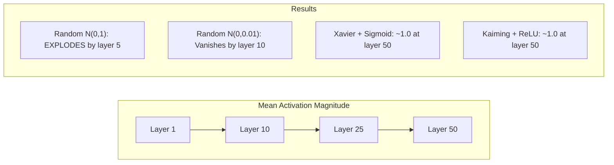
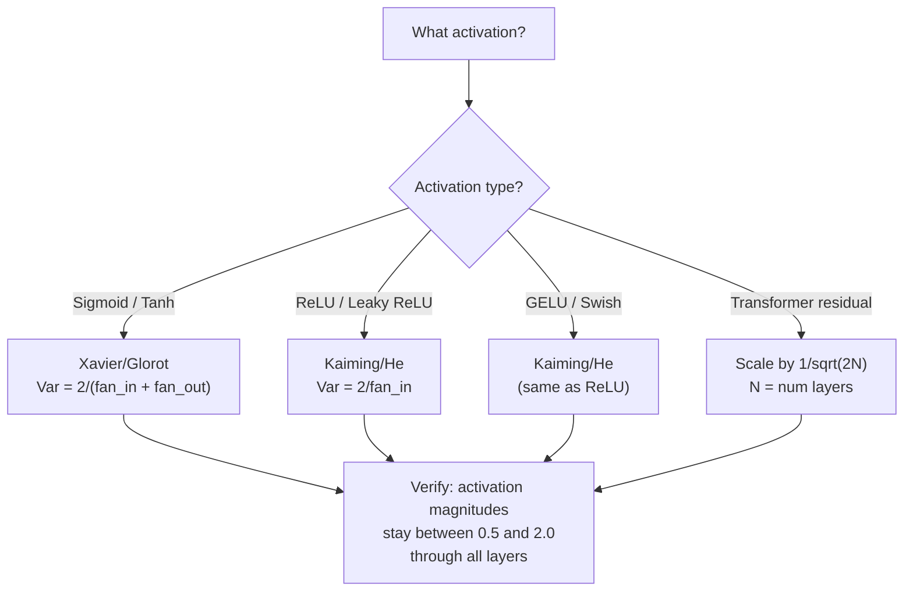

# الوزن التشغيل مع التدريب استقرارية

> ابتداء الخطأ، التدريب لا يمكن البدء. ابتداء ضد، 50 طبقة يمكن أن تكون مثل 3 طبقات.

**Type:** Build
**Languages:** Python
**Prerequisites:** Lesson 03.04 (Activation Functions), Lesson 03.07 (Regularization)
**Time:** ~90 minutes

## 學习目标
- 实现 صفر、random、Xavier/Glorot 和 Kaiming/He ابتكار 策略,并测量它们对50层中激活幅度的影响
- 推导为什么 خاسبير init 使用 Var(w) = 2/(fan_in + fan_out) ، بينما كايمينغ استخدام Var(w) = 2/fan_in
- 演示 صفر التبديل التناغم  مشكلة,并解释为什么只依靠随机规模还不够
- 将正确的初始化 策略匹配到激活函数:sigmoid/tanh 使用Xavier,ReLU/GELU 使用Kaiming

## 问题
وضع كل الوزن في البداية إلى الصفر. كل عصبية تحسب نفس الوظيفة، وتتلقى نفس المستوى، وتحديثها بنفس الطريقة. بعد 10،000 عصر، لا تزال طبقة 512 عصبية مخفية لك مجرد 512 نسخة من نفس العصبية.

تعقبها في البداية كبيرة جدا. ستنفجر التشغيلات في جميع أنحاء الشبكة. إلى الطبقة 10، والقيمة العددية تصل إلى 1e15. إلى الطبقة 20، وتتجاوزها إلى اللانهاية.

من التوزيع الطبيعي القياسي إلى الاصطناعي، والذي يصل إلى 50 مستوى، والتي تعتمد على الحد الأقصى بين العمل والانهيار.

التبني الوزن هو أكثر القرارات التي يتم تقليلها في التعلم العميق. العمارة سوف يكون لها مقالات. المتحفسين سوف يكون لها مقالات. التبني عادة ما يحصل فقط على نقطة واحدة. ولكن إذا كان هناك خطأ، كل شيء آخر لا يهم. شبكةك في التدريب في البداية بالفعل ميتة.

## 概念
### مشكلة التناظر

كل عصبية في الطبقة لديها نفس البنية: باستخدام الوزن  ضرب المدخلات، زائد التحيز، تنشيط التطبيق. إذا كانت جميع الوزن من نفس القيمة تبدأ من الصفر هو الحالة النهائية، كل عصبية تحسب نفس الناتج. خلال التنشر الخلفي، كل عصبية تتلقى نفس الدرجة. خلال مرحلة التحديث، كل عصبية تتغير نفس الكمية.

تم تعقيدك. شبكة لديها مئات المعلمات، ولكنها تتحرك معًا. هذا يسمى بالتناظر، والابتدائية العشوائية هي طريقة حربها. كل عصبية تبدأ من موقع مختلف في مساحة الوزن، وبالتالي كل عصبية تتعلم ميزة مختلفة.

ولكن العشوائية لا تكفي، كما تعلمون، القياس المنتظر يقرر أن الشبكة قادرة على التدريب.

### التباين ينتشر من خلال الطبقات

考虑一个具有风扇_in 个输入的单层:

```
z = w1*x1 + w2*x2 + ... + w_n*x_n
```

إذا كل وزن ويعود إلى التنازل عن التباين من Var(w) ، وكل مدخل xi من التباين من Var(x) ، فإن التباين من الخروج من:

```
Var(z) = fan_in * Var(w) * Var(x)
```

إذا Var(w) = 1 且 fan_in = 512, فإن المتغيرات الخارجة هي المتغيرات المدخلة 512 倍── عبر 10 层:512^10 = 1.2e27── إشارتك 已爆炸──

إذا Var(w) = 0.001,则 خيار الخروج كل طبقة على 0.001 * 512 = 0.512 缩小──经过 10 层:0.512^10 = 0.00013──你的信号 已消失──

目標:选择 Var(w) ، يجعل Var(z) = Var(x) ・・・ حجم الإشارة في كل مستوى يبقى ثابتة

### إعدادات إعدادات إعدادات إعدادات إعدادات إعدادات إعدادات إعدادات إعدادات إعدادات إعدادات إعدادات إعدادات إعدادات إعدادات إعدادات إعدادات إعدادات إعدادات إعدادات إعدادات إعدادات إعدادات إعدادات إعدادات إعدادات إعدادات إعدادات إعدادات إعدادات إعدادات إعدادات إعدادات إعدادات إعدادات إعدادات إعدادات إعدادات إعدادات إعدادات إعدادات إعدادات إعدادات إعدادات إعدادات إعدادات إعدادات إعدادات إعدادات إعدادات إعدادات إعدادات إعدادات إعدادات إعدادات إعدادات إعدادات إعدادات إعدادات إعدادات إعدادات إعدادات إعدادات إعداداتات إعدادات إعداداتاتات إعدادات إعداداتاتات إعدادات إعداداتاتات إعدادات إعداداتات إعدادات إعدادات إعدادات إعدادات إعداداتات إعدادات إعداداتات إعدادات إعدادات إعدادات إعدادات إعدادات إعدادات إعدادات إعدادات إعدادات إعدادات إعدادات إعدادات إعدادات إعدادات إعدادات إعدادات إعدادات إعدادات إعدادات إعدادات إعدادات إعدادات إعدادات إعدادات إعدادات إعدادات إعدادات إعدادات إعدادات إعدادات إعدادات إعدادات إعدادات إعدادات إعدادات إعدادات إعدادات إعدادات إعدادات إعدادات إعدادات إعدادات إعدادات إعدادات إعدادات إعدادات إعدادات إعدادات إعدادات إعدادات إعدادات إعدادات إعدادات إعدادات إعدادات إعدادات إعدادات إعدادات إعدادات إعدادات إعدادات إعدادات إعدادات إعدادات إعدادات إعدادات إعدادات إعدادات إعدادات إعدادات إ إ إعدادات إ إ إ إ إ إ إ إ إ إ إ إ إ إ إ إ إ إ إ إ إ إ إ إ إ إ إ إ إ إ إ إ إ إ إ إ إ إ إ إطار إطار إ إ إ إ إ

Glorot and Bengio (2010) 推导了适用于 sigmoid 和 tanh تفعيلات 的解──为了在前和后的通过 中都保持变化 恒定:

```
Var(w) = 2 / (fan_in + fan_out)
```

实践中,وزن من التوزيع التالي 中采样:

```
w ~ Uniform(-limit, limit)  where limit = sqrt(6 / (fan_in + fan_out))
```

أو:

```
w ~ Normal(0, sqrt(2 / (fan_in + fan_out)))
```

هذا هو السبب في أنه فعال، لأن sigmoid 和 tanh في صفر  قريبة من التشغيل، والتحركات بعد التشغيل الصحيحة تماما في هذه المنطقة.

### كايمينغ/هي إبتدائية

سوف يقتل ReLU نصف المخرجات ((كل السلبيات تصبح صفر)  فعالة المروحة_في                                                                                                                                                                                                                                                                                                                                                                                                                                                                                                   

He et al. (2015) 调整了公式:

```
Var(w) = 2 / fan_in
```

الوزن من التوزيع التالي 中采样:

```
w ~ Normal(0, sqrt(2 / fan_in))
```

في 2 استخدام لتعويض ReLU سوف نصف التفعيلات 置零 تأثير 没有它,إشارة كل طبقة سوف تقلص حوالي 0.5 倍──50 层后:0.5^50 = 8.8e-16──Kaiming init يمكن منع هذه الحالة──

### إطلاق المحول

أدى GPT-2 إلى وضع آخر. ستقوم الاتصالات المتبقية بتحويل كل طبقة فرعية إلى مدخلاتها:

```
x = x + sublayer(x)
```

كل مرة يزيد فيها التباين. بالنسبة لـ N طبقات بقايا، سيتم الارتقاء بـ N 成 النسبة.

إضافة إلى ذلك، فإن التخفيضات لا تتجاوز المعدلات المعدنية، فهي تصل إلى المعدلات المعدنية.

```mermaid
flowchart TD
    subgraph "Zero Init"
        Z1["Layer 1<br/>All weights = 0"] --> Z2["Layer 2<br/>All neurons identical"]
        Z2 --> Z3["Layer 3<br/>Still identical"]
        Z3 --> ZR["Result: 1 effective neuron<br/>regardless of width"]
    end

    subgraph "Xavier Init"
        X1["Layer 1<br/>Var = 2/(fan_in+fan_out)"] --> X2["Layer 2<br/>Signal stable"]
        X2 --> X3["Layer 50<br/>Signal stable"]
        X3 --> XR["Result: Trains with<br/>sigmoid/tanh"]
    end

    subgraph "Kaiming Init"
        K1["Layer 1<br/>Var = 2/fan_in"] --> K2["Layer 2<br/>Signal stable"]
        K2 --> K3["Layer 50<br/>Signal stable"]
        K3 --> KR["Result: Trains with<br/>ReLU/GELU"]
    end
```



### عبر 50 مستوى من الكبيرة التشغيل



### اختيار النوايا الصحيحة




```figure
weight-init-variance
```

## بناءها
### الخطوة 1: استراتيجيات البدء

بداية المصفوفة الوزن الأربعة طرق. كل طريقة تعود إلى قائمة من القوائم.

```python
import math
import random


def zero_init(fan_in, fan_out):
    return [[0.0 for _ in range(fan_in)] for _ in range(fan_out)]


def random_init(fan_in, fan_out, scale=1.0):
    return [[random.gauss(0, scale) for _ in range(fan_in)] for _ in range(fan_out)]


def xavier_init(fan_in, fan_out):
    std = math.sqrt(2.0 / (fan_in + fan_out))
    return [[random.gauss(0, std) for _ in range(fan_in)] for _ in range(fan_out)]


def kaiming_init(fan_in, fan_out):
    std = math.sqrt(2.0 / fan_in)
    return [[random.gauss(0, std) for _ in range(fan_in)] for _ in range(fan_out)]
```

### الخطوة 2: وظائف التفعيل

نحتاج إلى sigmoid  tanh 和 ReLU، لكي نتمكن من إجراء اختبارات باستخدام كل استراتيجية بداية وتشغيل متوقعها.

```python
def sigmoid(x):
    x = max(-500, min(500, x))
    return 1.0 / (1.0 + math.exp(-x))


def tanh_act(x):
    return math.tanh(x)


def relu(x):
    return max(0.0, x)
```

### الخطوة الثالثة: المضي قدماً عبر 50 طبقة

让随机数据 通过一个深度网络,并测量每一层的平均激活大小──

```python
def forward_deep(init_fn, activation_fn, n_layers=50, width=64, n_samples=100):
    random.seed(42)
    layer_magnitudes = []

    inputs = [[random.gauss(0, 1) for _ in range(width)] for _ in range(n_samples)]

    for layer_idx in range(n_layers):
        weights = init_fn(width, width)
        biases = [0.0] * width

        new_inputs = []
        for sample in inputs:
            output = []
            for neuron_idx in range(width):
                z = sum(weights[neuron_idx][j] * sample[j] for j in range(width)) + biases[neuron_idx]
                output.append(activation_fn(z))
            new_inputs.append(output)
        inputs = new_inputs

        magnitudes = []
        for sample in inputs:
            magnitudes.append(sum(abs(v) for v in sample) / width)
        mean_mag = sum(magnitudes) / len(magnitudes)
        layer_magnitudes.append(mean_mag)

    return layer_magnitudes
```

### الخطوة الرابعة: التجربة

运行所有组合:zero init、random N(0,1)、random N(0,0.01)、Xavier مع sigmoid、Xavier مع tanh、Kaiming مع ReLU──打印关键层的大小──

```python
def run_experiment():
    configs = [
        ("Zero init + Sigmoid", lambda fi, fo: zero_init(fi, fo), sigmoid),
        ("Random N(0,1) + ReLU", lambda fi, fo: random_init(fi, fo, 1.0), relu),
        ("Random N(0,0.01) + ReLU", lambda fi, fo: random_init(fi, fo, 0.01), relu),
        ("Xavier + Sigmoid", xavier_init, sigmoid),
        ("Xavier + Tanh", xavier_init, tanh_act),
        ("Kaiming + ReLU", kaiming_init, relu),
    ]

    print(f"{'Strategy':<30} {'L1':>10} {'L5':>10} {'L10':>10} {'L25':>10} {'L50':>10}")
    print("-" * 80)

    for name, init_fn, act_fn in configs:
        mags = forward_deep(init_fn, act_fn)
        row = f"{name:<30}"
        for idx in [0, 4, 9, 24, 49]:
            val = mags[idx]
            if val > 1e6:
                row += f" {'EXPLODED':>10}"
            elif val < 1e-6:
                row += f" {'VANISHED':>10}"
            else:
                row += f" {val:>10.4f}"
        print(row)
```

### الخطوة 5: إظهار التناظر

و يظهر صفر بداية سوف تنتج نفس الخلايا العصبية تماما

```python
def symmetry_demo():
    random.seed(42)
    weights = zero_init(2, 4)
    biases = [0.0] * 4

    inputs = [0.5, -0.3]
    outputs = []
    for neuron_idx in range(4):
        z = sum(weights[neuron_idx][j] * inputs[j] for j in range(2)) + biases[neuron_idx]
        outputs.append(sigmoid(z))

    print("\nSymmetry Demo (4 neurons, zero init):")
    for i, out in enumerate(outputs):
        print(f"  Neuron {i}: output = {out:.6f}")
    all_same = all(abs(outputs[i] - outputs[0]) < 1e-10 for i in range(len(outputs)))
    print(f"  All identical: {all_same}")
    print(f"  Effective parameters: 1 (not {len(weights) * len(weights[0])})")
```

### الخطوة 6: تقرير الكبيرة الطبقة على الطبقة

印动化条形图 在 50层中可视化条形图.

```python
def magnitude_report(name, magnitudes):
    print(f"\n{name}:")
    for i, mag in enumerate(magnitudes):
        if i % 5 == 0 or i == len(magnitudes) - 1:
            if mag > 1e6:
                bar = "X" * 50 + " EXPLODED"
            elif mag < 1e-6:
                bar = "." + " VANISHED"
            else:
                bar_len = min(50, max(1, int(mag * 10)))
                bar = "#" * bar_len
            print(f"  Layer {i+1:3d}: {bar} ({mag:.6f})")
```

## استخدمها
سوف PyTorch هذه كعملة داخلية:

```python
import torch
import torch.nn as nn

layer = nn.Linear(512, 256)

nn.init.xavier_uniform_(layer.weight)
nn.init.xavier_normal_(layer.weight)

nn.init.kaiming_uniform_(layer.weight, nonlinearity='relu')
nn.init.kaiming_normal_(layer.weight, nonlinearity='relu')

nn.init.zeros_(layer.bias)
```

عندما ت调用`nn.Linear(512, 256)`时,PyTorch 默认使用Kaiming Uniform Initialisation──这就是为什么大多数简单网络 只是工作--PyTorch 已经做出正确选择──但当你构建定制架构时,或者深入到超过20层时,你需要了解正在发生的事情,并且可能需要覆盖默认设置──

بالنسبة للمتحولات، عادة ما تكون نماذج "هوجينغ فيس" في هذه الأماكن`_init_weights`方法中處理初始化── GPT-2 的实现会按1/sqrt(N) 缩放残余投影── إذا كنت تبدأ من الصفر في بناء المحول، تحتاج إلى إضافة نفسك لهذا النقطة──

## 交付 it
本课会产出:
- `outputs/prompt-init-strategy.md`-- إعداد المشكلة ووضعها في الموقع

## التدريب
1. 添加 LeCun inicialization(Var = 1/fan_in,为 SELU activation 设计) ・运行 تجربة 50 طبقة, باستخدام LeCun init + tanh,并与Xavier + tanh对比──

2. 实现 GPT-2 بقايا التوسيع: قبل انضمام إلى التيار بقايا  قبل أن يتم تنفيذ 50 طبقة في حالة وجود تراكم و عدم وجود تراكم ، قياس حجم بقايا  زيادة 

3. إنشاء وظيفة "تحقق صحة البيانات"  وظيفة، استلام شبكة الأبعاد الطبقة و نوع تفعيل، ثم تقديم التبديل الصحيح، و في الحال init سوف يؤدي إلى مشكلة عند إعطاء تحذير.

4. استخدام fan_in = 16 مع fan_in = 1024 运行实验──Xavier 和 Kaiming 会适配 fan_in,但随机 init 不会──展示随着层变大,工作和休之间的差距如何扩大──

5. 实现 orthogonal initialization(إنتاج ماتريكس عشوائية، حسابها SVD، باستخدام ماتريكس orthogonal U) ―― مع 50 طبقة شبكات ReLU 中的 Kaiming 进行比较。

## 关键术语
| Term | What people say | What it actually means |
|------|----------------|----------------------|
| Weight initialization | “随机设置 starting weights” | 选择 initial weight values 的策略，它决定一个 network 是否有可能训练 |
| Symmetry breaking | “让 neurons 变得不同” | 使用 random initialization 确保 neurons 学习不同 features，而不是计算完全相同的函数 |
| Fan-in | “一个 neuron 的 inputs 数量” | incoming connections 的数量，它决定 input variance 如何在 weighted sum 中累积 |
| Fan-out | “一个 neuron 的 outputs 数量” | outgoing connections 的数量，与在 Backpropagation 期间维持 Gradient variance 有关 |
| Xavier/Glorot init | “sigmoid initialization” | Var(w) = 2/(fan_in + fan_out)，旨在通过 sigmoid 和 tanh activations 保持 variance |
| Kaiming/He init | “ReLU initialization” | Var(w) = 2/fan_in，考虑了 ReLU 会将一半 activations 置零 |
| Variance propagation | “signals 如何在 layers 中增长或缩小” | 基于 weight scale，逐层分析 activation variance 如何变化的数学分析 |
| Residual scaling | “GPT-2 的 init trick” | 将 residual connection weights 按 1/sqrt(2N) 缩放，以防止 variance 在 N 个 transformer layers 中增长 |
| Dead network | “什么都训练不了” | 一个因 initialization 不佳而导致所有 Gradients 为 zero 或所有 activations 饱和的 network |
| Exploding activations | “数值走向 infinity” | 当 weight variance 过高时，activation magnitudes 会在 layers 中指数级增长 |

## 延伸阅读
- غلوروت و بينجيو، "فهم صعوبة تدريب شبكات عصبية متقدمة بعمق" (2010) -- 原始 萨维埃初始化 论文,包含变化分析
- He et al., "التعمق في المصلحات" (2015) -- 引入用于 ReLU شبكات Kaiming التبديل
- رادفورد وغيرهم، "نموذجات اللغة هي متعلمين متعددين المهام غير المشرفين" (2019) -- GPT-2 论文، منها يحتوي على بدء التوسع المتبقي
- مشكين وماتاس، "كل ما تحتاجه هو بداية جيدة" (2016) -- تعريف التسلسلات الوحيدة-الفرق، طريقة مقابل حل المقياس
