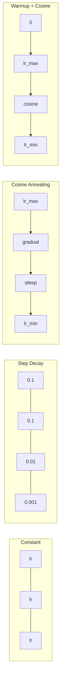
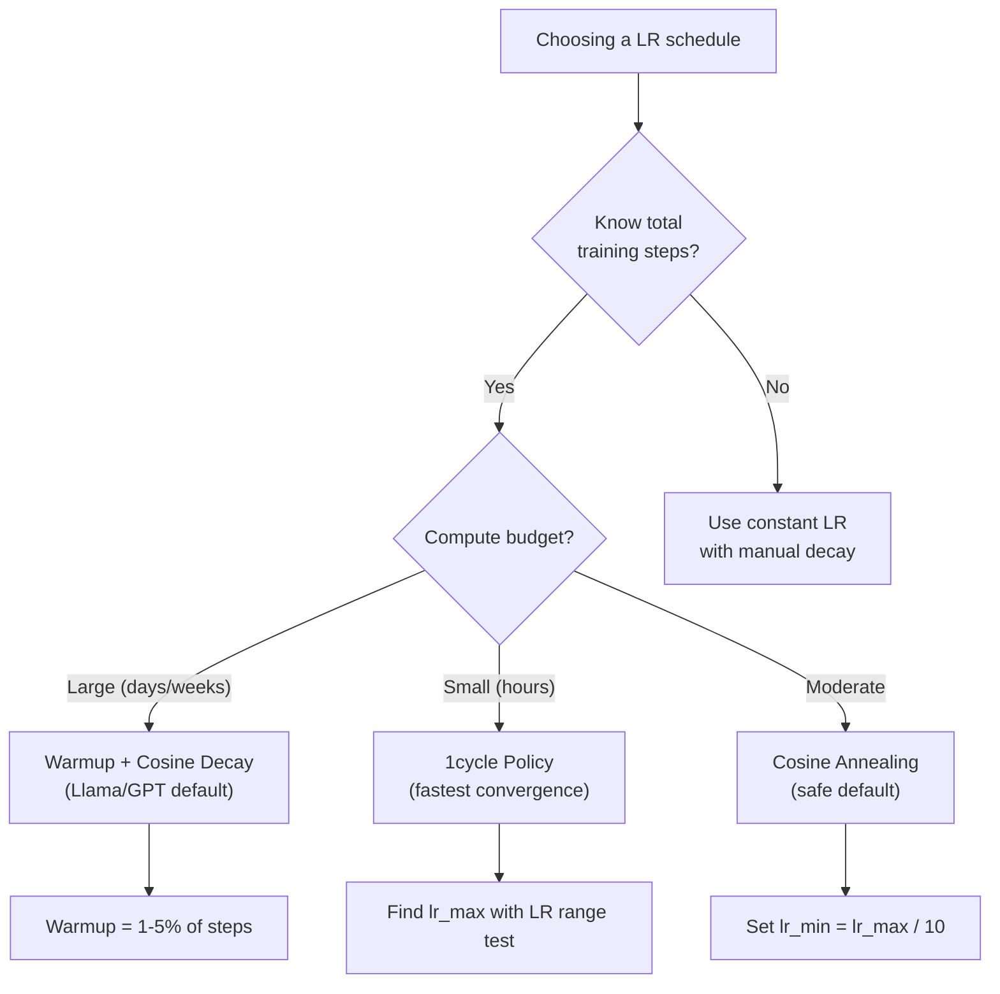
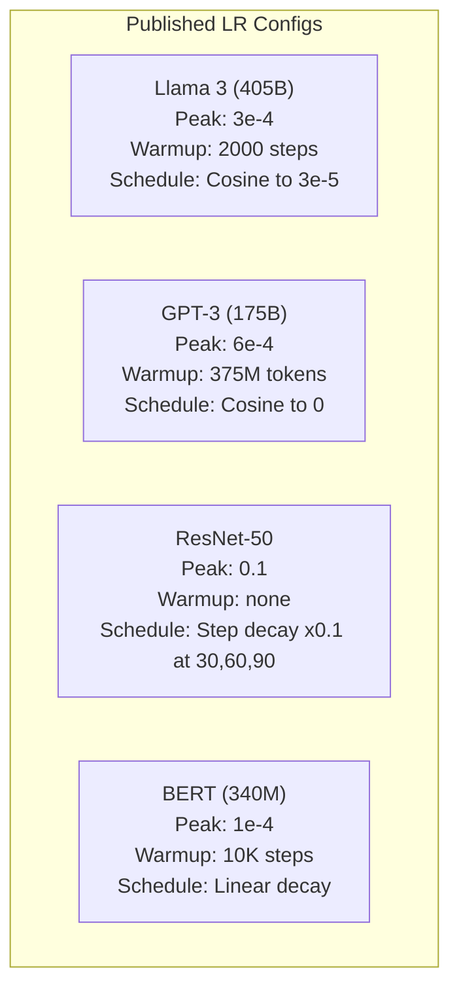

# جدول أعمال التعلم و التدفئة

> معدل التعلم هو واحد من أهم المعايير المفرطة ليس الهندسة المعمارية ليس حجم مجموعة البيانات ليس وظيفة التفعيل ليس معدل التعلم

**类型：**الإنشاء
**语言：**بايثون
**先修：**الدروس 03.06 (المتحسنين) ، الدروس 03.08 (الوزن في البداية)
**时间：**حوالي 90 دقيقة

## 學习目标

- من التحقق من صفر ثابتة ‧خطوة التدهور ‧الخفيفة التدريجية ‧الاحترار +الخفيفة و ‧توقيت التعلم في دورة واحدة
- 演示 تعلم معدل 选择的三种失败模式: التباين(过高) 、التوقف(过低) و التذبذب(لا تدهور)
- شرح لماذا يقوم بتحسين أدم على الحرارة و كيفية تحسين التدريب المبكر
- في نفس المهمة مقارنة جميع الخمسة جداول سرعة التقارب، ومع تحديد ميزانية التدريب  اختيار جدول مناسب

## 问题

وضع معدل التعلم ‬ ‬ ‬ ‬ ‬ ‬ ‬ ‬ ‬ ‬ ‬ ‬ ‬ ‬ ‬ ‬ ‬ ‬ ‬ ‬ ‬ ‬ ‬ ‬ ‬ ‬ ‬ ‬ ‬ ‬ ‬ ‬ ‬ ‬ ‬ ‬ ‬ ‬ ‬ ‬ ‬ ‬ ‬ ‬ ‬ ‬ ‬ ‬ ‬ ‬ ‬ ‬ ‬ ‬ ‬ ‬ ‬ ‬ ‬ ‬ ‬ ‬ ‬ ‬ ‬ ‬ ‬ ‬ ‬ ‬ ‬ ‬ ‬ ‬ ‬ ‬ ‬ ‬ ‬ ‬ ‬ ‬ ‬ ‬ ‬ ‬ ‬ ‬ ‬ ‬ ‬ ‬ ‬ ‬ ‬ ‬ ‬ ‬ ‬ ‬ ‬ ‬ ‬ ‬ ‬ ‬ ‬ ‬ ‬ ‬ ‬ ‬ ‬ ‬ ‬ ‬ ‬ ‬ ‬ ‬ ‬ ‬ ‬ ‬ ‬ ‬ ‬ ‬ ‬ ‬ ‬ ‬ ‬ ‬ ‬ ‬ ‬ ‬ ‬ ‬ ‬ ‬ ‬ ‬ ‬ ‬ ‬ ‬ ‬ ‬ ‬ ‬ ‬ ‬ ‬ ‬ ‬ ‬ ‬ ‬ ‬ ‬ ‬ ‬ ‬ ‬ ‬ ‬ ‬ ‬ ‬ ‬ ‬ ‬ ‬ ‬ ‬ ‬ ‬ ‬ ‬ ‬ ‬ ‬ ‬ ‬ ‬ ‬ ‬ ‬ ‬ ‬ ‬ ‬ ‬ ‬ ‬ ‬ ‬ ‬ ‬ ‬ ‬ ‬ ‬ ‬ ‬ ‬ ‬ ‬ ‬ ‬ ‬ ‬ ‬ ‬ ‬ ‬ ‬ ‬ ‬ ‬ ‬ ‬ ‬ ‬ ‬ ‬ ‬ ‬ ‬ ‬ ‬ ‬ ‬ ‬ ‬ ‬ ‬ ‬ ‬ ‬ ‬ ‬ ‬ ‬ ‬ ‬ ‬ ‬ ‬ ‬ 

أفضل معدل التعلم ليس عدداً عادياً. يتغير في عملية التدريب. في وقت مبكر، تريد استخدام مساحة التدريب بسرعة كبيرة. في مرحلة التدريب، تريد استخدام مساعي صغيرة للحصول على أدنى حد حد.

过去三年发表的每个主流模型都使用了学习率时间表──Llama 3 使用峰值 lr=3e-4,2000 个升温步骤,并通过了宇宙衰退 衰减到3e-5──GPT-3 使用 lr=6e-4,并进行升温375 مليون رمز──这些不是随意选择──它们是花费数百万美元的大规模超参数扫描的结果──

تحتاج إلى فهم الجدول الزمنية، لأن القيمة الاصطناعية لا تتناسب بالضرورة مع مشكلتك. عندما تقوم بتحسين نموذج متدرب مسبق، فإن الجدول الزمني الصحيح لا يختلف عن التدريب الصفر. عندما تزيد حجم المجموعة، فترة التدفئة تحتاج أيضًا إلى تغيير.

## 概念

### معدل التعلم المستمر

أسهل طريقة... اختر رقم واحد، كل خطوة تستخدمها

```
lr(t) = lr_0
```

很少是最优的──它要么对训练末期来说太高 (((在最小 附近的振荡),要么对训练初步来说太低 ((在小步上浪费计算) ──对小模型和调试来说也可以──对任何需要训练超过一小时的任务都是糟糕的选择──

### التهالك الخطوة

من طريقة القديمة في عصر ريس نت في العصور الثابتة، حيث أن معدل التعلم يقل 10x في العصور الثابتة.

```
lr(t) = lr_0 * gamma^(floor(epoch / step_size))
```

بينها غاما = 0.1 且 step_size = 30 يعبر عن:lr كل 30 دور 降低 10x──ResNet-50 就用这个 --lr=0.1,在30、60 和 90 时降低 10x──

问题是:最优衰退 点取决于数据集和架构──转到另一个问题,就需要重新调调什么时候降低──转变也很突然--当速度突然变化时,Loss可能会峰──

### كوسين انيلينغ

                                                                                                                                                                                                                                                                                                                                                                                                                                                                                                                             

```
lr(t) = lr_min + 0.5 * (lr_max - lr_min) * (1 + cos(pi * t / T))
```

من بينها t هو الخطوة الحالية,T هو جميع الخطوات

عندما t=0 时, كوسين 项为 1,所以 lr = lr_max──当 t=T 时, كوسين 项为 -1,所以 lr = lr_min──decay 一开始很平缓,中间加速,接近末尾时再次变得平缓──

هذا هو اختيار الاختيار المتبقي في معظم التدريبات الحديثة. ما عدا lr_max و lr_min  لا حاجة إلى تعديل المعايير الضخمة.

### لماذا تبدأ من الصغر

آدم 和其他 التكيفية تحسين 会维护 متوسط درجة 和 التباين التشغيل التقديرات. في الخطوة 0، هذه التقديرات تم البدء في ابتداء إلى صفر.

يمكن إصلاح هذه المشكلة. أولاً من معدل التعلم الصغير جداً.

```
lr(t) = lr_max * (t / warmup_steps)     for t < warmup_steps
```

التدفئة النموذجية: 1-5% من مراحل التدريب الإجمالي. التدريب الإجمالي 3 تم تدريب حوالي 1.8 تريليون رمز، وتدفئة 2000 خطوة.

### التدفئة الخطية + تدهور الكوزين

الحالة الأولى خطية، ثم تدهور الكوسين:

```
if t < warmup_steps:
    lr(t) = lr_max * (t / warmup_steps)
else:
    progress = (t - warmup_steps) / (total_steps - warmup_steps)
    lr(t) = lr_min + 0.5 * (lr_max - lr_min) * (1 + cos(pi * progress))
```

هذا هو Llama、GPT、PaLM 和大多数现代 Transformers 使用的方案──الحرارة 防止早期不稳定──可松衰退──让模型 收到良好的最低量──

### سياسة دورة 1

اكتشاف ليزلي سميث (Leslie Smith) (2018): في النصف الأول من التدريب، قم بتعزيز معدل التعلم من القيمة المنخفضة إلى القيمة العالية، ثم تراجع مرة أخرى في النصف الثاني.

النظرية هي: معدل التعلم العالي سيتم خلال مسار التحسين في المرحلة المشتركة للضوضاء ليبدأ في التنظيم.

```
Phase 1 (0 to T/2):    lr ramps from lr_max/25 to lr_max
Phase 2 (T/2 to T):    lr ramps from lr_max to lr_max/10000
```

في ميزانية الحوسبة الثابتة أسفل، دورة عادة ما تكون أسرع من التسلل الكوسينية تدريبها.

### الجدول 形状



###  عملية اتخاذ القرار



### 已发表的模型 中的真实数值




```figure
lr-schedule
```

## بناءها

### الخطوة 1:مهمات الجدول

كل وظيفة قبل الخطوة السابقة،并返回 درجة التعلم في هذه الخطوة ‬

```python
import math


def constant_schedule(step, lr=0.01, **kwargs):
    return lr


def step_decay_schedule(step, lr=0.1, step_size=100, gamma=0.1, **kwargs):
    return lr * (gamma ** (step // step_size))


def cosine_schedule(step, lr=0.01, total_steps=1000, lr_min=1e-5, **kwargs):
    if step >= total_steps:
        return lr_min
    return lr_min + 0.5 * (lr - lr_min) * (1 + math.cos(math.pi * step / total_steps))


def warmup_cosine_schedule(step, lr=0.01, total_steps=1000, warmup_steps=100, lr_min=1e-5, **kwargs):
    if total_steps <= warmup_steps:
        return lr * (step / max(warmup_steps, 1))
    if step < warmup_steps:
        return lr * step / warmup_steps
    progress = (step - warmup_steps) / (total_steps - warmup_steps)
    return lr_min + 0.5 * (lr - lr_min) * (1 + math.cos(math.pi * progress))


def one_cycle_schedule(step, lr=0.01, total_steps=1000, **kwargs):
    mid = max(total_steps // 2, 1)
    if step < mid:
        return (lr / 25) + (lr - lr / 25) * step / mid
    else:
        progress = (step - mid) / max(total_steps - mid, 1)
        return lr * (1 - progress) + (lr / 10000) * progress
```

### الخطوة الثانية: إظهار جميع الجدول الزمنية

طبع خطة بناء على النص، واكتشف كل جدول في التدريبات

```python
def visualize_schedule(name, schedule_fn, total_steps=500, **kwargs):
    steps = list(range(0, total_steps, total_steps // 20))
    if total_steps - 1 not in steps:
        steps.append(total_steps - 1)

    lrs = [schedule_fn(s, total_steps=total_steps, **kwargs) for s in steps]
    max_lr = max(lrs) if max(lrs) > 0 else 1.0

    print(f"\n{name}:")
    for s, lr_val in zip(steps, lrs):
        bar_len = int(lr_val / max_lr * 40)
        bar = "#" * bar_len
        print(f"  Step {s:4d}: lr={lr_val:.6f} {bar}")
```

### الخطوة الثالثة: تدريب شبكة

في مجموعة بيانات دائرة أعلى باستخدام شبكة بسيطة من طبقتين، نفس الدروس السابقة، ولكن هذه المرة قمنا بتغيير الجدول الزمني.

```python
import random


def sigmoid(x):
    x = max(-500, min(500, x))
    return 1.0 / (1.0 + math.exp(-x))


def relu(x):
    return max(0.0, x)


def relu_deriv(x):
    return 1.0 if x > 0 else 0.0


def make_circle_data(n=200, seed=42):
    random.seed(seed)
    data = []
    for _ in range(n):
        x = random.uniform(-2, 2)
        y = random.uniform(-2, 2)
        label = 1.0 if x * x + y * y < 1.5 else 0.0
        data.append(([x, y], label))
    return data


def train_with_schedule(schedule_fn, schedule_name, data, epochs=300, base_lr=0.05, **kwargs):
    random.seed(0)
    hidden_size = 8
    total_steps = epochs * len(data)

    std = math.sqrt(2.0 / 2)
    w1 = [[random.gauss(0, std) for _ in range(2)] for _ in range(hidden_size)]
    b1 = [0.0] * hidden_size
    w2 = [random.gauss(0, std) for _ in range(hidden_size)]
    b2 = 0.0

    step = 0
    epoch_losses = []

    for epoch in range(epochs):
        total_loss = 0
        correct = 0

        for x, target in data:
            lr = schedule_fn(step, lr=base_lr, total_steps=total_steps, **kwargs)

            z1 = []
            h = []
            for i in range(hidden_size):
                z = w1[i][0] * x[0] + w1[i][1] * x[1] + b1[i]
                z1.append(z)
                h.append(relu(z))

            z2 = sum(w2[i] * h[i] for i in range(hidden_size)) + b2
            out = sigmoid(z2)

            error = out - target
            d_out = error * out * (1 - out)

            for i in range(hidden_size):
                d_h = d_out * w2[i] * relu_deriv(z1[i])
                w2[i] -= lr * d_out * h[i]
                for j in range(2):
                    w1[i][j] -= lr * d_h * x[j]
                b1[i] -= lr * d_h
            b2 -= lr * d_out

            total_loss += (out - target) ** 2
            if (out >= 0.5) == (target >= 0.5):
                correct += 1
            step += 1

        avg_loss = total_loss / len(data)
        accuracy = correct / len(data) * 100
        epoch_losses.append(avg_loss)

    return epoch_losses
```

### الخطوة 4: مقارنة جميع الجدول الزمنية

استخدام كل جدول  تدريب نفس الشبكة،并比较最终 Loss 和 التقارب 行为

```python
def compare_schedules(data):
    configs = [
        ("Constant", constant_schedule, {}),
        ("Step Decay", step_decay_schedule, {"step_size": 15000, "gamma": 0.1}),
        ("Cosine", cosine_schedule, {"lr_min": 1e-5}),
        ("Warmup+Cosine", warmup_cosine_schedule, {"warmup_steps": 3000, "lr_min": 1e-5}),
        ("1cycle", one_cycle_schedule, {}),
    ]

    print(f"\n{'Schedule':<20} {'Start Loss':>12} {'Mid Loss':>12} {'End Loss':>12} {'Best Loss':>12}")
    print("-" * 70)

    for name, schedule_fn, extra_kwargs in configs:
        losses = train_with_schedule(schedule_fn, name, data, epochs=300, base_lr=0.05, **extra_kwargs)
        mid_idx = len(losses) // 2
        best = min(losses)
        print(f"{name:<20} {losses[0]:>12.6f} {losses[mid_idx]:>12.6f} {losses[-1]:>12.6f} {best:>12.6f}")
```

### الخطوة 5: الر 过高 vs 过低

演示三种失败模式:过高(اختلاف) 、过低(爬行) 和刚刚好。

```python
def lr_sensitivity(data):
    learning_rates = [1.0, 0.1, 0.01, 0.001, 0.0001]

    print("\nLR Sensitivity (constant schedule, 100 epochs):")
    print(f"  {'LR':>10} {'Start Loss':>12} {'End Loss':>12} {'Status':>15}")
    print("  " + "-" * 52)

    for lr in learning_rates:
        losses = train_with_schedule(constant_schedule, f"lr={lr}", data, epochs=100, base_lr=lr)
        start = losses[0]
        end = losses[-1]

        if end > start or math.isnan(end) or end > 1.0:
            status = "DIVERGED"
        elif end > start * 0.9:
            status = "BARELY MOVED"
        elif end < 0.15:
            status = "CONVERGED"
        else:
            status = "LEARNING"

        end_str = f"{end:.6f}" if not math.isnan(end) else "NaN"
        print(f"  {lr:>10.4f} {start:>12.6f} {end_str:>12} {status:>15}")
```

## استخدمها

بيتورش في`torch.optim.lr_scheduler`في الموقع:

```python
import torch
import torch.optim as optim
from torch.optim.lr_scheduler import CosineAnnealingLR, OneCycleLR, StepLR

model = nn.Sequential(nn.Linear(10, 64), nn.ReLU(), nn.Linear(64, 1))
optimizer = optim.Adam(model.parameters(), lr=3e-4)

scheduler = CosineAnnealingLR(optimizer, T_max=1000, eta_min=1e-5)

for step in range(1000):
    loss = train_step(model, optimizer)
    scheduler.step()
```

لتحسين التدفئة + التدريبات، استخدام المخططات لامبا، أو استخدام HuggingFace `get_cosine_schedule_with_warmup`:

```python
from transformers import get_cosine_schedule_with_warmup

scheduler = get_cosine_schedule_with_warmup(
    optimizer,
    num_warmup_steps=2000,
    num_training_steps=100000,
)
```

وظيفة HuggingFace هي معظم المخططات المعدلة للاما و GPT استخداماتها.

## 交付 it

本课会产出:
- `outputs/prompt-lr-schedule-advisor.md`-- استشارة، للاستخدام وفقا لتعليمك تعيين التوصيات مناسبة جداول معدل التعلم وفرامرات

## التدريب

1. 实现 exponential decay:lr(t) = lr_0 * غاما^t، منها غاما = 0.999。 في مجموعة بيانات الدائرة 上与 cosine annealing 比较。

2. 实现 learning rate range test(Leslie Smith): تدريب بضعة مئات الخطوة، في نفس الوقت ستزيد LR من 1e-7 إعداد إلى 1── رسم الخسارة مقابل LR──最优最大 LR 位于 Loss 开始增加之前──

3. استخدام التدفئة + التدريب  التدريب، ولكن تغيير التدفئة 长度:总步骤的 0%、1%、5%、10%、20%──找到训练最稳定的甜点──

4. 实现带热启动的宇宙回归 (SGDR): في كل خطوة T سيتم تعديل معدل التعلم إلى lr_max ، ثم التدهور مرة أخرى.

5. 构建一个日程外科医,监控训练 损失,并在损失 稳定时自动从暖化 转换到阴;如果损失高原 太久,则降低 lr。

## 关键术语

| Term | 人们通常怎么说 | 它真正的含义 |
|------|----------------|----------------------|
| Learning rate | “model 学得有多快” | 用来乘以 Gradient、决定参数更新大小的标量 |
| Schedule | “随时间改变 LR” | 将 training step 映射到 learning rate 的 function，旨在优化 convergence |
| Warmup | “从小 LR 开始” | 在最初 N steps 中，将 LR 从接近零 linearly ramp 到目标值，以稳定 Optimizer 统计量 |
| Cosine annealing | “平滑 LR decay” | 在训练过程中，让 LR 按 cosine 曲线从 lr_max 降低到 lr_min |
| Step decay | “在 milestones 降低 LR” | 在固定 epoch intervals，将 LR 乘以一个因子（通常是 0.1） |
| 1cycle policy | “先上后下” | Leslie Smith 的方法：在单个 cycle 中将 LR 先 ramp up 再 ramp down，以获得更快 convergence |
| LR range test | “找到最佳 learning rate” | 在短时间训练中逐步增加 LR，以找到 Loss 开始 diverge 的数值 |
| Cosine with warm restarts | “重置并重复” | 周期性地将 LR 重置为 lr_max，并再次 decay（SGDR） |
| Eta min | “LR 的下限” | schedule 最终 decay 到的最小 learning rate |
| Peak learning rate | “最大 LR” | 训练过程中达到的最高 LR，通常出现在 warmup 之后 |

## 延伸阅读

- لوششيلوف وهاتر، "SGDR: التراجع التدريجي الستوكاستيكي مع إعادة البدء الحار" (2017) -- 引入 كوسين التراجع و إعادة البدء الحار
- سميث، "التحول الخارق: تدريب سريع جدا للشبكات العصبية باستخدام معدلات التعلم الكبيرة" (2018) -- 1 دورة السياسة 论文
- توفرون وغيرهم، "لاما 2: مؤسسة مفتوحة ونماذج الدردشة المنسقة" (2023) -- 记录了大规模使用的暖化 + كوسين جدول زمني
- Goyal et al., "دقيق، الكبيرة SGD المينيباتش: تدريب ImageNet في ساعة واحدة" (2017) -- تدريب الكبيرة المجموعة
