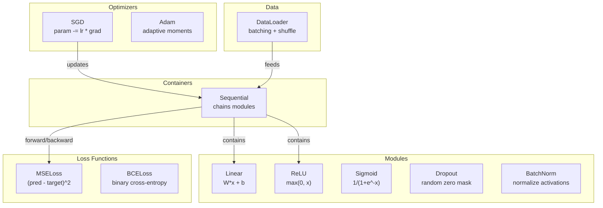
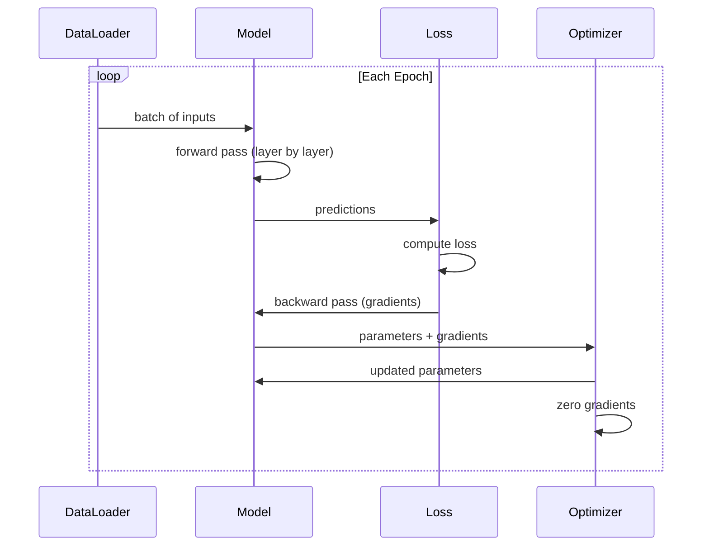
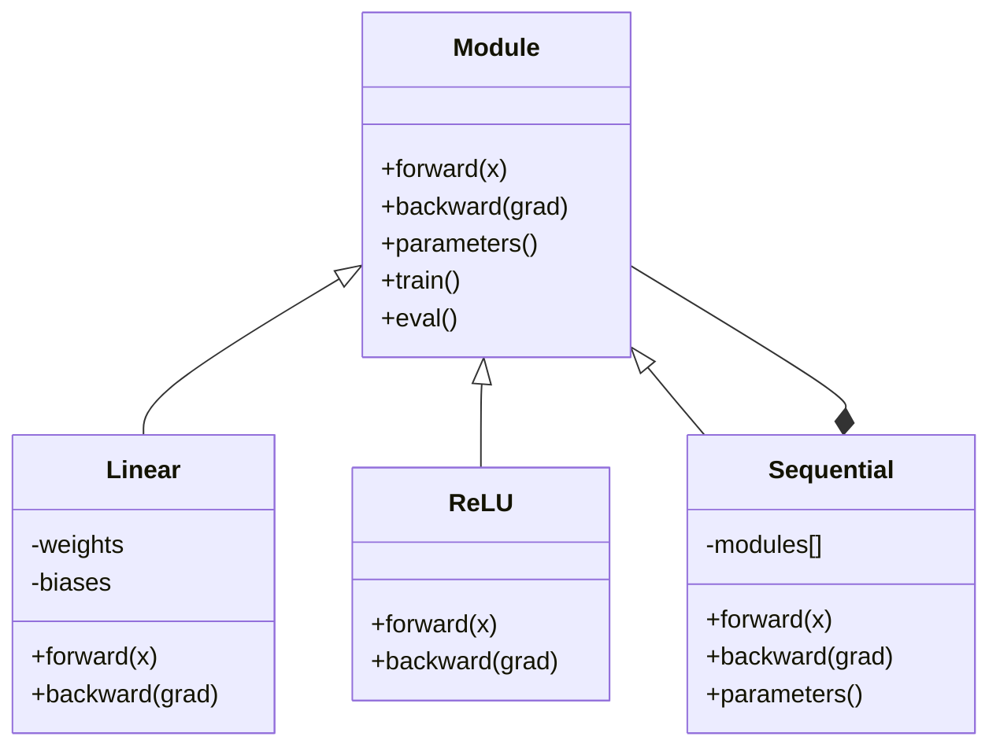

# قم ببناء إطار صغير خاص بك

> أنت قد بنيت الخلايا العصبية، الطبقات، الشبكات، التعاون الخلفي، التفعيلات، الوظيفة الخسارة، المتحفسين، التنظيم، التبديل، وخطوط التخطيط.

**类型:**الإنشاء
**语言:**بايثون
**前置知识:**المرحلة 03 全部内容(الدرس 01-09)
**时间:**~ 120 دقيقة

## 學习目标

- إنشاء إطار كامل للتعلم العميق ((حوالي 500 行) ، يتضمن الوحدة 、خطية 、ReLU、Sigmoid、Dropout、BatchNorm、تسلسل、الخسارة وظائف、تحسينات و DataLoader
- 解释 ماودول تجريده ((مواجهة ‬الظهر ‬الفقرات) ، وكذلك لماذا يجب أن تغير وضع القطار/القيام بالقيام بالقيام بالقيام بالقيام بالقيام بالقيام بالقيام بالقيام بالقيام بالقيام بالقيام بالقيام بالقيام بالقيام بالقيام بالقيام بالقيام بالقيام بالقيام بالقيام بالقيام بالقيام بالقيام بالقيام بالقيام بالقيام بالقيام بالقيام بالقيام بالقيام بالقيام بالقيام بالقيام بالقيام بالقيام بالقيام بالقيام بالقيام بالقيام بالقيام بالقيام بالقيام بالقيام بالقيام بالقيام بالقيام بالقيام بالقيام بالقيام بالقيام بالقيام بالقيام بالقيام بالقيام بالقيام بالقيام بالقيام بالقيام بالقيام بالقيام بالقيام بالقيام بالقيام بالقيام بالقيام بالقيام بالقيام بالقيام بالقيام بالقيام بالقيام بالقيام بالقيام بالقيام بالقيام بالقيام بالقيام
- كل المكونات متصلة في حلقة تدريبية قابلة للعمل، تستخدم في تصنيف الدائرة على تدريب شبكة 4 طبقات
- أن يتم تحديد كل مكون في الإطار الخاص بك إلى معالجة PyTorch 等价物(nn.Module、nn.Sequential、optim.Adam、DataLoader)

## 问题

لقد قمت في الدراسة بإنشاء كتلة بناء متفرقة بين الملفات المختلفة.`Value`في الصف، هناك حلقة تدريبية، وثمة ملف آخر يحتوي على تشغيل الوزن، وثمة ملف آخر يحتوي على جداول معدل التعلم.

هذا هو الإطار الذي يجب حل المشكلات.`nn.Module`.`nn.Sequential`.`optim.Adam`.`DataLoader`، ووضعها على المجموعة من أنماط حلقة التدريب التي نشأتها.`keras.Layer`.`keras.Sequential`.`keras.optimizers.Adam` هذه ليست سحر هي أنماط تنظيمية تمكنك من تعريف وتدريب وتقييم الشبكات دون أن تحتاج إلى إعادة اختراع منطق الاتصال الأساسي

ستستخدم حوالي 500 行 Python 构建同样东西──不用 numpy──不用外部依赖── هذا الإطار يمكن تعريف أي شبكة إرسال إضافية، باستخدام SGD أو آدم 训练، على البيانات القيام بالحصائف، تطبيق التخلي عن الخدمة وطبيعية البطاقة، استخدام أي تفعيل،并调度学习率──

بعد أن تنتهي، ستفهم ذلك بشكل صحيح`model = nn.Sequential(...)`عندما حدث ما ستفهم لماذا هناك`model.train()`和 `model.eval()`ستفهم لماذا`optimizer.zero_grad()`هو تطبيق واحد منفرد. ستفهم كل هذا، لأنها كلها بنيت من قبلك.

## مفهوم الأساسي

### الامتصاصات

كل طبقة في " بيتورش " تمتلك نفسها`nn.Module`◊ واحد من الوحدات لديه ثلاثة مهام:

1. **forward()**-- 给定输入,计算输出
2. **parameters()**-- 返回所有 قابل للتدريب الوزن
3. **backward()**-- 计算 gradients( في PyTorch 中 بواسطة autograd 处理, في إطارنا 中显式实现)

الطبقة الخطية هي وحدة. تعزيز RELU هو وحدة. الطبقة التنقل هي وحدة. طبقة التطبيعات البطاقة هو وحدة.

### الحاوية المتسلسلة

`nn.Sequential`会串联模块──前传:让数据依次通过模块 1、模块 2、模块 3──后传:反向遍历这条链──容器 本身也是一个模块 -- 它有前面() 参数() 和后面(() ──这是复合模式:一串模块 本身也是一个模块──

### 訓練 vs تقييم 模式

التخلي عن الخلايا العصبية في التدريبات وضع 零، ولكن في التقييم 让所有值通过──`train()`和 `eval()`أساليب تستخدم لتحويل هذا السلوك. كل وحدة لديها واحدة.`training`العلم

### تحسين

تحسين استخدام المرافق من المعلمات لتحديثها.`param -= lr * grad` آدم:维护 momentum 和 variance estimates، ثم إجراء تحديث.

### DataLoader

الاختيارات مهمة جدا، هناك سببين. أولا، بالنسبة للمشاكل الكبيرة، لا يمكنك وضع مجموعة البيانات بأكملها في الذاكرة.

### معمارة الإطار



### حلقة التدريب



### الهيئرية الوحدة




```figure
gradient-clipping
```

## بناءها

### 步骤 1: درجة أساس الوحدة

كل طبقة يجب أن تحقق واجهة استمارة

```python
class Module:
    def __init__(self):
        self.training = True

    def forward(self, x):
        raise NotImplementedError

    def backward(self, grad):
        raise NotImplementedError

    def parameters(self):
        return []

    def train(self):
        self.training = True

    def eval(self):
        self.training = False
```

### 步骤 2: طبقة خطية

أساسي: حجر بناء: أوزان الاحتفاظ و تحيزات، تقدم: حساب Wx + b، تراجع: حساب الوزن / تراجع المدخلات:

```python
import math
import random


class Linear(Module):
    def __init__(self, fan_in, fan_out):
        super().__init__()
        std = math.sqrt(2.0 / fan_in)
        self.weights = [[random.gauss(0, std) for _ in range(fan_in)] for _ in range(fan_out)]
        self.biases = [0.0] * fan_out
        self.weight_grads = [[0.0] * fan_in for _ in range(fan_out)]
        self.bias_grads = [0.0] * fan_out
        self.fan_in = fan_in
        self.fan_out = fan_out
        self.input = None

    def forward(self, x):
        self.input = x
        output = []
        for i in range(self.fan_out):
            val = self.biases[i]
            for j in range(self.fan_in):
                val += self.weights[i][j] * x[j]
            output.append(val)
        return output

    def backward(self, grad):
        input_grad = [0.0] * self.fan_in
        for i in range(self.fan_out):
            self.bias_grads[i] += grad[i]
            for j in range(self.fan_in):
                self.weight_grads[i][j] += grad[i] * self.input[j]
                input_grad[j] += grad[i] * self.weights[i][j]
        return input_grad

    def parameters(self):
        params = []
        for i in range(self.fan_out):
            for j in range(self.fan_in):
                params.append((self.weights, i, j, self.weight_grads))
            params.append((self.biases, i, None, self.bias_grads))
        return params
```

### 步骤 3: وحدات التشغيل

سوف تقوم بتحقيق ReLU、Sigmoid 和 Tanh 实现 لل وحدات── كل مدينة تخزن المواد اللازمة للخروج إلى الوراء──

```python
class ReLU(Module):
    def __init__(self):
        super().__init__()
        self.mask = None

    def forward(self, x):
        self.mask = [1.0 if v > 0 else 0.0 for v in x]
        return [max(0.0, v) for v in x]

    def backward(self, grad):
        return [g * m for g, m in zip(grad, self.mask)]


class Sigmoid(Module):
    def __init__(self):
        super().__init__()
        self.output = None

    def forward(self, x):
        self.output = []
        for v in x:
            v = max(-500, min(500, v))
            self.output.append(1.0 / (1.0 + math.exp(-v)))
        return self.output

    def backward(self, grad):
        return [g * o * (1 - o) for g, o in zip(grad, self.output)]


class Tanh(Module):
    def __init__(self):
        super().__init__()
        self.output = None

    def forward(self, x):
        self.output = [math.tanh(v) for v in x]
        return self.output

    def backward(self, grad):
        return [g * (1 - o * o) for g, o in zip(grad, self.output)]
```

### الخطوة 4: غطاء الوحدة

訓練時隨機將元素置零──將保留下來的元素按1/(1-p) 縮縮,使期望值保持不變──在 eval 时不做任何处理──

```python
class Dropout(Module):
    def __init__(self, p=0.5):
        super().__init__()
        self.p = p
        self.mask = None

    def forward(self, x):
        if not self.training:
            return x
        self.mask = [0.0 if random.random() < self.p else 1.0 / (1 - self.p) for _ in x]
        return [v * m for v, m in zip(x, self.mask)]

    def backward(self, grad):
        if self.mask is None:
            return grad
        return [g * m for g, m in zip(grad, self.mask)]
```

### 步骤 5: وحدات BatchNorm

按功能 在批量 维度上将激活 归一化为零 mean 和单元变量──为 eval mode 维护运行统计──

```python
class BatchNorm(Module):
    def __init__(self, size, momentum=0.1, eps=1e-5):
        super().__init__()
        self.size = size
        self.gamma = [1.0] * size
        self.beta = [0.0] * size
        self.gamma_grads = [0.0] * size
        self.beta_grads = [0.0] * size
        self.running_mean = [0.0] * size
        self.running_var = [1.0] * size
        self.momentum = momentum
        self.eps = eps
        self.x_norm = None
        self.std_inv = None
        self.batch_input = None

    def forward_batch(self, batch):
        batch_size = len(batch)
        output_batch = []

        if self.training:
            mean = [0.0] * self.size
            for sample in batch:
                for j in range(self.size):
                    mean[j] += sample[j]
            mean = [m / batch_size for m in mean]

            var = [0.0] * self.size
            for sample in batch:
                for j in range(self.size):
                    var[j] += (sample[j] - mean[j]) ** 2
            var = [v / batch_size for v in var]

            self.std_inv = [1.0 / math.sqrt(v + self.eps) for v in var]

            self.x_norm = []
            self.batch_input = batch
            for sample in batch:
                normed = [(sample[j] - mean[j]) * self.std_inv[j] for j in range(self.size)]
                self.x_norm.append(normed)
                output = [self.gamma[j] * normed[j] + self.beta[j] for j in range(self.size)]
                output_batch.append(output)

            for j in range(self.size):
                self.running_mean[j] = (1 - self.momentum) * self.running_mean[j] + self.momentum * mean[j]
                self.running_var[j] = (1 - self.momentum) * self.running_var[j] + self.momentum * var[j]
        else:
            std_inv = [1.0 / math.sqrt(v + self.eps) for v in self.running_var]
            for sample in batch:
                normed = [(sample[j] - self.running_mean[j]) * std_inv[j] for j in range(self.size)]
                output = [self.gamma[j] * normed[j] + self.beta[j] for j in range(self.size)]
                output_batch.append(output)

        return output_batch

    def forward(self, x):
        result = self.forward_batch([x])
        return result[0]

    def backward(self, grad):
        if self.x_norm is None:
            return grad
        for j in range(self.size):
            self.gamma_grads[j] += self.x_norm[0][j] * grad[j]
            self.beta_grads[j] += grad[j]
        return [grad[j] * self.gamma[j] * self.std_inv[j] for j in range(self.size)]

    def parameters(self):
        params = []
        for j in range(self.size):
            params.append((self.gamma, j, None, self.gamma_grads))
            params.append((self.beta, j, None, self.beta_grads))
        return params
```

### 步骤 6: حاوية تسلسل

串联模块── للأمام من اليسار إلى اليمين، والخلف من اليمين إلى اليسار──

```python
class Sequential(Module):
    def __init__(self, *modules):
        super().__init__()
        self.modules = list(modules)

    def forward(self, x):
        for module in self.modules:
            x = module.forward(x)
        return x

    def backward(self, grad):
        for module in reversed(self.modules):
            grad = module.backward(grad)
        return grad

    def parameters(self):
        params = []
        for module in self.modules:
            params.extend(module.parameters())
        return params

    def train(self):
        self.training = True
        for module in self.modules:
            module.train()

    def eval(self):
        self.training = False
        for module in self.modules:
            module.eval()
```

### الخطوة 7: فقدان الوظائف

MSE 和 ثنائي التقاطع-إنتروبي── كل واحد يعود إلى قيمة الخسارة،并 يوفر عودة واحدة ((() للعودة إلى درجة‬

```python
class MSELoss:
    def __call__(self, predicted, target):
        self.predicted = predicted
        self.target = target
        n = len(predicted)
        self.loss = sum((p - t) ** 2 for p, t in zip(predicted, target)) / n
        return self.loss

    def backward(self):
        n = len(self.predicted)
        return [2 * (p - t) / n for p, t in zip(self.predicted, self.target)]


class BCELoss:
    def __call__(self, predicted, target):
        self.predicted = predicted
        self.target = target
        eps = 1e-7
        n = len(predicted)
        self.loss = 0
        for p, t in zip(predicted, target):
            p = max(eps, min(1 - eps, p))
            self.loss += -(t * math.log(p) + (1 - t) * math.log(1 - p))
        self.loss /= n
        return self.loss

    def backward(self):
        eps = 1e-7
        n = len(self.predicted)
        grads = []
        for p, t in zip(self.predicted, self.target):
            p = max(eps, min(1 - eps, p))
            grads.append((-t / p + (1 - t) / (1 - p)) / n)
        return grads
```

### الخطوة 8: SGD وآدم المتحفسين

两者都接收参数列表,并使用梯度 更新权重──

```python
class SGD:
    def __init__(self, parameters, lr=0.01):
        self.params = parameters
        self.lr = lr

    def step(self):
        for container, i, j, grad_container in self.params:
            if j is not None:
                container[i][j] -= self.lr * grad_container[i][j]
            else:
                container[i] -= self.lr * grad_container[i]

    def zero_grad(self):
        for container, i, j, grad_container in self.params:
            if j is not None:
                grad_container[i][j] = 0.0
            else:
                grad_container[i] = 0.0


class Adam:
    def __init__(self, parameters, lr=0.001, beta1=0.9, beta2=0.999, eps=1e-8):
        self.params = parameters
        self.lr = lr
        self.beta1 = beta1
        self.beta2 = beta2
        self.eps = eps
        self.t = 0
        self.m = [0.0] * len(parameters)
        self.v = [0.0] * len(parameters)

    def step(self):
        self.t += 1
        for idx, (container, i, j, grad_container) in enumerate(self.params):
            if j is not None:
                g = grad_container[i][j]
            else:
                g = grad_container[i]

            self.m[idx] = self.beta1 * self.m[idx] + (1 - self.beta1) * g
            self.v[idx] = self.beta2 * self.v[idx] + (1 - self.beta2) * g * g

            m_hat = self.m[idx] / (1 - self.beta1 ** self.t)
            v_hat = self.v[idx] / (1 - self.beta2 ** self.t)

            update = self.lr * m_hat / (math.sqrt(v_hat) + self.eps)

            if j is not None:
                container[i][j] -= update
            else:
                container[i] -= update

    def zero_grad(self):
        for container, i, j, grad_container in self.params:
            if j is not None:
                grad_container[i][j] = 0.0
            else:
                grad_container[i] = 0.0
```

### 步骤 9: DataLoader

سوف تقطع البيانات إلى دفعات،并可选择 في كل عصر في الاختلاط.

```python
class DataLoader:
    def __init__(self, data, batch_size=32, shuffle=True):
        self.data = data
        self.batch_size = batch_size
        self.shuffle = shuffle

    def __iter__(self):
        indices = list(range(len(self.data)))
        if self.shuffle:
            random.shuffle(indices)
        for start in range(0, len(indices), self.batch_size):
            batch_indices = indices[start:start + self.batch_size]
            batch = [self.data[i] for i in batch_indices]
            inputs = [item[0] for item in batch]
            targets = [item[1] for item in batch]
            yield inputs, targets

    def __len__(self):
        return (len(self.data) + self.batch_size - 1) // self.batch_size
```

### 第 10 步: في التصنيف الدائري 上 تدريب شبكة 4 طبقات

ضع كل شيء متصل على نحو متواصل، حدد النموذج، اختيار وظيفة الخسارة، اختيار المحفز، تشغيل حلقة التدريب.

```python
def make_circle_data(n=500, seed=42):
    random.seed(seed)
    data = []
    for _ in range(n):
        x = random.uniform(-2, 2)
        y = random.uniform(-2, 2)
        label = 1.0 if x * x + y * y < 1.5 else 0.0
        data.append(([x, y], [label]))
    return data


def train():
    random.seed(42)

    model = Sequential(
        Linear(2, 16),
        ReLU(),
        Linear(16, 16),
        ReLU(),
        Linear(16, 8),
        ReLU(),
        Linear(8, 1),
        Sigmoid(),
    )

    criterion = BCELoss()
    optimizer = Adam(model.parameters(), lr=0.01)

    data = make_circle_data(500)
    split = int(len(data) * 0.8)
    train_data = data[:split]
    test_data = data[split:]

    loader = DataLoader(train_data, batch_size=16, shuffle=True)

    model.train()

    for epoch in range(100):
        total_loss = 0
        total_correct = 0
        total_samples = 0

        for batch_inputs, batch_targets in loader:
            batch_loss = 0
            for x, t in zip(batch_inputs, batch_targets):
                pred = model.forward(x)
                loss = criterion(pred, t)
                batch_loss += loss

                optimizer.zero_grad()
                grad = criterion.backward()
                model.backward(grad)
                optimizer.step()

                predicted_class = 1.0 if pred[0] >= 0.5 else 0.0
                if predicted_class == t[0]:
                    total_correct += 1
                total_samples += 1

            total_loss += batch_loss

        avg_loss = total_loss / total_samples
        accuracy = total_correct / total_samples * 100

        if epoch % 10 == 0 or epoch == 99:
            print(f"Epoch {epoch:3d} | Loss: {avg_loss:.6f} | Train Accuracy: {accuracy:.1f}%")

    model.eval()
    correct = 0
    for x, t in test_data:
        pred = model.forward(x)
        predicted_class = 1.0 if pred[0] >= 0.5 else 0.0
        if predicted_class == t[0]:
            correct += 1
    test_accuracy = correct / len(test_data) * 100
    print(f"\nTest Accuracy: {test_accuracy:.1f}% ({correct}/{len(test_data)})")

    return model, test_accuracy
```

## استخدمها

فيما يلي نسخة من محتوى PyTorch الذي قمت ببناءه للتو:

```python
import torch
import torch.nn as nn
from torch.utils.data import DataLoader, TensorDataset

model = nn.Sequential(
    nn.Linear(2, 16),
    nn.ReLU(),
    nn.Linear(16, 16),
    nn.ReLU(),
    nn.Linear(16, 8),
    nn.ReLU(),
    nn.Linear(8, 1),
    nn.Sigmoid(),
)

criterion = nn.BCELoss()
optimizer = torch.optim.Adam(model.parameters(), lr=0.01)

for epoch in range(100):
    model.train()
    for inputs, targets in dataloader:
        optimizer.zero_grad()
        predictions = model(inputs)
        loss = criterion(predictions, targets)
        loss.backward()
        optimizer.step()

    model.eval()
    with torch.no_grad():
        test_predictions = model(test_inputs)
```

الهيكل متوافق تماما`Sequential`.`Linear`.`ReLU`.`Sigmoid`.`BCELoss`.`Adam`.`zero_grad`.`backward`.`step`.`train`.`eval` كل مفهوم هو واحد على التكامل.  التفريق في PyTorch 会自动处理自动升级 ((لا حاجة إلى تنفيذ في كل وحدة للخلف) ، يمكن أن تعمل على GPU، ويتم مرورا لسنوات من التحسين.

الآن، عندما ترى رمز PyTorch، أنت تعرف بالتأكيد ما يحدث في كل خط. هذا هو الفهم هو كل معنى من هذا المرحلة.

## 交付内容

本课会产出:
- `outputs/prompt-framework-architect.md`-- إرشادات تستخدم على أساس تجريعات الإطار  تصميم معماري الشبكات العصبية

## التدريب

1. للفئة متعددة المجموعات`SoftmaxCrossEntropyLoss`الصف── على التنبؤات صنع softmax، حساب الخسارة المتقاطعة الانتروبية،并处理组合后的倒退通过──在一个3صف

2. في المحافظ على التعلم في تنفيذ جدول معدل التعلم: اضيف واحد `set_lr()`طريقة,并接入 دراسة 09 中的kosine schedule── استخدام التدفئة +kosine 训练圆分类器,并与恒常 LR对比──

3.  为 التسلسل 添加 `save()`和 `load()`طريقة، سوف تتم ترتيب جميع الأوزان إلى JSON 文件،并重新حملها.

4. في أدم أوتيميزر تحقيق انخفاض الوزن ((L2 تنظيم)`weight_decay`المعلم، يجعل الوزن في كل خطوة نحو الصفر تقليصها.

5. استخدام حقيقية المجموعة الصغيرة التراكم التدريجي بدل لفة تدريب لكل عينة: في كل عينة من العينة من المجموعة 上累积梯度, ثم مقسمة إلى حجم المجموعة, إعادة تنفيذ مرة أخرى خطوة التحسين.

## 关键术语

| Term | 人们通常怎么说 | 它真正的含义 |
|------|----------------|----------------------|
| Module | “一个 layer” | framework 中的基础 abstraction -- 任何具有 forward()、backward() 和 parameters() 的东西 |
| Sequential | “按顺序堆叠 layers” | 一个串联 modules 的 container，在 forward 时按顺序应用，在 backward 时反向应用 |
| Forward pass | “运行 network” | 按顺序让 input 通过每个 module 来计算 output |
| Backward pass | “计算 gradients” | 将 Loss Gradient Backpropagation通过每个 module，以计算 parameter gradients |
| Parameters | “可训练 weights” | network 中 Optimizer 可以更新的所有值 -- weights 和 biases |
| Optimizer | “更新 weights 的东西” | 一种使用 gradients 更新 parameters 的算法，实现 SGD、Adam 或其他规则 |
| DataLoader | “喂 data 的东西” | 一个 iterator，将 dataset 切分为 batches，并可选择在 epochs 之间 shuffle |
| Training mode | “model.train()” | 一个启用 stochastic 行为的 flag，例如 dropout，以及使用 batch stats 的 batch normalization |
| Evaluation mode | “model.eval()” | 一个禁用 dropout 并让 batch normalization 使用 running statistics 的 flag |
| Zero grad | “清空 gradients” | 在计算下一个 batch 的 gradients 之前，将所有 parameter gradients 重置为零 |

## 延伸阅读

- Paszke et al., "PyTorch: أسلوب إمبراطي، مكتبة التعلم العميق عالي الأداء" (2019) -- 描述 PyTorch 设计决策的论文
- تشوليت، "التعلم العميق مع بايثون، الطبعة الثانية" (2021) -- الفصل 3 介绍 كيراس الداخلية، استخدام نفس الوحدة / طبقة التجريد
- جونسون، "تيني-دي إن" (https://github.com/tiny-dnn/tiny-dnn) -- إطار تدريس عميق C++ فقط، للمفهوم الداخلي للإطار
