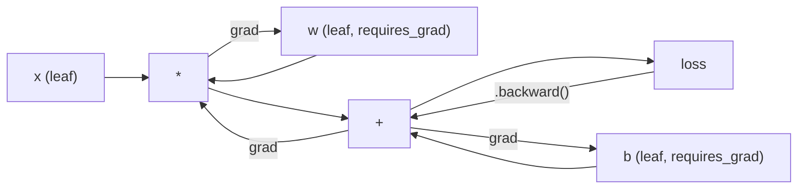
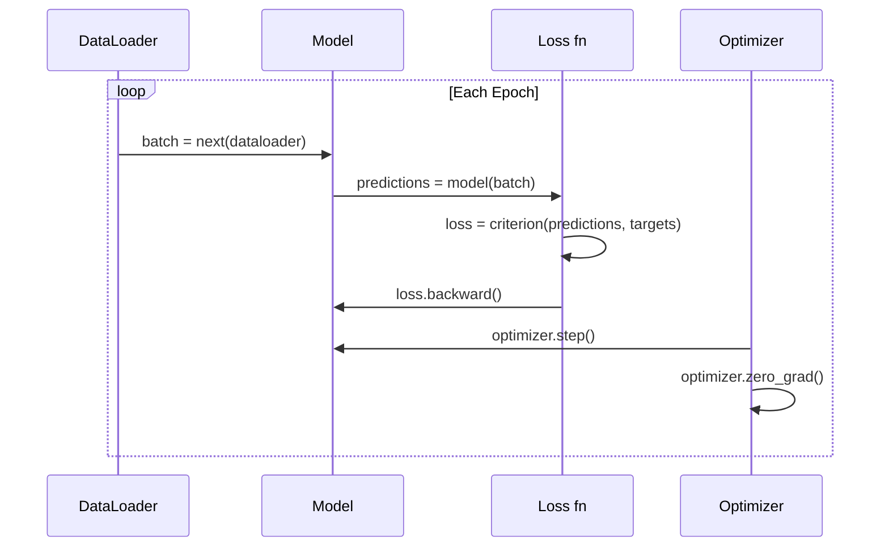

# بيتورش دخول

> لقد صنعت المحركات من خلال الحمض والحركات

**Type:** Build
**Languages:** Python
**Prerequisites:** Lesson 03.10 (Build Your Own Mini Framework)
**Time:** ~75 minutes

## 學习目标
- استخدام PyTorch  nn.Module、nn.Sequential 和 autograd 构建并训练 شبكة عصبية
- استخدام PyTorch Tensor、GPU 加速، فضلا عن دورة تدريبية قياسية ((معدل صفر ٬القدمة٬الخسارة٬الراجعية٬الخطوة)
- تحويل ميكرو إطار صغير من الصفر إلى متكافئ PyTorch
- في نفس المهمة الملف الشخصي ومقارنة إطار Python الخاص بك مع درجة تدريب PyTorch

## 问题
لديك بالفعل إطار صغير يمكن العمل عليه. ستعمل على تدريب شبكة 4 طبقات على استخدام Python في مجال التصنيف الدائري.

ولكن في نفس المشكلة، فإنه أيضاً أبطأ 500 مرة من بيتورش

سيتم استخدام نظامك الصغير باستخدام نظام Python 循环 مرة واحدة في معالجة نموذج واحد. سيتم تقسيم عملية PythonTorch نفسها إلى أجزاء من أوراق C ++ / CUDA المتحسنة ، ويتم تشغيلها على GPU. في بلوك واحد من NVIDIA A100 ، سيتم تدريب PythonTorch على نظام ResNet-50 ((25.6M) معالجة ImageNet ((1.28M الصور) ، يستغرق حوالي 6 ساعات.

速度 ليس الفرق الوحيد. 您的框架 没有 GPU 支持. 没有自动区分. 您为每一个模块写回来了. 没有序列化. 没有分布式训练. 没有混合精度. 除了打印 语句, 没有方法调整渐进流.

لقد تمت معايير PyTorch جميع هذه الثغرات. ويحتفظ بها نفس النموذج الذهني الذي قمت بإنشائه: الوحدة                                                                                                                                                                                                                                            

## 概念
### لماذا فاز بيتورش

2015،TensorFlow  مطلوبك في أي محتوى قبل أن تحدد رسم بياني محاسباتي ثابتة.

في عام 2017 ، تم إصدار PyTorch ، واستعمال مختلف الأفكار: التنفيذ السعدي.`y = model(x)`会真的立刻计算 y، بدلاً من 给稍后才会计算 y 的图表 添加一个节点──这意味着标准Python调试工具都能工作──打印() 能工作──pdb 能工作──前进通过 里 if/else 能工作──

بحلول عام 2020 ، أعطى السوق الإجابة. تمتثل نسبة PyTorch في أوراق البحث في ML من 7% ((2017) إلى أكثر من 75% ((2022))). ميتا،، جوجل ديبميند、OpenAI、 أنثروپيك و Hugging Face كانوا يستخدمون PyTorch كإطار رئيسي.

هذا الجزء من الدورة: تجربة المطور سوف ترتفع مرة أخرى. 10% بطيئة، ولكن إصلاح إطار 快 50%، كل مرة سوف تفوز.

### الجهاز

الجهاز هو مجموعة متعددة الأبعاد، ولها ثلاثة خصائص رئيسية:شكل، نوع، وجهاز.

```python
import torch

x = torch.zeros(3, 4)           # shape: (3, 4), dtype: float32, device: cpu
x = torch.randn(2, 3, 224, 224) # batch of 2 RGB images, 224x224
x = torch.tensor([1, 2, 3])     # from a Python list
```

**Shape**表示维度──scalar 的形 是 (),Vector 是 (n,),Matrix 是 (m, n),一批图像 是 (批量,道,高度,宽)──

**Dtype**التحكم في الوقائع والذاكرة

| dtype | Bits | Range | Use case |
|-------|------|-------|----------|
| float32 | 32 | ~7 位十进制数字 | 默认训练 |
| float16 | 16 | ~3.3 位十进制数字 | Mixed precision |
| bfloat16 | 16 | 与 float32 相同的范围，精度更低 | LLM 训练 |
| int8 | 8 | -128 到 127 | Quantized inference |

**Device**قرر حساب ما يحدث في أي مكان

```python
device = torch.device("cuda" if torch.cuda.is_available() else "cpu")
x = torch.randn(3, 4, device=device)
x = x.to("cuda")
x = x.cpu()
```

كل عملية تتطلب كل الجهاز على نفس الجهاز. هذا هو خطأ PyTorch الأكثر شيوعاً لدى المبتدئين:`RuntimeError: Expected all tensors to be on the same device` طريقة إصلاح هي الحساب قبل نقل كل المحتوى إلى جهاز واحد

**Reshaping**هو عملية الوقت المعتاد  يتغير البيانات المعدنية وليس البيانات 

```python
x = torch.randn(2, 3, 4)
x.view(2, 12)      # reshape to (2, 12) -- must be contiguous
x.reshape(6, 4)    # reshape to (6, 4) -- works always
x.permute(2, 0, 1) # reorder dimensions
x.unsqueeze(0)     # add dimension: (1, 2, 3, 4)
x.squeeze()        # remove size-1 dimensions
```

### أوتوجراد

يطلب منك كل وحدة تنفيذها للخلف. (بيتورش لا تحتاج إلى ذلك. فإنه يضع كل عملية من Tensor فوق سجل إلى رسمية محاسبية محولة، ثم يعود إلى الوراء عبر هذا الرسم البياني، وتحسب تلقائيا درجة.



مع إطارك  Key Difference:PyTorch استخدام الشريط على أساس التشغيل الذاتي  كل عملية都会在前进传递 期间添加到一条上调用 `.backward()`سأعود إلى إعادة وضع هذه الشريطة

```python
x = torch.randn(3, requires_grad=True)
y = x ** 2 + 3 * x
z = y.sum()
z.backward()
print(x.grad)  # dz/dx = 2x + 3
```

أوتوجراد 的三条规则:

1. فقط مع`requires_grad=True`أوراق التنمر 会累积 Gradient
2. التدريجية 默认会累积 كل مرة للخلف`optimizer.zero_grad()`
3. `torch.no_grad()`会禁用 تتبع التدريجية (استخدام خلال التقييم)

### nn.مودول

`nn.Module`هو كل قسم من عناصر شبكة عصبية في PyTorch. لقد قمت ببناء هذا الاختبار في الدروس 10. إصدار PyTorch أدرج تسجيل المعلمات التلقائية، اكتشاف وحدات التكرار، إدارة الأجهزة، وتسلسل الحالة.

```python
import torch.nn as nn

class MLP(nn.Module):
    def __init__(self, input_dim, hidden_dim, output_dim):
        super().__init__()
        self.layer1 = nn.Linear(input_dim, hidden_dim)
        self.relu = nn.ReLU()
        self.layer2 = nn.Linear(hidden_dim, output_dim)

    def forward(self, x):
        x = self.layer1(x)
        x = self.relu(x)
        x = self.layer2(x)
        return x
```

عندما كنت`__init__`في وسط واحد`nn.Module`أو`nn.Parameter`عندما تم إعطاء قيمة لهذا الصف ، سيتم تسجيله تلقائياً`model.parameters()`سوف نعود إلى جمع كل مبرمج مسجل. لهذا السبب لا تحتاج إلى جمع الأوزان بشكل يدوي مثل في الإطار الصغير.

أساسيات البناء:

| Module | What it does | Parameters |
|--------|-------------|------------|
| nn.Linear(in, out) | Wx + b | in*out + out |
| nn.Conv2d(in_ch, out_ch, k) | 2D convolution | in_ch*out_ch*k*k + out_ch |
| nn.BatchNorm1d(features) | Normalize activations | 2 * features |
| nn.Dropout(p) | Random zeroing | 0 |
| nn.ReLU() | max(0, x) | 0 |
| nn.GELU() | Gaussian error linear | 0 |
| nn.Embedding(vocab, dim) | Lookup table | vocab * dim |
| nn.LayerNorm(dim) | Per-sample normalization | 2 * dim |

### وظائف الخسارة مع المحفزات

(بيتورش) تصميم جاهز للإنتاج من كلّ محتوى قمت بإنشائه

**Loss functions**(من`torch.nn`):

| Loss | Task | Input |
|------|------|-------|
| nn.MSELoss() | Regression | 任意 shape |
| nn.CrossEntropyLoss() | Multi-class classification | Logits（不是 softmax） |
| nn.BCEWithLogitsLoss() | Binary classification | Logits（不是 sigmoid） |
| nn.L1Loss() | Regression（robust） | 任意 shape |
| nn.CTCLoss() | Sequence alignment | Log probabilities |

انتباه:`CrossEntropyLoss`内部组合了 `LogSoftmax`+ `NLLLoss`传入原始logits,而不是 softmax output──这是一个常见错误,会产生错误 Gradient──

**Optimizers**(من`torch.optim`):

| Optimizer | When to use | Typical LR |
|-----------|-------------|-----------|
| SGD(params, lr, momentum) | CNNs、调优良好的 pipelines | 0.01--0.1 |
| Adam(params, lr) | 默认起点 | 1e-3 |
| AdamW(params, lr, weight_decay) | Transformers、fine-tuning | 1e-4--1e-3 |
| LBFGS(params) | Small-scale、second-order | 1.0 |

### حلقة التدريب

كل دورة تدريبية بيتورش تتبع نفس النمط الخمس خطوات.



规范模式:

```python
for epoch in range(num_epochs):
    model.train()
    for inputs, targets in train_loader:
        inputs, targets = inputs.to(device), targets.to(device)
        optimizer.zero_grad()
        outputs = model(inputs)
        loss = criterion(outputs, targets)
        loss.backward()
        optimizer.step()
```

حلقة البطاقة 内部五行── تدريب GPT-4、Stable Diffusion 和 LLaMA 的也是这五行──架构会变──数据会变──这五行不会变──

### مجموعة البيانات و DataLoader

بيتورش `Dataset`هي فئة تجريدية ذات طريقتين:`__len__`和 `__getitem__`.`DataLoader`في ذلك تغطية الحزمة والتدفق و تحميل البيانات متعددة العمليات

```python
from torch.utils.data import Dataset, DataLoader

class MNISTDataset(Dataset):
    def __init__(self, images, labels):
        self.images = images
        self.labels = labels

    def __len__(self):
        return len(self.labels)

    def __getitem__(self, idx):
        return self.images[idx], self.labels[idx]

loader = DataLoader(dataset, batch_size=64, shuffle=True, num_workers=4)
```

`num_workers=4`سوف يبدأ 4 عمليات ومسيرات تحميل البيانات، في الوقت نفسه GPU  تدريب المجموعة الحالية.

### تدريبات الجيبو

ضع النموذج على GPU:

```python
device = torch.device("cuda" if torch.cuda.is_available() else "cpu")
model = model.to(device)
```

هذا سوف يعود إلى الموقع و يُحرك كل معايير و عازف إلى GPU... ثم يُحرك كل مجموعة خلال التدريب:

```python
inputs, targets = inputs.to(device), targets.to(device)
```

**Mixed precision**会在现代 GPU(A100、H100、RTX 4090) 上把内存使用减半、吞吐量翻倍:前后使用 float16 运行,同时的主权保持在 float32:

```python
from torch.amp import autocast, GradScaler

scaler = GradScaler()
for inputs, targets in loader:
    with autocast(device_type="cuda"):
        outputs = model(inputs)
        loss = criterion(outputs, targets)
    scaler.scale(loss).backward()
    scaler.step(optimizer)
    scaler.update()
    optimizer.zero_grad()
```

### 对比:Mini Framework vs PyTorch vs JAX

| Feature | Mini Framework (L10) | PyTorch | JAX |
|---------|---------------------|---------|-----|
| Autodiff | Manual backward() | Tape-based autograd | Functional transforms |
| Execution | Eager（Python loops） | Eager（C++ kernels） | Traced + JIT compiled |
| GPU support | 无 | 有（CUDA、ROCm、MPS） | 有（CUDA、TPU） |
| Speed (MNIST MLP) | ~300s/epoch | ~0.5s/epoch | ~0.3s/epoch |
| Module system | Custom Module class | nn.Module | Stateless functions（Flax/Equinox） |
| Debugging | print() | print()、pdb、breakpoint() | 更难（JIT tracing 会破坏 print） |
| Ecosystem | 无 | Hugging Face、Lightning、timm | Flax、Optax、Orbax |
| Learning curve | 你已经构建过它 | 中等 | 陡峭（functional paradigm） |
| Production use | Toy problems | Meta、OpenAI、Anthropic、HF | Google DeepMind、Midjourney |


```figure
dropout-mask
```

## بناءها
واحد فقط استخدام البدائيات PyTorch في MNIST التدريب على 3 طبقات MLP.`torchvision.datasets`نحن ننزل ونحلل البيانات الخامة

### الخطوة 1: من الملف الأصلي

MNIST 以 4 个 gzipped 发布: training images(60,000 x 28 x 28) ‬تسميات التدريب ‬تسميات الاختبار‬10,000 x 28 x 28) ‬تسميات الاختبار‬‬‬‬‬‬‬‬‬‬‬‬‬‬‬‬‬‬‬‬‬‬‬‬‬‬‬‬‬‬‬‬‬‬‬‬‬‬‬‬‬‬‬‬‬‬‬‬‬‬‬‬‬‬‬‬‬‬‬‬‬‬‬‬‬‬‬‬‬‬‬‬‬‬‬‬‬‬‬‬‬‬‬‬‬‬‬‬‬‬‬‬‬‬‬‬‬‬‬‬‬‬‬‬‬‬‬‬‬‬‬‬‬‬‬‬‬‬‬‬‬‬‬‬‬‬‬‬‬‬‬‬‬‬‬‬‬‬‬‬‬‬‬‬‬‬‬‬‬‬‬‬‬‬‬‬‬‬‬‬‬‬‬‬‬‬‬‬‬‬‬‬‬‬‬‬‬‬‬‬‬‬‬‬‬‬‬‬‬‬‬‬‬‬‬‬‬‬‬‬‬‬‬‬‬‬‬‬‬‬‬‬‬‬‬‬‬‬‬‬‬‬‬‬‬‬‬‬‬‬‬‬‬‬‬‬‬‬‬‬‬‬‬‬‬‬‬‬‬‬‬‬‬‬‬‬‬‬‬‬‬‬‬‬‬‬‬‬‬‬‬‬‬‬‬‬‬‬‬‬‬‬‬‬‬‬‬‬‬‬‬‬‬‬‬‬‬‬‬‬‬‬‬‬‬‬‬‬‬‬‬‬‬‬‬‬‬‬‬‬‬‬‬‬‬‬‬‬‬‬‬‬‬‬‬‬‬‬‬‬‬‬‬‬‬‬‬‬‬‬‬‬‬‬‬‬‬‬‬‬‬‬‬‬‬‬‬‬‬‬‬‬‬‬‬‬‬‬‬‬‬‬‬‬‬‬‬‬‬‬‬‬‬‬‬‬‬‬‬‬‬‬‬‬‬‬‬‬‬‬‬‬‬‬‬‬‬‬‬‬‬‬‬‬‬‬‬‬‬‬‬‬‬‬‬‬‬‬‬‬‬‬‬‬‬‬‬‬‬‬‬‬‬‬‬‬‬‬

```python
import torch
import torch.nn as nn
import struct
import gzip
import urllib.request
import os

def download_mnist(path="./mnist_data"):
    base_url = "https://storage.googleapis.com/cvdf-datasets/mnist/"
    files = [
        "train-images-idx3-ubyte.gz",
        "train-labels-idx1-ubyte.gz",
        "t10k-images-idx3-ubyte.gz",
        "t10k-labels-idx1-ubyte.gz",
    ]
    os.makedirs(path, exist_ok=True)
    for f in files:
        filepath = os.path.join(path, f)
        if not os.path.exists(filepath):
            urllib.request.urlretrieve(base_url + f, filepath)

def load_images(filepath):
    with gzip.open(filepath, "rb") as f:
        magic, num, rows, cols = struct.unpack(">IIII", f.read(16))
        data = f.read()
        images = torch.frombuffer(bytearray(data), dtype=torch.uint8)
        images = images.reshape(num, rows * cols).float() / 255.0
    return images

def load_labels(filepath):
    with gzip.open(filepath, "rb") as f:
        magic, num = struct.unpack(">II", f.read(8))
        data = f.read()
        labels = torch.frombuffer(bytearray(data), dtype=torch.uint8).long()
    return labels
```

### الخطوة 2: تحديد النموذج

واحد 3 طبقات MLP:784 -> 256 -> 128 -> 10。 تفعيلات RELU。 مع التوقف عن العمل القيام بتنظيمها。 للحفاظ على البساطة، لا تستخدم قاعدة البطاقة。

```python
class MNISTModel(nn.Module):
    def __init__(self):
        super().__init__()
        self.net = nn.Sequential(
            nn.Linear(784, 256),
            nn.ReLU(),
            nn.Dropout(0.2),
            nn.Linear(256, 128),
            nn.ReLU(),
            nn.Dropout(0.2),
            nn.Linear(128, 10),
        )

    def forward(self, x):
        return self.net(x)
```

الطبقة الخروج 产生 10 个 خام logits( كل رقم واحد)。不使用softmax`CrossEntropyLoss`سوف يتم معالجته داخلياً

عدد المعايير:784*256 + 256 + 256*128 + 128 + 128*10 + 10 = 235,146。 على المعايير الحديثة على نظرة صغيرة جدا ً♦ GPT-2 صغيرة هناك 124M♦ هذا النموذج في غضون بضع ثوان على إكمال التدريب♦

### الخطوة الثالثة: حلقة التدريب

规范的前进损失 后退步骤模式

```python
def train_one_epoch(model, loader, criterion, optimizer, device):
    model.train()
    total_loss = 0
    correct = 0
    total = 0
    for images, labels in loader:
        images, labels = images.to(device), labels.to(device)
        optimizer.zero_grad()
        outputs = model(images)
        loss = criterion(outputs, labels)
        loss.backward()
        optimizer.step()
        total_loss += loss.item() * images.size(0)
        _, predicted = outputs.max(1)
        correct += predicted.eq(labels).sum().item()
        total += labels.size(0)
    return total_loss / total, correct / total


def evaluate(model, loader, criterion, device):
    model.eval()
    total_loss = 0
    correct = 0
    total = 0
    with torch.no_grad():
        for images, labels in loader:
            images, labels = images.to(device), labels.to(device)
            outputs = model(images)
            loss = criterion(outputs, labels)
            total_loss += loss.item() * images.size(0)
            _, predicted = outputs.max(1)
            correct += predicted.eq(labels).sum().item()
            total += labels.size(0)
    return total_loss / total, correct / total
```

انتباه للتقييم`torch.no_grad()` سوف يمنع التطوير الذاتي، و يقلل من استخدام الـ内存 و يسرع الاستنتاجات.

### الخطوة 4: قم بتوصيل جميع الأجزاء

```python
def main():
    device = torch.device("cuda" if torch.cuda.is_available() else "cpu")

    download_mnist()
    train_images = load_images("./mnist_data/train-images-idx3-ubyte.gz")
    train_labels = load_labels("./mnist_data/train-labels-idx1-ubyte.gz")
    test_images = load_images("./mnist_data/t10k-images-idx3-ubyte.gz")
    test_labels = load_labels("./mnist_data/t10k-labels-idx1-ubyte.gz")

    train_dataset = torch.utils.data.TensorDataset(train_images, train_labels)
    test_dataset = torch.utils.data.TensorDataset(test_images, test_labels)
    train_loader = torch.utils.data.DataLoader(
        train_dataset, batch_size=64, shuffle=True
    )
    test_loader = torch.utils.data.DataLoader(
        test_dataset, batch_size=256, shuffle=False
    )

    model = MNISTModel().to(device)
    criterion = nn.CrossEntropyLoss()
    optimizer = torch.optim.Adam(model.parameters(), lr=1e-3)

    num_params = sum(p.numel() for p in model.parameters())
    print(f"Device: {device}")
    print(f"Parameters: {num_params:,}")
    print(f"Train samples: {len(train_dataset):,}")
    print(f"Test samples: {len(test_dataset):,}")
    print()

    for epoch in range(10):
        train_loss, train_acc = train_one_epoch(
            model, train_loader, criterion, optimizer, device
        )
        test_loss, test_acc = evaluate(
            model, test_loader, criterion, device
        )
        print(
            f"Epoch {epoch+1:2d} | "
            f"Train Loss: {train_loss:.4f} | Train Acc: {train_acc:.4f} | "
            f"Test Loss: {test_loss:.4f} | Test Acc: {test_acc:.4f}"
        )

    torch.save(model.state_dict(), "mnist_mlp.pt")
    print(f"\nModel saved to mnist_mlp.pt")
    print(f"Final test accuracy: {test_acc:.4f}")
```

10 个时代 后的预期输出:~97.8% دقة الاختبار──CPU 上训练时间:~30 秒──GPU 上:~5 秒──使用相同架构的你的迷你框架:~45 分钟──

## استخدمها
### 快速对比: ميني إطار مقابل بيتورش

| Mini Framework (Lesson 10) | PyTorch |
|---------------------------|---------|
| `model = Sequential(Linear(784, 256), ReLU(), ...)` | `model = nn.Sequential(nn.Linear(784, 256), nn.ReLU(), ...)` |
| `pred = model.forward(x)` | `pred = model(x)` |
| `optimizer.zero_grad()` | `optimizer.zero_grad()` |
| `grad = criterion.backward()` then `model.backward(grad)` | `loss.backward()` |
| `optimizer.step()` | `optimizer.step()` |
| 无 GPU | `model.to("cuda")` |
| 每个 module 都要手写 backward | Autograd 处理所有内容 |

التواصل هو تقريبا نفسها.

### نموذجات حفظ وتحميل

```python
torch.save(model.state_dict(), "model.pt")

model = MNISTModel()
model.load_state_dict(torch.load("model.pt", weights_only=True))
model.eval()
```

始终保存 `state_dict()`(معجم المعلمات) ، بدلا من كائن نموذج.

### تخطيط معدلات التعلم

```python
scheduler = torch.optim.lr_scheduler.CosineAnnealingLR(
    optimizer, T_max=10
)
for epoch in range(10):
    train_one_epoch(model, train_loader, criterion, optimizer, device)
    scheduler.step()
```

PyTorch 自带15+ جداول:StepLR、ExponentialLR、CosineAnnealingLR、OneCycleLR、ReduceLROnPlateau──它们都能连接到一个优化界面──

## 交付 it
本课会产 اثنين من القطع الأثرية:

- `outputs/prompt-pytorch-debugger.md` للمستخدمين في التشخيص عادة PyTorch  التدريب الفشل
- `outputs/skill-pytorch-patterns.md`توصيل مهارات نظام التدريب

## التدريب
1. **添加 batch normalization。**في كل طبقة خطية بعد تشغيل قبل)插入 `nn.BatchNorm1d` مقارنة دقة الاختبار وسرعة التدريب، مع إصدارات الإقلاع عن التدريب فقط.

2. **实现 learning rate finder。**استخدام مؤشر ارتفاع معدل التعلم ((من 1e-7 إلى 1.0) تدريب عصرها‬‬‬‬‬‬‬‬‬‬‬‬‬‬‬‬‬‬‬‬‬‬‬‬‬‬‬‬‬‬‬‬‬‬‬‬‬‬‬‬‬‬‬‬‬‬‬‬‬‬‬‬‬‬‬‬‬‬‬‬‬‬‬‬‬‬‬‬‬‬‬‬‬‬‬‬‬‬‬‬‬‬‬‬‬‬‬‬‬‬‬‬‬‬‬‬‬‬‬‬‬‬‬‬‬‬‬‬‬‬‬‬‬‬‬‬‬‬‬‬‬‬‬‬‬‬‬‬‬‬‬‬‬‬‬‬‬‬‬‬‬‬‬‬‬‬‬‬‬‬‬‬‬‬‬‬‬‬‬‬‬‬‬‬‬‬‬‬‬‬‬‬‬‬‬‬‬‬‬‬‬‬‬‬‬‬‬‬‬‬‬‬‬‬‬‬‬‬‬‬‬‬‬‬‬‬‬‬‬‬‬‬‬‬‬‬‬‬‬‬‬‬‬‬‬‬‬‬‬‬‬‬‬‬‬‬‬‬‬‬‬‬‬‬‬‬‬‬‬‬‬‬‬‬‬‬‬‬‬‬‬‬‬‬‬‬‬‬‬‬‬‬‬‬‬‬‬‬‬‬‬‬‬‬‬‬‬‬‬‬‬‬‬‬‬‬‬‬‬‬‬‬‬‬‬‬‬‬‬‬‬‬‬‬‬‬‬‬‬‬‬‬‬‬‬‬‬‬‬‬‬‬‬‬‬‬‬‬‬‬‬‬‬‬‬‬‬‬‬‬‬‬‬‬‬‬‬‬‬‬‬‬‬‬‬‬‬‬‬‬‬‬‬‬‬‬‬‬‬‬‬‬‬‬‬‬‬‬‬‬‬‬‬‬‬‬‬‬‬‬‬‬‬‬‬‬‬‬‬‬‬‬‬‬‬‬‬‬‬‬‬‬‬‬‬‬‬‬‬‬‬‬‬‬‬‬‬‬‬‬‬‬‬‬‬‬‬‬‬‬‬‬‬‬‬‬‬‬‬‬‬‬‬‬‬‬‬‬‬‬‬‬‬‬‬‬‬‬‬‬‬‬‬‬‬‬‬‬‬

3. **迁移到 GPU 并使用 mixed precision。**في حلقة التدريب`torch.amp.autocast`和 `GradScaler` في GPU 上测量使用和不使用混合精度 时的吞吐量(نموذج/ثانية)  في A100 上,预期约2x speedup。

4. **构建 custom Dataset。**Download الموضة-MNIST `__getitem__`和 `__len__``FashionMNISTDataset(Dataset)`المادة: المادة: المادة: المادة: المادة: المادة: المادة: المادة: المادة: المادة: المادة: المادة: المادة: المادة: المادة: المادة: المادة: المادة: المادة: المادة: المادة: المادة: المادة: المادة: المادة: المادة: المادة: المادة: المادة: المادة: المادة: المادة: المادة: المادة: المادة: المادة: المادة: المادة: المادة: المادة: المادة: المادة: المادة: المادة: المادة: المادة: المادة: المادة: المادة: المادة: المادة: المادة: المادة: المادة: المادة: المادة: المادة: المادة: المادة: المادة: المادة: المادة: المادة: المادة: المادة: المادة: المادة: المادة: المادة: المادة: المادة: المادة: المادة: المادة: المادة: المادة: المادة: المادة: المادة: المادة: المادة: المادة: المادة: المادة: المادة: المادة: المادة: المادة: المادة: المادة: المادة: المادة: المادة: المادة: المادة: المادة: المادة: المادة: المادة: المادة: المادة: المادة: المادة: المادة: المادة: المادة: المادة: المادة: المادة: المادة: المادة: المادة: المادة: المادة: المادة: المادة: المادة: المادة: المادة: المادة: المادة:

5. **用 SGD + momentum 替换 Adam。**استخدام `SGD(params, lr=0.01, momentum=0.9)`訓練── مقارنة منحنى التقارب── ثم加入 `CosineAnnealingLR`المجدول، انظر انظر إن كان SGD قادر على التحقق من آدم

## 关键术语
| Term | What people say | What it actually means |
|------|----------------|----------------------|
| Tensor | “一个多维数组” | 一个有类型、device-aware 的数组，每个操作都内置 automatic differentiation 支持 |
| Autograd | “Automatic backprop” | 一个 tape-based 系统，在 forward pass 期间记录操作，然后反向重放它们以计算精确 Gradient |
| nn.Module | “一个 layer” | 任意 differentiable computation block 的基类——注册 parameters、支持 nesting、处理 train/eval modes |
| state_dict | “model weights” | 一个把 parameter names 映射到 Tensor 的 OrderedDict——trained model 的可移植、可序列化表示 |
| .backward() | “计算 Gradient” | 反向遍历 computational graph，为每个带有 requires_grad=True 的 leaf Tensor 计算并累积 Gradient |
| .to(device) | “移动到 GPU” | 递归地把所有 parameters 和 buffers 转移到指定 device（CPU、CUDA、MPS） |
| DataLoader | “data pipeline” | 一个 iterator，会对来自 Dataset 的数据执行 batching、shuffling，并可选地并行化 data loading |
| Mixed precision | “使用 float16” | 使用 float16 forward/backward 提升速度，同时保留 float32 master weights 以保证 numerical stability |
| Eager execution | “立即运行” | 操作在被调用时立即执行，而不是推迟到之后的 compilation step——这是区分 PyTorch 与 TF 1.x 的核心设计选择 |
| zero_grad | “重置 Gradient” | 在下一次 backward pass 前把所有 parameter gradients 置零，因为 PyTorch 默认会累积 Gradient |

## 延伸阅读
- پاسكيه وزملاء، بايتورش: أسلوب إمبراطي، مكتبة التعلم العميق عالي الأداء (2019)  شرح بايتورش 设计权衡的原始论文
- دروس بيتورش: تعلم بيتورش مع أمثلة (https://pytorch.org/tutorials/beginner/pytorch_with_examples.html) من Tensor إلى nn.Module
- دليل تحديد أداء PyTorch (https://pytorch.org/tutorials/recipes/recipes/tuning_guide.html)مختلطة الدقة موظفين DataLoader ‬الذاكرة المضخمة وآخر تحسينات الإنتاج
- هوراس هيه، جعل التعلم العميق يذهب إلى Brrrrhttps://horace.io/brrr_intro.html) لماذا تدريب GPU 很快، وكذلك استراتيجيات تحسينات خاصة بيتورش
